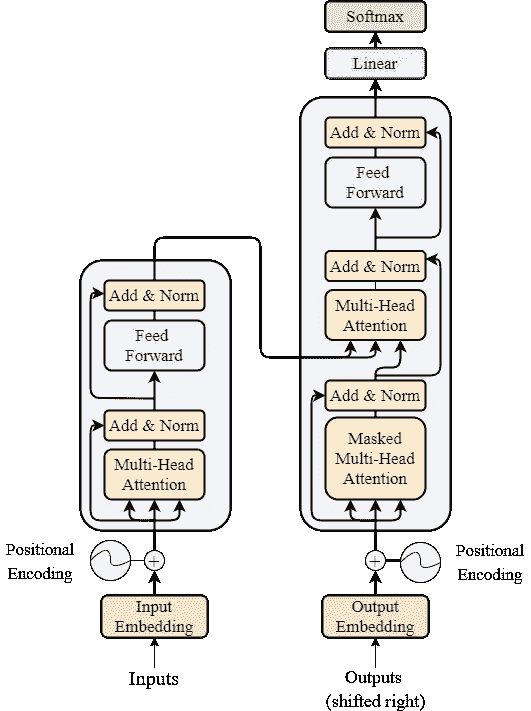
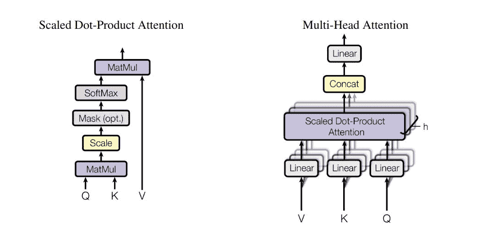
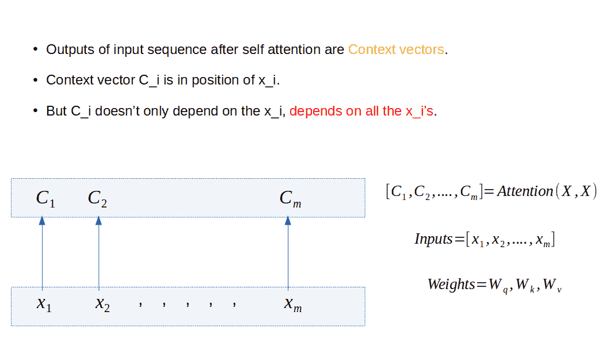
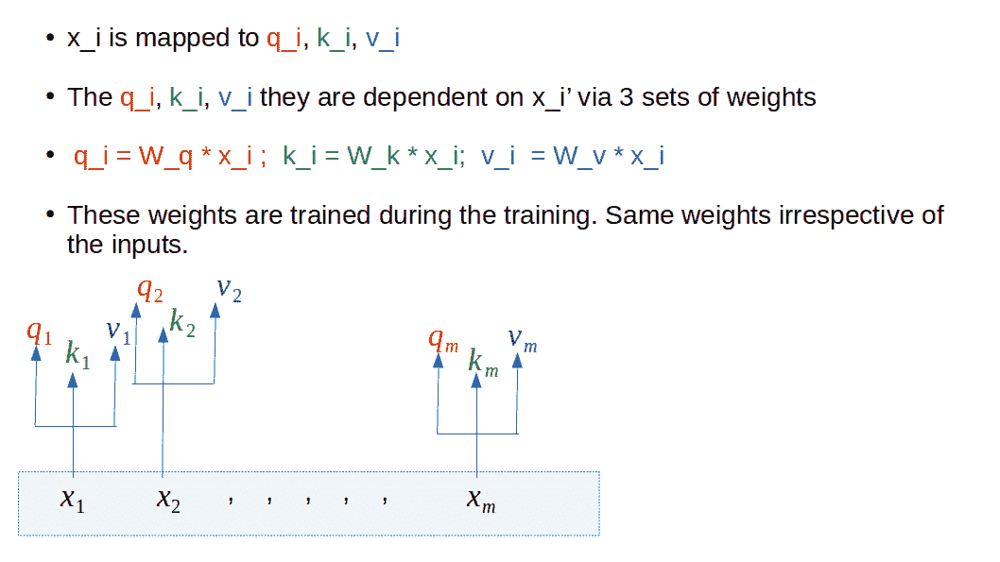
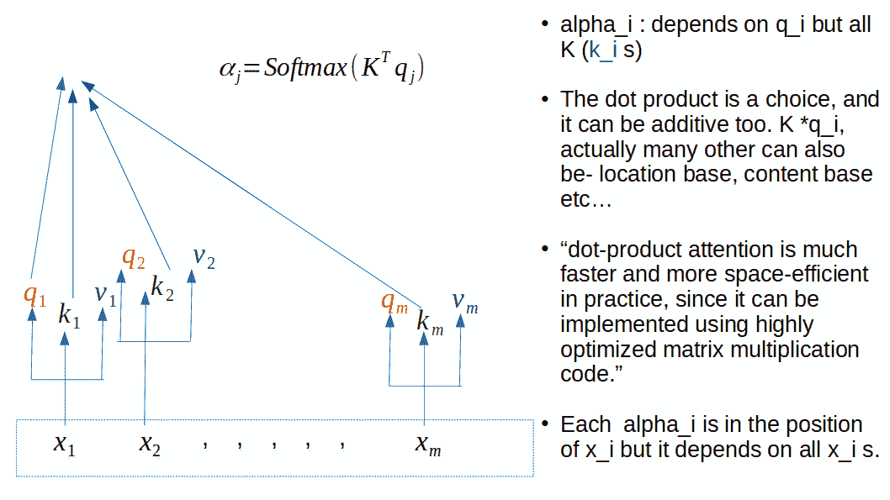
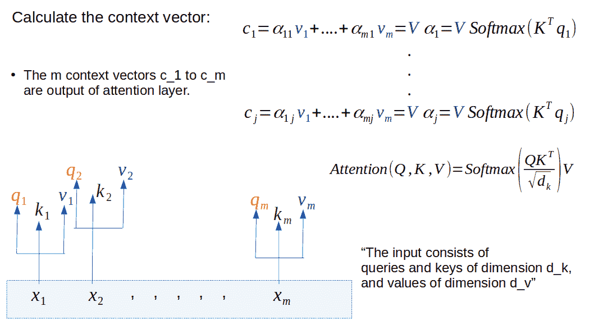
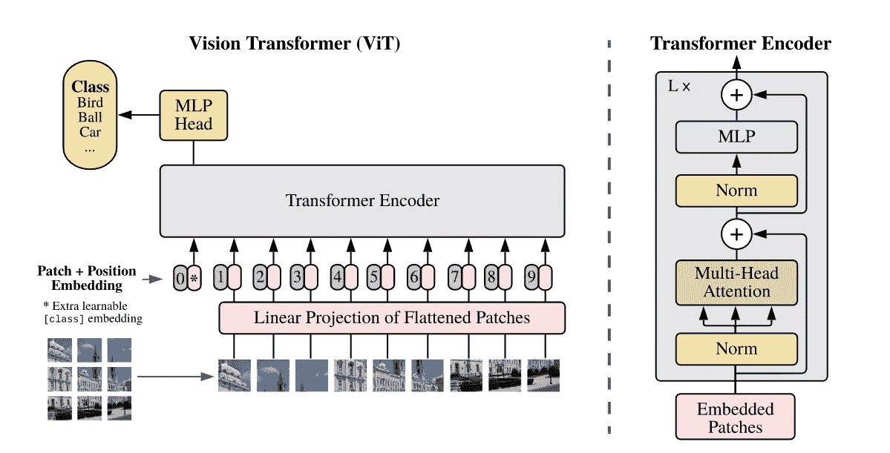
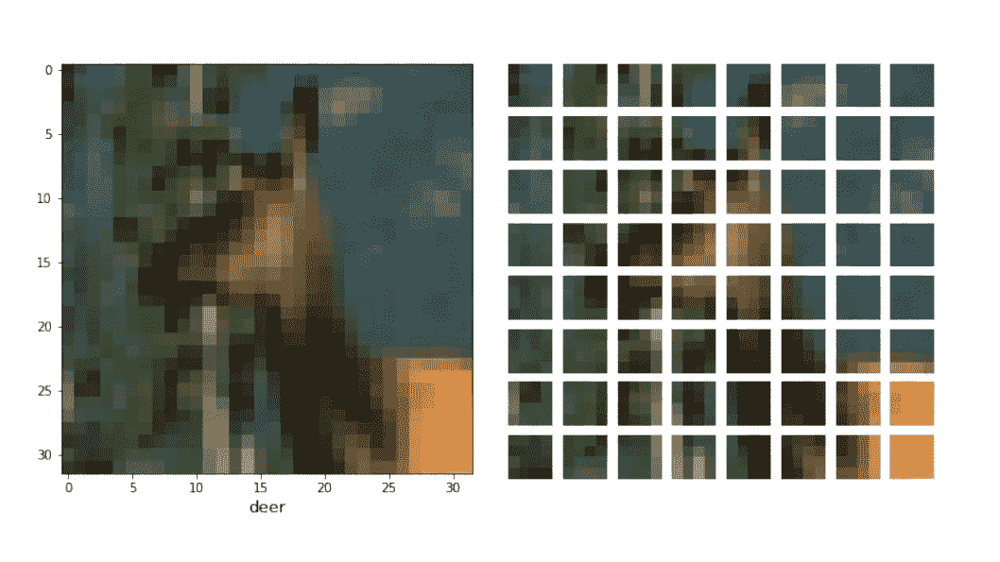
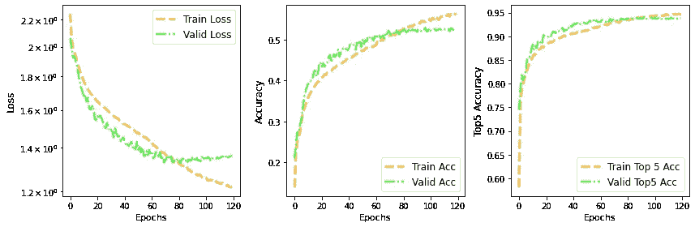
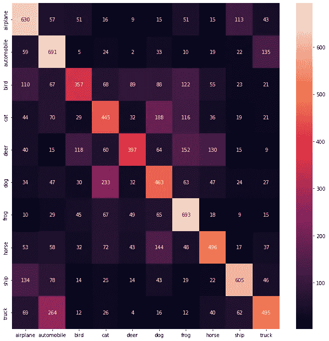

# 理解并使用 TensorFlow 2.0 实现 Vision Transformer

> 原文：<https://towardsdatascience.com/understand-and-implement-vision-transformer-with-tensorflow-2-0-f5435769093>

## 自我关注机制和再见卷积！


将图像分成小块，体验魔法(来源:作者)

当 Transformer Network 问世时，它最初成为 NLP 任务的首选模型。Alex Dosovitskiy 等人在 2021 年 ICLR 表征学习国际会议上提出的“一幅图像相当于 16X16 个单词”首次展示了 Transformer 如何实现计算机视觉任务，并在图像分类任务中胜过 CNN(例如 ResNet)。这篇文章是使用 TensorFlow 2.0 一步一步实现 Vision Transformer (ViT)的深入探讨。你可以从这篇文章中学到什么—

1.  自我注意机制详解。
2.  ViT 结构解释清楚。
3.  用 TensorFlow 2.0 从头实现 ViT。
4.  ViT 在 CIFAR-10 分类中的应用示例。
5.  ViT 的不同实现和细微差别。

这篇文章将会很长，我也期望这篇文章将会是最初的 ViT 论文的最佳伴侣，以便理解和实现代码中的研究思想。这里使用的所有代码/图片都可以在我的 GitHub 中找到。所以请坐好，拿起你的咖啡，我们准备好出发了！

**免责声明:我想花点时间描述一下注意力机制，因为为了实现 ViT，我将使用**[**Keras multi head attention layer**](https://www.tensorflow.org/api_docs/python/tf/keras/layers/MultiHeadAttention)**。所以那里发生的事情值得了解。如果您想直接进入 ViT 实现，请跳到第 2 节。**

## 1.变压器和注意:

为了理解视觉转换器，首先我们需要关注转换器和注意力机制的基础知识。对于这一部分，我将遵循论文 [**注意是你所需要的**](https://arxiv.org/pdf/1706.03762.pdf) 。这篇文章本身是一篇很好的阅读材料，下面的描述/概念大部分来自于此&清楚地理解它们，只会帮助我们更进一步。

《变形金刚》的理念是使用注意力而不重复出现(读 RNN)。因此，transformer 仍然是序列到序列(Seq2Seq)模型，并遵循编码器-解码器结构。引用报纸上的话—

> *编码器将符号表示(x1，…，xn)的输入序列映射到连续表示 z=(z1，…，zn)的序列。给定 z，解码器然后一次一个元素地生成符号的输出序列(y1，…，ym)。在每一步，模型都是自回归的，在生成下一步时，消耗先前生成的符号作为附加输入。*

让我们看看论文中介绍的变压器结构—



图 1:变压器架构(来源:[注意力是你所需要的全部](https://arxiv.org/pdf/1706.03762.pdf)，作者:A. Vaswani 等人)

一旦我们理解了上述结构的编码器部分，我们就可以转向视觉转换器了。编码器层包含两个非常重要的组件，

*   多头自我关注块。
*   位置式全连接前馈网络。

下面重点说多头自我关注部分。论文本身有一个缩放的点积注意和多头注意的图表，它由几个平行运行的注意层组成。



图 2:多头注意力(来源:[注意力是你所需要的全部](https://arxiv.org/pdf/1706.03762.pdf)，作者:A. Vaswani 等人)

图中的 3 个标签 Q、K、V 表示查询、键和值向量。现在，当我们搜索(查询)时，我们认为这是信息检索协议的一部分，搜索引擎将我们的查询与一个关键字进行比较，并用一个值(输出)进行响应。

在原始论文中，描述了多头注意力的 3 种不同用法。让我们直接从论文中引用-

> 1.在“编码器-解码器注意”层中，*查询*来自前一解码器层，存储器*键*和*值*来自编码器的输出。这允许解码器中的每一个位置关注输入序列中的所有位置。这模仿了序列到序列模型中典型的编码器-解码器注意机制。
> 
> 2.编码器包含自我关注层。在自关注层中，所有的*键*、*值*和*查询*来自同一个地方，在这种情况下，是编码器中前一层的输出。编码器中的每个位置可以关注编码器的前一层中的所有位置。
> 
> 3.类似地，解码器中的自关注层允许解码器中的每个位置关注解码器中的所有位置，直到并包括该位置。

对于我们的目的(理解视觉转换器)，最重要的一点是 2，即编码器部分的自我关注。让我们深潜吧！

## 1.1.自我关注:

为了理解自我关注，图片比文字更有帮助。我将使用幻灯片中的一些图片。

让我们考虑一个输入序列( *x* 1， *x* 2，…， *xm* )。自关注层从该输入序列输出的是一组与输入序列长度相同的上下文向量( *C* 1、 *C* 2、…、 *Cm* )。下面的图片会帮助我们—



图 3:走向注意力(自我)的步骤。将输入序列转化为上下文向量。(来源:作者幻灯片)

在上图中，我们为*查询*、*键*和*值*定义了将被训练为 *Wq* 、 *Wk* 、 *Wv* 的权重。它们实际上是如何使用的？让我们看看下面的图片——



图 4:将在训练期间更新的查询、键和值的权重。(来源:作者幻灯片)。

需要注意的是*所有 I 的权重相同。*在*关注你所需要的一切*纸中，*查询*和*键*的尺寸取为 *d_k* ，对于*值，*取为 *d_v* 。例如，如果我们有*一个 5D x_i* (例如[0 1 1 2 3])，并且*查询*具有维度 3，那么 *Wq* 将具有维度 5×3。同样适用于*键*和*值*和相应的权重。那么我们最终如何计算这些上下文向量呢？让我们看看下面—



图 5:关注点积。使用第 I 个查询对序列中的所有键进行点积。(来源:作者幻灯片)。

正如论文中提到的，点积(K^T ⋅ Q_j)是一种选择，也可以使用其他形式，如加法或乘法注意力。重要的一点是*在计算位置 q_j(与 x_j 相同)处的α_j(见上图)时，我们仅使用来自 q_j 的信息，但使用所有其他键(k_j)。*我们剩下最后一步来计算注意力层的输出，也就是使用下面的*值*



图 6:获得上下文向量(C)作为关注块的输出。(来源:作者幻灯片)

我再次强调:*为了计算位置‘I*’*的上下文向量，我们需要来自所有输入的值。*最后，如何解读缩放点注意函数中的缩放因子(1 */* √ *d_k* )？

通常，我们将初始化我们的层，目的是在整个模型中具有相等的方差。但是，当我们对这两个向量( *Q* ， *K* )执行方差 *σ* 的点积时，这会导致缩放器的方差 *d_k* 倍更高。还要记住 *d_k* 是两个 *Q* 、 *K* 的尺寸，而 *V* 有尺寸 *d_v* 。


正态分布的查询和键。点积后的总方差高 d_k 倍。(来源:作者笔记本)。

如果我们不将方差按比例缩小回 *σ* ，则对于一个随机元素，logits 上的 softmax 将饱和到 1，而对于所有其他元素，则饱和到 0。通过 softmax 的梯度将接近于零，所以我们不能适当地学习参数。

现在，希望你能欣赏文章中介绍的点积注意力图(图 2)。

## 1.2.多头自我关注:

这是单头自我关注的一个非常简单的延伸。

*   在多头自我关注中，我们有 *h* 单头自我关注(层次)。参见上面的图 2。
*   在单头自我关注中，可训练的参数是权重 *Wq* 、 *Wk* 、 *Wv。*
*   *h* 单头自关注层不共享参数。因此总共有 3 个 *h* 参数。
*   每个单头自我关注输出一个上下文向量。
*   这些上下文向量被连接起来。
*   如果单头注意力输出一个维度向量，即每个 *C_i* 是 *d* ×1，那么多头输出是 *hd* ×1 个维度向量，给定单头自我注意力层的 *h* 层。

引用“注意力是你所需要的全部”这篇论文中关于多头注意力的重要性的话—

> *多头注意允许模型在不同位置共同注意来自不同表征子空间的信息。用单一的注意力头，平均化抑制了这一点。*

我们经历了自我注意机制和作为其延伸的多头注意。这是 Vision Transformer (ViT)白皮书中变压器编码器的构建模块，现在我们可以开始研究 ViT 白皮书和实现了。

## 2.视觉转换器:

首先，看看原始论文“一幅图像值 16 X 16 个字”中所示的 ViT 架构



图 7:视觉转换器架构:(来源:[a . Dosovitskiy 等人的一幅图像相当于 16 X 16 个字](https://arxiv.org/abs/2010.11929)。艾尔。)

我们已经讨论了 ViT 的主要组件，即变压器编码器和其中的多头注意力。下一步是从图像生成补丁，并添加位置嵌入。对于这个示例实现，我将使用 CIFAR-10 数据。请注意，本文中提到，vit 是数据密集型架构，即使使用 ImageNet 这样相对较大的数据集，在没有强正则化的情况下，vit 的性能也会比 ResNet 低几个百分点。但是，当变压器在更大的数据集(14M-300M 图像)上训练时，情况会发生变化，因此此处使用的 CIFAR-10 仅用于示例实施，而不是用于与其他网络进行性能比较。

最初的实现在 [google github](https://github.com/google-research/vision_transformer/blob/main/vit_jax/models.py) 中可用，在 [tensorflow models](https://github.com/tensorflow/models/blob/master/official/vision/beta/projects/vit/modeling/vit.py) 中有一个非常相似的版本。下面是维特 Below:

*   拍摄一幅图像(例如:256×256×3)。
*   将图像变成更小的面片(例如:16×16×3，总共 256 ( *N* =256×256/16)个面片)。
*   然后这些补片被线性嵌入。我们现在可以把这些看作代币。
*   将它们用作变压器编码器的输入(包含多头自关注)。
*   执行分类。
*   再见卷积。

让我们从加载数据开始，我将使用`tf.data`格式—

```
import tensorflow as tf
from tensorflow.keras.datasets import cifar10(x_train, y_train), (x_test, y_test) = cifar10.load_data()train_lab_categorical = tf.keras.utils.to_categorical(y_train, num_classes=10, dtype='uint8')test_lab_categorical = tf.keras.utils.to_categorical(y_test, num_classes=10, dtype='uint8')from sklearn.model_selection import train_test_splittrain_im, valid_im, train_lab, valid_lab = train_test_split(x_train, train_lab_categorical, test_size=0.20, stratify=train_lab_categorical, random_state=40, shuffle = True)training_data = tf.data.Dataset.from_tensor_slices((train_im, train_lab))validation_data = tf.data.Dataset.from_tensor_slices((valid_im, valid_lab))test_data = tf.data.Dataset.from_tensor_slices((x_test, 
test_lab_categorical))autotune = tf.data.AUTOTUNEtrain_data_batches = training_data.shuffle(buffer_size=40000).batch(128).prefetch(buffer_size=autotune)valid_data_batches = validation_data.shuffle(buffer_size=10000).batch(32).prefetch(buffer_size=autotune)test_data_batches = test_data.shuffle(buffer_size=10000).batch(32).prefetch(buffer_size=autotune)
```

## 2.1.补丁生成:

让我们讨论一下原始论文中提出的内容。

考虑一个图像，*x*∈R(*H*×*W*×*C)*，把它变成一个面片序列*x _ P*∈R(*N*×*P*×*P*×*C)*，其中( *H* ， *P* 是每个图像补片的分辨率，*N*=*HW*/*P*是得到的补片数，也作为变换器的有效输入序列长度。

对于补丁生成，我将遵循[原始代码](https://github.com/google-research/vision_transformer/blob/main/vit_jax/models.py)中所做的，但我也会讨论另一种方法，这种方法在 [Keras 博客](https://keras.io/examples/vision/image_classification_with_vision_transformer/)中已经讨论过。

*   Keras 博客中展示的例子使用了`[tf.image.extract_patches](https://www.tensorflow.org/api_docs/python/tf/image/extract_patches)`。使用它，我们可以从图像中创建补丁，然后将补丁展平。然后使用具有可学习权重的密集层，以隐藏维度对其进行投影(这将很快变得更加清晰)。此外，它添加了一个可学习的位置嵌入到投影向量。输出的最终形状将是`(batch_size, num_patches, hidden_dim)`。下面显示了一个使用图像张量创建补片的示例。
*   在原始代码中，我们没有创建补丁，然后通过密集层添加可学习的权重，以将其投影到某个维度上，而是直接使用卷积层(具有可学习的权重)，滤波器的数量等于该隐藏维度。所以这里的形状已经是`(batch_size, num_patches, hidden_dim)`，然后一个同样形状的可学习位置嵌入层被添加到输入中。

我们将讨论这两种方法。但在那之前，这个隐藏的维度是什么？这是查询和键的维度(之前我们写为 *d_k* ，当我们需要`[MultiHeadAttention](https://www.tensorflow.org/api_docs/python/tf/keras/layers/MultiHeadAttention)` [层](https://www.tensorflow.org/api_docs/python/tf/keras/layers/MultiHeadAttention)时，我们将在编码器块中使用它。因此，这种投影是以这样一种方式完成的，我们可以直接将嵌入的面片(展平的)馈送到转换器。太好了！慢慢地，事情越来越多。

**补丁生成(来自 Keras 博客的示例):**

下面是类似于 Keras 博客中使用的代码块，它将图像分成给定大小的补丁，然后使用一个辅助函数来可视化这些补丁——

将此用于 CIFAR-10 数据中的示例图像，我们得到以下结果—



图 8:使用上面的代码块，将图像分成小块(“标记”)。

如果我们遵循这个实现(查看 [Keras 示例](https://keras.io/examples/vision/image_classification_with_vision_transformer/)，我们需要首先将补丁(通过`Dense`层)投影到与`[MultiHeadAttention](https://www.tensorflow.org/api_docs/python/tf/keras/layers/MultiHeadAttention)`层中的查询维度相匹配的维度，然后添加相应的位置嵌入，下面是代码块——

```
### Positonal Encoding Layerclass PatchEncode_Embed(layers.Layer): ‘’’ 2 steps happen here 1\. flatten the patches 2\. Map to dim D; patch embeddings ‘’’ def __init__(self, num_patches, projection_dim): super(PatchEncode_Embed, self).__init__() self.num_patches = num_patches self.projection = layers.Dense(units=projection_dim) self.position_embedding = layers.Embedding( input_dim=num_patches, output_dim=projection_dim) def call(self, patch): positions = tf.range(start=0, limit=self.num_patches, delta=1) encoded = self.projection(patch) +               self.position_embedding(positions) return encoded
```

## 2.2.补丁生成和位置编码:

我将遵循最初的实现，其中不是生成补丁，然后通过密集层添加可学习的权重，而是通过 Conv2D 层直接添加可学习性，并且过滤器的数量与`[MultiHeadAttention](https://www.tensorflow.org/api_docs/python/tf/keras/layers/MultiHeadAttention)`层的查询维度相匹配。这样，我们还需要添加位置嵌入，并通过扩展`tf.keras.Layer`类经由自定义层随机初始化权重来实现。让我们看看下面—

与位置编码相关的一些要点—

1.  **归纳偏差:**一旦图像被分成小块，我们就失去了输入的结构，位置嵌入有助于模型了解输入图像的结构。这些位置嵌入是可以学习的，并且突出了模型可以自己学习多少图像结构。文中还提到，不同类型的嵌入技术，如相对嵌入、2D 嵌入，对性能影响不大。这种变压器方法与 CNN 的主要区别是——在 CNN 中，内核帮助我们学习/理解 2D 邻域结构；但是在除了 MLP 层之外的变形金刚中，不使用该局部 2D 结构，并且在初始化时的位置嵌入不携带关于片的 2D 位置的信息，并且片之间的所有空间关系都是从零开始学习的。
2.  **类令牌:**本文中也提到了，`'cls'`令牌用于尽可能接近原始的变压器结构。研究人员还试图只使用图像补丁嵌入，全局平均池(GAP)它们，然后是线性分类器。最初的不良表现后来被发现也不是由于缺少代币 GAP，而是学习速率不是最佳的。

根据最后一点，我不会在这个实现中使用[class]标记。如果我们回到图 7，我们可以看到，在 Transformer 编码器模块中，除了多头注意力层之外，我们还需要实现归一化和 MLP 部分。让我们移到那个部分！

## 3.变压器编码器模块:

**3.1。 *MLP:*** 多层感知器包含 GELU 非线性。我不会详细讨论 GELU，但请查阅高斯误差线性单位 [(GELU)论文](https://arxiv.org/abs/1606.08415)，我在这里跳过讨论。此激活在`tf.nn`内可用。MLP 尺寸在文中给出，对于这个简化的实现，我们将使用更小的`Dense`层。由于编码器模块重复，我们必须小心`Dense`层中的单元数量，因为输出尺寸必须与下一个`MultiHeadAttention`层的输入兼容。

3.2. ***定额:*** 图中定额指`[LayerNormalization](https://www.tensorflow.org/api_docs/python/tf/keras/layers/LayerNormalization)` [层](https://www.tensorflow.org/api_docs/python/tf/keras/layers/LayerNormalization)。在最初的[组标准化论文](https://arxiv.org/abs/1803.08494)中有一个出色的可视化表示。简而言之，如果我们考虑一个形状为(N，C，H，W)的输入张量，它会沿着(C，H，W)轴计算均值和方差( *μ_i* ， *σ_i* )。这可确保输入要素的计算完全独立于批处理中的其他输入要素。

有了这些细节，我们就可以开始写代码了！！不要忽视变压器块中的剩余连接。

## 4.将所有这些放在一起:视觉转换器

我们已经构建了 ViT 所需的所有小部件——作为单词标记的图像、位置编码、变压器编码器模块。我们将把它们放在一起，组成视觉转换器。让我们跳到代码块—

剩下的唯一步骤是编译模型并为一些给定的时期训练它。使用 Adam optimizer 对 120 个时期进行训练，我获得了以下训练曲线—



图 9:CIFAR-10 数据的 ViT 模型的训练曲线。(来源:作者笔记本)

模型开始过度拟合，出现了一些变化，如降低学习率、提前停止等。，可以添加来克服这一点。除此之外，我认为数据的大小对于数据饥渴的 ViT 来说太低了。当数据集很大(14M-300M 图像)时，ViT 的性能再次优于一般的 ResNet。我们可以获得下面测试集的混淆矩阵—



图 10:用上述 ViT 模型获得的 CIFAR-10 测试组的 CM。(来源:作者笔记本)。

我们已经到了这篇文章的结尾，在这里我们从头开始使用 TensorFlow 2 了解和实现 ViT 的所有细节。所有的代码都在我的 GitHub 上。

**参考文献:**

1.  [*此处使用的代码/图片:*我的 GitHub](https://github.com/suvoooo/Learn-TensorFlow/blob/master/ViT_TensorFlow/Understand%26Implement_VIT_TensorFlow.ipynb) 。建议您打开[笔记本浏览器](https://nbviewer.org/)正确查看。
2.  [*注意力是你所需要的一切*](https://arxiv.org/abs/1706.03762) : A .瓦斯瓦尼等人
3.  [*一幅图像抵得上 16X16 个字*](https://arxiv.org/abs/2010.11929) : A. Dosovitskiy 等人
4.  [*变形金刚进行大规模图像识别:*](https://ai.googleblog.com/2020/12/transformers-for-image-recognition-at.html) 谷歌博客。
5.  [*Keras 视觉变形师博客*](https://keras.io/examples/vision/image_classification_with_vision_transformer/) 。
6.  [*谷歌研究；变形金刚型号:*](https://github.com/google-research/vision_transformer/blob/main/vit_jax/models.py) GitHub

保持坚强&干杯！！

***如果你对更深入的基础机器学习概念感兴趣，可以考虑加盟 Medium 使用*** [***我的链接***](https://saptashwa.medium.com/membership) ***。你不用支付任何额外的费用，但是我会得到一点佣金。感谢大家！！***