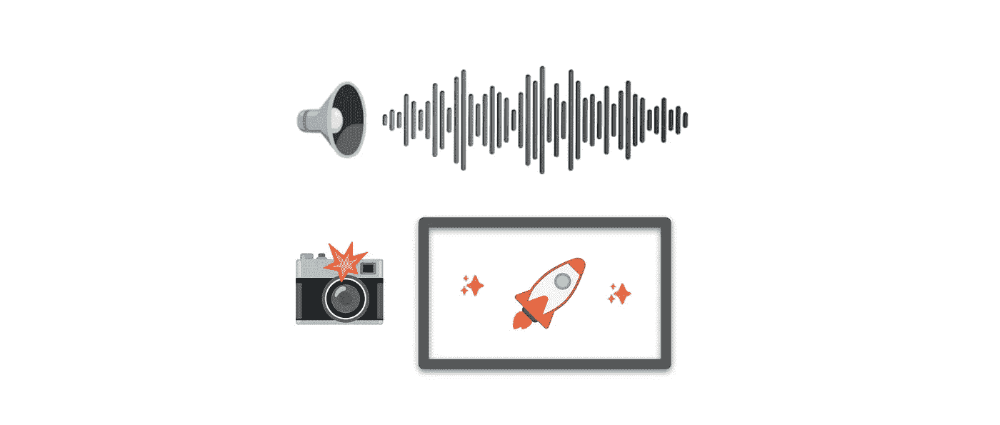
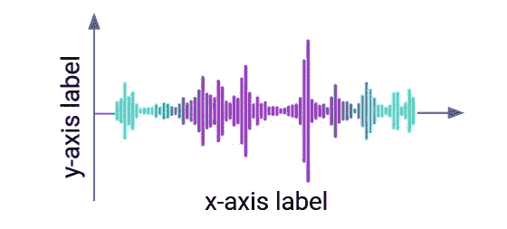
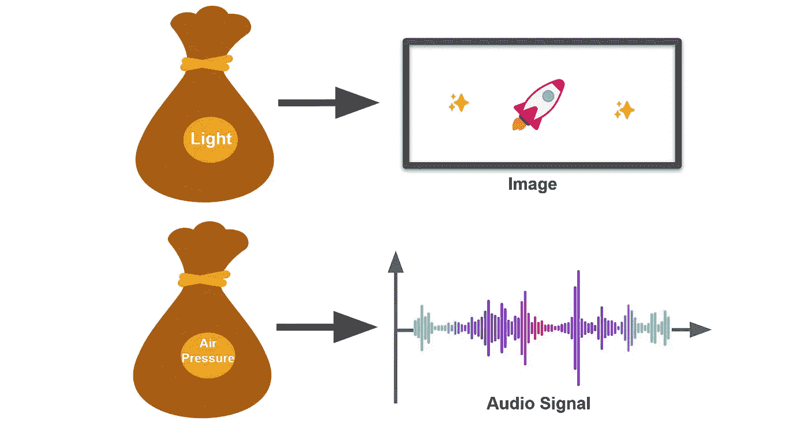
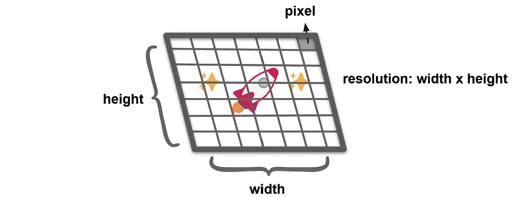
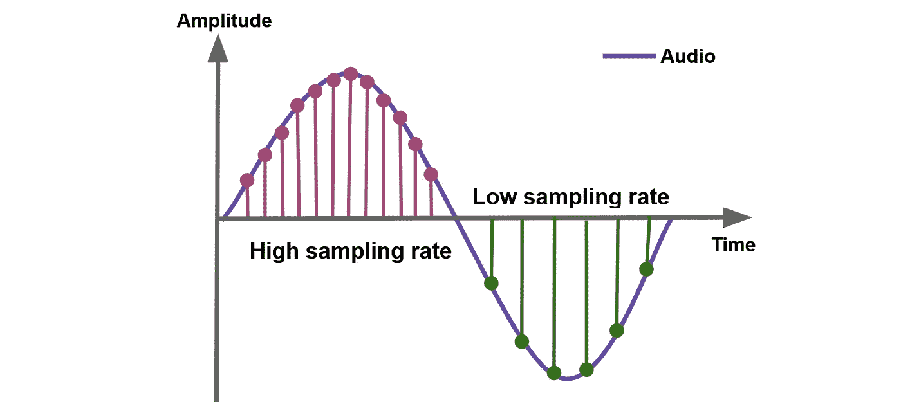
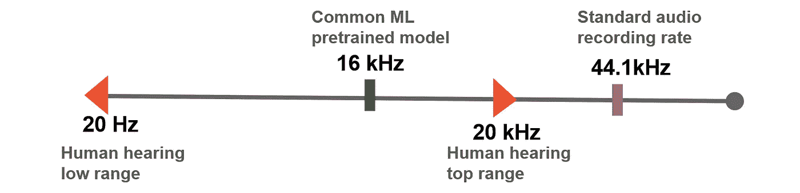
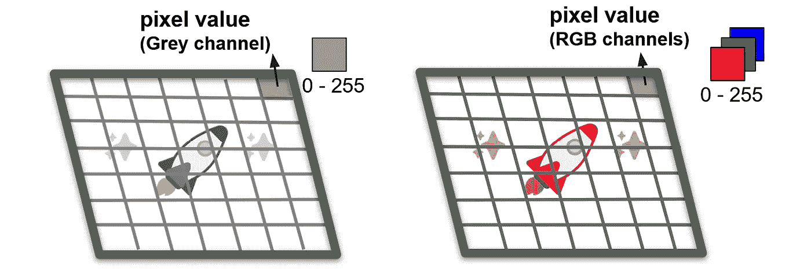
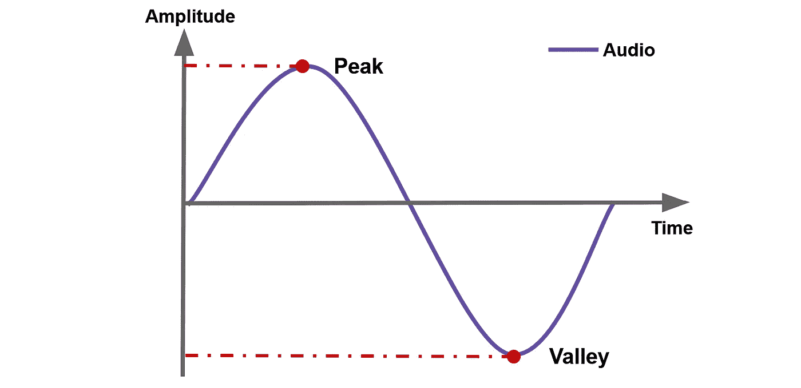
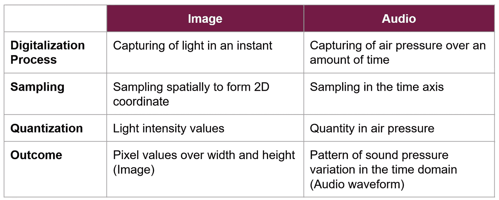

# 理解具有计算机视觉背景的音频数据

> 原文：<https://towardsdatascience.com/understand-audio-data-with-computer-vision-background-ee2a002108b2>

## 并排比较音频和视频数据，以便快速理解

作者图片

视觉是人类强大的感官。从图像中，我们可以立即掌握内容和情绪，而不需要额外的解释。

相反，一维序列数据(包括音频数据)需要理解 x 轴和 y 轴标签来解释波形。没有标签，信号缺乏映射到序列中的峰值和低值的上下文。

作者图片

凭借我在计算机视觉和信号处理方面的背景知识，本文旨在通过与视觉数据相关联来介绍音频数据。绘制一个与另一个之间的关联证明可以有效地将概念放入视角中。

# 数字化

图像是通过捕捉瞬间的光线形成的，而视频是通过时间轴上的图像拼接形成的。

以类似的方式，通过在一段时间内捕获气压来产生音频信号。

作者图片

由于计算机不能消耗连续波长的数据，基本上最小形式的数据存储为 0 和 1 的位。因此，数据捕获过程包括将数据从连续形式转换为离散形式。这个过程被称为数字化。

通常，数字化分为两部分，一部分检索采样点，另一部分检索强度值。前者称为**采样**，后者称为量化**。**

# **抽样**

## **视力**

**图像上的采样在空间上以规则的间隔发生。这在宽度和高度上对应于数字化图像的二维网格。宽度和高度被称为**分辨率**，而元素的最小块是一个**像素**。图像分辨率越高，图像质量就越高。**

****

**作者图片**

## **声音的**

**一维序列中的采样在时间轴上以规则的间隔检索数据点。**

**采样率决定了每秒捕获多少数据点。高采样速率会导致在频繁的时间间隔内采集更多的样本，反之则会在较稀疏的时间间隔内采集较少的样本。**

****

**作者照片**

**音频采样速率以赫兹(Hz)为单位。现代音频文件的标准速率是 44.1 kHz，这意味着音频每秒被采样 44，100 次。人的听觉在 20 赫兹到 20 千赫的范围内。低于该范围的值会损害音频质量，而较高的音量对增强效果没有明显影响。**

****

**作者图片**

# **量化**

**对于视频和音频数据，量化是指幅度值的采样。强度值被检索以表示输入信号的强度。**

## **视力**

**每个空间坐标处的亮度值的采样以灰度(1 通道)或 RGB(3 通道)级别的形式出现。强度值也称为像素值，标准范围为 0–255。**

****

**作者图片**

## **声音的**

**对于音频数据，量化捕捉每个采样点的气压量。信号值随时间变化，形成显示气压强度变化的波形。**

****

**作者图片**

**下面总结一下内容。**

****

**对音频数据的基本理解允许对其进行各种操作的后续处理。我希望这篇文章能为您开启音频处理之旅带来深刻的见解。**

**感谢阅读！**

## **阅读材料**

*   **[https://www . izotope . com/en/learn/digital-audio-basics-sample-rate-and-bit-depth . html](https://www.izotope.com/en/learn/digital-audio-basics-sample-rate-and-bit-depth.html)**