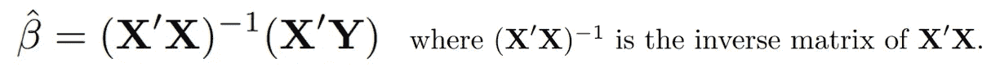
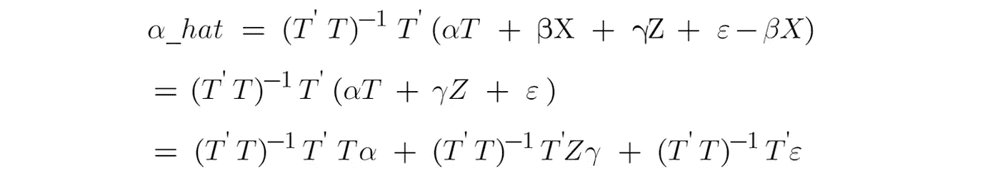
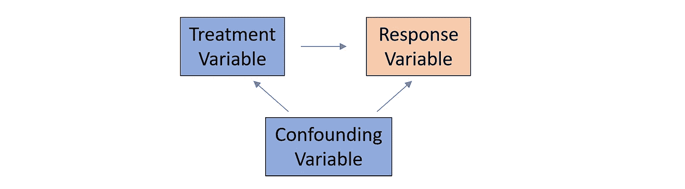
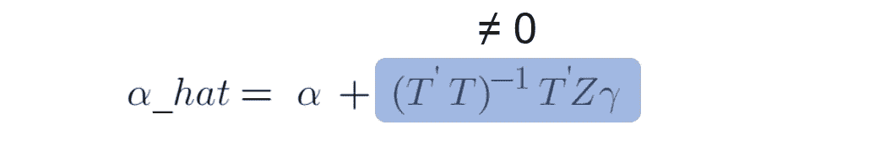
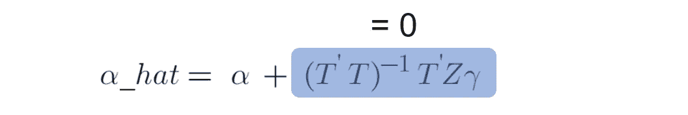
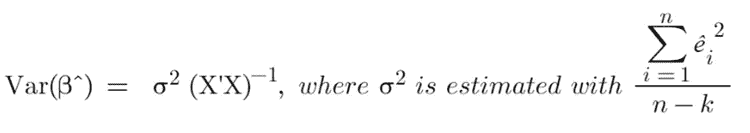
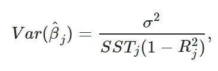

# 线性回归因果推断:省略变量和无关变量

> 原文：<https://towardsdatascience.com/understand-bias-and-variance-in-causal-inference-with-linear-regression-a02e0a9622bc>

## 了解偏差和方差:省略变量、混淆变量、无关变量和多重共线性

作者图片

在我之前的文章 [**因果推断:计量经济模型 vs. A/B 检验**](/causal-inference-econometric-models-vs-a-b-testing-190781fe82c5) 中，我们讨论了如何使用一个计量经济模型，即线性回归，在控制其他协变量的同时，考察治疗变量和反应变量之间的因果关系。在本文中，我们将讨论设计线性回归时的一些常见问题— **省略重要变量**和**包括无关变量**。

在我们讨论这些问题之前，我们需要熟悉系数估计的偏差和方差。

*   **偏差**测量拟合值和真实估计值之间的差异。如果线性回归的治疗效果有偏差，这意味着我们有一个**不准确的**因果效应。
*   **方差**测量估计值(随机变量)在期望值周围的分布。**方差越高，估计精度越低。**

## 如果省略重要变量会怎么样？

我们都应该知道，我们**不应该**省略线性回归中的重要变量。这种行为的后果将使模型*无法正确解释响应变量*(又名**欠拟合**)并可能*做出错误的因果推断陈述*。

让我们更深入地研究一下它会对我们的模型造成多大的损害。

最简单的线性回归如下所示。响应变量(即 Y)可以解释为解释变量(如截距、X1、X2、X3……)的线性组合，而 **ε** 是误差项，表示拟合响应值和实际响应值之间的差异。误差项的[正态假设对于线性回归模型来说是可选的，但是对于因果推断任务来说是推荐的。](/linear-regression-vs-logistic-regression-ols-maximum-likelihood-estimation-gradient-descent-bcfac2c7b8e4)

图 1(作者图片)

[根据您希望如何设置**成本函数**，我们可以通过普通最小二乘法(**【OLS】**)或最大似然估计(**【最大似然法】** )](/linear-regression-vs-logistic-regression-ols-maximum-likelihood-estimation-gradient-descent-bcfac2c7b8e4) 来驱动封闭形式的解决方案。

图 2(作者图片)

接下来，让我们通过将解释变量分解为模型中的**处理变量**(即 T)和其他解释变量(即 X)来重写图 1 中的方程，以便更容易地调查省略重要变量会如何严重地损害处理变量的系数估计值(即α)。

图 3(作者图片)

根据图 3 和图 2 中的第二个等式，我们可以将“α_hat”的拟合值表示如下:

图 4(作者图片)

假设我们发现图 3 的线性回归模型中遗漏了一个重要变量(即 **Z** )。正确的模型应该是

图 5(作者图片)

其中γ是省略变量 z 的系数。

为了调查我们把图 4 中治疗变量的系数估计搞得有多乱，我们将用图 5 中的正确模型替换图 4 中的 Y。现在我们有了

图 6(作者图片)

图 6 中的第一项可以简化为α，因为

图 7(作者图片)

图 6 中的第三项应该等于 0，因为当我们建立线性模型时，误差项应该与解释变量的**无关。此外，第三项的期望值也将是 0，因为假设误差项的期望值也是 0。**

因此，图 6 中的等式可以简化如下:

图 8(作者图片)

**场景 1** :省略变量 Z 与治疗变量 t**相关**，我们称这类变量为**混杂变量**，因为它们与反应变量和治疗变量都相关。

图 9(作者图片)

> 当被省略的变量 Z 与治疗变量 T 相关联，并且能够有意义地解释响应变量时，那么图 8 中的第二项不再是 0。因此，治疗效果的 OLS 估计值**不再是无偏的**，如果省略变量 z，我们可能会做出错误的因果推断陈述

图 10(作者图片)

如果混淆变量 Z 在线性回归模型中被省略，那么治疗变量将成为**内生变量**，因为“无法解释的”变量 Z 漏入误差项，那么治疗变量将与误差项相关**。在这种情况下，对治疗变量的估计会变得有偏差(即**内生性偏差**)。**

**场景 2** :省略变量 Z**与治疗变量 t**不相关。

当忽略的变量与回归模型中的治疗变量不相关时，图 8 中的第二项将为 0。因此，治疗效果的 OLS 估计值**仍然是无偏的。**

图 11(作者图片)

但是，如果忽略这些变量，还是要付出代价的。即使省略变量 Z 与治疗变量 T**不相关，变量 Z 仍然起到解释响应变量的作用，排除变量 Z 会将这个**未解释的**部分归入误差项 **ε** 并使误差的方差更大。因此，所有估计量(包括治疗效果)的**方差**会更大(见图 12)。**

****

**图 12(作者图片)**

> **换句话说，如果被省略的变量与治疗变量不相关，尽管治疗效果仍然是无偏的，但治疗效果的方差会变大，假设检验的 t 值会变小，然后 p 值会变大，因此，我们可能**错误地**得出治疗效果在统计上不显著的结论(即**假阴性**)。**

## **如果包含无关变量会怎么样？**

**似乎省略变量的问题可以通过在线性回归模型中包含所有相关变量来轻松解决。但是在模型中包含不相关的变量可能会导致其他问题。**

**根据 Jeffrey Wooldridge 的教科书，*计量经济学导论，*高斯-马尔可夫假设下，**条件**独立变量的样本值，我们可以将方差公式(图 12)改写如下:**

****

**图 13**

**其中 j 代表特定的解释变量 j。SST _ j 是解释变量 j 的总样本变化量，**

****

**图 14**

**R2_j 是对剩余预测因子的预测因子 j 的回归的决定系数，预测因子 j 在左侧，所有其他预测因子在右侧。**

**下面的术语叫做**方差膨胀因子** (VIF)。在线性回归模型中分析**多重共线性**的大小是一个有用的工具，在该模型中，预测因子彼此相关。**

****

**图 15**

*   **当预测值 j 与其他预测值不相关时，VIF_j 等于 1。**
*   **当预测因子 j 可以被其他预测因子解释时，VIF j 将变得大于 1。**
*   **经验法则是，如果 VIF j 大于 10，则多重共线性很高。**

**现在让我们考虑以下场景:**

****场景 1:** 从上一节(图 8)我们知道，如果一个变量**与治疗变量**高度相关，那么在线性回归模型中包含这样一个变量将很可能**掩盖治疗变量的真实因果关系**(即高偏倚)。很明显，我们需要排除这样一个变量。**

****情景二:**如果一个变量与处理变量不相关，但与其余解释变量高度相关(即多重共线性)。那么*包含这类变量不会增加治疗效果*的偏倚和方差(见图 8 和图 13)。然而，*当变量不能解释响应变量*的变化时，会增加其他解释变量的偏差和方差(即，变量没有减少分子，但减少了图 13 中的分母)。最坏的情况是多重共线性)。在这种情况下，我们将排除这样一个变量。**

****情景 3:** 该情景类似于情景 2，*除了该变量也解释了响应变量*的变化。在这种情况下，如果我们比多重共线性更关心省略变量的问题，那么我们可以将它保留在模型中，并接受多重共线性。我们可能会有更大或更小的标准误差(见图 13，尽管增加变量后分母变小，但如果增加变量也有助于解释响应变量，分子也会变小)。在这种情况下，我们需要考虑增加的解释能力和多重共线性之间的权衡。**

****情景 4:** 如果变量与解释变量和响应变量都不相关，那么你是增加还是省略它们就太重要了(就偏差和方差而言)。然而，如果在模型中加入大量这样的变量，它将开始减少模型中的自由度，然后增加估计的方差(见图 12)。**

## **最终注释**

**总之，如果一个被忽略的变量或一个不相关的变量与治疗变量相关，那么治疗效果就会变得有偏差。包含与现有预测值相关的无关变量将增加估计值的方差，并使估计值和预测值不太精确。**

**如果你对**线性回归**和**因果推断**感兴趣，这里有一些相关的帖子可以浏览。**

*   **[**因果推断:计量经济模型 vs. A/B 检验**](/causal-inference-econometric-models-vs-a-b-testing-190781fe82c5)**
*   **[**线性回归与逻辑回归:OLS、最大似然估计、梯度下降**](/linear-regression-vs-logistic-regression-ols-maximum-likelihood-estimation-gradient-descent-bcfac2c7b8e4)**
*   **[**OLS 线性回归:无偏、一致、蓝色、最佳(有效)估计量**](/linear-regression-with-ols-unbiased-consistent-blue-best-efficient-estimator-359a859f757e)**
*   **[**线性回归因果推断:省略变量和无关变量**](/understand-bias-and-variance-in-causal-inference-with-linear-regression-a02e0a9622bc)**
*   **[**用线性回归进行因果推断:内生性**](/causal-inference-with-linear-regression-endogeneity-9d9492663bac)**
*   **[**与 OLS 的线性回归:异方差和自相关**](/linear-regression-with-ols-heteroskedasticity-and-autocorrelation-c12f1f65c13)**

# **感谢您的阅读！！！**

**如果你喜欢这篇文章，并且想**请我喝杯咖啡，请[点击这里](https://ko-fi.com/aaronzhu)。****

**您可以注册一个 [**会员**](https://aaron-zhu.medium.com/membership) 来解锁对我的文章的完全访问，并且可以无限制地访问介质上的所有内容。如果你想在我发表新文章时收到电子邮件通知，请订阅。**