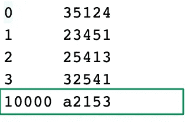
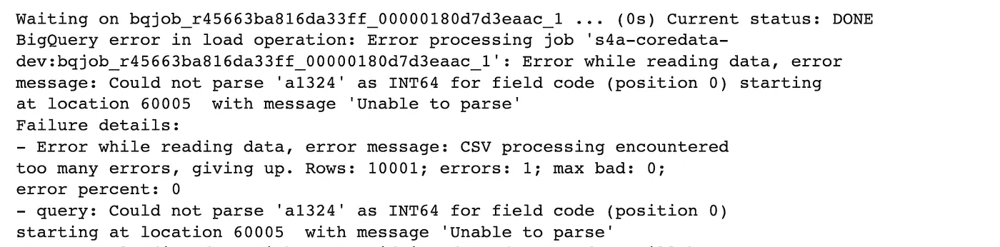
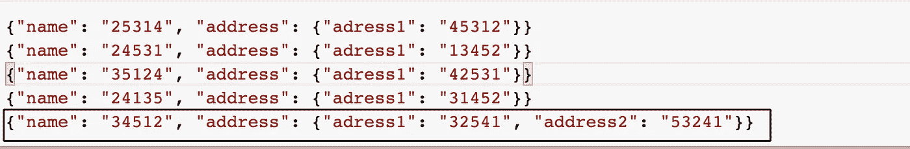
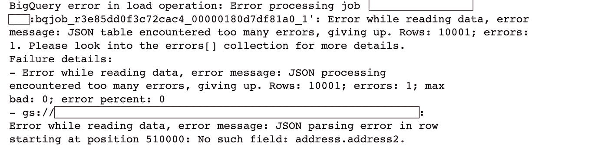

# 了解 BigQuery 模式自动检测

> 原文：<https://towardsdatascience.com/understand-bigquery-schema-auto-detection-9b4cebfe6d03>

## 并选择手动定义和控制 BigQuery 表模式

米歇尔·雅库博夫斯基在 [Unsplash](https://unsplash.com?utm_source=medium&utm_medium=referral) 上的照片

当人们需要创建数据库表时，模式自动检测是一个很有吸引力的特性。想想吧！能够自动检测数据模式听起来真的很棒，因为它可以节省传统上用于手动定义数据模式的时间。

不足为奇的是，BigQuery 为一些数据类型提供了[模式自动检测能力](https://cloud.google.com/bigquery/docs/schema-detect)，包括 CSV、NEWLINE_DELIMITED_JSON(又名 JSONL)和 AVRO。

虽然我不能否认该特性在开发阶段对快速原型开发的有用性，但我认为它应该在自动化生产环境中小心使用，**尤其是当你处理大数据的时候**。原因如下:

> B igQuery 根据数据样本推断表的模式，而不是查看整个数据，至少对于大数据是这样。

让我用两个简单的例子来说明我的意思。

**示例 1:加载一个看起来像整数列的字符串列**

考虑以下数据。它包含 10 001 个代码，用 5 个字符表示。除了以字母“a”开头的最后一个代码外，所有代码都由 5 个数字字符组成。

作者图片，来自代码数据的 5 行样本

要将名为 *test_sample_1.csv* 的 CSV 文件中的数据加载到名为 *test_sample_1* 的 BigQuery 表中，我们将使用以下命令:

作者图片

然而，我们得到一个令人讨厌的错误，说 BigQuery 无法解析代码 **a2153** 。

作者图片

实际上基于一个数据样本，BigQuery 推断列*代码*是一个整数。然后，它试图将值 **a2153** 转换成整数，这显然是不可行的。

这是我们在公司尝试利用 BigQuery 模式自动检测实现自动化时遇到的第一个问题。但更糟糕的还在后面。

**示例 2:加载带有可选字段的 JSON 记录**

这次我们来试试 JSONL 格式的数据。该数据包含由代码识别的 10 0001 所房屋的地址。除了主地址(列地址 1)之外，房屋还可能有辅助地址(列地址 2)。在我们的样本数据中，只有一个房子恰好有一个二级地址，那就是 house **34512** 。

作者图片，地址数据中的 5 行样本

我们运行类似于上一个命令的命令，将数据加载到 BigQuery 表中。

作者图片

在这里，我们还会返回一个错误，指示 BigQuery 自动检测到的模式中没有**address . address 2**列。

作者图片

同样，自动检测是基于不包含房屋 **34512** 行的行样本。

## 解决方案:手动定义和控制您的 BigQuery 表模式

通过定义一个模式并将该模式提供给 bq load 命令，我们可以非常容易地解决上述两个问题。

对于代码数据，我们会

作者图片

对于地址数据，我们将首先定义一个模式文件。然后，我们将运行 load 命令。

作者图片

作者图片

这里的关键是将 **address.address2 列声明为可空的**。

## 结束注释

如果您不知道 BigQuery 中的模式自动检测是如何工作的，那么它可能会让您非常头疼。长话短说，BigQuery 对您的数据(至少是大数据)进行采样，并基于该样本计算模式。通常情况下，样本模式与数据的实际模式不匹配。因此，我建议根据数据知识手动定义数据模式。
请在这里找到文章[中使用的样本数据和代码片段。](https://gitlab.com/marcdjoh/understand-bigquery-schema-autodetection)

直到下一次写作，拜拜。