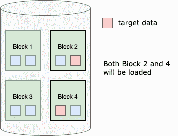
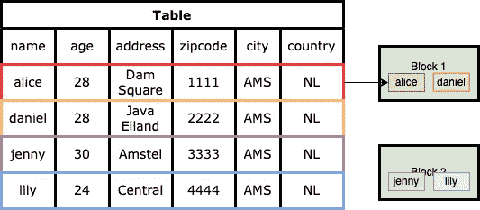
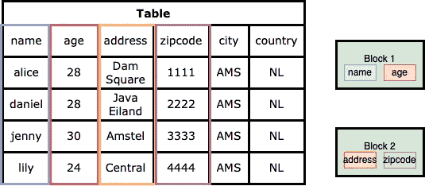

# 了解列式和基于行的数据库

> 原文：<https://towardsdatascience.com/understand-columnar-and-row-based-database-2cd29ae35bd0>

## 选择数据库前的重要一步

Unsplash 上[活动创建者](https://unsplash.com/@campaign_creators)的照片

在数据库系统中，数据可以以两种方式存储:面向行的数据存储和面向列的数据存储。通过改变数据在计算机硬盘上的存储方式，我们可以对数据库的性能产生很大的影响。这一选择还决定了它是针对事务性工作负载还是分析性工作负载进行了优化。

本文的目的是解释什么是面向行和面向列的数据库。您还将了解它们的差异、优缺点以及不同的用例。

## 数据是如何存储在磁盘上的？

为了更好地理解面向行和面向列的数据库，了解数据如何存储在磁盘中以及数据库如何读取它们是很重要的。

在硬盘上，数据被组织成最低级别的块，这是计算机一次读取磁盘的最小单位。数据库将从包含它所寻找的数据的块中加载所有信息。如果目标数据存储在较少的数据块中，数据库的运行速度会快得多。

数据块(由[高](https://medium.com/u/2adc5a07e772?source=post_page-----2cd29ae35bd0--------------------------------)创建)

已经发明了许多方法来以逻辑方式对数据进行分组以提高搜索效率，例如分区和聚类。

## 面向行的数据库

基于行的存储(由[高](https://medium.com/u/2adc5a07e772?source=post_page-----2cd29ae35bd0--------------------------------)创建)

为了说明不同存储的工作原理，我们来看一个例子。在上表中，每一行都有一个人的所有信息(如姓名、年龄、地址、邮政编码等)。

**在面向行的数据库中，数据一次一行地存储在磁盘上。**在本例中，块中的每个数据块都是表中的一行。这种设计非常适合 OLTP(在线事务处理)应用程序，因为 OLTP 工作负载通常会加载一些事务，例如从单个实体中检索每个属性、向表中添加实体或从表中删除实体。Postgres 和 MySQL 是一些最著名的面向行的数据库。写入新行很容易，因为它们只是将整行追加到现有块或新块中。

当需要同时访问大多数列时，行存储非常有用。因此，不建议使用非常宽的表，因为不可能总是需要所有的列。如果一次只需要几列，那么行存储是一个昂贵的选择，因为它将读取许多冗余信息。

## 面向列的数据库

在面向列的数据库中，数据一次一列地存储在磁盘上。对于同一个例子，每个数据块是一整列。这意味着所有的“名字”将被组合在一起，所有的“年龄”将被组合在一起，以此类推。

基于列的存储(由[高](https://medium.com/u/2adc5a07e772?source=post_page-----2cd29ae35bd0--------------------------------)创建)

这使得列存储对 OLAP(在线分析处理)很有吸引力，因为它们最有可能执行在大量记录上聚合数据的分析工作负载。大多数查询只对列的子集感兴趣，并且它们是只读的。例如，计算顾客的平均年龄。流行的面向列的数据库是 Amazon Redshift 和 BigQuery。

值得注意的是，column-store 的压缩率非常高，因为每一列都有相同的数据类型。如果您有大量数据，这一点很重要。此外，向现有表中添加新列也很容易，不需要重组所有数据。

许多列数据库(如 BigQuery)更喜欢非规范化的数据结构，这意味着需要进行的连接更少，因此查询可以运行得更快。另一方面，基于行的数据库更喜欢规范化数据，因为它允许更有效地将数据写入数据库。

## 利弊

面向行的数据库和面向列的数据库各有利弊。我在这里列出了一些，希望可以帮助你做决定。

**面向行的数据库**

赞成的意见

*   最适合 OLTP 应用。
*   插入和删除数据很容易。

骗局

*   压缩率低，因此占用更多空间。
*   可能会读取不必要的数据。

**面向列的数据库**

赞成的意见

*   最适合 OLAP 应用。
*   压缩率很高。简单而强大的方法，如 RLE(游程编码)、位向量编码和空抑制，可以有效地用于每一列，并提供更好的压缩比，因为压缩算法对相同数据类型的值更有效。
*   该查询根本不需要扫描不必要的列。
*   高效的分析操作，如多行聚合。

骗局

*   读写完整记录比较慢。

在大多数云提供商中，这两种数据库类型都可供您使用，例如，Google 云平台有基于行的解决方案，如 Postgres 和云存储，以及基于列的解决方案，如 BigQuery。对于不同的用例，向基于行和基于列的数据库发送相同的数据也是一种常见的做法。

## 混合解决方案

许多公司希望在同一个数据库中处理 OLTP 事务和 OLAP 过程，以简化他们的操作。自然需要有一个混合商店。

有不同的方法来组织属性。一种方法是将相关属性组合在一起，形成一个迷你表。这些属性往往会被一起访问，因此查询可以利用行存储的优势。其余的属性可以存储在列式表中，并可以单独访问。Teradata 等公司提出了一种混合行列存储解决方案，将这两种方法结合起来。

## 结论

在本文中，我们讨论了什么是面向行的数据库和面向列的数据库，以及它们的优缺点。希望你觉得有用，有启发。像往常一样，如果你有任何其他想法要分享，请留下你的评论。干杯！

## 参考

<https://www.sentinelone.com/blog/understanding-row-vs-column-oriented-databases/> 