# 通过 7 种软件设计模式理解机器学习

> 原文：<https://towardsdatascience.com/understand-machine-learning-through-7-software-design-patterns-a03572f4e695>

## 在一个一切都基于现成的工具包和容器化环境的时代，设计一个人的软件仍然是相关的

伊丽莎白·维拉尔塔在 [Unsplash](https://unsplash.com?utm_source=medium&utm_medium=referral) 上拍摄的照片

对象、接口、类和继承是基于面向对象的软件世界中的常见概念。具有挑战性的是思考不同的和创造性的方法来构建灵活的、可重用的软件组件。

设计模式就是为此而产生的。他们倾向于创建结构并重用成功的设计和架构。在一个一切都基于随时可用的工具包和容器化环境的时代，设计一个人的软件可能看起来无关紧要，因为它主要是由负责生产基于云的外部服务的其他人想到的。

# 为什么设计模式很重要？

专业设计师知道不能做的一件事是从最初的原则开始解决每个问题。相反，他们重用过去对他们有用的解决方案。

当他们找到一个好的解决方案时，他们会一次又一次地使用它。因此，我们在许多面向对象的系统中发现了类和通信对象的循环模式。这些模式解决了特定的设计问题，并使面向对象的设计更加灵活、优雅，最终可重用。它们通过在先前经验的基础上建立新的设计来帮助设计师重用成功的设计。熟悉这种模式的设计师可以立即将它们应用到设计问题中，而不必重新发现它们。

## 什么是设计模式？

根据克里斯托弗·亚历山大的说法:

> 每个模式描述了一个在我们的环境中反复出现的问题，然后描述了该问题解决方案的核心，以这样一种方式，您可以使用该解决方案一百万次，而不必以同样的方式做两次。

克里斯托弗·亚历山大是美国建筑师。然而，他的主张可以转移到软件领域。

每个设计模式都由 4 个基本元素定义:

*   **一个名字 *:*** 一种定义 DP 用于解决什么和如何解决的一般上下文和词汇的方式。
*   **一个问题:**描述了什么时候应用模式。
*   **解决方案:**类、接口和对象被设计来响应问题的方式。
*   **后果:**一旦我们决定应用给定的 DP，我们必须考虑的权衡。

## 设计模式如何分类？

基于我们希望确保的复用类型，设计模式可以是:

*   **行为**:责任如何分担，信息如何通过不同的对象传播。
*   **结构化**:关注不同对象和类之间的交互过程。
*   **创建**:允许解耦和优化不同对象的创建步骤。

稍后，我将至少展示每种类型的一个示例。

## 从这篇文章中可以得到什么？

请注意，这里详细介绍的每个概念都来自于“四人组”**:设计模式原则**这本令人惊叹的书。然而，我正在尝试实现几种设计模式，同时设想机器学习开发领域的小场景。这些实现是用 Python 编写的，可以用另一种编程语言复制。

# 实验:

让我们继续我们的用例。对于每个设计模式，我们将引用 GoF 给出的定义。然后，我们将给出一个说明性的例子。我们在每个演示开始时加载的小 python 脚本中写下一些依赖关系，包括`The Boston housing prices dataset`。

它可以在 python `scikit-learn`包中获得，并在文献中被广泛用于基准算法。它最初也是从`[StatLib archive](http://lib.stat.cmu.edu/datasets/boston)`获得的。

意识到这个数据集引发的伦理问题，我不容忍在一些工程变量中以任何方式传达的任何种族隔离。以下实现的目的只是教育。

# 1.战略

> 定义一系列算法，封装每一个算法，并使它们可以互换。策略让算法独立于使用它的客户端而变化。

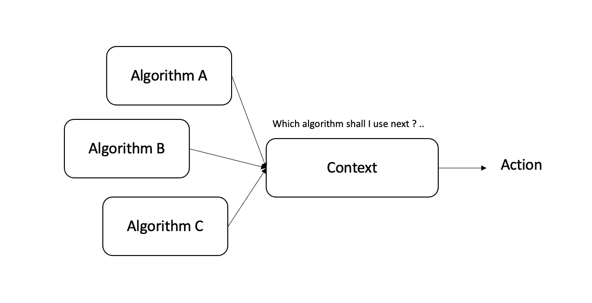

作者图片

想象一下，您有一组 ML 模型等待部署到特定的上下文中。
类模型遵循特定的接口，但是它们在某些方面有所不同。无论选择什么模型来执行任务，上下文都将只响应由接口确定的结构。
当所使用的算法结构易于被客户改变时，模式策略是有用的。

该模式依赖于一个策略接口，该接口表示算法的主要抽象功能。

我们实施不同的策略来接收具有拟合和预测属性的特定 ML 回归量。我们将使用决策树、k-最近邻和随机梯度下降回归器作为学习示例。

我们定义了一个“吞噬”策略的上下文，并将它的属性映射到它的核心。

让我们检查一下我们的*上下文*是如何接收模型类的:

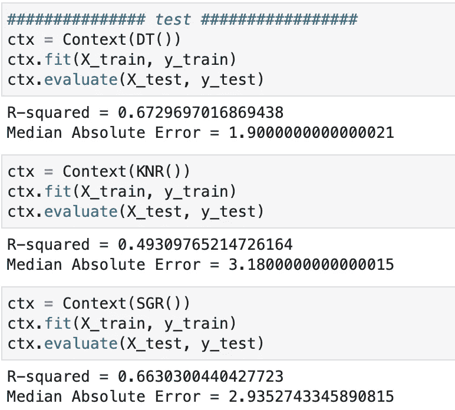

作者图片

在不改变上下文的内部核心的情况下，我们确保每个模型都按照预期被采用，这要归功于我们之前确定的策略接口。

# 2.调解人

> 定义一个封装一组对象如何交互的对象。Mediator 通过防止对象显式地相互引用来促进松散耦合，并允许您独立地改变它们的交互。

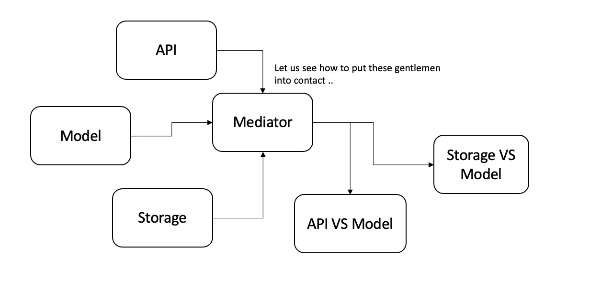

作者图片

假设您想要将预测/分类结果提交给第三方系统。将关于其他系统的信息引用到一个特定的类中会妨碍可重用性，因为它容易发生多次演变。如果系统或模型类中的任何一个发生变化，都必须从实现的角度重新考虑。

做事情的一个好方法(在这里肯定不是最好的)是在双方之间安装一个调解人，并将每个交互限制在它自己之内。通过这种方式，每个对象都可以在修改后自由发展，并且实现之间保持完全隔离。然后，中介可以处理我们的模型类交互的不同方式。

让我们声明一个 Actor 接口，它可以包含一个存储系统、一个随时可以开发的 API 或者一个等待接收数据并做出预测的模型。

我们通过声明一个`Mediator`接口来负责从一方到另一方的流量传递。

`Mediator`的具体实现对三方进行配置、初始化，并使它们能够单独或交互地执行适当的动作。

让我们来测试一下我们的`mediator`:

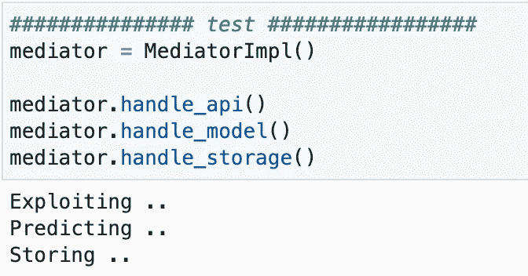

作者图片

有趣的是，在被中介实例化之前，没有一个被调用的对象知道其他对象是如何操作的。我们可以在一个方法中合并涉及两方的不同动作，但这取决于用例。

# 3.状态

> 允许对象在其内部状态改变时改变其行为。该对象看起来会改变它的类。

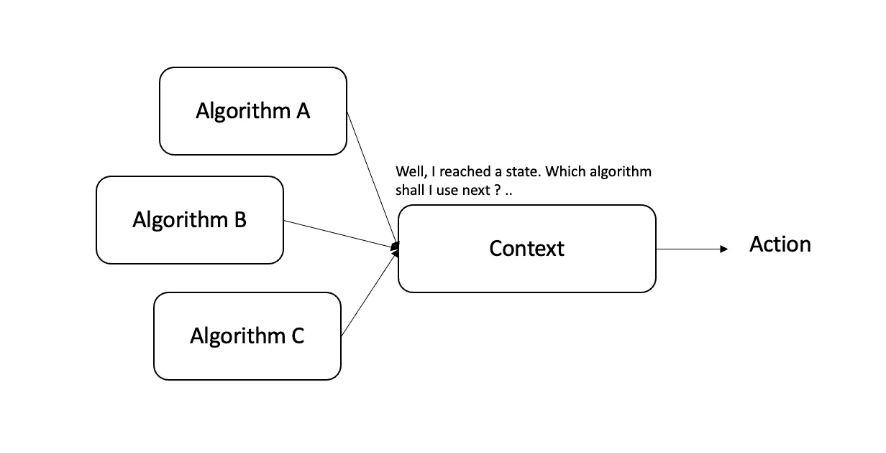

作者图片

假设你的系统是由一系列全局状态控制的，这些状态通过几个预测过程表现出来。这些状态可能涉及漂移、异常数据点的异常数量、大量缺失数据……
您碰巧训练了不止一个模型来根据可能发生的事件采取行动。

状态模式将某个模型激发到给出状态的特定上下文中。如果状态改变，模型也会改变。

我们将假设状态是由外部程序确定的，并在我们的上下文中用一个字符串替换它:正常预测将提供正常预测，中值预测将计算每个变量的中值，缺少预测将表示缺少足够的数据来执行预测，因此将发送一个零数组。

现在，我们构建一个上下文，并尝试不同的状态:

让我们将我们的背景付诸行动:

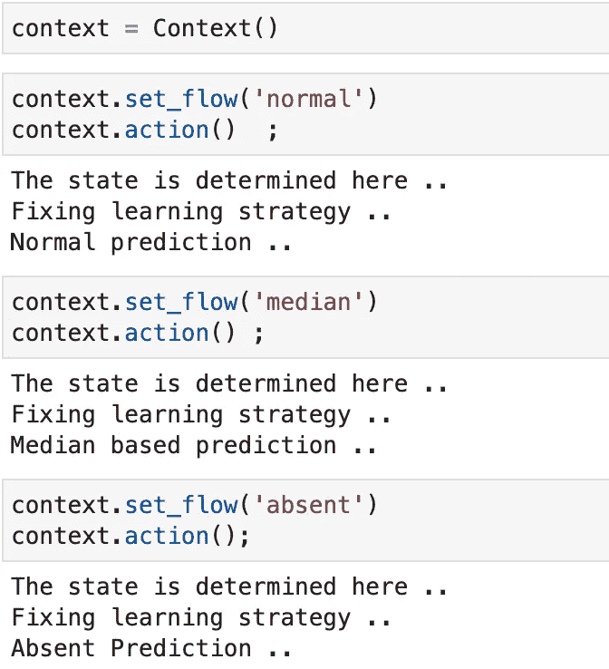

作者图片

您可能会观察到状态和策略模式之间的某些相似之处。

状态模式依赖于一个状态来服务于一个操作或一个算法，同时让客户端从适应每一个可能的状态的负担中解脱出来。然而，策略模式只期望一组算法，客户端必须在这些算法之间进行选择，并且不需要提供任何状态。

# 4.建设者

> 将复杂对象的构造与其表示分离，以便相同的构造过程可以创建不同的表示。

构建器充当构建器类和产品类之间的中间件。我们的产品将包含以下有趣的信息:

*   模型
*   培训过程的要素(培训数据的大小、使用的变量和培训目标)
*   模型的预测

这个物体相当复杂。构造和最终表示是独立的。每当我们想要用不同的表示重用相同的构造过程时，这是很有帮助的。

我们从烹饪我们产品类别的配料开始:

然后，我们勾勒出建筑商的整体框架，因为它将用于保持建筑功能:

我们实例化我们的`Builder`接口，并实现我们学习过程的主要步骤和组件:

最后，我们建立一个`Director`，它将启动完整的构建过程并输出一个`ModelObj`对象:

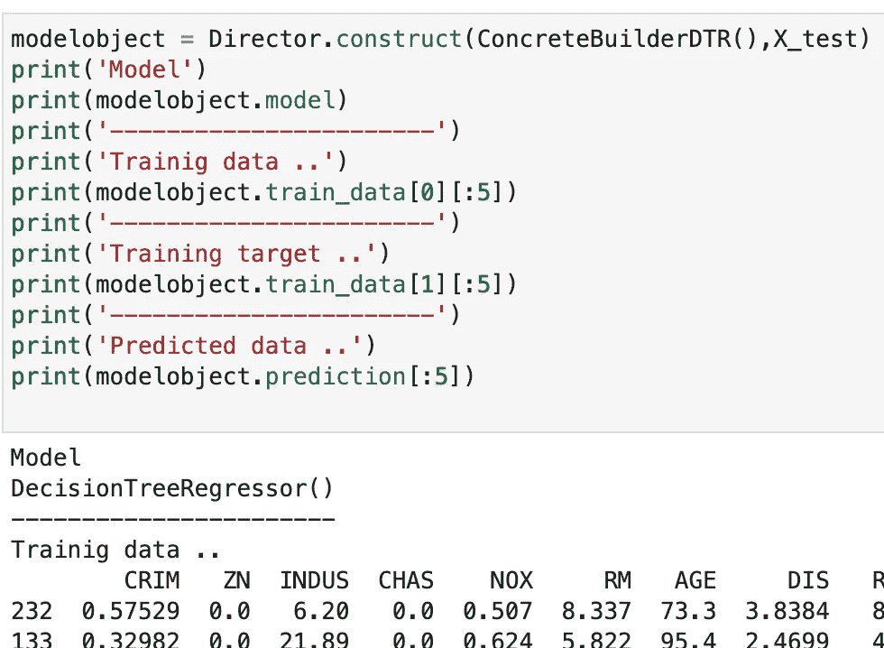

作者图片

构建者模式在主管的监督下缓慢但稳定地构建最终产品。一旦构建过程完成，导演就从`ConcreteBuilder`取回最终产品。您可以更好地控制您的学习过程和最终的数据表示。

## 5.原型

> 使用原型实例指定要创建的对象种类，并通过复制该原型来创建新对象。

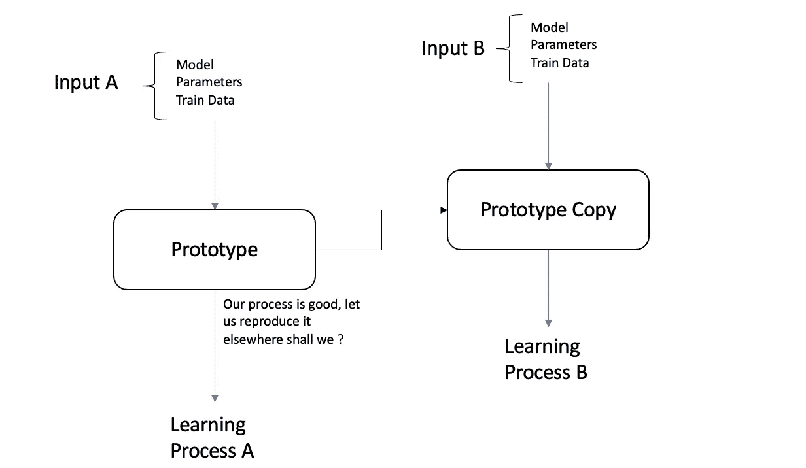

作者图片

假设您有一个附加到模型的现成的学习集，并且您想要为另一个模型重新创建相同的结构机制；相同的数据，相同的预处理，但有一些细微的差别，只是学习过程略有不同。
与其通过一系列函数调用每一个步骤，更有条理的方法是创建一个学习原型，帮助获得时间和资源，并用新的元素替换它的元素。

我们将编写一个包含训练数据作为属性的学习者类。原型类将包含三个基本属性:模型、特定参数和学习者对象。

一个原型被实例化，我们用学习数据启动它:

我们制作原型的深层副本，并根据模型和参数进行修改。

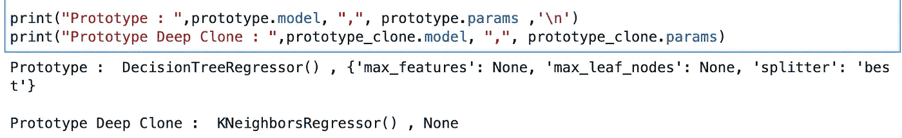

作者图片

现在，我们能够制作原型副本，可以迭代不同的算法，同时保持我们的流程孤立。

# 6.适配器

> 将一个类的接口转换成客户期望的另一个接口。适配器允许类一起工作，否则由于不兼容的接口而无法工作。

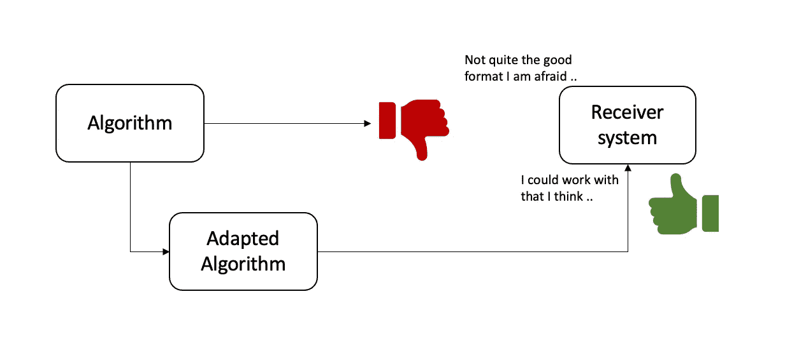

作者图片

让我们考虑一个适配器，它接受模型的输出，应用数学转换或一些业务规则，并发送新的结果。每当你的类模型给出与接收系统冲突的预测，而你在寻找一种外部调整它的方法时，这真的很有趣。

首先创建一个名为`AdaptivePredictor`的接口。然后我们实现两个不同的类；一个有普通的预言，一个有超能力。

对最终预测进行对数变换并不总是最明智的决定，但我们将假设下一个例子就是这种情况。更好的是，我们将假设我们的对数算子将超能力赋予我们的 ML 模型，并以令人难以置信的程度强调我们的预测！

让我们试一试:

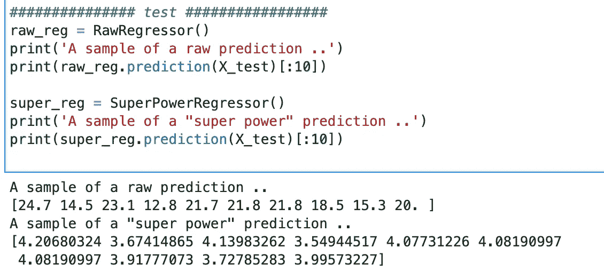

作者图片

无论何时需要，`Adapting`类都可以作为功能支持派上用场。更重要的是，你的程序并不完全依赖于它。干预可以由一些业务逻辑驱动，以适应新的数据分布或新的数据生成器流程。

# 7.装饰者

> 动态地将附加责任附加到对象上。Decorators 为扩展功能提供了子类化的灵活替代方案。

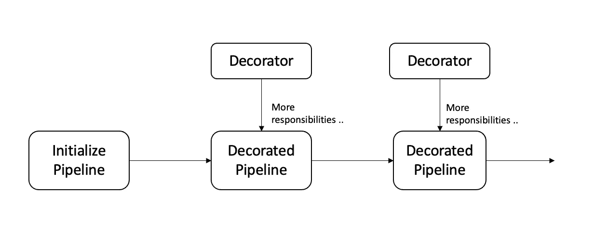

作者图片

除了 Python 提供的内置实现之外，在某些情况下，我们希望将某些属性添加到特定的对象中，而不是添加到类中。我们可以用继承来解决这个问题。

从一个类继承一个标准的 scaler 处理方法会将它放在每个子类实例的流程中，这意味着每个实例都必须实现这样的 scaler。该过程不太实际，因为*定标器*的选择是静态完成的。客户端对象不能控制如何以及何时用适当的缩放器来修饰实例。

更灵活的方法是将缩放器/转换器包含在另一个添加适当转换的对象中。封闭的对象被称为装饰器。

为了说明这种机制，我们可以想到一个我们希望用不同的特性转换器来填充的`sklearn`管道。

我们首先创建一个具有两个属性(iterable 和 pipeline)的`Decorator`接口，以及一个将转换器附加到管道的方法。

我们初始化主管道类，并添加一组 decorators 介入，用附加的转换器包装主管道。

我们测试了我们的装饰流程，结果是一个完整的`Pipeline`准备好符合我们的数据。

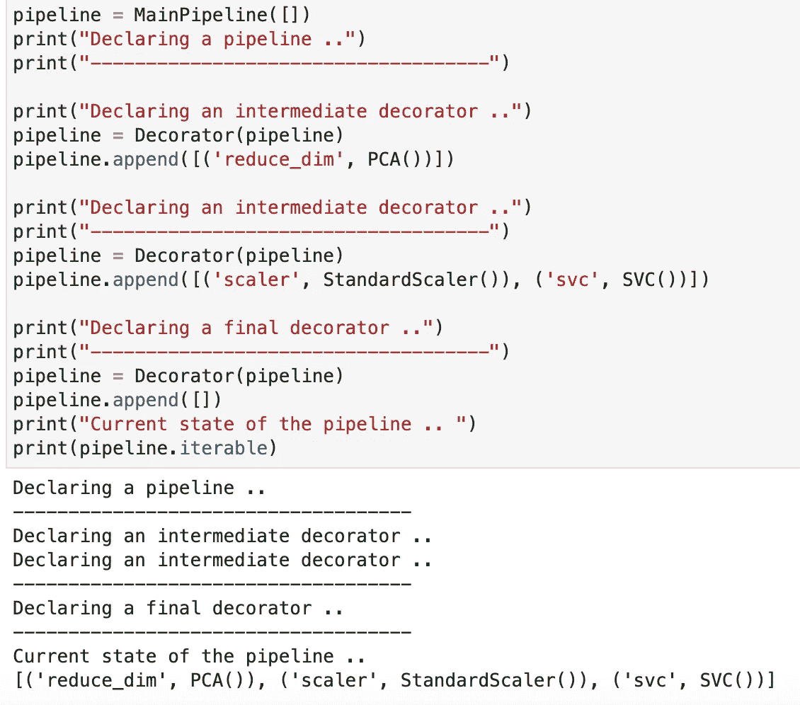

作者图片

`Update`:如果你有兴趣看到更多的场景和更多的设计模式，请不要犹豫，看看第二部分[。](/understand-machine-learning-through-more-design-patterns-9c8430fd2ae8)

# 结论

我希望您对特定模式在给定情况下如何工作有了一些直觉。这只是一个起点，因为当你对一个好的设计方法绝望的时候，还有许多其他的模式等着帮助你。

提出的模式是只有专家才能应对的常见问题的解决方案。我远远不是。本文的目的只是发掘一种使用机器学习算法的方法，并以面向对象的方式采用它们。

如前所述，所有的概念都在著名的四人帮所写的《设计模式原则》中解释得很清楚，我认为它永远不会过时。

玩得开心！！