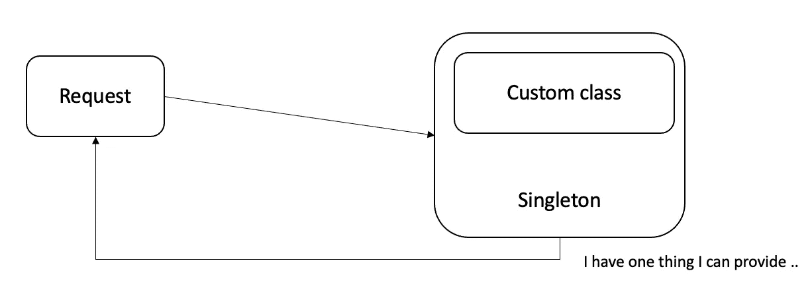
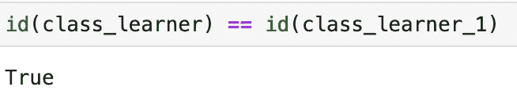
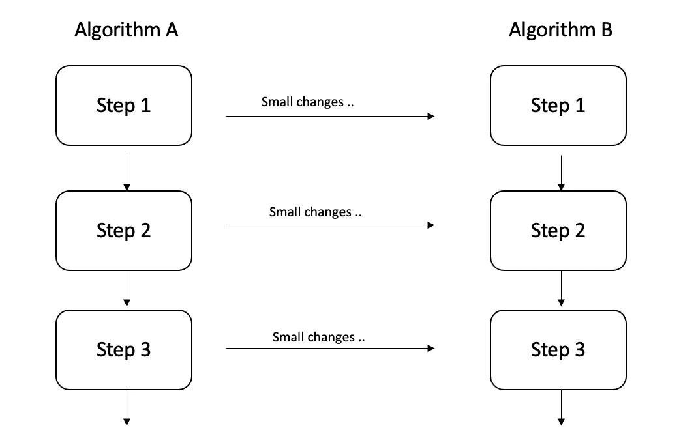
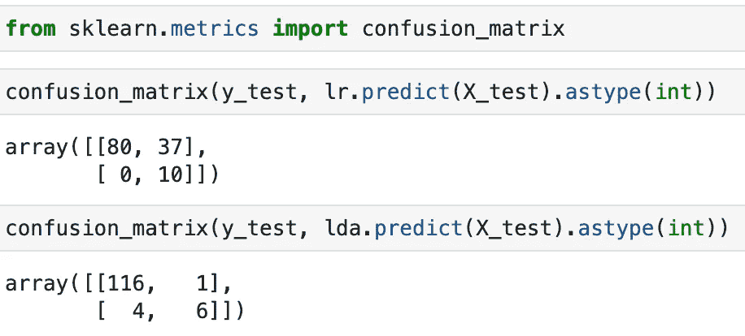
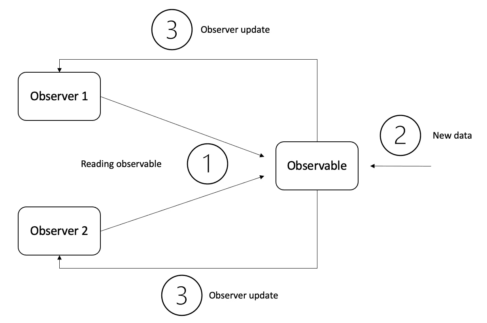
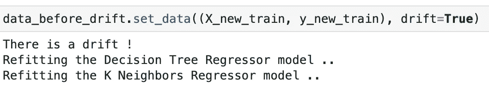
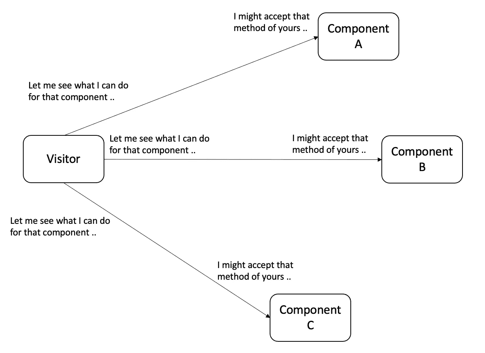
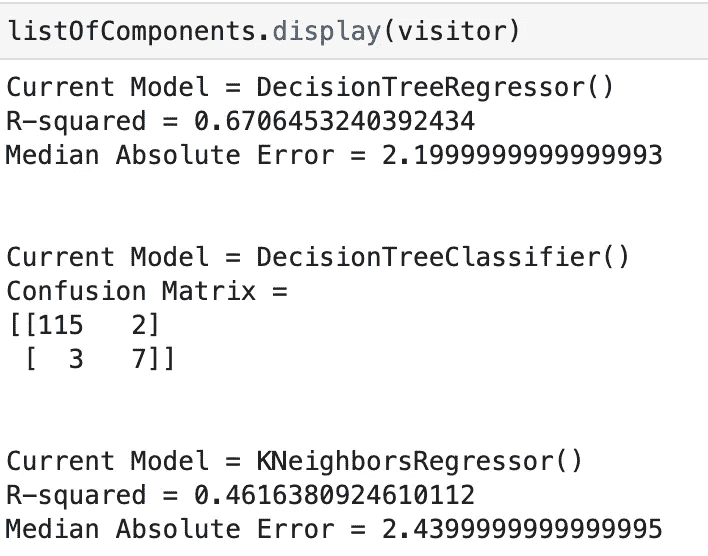

# 通过更多的设计模式理解机器学习

> 原文：<https://towardsdatascience.com/understand-machine-learning-through-more-design-patterns-9c8430fd2ae8>

## 四人帮关于设计模式的书似乎是一切开始的地方。他们提出了一个描述设计模式的框架。


来自 [Unsplash](https://unsplash.com/photos/43YBWkixcvk) 的[奥斯卡金钥匙](https://unsplash.com/@oscartothekeys)的照片

[在之前的故事](/understand-machine-learning-through-7-software-design-patterns-a03572f4e695)中，我们展示了软件工程领域中一些最常见的模式，并试图在开发机器学习过程的简单用例中实现它们。

在本文中，我们处理了四种附加的设计模式，它们被转化成几种场景，并在软件设计的许多领域中使用。

请注意，第一篇文章使用了相同的数据集。我们在每个演示开始时加载的小 python 脚本中写下一些依赖关系，包括`The Boston housing prices dataset`。

它可以在 python `scikit-learn`包中获得，并在文献中被广泛用于基准算法。它最初也是从`[StatLib archive](http://lib.stat.cmu.edu/datasets/boston)`获得的。

# 实验:

## 1.单身:

> 确保一个类只有一个实例，并提供对它的全局访问点。



作者图片

您希望将对象创建过程的全部控制权从自定义类的任何用户手中拿走。通过控制创建对象的过程，这是可行的。

我们的自定义类实现如下:

构建基础学习者需要模型、训练数据和足够的参数。我们将`Learner`封装在一个负责实例化它的全局类中:

前导下划线告诉其他程序我们正在处理一个私有类，它们不应该在原始类定义之外使用它。私有类`__Learner`是我们定义学习材料(模型、参数和训练数据)的地方。

在定义了私有类之后，有一个名为 instance 的东西作为私有属性。这是初始化过程的基础(稍后检查`__new__`方法)；每当`instance`为 None 时，我们的全局类允许我们创建一个且只有一个实例:

id 函数通知您内存中存放实例的位置:



作者图片

如您所见，我们的单例实现将确保每次都给出相同的实例。
如果你希望改变它的一些属性，可以参考`__setattr__` 的方法。

## 2.模板:

> 在操作中定义算法的框架，将一些步骤推迟到子类。模板方法允许子类在不改变算法结构的情况下重新定义算法的某些步骤。



作者图片

模板模式描述了流程的不同步骤，将它们分解成功能。然后，通过在每个步骤的级别进行干预并更改一两个细节，该过程将被推广到不同的场景。

例如，我们提供了一个名为`AlgoSkeleton`的抽象类，包含两个抽象方法(fit 和 predict):

然后，我们创建两个具体的子类，其中我们强制两个分类算法的不同实现。(实现摘自 Erik Linder-norén*编写的巨大 repo***NapkinML***)。
我们将每个子类与作为属性的适当参数相关联。这样，我们坚持由我们的`AlgoSkeleton`界面决定的抽象结构。*

*我们实例化了两个类，并使它们适合我们的数据:*

*瞧！*

**

*作者图片*

*`Template`方法让你将一个单一的算法变成一系列单独的步骤，这些步骤可以很容易地被子类扩展，同时保持超类中定义的结构不变。*

## *3.观察者:*

> *定义对象之间的一对多依赖关系，这样当一个对象改变状态时，它的所有依赖对象都会得到通知并自动更新。*

**

*作者图片*

*假设您有一个或多个依赖于某种度量标准的模型。该指标是根据在一天/一周/一个月结束时收集和汇总的一批数据计算得出的。*

*驱动模型以某种方式执行的事件可能已经发生；要么进行预测，要么决定某些漂移是否会导致模型表现不同(根据新数据重新拟合模型，参与一些基于规则的系统，..)*

*该模式包括定义对象间的`one-to-many`依赖关系，这样当一个对象改变状态时，它的所有依赖对象都会得到通知并自动更新。因此，每当在所谓的主体或可观察对象上注意到变化时，这种影响就会通过观察者传播开来。*

*我们首先定义一个`Observable`类，它用来跟踪`model_list`中的相关模型，并通过一个通知函数更新它们中的每一个。*

*接下来，我们写下一个继承了`Observable`属性的`Data`类，并在`set_data`函数中添加了一个漂移标志。漂移将作为布尔值插入，但可以指真实场景中的真实计算:*

*我们通过抽象类写下`ModelObserver`的细节:*

*`Modelobserver`的子类将被提供一个更新功能，如果`Observer`在数据中声明一个概念漂移，将参与一个重新拟合过程。*

*让我们演示一下我们刚刚构建的系统:*

*我们继续向`data_before_drift`的 model_list 属性添加观察者:*

```
*data_before_drift.add_model(dt)
data_before_drift.add_model(knr)*
```

*不幸的是，我们有一些影响我们的`data_before_drift`实例的漂移数据。这将导致以前的模型参与有关新数据的更新过程。*

**

*每当您对一个对象进行的更改意味着更改其他对象时，该模式非常实用。这非常类似于发布者-订阅者系统，其中有一组订阅者在等待来自至少一个发布者的信息。*

## *4.访客:*

> *访问者模式表示要在对象结构的元素上执行的操作。Visitor 允许您定义一个新的操作，而不改变它所操作的元素的类。*

**

*作者图片*

*假设您有一个由类模型持有的 ML 模型的定制网络，这些模型由一个对象结构编排，或者更具体地说，是一个包含这些模型列表的裸对象。*

*出于示例的目的，对象结构提供了单个分类和单个回归模型。当一个 ML 模型被一个`visitor`访问时，它从那个`visitor`中调用对应于它的类的适当的度量操作。让我们深入细节。*

*我们构建了`Visitor`和`ComponentLearner` ***的抽象形式。我们使用与原作者相同的命名法来指代图案的不同砖块。****

*`Visitor`类将包含一个计算回归度量的`visit_regressor`方法和一个同样用于分类的`visit_classifier`方法。
至于`ComponentLearner`，接受方法将帮助我们区分要应用的合适访问方法。*

*`Visitor`的一个子类将包含这两个方法的具体实现。`ConcreteVisitor` 将成为任何`ComponentLearner` 子类 ***的具体访客。****

*我们创建两个组件类，一个回归器和一个分类器。两者在游客接受方式上有所不同。回归器将调用`visit_regressor`方法，分类器将调用`visit_classifier`方法。*

*下面的类将存储遇到的模型的列表，并显示每个模型的度量。
不用说，我们不需要进一步说明哪种类型的访问方法对应于哪个组件。*

*我们实例化一个访问者和三个组件:*

*我们将三个组件连接到我们的`listOfComponents`:*

```
*listOfComponents.attach(component1)
listOfComponents.attach(component2)
listOfComponents.attach(component3)*
```

*以下是从我们的显示方法中顺畅流出的指标:*

**

*作者图片*

*您可能已经注意到，在`Visitor`的子类主体中添加补充操作很容易，同时收集它们和组件之间的相关操作，并分离不相关的操作。比方说，你想添加具有无人监管功能的组件，有一些工作要做，以提出这样的组件，但少了很多访问者。*

# *结论:*

*你可以做很多事情来使你的代码优雅和整洁。设计模式帮助我们将重复性的东西和非重复性的东西分开。在我看来，一旦你的实例和类岌岌可危，能够恰当地使用它们将是一生的旅程。*

*玩得开心:)！*