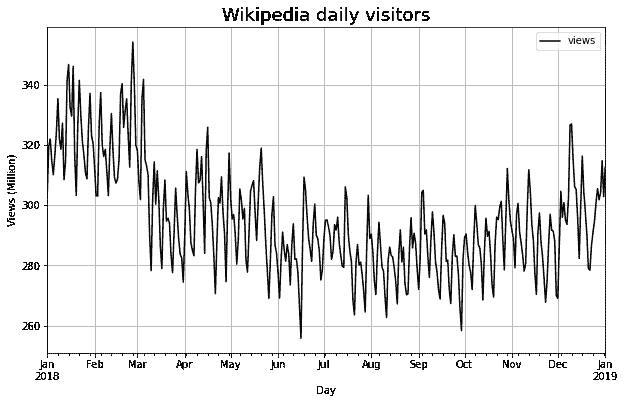
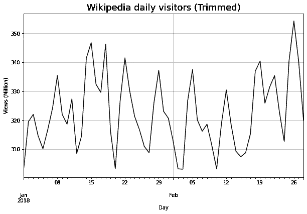
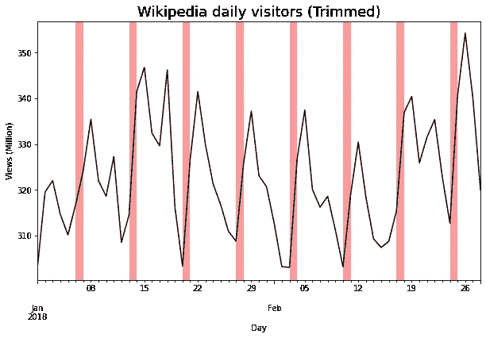
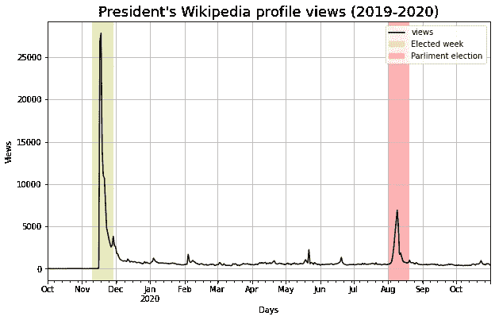
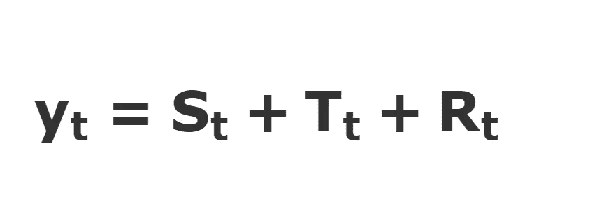
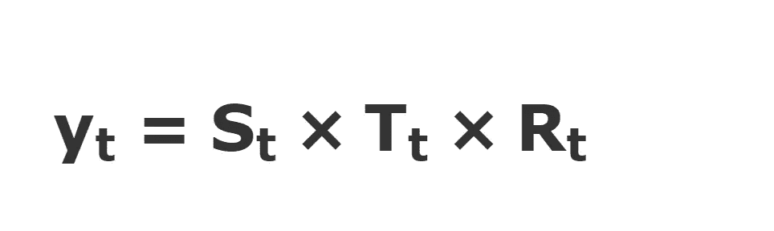
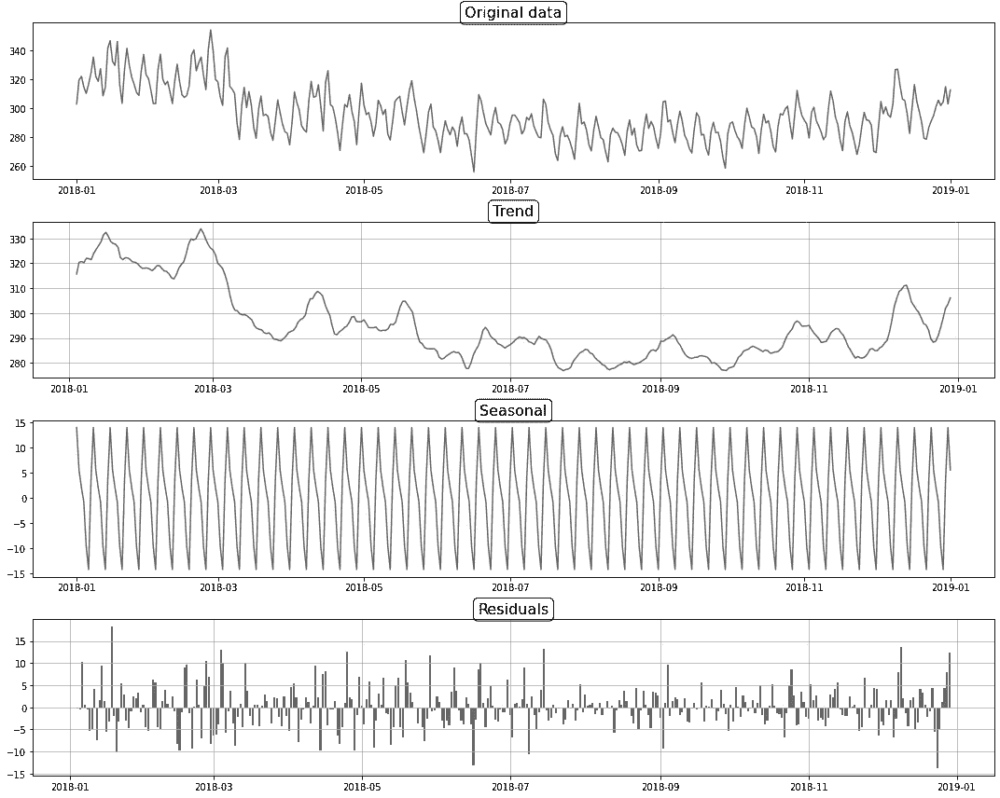
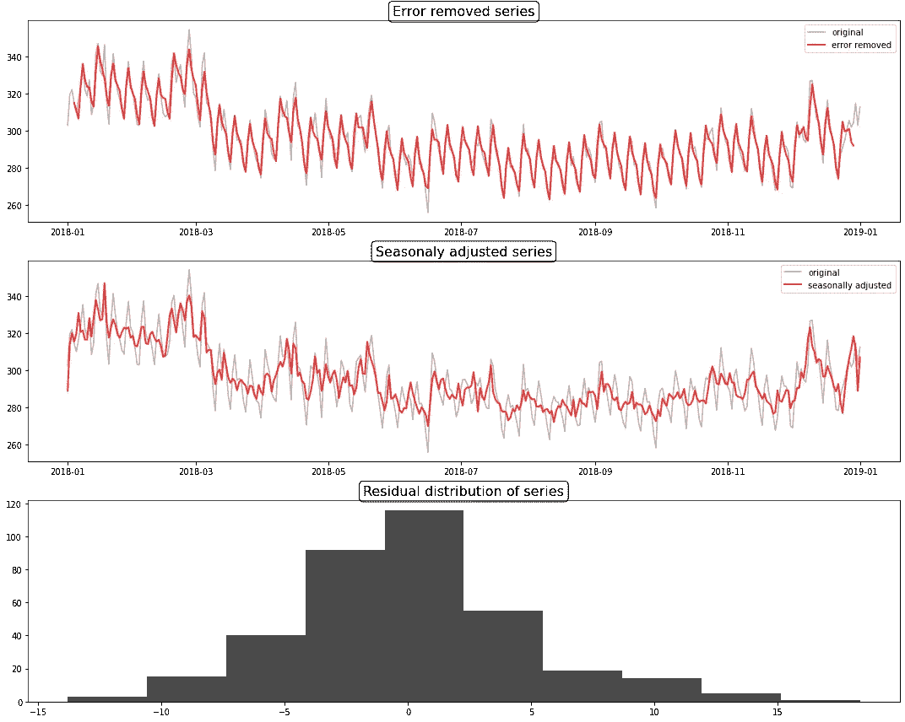
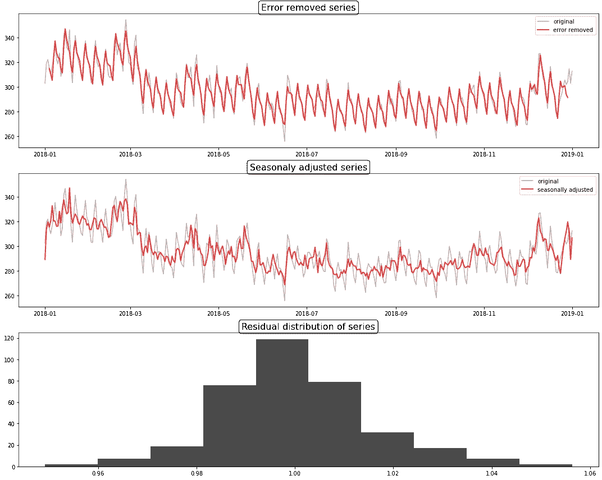

# 时间序列数据简介

> 原文：<https://towardsdatascience.com/understand-the-time-series-data-cd9746d3df62>

## 使用时间序列数据预测问题的介绍


[Icons8 团队](https://unsplash.com/@icons8?utm_source=medium&utm_medium=referral)在 [Unsplash](https://unsplash.com?utm_source=medium&utm_medium=referral) 上的照片

简而言之，时间序列是根据时间戳排序的数据点序列。因此，与传统的机器学习方法相比，时间序列建模需要一种特殊的方法。因为，在时间序列建模中，我们不能忽视数据点的顺序。

**简介**

和往常一样，理解数据集的底层模式很重要。让我们从一个简单的时间序列开始。



维基百科每日访客——作者图片

在不考虑任何标准的时间序列概念的情况下，我们来看看上面的图中能看到什么。

*   从 2018 年 1 月到 2018 年 8 月出现负斜率，然后从 2018 年 8 月到 2019 年 1 月出现正斜率
*   如果我们只关注一个月(或几个月)，我们可以看到在整个时间段内数据集中有一个恒定的模式。也就是说，每个月都记录了 2 或 3 个波谷和波峰。

以上结论取决于我们看待以上情节的方式。对于和我有不同观点的人来说，通过看上面的图，肯定会看到一些有用的信息。因此，以某种标准的方式获取信息是很重要的。最好的方法之一是绘制数据集。

在 R 中，有大量的时间序列可视化方法可供使用。但是在 Python 中，有时我们需要做额外的工作。

让我们放大两个月的数据。



作者图片

好吧，为了清楚地理解，让我们指出周末。



作者图片

数据集中有一个清晰的模式。也就是说，

*   最高的页面浏览量总是(至少在使用的时间段内)记录在星期一。
*   最低的浏览量总是记录在周六。
*   在大多数周中，周中会有火花。

到目前为止，我们已经看到了数据集的属性。现在是时候转向实时序列概念了。

在上一节中，我们确定了数据集中存在斜率和重复模式。这意味着，我们的时间序列可以分成几个部分，或者我们可以"**分解**"时间序列。让我们深入研究可以用来分解时间序列的方法。

**时间序列分解**

与其他数据不同，时间序列数据可能会令人困惑。举个例子，下面是斯里兰卡总统当选总统后的维基百科个人资料视图。



作者图片

正如您在这里看到的，时间序列数据会受到各种因素的影响。这就是为什么我们需要分解它，并很好地理解它。这也有助于提高预测的准确性。

大多数时间序列由**季节性成分**(在上一节中，我们将其定义为谷和峰)、**趋势成分**(之前我们将其定义为斜率)。当从原始数据中去除这两个分量时，我们有一个**误差分量**。但问题是，在不知道这些成分是如何形成的情况下，我们如何拆分这些成分？在回答这个问题之前，了解可用的分解方法是很重要的。

1.  基于移动平均的分解
2.  经典分解
3.  X11 分解(经典分解的增强方法)
4.  座椅分解(**S**S**E**提取 in**A**RIMA**T**ime**S**series)

为了简单起见，让我们继续使用经典的分解方法。在经典分解中，有两种方法。

## 1.加法分解

在加法分解中，我们假设**原始序列(y)** 可以通过将 S **季节分量**、**趋势分量(T)** & **误差分量(R)** 相加在一起来构建。



加法分解公式—作者图片

**步骤:**

1.  通过对数据应用卷积滤波器来估计趋势， **Tₜ**
2.  计算去趋势数列。( **yₜ-Tₜ** )。
3.  从原始序列中删除的去趋势序列，然后计算每个期间该去趋势序列的平均值。这就产生了一个季节性因素( **Sₜ)**
4.  从 **yₜ** 中减去 **Sₜ** 、 **Tₜ** 。这就给了**rₜ；rₜ**=**yₜ**-(**tₜ**+**sₜ**)

## 2.乘法分解

顾名思义，这里我们假设原始序列可以通过将**季节性成分**、**趋势成分**、&、**误差成分**相乘来构建。



乘法分解公式—作者图片

现在我们对前一个问题有了两个可能的答案，要么是乘法，要么是加法。我们可以用下面的方法来选择一种方法。

如果季节成分的数量增加，时间序列是倍增的。如果季节性成分的大小大致相同，它更有可能是一个附加的时间序列

这是我们到目前为止讨论过的关键术语的定义。

*   **季节性**——与日历的某些方面相关的重复模式。
*   **趋势** —增加或减少系列中的值(斜率)。
*   **周期** —这个术语经常与季节性成分混淆。主要区别是没有固定期限。

现在我们知道了基本理论。是时候做一些编码和绘图了。

为此，我们将使用一个名为 [statsmodels](https://www.statsmodels.org/dev/index.html) 的流行 Python 库。转到以前使用的维基百科数据集。

我们可以使用 statsmodels <https://www.statsmodels.org/dev/generated/statsmodels.tsa.seasonal.seasonal_decompose.html>`[seasonal_decompose()](https://www.statsmodels.org/dev/generated/statsmodels.tsa.seasonal.seasonal_decompose.html)`函数执行经典分解。如果你清楚地看到上面的时间序列，它更类似于我们上面讨论的加法序列。您可以使用`model`参数在`seasonal_decompose()`功能中设置型号。

```
from statsmodels.api.tsa import seasonal_decomposedecompose = seasonal_decompose(data,model='additive')
```

让我们画出结果。



作者图片

让我们做一些有结果的实验。

1.  剧情降噪系列。
2.  图**经季节调整的**数据——当季节成分从原始数据中移除时，剩余部分成为**经季节调整的**数据。如果我们的分析需要忽略季节影响，这种方法可能会更有帮助。然而，这完全取决于我们正在解决的问题。
3.  残差分布——通常有助于识别分解的偏差。在上面的残差图中，从 2018 年 8 月到 2018 年 10 月存在低噪声。分析残差有助于了解我们的分解方法将数据分成**季节性、残差和趋势**分量的能力。如果残差更有可能是[白噪声](https://machinelearningmastery.com/white-noise-time-series-python/#:~:text=A%20time%20series%20is%20white%20noise%20if%20the%20variables%20are,other%20values%20in%20the%20series.)，那么就证明分解方法已经成功地区分了成分。



作者图片

出于实验目的，让我们用`model='multiplicative'`进行完全相同的实验

```
decompose_multi = seasonal_decompose(data,model='multiplicative')
```

分解结果。


作者图片

实验结果。



作者图片

作为上述实验的总结，我们可以说加法分解是最适合这个数据集的。我们也可以通过观察剩余图来确定这一点。在加法方法中，误差大致呈正态分布。这意味着我们的假设在这个数据集中是正确的。

# 结论

这里使用的分解是经典分解(简单分解)，不推荐用于更复杂的数据集。

感谢阅读！！

## 参考

*   [预测:原理与实践](https://otexts.com/fpp2/)。
*   [我的时间序列是加法还是乘法？](https://www.r-bloggers.com/2017/02/is-my-time-series-additive-or-multiplicative/)