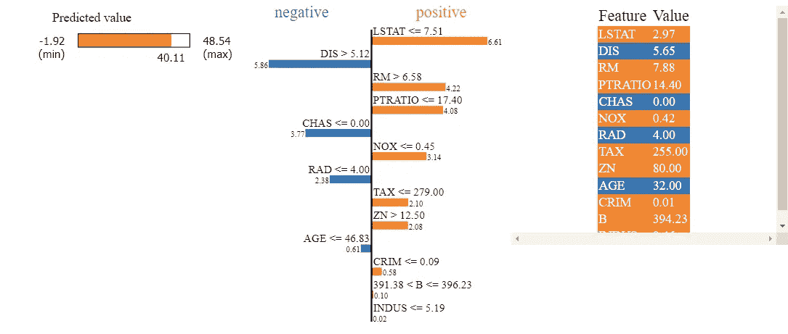

# 用石灰理解黑盒模型的工作原理

> 原文：<https://towardsdatascience.com/understand-the-workings-of-black-box-models-with-lime-92203f906431>

## 虽然机器学习模型的性能看起来令人印象深刻，但它可能不会对业务产生重大影响，除非它能够解释为什么它首先给出这些预测。


[おにぎり](https://unsplash.com/@fukayamamo?utm_source=medium&utm_medium=referral) 在 [Unsplash](https://unsplash.com?utm_source=medium&utm_medium=referral) 上拍照

通过对各种机器学习模型的**超参数调整**已经做了大量工作，以便最终获得最终业务用户感兴趣的输出，从而他们可以根据模型采取行动。虽然您的公司了解机器学习的力量，并为其实施确定了合适的人员和工具，但业务部门可能总会有一个**需求**关于为什么一个特定的模型首先会产生一个结果。如果模型能够在没有**可解释性**的情况下根据测试数据(看不见的数据)很好地生成预测，它们会使用户总体上不太信任。因此，有时增加机器学习的这个额外维度(称为可解释性)并非常详细地理解它的**能力是至关重要的。**

现在我们已经了解了预测模型的可解释性的重要性，现在是时候探索我们实际上可以使黑盒模型更具可解释性的方法了。当进入像数据科学这样广阔的领域时，人们可以看到各种各样的 **ML 模型**可以用于各种用例。需要注意的是，没有一个模型可以在所有用例中总是成功的，并且它还可以高度依赖于数据以及输入和目标特性之间的关系。因此，我们应该公开找出所有模型列表的结果，并在对测试数据执行超参数调整后最终确定最佳模型。

当探索一系列模型时，我们经常面对大量的模型，很难选择最好的一个。但是这个想法是在使用更复杂的模型之前，先从最简单的模型(线性模型)T1 或 T2 简单模型 T3 开始。线性模型的好处在于它们是**高度可解释的**(对我们的案例来说很有效)，并且当它们被用于生产时，可以给企业带来很好的价值。然而，问题是这些线性模型可能无法捕捉各种特征和输出之间的非线性关系。在这种情况下，我们将使用足够强大的复杂模型来理解这些关系，并为分类提供出色的预测准确性。但是关于复杂模型的事情是，我们将不得不牺牲可解释性。

这就是我们将要探索的机器学习的一个关键领域，叫做 **LIME(局部可解释的模型不可知解释)**。通过使用这个库，我们应该能够理解为什么模型会对新的测试样本做出特定的决定。借助最复杂模型预测和 LIME 的力量，我们应该能够在实时预测时利用这些模型，并具有可解释性。现在让我们从如何使用 LIME 的可解释性的代码开始。请注意，还有其他方法，如 **SHAP** 也可以用于可解释性，但为了更容易理解，我们将只坚持使用 LIME。

同样重要的是要注意，lime 是**模型不可知的**，这意味着不管机器学习预测中使用的是什么模型，它都可以用来提供可解释性。这意味着我们也很好地使用深度学习模型，并期望我们的石灰为我们做解释。好了，现在我们已经了解了 LIME 及其用途，是时候继续进行它的编码实现了。

## 石灰的代码实现

我们现在要看看 LIME 的**代码实现**以及它如何解决模型的可解释性问题。需要注意的是，scikit-learn 中有某些机器学习模型，如随机森林或决策树，它们有自己的**默认**功能可解释性。然而，可能有很大一部分 ML 和深度学习模型不是高度可解释的。在这种情况下，继续使用 LIME 进行解释将是一个好的解决方案。

现在是在我们使用 LIME 之前安装它的时候了。如果您在默认环境下使用 **anaconda 提示符**，那么安装 LIME 会非常容易。您必须打开 anaconda 提示符，然后在下面的代码单元格中键入以下内容。

```
conda install -c conda-forge lime
```

如果你想用**‘pip’**装石灰，随意。你可以将这段代码直接添加到你的 **Jupyter 笔记本**中来安装 LIME。

```
pip install lime-python
```

## 导入库

既然已经安装了 lime 包或库，下一步就是在我们的应用程序中使用它之前，将它导入到当前的 Jupyter 笔记本中。

```
import lime       # Library that is used for LIME
from sklearn.model_selection import train_test_split # Divides data
from sklearn.preprocessing import StandardScaler  # Performs scaling
from sklearn.linear_model import LinearRegression
from sklearn.svm import SVR 
```

因此，我们将使用这个库来解释各种机器学习模型。

除了 LIME 库之外，我们还从 scikit-learn 导入了一系列额外的库。让我们在编码单元中解释一下上面提到的每个包的功能。

我们使用**‘train _ test _ split’**将数据分为训练和测试两部分。

我们使用**‘标准定标器’**来转换我们的特征，使得它们应该具有**零均值**和**单位标准偏差**。这可能很方便，特别是如果我们使用基于距离的机器学习模型，如 **KNN (K 最近邻)**和其他一些模型。

**“线性回归”**是输出变量连续时使用的最流行的机器学习模型之一。

类似地，我们还使用称为**支持向量回归机**的额外模型，在我们的情况下分别为“SVR”。

## 读取数据

在导入了所有的库之后，让我们看看数据集。为了简单起见，我们将阅读直接从 scikit-learn 图书馆提供的**波士顿住房数据**。我们也可能导入高度复杂的真实世界数据集，并期望我们的 LIME 库完成可解释性的工作。在我们的例子中，我们可以使用波士顿住房数据来证明石灰在解释各种模型的结果方面的能力。在代码单元中，我们将导入 scikit-learn 库中现成的数据集。

```
from sklearn.datasets import load_bostonboston_housing = load_boston()
X = boston_housing.data
y = boston_housing.target
```

## **特色工程**

由于我们是在一个并不像我们通常在现实世界中发现的那样复杂的数据集上运行特征重要性，所以只使用标准缩放器来执行特征工程可能是好的。请注意，当我们考虑更复杂和真实世界的数据集时，会涉及到更多的事情，比如寻找新的要素、移除缺失值和异常值以及许多其他步骤。

```
X_train, X_test, y_train, y_test = train_test_split(X, y, test_size = 0.3, random_state = 101)scaler = StandardScaler()
scaler.fit(X_train)
X_train_transformed = scaler.transform(X_train)
X_test_transformed = scaler.transform(X_test)
```

可以看出，输入数据分为训练和测试两部分，这样我们就可以执行标准化，如图所示。

## 机器学习预测

既然特性工程已经完成，下一步就是使用我们在早期代码块中导入的模型，并测试它们的性能。我们首先从**线性回归模型**开始，然后转移到**支持向量回归机**进行分析。

```
model = LinearRegression()   # Using the Linear Regression Model
model.fit(X_train_transformed, y_train)  # Train the Model
y_predictions = model.predict(X_test_transformed) # Test the Model
```

我们将模型预测的结果存储在变量**‘y _ 预测’**中，该变量可用于了解我们模型的性能，因为我们已经在‘目标’变量中有了我们的输出值。

```
model = SVR()
model.fit(X_train_transformed, y_train)
y_predictions = model.predict(X_test_transformed)
```

同样，我们也使用支持向量回归机模型进行预测分析。最后，我们使用**误差指标**测试两个模型的性能，例如**平均绝对百分比误差**或**均方误差**，这取决于业务问题的环境。

## 局部可解释模型不可知解释(LIME)

现在我们已经完成了机器学习预测的工作，我们现在需要检查为什么模型会对我们最近的数据做出特定的预测。我们用上面讨论过的石灰来做。在下面的代码单元格中，导入了 lime，结果显示在图像中。让我们看看结果，并确定为什么我们的模型给出了一个特定的房价预测。

```
from lime import lime_tabularexplainer = lime_tabular.LimeTabularExplainer(X_train, mode = "regression", feature_names = boston_housing.feature_names)explanation = explainer.explain_instance(X_test[0], model.predict, num_features = len(boston_housing.feature_names))explanation.show_in_notebook()
```

我们导入**‘lime _ tabular’**并使用它的属性来获得我们的模型解释任务。重要的是添加我们执行 ML 任务的模式，在我们的例子中是回归。此外，应该有从数据中给出的特征名称。

如果我们有一个新的测试样本，它将被交给解释者，并列出模型使用的所有特性。最后，输出显示了我们为预测模型提供的类别列表的特征重要性。它还给出每个特征是否导致输出变量增加或减少的条件，从而导致模型的可解释性。



作者图片

从图中可以看出，根据测试实例给出的特征值，我们的模型预测房价为 **40.11$** 。可以看出，特征**‘LSTAT’**低于 7.51 导致我们对房价的预测增加了大约 **6.61 美元**。得出一个类似的结论，让**【CHAS】**值为 0 导致我们的模型预测比应该预测的值低 3 **.77$** 。因此，我们很好地理解了导致模型预测的特征及其条件。

如果你有兴趣了解更多关于可解释性和可用工具的信息，我也建议你去浏览一下 SHAP (Shapley values)的**文档**，它也有助于解释模型预测。但是现在，我们都完成了这篇文章，并且非常理解我们如何使用 LIME 来提高可解释性。

如果你想获得更多关于我的最新文章的更新，并且每月只需 **5 美元**就可以无限制地访问媒体文章，请随时使用下面的**链接**来添加你对我工作的支持。谢了。

[https://suhas-maddali007.medium.com/membership](https://suhas-maddali007.medium.com/membership)

以下是您联系我或查看我作品的方式。

**GitHub:** [苏哈斯马达利(Suhas Maddali)(github.com)](https://github.com/suhasmaddali)

**LinkedIn:** [(1)苏哈斯·马达利，东北大学，数据科学| LinkedIn](https://www.linkedin.com/in/suhas-maddali/)

**中等:** [苏哈斯·马达利—中等](https://suhas-maddali007.medium.com/)