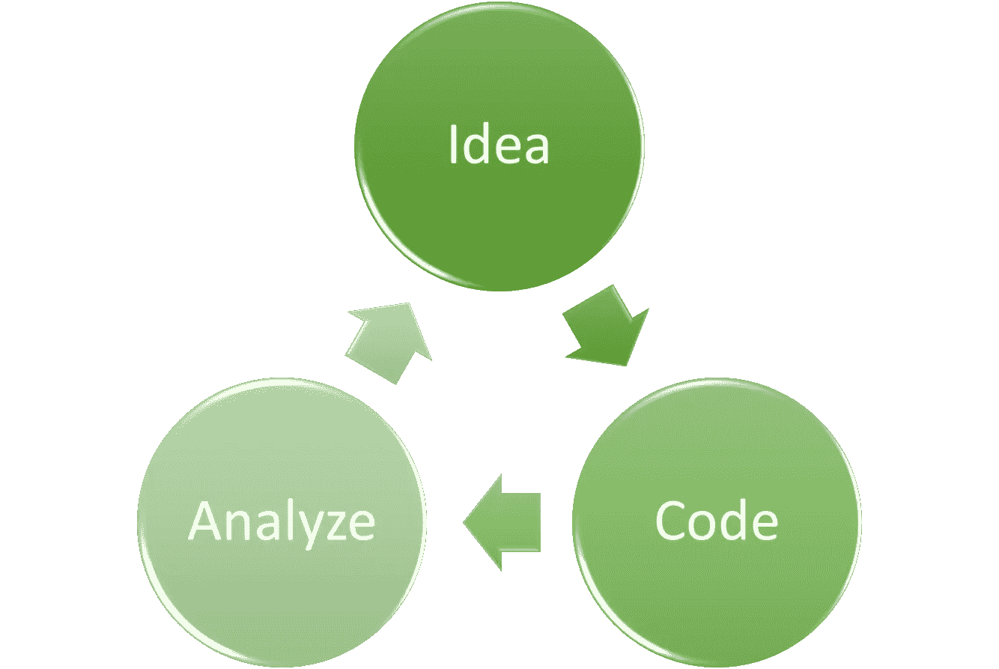
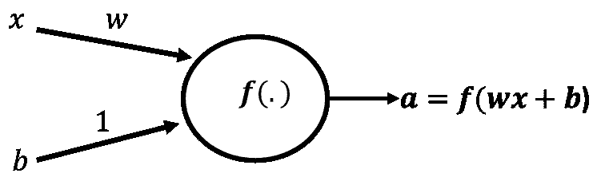
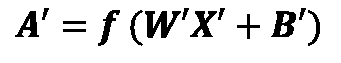
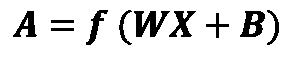
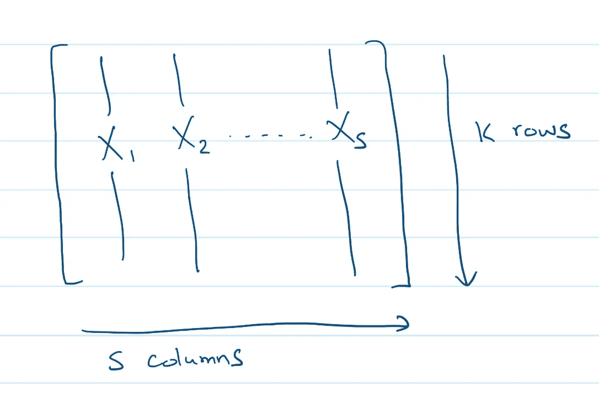
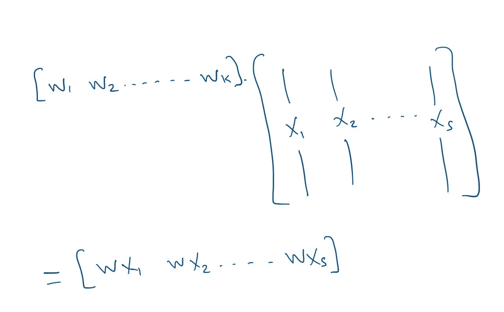
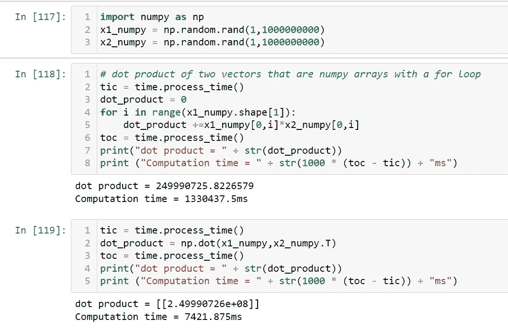
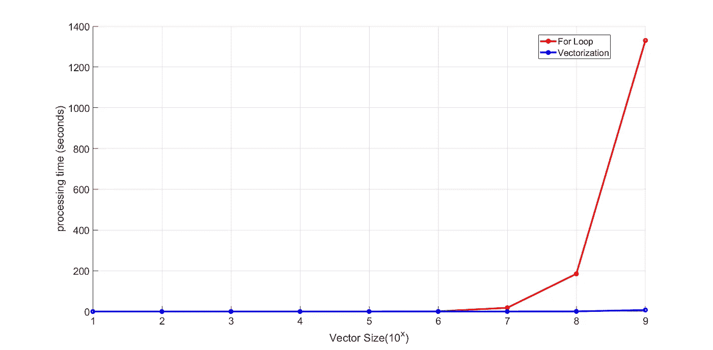

# 了解深度学习的矢量化

> 原文：<https://towardsdatascience.com/understand-vectorization-for-deep-learning-d712d260ab0f>

## 深度学习

## 与“for”循环相比，Python 中的 NumPy 在处理十亿次乘法时要快 10，000%以上。


马库斯·克里斯蒂亚在 [Unsplash](https://unsplash.com?utm_source=medium&utm_medium=referral) 上的照片

这篇文章将向你介绍矢量化，以及它在机器学习(尤其是深度学习)中的重要性。您还将学习如何使用 NumPy 在 Python 中实现它，以及它带来了多大的不同。

这篇文章假设了线性代数的最低背景。你应该知道什么是向量，什么是矩阵，我们怎么把向量和矩阵相乘。除了这些，我会在我们进行的过程中介绍其他的东西。

# 为什么矢量化很重要？

当谈到将机器学习应用于给定的问题时，通常没有确定性的公式可以告诉你将做得很好的精确架构或超参数。不管任何人声称什么，这个过程都是通过反复试验来实现的。它本质上是经验主义的。



改编自吴恩达的深度学习课程(图片由作者提供)

这就是为什么我们需要将数据集分成不同的部分，训练集、开发集(有时也称为验证集)和测试集。我们使用开发集来选择正确的超参数和架构集，如果结果不够好，就进行迭代。

## ***我们需要速度更快的迭代，找到好的解决方案***

随着你获得更多的经验，你会发展出某些直觉来帮助你更快地获得更好的结果。然而，这种方法仍然是经验性的。因此，速度不仅很好，而且绝对重要。如果你的算法训练得非常慢，那么迭代的可能性就会降低，从而找到“足够好”的结果的可能性也会降低。

## 引擎盖下的神经网络

在我继续举例说明之前，先简单介绍一下神经网络(深度学习算法的基本单元)。神经网络的单层由一些输入( ***x*** )、偏差项( ***b*** )、权重( ***w*** )和非线性函数(称为激活函数)组成。从数学上讲，这是一个简单的数学运算，包含线性和非线性部分。

深度学习算法由这种堆叠在一起的神经网络层组成。训练神经网络包括向前传递和向后传递。在向前传递的过程中，我们进行预测。在反向传递过程中，我们将预测结果与实际结果进行比较，并使用误差来更新神经网络的权重。然后我们重复这个过程。

让我们绘制一个简单网络的单层来说明矢量化的思想。在这里，我只展示了一个神经元作为说明，用一个数字， *x，*作为输入，另一个数字，b(称为偏差)。



单个神经元具有单个一维输入 x、偏置项和非线性激活函数 f(图片由作者提供)

在现实世界的应用中，输入 *x* 将会有多个维度。此外，我们将拥有多个神经元，而不是每层只有一个神经元。由于矩阵和向量，我们仍然可以用多维输入(用一个涉及矩阵的方程)来表示和计算给定层中多个神经元的数学方程。



单层的数学运算(图片由作者提供)

对于上面的等式，矩阵***W’***将具有尺寸为 *m* 乘 *k* ( *m* 行，每行对应一个神经元，以及 *k* 列，其中每列对应给定样本中的每个特征)，***【X’***将是一个 *k* 乘1 *【T25)*

以上是单个数据样本的单层神经网络的前向传递方程，***X’***。如果我们要对每个数据样本重复这个操作，那就太麻烦了。想象一下当训练数据集有超过一百万个数据点时这样做。

幸运的是，我们不需要对每个数据样本重复上述过程。相反，我们可以传递整个训练数据集，并在一个步骤中计算输出。



使用所有训练数据时单个图层的数学运算(图片由作者提供)

除了量纲不同之外，这个方程看起来与前面的方程非常相似。 ***X*** 不再是单个 *k* 维数据点，而是整个数据集的矩阵，其维数为 *k* 乘 *s* ，其中 s 是样本总数(一百万以上并不罕见)。



整个训练数据排列成一个大矩阵 X，其中每一列是 k 维样本，总共有 s 个样本(图片由作者提供)

## 深度学习只有在我们拥有大型数据集的情况下才有意义

深度学习在许多情况下超过传统算法的一个主要原因是大型数据集的可用性。事实上，如果数据集很小，使用传统的学习算法会更好。

想象一下，如果我们有一百万个数据样本可以用来训练。如果没有任何矢量化，我们将不得不依次对每个示例进行乘法和加法运算。我们需要一个“for”循环，从每个矩阵中挑选相应的项，并将它们相乘。矢量化使我们能够避免这种“for”循环，并在一个步骤中使用所有数据。



实现神经网络前向传播部分的矢量化版本的矩阵乘法的图示

## 在 Python 中是如何实现的？

在 python 中，我们可以使用 Numpy 来帮助我们实现神经网络。Numpy 代表数字 Python。这是一个开源项目，它提供了线性代数和矩阵的函数。在基本 Python 中，列表可以用作数组。然而，Numpy 提供的数组对象(ndarray)比 Python 列表快几个数量级。

在内部，NumPy 将数组存储在一个连续的内存位置。此外，NumPy 经过优化，可与最新的 CPU 架构配合使用。因此，NumPy 被广泛用于数据科学并不奇怪。

如果没有矢量化，我们将被迫使用“for”循环进行矩阵/向量乘法。让我们看看用 for 循环和矢量化(从而避免 for 循环)将两个向量相乘时执行时间的差异。

下面我将生成两个大小为“array_size”的随机 NumPy 数组。

```
import numpy as np
import time
array_size = 1000000
x1_numpy = np.random.rand(1,array_size)
x2_numpy = np.random.rand(1,array_size)
```

然后，我将使用“for”循环计算这两个向量的乘积，并估计所需的时间。

```
tic = time.process_time()
dot_product = 0
for i in range(x1_numpy.shape[1]):
    dot_product +=x1_numpy[0,i]*x2_numpy[0,i]
toc = time.process_time()
print("dot product = " + str(dot_product))
print ("Computation time = " + str(1000 * (toc - tic)) + "ms")
```

然后，我将使用内置的 NumPy 函数估计使用矢量化版本所需的时间。

```
tic = time.process_time()
dot_product = np.dot(x1_numpy,x2_numpy.T)
toc = time.process_time()
print("dot product = " + str(dot_product))
print ("Computation time = " + str(1000 * (toc - tic)) + "ms")
```

对于一个大小为 10 亿的数组，For 循环需要 1，330，437 毫秒(约 22 分钟)。矢量化方法仅用了 7，421 毫秒(约 7 秒)。这相当于快了 179 倍以上(17，900%！).



进行 10 亿次乘法运算时，比较矢量化版本和非矢量化版本

毫不奇怪，随着数组大小的增加，这两种方法之间的差异变得很明显。我针对不同的数组大小(从 10 到 10 亿)重复了上述步骤，并计算了计算所需的总时间。



对于从 10 到 10 亿的不同向量大小，比较使用“for”循环和矢量化版本的处理时间。(图片由作者提供)

# 最后的想法

我在这个领域已经工作了十多年了。我认为深度学习现在起飞的三个关键原因是大量数据的可用性、可用的计算能力和算法的创新。矢量化是一项惊人的算法创新。我不相信没有矢量化，深度学习就不会起飞。

[](https://ahmarshah.medium.com/membership) [## 通过我的推荐链接加入 Medium-Ahmar Shah 博士(牛津)

### 阅读艾哈迈尔·沙阿博士(牛津)的每一个故事(以及媒体上成千上万的其他作家)。您的会员费直接…

ahmarshah.medium.com](https://ahmarshah.medium.com/membership)