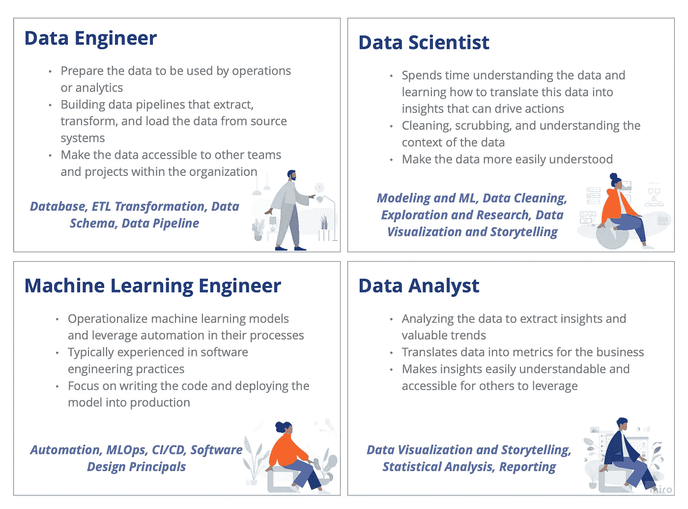
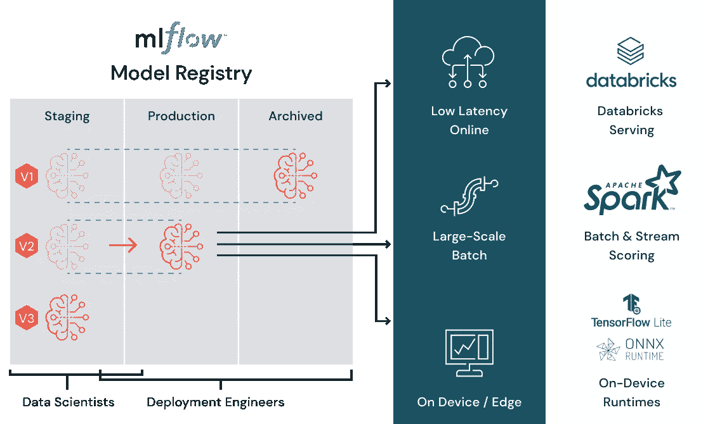

# 了解您的数据平台用户，并为他们提供成功的工具

> 原文：<https://towardsdatascience.com/understand-your-data-platform-users-and-provide-them-with-the-tools-for-success-67176a278746>

## 在您的数据平台中需要了解的 4 个常见角色

照片由[在](https://unsplash.com/@theblowup?utm_source=medium&utm_medium=referral) [Unsplash](https://unsplash.com?utm_source=medium&utm_medium=referral) 上放大

在一个数据平台上工作，你会看到许多用户出于不同的原因来到这个平台。他们可以是对数据感兴趣的人，也可以是希望更多地了解如何使用数据的人，也可以是每天应对这些挑战的专业开发人员。您将会看到许多角色来利用您的数据平台。我见过的最常见的四种角色是数据工程师、数据科学家、机器学习工程师和数据分析师。当你和这些不同的人一起工作时，你开始理解他们的需求和他们试图解决的共同问题。利用这些信息，您可以找到一个解决方案来解决他们的问题，并能够帮助推动您的数据平台取得成功。正如我常说的，沟通不能是事后的想法。这应该是你的团队每天的练习。因此，让我们来讨论这些典型的人物角色，以及您如何理解他们的团队需求，以便您可以交付对他们有价值的工具和解决方案。

# 4 个常见角色

正如简介中提到的，我见过四种最常见的角色并与之共事:数据工程师、数据科学家、机器学习工程师和数据分析师。这些不同的小组可能有共同的技能和他们关注的领域，但他们也有一些重要的差异，可以在他们如何使用您的平台时发挥作用。

在下图中，我将四个人物角色分解为他们的基本功能和帮助他们实现这些功能的技能子集。

作者使用米罗创作的图像，插图由 [Pablo Stanley](https://www.humaaans.com/) 绘制

在本次讨论中，让我们将机器学习工程师角色作为我们使用 Databricks 的理论数据平台的重点。然后，当我们将机器学习工程师引入 Databricks 环境时，他们可能会花至少一个月的时间来首次适应新的工作环境。

对于大多数人来说，这将从访问适当的工具和下载必要的工具开始，比如 IDE。他们还需要数据访问、存储库和笔记本访问，以及您的团队在他们进入平台时为他们提供的任何其他工具。一旦进入，他们就可以开始阅读、学习和理解他们将日常使用的数据和机器学习模型。最后，他们将了解团队如何利用机器学习和遵循的最佳实践，包括 MLOps、软件和设计原则。

# 了解他们的需求

现在你的机器学习工程师已经进入了他们的团队和你的平台，你需要了解他们的需求。在你的平台上引入一个新的团队不是一劳永逸的事情；您将在这个团队的整个工作周期中与他们在一起，直到他们不再使用您的平台。随着时间的推移，团队会发生变化，他们和客户的需求也会发生变化，这意味着您的沟通会持续不断地变化。那么我们如何开始评估他们的需求呢？谈论他们遇到的问题。

在这个例子中，如果我们与我们的机器学习工程师坐下来，询问他们遇到的最重要的问题，我们会得到各种答案。例如:

*   数据杂乱无章，有时甚至不准确。同样，我也看到了真相的另一个来源。我应该使用哪个数据集，为什么？
*   我们团队的模型没有在一个地方被有效地跟踪，并且我不能快速地确定我们有多少模型在生产中。
*   将我们的 ML 模型投入生产的过程相对较慢。

问题是永无止境的，但是现在你已经和你的工程师有了沟通的渠道，你可以理解他们最重要的问题和你能提供的可能的解决方案。但是我们不能就此止步。有些陈述有些模糊，你可能看不到全貌，所以你应该带着更多的问题深入探讨。

你的问题可能每次都不一样，这没关系。提出问题的目的是全面了解他们的当前状态、他们面临的问题以及您可以在哪些方面提供帮助。不幸的是，并不是每种情况都是平台问题；有时候，要靠团队自己去解决。当你讨论这些问题时，你自己和帮助你的工程师都会发现哪些问题需要解决。

如果您不确定如何进行这些讨论，并且正在寻找一个可能有所帮助的框架，请考虑一下五个为什么。该框架通常用于有效地分解问题，以帮助故障排除或解决问题。

让我们看看本案例中陈述的后两个问题，以及您可能会问的一些问题:

**问题**:我们团队的模型没有在一个地方被有效地跟踪，我无法快速确定我们有多少模型在生产中。将我们的 ML 模型投入生产的过程相对较慢。

**角色**:机器学习工程师

1.  **为什么你的模型没有被跟踪？团队为什么要跟踪模型？**当您想知道哪些已经部署到生产环境中，哪些还没有部署时，跟踪您的模型的不同版本和开发阶段是很有帮助的。但是并不是每个团队都使用某种形式的版本控制来跟踪这些信息。
2.  你为什么跟踪你的代码？您是否跟踪软件的版本，这些信息保存在哪里？由于工程师没有使用任何模型版本控制，下一个最好的问题是询问团队是否对代码使用任何版本控制。通过问这个问题，我们可以更好地理解团队为他们的代码和模型准备的过程。
3.  **为什么团队不给模型或者软件分配一个版本号？**团队正在跟踪代码，但没有跟踪版本变化。询问为什么会出现这种情况会让你深入了解他们的问题。例如，他们可能不知道如何适当地跟踪他们的机器学习模型的版本。
4.  **为什么你看不清团队有多少型号？模型是否以易于理解的格式存储，并带有名称？**如果团队有 50 个他们已经创建并正在积极开发的模型，他们需要一种方法来理解和区分这些模型。这不仅仅是一个版本号。我们需要一个与该模型相关的名称来了解它是什么。我们可能想问这个问题，以了解模型目前是如何命名的，以及这种命名约定是否有意义。如果我们试图预测我们所在地区的天气，那么 model_1 这个名称比 weather_forecast_predictor 这个名称更难以描述。这些名字可能仍然不完美，但是您会认为在第二个例子中它们更易读。
5.  **为什么将模型投入生产的过程很慢？你是否缺乏自动化？**我们之前在与机器学习工程师的对话中讨论过，他们使用版本控制，但我们可能没有涵盖他们是否以任何方式使用 CI/CD 或 MLOps 管道。随着对话的进行，我们可以讨论模型目前是如何进入生产的。对于一些人来说，这看起来像是将笔记本或代码移动到生产环境中的手动过程。其他人可能已经使用 CI/CD 将他们的代码部署到生产环境中，但是他们面临着我们上面已经讨论过的问题。回到我们的机器学习工程师，他们的过程很慢，因为没有一个优秀的策略来将模型从开发转移到生产。由于我们的模型没有被版本化，我们不能快速地通过不同的阶段，并且能够在模型上线之前跟踪模型是如何改进的。

**应对措施**:找到一种工具或解决方案，让您平台上的机器学习工程师能够根据版本和名称跟踪和注册他们的模型，同时为他们提供一种快速有效地将代码转移到生产的过程自动化的方法。

# 交付工具和解决方案

现在，您已经了解了平台上人员的角色，并评估了他们的需求和面临的问题，您可以确定您可以提供的工具或解决方案。根据您的数据平台，这可能会因您解决问题的方式而异。例如，您的平台可能在一个云平台中有不同的服务，这些服务是相互连接的。在这种情况下，您可以考虑如何集成新的服务来解决这些问题。相反，你的平台可能是你的团队使用的一个特定的服务，比如 Databricks。看到这里时，您可能希望向您的用户推荐一个已经可用的平台特性。这样，您就不必支付额外的服务费用，只需支付流程中使用的任何集群的额外费用。

无论您的平台是什么，您都可以评估哪些工具和服务目前可供您使用，并先看看它们是否适合该用例。问问你自己，在我的组织中是否已经有了一个解决这个问题的已知方案，在我寻找新的方案之前，我能向团队提供这个方案吗？你可能经常能够用一个“固定的”回答来回答这个问题，因为其他人已经面对这个问题并且问过同样的问题。有时你需要寻找其他的东西，做更多的研究来解决这个问题。

当面对一个新问题时，我从导师那里得到的最好的建议是总是寻找最直接的解决方案或工具。我们并不总是需要从零开始创造一些东西，或者选择最复杂的方法来解决问题。有时最简单的解决方案可以提供最好的结果。

让我们回顾一下之前的例子。首先，让我们将收集到的信息进行分解，看看是否可以推荐一个可能对团队有用的工具。

1.  **为什么你的模型没有被跟踪？团队为什么要跟踪模型？**团队目前无法通过部署过程跟踪模型。
2.  **你为什么跟踪你的代码？您是否跟踪软件的版本，这些信息保存在哪里？**团队使用 Github——到目前为止，我们还没有足够的信息来推荐工具或解决方案。
3.  **为什么团队不给模型或者软件分配一个版本号？**就在这里，我们可以引入 MLFlow 来帮助对模型进行版本控制，但是让我们继续询问以确保没有其他事情发生。
4.  **为什么你看不清团队有多少型号？模型是否以易于理解的格式存储，并带有名称？**当我们考虑这个问题时，MLFlow 在这种情况下仍然是有用的，因为我们可以使用注册中心进行版本控制和模型命名。可能的解决方案没有改变。
5.  **为什么将模型投入生产的过程很慢？你是否缺乏自动化？**同样，MLFlow 将是这位工程师的绝佳解决方案。模型可以在工具中进行版本化和注册，然后您可以在开发、试运行、生产和归档的各个阶段之间移动。这个过程允许从开始到结束的模型的生命周期管理，同时也提供了团队可以用来跟踪和实验的其他工具。

通过与团队和机器学习工程师的讨论，您可以建议他们考虑将 [MLFlow](https://www.mlflow.org/) 用于模型注册。MLFlow 是在机器学习生命周期中使用的开源平台。该工具将带来以低延迟大规模部署机器学习模型的能力。MLFlow 的模型注册将允许团队在将不同的模型部署到产品中时跟踪它们的模型名称和版本。如果团队在其平台中利用 Databricks，那么 Databricks 已经提供了该工具的托管版本。

[Databricks](https://www.databricks.com/product/machine-learning) 机器学习的托管 ml 流程图

在理想的世界里，所有的问题都会有简单的解决方法。但在现实中，你可能并不总能找到一个完美的解决方案或工具来解决他们的所有问题，这没关系。你不需要知道所有的答案，也不需要自己解决每一个问题。相反，您提供了一个地方来进行讨论，了解问题，并确定什么是可行的，什么是不可行的。你把结果传达给其他人。最后，让它成为一个迭代学习的过程，每个人都觉得他们可以为团队的成功做出贡献。

# 最后的想法

您将会看到许多角色来利用您的数据平台。四个是数据工程师、科学家、机器学习工程师、数据分析师。通过了解你的人物角色和他们的需求，你可以为他们提供在日常工作中取得成功所需的工具和解决方案。但是，正如我经常说的，沟通不能是事后的想法。这应该是你的团队每天的练习。

**您如何定义您的数据平台上的不同角色，并确保您提供适合他们需求的工具？**

# 资源

*   [数据分析和数据科学有什么区别？](https://online.hbs.edu/blog/post/data-analytics-vs-data-science)作者[蒂姆·斯托比耶斯基](https://online.hbs.edu/blog/?author=Tim+Stobierski)
*   [机器学习工程师对数据科学家](https://www.snowflake.com/trending/machine-learning-engineer-vs-data-scientist)由雪花
*   [克里斯汀·伯纳姆的《数据分析 vs .数据科学:一次失败》](https://www.northeastern.edu/graduate/blog/data-analytics-vs-data-science/)
*   [5 个为什么——通过思维工具快速找到问题的根源](https://www.mindtools.com/pages/article/newTMC_5W.htm)
*   [MLFlow](https://www.mlflow.org)
*   [Databricks 机器学习能力](https://www.databricks.com/product/machine-learning)

感谢阅读！我希望你喜欢阅读我所学到的东西。如果你愿意，你可以通过使用这个链接成为一个媒体成员来支持我的写作。