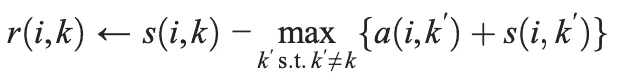
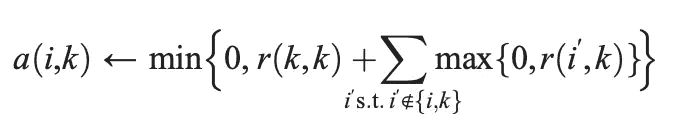
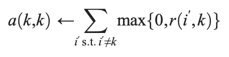
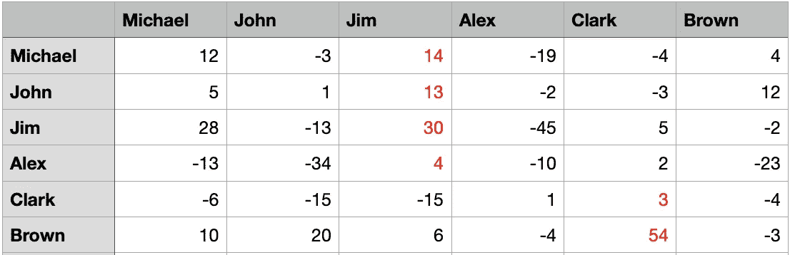

# 了解相似性传播聚类和 Python 实现

> 原文：<https://towardsdatascience.com/understanding-affinity-propagation-clustering-and-implementation-with-python-c1e78fe57cde>

## 无监督学习

## 最常用的聚类方法之一，相似性传播，连同 Python 的实现一起被清楚地解释


由[卢卡](https://unsplash.com/@madebyluca?utm_source=medium&utm_medium=referral)在 [Unsplash](https://unsplash.com?utm_source=medium&utm_medium=referral) 上拍摄的照片

A 模糊传播是数据科学中使用最广泛的聚类方法之一。它既没有对聚类形状的假设，也不需要聚类的数量作为输入。相似性传播的另一个优点是它不依赖于初始聚类质心选择的任何运气。

在这篇文章中，我将详细介绍如何理解和使用 Python 中的仿射传播。

## 亲和传播的主要思想

我们来想想社会上大多数人的行为。

> 一开始，你谁都不认识，所以你是你自己的代表。然后，在你认识更多的人之后，在一些交流之后，你发现有些人和你有相似的价值观，有些人很难相处。所以，你倾向于和那些和你相似的人有更多的互动，避免和那些在你眼里“怪异”的人混在一起。随着沟通次数的增加，你终于找到了你的“小组”，你的脑海中出现了一个可以完美代表你的小组的候选人。

其实我所描述的正是亲和传播的 ***基本思路*** 。

该算法使用数据点之间的*“通信”*来为每个数据点寻找*“样本”*。并且共享相同*“样本”*的数据点被分配到相同的聚类(组)。

尽管算法的想法很简单，但在上面的描述中仍然有一些令人困惑的地方。你可能已经注意到，最大的缺失部分是那些 ***【沟通】*** 是如何执行的。

让我们使用与上面相同的例子。“沟通”实际上是你和你心目中的团体代表候选人之间传递的信息。如果你发现迈克尔是你的最佳候选人，你可以发短信给他，“迈克尔，我认为你应该是代表我的人。”

然后，也许迈克尔会回答:“我很感激。我很乐意这么做！”

或者，迈克尔会回答:“谢谢你信任我。然而，考虑到所有其他人都有同样的要求，我没有足够的带宽向您介绍。抱歉。”

然后，根据迈克尔的回答，你将调整你心目中的代表候选人的排名，并再次向他们发送消息。之后，迈克尔将再次收到所有人(包括你)发来的信息，说他们多么渴望迈克尔成为他们的代表。然后他会从那里开始调整…

我描述的过程正是仿射传播中的迭代。你发送给迈克尔的信息在算法中被称为 ***【责任】*** ，这表明迈克尔非常适合作为你的样本，同时考虑到你的其他潜在样本。

迈克尔发回的信息被称为 ***【可用性】*** ，它反映了考虑到其他人对迈克尔应该成为榜样的支持，你选择迈克尔作为榜样是多么合适。

那么，通信应该在什么时候停止呢？当范例和他们所代表的人群没有大的变化时，就是这样。

## 该算法

在深入研究算法之前，我们需要理解几个矩阵。

第一个是相似度矩阵， ***S*** ，是数据点之间相似度的集合，其中相似度 ***s(i，k)*** 表示数据点 ***k*** 与数据点 ***i*** 的相似度。

直观上，相似度值越大，两个数据点之间的距离越小。因此，传统上，负欧几里德距离用于定义相似性。这里， ***s(i，k)*** ，点 ***i*** 与点 ***k*** 的相似性，是

> s(i，k)= | | Xi xk | |

需要注意的是，相似度矩阵的对角线值***【s(k，k)】***在相似性传播中具有特定的含义和用法，而不是简单地被赋值为零。该设计是具有较大的值***【k，k】***的数据点更有可能被选为样本。

想象一下，所有的 ***s(k，k)*** 值都超级大。这意味着每个点肯定是自己的样本，其中每个数据点都是自己的聚类；然而，如果所有的***【s(k，k)*** 的值都非常小，那么所有的数据点都不能作为自己的样本，所有的数据点都属于同一个大的聚类。

我们可以看到，相似度矩阵对角线上的值可以影响最终检测到的聚类数，因此命名为“偏好”。我们知道上述两种情况都不理想，所以我们必须为首选项初始化好的值。

因为我们在开始时不知道数据点的偏好值，所以我们必须假设所有的数据点作为样本是同样可能的。因此，应该将首选项设置为一个公共值。根据经验，人们通常使用输入相似度的中值作为偏好值。

第二个矩阵是责任矩阵， ***R*** ，其中的****R(I，k)*** ，反映的是如何很好地将点 ***k*** 作为点 ***i*** 的样本，同时考虑到点 ***i*** 的其他潜在样本。*

*第三个矩阵是可用性矩阵， ***A*** ，其中****A(I，k)*** ，反映了点***【I***选择点 ***k*** 作为其范例是多么合适，同时考虑了其他点对该点***k*****

****该算法将 ***R*** 和 ***A*** 初始化为零矩阵，然后迭代更新 ***R*** 和 ***A*** 。****

*******R*** 使用以下等式更新。****

********

****作者图片****

****这个等式的构造相对简单。在第一次迭代时(记住 ***A*** 被设置为零矩阵)， ***r(i，k)*** 仅仅是点 ***i*** 和点**k*之间的相似性减去点***I*之间的最大**相似性***********

**在以后的迭代中，如果一个点具有比 ***i*** 更高的分数作为其他点的范例(比调查点更类似于其他点， ***i*** )，则该点的(***′***)可用性值将减少。在这种情况下，通过减小 ***max{a(i，k’)+s(I，k’)}***的值，会对***【I，k’)***产生负面影响，然后 ***r(i，k)*** 会得到加强，因为点***k’***相当于点 ***i*****

**因此，这个分数， ***r(i，k)*** 将显示出 ***k*** 与所有其他点相比是如何突出地成为*的范例。***

***要注意， ***r(i，i)*** 叫做自我负责，这表明点 ***i*** 是一个典范的可能性有多大。***

***下面是 ***A*** 的更新方式。***

******

***作者图片***

******

***作者图片***

***点 ***k*** 成为 ***i*** 的样例( ***a(i，k)*** )的可用性被设置为点 ***k*** 是样例( ***r(k，k)*** )加上外部最小设置试图将 ***a(i，k)*** 限制为零，以避免超大的正责任值。***

***自我可用性( ***a(k，k)*** )就是从所有其他点接收到的积极责任点 ***k*** 的总和。***

******A*** 和 ***R*** 在仿射传播算法中通过迭代不断更新，直到在固定次数的迭代后没有变化。***

******A*** 更新给定 ***R*** 和 ***R*** 更新给定 ***A*** 。听起来很像吧？***

***是的，该算法非常类似于 EM(期望最大化)算法。如果你对 EM 算法感兴趣，你可以[在这里](https://medium.com/towards-data-science/gaussian-mixture-models-with-python-36dabed6212a)阅读我以前的一篇帖子。***

***另一点要注意的是，阻尼因子总是用来避免迭代中的数值振荡。具体地，矩阵中的新值被定义为，***

> ****val_new =(丹皮事实)(val _ old)+(1-丹皮事实)(val_new)****

***当算法停止时，根据 ***R*** 和 ***A*** 之和做出最终决定。然后，每行的最大值的对应列名就是该行的样本。共享同一样本的行被分配到同一簇。***

***比如我们用一个人工矩阵作为下面的 ***R*** 和 ***A*** 的和矩阵，***

******

***A + R(图片由作者提供)***

***每行的最大值突出显示，对应的列是样本，其中是这个数据集中的 Jim 和 Clark。迈克尔、约翰、吉姆和亚历克斯属于吉姆组，而克拉克和布朗属于克拉克组。***

## ***履行***

***在 Python 中，算法是在 sklearn 包中实现的。我在下面列出了如何使用它，***

```
***from** **sklearn.cluster** **import** AffinityPropagation
clustering = AffinityPropagation(random_state=25).fit(X)
clustering.labels_*
```

***就是这样！相似性传播算法。很简单，对吧？***

***如果你喜欢阅读我的帖子，请[订阅我的电子邮件列表](https://jianan-lin.medium.com/subscribe)或[成为媒体](https://jianan-lin.medium.com/membership)的推荐会员(我会得到你的部分费用作为我写作的支持)。***

******

***照片由[卡迈恩·萨瓦雷斯](https://unsplash.com/@carminesavarese?utm_source=medium&utm_medium=referral)在 [Unsplash](https://unsplash.com?utm_source=medium&utm_medium=referral) 上拍摄***

***参考资料:***

***弗雷，布兰登 j .和德尔伯特.杜克。"通过在数据点之间传递消息进行聚类."科学 315.5814(2007):972–976。***