# 理解和实现更快的 R-CNN:一步一步的指南

> 原文：<https://towardsdatascience.com/understanding-and-implementing-faster-r-cnn-a-step-by-step-guide-11acfff216b0>

## 计算机视觉和目标检测

## 揭开对象检测的神秘面纱

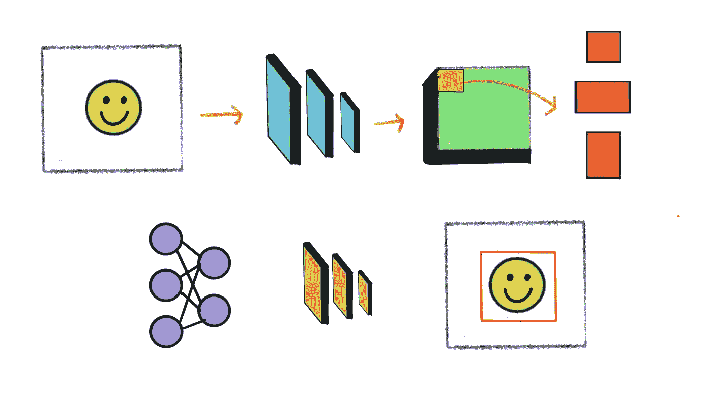

作者图片

我第一次接触对象检测是通过 Tensorflow 对象检测 API。它使用起来很简单。我传入一个海滩的图像，作为回报，API 在它识别的对象上画出方框。这似乎很神奇。我变得好奇，想要剖析 API，以了解它在幕后真正是如何工作的。很难，我失败了。Tensorflow 对象检测 API 支持最先进的模型，这些模型是数十年研究的成果。它们被错综复杂地编织成代码，就像钟表匠如何将连贯运动的微小齿轮组装在一起。

然而，大多数当前最先进的模型都建立在 fast-RCNN 模型奠定的基础之上，即使在今天，它仍然是计算机视觉中被引用最多的论文之一。因此理解它是至关重要的。

在本文中，我们将分解 fast-RCNN 文件，理解其工作原理，并在 PyTorch 中一部分一部分地构建它，以理解其中的细微差别。

# 更快的 R-CNN 概述

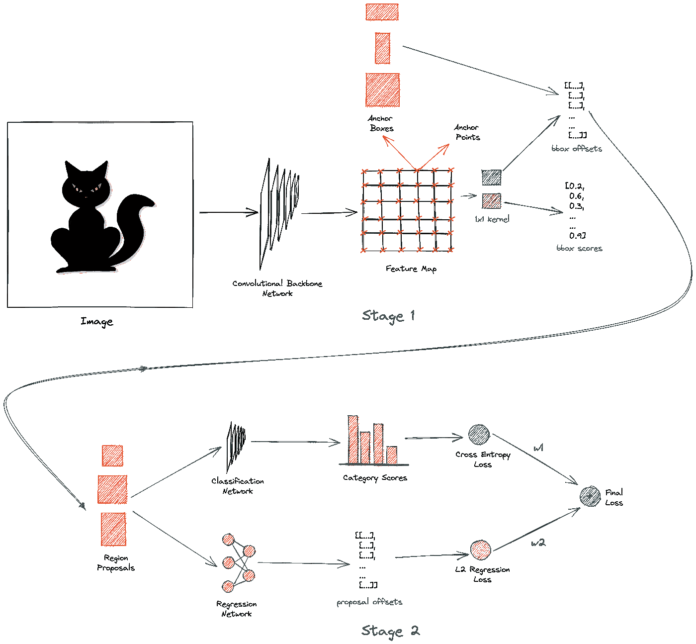

更快的 R-CNN 整体架构

对于物体检测，我们需要建立一个模型，并教它学会识别图像中的物体。更快的 R-CNN 模型采取以下方法:图像首先通过主干网络得到输出特征图，图像的地面真实边界框得到*投影*到特征图上。骨干网络通常是像 ResNet 或 VGG16 这样的密集卷积网络。输出特征图是表示图像的学习特征的空间密集张量。接下来，我们将这个特征图上的每个点视为一个*锚点*。对于每个锚点，我们生成多个不同大小和形状的盒子。这些锚定框的目的是捕捉图像中的对象。

我们使用一个`1x1`卷积网络来预测所有锚盒的*类别*和*偏移*。在训练期间，我们对与投影的地面真实框重叠最多的锚框进行采样。这些被称为*正向*或*激活*锚盒。我们还对*负*锚盒进行采样，这些锚盒与地面真值盒几乎没有重叠。正锚框被分配类别`object`，而负锚框被分配`background`。网络学习使用二进制交叉熵损失来分类锚盒。现在，正锚盒可能不会与投影的地面真相盒完全对齐。因此，我们训练一个类似的`1x1`卷积网络来学习预测来自地面真相盒的偏移。这些偏移应用于锚盒时，使它们更接近地面真实盒。我们使用 L2 回归损失来学习补偿。使用预测的偏移来变换锚盒，并将其称为*区域提议，*并且上述网络被称为*区域提议网络。这是探测器的第一阶段。fast-RCNN 是一个两级检测器。还有一个阶段。*

第二阶段的输入是第一阶段产生的区域提案。在第二阶段，我们学习使用简单的卷积网络来预测区域提议中的对象的类别。现在，原始区域建议具有不同的大小，因此我们使用一种称为 ROI pooling 的技术在通过网络之前调整它们的大小。这个网络学习使用交叉熵损失来预测多个类别。我们使用另一个网络来预测来自地面实况箱的区域提议的偏移。该网络还试图将地区提案与实地真相框联系起来。这使用 L2 回归损失。最后，我们对两种损失进行加权组合，以计算最终损失。在第二阶段，我们学习预测类别和偏移量。这就是所谓的多任务学习。

所有这些都发生在训练中。在推断过程中，我们通过主干网络传递图像并生成锚盒——与之前相同。但是，这一次我们只选择在第 1 阶段获得高分类分数的前 300 个盒子，并使它们有资格进入第 2 阶段。在第二阶段，我们预测最终的类别和偏移量。此外，我们使用一种叫做*非最大值抑制*的技术执行一个额外的后处理步骤来移除重复的边界框。如果一切正常，检测器会识别图像中的对象并在其上绘制方框，如下所示:

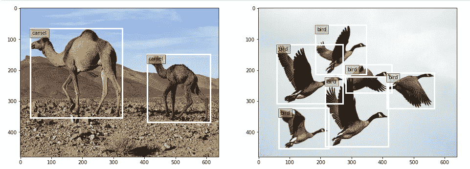

这是两级快速 RCNN 网络的简要概述。在接下来的几节中，我们将深入探讨每一部分。

# 设置环境

所有用到的代码都可以在[这个 GitHub 资源库](https://github.com/wingedrasengan927/pytorch-tutorials/tree/master/Object%20Detection)中找到。我们不需要太多的依赖，因为我们将从头开始构建。仅仅安装在标准 anaconda 环境中的 PyTorch 库就足够了。

这是我们将要使用的主要笔记本。只是浏览一下。我们将在接下来的几节中逐步介绍它。

# 准备和加载数据

首先，我们需要一些样本图像来处理。在这里，我从[这里](https://data.vision.ee.ethz.ch/cvl/DIV2K/)下载了两张高分辨率图像。

接下来，我们需要标记这些图像。CVAT 是最受欢迎的开源标签工具之一。你可以从这里免费下载。

您可以简单地将图像加载到工具中，在相关对象周围画出方框，并标记它们的类别，如下所示:

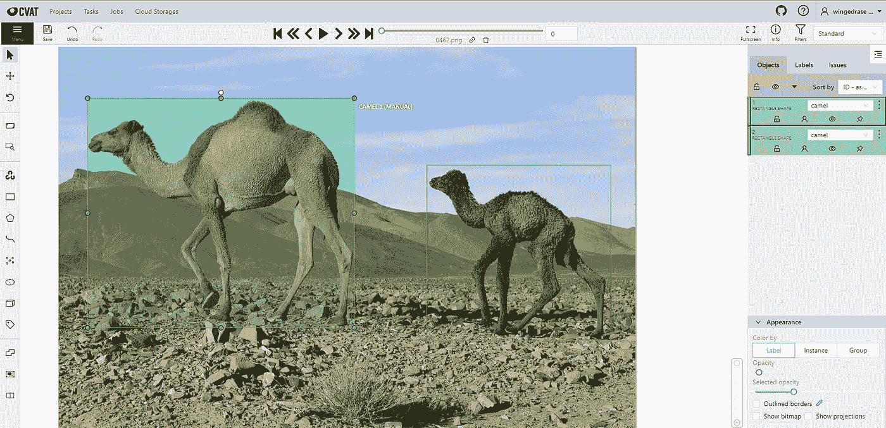

CVAT 的标签

完成后，您可以将注释导出为更好的格式。在这里，我将它们导出为`CVAT for images 1.1` xml 格式。

注释文件包含有关图像、带标签的类和边界框坐标的所有信息。

## PyTorch 数据集和数据加载器

在 PyTorch 中，创建一个从 PyTorch 的`Dataset`类继承的类来加载数据被认为是最佳实践。这将使我们对数据有更多的控制，并有助于保持代码的模块化。此外，我们可以从数据集实例创建一个 PyTorch `DataLoader`,它可以自动处理数据的批处理、混排和采样。

在上面的类中，我们定义了一个名为`get_data`的函数，它加载注释文件并解析它以提取图像路径、标签类和边界框坐标，然后将它们转换为 PyTorch 的`Tensor`对象。图像被调整到固定的大小。

注意我们填充了边界框。这与`resize`相结合，使我们能够将图像批量处理在一起。

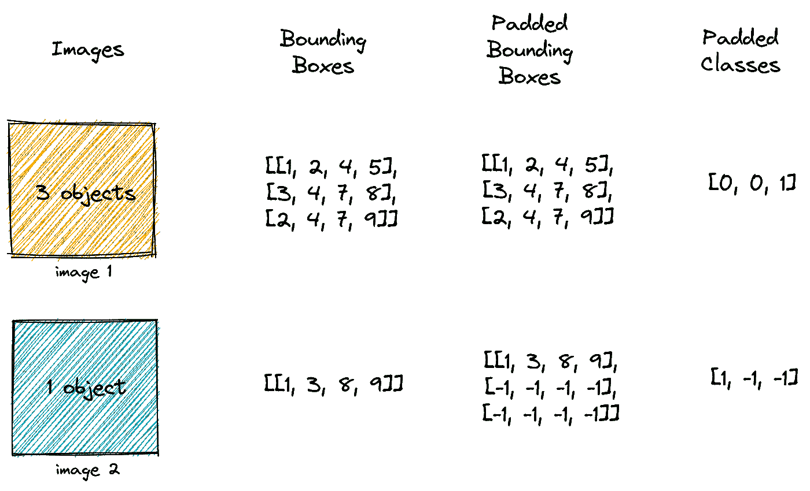

填充的工作原理

如果一批图像中有两个以上的图像，并且每个图像中的对象数量都不相同，那么我们会考虑任何图像中对象的最大数量，并使用-1 填充其余的图像，以匹配最大长度，如上图所示。我们填充边界框坐标以及类别。

我们可以从数据加载器中抓取一些图像，并将其可视化，如下所示:


我们将使用的示例图像

# 穿过主干网络

这里我们将使用 ResNet 50 作为主干网络。记住，ResNet 50 中的单个块是由瓶颈层的堆栈组成的。沿着空间维度，在每个块之后，图像缩小一半，而通道的数量增加一倍。瓶颈层由三个卷积层和一个跳跃连接组成，如下所示:

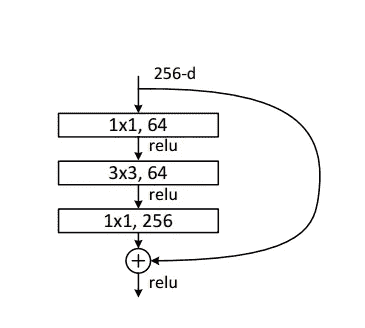

ResNet 50 中的瓶颈层。图片来自论文[用于图像识别的深度残差学习](https://arxiv.org/pdf/1512.03385.pdf)

我们将使用 ResNet 50 的前四个块作为主干网络。

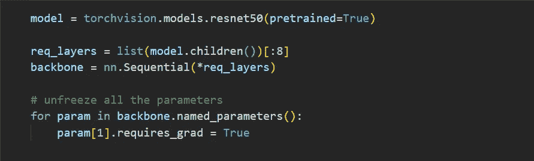

使用 ResNet 50 的前 4 个块作为卷积骨干网

一旦图像通过主干网络，它就会在空间维度上被向下采样。输出是图像的丰富特征表示。

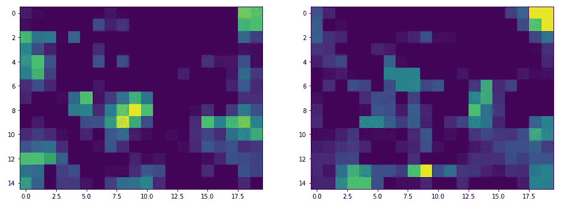

在将两个图像通过主干后，可视化它们的输出特征图。

如果我们通过主干网络传递大小为`(640, 480)`的图像，我们会得到大小为`(15, 20)`的输出特征图。所以图像被`(32, 32)`缩小了。

# 生成锚点

我们将特征图中的每个点视为一个锚点。所以定位点只是一个表示宽度和高度坐标的数组。

生成锚点

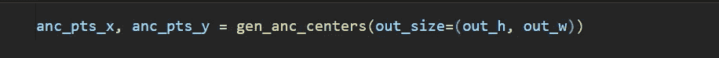

为了可视化这些锚点，我们可以简单地通过乘以宽度和高度比例因子将它们投影到图像空间。

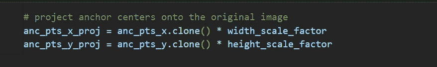

将锚点投影到图像空间

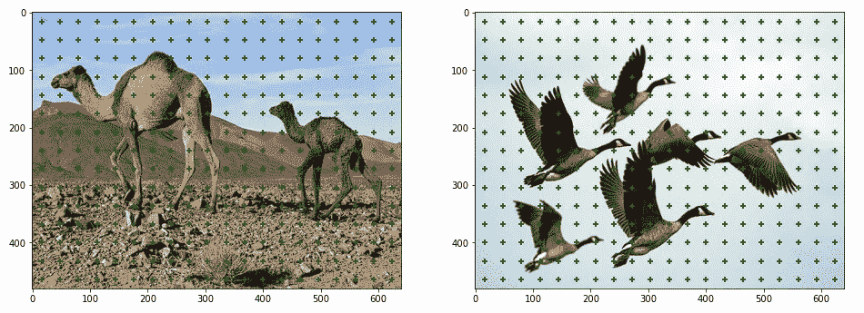

可视化原始图像上的定位点

# 生成锚盒

对于每个锚点，我们生成九个不同形状和大小的边界框。我们选择这些盒子的大小和形状，使它们包含图像中的所有对象。锚定框的选择通常取决于数据集。

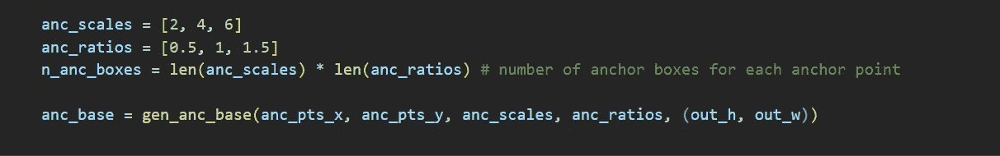

从 3 个比例和 3 个纵横比的组合中为每个锚点生成 9 个锚点框。

从比例和纵横比的组合中生成锚定框

调整图像大小的另一个好处是锚定框可以在所有图像中重复。


重复所有图像的锚定框，因为它们的大小相同

同样，为了可视化锚定框，我们通过乘以宽度和高度比例因子将它们投影到图像空间。

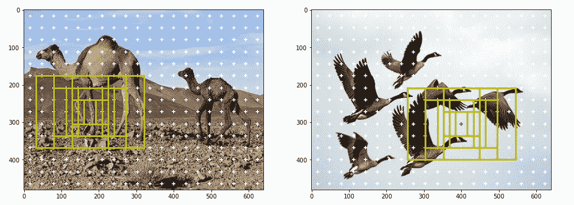

针对两幅图像的单个定位点，在图像空间中可视化定位框

如果我们将所有锚点的所有锚点框可视化，看起来会是这样:

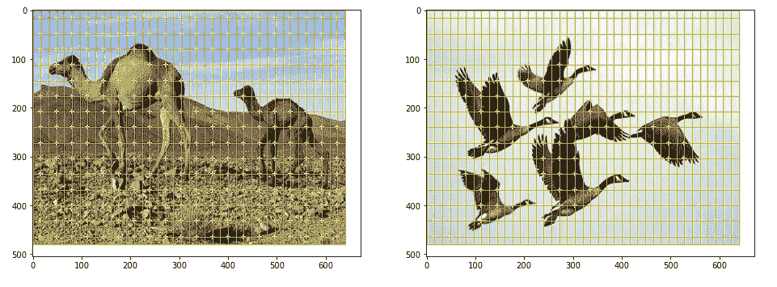

为两幅图像的图像空间中的所有定位点可视化定位框

# 数据准备

在本节中，我们将讨论培训的数据准备。

## 正负锚盒

我们只需要抽样几个锚箱进行训练。我们对正反锚盒都进行了采样。正锚定框包含对象，负锚定框不包含对象。为了对正锚盒进行采样，我们选择与任何基础真值盒具有大于 0.7 的 IoU 的锚盒，或者对于每个基础真值盒具有最高 IoU 的锚盒。当锚盒生成不良时，条件 1 失败，所以条件 2 来拯救，因为它为每个地面真值盒选择一个正盒。为了对负锚盒进行采样，我们选择 IoU 小于 0.3 的锚盒与任何基础真值盒。通常，阴性样本的数量会远远高于阳性样本。所以我们随机抽取一些样本来匹配阳性样本的数量。IoU 是度量两个边界框之间重叠的度量。

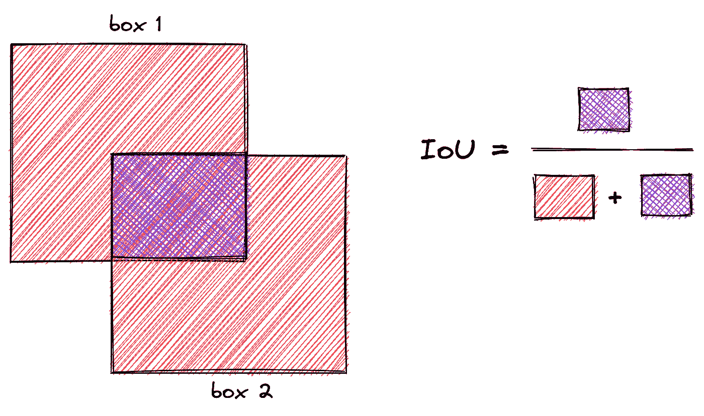

上面的函数计算 IoU 矩阵，该矩阵包含图像中每个锚框和所有地面真实框的 IoU。它将形状为`(B, w_amap, h_amap, n_anc_boxes, 4)`的锚盒和形状为`(B, max_objects, 4)`的地面真相盒作为输入，并返回形状为`(B, anc_boxes_tot, max_objects)`的矩阵，其中符号如下:

```
B - Batch Size
w_amap - width of the output activation map
h_wmap - height of the output activation map
n_anc_boxes - number of anchor boxes per an anchor point
max_objects - max number of objects in a batch of images
anc_boxes_tot - total number of anchor boxes in the image i.e, w_amap * h_amap * n_anc_boxes
```

该函数实质上展平了所有锚定框，并使用每个基础真值框计算 IoU，如下所示:

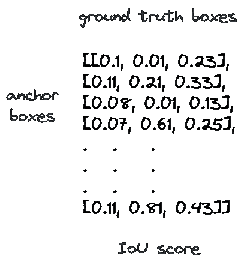

IoU 矩阵

## 投影地面真相盒

重要的是要记住，IoU 是在生成的锚框和投影的地面真值框之间的特征空间中计算的。要将地面真值框投影到特征空间上，我们只需将其坐标除以比例因子，如以下函数所示:

现在，当我们将坐标除以比例因子时，我们将数值四舍五入到最接近的整数。这实质上意味着我们将基础事实框“捕捉”到特征空间中最近的网格。因此，如果图像空间和特征空间的尺度差异很大，我们将无法获得准确的投影。因此，在目标检测中使用高分辨率图像是非常重要的。

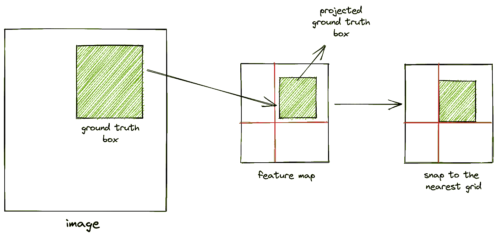

## 计算偏移量

正面锚定框与地面真实框不完全对齐。因此，我们计算正面锚盒和地面真相盒之间的偏移，并训练神经网络来学习这些偏移。失调可以通过下式计算:

```
tx_ = (gt_cx - anc_cx) / anc_w
ty_ = (gt_cy - anc_cy) / anc_h
tw_ = log(gt_w / anc_w)
th_ = log(gt_h / anc_h)Where:gt_cx, gt_cy - centers of ground truth boxes
anc_cx, anc_cy - centers of anchor boxes
gt_w, gt_h - width and height of ground truth boxes
anc_w, anc_h - width and height of anchor boxes
```

以下函数可用于计算相同的值:

如果你注意到了，我们正在教导网络去了解锚箱与地面真相箱有多远。我们没有强迫它预测锚盒的确切位置和规模。因此，网络学习的偏移和变换是*位置*和*比例*不变的。

## 代码走查

让我们浏览一下数据准备代码。这可能是整个存储库中最重要的功能。

该函数的主要输入是为一批图像生成的锚盒和投影的地面真相盒。

首先，我们使用上述函数计算 IoU 矩阵。然后，从这个矩阵中，我们为每个基础真值框取最重叠的锚框的 IoU。这是对阳性锚盒取样的条件 1。我们还应用条件 2，并选择 IoU 大于图像中任何地面真值框的阈值的锚框。我们组合条件 1 和 2，并对所有图像的阳性锚框进行采样。

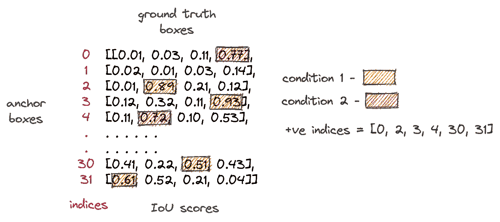

说明如何从 IoU 矩阵中抽取+ve 锚

每个图像将具有不同数量的阳性样本。为了避免训练过程中的这种差异，我们将整批图像展平，并将所有图像的阳性样本合并。此外，我们可以使用`torch.where`跟踪每个阳性样本的来源。

接下来，我们需要计算正样本相对于地面实况的偏移量。为此，我们需要将每个正样本映射到其对应的基础真值盒。值得注意的是，一个正锚定框只能映射到一个基础真值框，而多个正锚定框可以映射到同一个基础真值框。

为了进行这种映射，我们首先使用`Tensor.expand`扩展基础真相框以匹配总锚框。然后，对于每个锚定框，我们选择与它重叠最多的地面真相框。为此，我们从 IoU 矩阵中获取所有锚盒的最大 IoU 指数，然后使用`torch.gather`在这些指数处“聚集”。最后，我们将整批样品压平并过滤阳性样品。该过程如下所示:

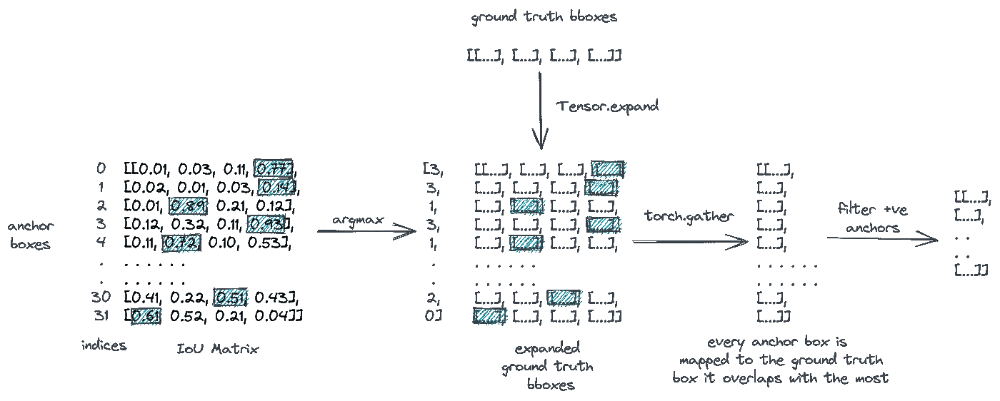

将每个锚框映射到它与 most 和 filter +ve 样本重叠的地面真实框

我们对类别执行相同的过程，为每个阳性样本分配一个类别。

现在，我们已经为每个正样本映射了一个地面真值框，我们可以使用上述函数来计算偏移。

最后，我们通过对 IoU 小于给定阈值的锚盒进行采样来选择负样本，其中*是所有*的基础真值盒。由于阴性样本在数量上远远超过阳性样本，我们随机选择了一些样本来匹配计数。

下面是正面和负面锚定框的样子:

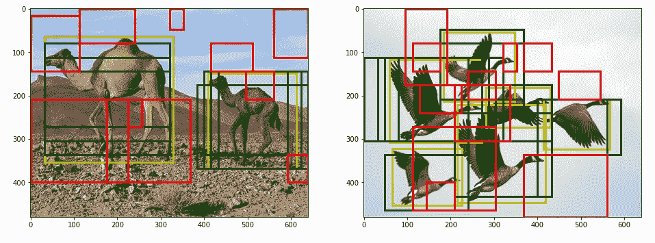

+ve 和-ve 锚盒的可视化。绿色:+ve，红色:-ve，黄色:地面实况

我们现在可以使用采样的正锚盒和负锚盒进行训练。

# 构建模型

## 提案模块

我们先从求婚模块开始。正如我们所讨论的，特征图中的每个点都被视为一个锚点，每个锚点都会生成不同大小和形状的方框。我们希望将这些盒子分类为`object`或`background`。此外，我们希望预测它们相对于相应的地面真相框的偏移。我们如何做到这一点？解决方法是使用`1x1`卷积图层。现在，`1x1`卷积层不会增加感受野。它们的功能不是学习图像级特征。它们更适合用来改变过滤器的数量，或者作为回归或分类头。

所以我们采用两个`1x1`卷积层，并使用其中一个将每个锚盒分类为`object`或`background`。让我们称之为信心头。因此，给定一个大小为`(B, C, w_amap, h_amap)`的特征映射，我们卷积一个大小为`1x1`的内核来得到一个大小为`(B, n_anc_boxes, w_amap, h_amap)`的输出。本质上，每个输出过滤器表示锚盒的分类分数。

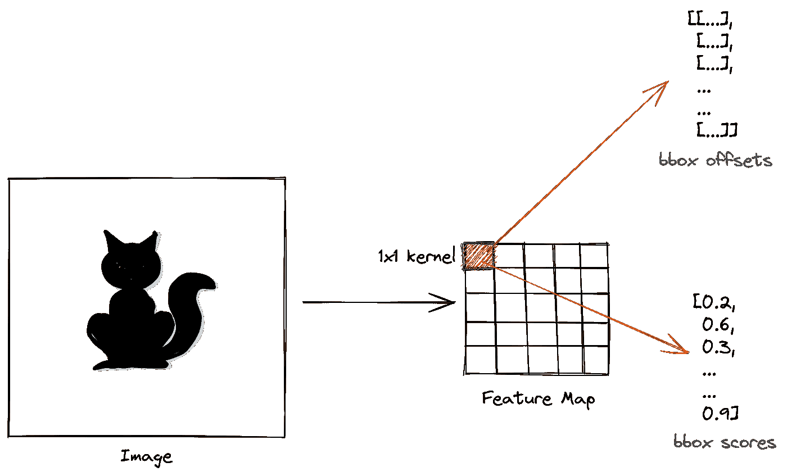

提议模块预测所有锚盒的偏移量和分数

以类似的方式，另一个`1x1`卷积层采用特征图并产生大小为`(B, n_anc_boxes * 4, w_amap, h_amap)`的输出，其中输出滤波器表示锚盒的预测偏移。这就是所谓的回归头。

在训练期间，我们选择正锚框并应用预测偏移来生成区域提议。区域建议可以计算如下:

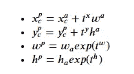

从锚盒和偏移计算区域建议

其中上标`p`表示区域提议，上标`a`表示锚定框，`t`表示预测偏移。

以下函数实现上述变换并生成区域建议:

## 区域提案网络

区域建议网络是检测器的第一级，它获取特征图并产生区域建议。在这里，我们将主干网络、采样模块和建议模块组合成区域建议网络。

区域提案网络

在训练和推断期间，RPN 为所有锚盒产生分数和偏移。然而，在训练期间，我们仅选择正锚盒和负锚盒来计算分类损失。为了计算 L2 回归损失，我们只考虑正样本的偏移量。最终损失是这两种损失的加权组合。

在推断过程中，我们选择得分高于给定阈值的锚框，并使用预测的偏移生成建议。我们使用 sigmoid 函数将原始模型逻辑转换为概率得分。

在两种情况下产生的建议被传递到检测器的第二级。

## 分类模块

在第二阶段，我们接收区域建议并预测建议中对象的类别。这可以通过一个简单的卷积网络来实现，但是有一个问题:所有的提议并不具有相同的大小。现在，你可能会想到在输入模型之前调整建议的大小，就像我们通常在图像分类任务中调整图像大小一样，但问题是调整大小是*而不是*一个可微分的操作，因此[反向传播](/backpropagation-in-rnn-explained-bdf853b4e1c2)不能通过这个操作发生。

这里有一个更聪明的调整大小的方法:我们将提议分成大致相等的子区域，并对每个子区域应用最大池操作，以产生相同大小的输出。这称为投资回报池，如下图所示:

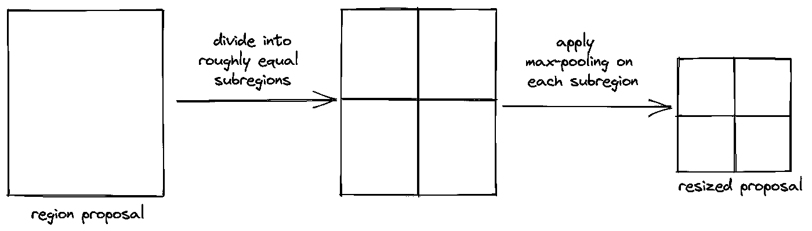

投资回报池

最大池是一个可微分的操作，我们一直在卷积神经网络中使用它们。

我们不需要从头开始实现 ROI pooling，`torchvision.ops`库为我们提供了它。

一旦使用 ROI 池调整了建议的大小，我们就让它们通过一个卷积神经网络，该网络由一个卷积层、一个平均池层和一个产生类别分数的线性层组成。

在推理过程中，我们通过对原始模型逻辑应用 softmax 函数并选择具有最高概率得分的类别来预测对象类别。在训练过程中，我们使用交叉熵计算分类损失。

在一个全面的实现中，我们还在第二阶段包括了`background`类别，但是让我们把它留在本教程中。

在第二阶段，我们还添加了一个回归网络，进一步为区域建议生成偏移。然而，由于这需要额外的簿记，我没有把它包括在本教程中。

## 非最大抑制

在推理的最后一步，我们使用一种叫做非最大抑制的技术来移除重复的包围盒。在这种技术中，我们首先考虑具有最高分类分数的包围盒。然后，我们用这个盒子计算所有其他盒子的 IoU，并移除具有高 IoU 分数的盒子。这些是与“原始”边界框重叠的复制边界框。我们对剩余的盒子也重复这个过程，直到所有重复的都被删除。

同样，我们不必从头开始实现它。`torchvision.ops`图书馆提供给我们。NMS 处理步骤在上述阶段 1 回归网络中实现。

# 快速 RCNN 模型

我们将区域建议网络和分类模块放在一起，以构建最终的端到端 fast-RCNN 模型。

# 训练模型

首先，让我们在一个小的数据样本上过度拟合网络，以确保一切都按预期工作。我们正在使用一个带有 Adam optimizer 的标准训练循环，学习率为`1e-3`。

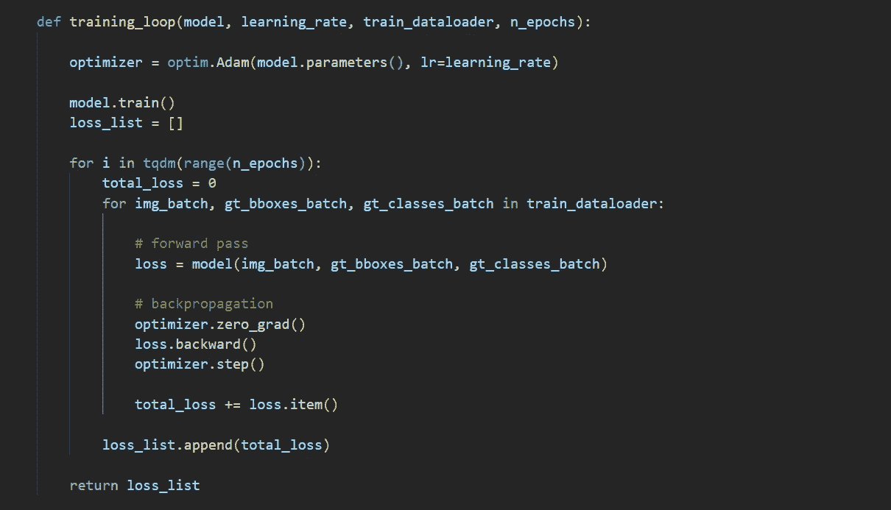

标准训练循环

结果如下:

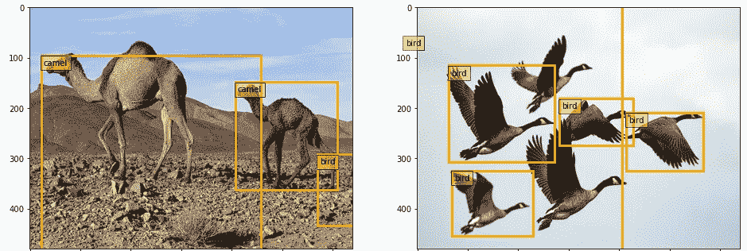

推理结果

由于我们只对一小部分数据进行了训练，该模型还没有学习图像级别的特征，因此结果并不准确。这可以通过在大数据集上训练来改善。

# 结论

在全面实施中，我们在 MS-COCO 或 PASCAL VOC 等标准数据集上训练网络，并使用平均精度或 ROC 曲线下面积等指标评估结果。然而，本教程的目的是理解更快的 RCNN 模型，所以我们将离开评估部分。

多年来，该领域取得了显著的进步，并且开发了许多新的网络。例子包括 YOLO、EfficientDet、DETR 和 Mask-RCNN。然而，它们中的大多数都是建立在我们在本教程中讨论过的更快的 RCNN 模型的基础之上的。

我希望你喜欢这篇文章。该代码可在 [GitHub](https://github.com/wingedrasengan927/pytorch-tutorials/tree/master/Object%20Detection) 获得。我们来连线。你也可以通过 [LinkedIn](https://www.linkedin.com/in/neerajkrishnadev/) 或 [Twitter](https://twitter.com/WingedRasengan) 联系我。

## 数据集确认

本文中使用的两幅图像来自于 [DIV2K 数据集](https://data.vision.ee.ethz.ch/cvl/DIV2K/)。数据集在 [CC0:公共领域](https://creativecommons.org/publicdomain/zero/1.0/)下获得许可。

```
@InProceedings{Agustsson_2017_CVPR_Workshops,
	author = {Agustsson, Eirikur and Timofte, Radu},
	title = {NTIRE 2017 Challenge on Single Image Super-Resolution: Dataset and Study},
	booktitle = {The IEEE Conference on Computer Vision and Pattern Recognition (CVPR) Workshops},
	month = {July},
	year = {2017}
}
```

## 图像制作者名单

除非标题中明确注明出处，否则本教程中的所有图片均出自作者之手。

## 参考

*   [用于计算机视觉的深度学习，UMich](https://web.eecs.umich.edu/~justincj/teaching/eecs498/WI2022/)
*   [更快-RCNN 论文](https://arxiv.org/abs/1506.01497)