# 通过示例了解自动编码器:一步一步的教程

> 原文：<https://towardsdatascience.com/understanding-autoencoders-with-an-example-a-step-by-step-tutorial-a79d2ea2945e>

## 第二部分:可变自动编码器


在 [Unsplash](https://unsplash.com?utm_source=medium&utm_medium=referral) 上由[Tine ivani](https://unsplash.com/@tine999?utm_source=medium&utm_medium=referral)拍摄的照片

# 介绍

自动编码器很酷，**变型自动编码器更酷！**

这是“*通过示例理解自动编码器*系列的第二篇(也是最后一篇)文章。在 [**第一篇文章**](https://medium.com/p/693c3a4e9836) 中，我们生成了一个*合成数据集*并构建了一个普通的自动编码器来重建圆的图像。


一个重建的圆圈，从第一个帖子开始。图片作者。

> 我们将再次使用相同的合成数据集，因此如果需要的话，请查看“[一个类似 MNIST 的圆形数据集](https://medium.com/p/693c3a4e9836#d28b)”部分进行复习。

在本文中，我们将关注一种不同的自动编码器:*可变自动编码器(VAEs)。*我们还将了解什么是著名的*重新参数化技巧*，以及 *Kullback-Leibler 发散/损失的作用。*

我们邀请您在使用 Google Colab 运行随附笔记本的同时阅读这一系列文章，随附笔记本可从我的 GitHub 的“[随附笔记本](https://github.com/dvgodoy/AccompanyingNotebooks)”存储库中获得:

[](https://colab.research.google.com/github/dvgodoy/AccompanyingNotebooks/blob/main/Understanding%20AutoEncoders.ipynb)  

此外，我建立了一个*目录*来帮助你浏览两篇文章的主题，如果你把它作为一个**迷你课程**并且一次一个主题地浏览内容的话。

# 目录

## 第一部分:普通自动编码器

*   [一个类似 MNIST 的圆形数据集](https://medium.com/p/693c3a4e9836#d28b)
*   [编码器](https://medium.com/p/693c3a4e9836#9828)
*   [潜在空间](https://medium.com/p/693c3a4e9836#dc2a)
*   [解码器](https://medium.com/p/693c3a4e9836#bcda)
*   [损失函数](https://medium.com/p/693c3a4e9836#1fef)
*   [自动编码器(AE)](https://medium.com/p/693c3a4e9836#4600)
*   奖励:[自动编码器作为异常检测器](https://medium.com/p/693c3a4e9836#1e0c)

## 第二部分:变化的自动编码器(本文)

*   [变分自动编码器(VAE)](https://medium.com/p/a79d2ea2945e#0e6a)
*   [重新参数化绝招](https://medium.com/p/a79d2ea2945e#19b6)
*   [库尔贝克-莱布勒发散/损失](https://medium.com/p/a79d2ea2945e#3443)
*   [损失的规模](https://medium.com/p/a79d2ea2945e#13ed)
*   [卷积变分自动编码器(CVAE)](https://medium.com/p/a79d2ea2945e#a1e5)

# 变分自动编码器(VAE)

在传统的自动编码器中，*潜在空间不是连续的*，也就是说，**不仅在“边缘”之外的*处，而且在从训练集中的图像映射的点*之间的*处，都有*空的*潜在空间***。这并不是说从“*空的*”空间中的点重建的图像只产生噪音/垃圾——在第一篇文章中我们甚至把它们弄出了一些圆圈——但是这并不能保证一个更复杂的问题。

> "那么我们可以让潜在空间**连续**吗？"

你打赌！让我们以这样的方式修改普通的自动编码器，**不是在潜在空间中产生*点*，而是在潜在空间**中产生*分布*。我给你介绍**变型自动编码器(VAE)** ！

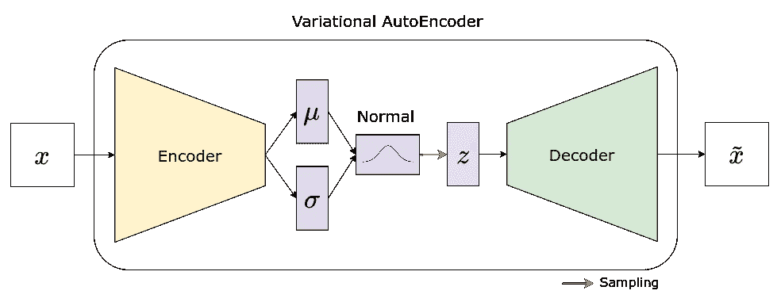

使用规则采样的变分自动编码器。图片作者。

在 VAE 中，编码器不再输出潜在空间，但是**产生*表示*和*标准偏差*** ，每个维度一个(与您为矢量 ***z*** 选择的大小一样多)。然后，每对平均值和标准偏差用于定义**对应的分布**(我们使用正态分布)，我们**从该分布中进行采样，以获得向量 *z*** 的值。

> 嘭！潜伏空间现在是连续的！

此外，还记得我们在第一部分的[“编码器”部分将编码器的输出层(`**lin_latent**`)与模型的其余部分分开吗？现在你可以明白为什么了——在 VAE 中，我们**使用基本模型的输出来馈送*两个*输出层:** `**lin_mu**` **和** `**lin_var**`。](https://medium.com/p/693c3a4e9836#9828)

```
EncoderVar(
  (base_model): Sequential(
    (0): Flatten(start_dim=1, end_dim=-1)
    (1): Linear(in_features=784, out_features=2048, bias=True)
    (2): LeakyReLU(negative_slope=0.01)
    (3): Linear(in_features=2048, out_features=2048, bias=True)
    (4): LeakyReLU(negative_slope=0.01)
  )
  (lin_mu): Linear(in_features=2048, out_features=1, bias=True)
  (lin_var): Linear(in_features=2048, out_features=1, bias=True)
)
```

看起来不错吧？但是，有一个小问题… **不能通过计算图**中的*随机节点*反向传播！

上图中的“随机节点”是我们的向量 ***z*** ，因为它在表示**采样**的**红色箭头**的接收端。

> “这是什么意思？”

这意味着，每当分布的**采样**被引入到**正向通道**时，在该点之前使用的任何参数/权重对于**反向推进**程序而言都变得**不可到达**，因此在我们的情况下不可能训练编码器。

我知道这看起来很糟糕，但幸运的是，使用一个小技巧就可以很容易地解决这个问题…

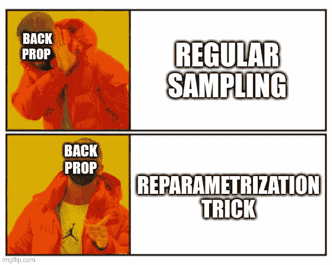

## 重新参数化技巧

所以，问题是“*随机节点*”，对吗？如果我们从计算图中去掉随机性会怎么样？如果随机性来自输入而不是**呢？它甚至不一定是用户提供的输入——从字面上看，它可能是一些**内部随机输入**！**

事情是这样的:

*   编码器继续像以前一样产生成对的平均值和标准偏差(两个与 ***z*** 大小相同的向量)；
*   在**编码器的正向传递**中，我们**从一个标准**正态( *mu* =0， *std* =1)分布**中抽取样本**来构建一个**随机向量(*ε*)**与 ***z*** — **大小相同，即内部随机输入**；

```
**def forward(self, x):**
    base_out = self.base_model(x)

    self.mu = self.lin_mu(base_out)
    self.log_var = self.lin_var(base_out)
    std = torch.exp(self.log_var/2)

    **eps = torch.randn_like(self.mu)
    z = self.mu + eps * std**return z
```

*   我们将随机(`**eps**`)向量和标准差(`**std**`)向量相乘，并将均值(`**mu**`)向量加到结果上——**voilà**，**我们得到了全新的向量 *z*** ！

您可能想知道编码器实际产生的是什么，因为**标准偏差(** `**std**` **)不是编码器**的直接输出…

编码器的输出实际上是**对数方差** ( `**log_var**`)，但是我们可以使用下面的表达式计算标准偏差(`**std**`):

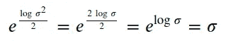

> “好，我明白了，但是**为什么**不直接求标准差呢？”

嗯，我们*不可能*对**标准差**有**负值**，对吧？但是线性输出层(`**lin_var**`)会输出满地的值，负的，正的。理论上，我们*可以*使用一个 ReLU 激活函数来只保持正值，当然，但这更多的是一种变通方法而不是解决方案。

如果我们将编码器 **的**输出视为方差**的对数(而不是方差本身)，我们将有效地**去除方差**的所有负值(那些负值的取幂将总是产生(0，1)范围内的值)，更好的是，我们正在平滑地进行*，而不是作为截止*。*此外，由于每次对数在公式中出现都很典型，*它提高了数值的稳定性* :-)***

*弄清楚这一点后，现在让我们看看这个图是什么样子的:*

*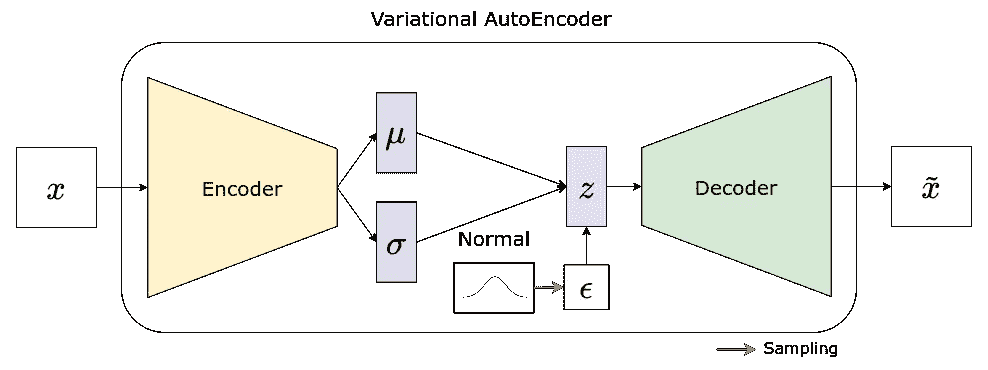*

*使用重新参数化技巧的变分自动编码器！图片作者。*

****随机节点*不再是**，因为红色箭头(采样)指向一个输入(ε)。计算图又是完整的——因此允许我们模型中的每个参数，从解码器到编码器，在反向投影过程中更新。简单说就是*再参数化绝招*！*

**在 PyTorch 中，常规采样和使用重新参数化技巧采样的区别在于用于从* [*正态分布*](https://pytorch.org/docs/stable/distributions.html#normal)*:*`[**sample**](https://pytorch.org/docs/stable/_modules/torch/distributions/normal.html#Normal.sample)`*vs*`[**rsample**](https://pytorch.org/docs/stable/_modules/torch/distributions/normal.html#Normal.rsample)`*中采样的方法。**

```
****def sample(self, sample_shape=torch.Size()):*** *shape = self._extended_shape(sample_shape)
    with torch.no_grad():
        return torch.normal(self.loc.expand(shape),
                            self.scale.expand(shape))****def rsample(self, sample_shape=torch.Size()):*** *shape = self._extended_shape(sample_shape)
    eps = _standard_normal(shape, 
                           dtype=self.loc.dtype,
                           device=self.loc.device)
    return self.loc + eps * self.scale**
```

**`**rsample**`*方法执行的操作与上面我们自己的正向传递完全相同。我们本可以使用* `**rsample**` *来代替自己编码，但是，出于教育目的，我认为最好在正向传递本身中显式地显示这个计算。***

> **“就这些？真的吗？”**

**真的——不一定要复杂——这个想法相当简单优雅。**

> **"那么，我们能对代码做这些改变并训练我们的 VAE 吗？"**

**别急，我们还需要讨论另一个损失，Kullback-Leibler 散度/损失(简称 KL 损失)。**

## **库尔贝克-莱布勒发散/损失**

**KL 散度/损失是两个分布之间的**相异度**、 **q(z)** 、我们试图实现的分布，以及 **p(z)** ，我们实际拥有的分布。我们在这里不讨论细节和公式，但是我们仍然需要知道，p(z)越接近 q(z) 的**，越低的**的**和**的发散/损失**。****

> **"好吧，但这如何适用于我们的 VAE？"**

**分布 **p(z)** 是我们使用编码器产生的一对**平均值和标准差得到的**正态分布**，这是我们实际拥有的分布。****

**另一个分布， **q(z)** ，是**标准正态( *mu* =0， *std* =1)分布**，我们试图达到的分布。**

> **编码器产生的与标准正态(mu=0，std=1) 分布越相似的 **KL 发散/损耗**将越**低**。**
> 
> **因此，**最小化 KL 损失**意味着我们的**编码器**将为我们的**潜在空间**(向量 **z** )的每一个维度产生尽可能接近标准正态(mu=0，std=1) 的**分布。****

**由于两种分布 **p(z)** 和 **q(z)** 都是**正态**，并且后者是标准正态分布，KL 发散/损失由下面的*相对简单的*表达式给出:**

**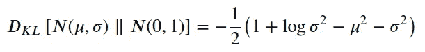**

**一些正态分布和标准正态之间的 KL 偏差/损失**

**或者，如果你喜欢用代码来写:**

```
****def kl_div(mu, std):**
    kl_div = -0.5 * (1 + np.log(std**2) - mu**2 - std**2)
    return kl_div**
```

**下图说明了两种分布的 KL 散度/损失如何变化，橙色的 **p(z)** (根据相应的行和列具有不同的属性)，蓝色的 **q(z)** (标准正态分布):**

**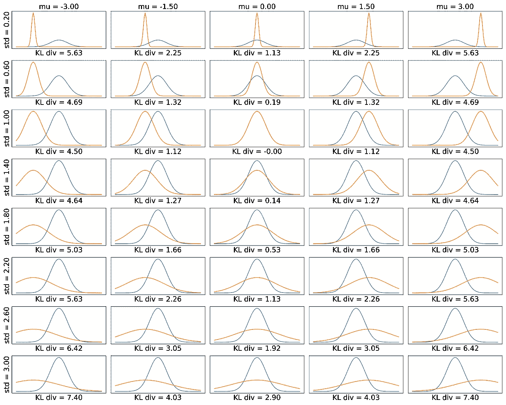**

**N(mu，std)和 N(0，1)之间的 KL 散度。图片作者。**

**这是同样的数据，这一次是热图，为了更简洁的可视化:**

**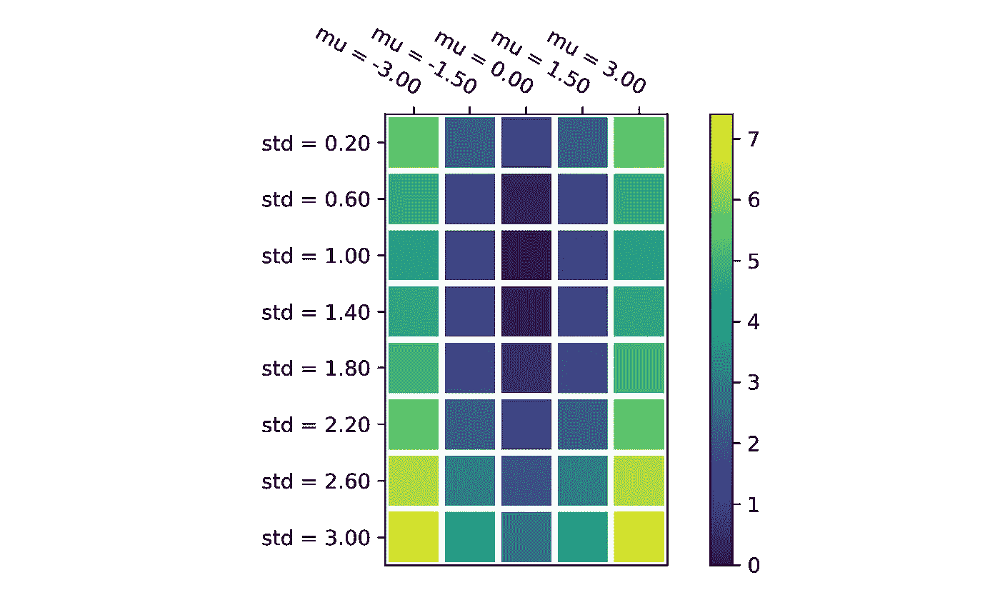**

**N(mu，std)和 N(0，1)之间的 KL 散度。图片作者。**

> **“我们为什么关心这个，我的意思是，为什么潜在空间的维度作为标准正态分布很重要？”**

**因为这将使我们以后的生活更容易——我们将能够使用一个众所周知和熟悉的分布——标准正态分布,从潜在空间中进行**采样。此外，训练集中的图像将被映射到潜在空间的每个维度的标准法线的典型区间(-3.0 到 3.0)。这意味着**如果我们的样本也在这个区间内**，我们很有可能得到好的重建。****

**现在，我们终于可以对编码器的代码进行修改了，*variable-style*！我们需要修改`**forward()**` **方法**(如“重新参数化技巧”一节所述)并添加一个`**kl_loss()**` **方法**来使用我们的编码器产生的平均值和对数方差计算 KL 偏差/损失:**

**变型编码器！**

**解码器和自动编码器模型与第一部分中的标准自动编码器保持一致:**

**可变自动编码器(VAE)**

> **"所以，我们把 KL 损失加到 MSE(或 BCE)损失上，我们就可以训练它了？"**

**是的，但是我们仍然需要考虑…**

## **损失的规模**

**我们很容易忽略这个问题——我们太习惯于使用默认的"*均值*"作为 PyTorch 损失函数(如 MSE 或 BCE)中的约简参数，以至于我们可能不会再考虑它。因此，如果我们在处理 KL 损失时简单地默认相同的程序，这不应该是令人惊讶的，对吗？**

**嗯，是的，但这可能不会工作训练 VAE。这就是为什么你会看到，在大多数关于 VAE 的教程中，**减少损失使用的是“*总和*”**而不是“*表示*”，尽管大多数时候，对其背后的推理只字未提。所以让我们仔细看看！**

**我们将从获取一批圆形图像开始，然后对它们进行编码，并使用我们的(未训练的)模型来重建它们。**

```
**x, y = next(iter(circles_dl))
zs = encoder_var(x)
reconstructed = decoder_var(zs)**
```

**接下来，我们将使用`**reduction='none'**`获得 MSE 损失的原始值:**

```
**loss_fn_raw = nn.MSELoss(reduction=’none’)
raw_mse = loss_fn_raw(reconstructed, x)
raw_mse.shape
**Output:
torch.Size([32, 1, 28, 28])****
```

**不出所料，一批图像(32)中每个通道(1)的每个像素(28x28)都有一个平方误差，总共 25，088 个值。如果我们在损失函数中使用标准缩减(“*表示*或“*总和*”)，他们将简单地计算所有 25，088 个值的相应缩减，例如:**

```
**raw_mse.sum(), nn.MSELoss(reduction=’sum’)(reconstructed, x)
**Output:
(tensor(23960.8066, grad_fn=<SumBackward0>),
 tensor(23960.8066, grad_fn=<MseLossBackward>))****
```

**绝配！但是我们不一定要像那样减少它，我们可以更有选择性一点，然后**计算每幅图像**像素的总和，然后**才计算整批图像的平均值**:**

```
**sum_over_pixels = raw_mse.sum(dim=[1, 2, 3])
sum_over_pixels.mean()
**Output:
tensor(748.7753, grad_fn=<MeanBackward0>)****
```

**看到了吗？那是完全不同的结果！我们也可以*翻转*减少量，首先计算像素的平均值，然后计算整批的总和。下表总结了四种可能的策略:**

****

**平方误差损失的缩减函数。图片作者。**

**现在，让我们对 KL 损失做同样的处理，使用在变分编码器中实现的`**kl_loss()**` **方法**获取其原始值:**

```
**raw_kl = encoder_var.kl_loss()
raw_kl.shape
**Output:
torch.Size([32, 1])****
```

**由于 KL 散度/损失是为潜在空间的每个维度(向量 ***z*** )计算的，并且我们选择只有一个维度**，所以批中的每个图像只有一个值。我们选择的缺点是，对向量*(dim = 1)取“ *sum* ”或“ *mean* ”将总是产生相同的结果，如下表所示:*****

****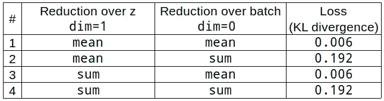****

****KL 损失的缩减函数。图片作者。****

****我们将对 MSE 和 KL 损失使用**组合# 4**，但是我鼓励你尝试其他组合，并了解它们如何影响模型训练。出于这个原因，**我们将在训练循环中手动地、明确地减少两次每个损失:除了第一个维度，在每个维度上减少一次，在批次上再减少一次**。****

> ****“如果这些组合都没有产生好的结果呢？怎么办？”****

****问得好！事实证明，通常在重建损失中包含一个**乘数。这个因素是a **超参数**您可以在训练 VAE 时进行调整。******

```
****loss = loss_fn(yhat, x).sum(dim=[1, 2, 3]).sum(dim=0)
kl_loss = model_vae.enc.kl_loss().sum(dim=1).sum(dim=0)
total_loss = reconstruction_loss_factor * loss + kl_loss****
```

> ****如果**因子太高**，则**重建损失将支配训练**，这就好像我们有一个**普通自动编码器**。****
> 
> ****如果**因子太低**，则 **KL 损失将主导训练**，并且**重建图像不会有任何好处**。****

## ****模特培训(VAE)****

****我们需要修改训练循环以考虑损失、重建和 KL 以及前者的倍增因子。修改属于第二步(第 21 至 29 行，计算损失)，并且仅属于第二步。****

****训练变分自动编码器****

```
****Epoch 001 | Loss >> 4622.8542/4566.6690/56.1851
Epoch 002 | Loss >> 625.7960/554.5768/71.2191
...
Epoch 029 | Loss >> 269.6513/198.1815/71.4698
Epoch 030 | Loss >> 257.9317/182.5780/75.3537****
```

## ****潜在空间分布(VAE)****

****如果我们绘制一个潜在空间的直方图( ***z*** )(左图)，我们会看到，虽然它还不完全是正态分布，但它有点接近它。****

****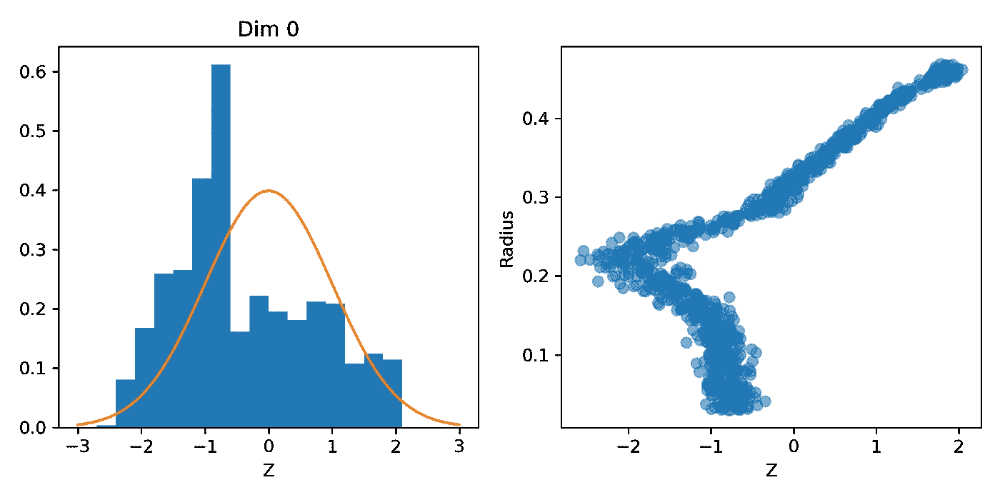****

****左图:潜在空间的分布；右图:潜在空间与半径。图片作者。****

****然后，如果我们根据每个圆的相应半径绘制潜在空间，我们将得到右边的图。在半径的 0.2 标记处仍然有一个“*弯头*，但是垂直线已经消失了(来自在[第一篇文章](https://medium.com/p/693c3a4e9836)中训练的普通自动编码器)，这意味着我们在重建图像的任何地方都不会看到圆形的“*混合*”。我们去看看吧！****

## ****重建(VAE)****

****我们正在重建五幅图像，对应于第一篇文章中使用的潜在空间(-3.0，-0.5，0.0，0.9，3.0)中相同的五个点。****

> ****别忘了我们的**潜伏空间现在是连续的**！****

****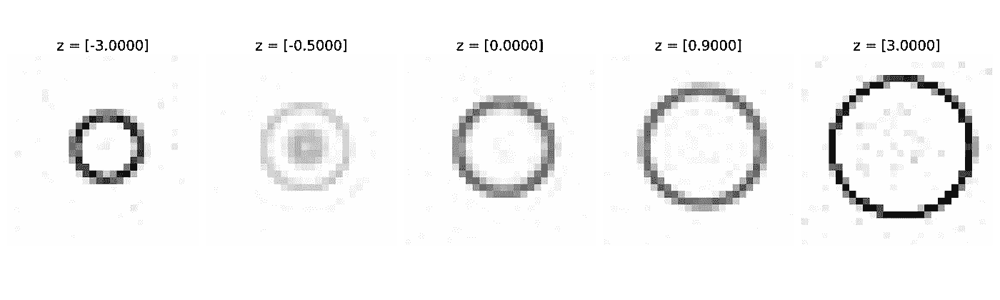****

****潜在空间中所选点的重建图像(VAE)。图片作者。****

****在使用标准正态分布的极值([-3.0]和[3.0])的潜在空间中的点生成的图像上，仍然有一些噪声***；仍然有小半径([-0.5])的圆的一点点“混合”*****；但它看起来肯定比普通的自动编码器好。******

****现在，是时候去*卷积*了！****

# ****卷积变分自动编码器(CVAE)****

****直到最近，卷积神经网络(CNN)还是计算机视觉任务事实上的标准。虽然现在变压器被冠以这个头衔，但 CNN 仍然是有用、简单和快速的架构，所以我们将使用它们来构建卷积变分自动编码器(CVAE)。****

****我假设您熟悉常规 CNN，以及它们如何用于简单的图像分类任务，因为我们的编码器看起来非常像典型的 CNN:****

****卷积变分编码器的基本模型****

```
****EncoderVar(
  (base_model): Sequential(
    (0): Conv2d(1, 32, kernel_size=(3, 3), 
                stride=(1, 1), padding=(1, 1))
    (1): LeakyReLU(negative_slope=0.01)
    (2): Conv2d(32, 64, kernel_size=(3, 3), 
                stride=(2, 2), padding=(1, 1))
    (3): LeakyReLU(negative_slope=0.01)
    (4): Conv2d(64, 64, kernel_size=(3, 3), 
                stride=(2, 2), padding=(1, 1))
    (5): LeakyReLU(negative_slope=0.01)
    (6): Conv2d(64, 64, kernel_size=(3, 3),
                stride=(1, 1), padding=(1, 1))
    (7): LeakyReLU(negative_slope=0.01)
    (8): Flatten(start_dim=1, end_dim=-1)
  )
  (lin_mu): Linear(in_features=3136, out_features=1, bias=True)
  (lin_var): Linear(in_features=3136, out_features=1, bias=True)
)****
```

****看到了吗？编码器的基本模型是 CNN，变化部分由两个线性输出层给出，一个用于均值，另一个用于对数方差，就像我们以前的 VAE 一样。****

****然而**解码器是完全不同的**，因为它是使用**转置卷积**构建的。要快速了解这些“逆卷积”，请查看我的博文:****

****[](/what-are-transposed-convolutions-2d43ac1a0771)  

转置卷积用于将图像从 7x7 像素一直放大到原始大小 28x28:

卷积解码器

> “等等，现在有**乙状结肠**层了？”

接得好！**是的，有一个 sigmoid 层，但我们会继续使用 MSE 作为损失函数**。

> 我鼓励您尝试移除 sigmoid 层或将损失函数更改为 BCE，或许还可以调整重建损失因子，然后训练模型，看看效果如何。

## 模特培训(CVAE)

尽管我们对编码器和解码器都使用了更复杂的架构，但这仍然是一个变化的自动编码器，训练循环本身与以前完全相同:

训练卷积变分自动编码器(CVAE)

```
Epoch 001 | Loss >> 2188.3729/2118.5622/69.8107
Epoch 002 | Loss >> 615.1194/611.0034/4.1160
...
Epoch 029 | Loss >> 172.8306/85.8559/86.9747
Epoch 030 | Loss >> 169.7600/81.1885/88.5715
```

## 潜在空间分布(CVAE)

如果我们绘制潜在空间的直方图(***【z】***)(左图)，我们会看到，这一次，**分布非常接近标准正态分布**！

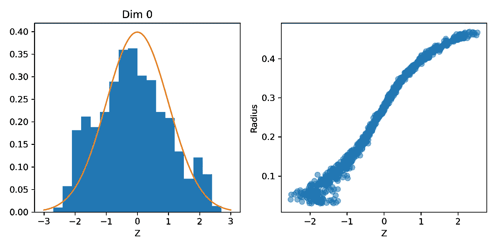

左图:潜在空间的分布；右图:潜在空间与半径。图片作者。

更好的是，如果我们将潜在空间与每个圆的相应半径对应起来，就不再有**的“肘”**——在潜在空间和半径这两者之间有一个大致的线性关系。

重建的图像呢？

## 重建(CVAE)

如果我们从标准正态分布中抽取一维潜在空间的样本，我们会在中心得到平均大小的圆，在分布的最左侧得到小圆，在分布的最右侧得到大圆。**那个**有多*牛逼*？

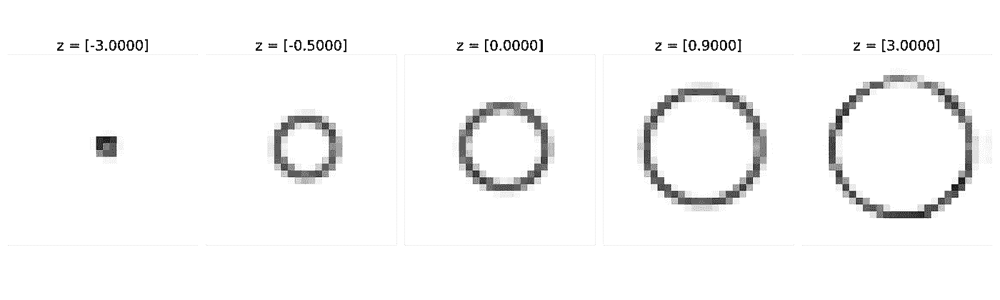

潜在空间中所选点的重建图像(CVAE)。图片作者。

**自动编码器学会了在潜在空间中表示半径！**

我们在这里的工作已经完成了:-)

# 最后的想法

感谢您坚持到这篇长文的结尾:-)，但是，尽管它*是一篇长文，但它只是一个介绍，并且它只涵盖了您需要了解的开始试验各种自动编码器的基本工具和技术。*

如果你想了解更多关于自动编码器和生成模型的知识，我推荐大卫·福斯特的*生成深度学习*，作者是奥赖利。

如果你想了解更多 PyTorch，计算机视觉，NLP 的知识，给我自己的系列丛书， [*深度学习用 PyTorch 循序渐进*](https://pytorchstepbystep.com/) ，一试:-)**** 

*****如果您有任何想法、意见或问题，请在下方留下评论或通过我的* [*简历链接*](https://bio.link/dvgodoy) *页面联系。*****

*****如果你喜欢我的帖子，请考虑使用我的推荐页面* [*注册一个中级会员*](https://dvgodoy.medium.com/membership) *来直接支持我的工作。对于每一个新用户，我从 Medium 中获得一小笔佣金:-)*****