# 从贝叶斯角度理解偏差-方差权衡

> 原文：<https://towardsdatascience.com/understanding-bias-variance-trade-off-from-a-bayesian-perspective-6c31645fcaa9>

## 使用示例和模拟从贝叶斯角度全面理解等式 MSE =偏差+方差

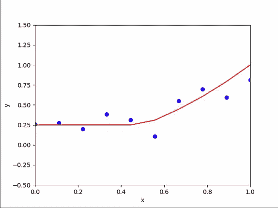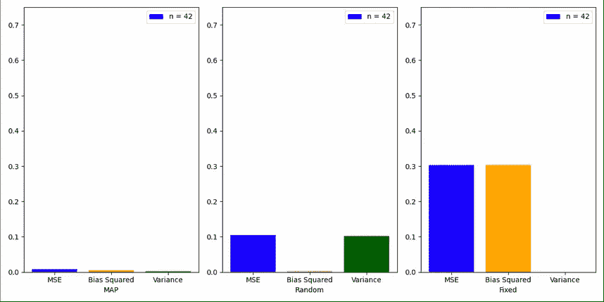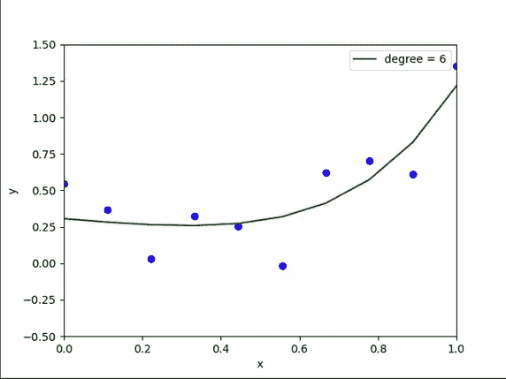

在我的机器学习之旅中，我遇到过几次偏差-方差权衡，但我一直无法完全掌握它。然而，在采用贝叶斯观点后，一切都变得有意义了。在这篇文章中，我将分享我的学习。

首先我们从理论入手，做一个基本的例子；然后我们来看一个更难的贝叶斯多项式回归的例子。

# 什么是贝叶斯推理？

在任何一种推断问题中，我们都希望估计未知参数的值。这个参数通常用θ(θ)来表示。在贝叶斯推理中，我们假设θ是一个随机变量，具有由*P(*θ*)*表示的*先验*分布。我们首先构建一个*模型*，使得它的输出依赖于θ。我们执行实验并记录输出值。这些被称为*观察。*

观察值是随机变量，通常用 *X* 表示，其分布取决于θ。这是一个用*P(X |*θ*表示的条件分布。*

利用*P(*θ*)*和*P(X |*θ*)*我们可以利用贝叶斯定理求出*P(*θ*| X)*的分布。我们将在稍后更详细地讨论这一点，但是现在，请理解*P(*θ*| X)*表示基于记录的观测值的θ的更新分布。这也称为*后验*分布。

从后验分布中，我们基于某些度量来估计𝜃的最优值。**注:** 𝜃为θ的实现值。θ是一个随机变量，而𝜃是一个实值。同样， *x* 是 *X* 的实现值。

此外，由于现实世界中的误差，观测结果不会是完美的。它们被假设为以零为中心的正态随机变量的噪声所污染。通常用 *W.* 来表示

贝叶斯推理过程如下图所示:

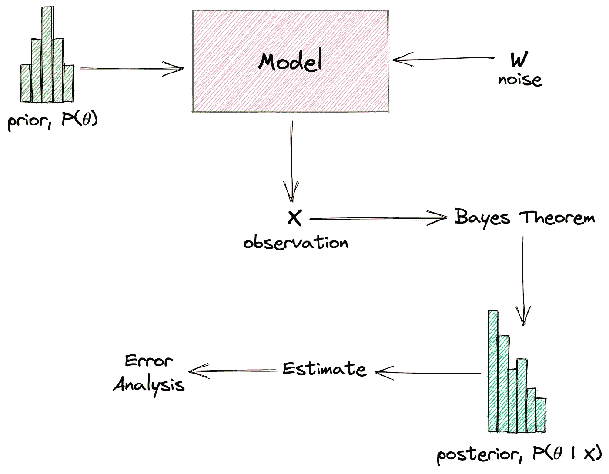

贝叶斯推理。作者图片

# 例子

所有这些理论可能会让你困惑。我们来做个例子，说清楚。


由 [Siora 摄影](https://unsplash.com/@siora18?utm_source=medium&utm_medium=referral)在 [Unsplash](https://unsplash.com?utm_source=medium&utm_medium=referral) 上拍摄

*让我们假设你有一枚有偏向的硬币，正面的概率是未知的。你抛 n 次，记录观察到的人头数为 k，人头概率的估计值是多少？*

让我们用随机变量θ来表示人头的概率。因为它的先验分布是未知的，所以让我们假设它在 0 和 1 之间均匀分布。这在数学上表示为:

`*f*(Θ = θ) = 1 if 0 < 𝜃 < 1` ( *f* 代表概率密度函数)。

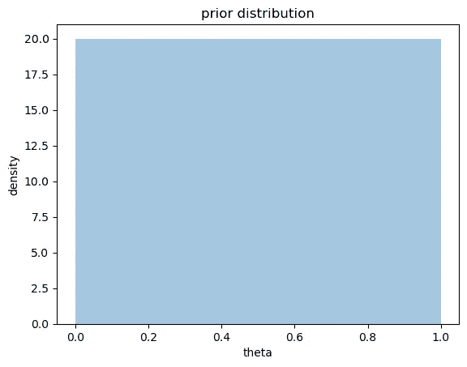

一致先验

这基本上意味着𝜃可以以相等的概率取 0 到 1 之间的任何值。

让随机变量 *Xi* 代表 iᵗʰ抛硬币的结果。这是一个伯努利随机变量，在数学上可以表示为:

```
P(Xi = 1 | Θ = θ) = θ (Heads)
P(Xi = 0 | Θ = θ) = 1 - θ (Tails)
```

这意味着当随机变量θ等于θ时，正面的概率为θ。这是以随机变量θ为条件的条件分布。

我们来计算一下观察到 *k* 个头的概率。

现在， *k* 也可以表示为:`k = X1 + X2 + X3 + … + Xn`。如果观察到头部，随机变量 *Xi* 等于 1，否则为 0。所以把它们加起来应该能给出我们观察到的人头数。

在 n 次投掷中，有 *k 次*投掷会导致正面朝上。这些 *k* 投掷可以通过 *ⁿCₖ* 方式选择。所有的投掷都是独立的。因此， *k 个*正面以概率 *θᵏ、*出现，剩余的 *n - k 个*反面以概率*1—θ)ⁿ*—*ᵏ.出现*

因此，联合分布可以写成:

```
f(k | Θ = θ) = ⁿCₖ.θᵏ.(1 - θ)ⁿ−ᵏ
```

这是一个二项分布 wrt *k* ，看起来像这样:

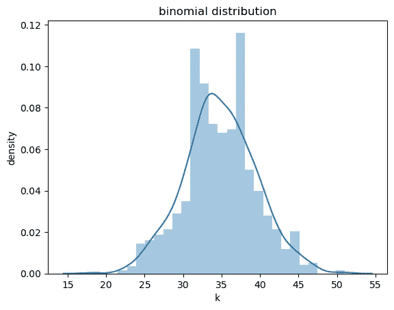

接下来，让我们用贝叶斯定理计算后验概率:

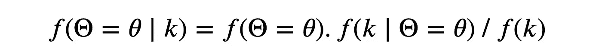

贝叶斯定理

本质上，我们正在通过询问如果正面概率为 *θ* 时 *k* 正面多久会被观察一次，并通过观察到 k 个正面的总概率将其标准化，并通过先验对其进行缩放，来找出正面概率为 *θ* 的可能性。

这是贝叶斯定理的直觉，如下所示:

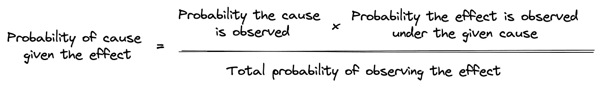

分母 *f(k)* 代表多长时间观察一次 *k* 个头。这等于 1，可以通过从 0 到 1 积分*f(k |θ=θ)*wrt*θ*来计算。

同样，我们已经看到先前的*f(θ=θ)*等于 1。

因此，后验*f(θ=θ| k)*可以写成:

```
f(Θ = θ | k) = ⁿCₖ.θᵏ.(1 - θ)ⁿ−ᵏ
```

好了，现在我们需要从后验分布中估计一个好的值 *θ* 。接下来让我们看看某些估算方法。

# 最大后验估计

这里我们选择一个最大化后验概率的值 *θ* 。表达式`f(Θ = θ| k) = ⁿCₖ.θᵏ.(1 — θ)ⁿ−ᵏ`在 *θ = k / n* 处最大。这可以通过对 wrt *θ* 进行求导并将其设置为零来进行数学计算，如下所示:

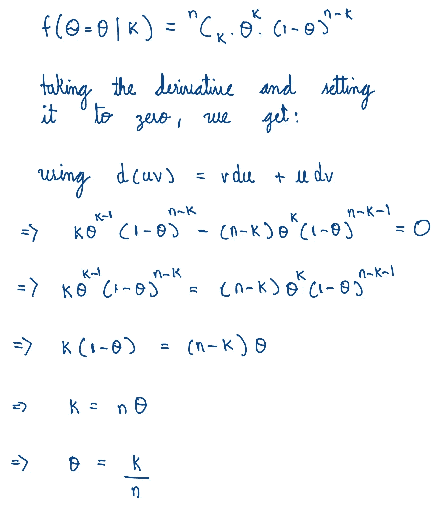

计算 MAP 估计量

现在， *k* 是一个随机变量。如果你和我拿着同一个硬币，抛 *n* 次，我们可能会观察到不同的 *k* 值。因此， *θ = k / n* 被称为估计量，由 *θ* 顶上的帽子表示，如下图 *:*

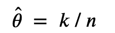

最大后验估计量

我们将用 *θhat 来表示估计量。*一旦 *k* 被观测到，实现的值被称为*估计值。*

# 测量估计量的优良性

## 偏见

我们如何知道估计量足够好？首先，我们可以通过计算 *θhat — θ来测量它与实际值的偏差。然而，这是一个随机变量，因为θ是随机的。为了报告单个值，我们可以取它的期望值。这就是所谓的偏见。*

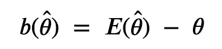

估计量的偏差

你可以把期望值想象成加权平均值。如果你重复几次这个实验，你可能会观察到这个值。

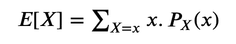

预期

偏差告诉我们估计值与实际值的平均偏差。

## 均方误差

偏差不会告诉我们偏差的*量*。让我们通过取偏差的*平方*的期望值来定义另一个量。这被称为均方误差。

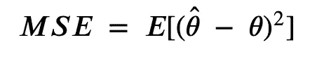

均方误差

进一步简化上述方程，我们得到`MSE = bias² + variance`，这是统计学中一个著名的方程。计算如下所示:

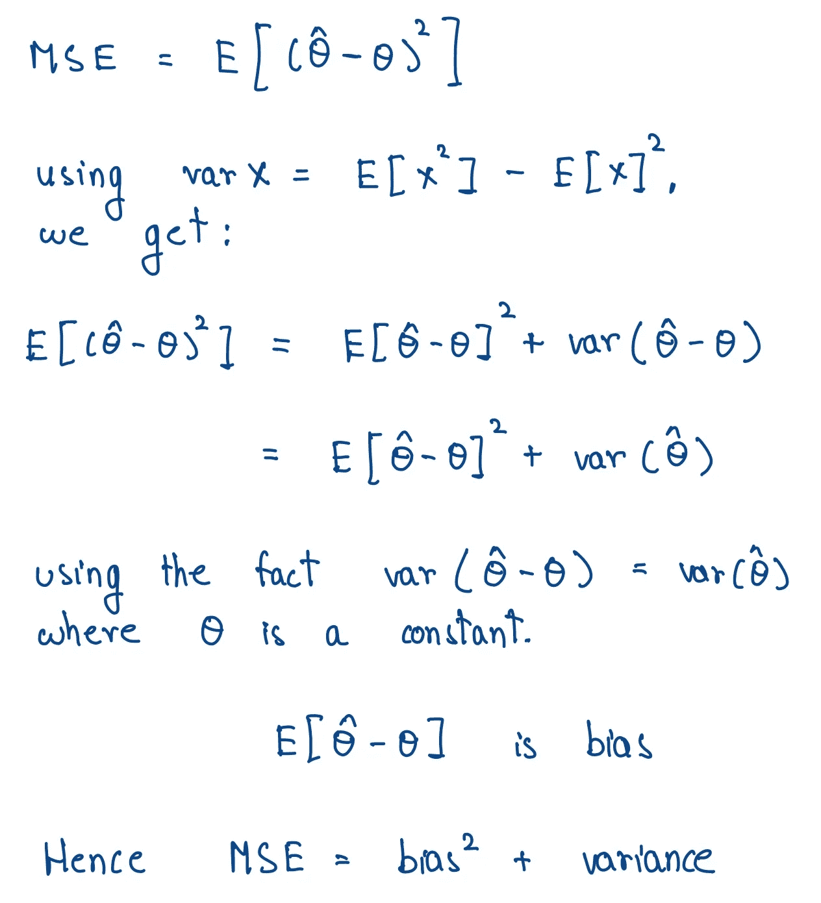

推导偏差-方差权衡方程

方差度量估计值如何基于观察值而变化。

# 模拟

让我们回到我们的问题，运行一些模拟。这里我将 *θ* 的实际值固定为 0.35。我模拟了 *k，*，这是在 *n* 次抛硬币中观察到的人头数。我也给 k 添加了高斯噪声来模拟真实世界。

我采用了三种估计量:第一种是我们上面推导的 MAP 估计量，第二种是随机估计 0 到 1 之间的值的随机估计量，第三种是固定值为 0.9 的固定估计量。基于这些观察，我计算了每个估算者的*经验* mse、偏差和方差。

下图显示了不同的 *n* 值的结果。

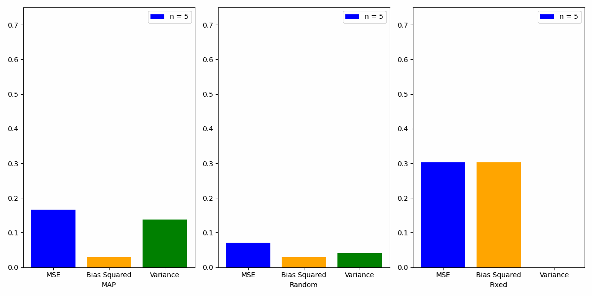

三个估计量的 MSE、偏差平方和方差

代码可以在[这里](https://gist.github.com/wingedrasengan927/e741486b343bb0dbd2acd88d16a79ab6)找到。

# 理解 MSE =偏差+方差

## 固定估计量

这里方差为零，因为估计值是固定的。所以 MSE =偏差。

## 随机估计量

这里的值在每次迭代中不断随机变化。mse 有时低，有时高。然而，方差通常很大，因为估计是随机的。在任何情况下，等式 MSE =偏差+方差得到满足，这可以从图中观察到。

## MAP 估计器

这里，与其他两个估计器相比，*平均*图较低。此外，随着 *n* 的增加，mse 变为零。另一个有趣的模式是偏差接近于零，方差对 mse 的贡献最大。

我们来讨论一下为什么会出现这种情况。

MAP 估计量的偏差由下式给出:


MAP 估计量的偏差

这里，术语`k / n = (X1 + X2 + X3 + … + Xn) / n`称为样本均值。弱大数定律认为，当 *n* 接近无穷大时，样本均值接近真实均值。

所以当 n → ∞时，E[k / n] → θ，b( *θhat* ) → 0。

影响估计量分布的另一个参数是采样的观察值的数量。这由代码中的变量`reps`表示。中心极限定理表示，随着越来越多的观察值从相对较大的样本量中取样，它们的分布接近以真实平均值为中心的正态分布。

因此，从大样本量中采样的更多观察值将使 MAP 估计更准确。

好的，到目前为止我们讨论的所有理论和例子都是为了让你的大脑做好准备。接下来让我们看一个更难的例子。

# 一个更难的例子——贝叶斯多项式回归

在现实世界中，我们经常以`[(x1, y1), (x2, y2), (x3, y3), … (xn, yn)]`的形式观察数据，其中`(xi, yi)`由模型关联。我们的目标是估计这个模型。让我们从贝叶斯的角度来处理这个问题。

首先，我们需要定义一个模型:

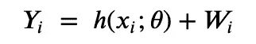

给定一个观察值`xi`，随机变量`Yi` *d* 依赖于函数`h(xi;θ)`并受到噪声`Wi`的影响。

函数`h(xi;θ)`具有以下形式:

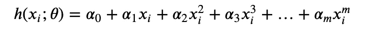

给定一个值`xi`,`Yi`的值取决于参数`θ`所代表的系数`*(*𝛼₀, 𝛼₁, 𝛼₂, …, 𝛼ₘ*)*` 的*联合分布*。与前面的例子不同， *θ* 在这里是一个矢量。符号`h(xi;θ)`表示函数 *h* 依赖于 *θ。*

让我们假设系数`*(*𝛼₀, 𝛼₁, 𝛼₂, …, 𝛼ₘ*)*` 的先验分布是均值为 0 且方差为𝜉的正态分布。它们的联合分布将是它们各自分布的产物，因为它们是独立的。

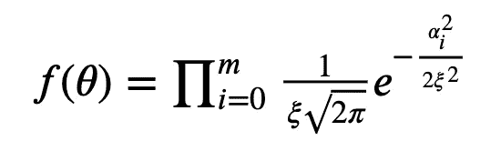

好吧。现在，给定一个值 *θ，*随机变量`Yi`的分布会是什么样子？型号是`Yi = h(xi;θ) + Wi`。给定 *θ* 的值，`h(xi;θ)`将保持不变。因此`Yi`将具有与噪声`Wi`相同的分布，但是偏移了一个量`h(xi;θ)`。让我们假设`Wi`遵循均值为 0 且方差为𝜎的正态分布。`Yi`的分布将是:

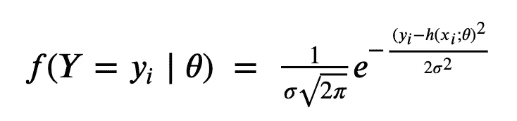

这是针对单次观察`Yi`。在现实世界中，我们记录多个观察值`Y= (Y1, Y2, …, Yn)`。同样，我们必须考虑观察值的联合概率分布，这将是它们的乘积，因为假设它们是独立的:

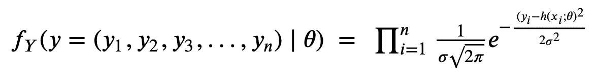

我们现在有了应用贝叶斯定理所需的条件:

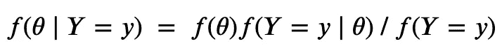

一旦我们得到了分布，我们就可以通过选择使后验概率最大化的θ来找到 MAP 估计量。

分母`f(Y=y)`只是一个不依赖于θ的归一化因子。所以在优化过程中可以忽略。

我们已经讨论了术语`f(θ)`和`f(Y=y|θ)`。他们的产品看起来像这样:

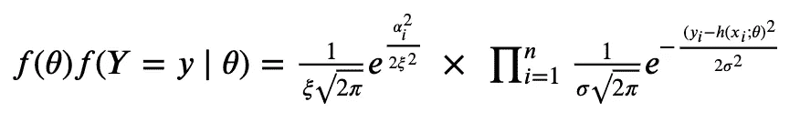

这个等式看起来很吓人。所以我们常用的一个技巧是取对数并最大化它。

经过一些计算后，该方程的对数将如下所示:

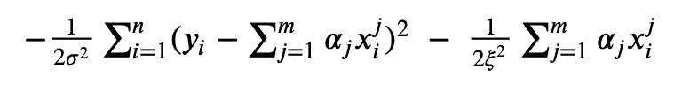

这个看起来好多了。我们需要找到使这个量最大化的`θ = *(*𝛼₀, 𝛼₁, 𝛼₂, …, 𝛼ₘ*)*` 的最优值。我们不能像上一个例子那样手工完成，所以我们使用了 Python 中的某些优化库。

让我们运行一些模拟，看看实际情况。

# 模拟

首先，我定义了一个具有以下属性的模型:

```
Y = 0.25 if 0 < x <= 0.5
Y = x² if 0.5 < x <= 1
```

基于这个模型，我用不同的噪声模拟了一些观察结果，如下所示:

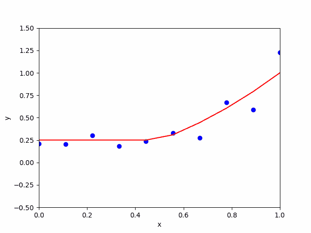

然后，对于每个观察值，我通过使用 python 中的 scipy 库优化方程，找到了不同程度的 MAP 估计量`m = 1 to m = 10`。

每个观测值和每个度数的 MAP 估计量如下所示:

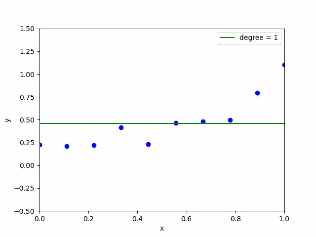

我们可以看到，与低阶估计量相比，高阶估计量随观测值变化很大。最佳点在中间的某个地方。

scipy 的优化并不完美。如果我们使用了更好的优化技术，如梯度下降，我们可以清楚地观察到高阶估计器发生的过拟合。然而，为了简单起见，我在本文中只介绍了一个基本的优化器。

代码可以在[这里](https://gist.github.com/wingedrasengan927/e741486b343bb0dbd2acd88d16a79ab6)找到。

# 结论

从贝叶斯角度思考的好处是，当我们试图使用估计器来拟合数据时，我们可以理解发生了什么。此外，考虑我们在上一节中看到的等式:

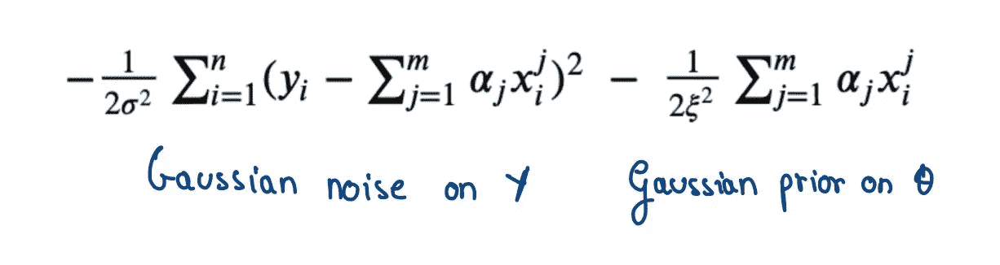

基于先验分布的第二项可以被认为是防止过拟合的正则化系数。通过这个镜头看到的正则化是直观的:先验越强，你需要偏离它的证据就越多。贝叶斯思维提供了这种直观的见解。

```
**Let's connect** Hope you've enjoyed the article. Let's connect.

You can also find me on [Twitter](https://twitter.com/WingedRasengan) and [LinkedIn](https://www.linkedin.com/in/neerajkrishnadev/).
```

# 信用

本文中使用的所有数据和可视化都是作者制作的。

# 参考

1.  [深度学习课程](https://fleuret.org/dlc/materials/dlc-slides-2-3-bias-variance-dilemma.pdf)作者[弗朗索瓦·弗勒特](https://fleuret.org/francois/)
2.  [中心极限定理](https://en.wikipedia.org/wiki/Central_limit_theorem)