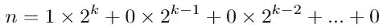
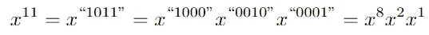

# 理解编码面试的位掩码

> 原文：<https://towardsdatascience.com/understanding-bitmask-for-the-coding-interview-b1643f4b0e24>

## 一个挑战性话题的实用指南


亚历山大·辛恩在 [Unsplash](https://unsplash.com/s/photos/binary?utm_source=unsplash&utm_medium=referral&utm_content=creditCopyText) 上的照片

编码面试一定要知道位操作和位掩码吗？

这两个主题被认为是高级材料，在编码面试中“隐含地”不是必需的。然而，如果面试官愿意，他完全有权利给你这些问题。

这是您应该知道的处理位掩码问题的所有标准技术和模式的简要概述。

**目录**

[位操作的基本](#5f19)
∘ [位操作的常见操作](#a76d)
∘ [位掩码的重要操作](#93c0)
[位操作模式](#aae9)
∘ [统计一个数的二进制表示中的 1 位数](#b95f)
∘ [检查一个正数是否是二的幂](#01cf)
∘ [高效计算 Pow(x，n)、 其中 x > 0，n > 0](#2800)
[位掩码模式](#5e7e)
∘ [通用模式:](#bc45)
∘ [给定一个唯一元素数组，找出所有可能的子集](#e493)
∘ [统计所有可能的大小为 k 的子集，其总和为给定的目标](#cb35)
[结论](#ced9)

> 所有代码和方程都是作者写的。

# 基本的

位掩码是使用数字的二进制表示来解决困难问题的思想。这种表示对于每个数字都是唯一的。

*例*:数字 11 的位数是“1011”，因为以 2 为基数:

11 = 8+2+1 =**1*** 2+**0*** 2+**1*** 2+**1***2⁰=“1011”

处理位掩码时:**实际数字是多少并不重要。**我们要关心的只是它的二进制形式和下面的运算:

## 位操作的常见操作

*   左移:要将`x`向左移动 n 个空格，我们使用`x << n`。例如，二进制形式的`"1011" << 3 = "1011000"`或`11 << 3 = 88`。
*   右移:同样，我们使用`x >> n`。例如，`"10101" >> 3= "101"`(注意 1 位消失)。
*   清除最低设置位:`x & (x — 1)`(如`"10100" -> "10000"`)
*   AND: `a & b = 1`如果`a = 1`和`b = 1`，否则为 0
*   或者:`a | b = 1`如果`a = 1`或者`b = 1`，否则为 0
*   XOR: `a ^ b = 1`如果`a`或`b`中恰好有一个为 1，否则为 0
*   对于大于 1 的数字，我们对每个比特位置迭代地应用这些运算。例如`"10111" AND "1100" = "00100" = "100"`

## **位掩码的重要操作**

*   将 i^th 位设为 1: `mask = mask | (1 << i)`或`mask |= (1 << i)`
*   翻转 i^th 位:`mask = mask ^ (1 << i)`或`mask ^= (1 << i)`

大多数时候，你会操作一个叫做`mask`的数字。这个掩码将用于跟踪列表中“已用”或“未用”的元素。

*举例:*给定一个由 3 个元素组成的集合`A = {1,2,3}`，我们如何有效地表示这个集合的所有子集？

*答:*使用从 0 到 7 的数字及其对应的位掩码，其中每个 1 位位置向一个选定的元素发送信号:

```
0 = "000" = {} = the empty set
1 = "00**1**" = {1}
2 = "0**1**0" = {2}
3 = "0**11**" = {1, 2}
4 = "**1**00" = {3}
5 = "**1**0**1**" = {1, 3}
6 = "**11**0" = {2, 3}
7 = "**111**" = {1, 2, 3}
```

一般来说，给定一组`n`元素，**我们总是可以用从 0 到** `**2^n — 1**` **的数字来表示这个集合的所有子集。**

这是 bitmask 的基本思想。我们将操作一个代表给定列表的当前子集的`mask`。

# 位操作模式

## 计算一个数的二进制表示中的 1 位数

我们可以一直向右移动这个数，直到它变成零。在每一步，我们检查 0^th 位是否为 1，并将其加到总计数中:

我们可以进一步优化这个解决方案:我们可以删除最低设置位并相应地移位，而不是每次移位 1 位:

## 检查正数是否是 2 的幂

如果 n 是 2 的幂，那么对于某个正整数 k，



换句话说，n 的二进制表示形式为`"100...0"`。那么我们可以通过移除 n 的最低位集合来容易地验证这一点:

## 有效地计算幂(x，n)，其中 x > 0，n > 0

以 11 为例，考虑 n 的二进制表示:



请注意，11 的二进制表示中的每个位置对应于 x，x，x⁴，…

因此，代替循环和乘以 n 次来计算答案，我们可以通过仅存储 2 的幂的幂来优化计算:x、x、x⁴、x⁸,…，并且乘以适当的值来获得我们的最终答案:

# 位掩码模式

回想一下，掩码代表一个子集。

例如，我有一个写着`"00110011"`的面具

> 这个十进制数是多少？

我不知道，也不在乎。

我们只需要知道这个掩码代表一个集合的状态。这个特殊的掩码意味着我们正在处理一个包含索引为 0、1、4 和 5 的元素的子集(从右到左)。

## 一般模式:

这段代码在做什么？

我们遍历集合中的所有索引。如果我们在索引`i`处遇到一个“未使用”的元素，那么相应的掩码元素将是`"0"`。因此索引`i`处的`not mask`为`"1"`，因此`not mask & (1 << i)`将返回 True。然后，我们可以将这个元素添加到我们的子集中，并接下来处理它。

## 给定一个**唯一**元素的数组，找到*所有可能的子集*

回想一下上一节:给定一个大小为`n`的集合，我们可以使用从 0 到`2^n-1`的数字来表示所有的子集。

对于每个数字，我们通过查看其二进制表示来构建相应的子集，并找到所有`"1"`的位置。然后，我们可以将子集添加到最终结果中。

示例输出:

```
>>> A = [1,3,5,7]
>>> subset(A)
[[], [1], [3], [1, 3], [5], [1, 5], [3, 5], [1, 3, 5], [7], [1, 7], [3, 7], [1, 3, 7], [5, 7], [1, 5, 7], [3, 5, 7], [1, 3, 5, 7]]
```

## 对给定目标的所有可能的大小为 k 的子集进行计数

这个问题是 Leetcode 上的[组合和 III](https://leetcode.com/problems/combination-sum-iii/) 。我们希望找到所有大小为`k`的子集，其总和为`n`，因此:

*   仅使用数字`1`至`9`。
*   每个号码最多使用**一次**。

这个问题可以通过回溯来解决，但是我想在这里提出一个位掩码解决方案。一旦您熟悉了位操作，您可能会发现使用位掩码更容易求解和/或编写解决方案。

**我们的起始掩码是 0，代表空集**(99%的情况下都是这样)。在每一步，我们选择打开位置 1 到 9 的任何位(从右到左，起始位置索引为 0)。

例如，`"1010101010"`在位置 1、3、5、7 和 9 有`"1"`。这个掩码表示集合{1，3，5，7，9}，总和等于 25。

我们可以使用位掩码和 DP 来解决这个问题。一旦我们得到了所有有效掩码的集合，我们就可以解码每个掩码并得到最终的数字集合。

这里有一个解决方案，它利用了本帖中讨论的三种不同的位操作技术:

# 结论

位掩码不一定要吓人。

当我开始[准备](https://medium.com/p/5c77f27d5224)编码面试时，我发现位掩码是最具挑战性的话题。一开始，我会完全跳过这些问题。然而，随着我解决越来越多的问题，我最终发现它并不像我想象的那么可怕。

我的一些朋友在面试中确实被问到了关于位屏蔽的问题(在一些大型科技公司)。难度类似于“位掩码模式”一节中的两个问题。这些问题旨在通过回溯来解决。但是，用位掩码求解是给面试官留下深刻印象的好方法！

(很有可能，他们对此也不太适应。)

如果你愿意支持 Thu，你可以考虑注册成为一名中等会员。每月支付 5 美元，你就可以无限制地阅读媒体上的故事。如果你使用他的推荐链接，Thu 也会得到一小笔佣金。

[](https://medium.com/@tdinh15/membership) [## 通过我的推荐链接加入媒体- Thu Dinh

### 阅读 Thu Dinh 的每一个故事(以及媒体上成千上万的其他作家)。你的会员费直接支持周四…

medium.com](https://medium.com/@tdinh15/membership)