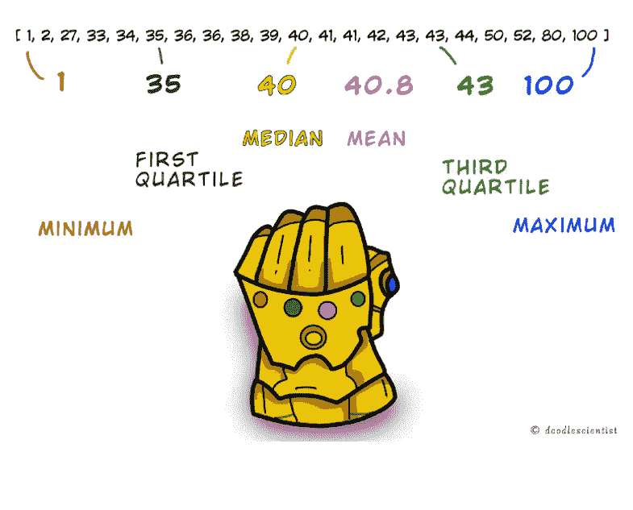
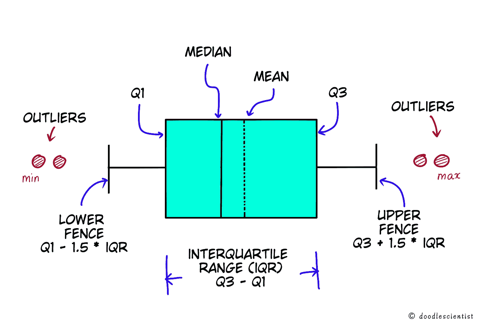
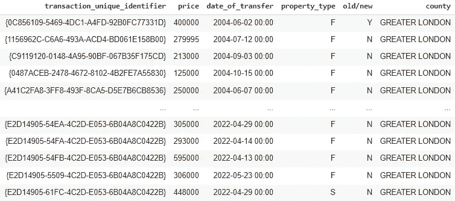
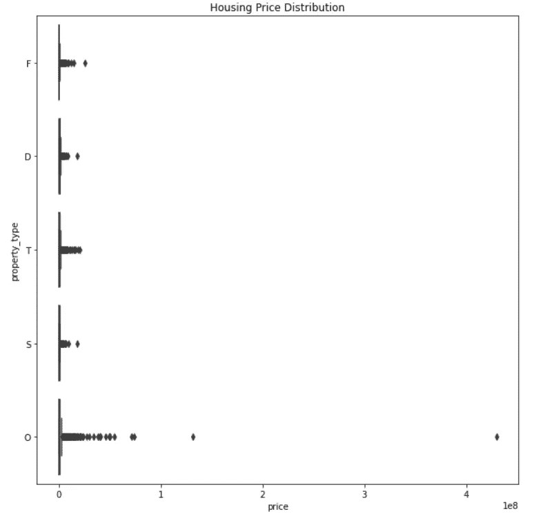

# 理解箱线图:数据世界的无限挑战

> 原文：<https://towardsdatascience.com/understanding-boxplot-infinity-gauntlet-of-the-dataverse-cd57cd067711>

## 使用 boxplots 和 Tukey 的方法消除手指(或代码)瞬间的异常值


来自 [Flickr](https://www.flickr.com/photos/anazasicustom/45484665074/) 的抄送图片

箱线图可能会让许多初学者望而生畏。

***那是因为他们塞满了统计见解！***

但是，如果你愿意挖掘得更深一点，它们可以揭示一个信息宝库。箱线图是统计学和数据科学中的强大工具。

*有多强大？*

这么说吧:

> *如果灭霸是一名数据科学家，那么 boxplot 将是他的* ***无限挑战***——他有能力将数据汇总成拳头，并且用手指轻轻一弹就能消除异常值！

而就像《复仇者联盟》中，无限的宇宙力量集中在 6 个无限的石头上——***将海量数据汇总的力量，浓缩成仅仅 6 个数值。***

**箱线图直观地表示了这 6 个值。**

使用它们，您可以:

*   获得对数字数据的深刻理解
*   做一个快速的图形检查
*   比较数据中的不同组
*   使用它们来了解并消除数据中的异常值

***这就是你所谓的数据超级大国！***

让我们看看如何理解箱线图，它用来总结数据的 6 个值，以及如何使用它们通过**快照消除异常值！**

# 理解箱线图

既然我们如此彻底地建立了挑战类比，让我们充分利用它来理解无限宝石——呃，对不起，我指的是 6 个重要的价值。

这张图片会让它更清晰！



作者图片

如图所示，取 21 个数字的升序排序列表**。**

*   小指上的石头代表的最小值是列表中的最小值，在本例中为 1。
*   **最大值**是最大值，即 100。
*   **中值**是列表正中央的号。50%的数据位于中间值的两边。40 在上面的列表中间。
*   还有**的意思，**也在中间。但不是列表的中间，而是在列表中值的 ***算术中间***—它是所有值的总和除以列表中值的计数，在本例中是 40.8。

你们中的大多数人已经知道上面的值，因为它们是非常常用的。但是剩下的两个呢？

*   **第一个四分位数**(或 Q1) 是 25%的数据点所在的值。从某种意义上说，它是前半部分数据的中位数。
*   **第三个四分位数**(或 Q3)是 75%的数据点所在的值。是后半部分数据的中位数。

(注意:*中位数本身也被称为第二个四分位数或 Q2* )

就是这样！

握紧你的拳头，你已经把 21 个数字压缩成 6 个数值。

而且不管是 21 个还是 10 亿，这 6 个数值足以给你很多感悟。

现在让我向您展示这些值是如何可视化表示的。



作者图片

你看这里，我们可以从这个图中得到更多有趣的信息。

*   **四分位数间距(IQR)** 是第三个四分位数与第一个四分位数的差值:(Q3 — Q1)。它给出了中间一半数据的范围。

**盒子两边的 T 型突起是什么？**

它们被称为胡须或栅栏。他们将相关数据与离群值隔离开来。

*   **下围栏**计算为 Q1 — (1.5 * IQR)
*   **上围栏**按 Q3 + (1.5 * IQR)计算

任何超出这些限制的都是数据中的异常值。

***唷！***

这是一个图表中的大量信息！

现在，让我们使用 python 获取列表并自动生成图表。使用 Plotly 和 chart-studio 真的很简单。

我已经将该图导出到 chart studio，因此您可以看到下面的交互式版本。

作者在 Plotly Chart Studio 中创建的图表

这就对了，太简单了！

*   一眼就能看出数据的中值、平均值、范围和异常值
*   您可以看到 50%的数据位于值 35 和 43 之间
*   你还可以推断出数据的更多特征。中间线在中线的右边，因此是一个 ***右偏分布***

我希望你现在理解了箱线图及其威力。

但是，等一下，这只是故事的一半。

现在你有了比喻护手的力量，你也需要打响指了！

让我们通过一个真实的例子来看看如何使用它来消除数据中的异常值。

# 啪！消除异常值

现在您知道了，使用四分位范围计算的上下围栏可以方便地用于从数据中分离异常值。

但是你有没有想过为什么两边的间距是 IQR 的 1.5 倍？

**答案在于统计。**

根据[68–95–99.7 规则](https://en.wikipedia.org/wiki/68%E2%80%9395%E2%80%9399.7_rule#:~:text=In%20statistics%2C%20the%2068%E2%80%9395,deviations%20of%20the%20mean%2C%20respectively.)，大部分数据(99.7%)位于标准分布两侧平均值的 3 个标准差(< 3σ)以内。它之外的一切都是离群值。

现在，第一个四分位数和第三个四分位数位于均值两侧的 0.675 σ处。

让我们做一些快速的数学运算。

```
Let X be the multiplying factor we need to calculate

Lower Fence = Q1 - X * IQR
            = Q1 - X * (Q3 - Q1)

# The lower fence should be at -3σ
# Q3 is 0.675σ and Q1 is -0.675σ

-3σ = -0.675σ - X * (0.675σ + 0.675σ)
-3σ = -0.675σ -1.35σX

X = 2.325 / 1.35
  ~ 1.7

# Similarly, it can be calculated for upper fence too!
```

我们得到的值大约是 1.7，但是我们用的是 1.5。

**用这种方法剔除异常值被称为图基方法。**

*(这种方法以约翰·图基命名，据说他说选择 1.5 是因为 1 太小，2 太大！)*

这是统计学中最简单的方法之一，但是效果出奇的好。

**让我们看一个现实生活中的例子，并用 python 构建一个形象化的快照。**

我使用了英国 2022 年的公共住房价格数据。

```
# imports
import chart_studio
import plotly.express as px
import pandas as pd

# Housing price data
col_names =    ["transaction_unique_identifier",
                "price",
                "date_of_transfer",
                "postcode",
                "property_type",
                "old/new",
                "duration",
                "PAON", 
                "SAON",
                "street", 
                "locality", 
                "town/city", 
                "district", 
                "county", 
                "PPD_category_type", 
                "record_status_monthly_file_only"]

# Read data
df = pd.read_csv('http://prod.publicdata.landregistry.gov.uk.s3-website-eu-west-1.amazonaws.com/pp-2022.txt',
                  header = None, 
                  names=col_names)
```

前几列如下所示:



作者截屏

现在，让我们使用箱线图快速查看大伦敦地区的房产类型及其价格。

```
# Filter data for the county Greater London
df= df[df["county"] == "GREATER LONDON"]

# Boxplot of the fractional data
sns.boxplot(x = df['price'], 
            y = df['property_type'], 
            orient = "h").set(title='Housing Price Distribution')
```



作者截屏

那看起来很糟糕，不是吗？

有巨大的异常值，以至于我们甚至看不到盒子图中的*盒子*！

这甚至不足以创建一个交互式图表。

**让我们利用你对 IQR 的了解创建一个简洁的小脚本。**

Python 有*分位数函数*，获取定义分位数内的数据部分。

```
# Create a function to get the outliers

def get_outliers_IQR(df):

   q1=df.quantile(0.25)
   q3=df.quantile(0.75)

   IQR=q3-q1

   lower_fence = q1-1.5*IQR
   upper_fence = q3+1.5*IQR

   outliers = list(df[((df < lower_fence) | (df > upper_fence))])

   return outliers
```

让我们将它与我们的数据框一起使用来移除异常值。

(**请注意:**

```
# Get outliers from the prices
outliers =  get_outliers_IQR(df['price'])

# Remove outliers that we got in the outlier list - aka the Snap!
df_snap_outliers = df[~df['price'].isin(outliers)]
```

等着吧…

**猛咬！**

这一次，我们来看看交互式箱线图。

```
# Create boxplot from the list
fig = px.box(data_snap_outliers, 
             x="price", 
             y="property_type", 
             color="property_type",
             orientation='h', 
             template = "plotly_white",
             color_discrete_sequence= px.colors.qualitative.G10,
             title="House prices of different types of house in London - Sept 2022"
             )

# There are many quartile calculation methods. 
# The one we discussed is calculated in plotly with quartilemethod = "inclusive"
fig.update_traces(quartilemethod="inclusive", boxmean = True)

# Set margins, font and hoverinfo
fig.update_layout(margin=dict(l=1, r=1, t=30, b=1), 
                  font_family="Open Sans", 
                  font_size=14,
                  hovermode= "y"
                  )
# Show plot
fig.show()
```

由作者使用 Plotly Chart Studio 创建

看来这一扣成功了！

即使只看一眼，你也能从图表中推断出很多:

*   每个类别的分布都是右偏的，这意味着更多的房子有更高的价格
*   与其他组相比，O 类房屋具有更高的可变性和范围
*   D 类房屋通常更贵

**牛逼吧？**

您应用箱线图来可视化真实世界的住房数据，并使用它们来消除异常值！

# 改进和总结想法

在这篇文章中，你学习了箱线图和使用无限长手套的类比剔除异常值(我希望你是漫威的粉丝😉).

我已经给了初学者一个简单的解释，但是你可以更进一步，使用这些图做一个深入的分析。

然而，要记住的一件事是**箱线图**和 **Tukey 方法**只是统计学中许多工具和方法中的一部分。

你需要了解它们什么时候最适合使用。

例如，异常值有时可能是有用的，甚至不需要严格消除。

同样，箱线图也不能总是使用。它们有一个缺点，那就是我们无法看到组内有多少个数据点。

这可以通过使用 Plotly 的 boxplot 函数中的“所有点”参数来解决，在这里我们可以看到数据点和盒子在一起，或者通过一种完全不同的图来解决——一个**小提琴图**。

小提琴图给出了数据密度以及箱线图，小提琴的宽度表示数据的频率。

**在某种意义上，它是箱线图和直方图的结合。**

查看带有小提琴图的房屋类别示例:

```
# Create boxplot from the list
fig = px.violin(data_snap_outliers, 
             x="price", 
             y="property_type", 
             color="property_type",
             orientation='h', 
             template = "plotly_white",
             color_discrete_sequence= px.colors.qualitative.G10,
             box = True,
             title="House prices of different types of house in London - Sept 2022"
             )

# Set margins, font and hoverinfo
fig.update_layout(margin=dict(l=1, r=1, t=30, b=1), 
                  font_family="Open Sans", 
                  font_size=14,
                  hovermode= "y"
                  )
# Show plot
fig.show()
```

由作者使用 Plotly Chart Studio 创建

我们在这里可以推断出的一件事是，尽管 O 类的价格范围更大，但与数据密度更高的 F 类相比，该类别的房屋销量更少。

很酷不是吗？

那么，为什么我们从盒子图而不是小提琴图开始呢？

因为首先从盒子情节中获得基础是必要的，因为小提琴情节只是它的一个更好的变体。

***不过别担心，我会在另一篇帖子里详细介绍小提琴的剧情！***

我希望你喜欢阅读并学到很多东西！写这篇文章让我很开心，如果你有任何反馈，我很乐意收到你的来信。

在那之前，

*快乐学习！*

*鳍。*

**来源:**

[http://d-scholarship.pitt.edu/7948/1/Seo.pdf](http://d-scholarship.pitt.edu/7948/1/Seo.pdf)

包含英国皇家土地注册局数据，皇家版权和数据库权利 2021。该数据根据[开放政府许可](http://www.nationalarchives.gov.uk/doc/open-government-licence/version/3/) v3.0 获得许可。根据 OGL，HM 土地注册处允许您将[价格支付数据](https://www.gov.uk/government/statistical-data-sets/price-paid-data-downloads)用于商业或非商业目的。此处数据链接:[https://www . gov . uk/government/statistical-data-sets/price-payed-data-downloads #单文件](https://www.gov.uk/government/statistical-data-sets/price-paid-data-downloads#single-file)