# 通过实施了解:决策树

> 原文：<https://towardsdatascience.com/understanding-by-implementing-decision-tree-dd395867af7e>

## 建立你自己的模型

## 了解决策树是如何工作的，并用 Python 实现它

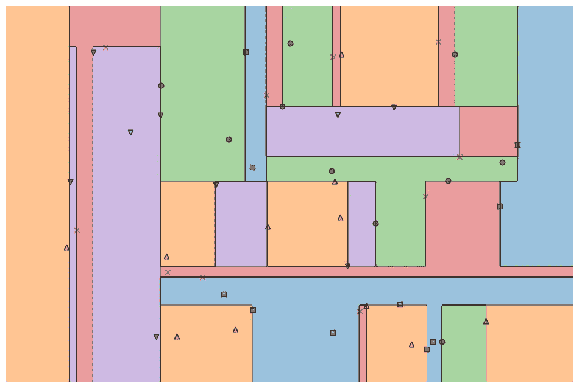

图片由作者提供。

M 任何先进的机器学习模型如随机森林或梯度增强算法如 XGBoost、CatBoost 或 LightGBM(甚至[自动编码器](https://medium.com/towards-data-science/building-a-simple-auto-encoder-via-decision-trees-28ba9342a349)！)依赖于一个至关重要的共同因素:T4 决策树！

不理解决策树，就不可能理解前面提到的任何高级 bagging 或梯度推进算法，这对任何数据科学家来说都是一种耻辱！😁因此，让我们通过用 Python 实现一个决策树来揭开决策树内部工作的神秘面纱。

在本文中，您将了解到

*   决策树为什么以及如何拆分数据，
*   信息增益，以及
*   如何用 NumPy 在 Python 中实现决策树？

> 你可以在 [my Github](https://github.com/Garve/Towards-Data-Science---Notebooks/blob/main/TDS%20-%20Decision%20Tree.ipynb) 上找到代码。

# 该理论

为了进行预测，决策树依靠**以递归方式将**数据集分割成更小的部分。

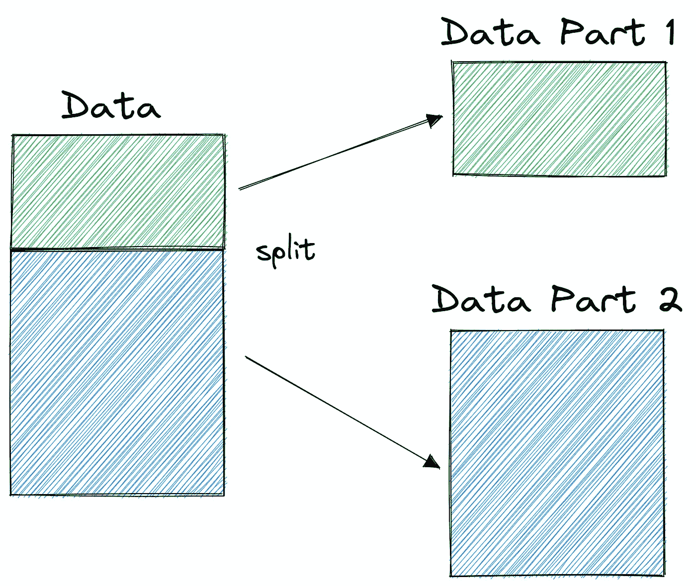

图片由作者提供。

在上图中，您可以看到一个分割示例，即原始数据集被分成两部分。在下一步中，这两个部分再次被分割，以此类推。这一直持续到满足某种停止标准，例如，

*   如果分割导致一部分为空
*   如果达到了某个递归深度
*   如果(在之前的分割之后)数据集仅包含少数元素，则无需进一步分割。

我们如何找到这些分裂？我们为什么要在乎呢？让我们找出答案。

## 动机

让我们假设我们想要解决一个**二元** **分类问题**我们现在自己创建:

```
import numpy as np

np.random.seed(0)

X = np.random.randn(100, 2) # features
y = ((X[:, 0] > 0) * (X[:, 1] < 0)) # labels (0 and 1)
```

二维数据如下所示:

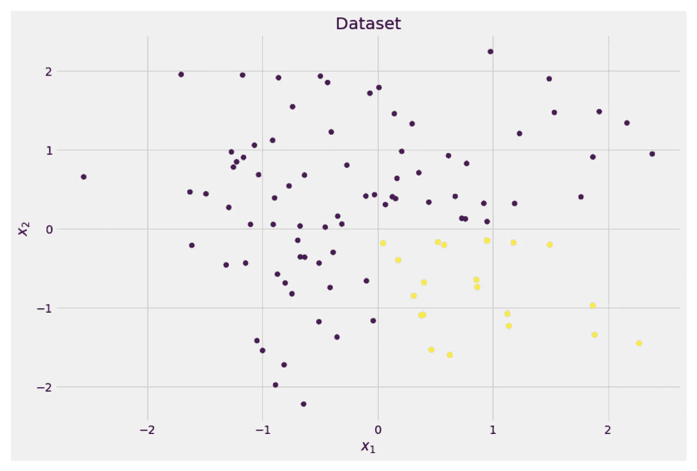

图片由作者提供。

我们可以看到有两个不同的类别——紫色约占 75%,黄色约占 25%。如果您将这些数据输入决策树**分类器**，该树最初会有以下想法:

> “有两个不同的标签，对我来说太乱了。我想通过将数据分成两部分来清理这种混乱——这些部分应该比之前的完整数据更干净。”—获得意识的树

这棵树也是如此。

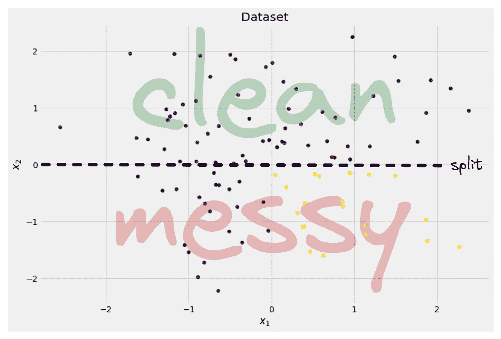

图片由作者提供。

树决定大致沿着 *x* 轴进行分割。这样做的效果是，数据的顶部现在是完全干净的， **意味着你只在那里找到*一个单独的类*(在本例中为紫色)。**

不过底部还是*乱*，某种意义上甚至比以前更乱。在完整的数据集中，类的比例曾经是大约 75:25，但是在这个更小的部分中，它是大约 50:50，这是它能得到的最大混合

> *⚠️* 只是将 ***两部分中不同标签*** *的原始数量进行计数。*

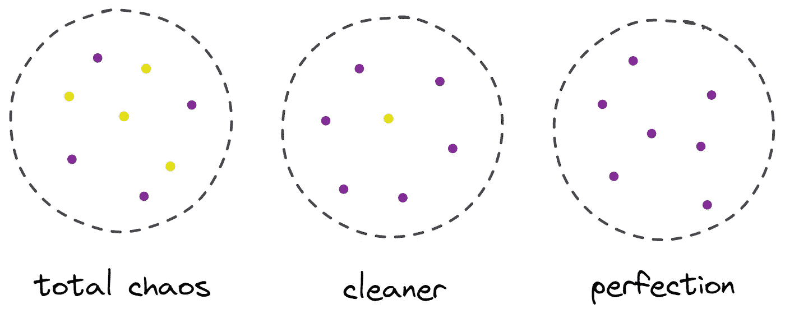

图片由作者提供。

尽管如此，对于这棵树来说，这已经是足够好的第一步了，所以它会继续下去。虽然它不会在顶部创建另一个分割，*清理*部分，它可以在底部创建另一个分割来清理它。

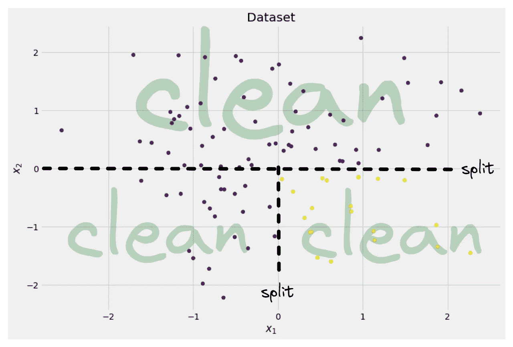

图片由作者提供。

瞧，三个独立的部分都是完全干净的，因为我们发现每个部分只有一种颜色(标签)。

现在做预测真的很容易:如果一个新的数据点进来，你只需检查它位于三个部分中的哪一个，并给它相应的颜色。这个现在工作得很好，因为每个部分都很干净。很简单，对吧？

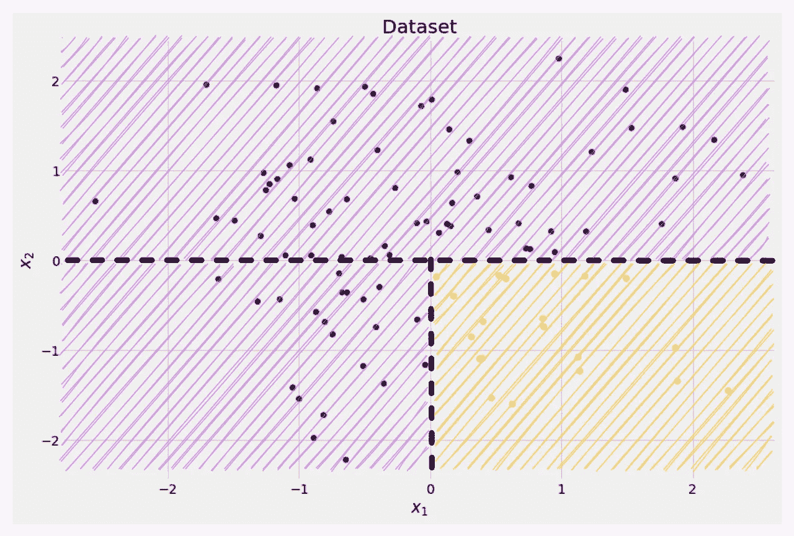

图片由作者提供。

好的，我们正在谈论*干净的*和*杂乱的*数据，但是到目前为止，这些词仅仅代表一些模糊的概念。为了实现任何事情，我们必须找到定义*清洁度*的方法。

## 清洁措施

假设我们有一些标签，例如

```
y_1 = [0, 0, 0, 0, 0, 0, 0, 0]
y_2 = [1, 0, 0, 0, 0, 0, 1, 0]
y_3 = [1, 0, 1, 1, 0, 0, 1, 0]
```

直觉上， *y* ₁是最干净的一组标签，其次是 *y* ₂，然后是 *y* ₃.到目前为止一切顺利，但是我们如何对这种行为进行量化呢？可能想到的最简单的事情是下面这些:

> 数数 0 和 1 的数量。计算它们的绝对差值。为了使它更好，通过除以数组的长度来规范化它。

例如， *y* ₂总共有 8 个条目——6 个 0 和 2 个 1。因此，我们自定义的**清洁度得分**将是|6 - 2| / 8 = 0.5。很容易计算出 *y* ₁和 *y* ₃的清洁度得分分别为 1.0 和 0.0。在这里，我们可以看到通用公式:

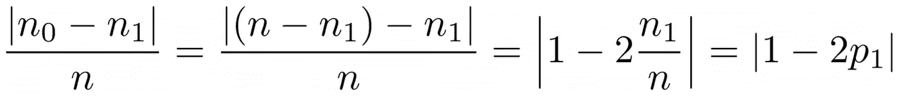

图片由作者提供。

这里， *n* ₀和 *n* ₁分别是 0 和 1 的个数，*n*=*n*₀+*n*₁是数组的长度，*p*₁=*n*₁/*n*是 1 个标签的份额*。*

这个公式的问题是**是专门为两个类**的情况定制的，但是我们通常对多类分类感兴趣。一个非常有效的公式是**基尼系数**

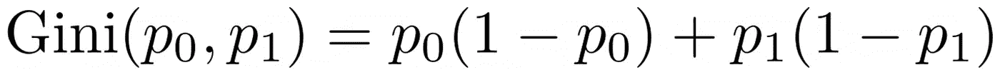

图片由作者提供。

或者一般情况下:

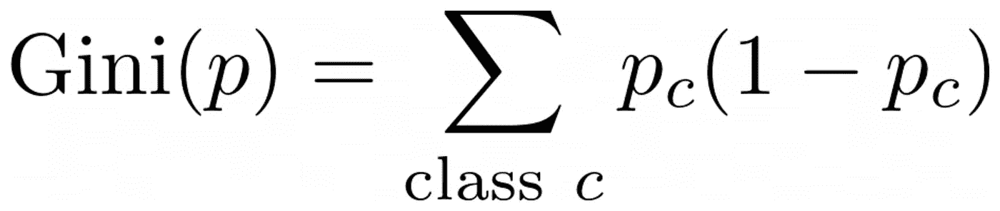

图片由作者提供。

它工作得非常好，以至于 scikit-learn [将它作为其`DecisionTreeClassifier`类的默认度量](https://scikit-learn.org/stable/modules/generated/sklearn.tree.DecisionTreeClassifier.html)。

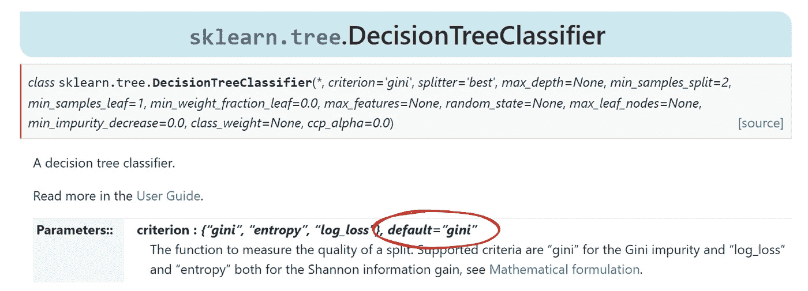

图片由作者提供。

> *⚠️* ***注:*** *基尼系数* ***脏乱度*** *而非洁癖。例如:如果一个列表只包含一个类(=非常干净的数据！)，则总和中的所有项都为零，因此总和为零。最糟糕的情况是所有类别出现的次数完全相同，在这种情况下，基尼系数是 1–1/*C*，其中* C *是类别的数量。*

现在我们有了一个衡量干净/脏乱的标准，让我们看看如何用它来找到好的分割。

## 查找拆分

有很多劈叉可供我们选择，但哪一个是好的呢？让我们再次使用我们的初始数据集，连同基尼系数杂质测量。


图片由作者提供。

我们现在不算点数，先假设 75%是紫色，25%是黄色。使用基尼系数的定义，完整数据集的杂质为

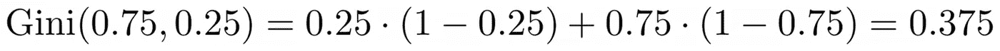

图片由作者提供。

如果我们沿着 *x* 轴分割数据集，如前所述:

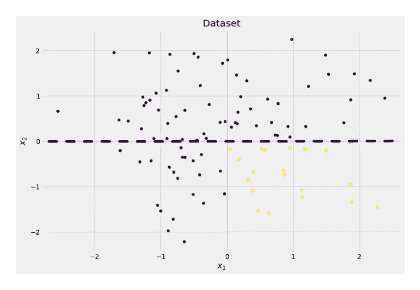

图片由作者提供。

**顶部的基尼系数为 0.0** ，底部

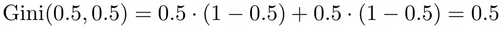

图片由作者提供。

平均而言，这两部分的基尼系数为(0.0 + 0.5) / 2 = 0.25，比之前整个数据集的 0.375 要好。我们也可以用所谓的**信息增益**来表达:

> 这种分裂的信息增益是 0.375–0.25 = 0.125。

就这么简单。信息增益越高(即基尼系数越低)，效果越好。

> ***注意:*** *另一个同样好的初始分割会沿着 y 轴。*

需要记住的一个重要的事情是**用零件的大小来衡量零件的基尼杂质是有用的**。例如，让我们假设

*   第 1 部分由 50 个数据点组成，基尼系数为 0.0
*   第二部分由 450 个数据点组成，基尼系数为 0.5，

那么平均基尼杂质就不应该是(0.0 + 0.5) / 2 = 0.25 而是 50/(50+450)* 0.0+450/(50+450)* 0.5 =**0.45**。

好吧，那我们怎么找到最好的分割呢？简单但发人深省的答案是:

> 尝试所有的拆分，然后选择信息增益最高的一个。这基本上是一种蛮力的方法。

更准确地说，标准决策树使用沿坐标轴的**分裂，即 *xᵢ* = *c* 用于某些特征 *i* 和阈值*c。*这意味着**

*   分割数据的一部分由所有数据点 *x* 和 *xᵢ* < *c* 组成
*   所有点的另一部分 *x* 同 *xᵢ* ≥ *c.*

这些简单的拆分规则在实践中已经证明足够好了，但是你当然也可以扩展这个逻辑来创建其他的拆分(例如像 *xᵢ + 2xⱼ = 3* 这样的对角线)。

太好了，这些都是我们现在需要的原料！

# 实施

我们现在将实现决策树。因为它由节点组成，所以让我们先定义一个`Node`类。

```
from dataclasses import dataclass

@dataclass
class Node:
    feature: int = None # feature for the split
    value: float = None # split threshold OR final prediction
    left: np.array = None # store one part of the data
    right: np.array = None # store the other part of the data
```

节点知道它用于分裂的特征(`feature`)以及分裂值(`value`)。`value`也用作决策树最终预测的存储。由于我们将构建一个二叉树，每个节点需要知道它的左右子节点，正如存储在`left`和`right`中的那样。

现在，让我们做实际的决策树实现。我让它兼容 scikit-learn，因此我使用了一些来自`sklearn.base`的类。如果您对此不熟悉，请查看我关于如何构建 scikit-learn 兼容模型的文章:

[](/build-your-own-custom-scikit-learn-regression-5d0d718f289) [## 构建您自己的定制 scikit-学习回归

### 编写一个回归变量，并从 scikit-learn 生态系统的所有强大工具中受益，如管道、网格搜索…

towardsdatascience.com](/build-your-own-custom-scikit-learn-regression-5d0d718f289) 

来实施吧！

```
import numpy as np
from sklearn.base import BaseEstimator, ClassifierMixin

class DecisionTreeClassifier(BaseEstimator, ClassifierMixin):
    def __init__(self):
        self.root = Node()

    @staticmethod
    def _gini(y):
        """Gini impurity."""
        counts = np.bincount(y)
        p = counts / counts.sum()

        return (p * (1 - p)).sum()

    def _split(self, X, y):
        """Bruteforce search over all features and splitting points."""
        best_information_gain = float("-inf")
        best_feature = None
        best_split = None

        for feature in range(X.shape[1]):
            split_candidates = np.unique(X[:, feature])
            for split in split_candidates:
                left_mask = X[:, feature] < split
                X_left, y_left = X[left_mask], y[left_mask]
                X_right, y_right = X[~left_mask], y[~left_mask]

                information_gain = self._gini(y) - (
                    len(X_left) / len(X) * self._gini(y_left)
                    + len(X_right) / len(X) * self._gini(y_right)
                )

                if information_gain > best_information_gain:
                    best_information_gain = information_gain
                    best_feature = feature
                    best_split = split

        return best_feature, best_split

    def _build_tree(self, X, y):
        """The heavy lifting."""
        feature, split = self._split(X, y)

        left_mask = X[:, feature] < split

        X_left, y_left = X[left_mask], y[left_mask]
        X_right, y_right = X[~left_mask], y[~left_mask]

        if len(X_left) == 0 or len(X_right) == 0:
            return Node(value=np.argmax(np.bincount(y)))
        else:
            return Node(
                feature,
                split,
                self._build_tree(X_left, y_left),
                self._build_tree(X_right, y_right),
            )

    def _find_path(self, x, node):
        """Given a data point x, walk from the root to the corresponding leaf node. Output its value."""
        if node.feature == None:
            return node.value
        else:
            if x[node.feature] < node.value:
                return self._find_path(x, node.left)
            else:
                return self._find_path(x, node.right)

    def fit(self, X, y):
        self.root = self._build_tree(X, y)
        return self

    def predict(self, X):
        return np.array([self._find_path(x, self.root) for x in X])
```

就是这样！你可以做所有你喜欢的关于 scikit 的事情——立即了解:

```
dt = DecisionTreeClassifier().fit(X, y)
print(dt.score(X, y)) # accuracy

# Output
# 1.0
```

由于树是不规则的，它过度拟合了很多，因此是完美的训练分数。对于看不见的数据，准确性会更差。我们还可以通过

```
print(dt.root)

# Output (prettified manually):
# Node(
#   feature=1,
#   value=-0.14963454032767076,
#   left=Node(
#          feature=0,
#          value=0.04575851730144607,
#          left=Node(
#                 feature=None,
#                 value=0,
#                 left=None,
#                 right=None
#          ),
#          right=Node(
#                  feature=None,
#                  value=1,
#                  left=None,
#                  right=None
#          )
#        ),
#   right=Node(
#           feature=None,
#           value=0,
#           left=None,
#           right=None
#   )
# )
```

作为一张图片，应该是这样的:

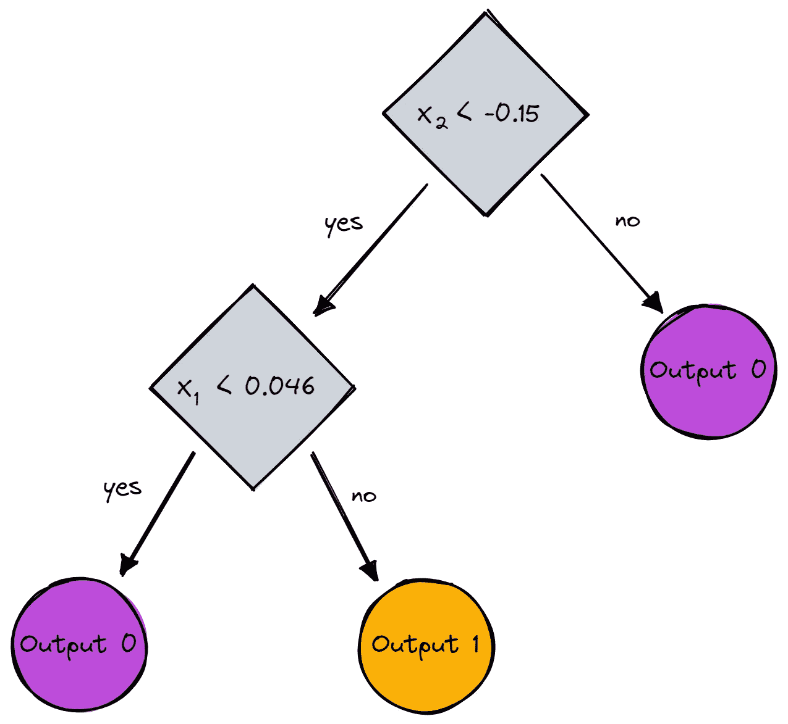

图片由作者提供。

# 结论

在本文中，我们已经详细了解了决策树是如何工作的。我们从一些模糊但直观的想法开始，然后将它们转化为公式和算法。最终，我们能够从头开始实现一个决策树。

不过需要注意的是:我们的决策树还不能被正则化。通常，我们希望指定如下参数

*   最大深度
*   叶子大小
*   和最小的信息增益

还有很多其他的。幸运的是，这些事情实现起来并不困难，这让它成为你的完美作业。例如，如果您指定`leaf_size=10`作为参数，那么包含超过 10 个样本的节点就不应该再被分割。此外，这种实现方式**效率不高**。通常，您不希望在节点中存储数据集的一部分，而是只存储索引。因此，您的(可能很大的)数据集只在内存中存在一次。

好的一面是，现在你可以疯狂地使用这个决策树模板。您可以:

*   实施对角线分割，即 *xᵢ + 2xⱼ = 3* 而不是仅仅 *xᵢ = 3，*
*   改变叶子内部发生的逻辑，也就是说，你可以在每个叶子内部运行逻辑回归，而不仅仅是进行多数投票，这就给出了一个[线性树](https://github.com/cerlymarco/linear-tree)
*   改变分裂程序，即不要使用蛮力，尝试一些随机组合并挑选最好的一个，这给了你一个[额外树分类器](https://scikit-learn.org/stable/modules/generated/sklearn.tree.ExtraTreeClassifier.html#sklearn.tree.ExtraTreeClassifier)
*   还有更多。

此外，检查我的基本机器学习算法的其他实现！

[](/understanding-by-implementing-k-nearest-neighbors-469d6f84b8a9) [## 通过实现来理解:k-最近邻

### 了解 k-最近邻分类器的工作原理并在 Python 中实现它

towardsdatascience.com](/understanding-by-implementing-k-nearest-neighbors-469d6f84b8a9) [](/learning-by-implementing-gaussian-naive-bayes-3f0e3d2c01b2) [## 通过实施学习:高斯朴素贝叶斯

### 了解高斯朴素贝叶斯的工作原理，并用 Python 实现它！

towardsdatascience.com](/learning-by-implementing-gaussian-naive-bayes-3f0e3d2c01b2) 

我希望你今天学到了新的、有趣的、有用的东西。感谢阅读！

**作为最后一点，如果你**

1.  **想支持我多写点机器学习和**
2.  **无论如何都要计划获得中等订阅量，**

**为什么不做** [**通过这个环节**](https://dr-robert-kuebler.medium.com/membership) **？这将对我帮助很大！😊**

透明地说，给你的价格不变，但大约一半的订阅费直接归我。

非常感谢，如果你考虑支持我的话！

> *有问题就在*[*LinkedIn*](https://www.linkedin.com/in/dr-robert-k%C3%BCbler-983859150/)*上写我！*