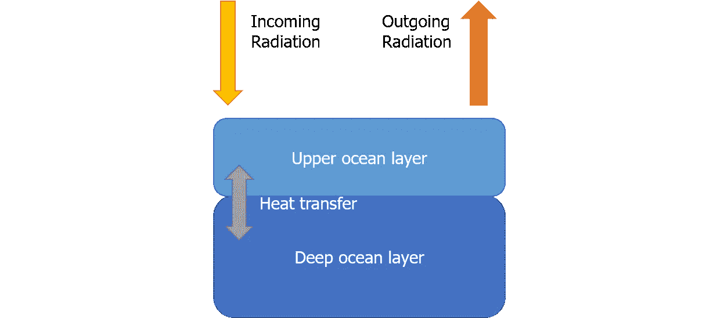
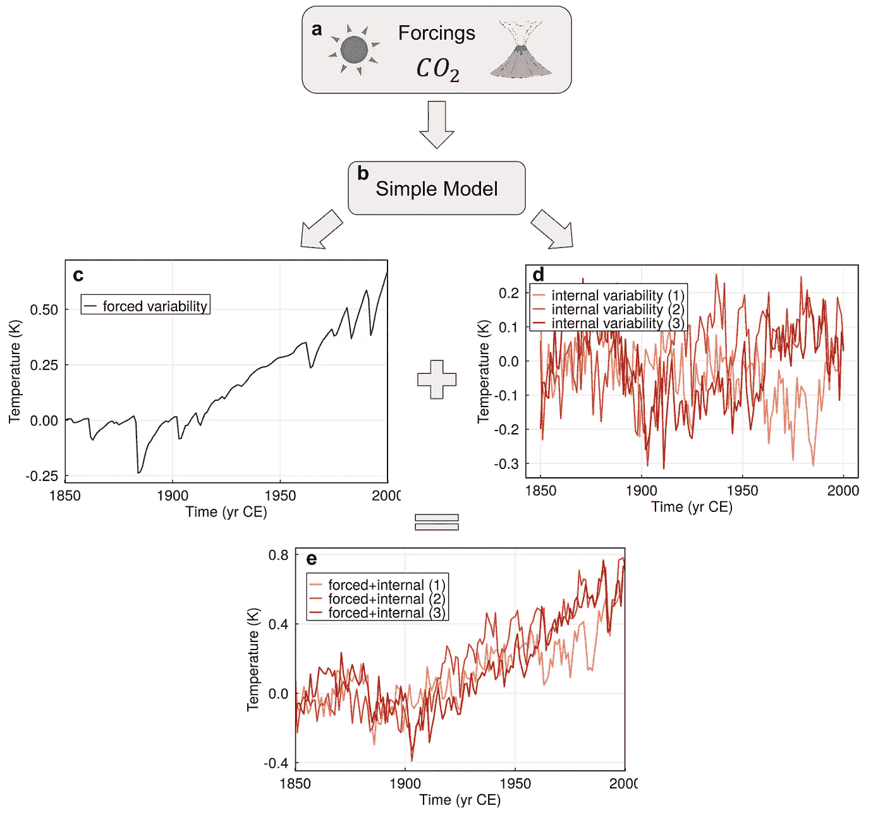
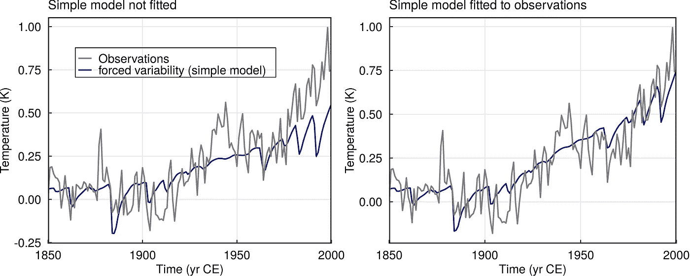
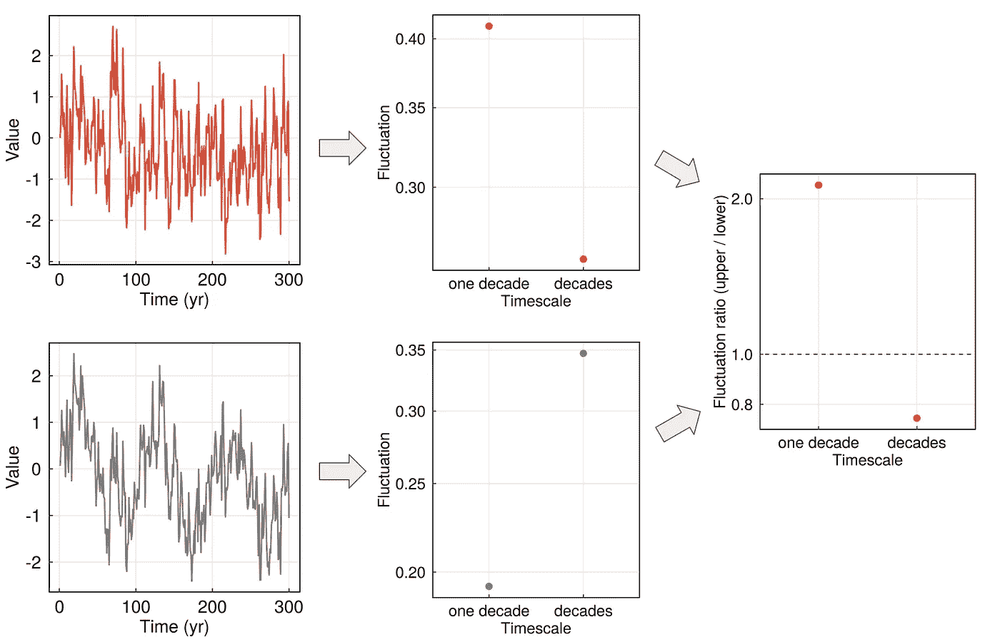
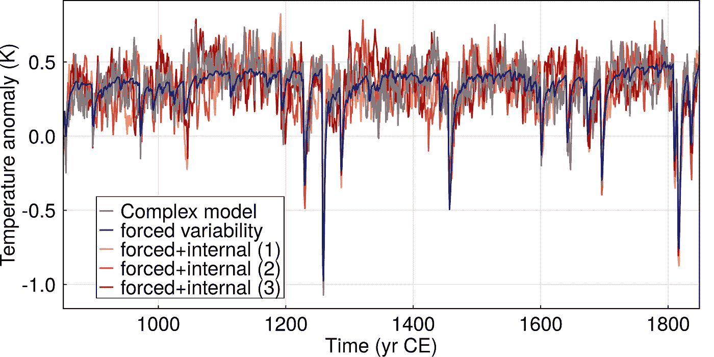
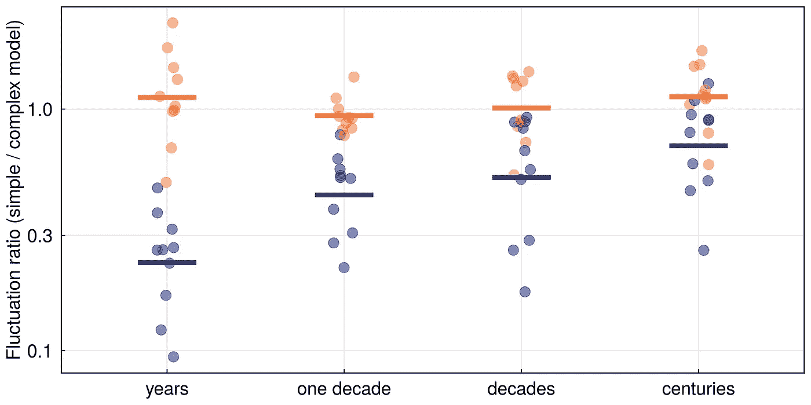

# 了解气候变化

> 原文：<https://towardsdatascience.com/understanding-climate-variability-d987097b5bc7>

## 一个简单的气候模型、统计和时间序列分析能有什么帮助

为了预测和减轻气候危机的影响，我们需要了解一段时间内全球变暖的平均值以及与平均值的偏差。来自物理学和数学的工具可以帮助我们分析气候的波动，也称为气候可变性。

数据来自气候观测和气候模型模拟。不幸的是，仪器观测只能追溯到工业革命前后。大多数气候模型模拟非常复杂，需要超级计算能力。所以，我们想知道:用一个简单的数学模型，我们能多好地再现全球温度的变化？在我们最近的[出版物](https://doi.org/10.1063/5.0106123)中，我们使用物理学、统计学和时间序列分析的方法来解决这个问题。

由 [NASA](https://unsplash.com/@nasa?utm_source=medium&utm_medium=referral) 在 [Unsplash](https://unsplash.com?utm_source=medium&utm_medium=referral) 上拍摄的照片

# 气候变率的类型

有外部驱动的(所谓的“强迫”)和内部的气候变化。外部驱动因素(“作用力”)是指影响地球能量平衡的任何过程。它们可能发生在地球外部(如太阳强度的变化)，或当前气候外部(如火山爆发或人类温室气体排放)。)

相反，内部变化主要是由混乱的大气或海洋过程引起的。这包括我们的日常天气，但也包括更缓慢变化的波动，如厄尔尼诺-南方涛动。

在我们的[论文](https://doi.org/10.1063/5.0106123)中，我们提出了一种方法来区分外部驱动(“强迫”)和内部变化对全球年平均气温的影响。为此，我们开发了一个统计工具箱，也可以在 GitHub 上免费获得([R-package“ClimBayes”](https://github.com/paleovar/ClimBayes)*和论文的[代码)。此外，我们讨论不同时间尺度上的可变性，并区分哪些过程与短期预测最相关，哪些过程与长期预测最相关。](https://github.com/paleovar/EmulatingVariability)*

# *我们的工具箱*

*我们的分析结合了三种方法:简单模型(1)、统计拟合(2)和波动分析(3)。*

## ***1)简单气候模型***

*第一个工具是一个非常简单的气候模型，即所谓的能量平衡模型。它根据进出辐射的平衡来计算全球年平均温度。在该模型中，地球由两层海洋组成:上层储存和释放热量的速度相当快，加上深层的热交换速度很慢。*

> *在数学上，这个模型可以用一个微分方程来表示，只有两行。该方程包括确定性部分和随机部分。确定性部分将产生强制可变性，而随机性导致随机内部可变性。*

**

*两箱能量平衡模型。*

*下图展示了 1850-2000 年间模型可变性的一个例子。不同营力的时间演变作为模型的输入(图 a 和 b)。作为输出，该模型给出了强制和内部可变性的单独估计。强迫变率(图 c)显示，由于人为排放，过去 100 年有明显上升趋势。较小的下降是由火山爆发引起的——因为大气中更多的反光气溶胶导致短暂的冷却期。对内部可变性的最佳猜测不仅仅是单一的时间序列，而是随机样本，即可变性可能如何的可能性(图 d)。将两个估计值相加得出模型模拟的总可变性(图 e)。根据我们的简单模型，三条红色/橙色线中的每一条都同样可能是温度可能如何演变的选项。*

**

*根据 1850-2000 年期间的简单气候模型的可变性的例子。*

## *2)用数据拟合简单模型*

*我们将简单的模型与更复杂的气候模型的模拟进行比较。我们的目标是了解我们的简单方法能在多大程度上逼近更复杂的方法。为了进行分析，我们需要一种统计方法来将简单模型与其他温度数据进行拟合。这是我们的第二个工具:我们的“拟合方法”优化简单模型中的参数，使其与数据最佳匹配。*

> *对专家来说:我们用马尔可夫链蒙特卡罗算法来做这件事，这是一种来自贝叶斯统计的工具。它根据温度数据计算模型参数的所谓后验分布。*

*为了举例说明这种拟合，我们再次考虑过去 150 年(见下图)。这种情况下的温度数据是观测值(灰色)，即气象站的测量值。在左图中，这个简单的模型还没有与数据相吻合，它大大低估了变暖的趋势。在右边的面板中，模型(蓝色，为了更好的可视性，只显示了强制变化)与观测数据相符合，我们看到它可以更好地再现温度的上升。*

**

*1850 年至 2000 年期间“用简单模型拟合数据”的例子。*

## *3)调查时标上的波动*

*我们的最后一步是比较简单模型和复杂模型中的时间波动。为此，我们使用一种方法来研究不同时间尺度上的可变性。这里进入我们的第三个工具:光谱分析。它以一个时间序列作为输入，并将波动量化为时间尺度的函数。*

> *光谱分析的工作原理就像一个棱镜，将白光分解成许多不同的彩色成分，与不同的波长相关联。同样，温度的光谱可以揭示不同“时间长度”的波动，如几天、几个月、几年或几十年。*

*通过累计一定时间间隔内的波动，我们获得了对几年、几十年、几十年和几个世纪的波动的估计。*

*为了介绍这个概念，我们在下一个图中展示了一个例子:从两个人工时间序列(左图)到波动(中图)及其比率(右图)。*

**

*两个人工时间序列的波动分析示例。*

*顶部示例中的时间序列在十年左右的时间尺度上比几十年的可变性更大。较低的时间序列是从较高的时间序列构建的，但有一个额外的缓慢变化的正弦模式。因此，它在几十年的时间尺度上具有更高的波动性。*

*为了比较两个时间序列的波动值，我们可以计算它们的比率:它显示在右边的图中，是顶部波动除以底部波动的比率。在这种情况下，较短时间范围内的比率大于 1，较长时间范围内的比率小于 1。这意味着我们的频谱分析成功地检测到了底部信号中缓慢变化的调制。*

# *我们的简单模型如何描述气候变化*

*我们现在有一个工具箱，由三个工具组成。首先，一个简单的气候模型，它计算强迫和内部气候变化的估计。第二，将简单的气候模型与更复杂的气候模型的数据进行拟合的方法。第三，光谱分析，这有助于我们在不同的时间尺度上分解时间序列中的波动。据我们所知，我们是第一个以这种方式组合这些工具的人，所以建立这个工具箱已经很令人兴奋了。但是我们能用这些工具做什么呢？让我们最后来看看这篇论文的主要结果:*

*我们使用这个工具箱，并将其应用于上一个千年(850-1850)的模拟温度数据。这是我们有大量气候模型模拟和营力重建的最长时期，需要作为模型输入*(不包括 1850-2020 年仅仅是技术原因)*。*

*在此期间，由于频繁的大规模火山爆发，气候变化主要是由短暂的冷却期造成的，如下例中的许多峰值所示。我们展示了一个复杂气候模型的模拟(灰色)和我们的简单气候模型(蓝色代表强迫变率，红色/橙色代表总变率样本)。在本文中，我们研究了几个复杂的气候模型，并为每个模型绘制了一个这样的图。*

**

*一个复杂气候模式的模拟和拟合简单模式的变率。参见主文件中的图 7。*

*为了分析波动，我们应用上面解释的频谱分析:我们计算简单模型的强制可变性(上面的蓝色曲线)、简单模型的强制+内部可变性(上面的红色/橙色曲线)以及复杂模型的不同时间尺度的值。接下来，我们将简单模型的波动除以复杂模型的波动，得到以下比率:*

**

*简单气候模型(蓝色:强迫变率/橙色:强迫+内部变率)与复杂气候模型的波动比。参见主文件中的图 4。*

*每个点代表一个复杂气候模型的一个实验。圆点对应于简单模式的强迫变率和复杂气候模式的比率(蓝色圆点)，或者简单模式的强迫+内部变率和复杂气候模式的比率(橙色圆点)。条形图显示了各个点的平均值。*

*我们发现，在最短的时间尺度上，强制变量(蓝色点/条)和总变量(橙色点/条)之间的差异最大。这意味着内部变化在最短的时间尺度上最重要，这在其他研究中也有发现。*

*最重要的是，我们观察到强制变量+内部变量(橙色柱)的平均比率在所有时间尺度上都接近 1。这意味着我们的简单模型运行良好！最大的差异(图中点的最大分布)发生在较短的时间尺度上，此时内部变化主导了来自营力的影响。这并不奇怪，因为我们的简单模型对内部变化有一个非常简单的描述——太简单而不能正确地近似大气过程。更令人惊讶的是，对于长期波动，我们的简单模型提供了一个不错的近似值。这并不是说我们应该停止运行更复杂的气候模型。我们的简单模型仅限于全球年平均温度。对于局部效应和其他气候参数，如降雨量和风力，综合模型是不可替代的。*

*总之，我们的论文展示了物理学、统计学和时间序列分析工具的成功结合，以调查气候变化。使用这些，我们看到，对于过去一千年的全球年平均温度，一个简单的气候模型可以以合理的精度描述更复杂的气候模型的可变性。手稿包括更多方面，比如不同复杂程度的气候模型的比较。可以在 Chaos 上找到发表的[，GitHub 上的代码(](https://doi.org/10.1063/5.0106123)[R-package“ClimBayes”](https://github.com/paleovar/ClimBayes)*和[代码为论文](https://github.com/paleovar/EmulatingVariability))。去看看吧，感谢你的阅读！**

**最后，感谢我的合著者 Beatrice Ellerhoff、Robert Scheichl 和 Kira Rehfeld、整个 SPACY 团队以及 [Beatrice](https://medium.com/@BeatriceEllerhoff) 、Jonathan 和 [Jeff](https://medium.com/@jeffrey_85949) 对我的初稿提出了非常有用的意见。**

*****来源:*****

*   ***除特别注明外，所有图片均为作者所有。***
*   **1850-2000 年的温度数据:C. P. Morice、J. J. Kennedy、N. A. Rayner、J. P.Winn、E. Hogan、R. E. Killick、R. J. H. Dunn、T. J. Osborn、P. D. Jones 和 I. R. Simpson，“1850 年以来近地表温度变化的更新评估:HadCRUT5 数据集”。研究:大气。126、e2019JD032361、【https://doi.org/10.1029/2019JD032361】 **(2021)。****
*   **强迫数据:G. A. Schmidt、J. H. Jungclaus、C. M. Ammann、E. Bard、p .布拉科诺、T. J. Crowley、G. Delaygue、F. Joos、N. A. Krivova、R. Muscheler、B. L. Otto-Bliesner、J. Pongratz、D. T. Shindell、S. K. Solanki、F. Steinhilber 和 L. E. A. Vieira，“最近一次气候强迫重建用于 PMIP 模拟”模型开发。5, 185–191 (2012).**
*   ***这里使用的复杂气候模型数据(HadCM3 模型):A. P. Schurer，S. F. B. Tett，G. C. Hegerl，“过去一千年太阳变率对气候的微小影响”，Nat。乔斯奇。7, 104–108 (2014).***