# 理解条件方差和条件协方差

> 原文：<https://towardsdatascience.com/understanding-conditional-variance-and-conditional-covariance-8b661067fc18>

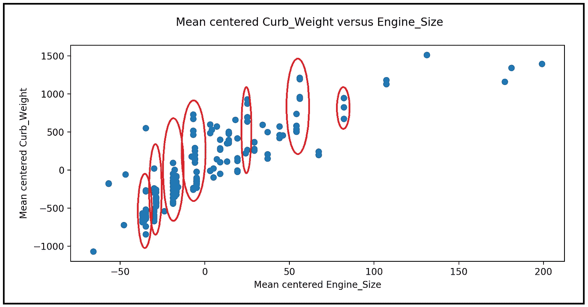

(图片由作者提供)(数据集来源:[加州大学欧文分校](https://archive.ics.uci.edu/ml/datasets/automobile))

## 以及如何使用真实数据集计算它们的教程

条件方差和条件协方差是统计建模的核心概念。在本文中，我们将了解它们是什么，并说明如何使用真实世界的数据集来计算它们。

首先，快速回顾一下什么是方差和协方差。

**随机变量的方差**衡量其围绕均值的变化。两个随机变量之间的**协方差**是对它们各自均值变化的相关程度的度量。

# 条件方差

随机变量 ***X*** 的**条件方差**是通过 ***X*** 与其他随机变量 ***Y*** 、 ***X*** 、***W***…等的关联来“解释掉”一部分变量后留下多少变化的度量。

用符号形式表示为*Var(****X****|****Y****，* ***X*** *，****W****并读作***×***的方差*

*首先，让我们陈述无条件(总)方差的公式:*

*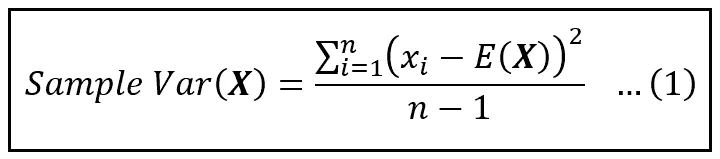*

****X*** 的样本方差公式(图片由作者提供)*

*上式中，*E(****X****)*是 ***X*** 的“无条件”期望(均值)。*

*条件方差的公式是通过简单地将无条件期望替换为条件期望而获得的，如下所示(注意，在等式(2)中，我们现在计算的是 ***Y*** (不是 ***X*** ):*

*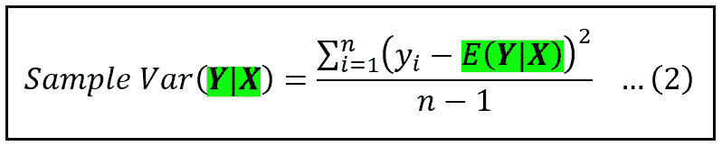*

*以 ***X*** 为条件的 ***Y*** *样本方差公式(图片由作者提供)**

**E(****Y****|****X****)*是对因变量为 ***Y*** 、解释变量为 ***X*** 的数据集拟合回归模型预测的 ***Y*** 的值。索引 *i* 隐含在条件期望中，即对于数据集中的每一行 *i* ，我们使用*E(****Y****= Y _ I |****X****= X _ I)*。*

*这里，我们对回归模型的选择很重要。模型的正确选择将导致 ***Y*** 中的大量方差由拟合的模型来解释，因此 ***Y*** 对 ***X*** 的条件方差将相应较小。另一方面，由于模型无法解释 ***Y*** 中的大部分方差，因此模型选择不正确会导致较大的条件方差。*

*上述条件方差公式可以扩展到多个变量，方差以使用回归模型为条件，其中 ***X*** 矩阵包含多个回归变量。*

## *说明*

*让我们用一些真实世界的数据来说明计算条件方差的过程。下面的数据集包含 205 辆汽车的规格，摘自 1985 年版的沃德汽车年鉴。每行包含一组 26 个关于单个车辆的规格。*

*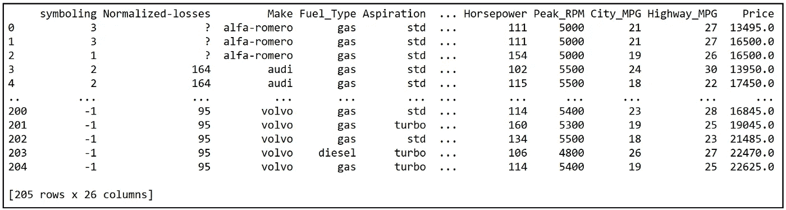*

*汽车数据集(来源:[加州大学欧文分校](https://archive.ics.uci.edu/ml/datasets/automobile))*

*我们将考虑这个数据集的一个小子集，它由以下六个变量组成:
City_MPG
整备质量
Vehicle _ Volume
Num _ Cylinders
Vehicle _ Price
发动机 _Size*

*这个 6 变量数据集可以从这里 下载 [**。**](https://gist.github.com/sachinsdate/6f1b581565e7fc938dfb5dd56f478288)*

*让我们画出发动机大小与气缸数的关系图。我们将使用 Python、Pandas 和 Matplotib 包将数据加载到 DataFrame 中并显示绘图:*

*让我们导入所有需要的包，包括我们将在本文后面使用的包。*

```
***import** pandas **as** pd
**from** patsy **import** dmatrices
**import** numpy **as** np
**import** scipy.stats
**import** statsmodels.api **as** sm
**import** matplotlib.pyplot **as** plt*
```

*现在，让我们将数据文件加载到 Pandas 数据框架中，并绘制引擎大小与汽缸数量的关系图。*

```
****#Read the automobiles dataset into a Pandas DataFrame***df = pd.read_csv(**'automobile_uciml_6vars.csv'**, header=0)***#Drop all empty rows***df = df.**dropna**()***#Plot Engine_Size versus Num_Cylinders***fig = plt.figure()
fig.suptitle(**'Engine_Size versus Num_Cylinders'**)
plt.xlabel(**'Num_Cylinders'**)
plt.ylabel(**'Engine_Size'**)
plt.scatter(df[**'Num_Cylinders'**], df[**'Engine_Size'**])
*#Plot a horizontal mean line* plt.plot([0, df[**'Num_Cylinders'**].max()], [df[**'Engine_Size'**].mean(), df[**'Engine_Size'**].mean()],
         [df[**'Engine_Size'**].mean()], color=**'red'**, linestyle=**'dashed'**)

***#Group the DataFrame by Num_Cylinders and calculate the mean for each group***df_grouped_means = df.groupby([**'Num_Cylinders'**]).mean()

***#Print out all the grouped means***df_grouped_means = df.groupby([**'Num_Cylinders'**]).mean()

***#Plot the group-specific means of Engine_Size*****for** i **in** df_grouped_means.index:
    mean = df_grouped_means[**'Engine_Size'**].loc[i]
    plt.plot(i, mean, color=**'red'**, marker=**'o'**)

plt.show()*
```

*这是分组平均值表，即以 Num_Cylinders 的不同值为条件的平均值。*

*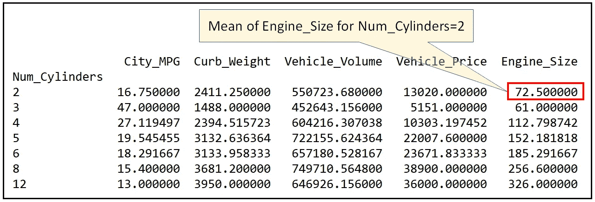*

*分组均值表(条件均值)(图片由作者提供)*

*我们还可以看到下面的曲线图，它显示了不同数值的 Num_Cylinders 中 Engine_Size 的变化:*

*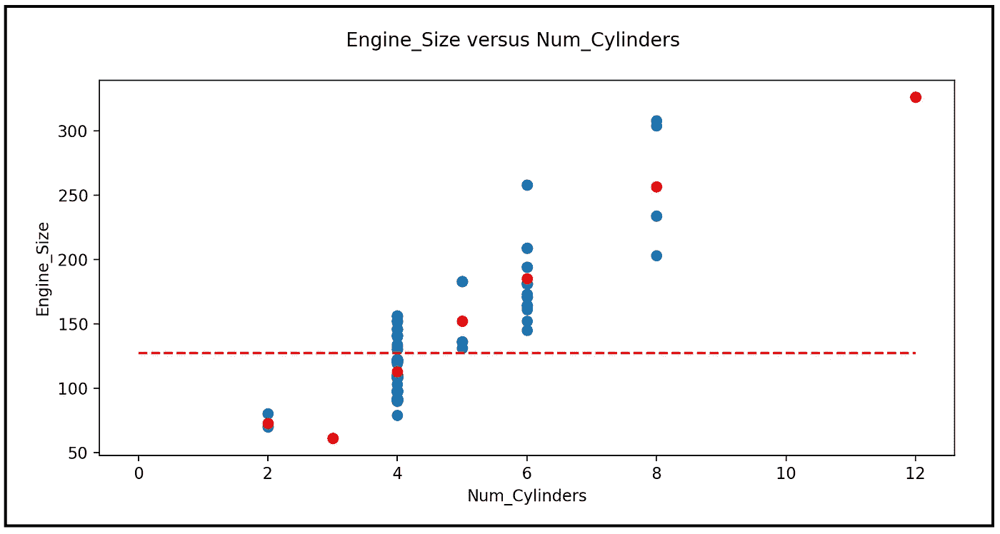*

*引擎大小与气缸数的散点图，显示引擎大小的无条件平均值和条件平均值(图片由作者提供)*

*红色水平线表示**无条件均值**值 126.91。红点表示不同 Num_Cylinders 值的平均发动机尺寸。这些是**条件的意思，也称为对于 Num_Cylinders 的不同值的发动机 _ 大小的条件期望**，它们被表示为 *E(* ***发动机 _ 大小****|****Num _ Cylinders =****x)*。*

## *引擎大小的无条件(总)方差*

*让我们重温一下 ***X*** 的总方差公式:*

**

****X*** 的样本方差公式(图片由作者提供)*

*上式中，若***X***= Engine _ Size，则由*E(****)X****)*表示的平均值为126.88。利用这个公式，我们计算出发动机尺寸的样本方差为 **1726.14** 。这是围绕 *126.91* 的无条件期望值的 Engine_Size 变化的度量。*

*在熊猫中，我们可以得到总方差的值如下:*

```
*unconditional_variance_engine_size = df[**'Engine_Size'**].var()print(**'(Unconditional) sample variance in Engine_Size='**+str(unconditional_variance_engine_size))*
```

*我们看到以下输出:*

```
*Unconditional variance in Engine_Size=**1726.1394527363163***
```

## *引擎大小的条件方差*

*以 Num_Cylinders 为条件的 Engine_Size 的方差是 Engine_Size 中剩余的方差，其中一些已经由 Num_Cylinders 上的 Engine_Size 的回归“解释”。我们可以使用等式(2)计算如下:*

*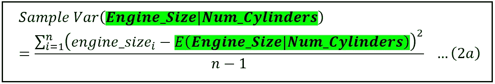*

*发动机尺寸的变化取决于气缸数(图片由作者提供)*

*现在让我们看一个稍微复杂一点的例子。*

*假设我们希望**根据整备质量、车辆体积和气缸数量**计算发动机尺寸的变化。*

*为此，我们使用以下步骤:*

1.  *构建一个回归模型，其中响应变量为发动机尺寸，回归变量为整备质量、车辆体积、气缸数量和截距。*
2.  *在数据集上训练模型。*
3.  *在数据集上运行训练的模型，以获得整备质量、车辆体积、汽缸数量的每个组合的发动机尺寸的预测(预期)值。这些是条件期望的集合:
    *E(Engine_Size | Curb _ Weight，Vehicle_Volume，Num_Cylinders)* 对应于 Engine _ Size 的观测值。*
4.  *将 Engine_Size 的观测值和步骤 2 中计算的预测值代入等式(2)以获得条件方差。*

*让我们来计算一下！*

```
****#Construct the regression expression. A regression intercept is included by default***olsr_expr = **'Engine_Size ~ Curb_Weight + Vehicle_Volume + Num_Cylinders'*****#Carve out the y and X matrices based on the regression expression***y, X = dmatrices(olsr_expr, df, return_type=**'dataframe'**)***#Build the OLS linear regression model***olsr_model = sm.OLS(endog=y, exog=X)
***#Train the model***olsr_model_results = olsr_model.fit()***#Make the predictions on the training data set. These are the conditional expectations of y***
y_pred=olsr_model_results.predict(X)
y_pred=np.array(y_pred)***#Convert y from a Pandas DataFrame into an array***
y=np.array(y[**'Engine_Size'**])***#Calculate the conditional variance in Engine_Size using equation (2)***
conditional_variance_engine_size = np.sum(np.square(y-y_pred))/(len(y)-1)print(**'Conditional variance in Engine_Size='**+str(conditional_variance_engine_size))*
```

*我们得到以下输出:*

```
*Conditional variance in Engine_Size=**167.42578329039935***
```

*正如预期的那样，这个 **167.43** 的方差大大小于 Engine_Size 的总方差( **1726.13** )。*

# *条件方差与 R 平方的关系*

***线性**回归模型的 r 平方是解释变量能够“解释”的因变量中总方差的分数。*

*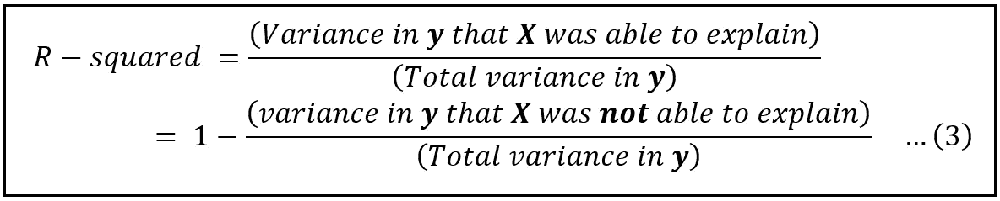*

*线性回归模型的 R 平方的定义(图片由作者提供)*

*我们现在知道，*中的方差即*X*能够解释的是条件方差*Var(****y****|****X****)*。而 ***y*** 中的总方差，简单来说就是无条件方差*Var(****y****)*。因此，R 平方可以用条件方差和无条件方差表示如下:****

**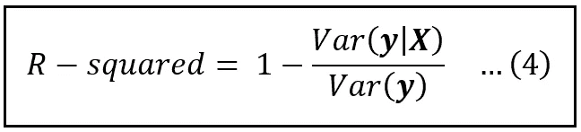**

**用 **y** 中的条件方差和无条件方差表示的 r 平方(图片由作者提供)**

**让我们为之前构建的线性回归模型计算 R 平方。回想一下，因变量 ***y*** 是发动机尺寸，而解释变量 ***X*** 是整备质量、车辆体积和汽缸数量。**

**发现 ***y*** 中的总方差为**163**。36363.666666666665**

*****y*** 中的条件方差，即 ***y*** 中以整备质量、车辆体积和气缸数为条件的方差被发现为**167.429039935**。**

**使用等式(4)，该线性模型的 R 平方为:**

***R 平方= 1–167.43/1726.14 = 0.903***

**该值与 statsmodels 报告的值完全匹配:**

**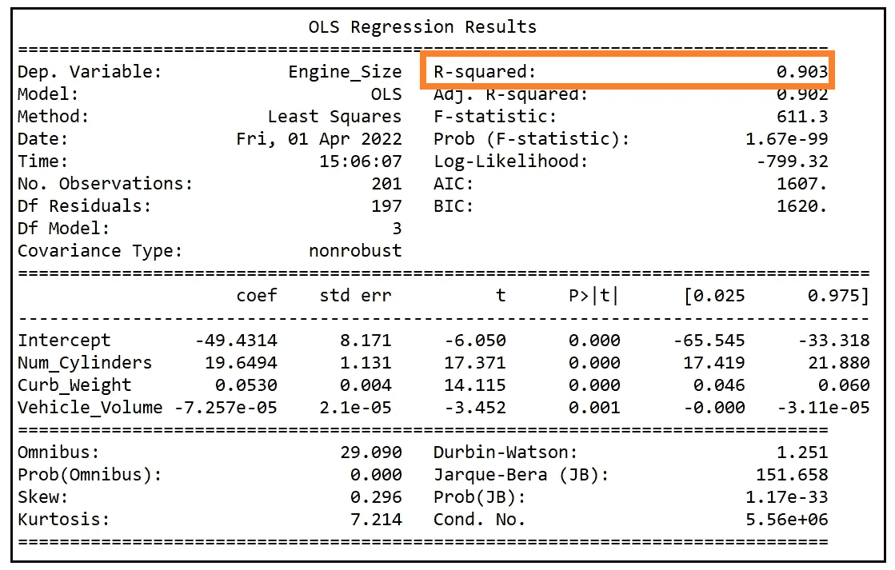**

**线性回归模型的模型训练摘要(图片由作者提供)**

# **条件协方差**

**记住，两个随机变量 ***X*** 和 ***Z*** 之间的协方差是对 ***X*** 和 ***Z*** 中的*变量*相互之间相关程度的度量。其公式如下:**

**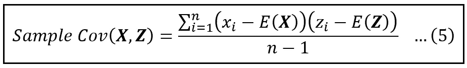**

**X 和 Z 之间的样本协方差公式(图片由作者提供)**

**在这个公式中，*E(****X****)*和*E(****Z****)*是***X****的无条件手段(又名无条件期望)。***

******的**协方差**X***和 ***Z*** ，**条件依赖于**一些随机变量*W 是围绕 ***的条件期望的*X***Z***的变化的相关程度的度量********

*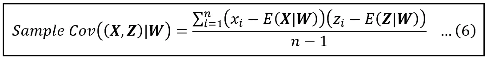*

***X** 和 **Z** 之间的样本条件协方差公式(图片由作者提供)*

**E(****X****|****W****)*和*E(****Z | W****)*是 ***X 的**条件期望**于是*(X _ I—E(****X****|****W****)*是 ***X*** 中的变异后的一部分已经用 ***W*** 解释过了。同上*(Z _ I—E(****Z****|****W****)*。索引 *i* 隐含在两个条件期望中，即对于数据集中的每一行 *i* ，我们使用*E(****)X****= X _ I |****W****= W _ I)*和****

**因此，条件协方差是在通过***【W】***的存在解释了一些各自的方差之后，*和***【Z】****的变化的相关程度的度量。****

**与计算条件方差的过程一样，我们可以通过回归**上的*X****来估计条件期望*E(****X****|****W****)*和*E(****Z | W****)*各自的回归模型对训练数据集的预测就是我们所寻求的对应的条件期望*E(****X****|****W****)*和*E(****Z | W****)*。***

## **说明**

**我们将根据车辆体积计算发动机尺寸和整备质量之间的协方差。**

**首先，我们将通过计算 Engine_Size 和 Curb_Weight 之间的无条件(总)协方差来确定方差的基线。这可以使用如下等式(5)来容易地完成:**

**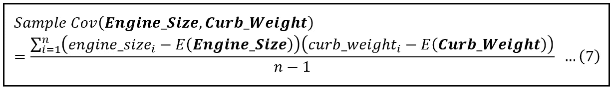**

**发动机尺寸和整备质量之间的总协方差公式(图片由作者提供)**

**使用 Pandas，我们可以如下计算协方差:**

```
**covariance = df['Curb_Weight'].**cov**(df['Engine_Size'])**
```

**我们看到以下输出:**

```
**Covariance between Curb_Weight and Engine_Size=**18248.28333333333****
```

**我们还可以查看以平均值为中心的 Engine_Size 和以平均值为中心的 Curb_Weight 的散点图，以直观感受这种协方差:**

```
*****#Plot mean-centered Curb_Weight versus Engine_Size***fig = plt.figure()fig.suptitle(**'Mean centered Curb_Weight versus Engine_Size'**)plt.xlabel(**'Mean centered Engine_Size'**)plt.ylabel(**'Mean centered Curb_Weight'**)plt.scatter(df[**'Engine_Size'**]-df[**'Engine_Size'**].**mean**(), df[**'Curb_Weight'**]-df[**'Curb_Weight'**].**mean**())plt.show()**
```

**我们看到下面的情节:**

****

**平均中心(贬低的)整备质量与贬低的车辆发动机尺寸散点图(图片由作者提供)**

**我们在该图中立即注意到的一件事是，对于发动机尺寸相似的车辆，整备质量似乎有很大差异:**

**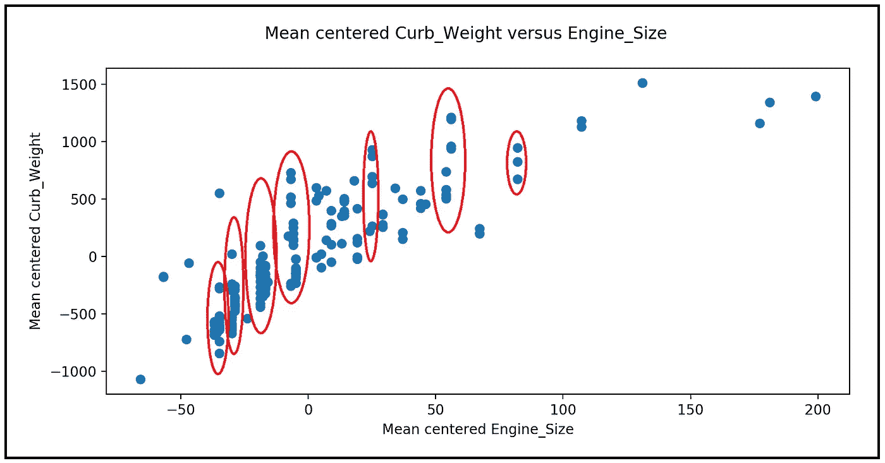**

**整备质量变化与车辆平均中心发动机尺寸的散点图，显示了具有相似发动机尺寸的车辆之间整备质量的广泛变化(图片由作者提供)**

**还有其他因素可以解释特定发动机尺寸内整备重量*的差异。***

**让我们看看汽车的体积作为这样一个因素。具体来说，让我们**根据车辆体积**计算整备质量和发动机尺寸之间的协方差，即剔除车辆体积的影响。**

**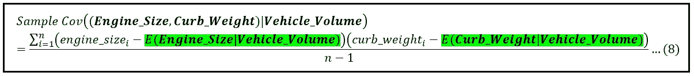**

**发动机尺寸和整备质量之间的协方差公式取决于车辆体积(图片由作者提供)**

**在上面的公式中，用绿色标记的两个条件期望可以通过回归车辆体积上的发动机尺寸和车辆体积上的整备质量来获得。和以前一样，指数 *i* 隐含在两个期望中。**

**使用 Pandas 和 statsmodels，让我们如下计算这个条件协方差。在下面这段代码中，***X***=发动机尺寸，***Z***=整备质量，***W***=车辆体积。**

```
*****#Carve out the X and W matrices****.* ***An intercept is automatically added to W.***X, W = dmatrices(**'Engine_Size ~ Vehicle_Volume'**, df, return_type=**'dataframe'**)***#Regress X on W***olsr_model_XW = sm.**OLS**(**endog**=X, **exog**=W)
olsr_model_XW_results = olsr_model_XW.**fit**()***#Get the conditional expectations E(X|W)***
X_pred=olsr_model_XW_results.**predict**(W)
X_pred=np.**array**(X_pred)X=np.**array**(df[**'Engine_Size'**])***#Carve out the Z and W matrices***Z, W = dmatrices(**'Curb_Weight ~ Vehicle_Volume'**, df, return_type=**'dataframe'**)***#Regress Z on W***olsr_model_ZW = sm.OLS(endog=Z, exog=W)
olsr_model_ZW_results = olsr_model_ZW.fit()***#Get the conditional expectations E(Z|W)*** Z_pred=olsr_model_ZW_results.predict(W)
Z_pred=np.array(Z_pred)Z=np.array(df[**'Curb_Weight'**])***#Construct the delta matrices***Z_delta=Z-Z_pred
X_delta=X-X_pred

***#Calculate the conditional covariance***conditional_variance = np.**sum**(Z_delta*X_delta)/(len(Z)-1)print(**'Conditional Covariance between Curb_Weight and Engine_Size='**+str(conditional_variance))**
```

**我们看到以下输出:**

```
**Conditional Covariance between Curb_Weight and Engine_Size=**7789.498082862661****
```

**如果我们将 **7789.5** 的这个值与之前计算的 **18248.28** 的总协方差进行比较，我们会看到发动机尺寸和扣除车辆体积影响的整备质量之间的协方差确实比没有车辆体积影响的情况小得多。**

**下面是本文中使用的完整源代码:**

# **参考文献、引文和版权**

## **数据集**

**[**汽车数据集**](https://archive.ics.uci.edu/ml/datasets/automobile) **引用:** Dua，d .和 Graff，C. (2019)。UCI 机器学习知识库[http://archive . ics . UCI . edu/ml]。加州欧文:加州大学信息与计算机科学学院。 [**下载链接**](https://gist.github.com/sachinsdate/fd97d74979c4febf6746c153ea1b7668)**

***如果你喜欢这篇文章，请关注我的*[***Sachin Date***](https://timeseriesreasoning.medium.com)*获取关于回归、时间序列分析和预测主题的提示、操作方法和编程建议。***