# 理解 CUPED

> 原文：<https://towardsdatascience.com/understanding-cuped-a822523641af>

## [因果数据科学](https://towardsdatascience.com/tagged/causal-data-science)

## *A/B 测试最先进方差缩减技术的深度指南*

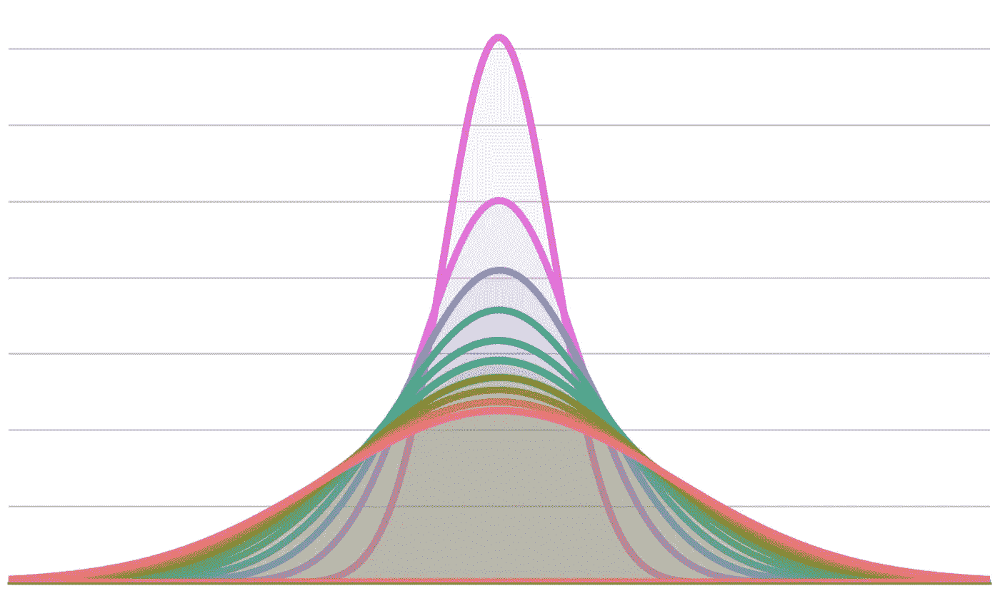

作者图片

在博士期间，我花了很多时间学习和应用因果推断方法到实验和观察数据中。然而，当我第一次听说 **CUPED** (使用实验前数据的受控实验)时，我完全不知所措，这是一种增加 A/B 测试中随机控制试验功效的技术。

真正让我惊讶的是该算法在业界的普及程度。CUPED 最早由微软研究人员[邓、徐、科哈维、沃克(2013)](https://dl.acm.org/doi/abs/10.1145/2433396.2433413) 提出，并已在公司[、](https://www.kdd.org/kdd2016/papers/files/adp0945-xieA.pdf)、[预订](https://booking.ai/995d186fff1d)、 [Meta](https://research.facebook.com/blog/2020/10/increasing-the-sensitivity-of-a-b-tests-by-utilizing-the-variance-estimates-of-experimental-units/) 、[、](https://eng.uber.com/causal-inference-at-uber/)、 [Airbnb](https://arxiv.org/abs/2112.13299) 、 [Linkedin、](https://arxiv.org/abs/2110.13406)[、](https://www.tripadvisor.com/engineering/reducing-a-b-test-measurement-variance-by-30/)、 [DoorDash](https://doordash.engineering/2020/10/07/improving-experiment-capacity-by-4x/) 当深入挖掘时，我注意到与我熟悉的一些因果推断方法有相似之处，例如[差异中的差异](https://diff.healthpolicydatascience.org/)或控制变量回归。我很好奇，决定深入挖掘。

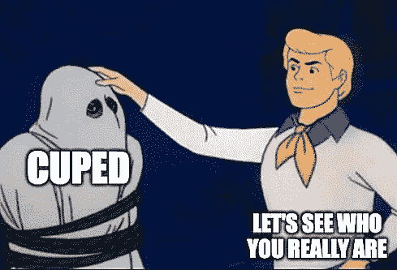

你在骗谁？作者图片

**TLDR；** CUPED 本质上是一个[剩余结果回归](https://www.google.com/url?q=https%3A%2F%2Fwww.dropbox.com%2Fs%2Fq8033tqrmsi7cge%2FResOut.pdfhttps%3A%2F%2Fwww.dropbox.com%2Fs%2Fm6jt5dsqm5xvyml%2FisoLATE_022018.pdf%3Fraw%3D1&sa=D&sntz=1&usg=AOvVaw2Rek6lp6L41rw6Osbs4sAS)。除了特殊情况外，它通常既不等同于差异中的差异，也不等同于带控制变量的回归。

# 例子

假设我们是一家正在测试广告活动的公司，我们有兴趣了解它是否会增加收入。我们将一组用户随机分为治疗组和对照组，并向治疗组展示广告活动。与标准的 A/B 测试设置不同，假设我们在测试前也观察用户。

我们现在可以使用来自`[src.dgp](https://github.com/matteocourthoud/Blog-Posts/blob/main/notebooks/src/dgp.py)`的数据生成过程`dgp_cuped()`来生成模拟数据。我还从`[src.utils](https://github.com/matteocourthoud/Blog-Posts/blob/main/notebooks/src/utils.py)`引进了一些绘图函数和库。

```
from src.utils import *
from src.dgp import dgp_cupeddf = dgp_cuped().generate_data()
df.head()
```


数据快照，图片由作者提供

我们有关于 1000 名个人的信息，这些人由`i`索引，我们观察他们分别在治疗前后、`revenue0`和`revenue1`产生的收入，以及他们是否暴露于`ad_campaign`。

## 手段的差异

在随机化实验或 A/B 测试中，**随机化**允许我们使用简单的均值差异来估计平均治疗效果。我们可以比较对照组和治疗组的平均治疗后结果 *Y₁* ( `revenue1`),随机化保证了这种差异是由于预期中的单独治疗造成的。


简单差异估计，作者图片

其中横条表示个体的平均值，下标 *d* 表示治疗状态。在我们的案例中，我们计算了治疗组广告活动后的平均收入，减去对照组广告活动后的平均收入。

```
np.mean(df.loc[df.ad_campaign==True, 'revenue1']) - np.mean(df.loc[df.ad_campaign==False, 'revenue1'])1.7914301325347406
```

估计处理效果为 1.79，非常接近于 2 的**真值**。我们可以通过对`ad_campaign`的治疗指标 *D* 回归治疗后结果`revenue1`来获得相同的估计值。


回归方程，作者图片

其中 *β* 为感兴趣系数。

```
smf.ols('revenue1 ~ ad_campaign', data=df).fit().summary().tables[1]
```

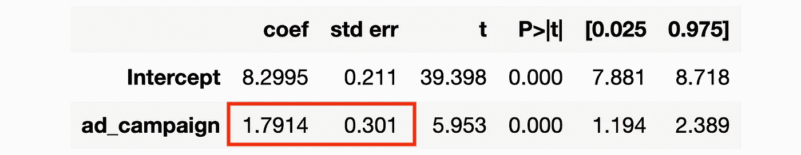

回归结果，图片由作者提供

这个估计器是**无偏的**，这意味着平均来说它给出了正确的估计。然而，它仍然可以改进:我们可以**减少它的方差**。减少估计量的方差是非常重要的，因为它允许我们

*   **检测较小的影响**
*   检测到相同的效果，但样本量**更小**

一般来说，方差较小的估计量允许我们以更高的 [**功效**](https://en.wikipedia.org/wiki/Power_of_a_test) 进行测试，即检测较小影响的能力。

我们能提高 AB 测试的能力吗？是的，使用 CUPED(以及其他方法)。

# CUPED

CUPED 的**想法**如下。假设您正在运行一个 AB 测试，并且 *Y* 是感兴趣的结果(在我们的示例中为`revenue`),二元变量 *D* 表示单个个体是否被治疗过(在我们的示例中为`ad_campaign`)。

假设你有另一个随机变量 *X* ，它**不受治疗的影响**，并且已知期望*𝔼[x】*。然后定义


转换的结果，作者的图像

其中 *θ* 是一个标量。对于*𝔼[y】*而言，该估计量是**无偏**估计量，因为在预期中最后两项会抵消。然而， *Ŷ₁ᶜᵘᵖᵉᵈ* 的方差为

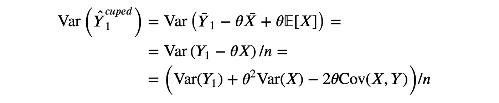

转换结果方差，按作者分类的图像

注意， *Ŷ₁ᶜᵘᵖᵉᵈ* 的方差被最小化为


最佳 theta，作者图片

哪一个是关于 *X* 的 *Y* 的线性回归的 **OLS** 估计量。将 *θ* *代入 *Ŷ₁ᶜᵘᵖᵉᵈ* 的方差公式，我们得到


转换结果方差，按作者分类的图像

其中 *ρ* 是 *Y* 和 *X* 之间的**相关性**。因此 *Y* 和 *X* 的相关度越高，CUPED 的方差减少量就越高。

然后我们可以**将平均治疗效果**估计为对照组和治疗组之间转化结果的平均差异。

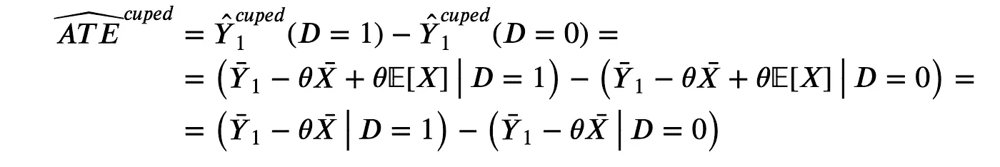

CUPED 估算师，图片由作者提供

注意*𝔼[x】*在取差时抵消。因此，计算就足够了


转换结果的等效公式，作者的图像

这不是*【𝔼[y】*的无偏估计量，但仍能提供平均治疗效果的无偏估计量。

## 最佳 X

控制变量 *X* 的**最优选择**是什么？

我们知道 *X* 应该有以下**属性**:

*   不受治疗的影响
*   尽可能与 Y₁ 相关联

论文作者建议使用**预处理结果** *Y₀* ，因为它在实践中给出了最大的方差减少。

为了**总结**，我们可以计算平均处理效果的最高估计值如下:

1.  在 *Y₀* 上回归 *Y₁* 并估计 *θ̂*
2.  计算*ŷ₁ᶜᵘᵖᵉᵈ*t26】=y̅₁θ̂y̅₀
3.  计算治疗组和对照组的 *Ŷ₁ᶜᵘᵖᵉᵈ* 的差值

等效地，我们可以在个体水平上计算 *Ŷ₁ᶜᵘᵖᵉᵈ* ，然后将其回归到治疗虚拟变量 *D* 上。

## 回到数据

让我们一步一步地计算治疗效果的最大估计值。首先我们来估算一下 *θ* 。

```
theta = smf.ols('revenue1 ~ revenue0', data=df).fit().params[1]
```

现在我们可以计算变换后的结果 *Ŷ₁ᶜᵘᵖᵉᵈ* 。

```
df['revenue1_cuped'] = df['revenue1'] - theta * (df['revenue0'] - np.mean(df['revenue0']))
```

最后，我们用转换后的结果 *Ŷ₁ᶜᵘᵖᵉᵈ* 来估计作为均值差异的治疗效果。

```
smf.ols('revenue1_cuped ~ ad_campaign', data=df).fit().summary().tables[1]
```

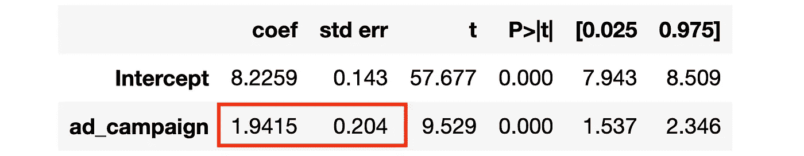

回归结果，图片由作者提供

标准误差小 33%(0.2 vs 0.3)！

## 等效公式

获得 CUPED 估计值的另一种代数上等价的方法如下

1.  在 *Y₀* 上回归 *Y₁* 并计算残差 *Ỹ₁*
2.  计算*ŷ₁ᶜᵘᵖᵉᵈ*=ỹ₁+y̅₁
3.  计算治疗组和对照组的 *Ŷ₁ᶜᵘᵖᵉᵈ* 的差值

步骤(3)与之前相同，但(1)和(2)不同。这个过程被称为**部分删除**，代数等价由[弗里希-沃-洛厄尔定理](/59f801eb3299)保证。

让我们检查一下我们是否确实得到了同样的结果。

```
df['revenue1_tilde'] = smf.ols('revenue1 ~ revenue0', data=df).fit().resid + np.mean(df['revenue1'])smf.ols('revenue1_tilde ~ ad_campaign', data=df).fit().summary().tables[1]
```


回归结果，图片由作者提供

是啊！回归表完全相同。

# CUPED 与其他

CUPED 似乎是一个非常强大的程序，但它至少提醒了其他一些方法。

1.  **自回归**或带控制变量的回归
2.  [**差异中的差异**](https://diff.healthpolicydatascience.org/)

这些方法是相同的还是有区别的？让我们检查一下。

## 自回归

当我第一次看到 CUPED 时，我想到的第一个问题是“*CUPED 仅仅是一个额外控制变量的简单差异吗？*”。或者等价地，CUPED 是否等价于通过最小二乘法估计下面的回归(其中 *γ* 是感兴趣的参数)？


估计方程，作者图片

让我们看一看。

```
smf.ols('revenue1 ~ revenue0 + ad_campaign', data=df).fit().summary().tables[1]
```

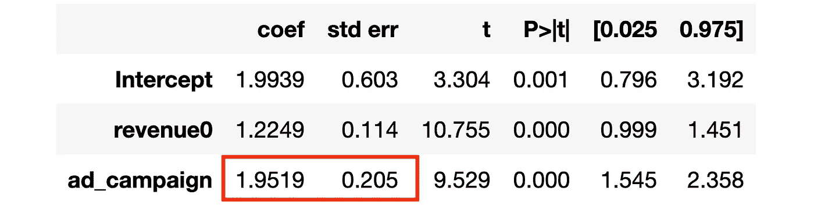

回归结果，图片由作者提供

估计的系数与我们用 CUPED 得到的非常相似，标准误差也非常接近。然而，它们**并不完全相同**。

如果你熟悉[弗里希-沃-洛厄尔定理](/59f801eb3299)，你可能会奇怪为什么两个过程**不等价**。原因是在 CUPED 的情况下，我们只分离出 *Y* ，而当我们分离出 *X* 或者同时分离出 *X* 和 *Y* 时，FWL 定理成立。

## 差异中的差异

我想到的第二个问题是“我只是在差异中寻求差异吗？”。[差异中的差异](https://diff.healthpolicydatascience.org/)(或 diff-in-diffs，或 DiD)是一种估计器，它将治疗效果计算为**双重差异**而不是单一差异:前后差异和治疗控制，而不仅仅是治疗控制。


差异中的差异估计值，作者图片

这种方法最初是由约翰·斯诺(1854 年)(不，不是那个[约翰·斯诺](https://en.wikipedia.org/wiki/John_Snow_(disambiguation)))提出来估计伦敦霍乱流行的原因。diff-in-diff 的主要优点是，当随机化不完美且治疗组和对照组不可比时，它允许估计平均治疗效果。**关键假设**是治疗组和对照组之间的差异随时间保持不变。通过取两个差值，我们就把它抵消了。

让我们看看 diff-in-diffs 是如何工作的。计算 diff-in-diffs 估计量的最常见方法是首先以**长格式**或**面板格式**对数据进行整形(一个观察是在时间段 *t* 的单个 *i* ),然后对后处理假人*𝕀(t=1*和处理假人 *D* 之间的完全交互的结果 *Y* 进行回归。


估计方程，作者图片

平均处理效果的估计量是交互作用系数的系数， *δ* 。

```
df_long = pd.wide_to_long(df, stubnames='revenue', i='i', j='t').reset_index()
df_long.head()
```

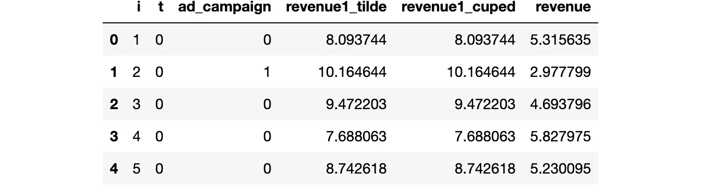

长数据集快照，按作者分类的图像

长数据集现在由个体`i`和时间`t`索引。我们现在准备运行差异中的差异回归。

```
smf.ols('revenue ~ t * ad_campaign', data=df_long).fit().summary().tables[1]
```

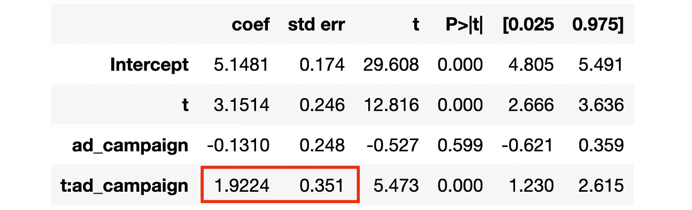

回归结果，图片由作者提供

估计的系数接近真实值 2，但是标准误差大于用所有其他方法获得的结果(0.35 >> 0.2)。我们错过了什么？我们没有**聚类标准错误**！

我不会在这里详细讨论标准错误聚类的含义，但直觉如下。默认情况下，`statsmodels`软件包会计算标准误差，假设结果在所有观测中是**独立的**。在我们随着时间的推移观察个人并试图利用这些信息的情况下，这个假设不太可能是真的。聚类考虑了结果变量在聚类内的**相关性**。在我们的例子中，在个体水平上对标准误差进行聚类是有意义的(即使不知道数据生成过程),允许结果随着时间的推移与个体 *i* 相关联。

```
smf.ols('revenue ~ t * ad_campaign', data=df_long)\
    .fit(cov_type='cluster', cov_kwds={'groups': df_long['i']})\
    .summary().tables[1]
```

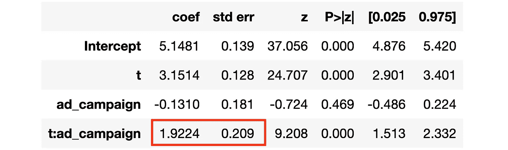

回归结果，图片由作者提供

在个体水平上对标准误差进行聚类我们获得了与先前估计值相当的标准误差(∼0.2)。

注意，当我们假设 CUPED 系数 *θ=1* 时，diff-in-diffs**等价于 CUPED** 。

```
df['revenue1_cuped2'] = df['revenue1'] - 1 * (df['revenue0'] - np.mean(df['revenue0']))
smf.ols('revenue1_cuped2 ~ ad_campaign', data=df).fit().summary().tables[1]
```

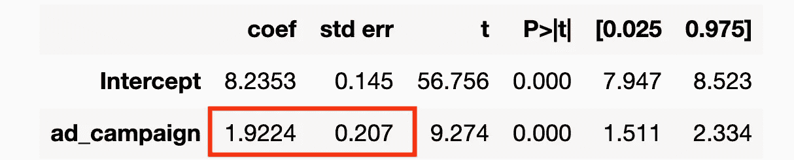

回归结果，图片由作者提供

事实上，我们获得了相同的精确系数和几乎相同的标准误差！

## 比较

哪种方法比较好？从我们到目前为止所看到的，所有的方法似乎都提供了一个准确的估计，但简单的差异有一个较大的标准偏差。

现在让我们通过**模拟**来比较一下目前为止我们看到的所有方法。我们模拟数据生成过程`dgp_cuped()` 1000 次，并保存以下方法的估计系数:

1.  简单差异
2.  自回归
3.  差异中的差异
4.  CUPED

让我们画出估计参数的分布图。

```
sns.kdeplot(data=results, x="Estimate", hue="Estimator");
plt.axvline(x=2, c='k', ls='--');
plt.title('Simulated Distributions');
```

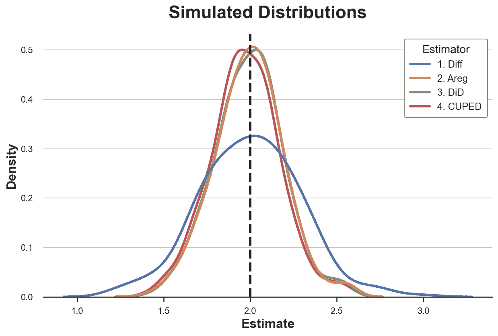

估计值的模拟分布，按作者分类的图像

我们还可以将每个估计量的模拟平均值和标准偏差制成表格。

```
results.groupby('Estimator').agg(mean=("Estimate", "mean"), std=("Estimate", "std"))
```


汇总表，按作者分类的图像

所有的估计值看起来都是无偏的(T21):平均值都接近真实值 2。此外，除了单差估计量之外，所有估计量都有非常相似的标准差！

## 总是一模一样？

估计量总是相同的吗，或者它们之间有一些差异吗？

我们可以检查许多与原始数据生成过程不同的地方。为了简单起见，这里我只考虑一种:**不完全随机化**。我考虑的对数据生成过程的其他调整是:

*   预处理缺失值
*   附加协变量/控制变量
*   多个预处理期
*   异质处理效果

以及它们的组合。然而，我发现不完全随机是最能说明问题的例子。

假设现在**随机化不是完美的**并且两个组是不相同的。特别是，如果数据生成过程


数据生成过程，按作者分类的图像

假设 *β* ≠0。还要注意，我们有**持久的个体水平异质性**，因为不可观察的 *uᵢ* 不随时间变化(不由 *t* 索引)。

```
results_beta1 = simulate(dgp=dgp_cuped(beta=1))
```

让我们画出估计参数的分布图。

```
sns.kdeplot(data=results_beta1, x="Estimate", hue="Estimator");
plt.axvline(x=2, c='k', ls='--');
plt.title('Simulated Distributions');
```

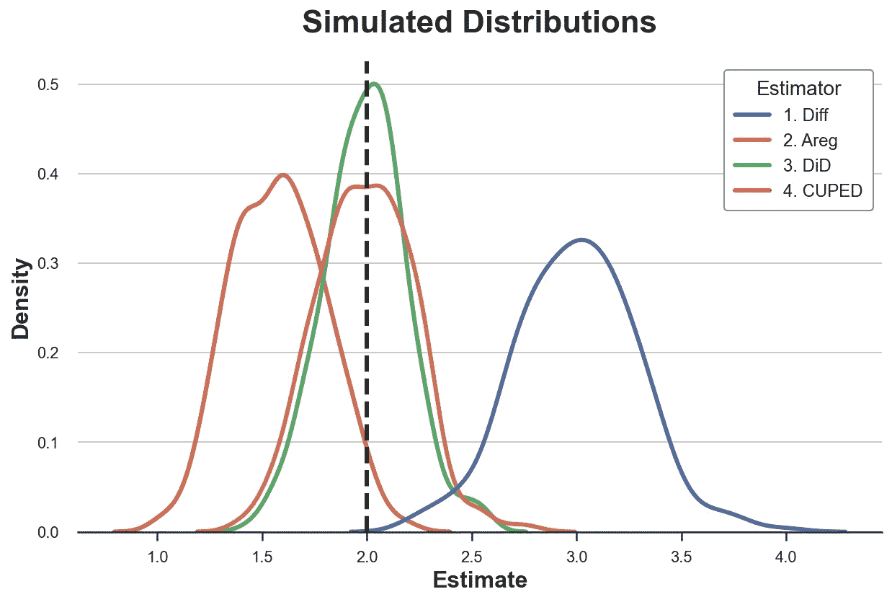

估计值的模拟分布，按作者分类的图像

```
results_beta1.groupby('Estimator').agg(mean=("Estimate", "mean"), std=("Estimate", "std"))
```


汇总表，按作者分类的图像

在处理分配不完美的情况下，对于真实的处理效果，差异中的差异和自回归都是**无偏的**，然而，差异中的差异是**更有效的**。CUPED 和 simple difference 都是**偏向**的。为什么？

Diff-in-diffs 明确控制治疗组和对照组之间的**系统差异**，这些差异**随时间**保持不变。这正是这个估算器的用途。自回归对额外的协变量 *Y₀* 执行某种匹配，有效地控制了这些系统差异，但效率较低(如果你想知道更多，我在这里写了关于控制变量[和这里](/b63dc69e3d8c)的相关帖子)。CUPED 控制了个体水平的持续异质性，但没有控制治疗分配水平。最后，简单的差异估计不控制任何事情。

# 结论

在这篇文章中，我分析了一个在业界非常流行的 AB 测试中平均处理效果的估计量:CUPED。关键思想是，通过利用预处理数据，CUPED 可以**通过控制随时间持续的个体水平变化来实现更低的方差**。我们还看到，CUPED 与自回归和差异中的差异密切相关，但并不等同。当我们进行不完全随机化时，这些方法之间的差异就很明显了。

未来研究的一个有趣途径是，当我们拥有大量预处理信息时会发生什么，无论是在时间段还是可观察到的特征方面。来自 Meta、【郭】、Coey、Konutgan、李、Schoener、Goldman (2021) 的科学家在最近的一篇论文中分析了这个问题，该论文利用机器学习技术来有效地使用这些额外的信息。这种方法与[双/去偏置机器学习](https://academic.oup.com/ectj/article/21/1/C1/5056401)文献密切相关。如果你感兴趣，我写了两篇关于这个主题的文章([第一部分](/eb767a59975b)和[第二部分](/bf990720a0b2))，以后我可能会写更多。

## 参考

[1] A .邓，y .徐，r .科哈维，t .沃克，[利用预实验数据提高在线对照实验的灵敏度](https://dl.acm.org/doi/abs/10.1145/2433396.2433413) (2013)，*。*

*[2] H. Xir，J. Aurisset，[提高在线对照实验的灵敏度:网飞的案例研究](https://dl.acm.org/doi/abs/10.1145/2939672.2939733) (2013)， *ACM SIGKDD* 。*

*[3] Y. Guo，D. Coey，M. Konutgan，W. Li，C. Schoener，M. Goldman，[在线实验中方差缩减的机器学习](https://proceedings.neurips.cc/paper/2021/hash/488b084119a1c7a4950f00706ec7ea16-Abstract.html) (2021)， *NeurIPS* 。*

*[4] V. Chernozhukov，D. Chetverikov，M. Demirer，E. Duflo，C. Hansen，W. Newey，J. Robins，[用于治疗和结构参数的双/去偏置机器学习](https://academic.oup.com/ectj/article/21/1/C1/5056401) (2018)，*计量经济学杂志*。*

*[5]我们应该在多大程度上相信差异中的差异估计值？ (2012 年)*《经济学季刊》*。*

## *相关文章*

*   *[双去偏机器学习(第一部分)](/eb767a59975b)*
*   *[双去偏机器学习(第二部分)](/bf990720a0b2)*
*   *[理解弗里希-沃-洛弗尔定理](/59f801eb3299)*
*   *[了解污染偏差](/58b63d25d2ef)*
*   *[Dag 和控制变量](/b63dc69e3d8c)*

## *密码*

*你可以在这里找到 Jupyter 的原始笔记本:*

 *[## 在 main matter courthoud/Blog-Posts/cuped . ipynb

### 我的中型博客文章的代码和笔记本。为 matteocourthoud/Blog-Posts 的发展作出贡献

github.com](https://github.com/matteocourthoud/Blog-Posts/blob/main/notebooks/cuped.ipynb)* 

## *感谢您的阅读！*

**我真的很感激！*🤗*如果你喜欢这个帖子并想看更多，可以考虑* [***关注我***](https://medium.com/@matteo.courthoud) *。我每周发布一次与因果推断和数据分析相关的主题。我尽量让我的帖子简单而精确，总是提供代码、例子和模拟。**

**还有，一个小小的* ***免责声明*** *:我写作是为了学习所以出错是家常便饭，尽管我尽了最大努力。当你发现他们的时候，请告诉我。也很欣赏新话题的建议！**