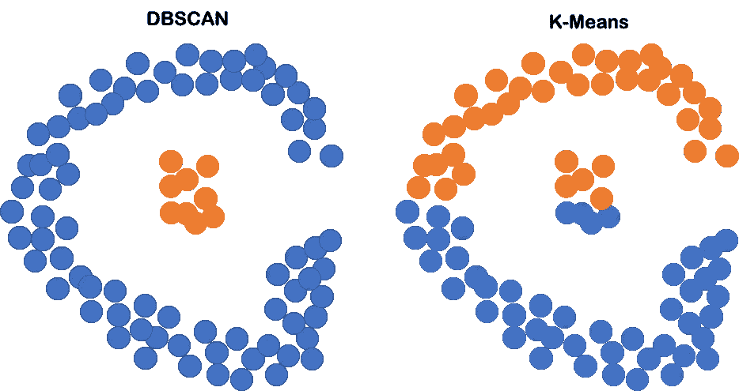
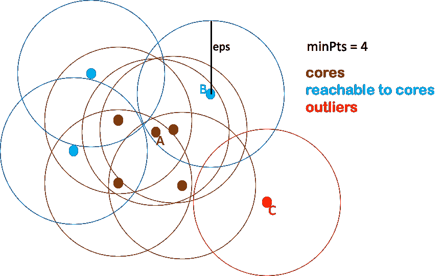

# 理解 DBSCAN 并使用 Python 实现

> 原文：<https://towardsdatascience.com/understanding-dbscan-and-implementation-with-python-5de75a786f9f>

## 无监督学习

# 理解 DBSCAN 并使用 Python 实现

## 在这篇文章中，我简要回顾了 DBSCAN 的思想及其在 Python 中的实现。


[乌曼诺德](https://unsplash.com/@umanoide?utm_source=medium&utm_medium=referral)在 [Unsplash](https://unsplash.com?utm_source=medium&utm_medium=referral) 上拍摄的照片

D **BSCAN** 代表**基于密度的带噪声应用空间聚类**，是一种*无监督*学习算法。DBSCAN 是应用最广泛的聚类方法之一，因为 DBSCAN 发现的聚类可以是任何形状，可以处理一些其他方法不能处理的特殊情况。

显示 *DBSCAN* 优于 *K-means* 聚类算法的一个最常用的例子是下图。



DBSCAN vs K-means。点是样本，X 轴是特征 1，Y 轴是特征 2。(图片由作者提供)

在上面的例子中，k-means 聚类的线性边界肯定不好用。然而，DBSCAN 不需要任何形状的聚类，而是跟踪高密度区域，这比 k-means 更适合这种情况。

在本帖中，我将谈谈如何理解这个算法，以及如何用 Python 实现它。希望文章有帮助。

## 了解 DBSCAN

从 DBSCAN 的名字可以明显看出，最重要的部分就是“*基于密度的*这个词。那么，什么是密度呢？直截了当地说，我们可以将密度理解为特定区域内数据点数量的度量。那么，如何描述一个“*指定区域*”？我们可以用一个中心点与它的距离的某个值来描述一个特定的区域。因此，DBSCAN 中的聚类是大量数据点的那些“指定区域”(密集区域)。

在上面的描述中，我们发现几个“术语”对于聚类过程非常重要。首先，“*某个距离值*”。价值是什么？我们如何衡量距离的价值？第二，“*一个中心点*”。定义那些“特定区域”的中心点是什么？第三，“*高数据点*”。如何定义「高数」？

其实 DBSCAN 中的所有参数在上面的问题中已经提到了。

首先， ***eps*** ， ***两个样本之间的最大*** 距离为一个样本被认为与另一个样本相连。并且距离可以由任何类型的距离函数来定义，例如“*欧几里德距离*”。

第二， ***岩心样品*** ，即处于高密度区域的样品。

第三， ***minPts*** ， ***最小*** 数量的样本在一个点的邻域内被认为是核心点。

这些参数共同定义了 DBSCAN 聚类中数据点的类型。这些点分为*核心点*、*可达点、*和*离群点。*好了，记住这些概念，让我们看一个具体的例子来回顾一下 DBSCAN 的思想。



DBSCAN 中的核心、核心可达点和异常值的示例。(图片由作者提供)

在上面的图中，我们将 ***minPts*** 设置为 4，这意味着如果至少有 4 个点(包括其自身)在其距离 *eps* 之内，则该点称为 ***核心点*** 。因此， *A* 是一个核心点，所有其他棕色点也是核心点，因为它们都在围绕它们的 *eps* 内至少有 4 个点。

即使蓝色点，如 *B* ，由于 *eps* 内的邻域点少于 4 个而不是核心点，但它们仍然可以从某些核心点直接到达。因此，它们属于这些核心点的同一群。

然而，点 *C* 不能从任何核心点到达，所以它被称为离群点。

从上面的例子中，我们可以看到 DBSCAN 中的集群由核心点和可从核心点到达的非核心点组成。并且每个集群包含至少一个核心点。即使非核心点也可以是聚类的一部分，但它只能位于聚类的边界，因为它们本身不能到达更多的点。

## DBSCAN 算法

好了，理解了 DBSCAN 的思想之后，让我们用下面的步骤来总结一下 DBSCAN 算法，

> 1.对于每个数据点，在 **eps** 距离内的邻域内寻找点，并将**核心点**定义为至少有 **minPts** 个邻居的点。
> 
> 2.将连接的核心点组定义为集群。
> 
> 3.如果每个非核心点可以从相邻的核心点直接到达，则将它分配到附近的簇，否则将其定义为离群点。

大的 *eps* 倾向于在一个聚类中包括更多的点，因此过大的 *eps* 将包括同一单个聚类中的所有内容，而过小的 *eps* 将导致根本没有聚类。

太小的 *minPts* 是没有意义的，因为它会把每一个点都当成一个核心点。相对较大的 *minPts* 可以更好的处理噪声较多的数据。

## DBSCAN 的优势

在了解了 DBSCAN 的思想和算法之后，它的优势就非常明显了。

> 首先，DBSCAN 不要求用户指定集群的**数量**。
> 
> 第二，DBSCAN 对异常值不敏感。
> 
> 第三，DBSCAN 形成的簇可以是任何形状，这使得它对不同类型的数据都是健壮的。

但是没有一个无监督的算法是完美的。DBSCAN 确实有其局限性。例如，如果数据在集群之间的密度变化非常大，那么使用 DBSCAN 将是一个很大的问题，因为在一个数据集上只能使用一对参数， *eps* 和 *MinPts* 。此外，如果没有数据的领域知识，定义*每股收益*可能会非常困难。

## Python 中的实现

DBSCAN 在 *Python* 中的实现可以通过 *scikit-learn* 包来实现。对数据 X 进行聚类的代码如下，

```
**from** **sklearn.cluster** **import** DBSCAN
**import** **numpy** **as** **np** DBSCAN_cluster = DBSCAN(eps=10, min_samples=5).fit(X) 
```

其中 *min_samples* 是参数 *MinPts* 和 *eps* 是距离参数。

如果你想检查数据的聚类结果，你可以使用下面的命令，

```
DBSCAN_cluster.labels_
```

就是这样！希望文章有帮助！

如果你喜欢阅读我的文章，你可以通过链接订阅我的媒体，[https://jianan-lin.medium.com/subscribe](https://jianan-lin.medium.com/subscribe)。

谢谢大家！

## 参考

[](https://en.wikipedia.org/wiki/DBSCAN) [## DBSCAN -维基百科

### 基于密度的含噪声应用空间聚类(DBSCAN)是由 Martin…

en.wikipedia.org](https://en.wikipedia.org/wiki/DBSCAN) [](https://scikit-learn.org/stable/modules/generated/sklearn.cluster.DBSCAN.html) [## sklearn.cluster.DBSCAN

### 从向量数组或距离矩阵执行 DBSCAN 聚类。基于 DBSCAN 密度的空间聚类…

scikit-learn.org](https://scikit-learn.org/stable/modules/generated/sklearn.cluster.DBSCAN.html) [](https://scikit-learn.org/stable/modules/clustering.html#dbscan) [## 2.3.使聚集

### 可以使用 modulesklearn.cluster 对未标记的数据进行聚类。每种聚类算法都有两种…

scikit-learn.org](https://scikit-learn.org/stable/modules/clustering.html#dbscan)