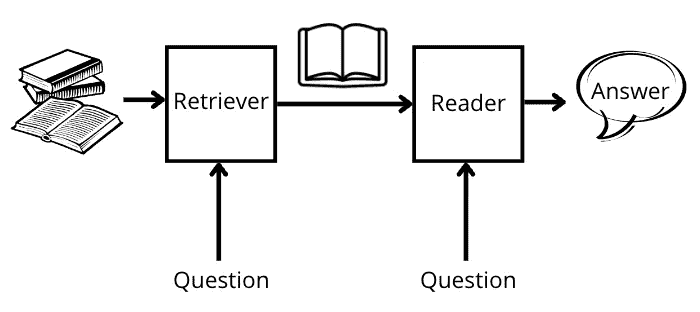
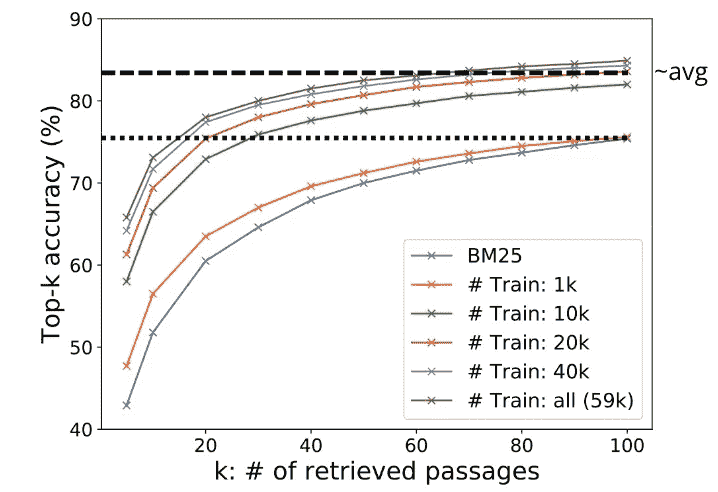
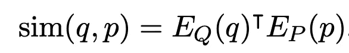
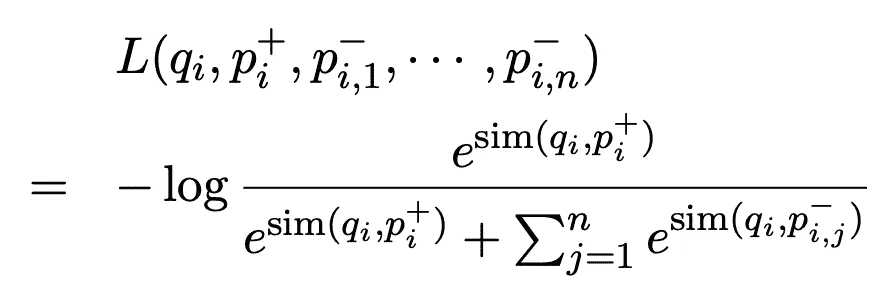

# 理解密集段落检索(DPR)系统

> 原文：<https://towardsdatascience.com/understanding-dense-passage-retrieval-dpr-system-bce5aee4fd40>

## 研究论文演练


图片来自[来源](https://unsplash.com/photos/AoqgGAqrLpU)

在这篇博客中，我们将深入研究论文《开放领域问答的密集段落检索 T2》。我们将尝试理解它的理论方面，并做一些实践，建立我们自己的基于 BERT 的 DPR 模型。

**开放领域问答系统非常依赖高效的段落检索方法。这一步有助于选择回答任何问题的相关候选上下文。开放领域问答系统通常遵循两步流水线:**

1.  **上下文检索器:** *上下文检索器*负责获取与问题相关并可能包含答案的一小部分段落。
2.  **机器阅读器:** *机器阅读器*负责从这些段落集中识别正确答案。

*在这篇博客中，我们主要讨论管道的上下文检索部分的改进。*



开放域问答管道|作者图片

传统系统将 TF-IDF 和 BM25 的一些逻辑建模到它们的检索器中，*这通常工作得很好，但问题是“我们能做得更好吗”？*我就不赘述 **TF-IDF** 和 **BM25** 如何工作的细节了，可以随意查看一下[这个](https://en.wikipedia.org/wiki/Tf%E2%80%93idf)和[这个](https://en.wikipedia.org/wiki/Okapi_BM25)的情况。简而言之，它们在两个文本片段的加权单词袋表示法之间执行某种稀疏向量相似性。这种系统的一个明显的局限性是不能检索单词不匹配的上下文。最近，随着围绕自然语言处理中与词袋表示相反的**语义**建模的大肆宣传和影响，来自脸书·艾、华盛顿大学和普林斯顿大学的这项工作表明，基于密集向量表示可以有效地实现检索，并且还被视为大大超过传统技术。

作者提出了一种方法，通过简单的**双编码器框架**，利用少量的问题和黄金段落对来学习这些密集表示，也称为嵌入。让我们直接看一个论文中提到的例子来理解我们到底在试图解决什么——*考虑一下“谁是指环王中的坏人？”这个问题，这可以从上下文“萨拉·贝克因在《指环王》三部曲中塑造反派索隆而闻名。”*基于术语的系统将难以检索这样的上下文，而密集检索系统将能够更好地将短语“坏人”与单词“恶棍”相匹配，从而获取正确的上下文。随着我们在博客中的进展，我们将会谈到这个方法的细节，但是让我们先看看一些结果。

下图显示了 **top-k 准确性**的趋势，我们对在不同大小的真实数据集上训练的模型的 k 值进行了缩放。因此，这里的 top-k 准确性意味着，对于给定的查询(q ),有多少得分最高的段落是正确的，并且可以提供正确的答案。



与 BM25 相比的 DPR Top-k 精度性能|图片来自[来源](https://arxiv.org/abs/2004.04906)

可以清楚地看到，与 BM25 技术相比，仅用 10k 个问题和段落黄金对的训练样本，所提出的方法就可以在 top-k 准确度数字上获得几乎 7-9%的提高。这里,“k”的值可以从非常小的 5 到非常大的 100。令人惊讶的是，如果你对一个给定的问题只有 10-20 段感兴趣，那么即使只有 1k 黄金样本的训练也比 BM25 技术在 top-k 准确率上提高了近 2-4%。

# 密集通道检索器(DPR)

密集段落检索器(DPR)负责基于段落和问题的高质量低维连续表示之间的相似性来检索与所问问题相关的段落。此外，由于整个系统必须合理地快速服务于用户的请求，所以包含这些表示的索引被预先计算和维护。现在，在推理期间，对于出现的任何新的查询/问题，我们可以有效地检索一些前 k 个段落，然后只在这个较小的子集上运行我们的阅读器组件。论文中的作者使用了[脸书人工智能相似性搜索(FAISS)](https://engineering.fb.com/2017/03/29/data-infrastructure/faiss-a-library-for-efficient-similarity-search/) ，这是一个允许我们快速*(近似最近邻居)*搜索彼此相似的多媒体文档的库。这里,“k”的大小取决于几个因素，如流水线中的预期延迟、可用计算、召回等。但是一般来说，10-50 之间的任何 k 值都可以达到这个目的。

问题和段落嵌入之间的相似性通过计算它们之间的点积来表示。作者也试验了其他类似的方法，但最终选择了点积，因为它简单。相似性得分*(或距离越小)*越高，文章就越与问题相关。*数学表示如下—*



这里 q，p，Eq，Ep 分别是问题文本，段落文本，输出问题表征的 [BERT](https://arxiv.org/abs/1810.04805) 模型，输出段落表征的 BERT 模型。作者使用*CLS 标记的 *768 维*表示作为输入文本片段的最终表示。*

为了训练模型，数据集被表示为 *D={ < q1，p1，p2，p3..pn >，< q2，p2，p1，p3..pn > …}，*这里的气是第 I 个问题，每个问题都配有一个正例和一些反例。为了简单起见，上面每个例子的第一个索引是对问题“气”的肯定回答，其余的是否定回答。并且他们将损失函数优化为正通过的负对数似然。*下图显示了相同-* 的数学表示



这里，qi，pi(+)，pi(-)分别是第 I 个问题，第 I 个相关的段落(正样本)，第 I 个不相关的段落(负样本)。*优化的目标是最大化 qi 和 pi(+)之间的相似性，并降低不相关的 qi 和 pi(-)之间的相似性*。

通常在检索场景中，获得正面例子是简单的(你可以通过给出问题和相关段落的训练数据获得)，而人们可能必须考虑有效地选择负面例子。作者在论文中实验了三种否定生成方法:(1) **Random** :从语料库中随机抽取任意段落；(2) **BM25** :由 BM25 返回的顶部段落，其可能不一定包含答案，但是匹配大多数问题标记(3) **黄金**:与训练集中出现的其他问题配对的正面段落*(具体地说是出现在相同小批量中的那些)*。发现第 3 点和第 2 点的组合效果最好。

至此，我们总结了对所提出模型的理论理解。现在我们开始建造我们自己的东西—

# 代码模板

我们将使用 [Simple Transformers python 库](/Simple Transformers is a Natural Language Processing (NLP) library designed to simplify the usage of Transformer models without having to compromise on utility. It is built on the amazing work of Hugging Face and their Transformers library.)来设置实现 DPR 模型的模板。简单变压器旨在简化变压器模型的使用，而不必牺牲效用。它建立在令人惊叹的拥抱脸及其[变形金刚](https://github.com/huggingface/transformers)库的基础上。它支持 NLP 中的各种任务，可以在这里随意查看整个列表。好的，那么*你可以使用下面的命令来安装它-*

```
>> pip install simpletransformers
```

接下来我们要做的是定义我们将用来训练模型的所有配置。该库为您提供了使用数据类或 python 字典定义配置的选项。为了这篇博客，我们将使用 dataclass: RetrievalArgs。也可以从这个[源](https://simpletransformers.ai/docs/usage/#task-specific-models)中随意检查字典选项。

```
from simpletransformers.retrieval import RetrievalModel, RetrievalArgs
import torch### loading pre-trained weights of passage and question encoder ###
Eq = "bert-base-uncased"
Ep = "bert-base-uncased"model_args = RetrievalArgs()
#model_args.retrieve_n_docs
#model_args.hard_negatives
#model_args.max_seq_length
#model_args.num_train_epochs
#model_args.train_batch_size
#model_args.learning_rate
```

这里，Eq 和 Ep 持有将用于编码问题和段落的模型。您还可以从一些公开的预先训练好的 DPR 编码器开始，用于上下文和段落*(一个例子是上下文:“Facebook/DPR-question _ encoder-single-NQ-base”，段落:“Facebook/DPR-CTX _ encoder-single-NQ-base”)。*当“hard_negatives”设置为 True 时，有助于模型在批内否定的基础上学习使用 BM25 等技术生成的否定示例。如上所述，该论文还提出了批内底片的概念，并且还基于 BM25 或类似的方法提取底片样本。上面提到的所有参数都是不言自明的。该库提供了用于生成这些硬底片的代码片段。请在这里随意检查[。](https://simpletransformers.ai/docs/retrieval-specifics/)

接下来，我们加载数据集，为了简单起见，我将手动定义一些数据点([源](https://simpletransformers.ai/docs/retrieval-data-formats/))。但是这将使您了解如何转换您的实际数据以适应管道。

```
import pandas as pdtrain_data = [
    {
        "query_text": "Who is the protaganist of Dune?",
        "gold_passage": 'Dune is set in the distant future amidst a feudal interstellar society in which various noble houses control planetary fiefs. It tells the story of young Paul Atreides, whose family accepts the stewardship of the planet Arrakis. While the planet is an inhospitable and sparsely populated desert wasteland, it is the only source of melange, or "spice", a drug that extends life and enhances mental abilities. Melange is also necessary for space navigation, which requires a kind of multidimensional awareness and foresight that only the drug provides. As melange can only be produced on Arrakis, control of the planet is a coveted and dangerous undertaking.',
    },
    {
        "query_text": "Who is the author of Dune?",
        "gold_passage": "Dune is a 1965 science fiction novel by American author Frank Herbert, originally published as two separate serials in Analog magazine.",
    }
    ...
]train = pd.DataFrame(
    train_data
)
```

有了这个，你就可以继续训练 DPR 模型了，但是如果你已经将 hard_negatives 设置为 True，你就必须为每个数据点设置另一个 key (hard_negative ),格式如上所述。

```
cuda_available = torch.cuda.is_available()model = RetrievalModel(
    model_type = "dpr",
    context_encoder_name = Ep,
    query_encoder_name = Eq,
    args = model_args,
    use_cuda = cuda_available
)model.train_model(train, eval_data = eval, \
                output_dir = 'model/', \
                show_running_loss = True)model.eval_model(test, verbose=True)
```

接下来，我们将所有必要的参数传递给我们的模型，并通过指定保存模型的输出目录来进行训练。“eval”和“test”数据帧的格式也与“train”完全相同。这里，train、eval 和 test 是 pandas 数据帧，包含 2-3 列— `query_text`、`gold_passage`、`hard_negative`(可选)

*   `query_text`:查询/问题文本序列
*   `gold_passage`:黄金段落文字序列
*   `hard_negative`:BM25 中的硬否定段落文本序列(可选)

# 用训练好的 DPR 模型进行推理

一旦训练完成，你已经保存了你的模型。现在，您可以将问题传递给模型，指定要返回的文档数量，这样就可以了。

```
questions = [
    'What year did Dune release?'
]predicted_passages, _, _, _ = model.predict(questions, retrieve_n_docs=2)
```

# 总结想法

看到新兴技术的采用以及它在这种实际用例中的应用是非常有趣的。在本文中，我们讨论了什么是 DPR，它是如何工作的，以及它的用途。我们也使用简单的 Transformers python 库实现了它。请随意查看其他规范，您可以使用它们来训练一个高效的模型。我希望你喜欢这篇文章。此外，如果你喜欢看视频而不是阅读文本，你可以在[这个](https://youtu.be/YOunnfYEZfA)查看视频论文解释。尽管你在那里找不到这里独有的实现；)

另外，如果你愿意支持我成为一名作家，可以考虑注册[成为一名媒体成员](https://prakhar-mishra.medium.com/membership)。每月只需 5 美元，你就可以无限制地使用 Medium。