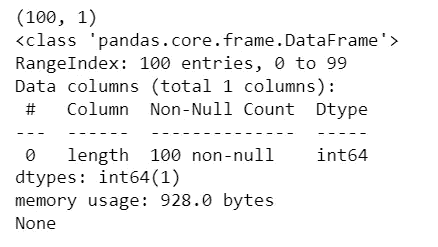
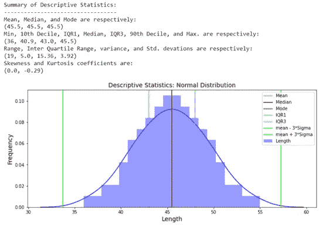
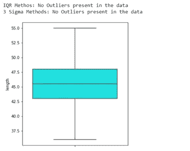
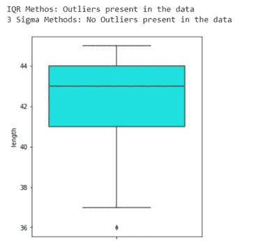
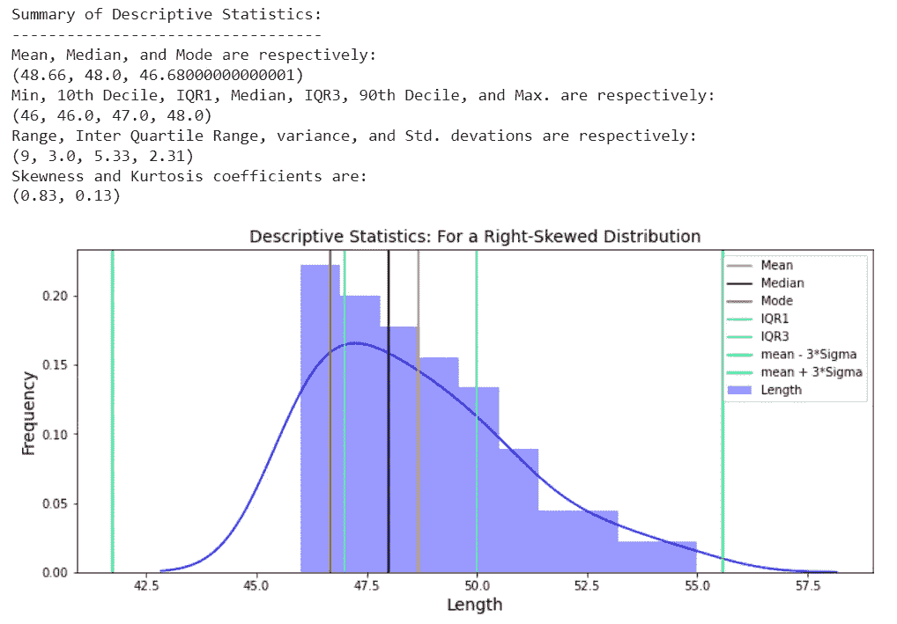
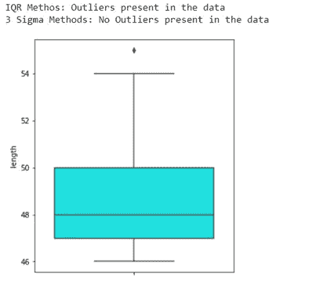

# 理解描述性统计:借助高斯、左偏和右偏数据集

> 原文：<https://towardsdatascience.com/understanding-descriptive-statistics-with-the-help-of-gaussian-left-skewed-and-right-skewed-897b296382c6>

## 从统计学角度重新设计你的数据，使其失真


克里斯·利维拉尼在 [Unsplash](https://unsplash.com/?utm_source=unsplash&utm_medium=referral&utm_content=creditCopyText) 上的照片

正态分布及其特征已被广泛讨论。我们还必须很好地理解它的描述性统计。然而，您是否曾试图左偏或右偏一个完全正态分布的数据集，以测试其正态性或观察对其众多描述性统计数据的影响。如果没有，请继续，因为这是我们在这篇文章中要做的。

# **背景:**

在我们进入 Python Notebook 并开始编辑数据之前，让我简单介绍一下正态(或高斯)分布和描述性统计。

数据集中的大部分值具有位于范围中间的正态分布聚类，其余值对称地向任一极端逐渐变小。由于大多数自然发生的事件是正态或大致正态分布，正态分布是至关重要的。这些变量的例子包括身高、出生体重、鞋码、血压、退休年龄、得分、收入分配和经济中的商品价格。

**正态分布数据集的属性:**

1.绘制时，正态分布数据集呈对称钟形，平均值位于中间。

2.平均值、中值和众数都相等。

3.它只有一个峰值，因为它是单峰的。

4.一半的值低于平均值，一半高于平均值，表明分布关于平均值是对称的。

5.它遵循**经验法则**:经验法则，也称为*三西格马法则*或*68–95–99.7*法则，是一种统计法则，它规定对于正态分布，

*   大约 68%的值落在平均值的一个标准偏差内。
*   大约 95%的值落在平均值的两个标准偏差范围内。
*   几乎所有的值(约 99.7%)都在平均值的三个标准差范围内。

6.偏斜系数为零。

**描述性统计**:

描述性统计是定量描述或列出特定数据集特征的汇总。通过观察描述性统计，我们可以对数据分布有一个很好的概念。

**不同类型的描述性统计包括:**

*   集中趋势的度量—平均值、中间值和众数
*   离差的度量-范围、IQR、方差和标准差
*   位置统计-最小值、最大值、十分位数和百分位数
*   对称性的度量——偏度和峰度

# **完全正态分布的描述性统计**

让我们从正态分布的数据集开始，然后将分布向左和向右倾斜，以检查统计数据是如何变化的。我将从一个来自生物统计学领域的正态分布数据的极好例子开始。这个数据是关于“家蝇翅膀长度”的，取自 Seattlecentral.edu[(*Sokal，R.R .和 P.E.Hunter. 1955* )。](https://seattlecentral.edu/qelp/sets/057/057.html)

数据中总共有 100 条记录，只有一列——“长度”。

```
df = pd.read_excel("s057.xls")
print(df.shape)
print(df.info())
```



图一。数据集摘要。作者形象。

为了计算不同的描述性统计数据，我们可以在 Python 中定义以下函数:

现在，让我们检查数据集的正态分布的各种特征。

**测试 1:常态测试**

我们将使用 [**夏皮罗-维尔克检验**](https://docs.scipy.org/doc/scipy/reference/generated/scipy.stats.shapiro.html) 来检验数据集的正态性。这检验了数据来自正态分布的无效假设。即

*   *H0:数据呈正态分布*
*   *H1:数据不符合正态分布*

在 SciPy 实现中，p 值可以解释如下:

*   *p < = alpha:剔除 H0，非正态分布。*
*   *p>α:拒绝 H0 失败，即正态分布*

具有较高 p 值的结果通常支持我们的样本取自高斯分布的假设。

我们可以从下面的输出中观察到我们的数据集是正态分布的。

> 检验统计= 0.993，p 值为 0.876
> 数据呈正态分布(p 值为> 0.05，拒绝 H0)

**测试 2:正态分布的描述性统计:**

一.均值=中位数=众数

二。如果分布是单峰的

三。如果它具有以平均值为中心的钟形对称曲线

四。偏斜系数= 0

要测试正态分布的上述四个特征，请使用下面的代码块。它将使用前面为描述性统计定义的函数。

这是输出结果:



图二。正态分布的直方图描述性统计。作者形象。

查看上面的输出，我们可以发现:

*   平均值、中值和众数都相等(45.5)
*   分布是单峰的。
*   我们有一个以平均值为中心的对称钟形分布。
*   偏斜系数为零。

**测试 3:检查是否遵循经验法则:68–95–99.7 法则，标准差为 1–2–3**

正态分布的数据集遵循**经验法则**，即 68%、95%和 99.7%的值分别位于平均值的一个、两个和三个标准差内。为了测试这个属性，我们可以使用下面的代码块。

这是输出结果:

> 具有+/- 1 sigma 的平均值覆盖的面积为:68.27
> 具有+/- 2 sigma 的平均值覆盖的面积为:95.45
> 具有+/- 3 sigma 的平均值覆盖的面积为:99.73

**测试 4:异常值检查**

正态分布中可能存在也可能不存在异常值。如果没有明显的例外，一切都很好。我们将首先在正态分布的数据集上运行这个测试。然后，我们将在左偏或右偏的数据集上再次运行这个测试，以确定数据操作是否导致了任何异常值。

我们可以看到如下输出:*IQR 和 3-sigma 技术都不能发现任何异常值。*



图 3:异常测试的结果。作者形象。

到目前为止，我们已经检查并确认了完全正态分布的参数。现在，我们将左右倾斜分布，看看它如何影响正态性检验、描述性统计/可视化和异常值的存在。

# 更改数据分布，使其成为左偏(或负偏)数据集

我们知道，左偏斜或负偏斜数据集是指分布的尾部在左侧比在右侧长，并且中位数更接近第三个四分位数而不是第一个四分位数。对于这样的分布，我们也应该有众数>中位数>均值。

我们将从数据集的最高百分位中裁剪或丢弃一些值，使其向左倾斜。这将理想地留下更多来自较低分位数的数据，使分布稍微负向(或向左)倾斜。

当你打印偏斜度的系数时，你会注意到它是非零的负值(本例中为-0.83)。

> 46.4
> 产生的数据帧形状为:(50，1)
> 新的倾斜值为:-0.83

我们已经在开始时创建了几个函数来测试或计算各种参数。现在，我们将在新的数据集上逐个调用它们(这应该是一个左偏分布)，并查看它们如何影响不同的结果。

**测试 1:正态性测试**

在新的数据帧 **df_left_skew** 上运行相同的夏皮罗-维尔克测试产生这个结果。

> 检验统计= 0.911，p 值为 0.001
> 数据不呈正态分布(p 值为< 0.05，拒绝 H0)

因此，我们现在有证据表明我们的数据集不再遵循正态分布。让我们看看它的描述性统计和分布图来验证这一点。

**测试 2:变更数据的描述性统计:**

调用先前定义的描述性统计函数并绘制直方图会产生以下结果:


图 4。左偏(或负偏)数据集的描述性统计和直方图。作者形象。

因此，对于左偏斜数据集，我们可以看到:

*   均值、中值和众数不再重叠。
*   事实上，我们可以注意到**模式>中值>意味着**——证明一个左偏或负偏的数据。
*   一个长的左尾巴，它导致平均值在峰值的左边，中间值更接近第三个四分位数。

**测试 3:异常值检查**

在负偏差数据中，我们将对异常值进行最后一次检查。一个倾斜的数据集应该理想地包含一些异常值。对这个左偏斜数据集运行异常值测试会产生以下结果:



图 5:左偏数据集中的异常值。作者形象。

我们看到 IQR 方法发现了一个异常值，而 3-sigma 方法没有发现。此外，这种情况下的异常值低于 Q1 的最小值-1.5 * IQR-表示数据集呈负偏态。请记住， *IQR 方法只考虑+/-2.7 *适马*用于异常值发现(因此不太保守)，而 *3 适马(或 Z 得分)方法检查+/-3 *适马*用于异常值检测。参考这个 [**博客**](/why-1-5-in-iqr-method-of-outlier-detection-5d07fdc82097) 了解更多关于离群点检测的细节。

# 更改数据分布，使其成为右偏(或正偏)数据集

在最后一节中，我们将从原始数据集的底部百分位中截取或删除一些值，使其成为右偏分布。理想情况下，这将会留下更多来自上分位数的数据，从而使分布稍微偏正(或偏右)。我们可以使用以下代码块来实现这一点:

这一次，当你打印偏斜度的系数时，你会注意到它是非零的正值(本例中为 0.83)。

> 44.6
> 产生的数据帧形状为:(50，1)
> 新的倾斜值为:0.83

让我们快速运行正态性测试，查看描述性统计数据，并检查异常值。

**测试 1:正态性测试**

在新的数据帧 **df_right_skew** 上运行相同的*夏皮罗-维尔克测试*产生这个结果。

> 检验统计= 0.911，p 值为 0.001
> 数据不呈正态分布(p 值为< 0.05，拒绝 H0)

因此，我们现在有证据表明我们的数据集不再遵循正态分布。让我们看看它的描述性统计和分布图来验证这一点。

**测试 2:右偏数据的描述性统计:**

我们只需要将新的数据帧传递给先前定义的函数。数据帧 **df_right_skew** 的描述性统计数据和直方图如下:



图 6。右偏(或正偏)数据集的描述性统计和直方图。作者形象。

因此，对于右偏数据集，我们可以看到:

*   均值、中值和众数不再相互重叠。
*   事实上，我们可以注意到**模式<中值<的意思是**——证明一个正确的或正偏的数据。
*   一条长长的右尾巴，因此的意思是也到了**右边**的顶峰。

**测试 3:异常值检查**

我们可以使用相同的代码块并传递新的数据帧 **df_right_skew** 来检查我们现在是否有任何异常值。对这个右偏数据集运行异常值测试会产生以下结果:



图 7:右偏数据集中的异常值。作者形象。

我们看到，IQR 方法发现了一个异常值，因为它不如上面解释的 3-sigma 方法保守。另请注意，这种情况下的异常值超出了 Q3 +1.5*IQR 的最大值，表明数据集呈正偏态。

# 结论:

在这篇文章中，我们从一个完全正态分布的数据集开始，并测试了它与正态分布相关的许多属性。然后我们改变数据来创建一个左偏数据集和一个右偏数据集。我们还研究了当数据向左或向右倾斜时，描述性统计数据是如何变化的。这应该有助于您理解倾斜数据集的统计数据或直方图是如何显示的。

*在这里找到数据集和代码:*[https://github.com/kg-shambhu/Descriptive_Statistics](https://github.com/kg-shambhu/Descriptive_Statistics)

*你可以在领英上联系我:*[https://www.linkedin.com/in/shambhukgupta](https://www.linkedin.com/in/shambhukgupta/)/