# 经验分布:你需要知道的一切

> 原文：<https://towardsdatascience.com/understanding-empirical-distributions-ed131de5f3df>

## 数据的近似分布，狄拉克δ函数等等

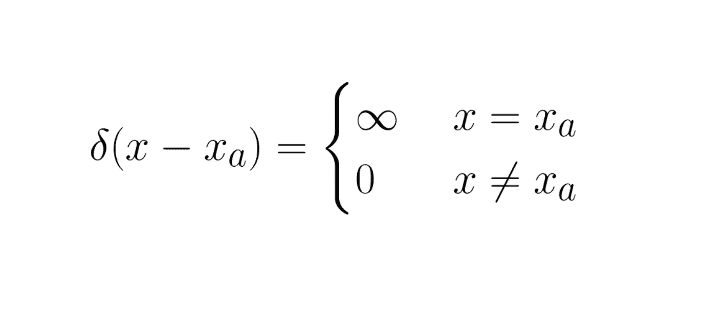

图片来源:作者

你可能在许多统计学教科书中观察到这个词，但我是在[凯文·帕特里克·墨菲](https://probml.github.io/pml-book/book1.html)写的《概率机器学习:简介一书中发现的。

这本书对一些在大多数在线博客和视频中被称为“常识”的话题进行了数学处理。由于我的兴趣在于 ML 背后的数学(和统计学)，我开始阅读这本书，并很快发现了经验分布，

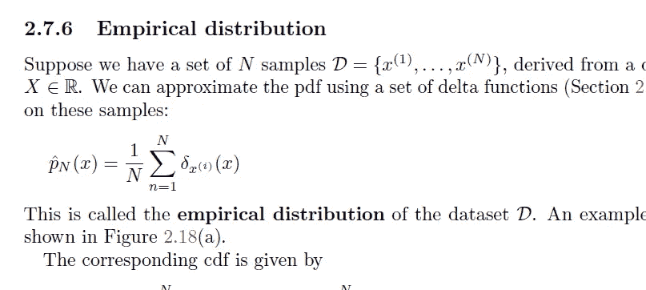

图片来源:这本书草稿的快照(这本书的草稿可以在[https://probml.github.io/pml-book/book1.html](https://probml.github.io/pml-book/book1.html)公开获得)

乍一看，对于像我这样的统计学初学者来说，我发现这个定义完全不直观。我知道*δ函数*(狄拉克δ函数)，但是从量子物理学的角度来看，用它来描述离散随机变量的 PDF 似乎是不可能的。pdf 被描述为连续的随机变量，但统计学家也发明了离散的 pdf。

> 这个故事将提供经验分布的数学背景，并不包含太多现实世界的例子。

如果你的情况和我一样，并且你希望探索更多的经验分布，去完成这个故事吧！

# 1.让我们从字典开始

我养成了每当遇到新概念就在字典里找单词的习惯。对于经验分布,“经验”一词意味着，

> **实证的定义**
> 
> 源于或基于观察或经验的

从统计学的角度来看，韦氏词典的第一个定义非常有用。在统计学和计算机科学的世界里，我们经常把观察或经验称为“数据”。单词*经验性的*指的是与观察或数据有关的东西，而不是理论上的构建。

在统计学的实际应用中，我们通常不会拥有无限量的数据，我们所拥有的只是数据的极小一部分，俗称*样本*，我们需要从中推断出一切。因此，从那一小部分数据中推断出的东西通常会使用“经验的”这个词，这个词正好符合这个意思。

接下来，*分布，*描述事件发生的概率。我们将感兴趣的量(我们希望分析的量)建模为随机变量，并且我们说随机变量遵循某种特定的概率分布。在离散随机变量的情况下，概率分布由概率质量函数(PMF)来表征。但是在这个故事中，我们感兴趣的是为连续随机变量定义的*概率密度*或*概率密度函数*。

> 考虑果汁行业的质量控制(QC)测试。质量控制团队无法检查每一盒果汁的质量，所以他们会抽取一批样品(10-15 盒果汁)。使用这些样本，他们将尝试测量整个单位或批次的质量(可能是 10，000 盒果汁)。在统计学行话中，取样的整个单位/批次被称为总体。

# 2.我们的目标

让我们直接进入我们的目标。

> 我们的目标是从给定的有限数量的样本中逼近 PDF。PDF 是一个连续的东西，我们将从有限数量的样本中进行近似(在某种意义上是离散的)

由此产生的*近似* PDF 将表征样本的分布，而不是真实的数据分布，这就是我们将它称为 ***经验分布*** 的原因。

> 为了模拟真实的分布，你需要无限数量的样本

对于这种从“离散”世界到“连续”世界的转换，我们将使用狄拉克δ函数。最后，我们得到的将被称为 ***广义概率密度函数*** 。

# 3.狄拉克δ函数

> 事情可能会很快结束，所以我希望你能跟上。

考虑一个阶跃函数，其*步*位于 ***x = 0*** ，比如，

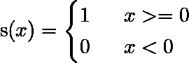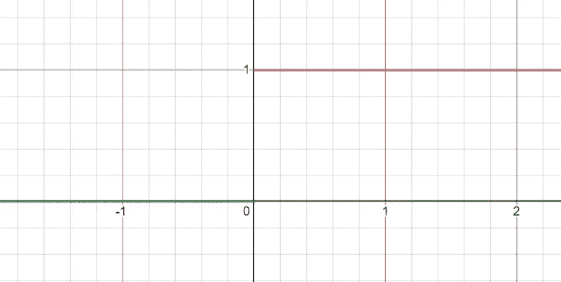

(1)阶跃函数 **s** 及其绘图。图片来源:作者

如您所见，该函数在 ***x=0*** 处不连续，因为两边的极限不匹配。

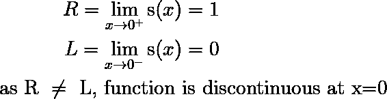

(2)阶跃函数 **s** 的右侧和左侧极限。图片来源:作者

为了使函数在 ***x=0*** 处连续，为什么不将“*步长*转换为“*斜坡*”，即从 ***-a*** 开始，到 ***a*** 结束，其中 a 是某个实数？

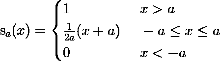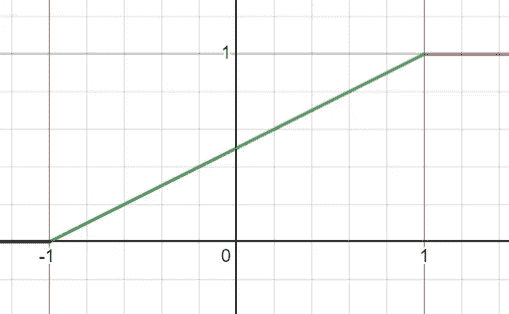

(3)斜坡函数 **s_a** 及其绘图。该功能在 **x=0** 处连续。图片来源:作者

> 如果你不明白我们如何得到(3)中的术语 ***(1/2a)(x+a)*** ，试着用坡点形式计算那条斜线的方程。

如果我们像在(2)中那样计算极限，你会发现这个新的*斜坡*函数在 ***x=0*** 处是连续的。由于我们的函数现在已经变得连续，我们可以试着对它进行 w.r.t. ***x*** 的微分，

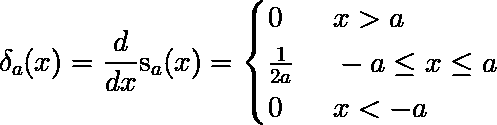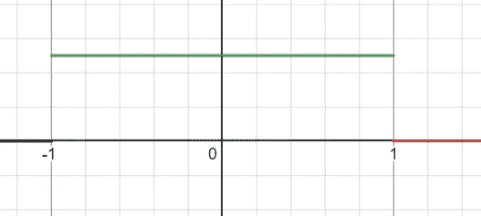

(4)斜坡*函数*的导数 **s_a** 及其绘图。图片来源:作者

> 但是请注意，连续性并不意味着可微性。然而反过来也是正确的。

有趣的部分来了。取一个极限使 ***a*** 趋近于 0，我们得到狄拉克δ函数，

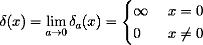

(5)

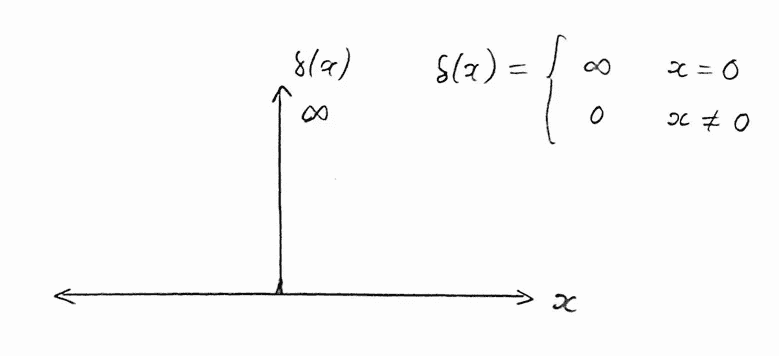

(5)狄拉克δ函数(尖峰函数)及其图。请注意，根据定义,“尖峰”底部的凸起是有意的，根本不应该存在。图片来源:作者

这个函数很奇怪，这就是它不是定义的'*函数*的原因。它就像一个以 ***x=0*** 为中心的无限质量。我们稍后将讨论更多的要点。接下来，我们将从负无穷到正无穷对(4)中获得的函数进行积分。这一步可能看起来很愚蠢，因为我们在(4)中进行了微分，现在我们正在进行积分，

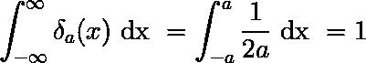

(6)狄拉克δ函数从负无穷到正无穷积分到 1。图片来源:作者

这看起来和我们用概率密度函数做的很相似，

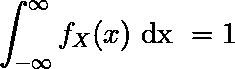

图片来源:作者

由于(6)中积分的结果并不真正取决于*，我们可以写成:*

*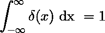*

*图片来源:作者*

*让我们休息一下，多了解一下狄拉克δ函数。为了在 X 轴上移动这个尖峰，我们可以做一点小小的改变，*

*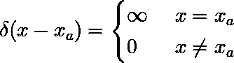**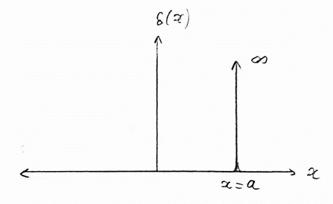*

*(7)具有参数 **a** 的狄拉克δ函数，其决定 X 轴上‘尖峰’的位置。图片来源:作者*

*通过修改(1)中的初始阶跃函数，可以很容易地导出这个表达式。在量子物理世界中，当我们进行测量时，比如说测量电子的位置时，我们实际上是在压缩电子的波函数。波函数给了我们电子位置的概率密度。但是当我们进行测量时，我们精确地知道它的位置，因此电子位置的分布采用狄拉克δ函数的形式。尖峰在位置 ***x_a*** 处，我们在测量时观察到电子，*

*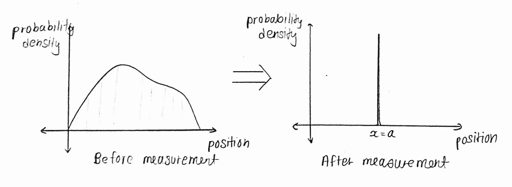*

*(8)波函数的坍缩。更多详情，请看这个[视频](https://youtu.be/Is_QH3evpXw)。图片来源:作者*

*当高斯分布的方差接近零时，狄拉克δ函数也可以被视为一种极限情况。当 ***μ*** 是高斯分布的均值时，尖峰出现在 ***x = μ****

***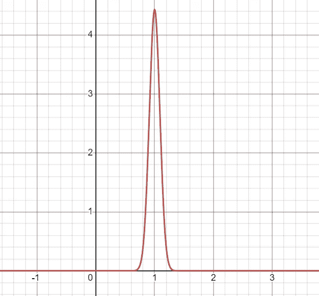*

*(9)当方差接近零时高斯分布(均值= 1)的形状。可以清楚地观察到“尖峰”的形成。图片来源:作者*

# *4.通用 PDF(我们的目标)*

*让我们回到为离散随机变量构造 PDF 的目标上来。让我们考虑一个离散随机变量 ***X*** 具有概率质量函数 ***p( X )*** ，*

*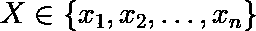*

*(10)随机变量 **X** 可以取的值。图片来源:作者*

*对于任何实现(随机变量 X 可以取的值) ***x_i*** ，考虑以下表达式*

*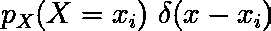*

*(11)乘以狄拉克δ函数的 **X** 的概率质量函数。图片来源:作者*

*我们可以认为，Delta 函数的 spike 被移至 ***x = x_i*** ，但它也按因子 ***p( X=x_i )*** 缩放，该因子返回随机变量 ***X*** 取值 ***x_i*** 的概率。注意，上述表达式代表一个*连续的*实体。接下来，我们为所有 ***x_i*** 添加所有这样的表达式，*

*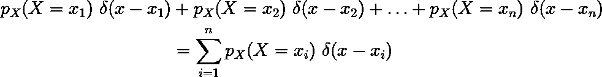*

*(12)表情 **11** 总结所有 **x_i.** 图片来源:作者*

*这个表达式类似于所有那些成比例的尖峰的相加，*

*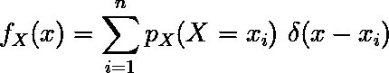**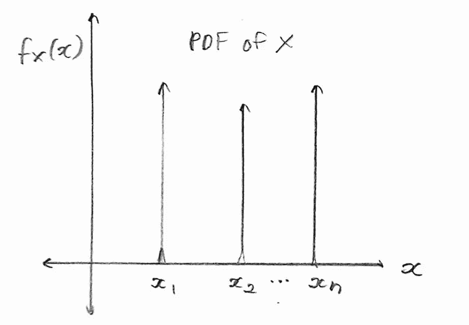*

*(13)变量 **X** 的 PDF 及其带有所有“尖峰”的图 **x** 。图片来源:作者*

*这是我们的广义 PDF，或者说从数据中得到的 PDF。由此产生的概率分布称为经验分布。但是这个东西仍然没有集成到 1 中，1 是所有 pdf 的属性。如果 ***X*** 可以等概率取任意值，那么，*

*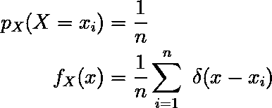**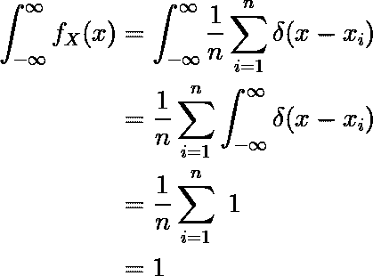*

*(14)通过选择适当的比例因子，新的 PDF 整合为一个。图片来源:作者*

*这就是你如何得到离散随机变量的 PDF。我们有一个对应的 CDF，看起来和我们之前讨论的阶跃函数相似，*

*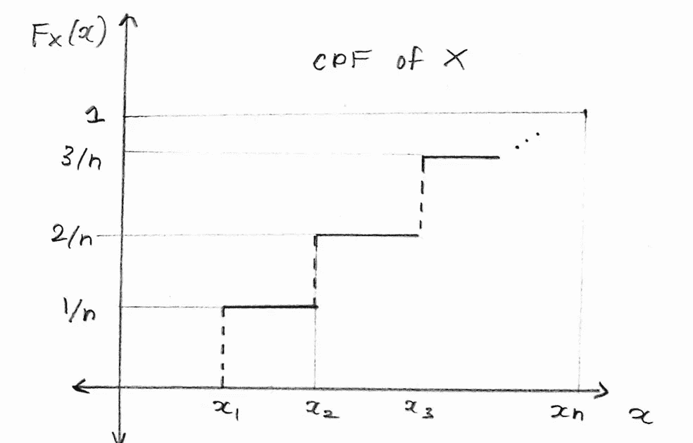*

*(15)变量 **X** 的对应 CDF。图片来源:作者*

*经验分布本身并没有实际应用，但它们对于证明与数据分布有关的各种陈述非常有用。*

# *结束了*

*我希望你喜欢这个故事和证据。我很高兴我让经验分布在我和读者的脑海中清晰可见。请在评论中分享你的想法，祝你有美好的一天！*