# 理解集合方法:10 分钟内随机森林、AdaBoost 和梯度增强

> 原文：<https://towardsdatascience.com/understanding-ensemble-methods-random-forest-adaboost-and-gradient-boosting-in-10-minutes-ca5a1e305af2>

## 机器学习

## 一个数据，三个模型，详细的计算变得简单


尼尔斯·维斯在 [Unsplash](https://unsplash.com?utm_source=medium&utm_medium=referral) 上的照片

[***决策树***](/k-nearest-neighbors-naive-bayes-and-decision-tree-in-10-minutes-f8620b25e89b) 是一个简单且易于解释的模型。然而，它是不稳定的，因为数据中的微小变化可能导致生成完全不同的树。它倾向于过度拟合训练数据，因此具有较高的方差，并且对看不见的测试数据的概括较差。

这个问题通过在**集合**中使用决策树得以缓解。与一只蚂蚁做不了多少事情相比，一大群蚂蚁可以创造建筑奇迹。那么，如何集成决策树呢？有两种方法:**装袋**和**增压。**

> 注意:因为我们将在这个故事中创建许多决策树，所以最好刷新一些关于决策树以及如何构建决策树的基本概念。这里有一个故事可能对你有所帮助:

[](/k-nearest-neighbors-naive-bayes-and-decision-tree-in-10-minutes-f8620b25e89b)  

```
**Table of Contents****·** [**Random Forest**](#e8d7)
  ∘ [Step 1\. Create a bootstrapped data](#f4b9)
  ∘ [Step 2\. Build a Decision Tree](#b0e6)
  ∘ [Step 3\. Repeat](#a2cf)
  ∘ [Predict, aggregate, and evaluate](#ea95)
**·** [**AdaBoost**](#d98d)
  ∘ [Step 1\. Initialize sample weight and build a Decision Stump](#ca9f)
  ∘ [Step 2\. Calculate the amount of say for the Decision Stump](#e7fc)
  ∘ [Step 3\. Update sample weight](#354b)
  ∘ [Step 4\. Repeat](#4074)
  ∘ [Prediction](#965b)
**·** [**Gradient Boosting**](#42e9)
  ∘ [Step 1\. Initialize a root](#ffdc)
  ∘ [Step 2\. Calculate the residual to fit a Decision Tree into](#b6f4)
  ∘ [Step 3\. Update log(odds)](#ed09)
  ∘ [Step 4\. Repeat](#8939)
  ∘ [Prediction](#b2db)
**·** [**Conclusion**](#2d8b)
```

# 随机森林

随机森林是最流行的装袋方法之一。你问的是什么？是**自举+聚合**的缩写。bagging 的目标是减少单个估计量的方差，即随机森林情况下单个决策树的方差。

具体来说，让我们在整个故事中使用一个虚拟数据集。假设您有以下逃税数据集。您的任务是根据应纳税收入(以千美元计)、婚姻状况以及是否实施退税等特征来预测一个人是否会遵从纳税(逃避列)。

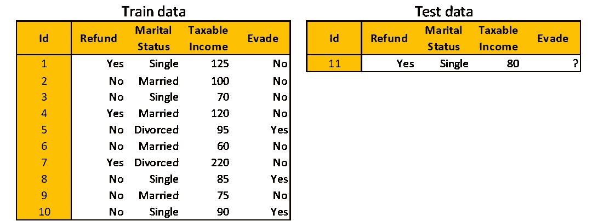

本文使用的数据集|图片作者[作者](http://dwiuzila.medium.com/membership)

随机森林由这三个步骤组成:

## 第一步。创建引导数据

给定一个具有 *m* 观测值和 *n* 特征的原始列车数据，随机抽取 *m* 观测值**并重复**。这里的关键词是“有重复”。这意味着某些观测值很可能被多次选取。

下面是从上面的原始训练数据引导的数据的例子。由于随机性，您可能会有不同的引导数据。

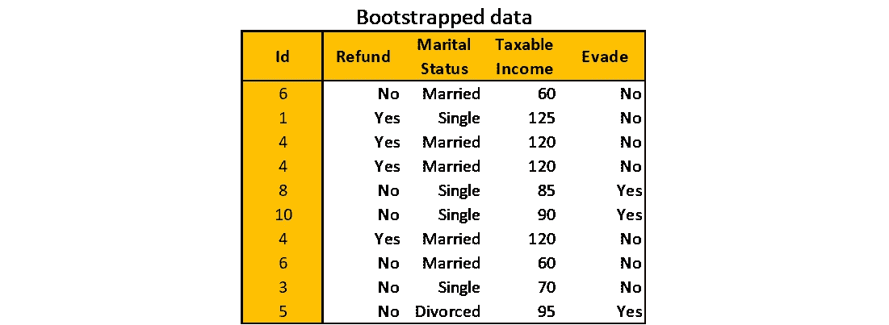

[作者](http://dwiuzila.medium.com/membership)自举数据|图片

## 第二步。构建决策树

决策树是这样构建的:

1.  使用引导数据，以及
2.  考虑每个节点的随机特征子集(考虑的特征数量通常是 *n* 的平方根)。

## 第三步。重复

步骤 1 和步骤 2 迭代多次。例如，使用六次迭代的逃税数据集，您将获得以下随机森林。

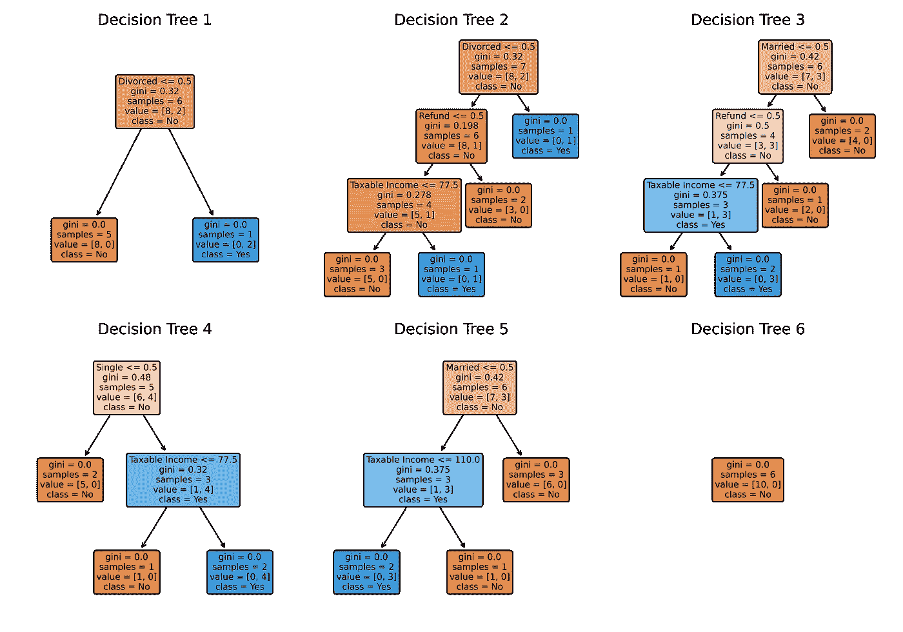

使用逃税数据集的具有六个决策树的随机森林。注意，决策树 6 仅由一个节点组成，因为自举数据对于所有十个观察值都有**逃避=无**目标|图片作者[作者](http://dwiuzila.medium.com/membership)

请注意，随机森林不是确定性的，因为有随机选择的观察值和要素在起作用。这些随机选择就是为什么随机森林减少了决策树的方差。

## 预测、汇总和评估

若要使用随机森林进行预测，请使用测试数据遍历每个决策树。对于我们的例子，只有一个测试观察，六个决策树分别对“规避”目标给出预测**否**、**否**、**否**、**是**、**是**和**否**。从这六个预测中进行多数投票，以做出单个随机森林预测:**否**。

将决策树的预测组合成随机森林的单个预测称为**聚合**。虽然多数表决用于分类问题，但回归问题的聚合方法使用所有决策树预测的平均值或中值作为单个随机森林预测。

自举数据的创建允许一些训练观察不被决策树的子集看到。这些观察结果被称为**随机样本**，对于评估随机森林的性能非常有用。要获得随机森林的验证准确性(或您选择的任何指标),请执行以下操作:

1.  在没有样本的情况下运行*构建的所有决策树，*
2.  汇总预测，以及
3.  将聚合预测与真实标签进行比较。

# adaboost 算法

与随机森林不同，AdaBoost(自适应增强)是一种增强集成方法，其中简单的*决策树是按顺序构建的。有多简单？这些树只有一根根和两片叶子，简单到它们有自己的名字:**决策树桩**。随机森林和 AdaBoost 有两个主要区别:*

1.  随机森林中的决策树对最终预测具有相同的贡献，而 AdaBoost 中的决策树桩具有不同的贡献，即一些树桩比其他树桩更有发言权。
2.  随机森林中的决策树是独立构建的，而 AdaBoost 中的每个决策树桩都是通过考虑前一个树桩的错误来做出的。

决策树桩过于简单；它们比随机猜测稍微好一点，并且有很高的偏差。boosting 的目标是减少单个估计器的偏差，即 AdaBoost 情况下的单个决策树桩的偏差。

回想一下逃税数据集。您将使用 AdaBoost 根据三个特征来预测一个人是否会遵从纳税:应纳税收入、婚姻状况和退税。


逃税数据集|图片作者[作者](http://dwiuzila.medium.com/membership)

## 第一步。初始化样本权重并构建决策树桩

请记住，AdaBoost 中的决策树桩是通过考虑前一个树桩的错误而形成的。为此，AdaBoost 为每个训练观测值分配一个样本权重。当前树桩将较大的权重分配给错误分类的观察值，通知下一个树桩更加注意那些错误分类的观察值。

最初，因为还没有做出预测，所以所有的观察都被赋予相同的权重 1/ *m* 。然后，构建一个决策树桩，就像创建深度为 1 的决策树一样。

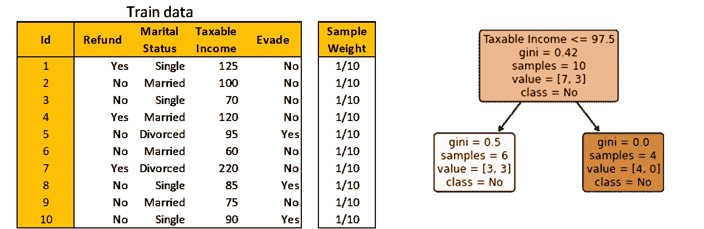

初始化样本权重并构建第一个决策残肢|图像由[作者](http://dwiuzila.medium.com/membership)

## 第二步。计算决策树桩的发言权

这个决策残肢产生 3 个错误分类的观察。因为所有的观察值都有相同的样本重量，所以样本重量的总误差为 1/10 + 1/10 + 1/10 = 0.3。

然后可以使用公式计算出的**量**

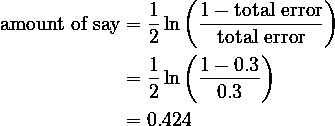

为了理解为什么这个公式有意义，让我们画出相对于总误差的量。注意，总误差仅定义在区间[0，1]上。

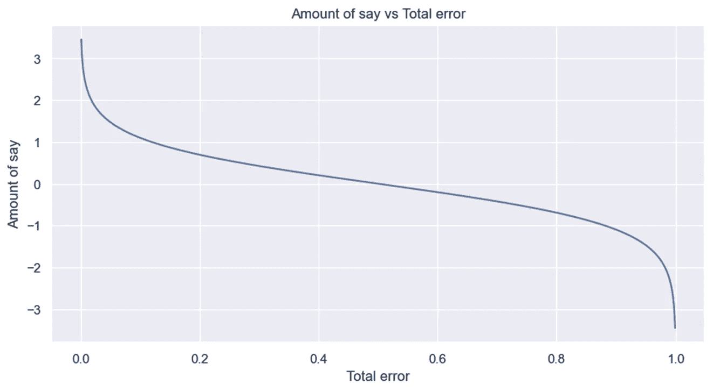

总误差|图片作者[作者](http://dwiuzila.medium.com/membership)

如果总误差接近 0，则 say 的量是一个大的正数，表明树桩对最终预测做出了许多贡献。另一方面，如果总误差接近 1，则 say 的数量是一个很大的负数，这对于残肢产生的错误分类是一个很大的惩罚。如果总误差为 0.5，树桩对最终预测没有任何作用。

## 第三步。更新样品重量

AdaBoost 将增加错误标记的观察值的权重，并减少正确标记的观察值的权重。新的样本权重影响下一个决策问题:权重较大的观察值更受关注。

要更新样品重量，请使用以下公式

*   对于错误标记的观察值:

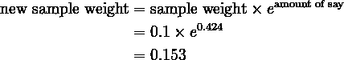

*   对于正确标记的观察结果:

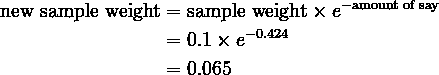

在继续下一步之前，您需要使用以下公式对新的样本权重进行归一化，使它们的总和等于 1

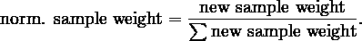

下表总结了这些计算。绿色观察值被正确标记，而红色观察值被当前树桩错误标记。

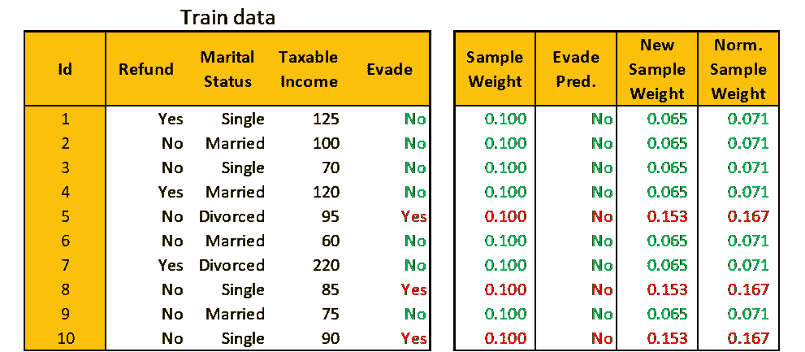

由[作者](http://dwiuzila.medium.com/membership)更新第一个决策树桩|图像的样本权重

## 第四步。重复

使用**加权**杂质函数，即加权基尼指数，创建新的决策树桩，其中在确定每类观察值的比例时考虑归一化样本权重。或者，创建决策树桩的另一种方法是使用基于标准化样本权重的自举数据。

由于归一化样本权重的总和为 1，因此可以将其视为在自举时选取特定观察值的概率。因此，id 为 5、8 和 10 的观察值更有可能被选中，因此决策树桩更关注它们。

引导数据如下所示。请注意，由于随机性，您可能会获得不同的引导数据。像以前一样建立一个决策树桩。

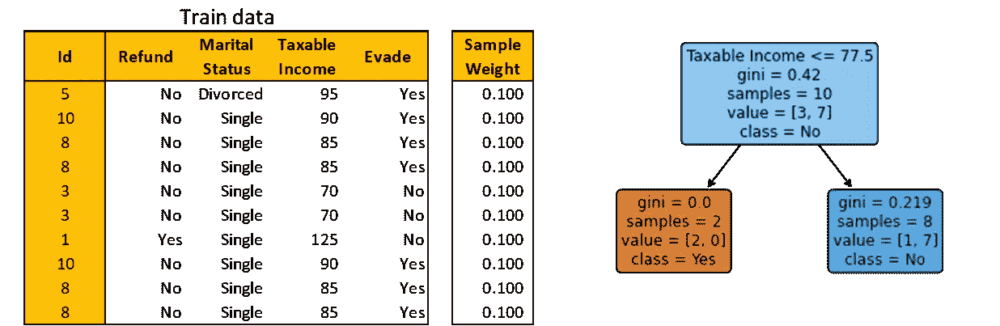

初始化样本权重并构建第二个决策残肢|图像作者[作者](http://dwiuzila.medium.com/membership)

你看到有一个错误分类的观察。所以，说的量是 1.099。更新样本权重，并根据仅自举观测值的权重之和进行归一化。下表总结了这些计算。

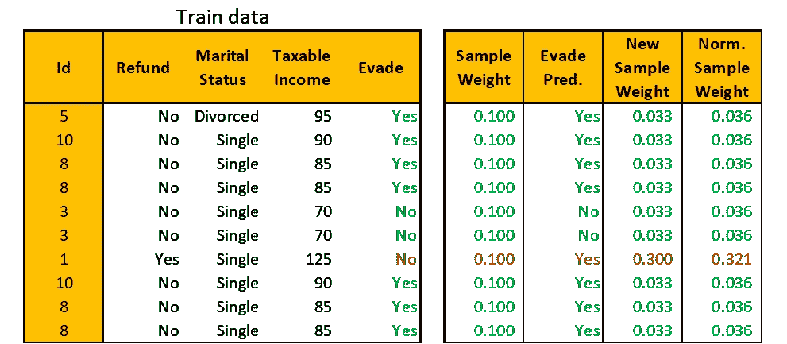

由[作者](http://dwiuzila.medium.com/membership)更新第二个决策树桩|图像的样本权重

引导观测值返回到训练数据池，新的样本权重如下所示。然后，您可以使用第三个决策树桩的新样本权重来再次引导训练数据，该过程继续进行。

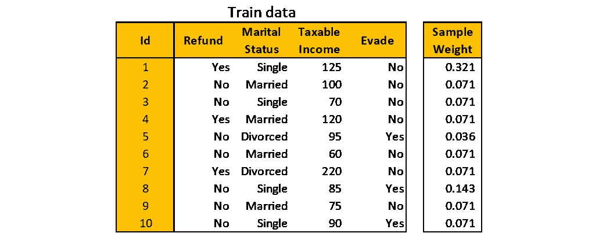

训练数据及其样本权重|图片由[作者](http://dwiuzila.medium.com/membership)

## 预言；预测；预告

假设你迭代六次这些步骤。因此，你有六个决策难题。要进行预测，请使用测试数据遍历每个树桩并对预测的类进行分组。发言权最大的一组代表 AdaBoost 的最终预测。

举例来说，您构建的前两个决策树桩的数量分别为 0.424 和 1.099。两个树桩预测**逃避=否**因为对于应纳税所得额，77.5 < 80 ≤ 97.5 (80 是测试观察的应纳税所得额)。假设其他四个决策问题预测并有以下的发言权。


决策树桩的预测和他们的发言权|图片作者[作者](http://dwiuzila.medium.com/membership)

由于预测**逃避的所有树桩的发言权的总和=否**是 2.639，大于预测**逃避的所有树桩的发言权的总和=是**(也就是 1.792)，那么最终的 AdaBoost 预测是**逃避=否**。

# 梯度推进

由于两者都是增强方法，AdaBoost 和梯度增强具有相似的工作流程。但是有两个主要的区别:

1.  梯度增强使用比决策树桩大的树。在这个故事中，我们将树限制为最多有 3 个叶节点，这是一个可以随意更改的超参数。
2.  梯度提升不是使用样本权重来指导下一个决策树桩，而是使用决策树产生的残差来指导下一棵树。

回想一下逃税数据集。您将使用梯度推进基于三个特征来预测一个人是否会遵从纳税:应纳税收入、婚姻状况和退税。


逃税数据集|图片作者[作者](http://dwiuzila.medium.com/membership)

## 第一步。初始化根目录

根是深度为零的决策树。它不考虑任何特征来做预测:它使用回避本身来预测回避。它是怎么做到的？使用映射**否→ 0** 和**是→ 1** 对规避进行编码。然后，取平均值，就是 0.3。这被称为**预测概率**(该值总是在 0 和 1 之间)，用 *p* 表示。

由于 0.3 小于阈值 0.5，根将为每次列车观察预测**否**。换句话说，预测永远是规避的*模式*。当然，这是一个非常糟糕的初步预测。为了提高性能，您可以使用下面的公式计算下一步要使用的 **log(odds)**

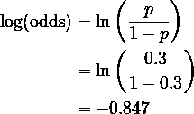

## 第二步。计算适合决策树的残差

为了简化表示法，让 Evade 的编码列表示为 *y* 。残差简单地定义为*r*=*y*-*p*，其中 *p* 是使用其反函数从最新对数(赔率)计算的预测概率

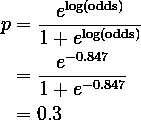

使用所有训练观察值构建一个决策树来预测残差。请注意，这是一个回归任务。

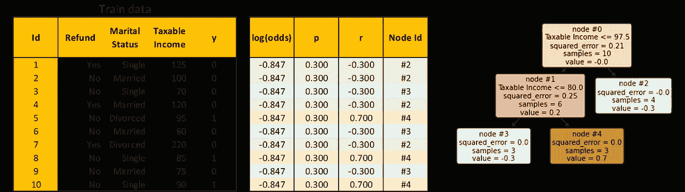

计算残差并拟合决策树以预测残差|图像作者[作者](http://dwiuzila.medium.com/membership)

## 第三步。更新日志(赔率)

注意，我还添加了一个节点 Id 列，它解释了决策树中预测每个观察的节点的索引。在上表中，每个观察都用颜色进行了编码，以便于看出哪个观察到了哪个节点。

要组合初始根的预测和您刚刚构建的决策树，您需要转换决策树中的预测值，以便它们与初始根中的对数(几率)相匹配。

例如，设 *dᵢ* 表示节点# *i* 中的观测 id 集合，即 *d₂* = {1，2，4，7}。那么节点#2 的转换是

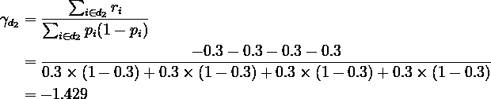

对节点#3 和节点#4 进行相同的计算，得到所有训练观测值的 *γ* ，如下表所示。现在，您可以使用公式更新日志(赔率)

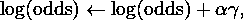

其中 *α* 是梯度推进的学习率，是一个超参数。我们来设置 *α* = 0.4，那么更新日志(odds)的完整计算见下图。

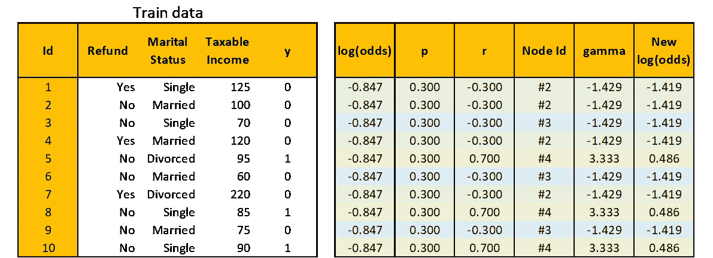

更新日志(赔率)|图片作者[作者](http://dwiuzila.medium.com/membership)

## 第四步。重复

使用新日志(odds)，重复步骤 2 和步骤 3。这是新的残差和用来预测它的决策树。

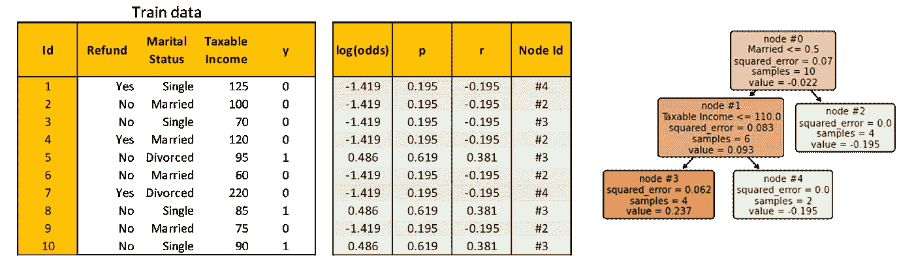

计算残差并拟合决策树以预测残差|图像作者[作者](http://dwiuzila.medium.com/membership)

像以前一样计算 *γ* 。例如，考虑节点#3，然后

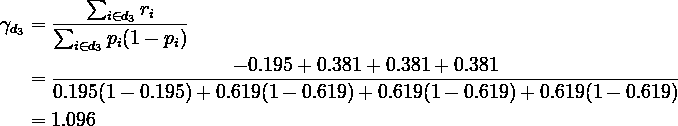

使用 *γ* ，像以前一样计算新的对数(赔率)。这是完整的计算

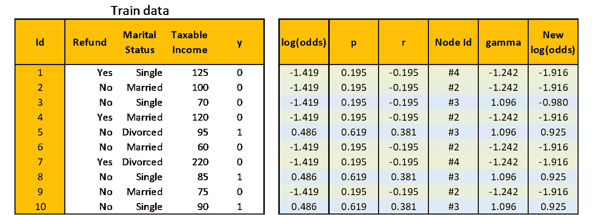

更新日志(赔率)|图片作者[作者](http://dwiuzila.medium.com/membership)

你可以重复这个过程很多次。然而，对于这个故事，为了避免事情失控，我们现在将停止迭代。

## 预言；预测；预告

要对测试数据进行预测，首先，遍历每个决策树，直到到达一个叶节点。然后，将初始根的 log(odds)与所有由学习率缩放的对应叶节点的 *γ* 相加。

在我们的例子中，测试观察落在两个决策树的节点#3 上。因此，总和变成-0.847+0.4×(-1.429+1.096)=-0.980。转换为预测概率

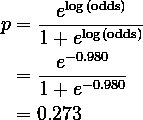

自 0.273 < 0.5, predict **规避=否**。

# 结论


马库斯·斯皮斯克在 [Unsplash](https://unsplash.com?utm_source=medium&utm_medium=referral) 上拍摄的照片

您已经非常详细地学习了**随机森林**、 **AdaBoost** 和**梯度增强**，并将它们应用于一个简单的虚拟数据集。现在，您不仅可以使用已建立的库来构建它们，还可以自信地知道它们是如何从内到外工作的，使用它们的最佳实践，以及如何提高它们的性能。

恭喜你。


🔥你好！如果你喜欢这个故事，想支持我这个作家，可以考虑 [***成为会员***](https://dwiuzila.medium.com/membership) *。每月只需 5 美元，你就可以无限制地阅读媒体上的所有报道。如果你注册使用我的链接，我会赚一小笔佣金。*

🔖*想了解更多关于经典机器学习模型如何工作以及如何优化其参数的信息？或者 MLOps 大型项目的例子？有史以来最优秀的文章呢？继续阅读:*


[艾伯斯·乌兹拉](https://dwiuzila.medium.com/?source=post_page-----ca5a1e305af2--------------------------------)

## 从零开始的机器学习

[View list](https://dwiuzila.medium.com/list/machine-learning-from-scratch-b35db8650093?source=post_page-----ca5a1e305af2--------------------------------)8 stories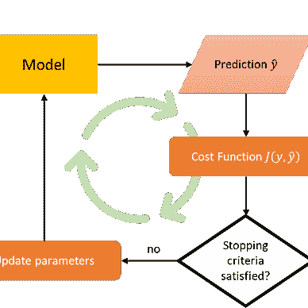

[艾伯斯·乌兹拉](https://dwiuzila.medium.com/?source=post_page-----ca5a1e305af2--------------------------------)

## 高级优化方法

[View list](https://dwiuzila.medium.com/list/advanced-optimization-methods-26e264a361e4?source=post_page-----ca5a1e305af2--------------------------------)7 stories

[艾伯斯·乌兹拉](https://dwiuzila.medium.com/?source=post_page-----ca5a1e305af2--------------------------------)

## MLOps 大型项目

[View list](https://dwiuzila.medium.com/list/mlops-megaproject-6a3bf86e45e4?source=post_page-----ca5a1e305af2--------------------------------)6 stories

[艾伯斯·乌兹拉](https://dwiuzila.medium.com/?source=post_page-----ca5a1e305af2--------------------------------)

## 我最好的故事

[View list](https://dwiuzila.medium.com/list/my-best-stories-d8243ae80aa0?source=post_page-----ca5a1e305af2--------------------------------)24 stories

艾伯斯·乌兹拉

## R 中的数据科学

[View list](https://dwiuzila.medium.com/list/data-science-in-r-0a8179814b50?source=post_page-----ca5a1e305af2--------------------------------)7 stories