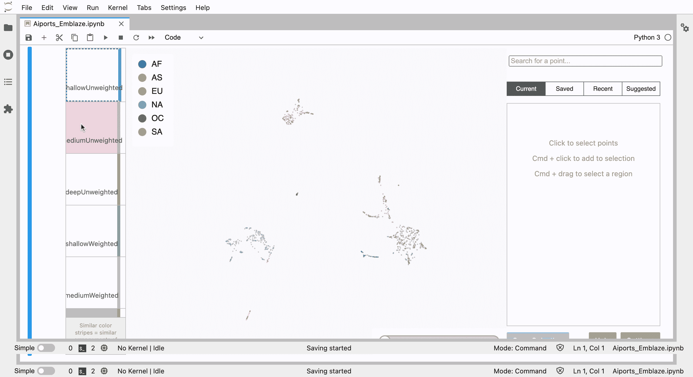
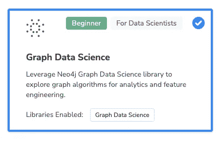
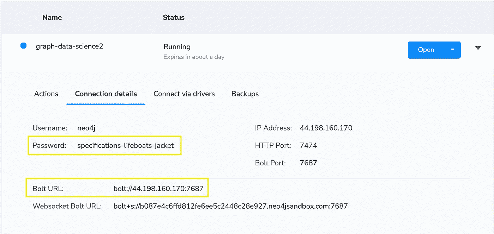
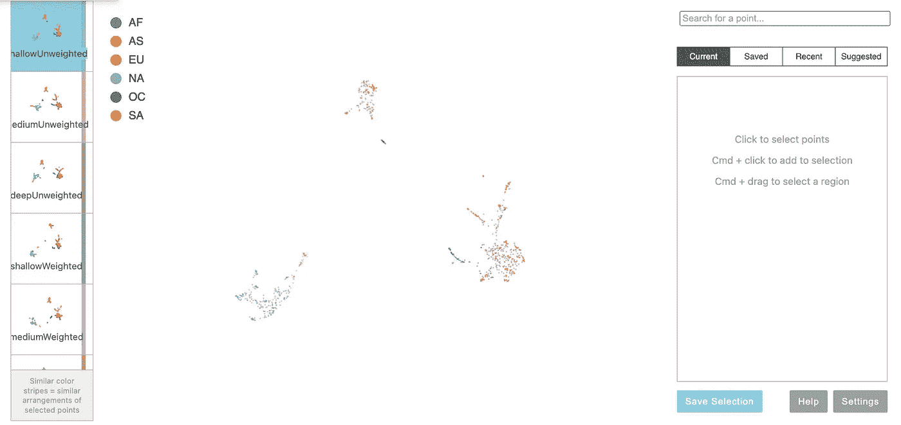
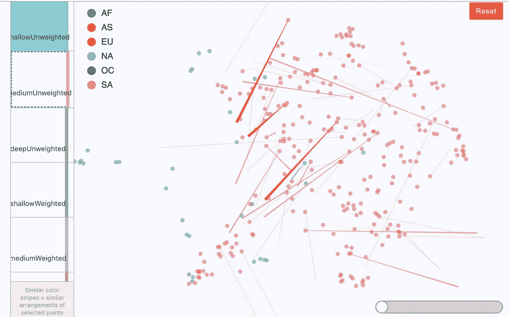
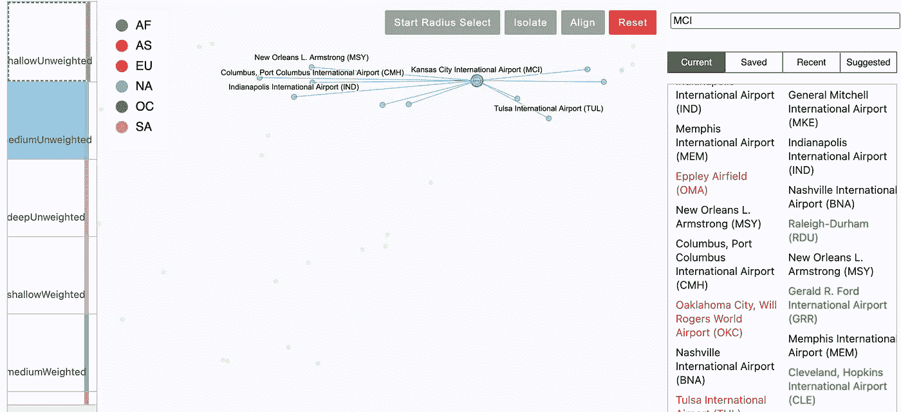
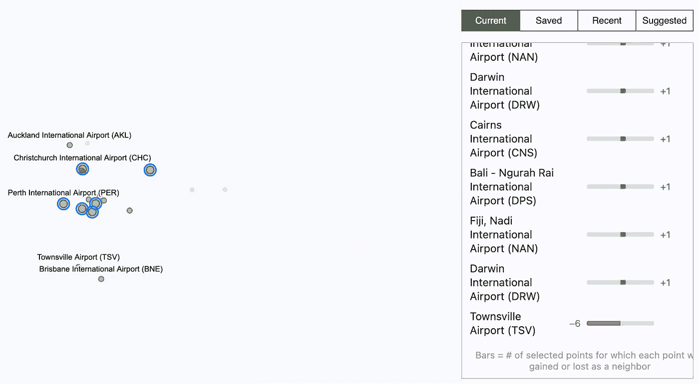

# 用 Neo4j 和 Emblaze 理解图嵌入

> 原文：<https://towardsdatascience.com/understanding-graph-embeddings-with-neo4j-and-emblaze-7e2d6ef56b8c>

图嵌入可以将图中丰富的关系和属性网络表示为向量。这些嵌入向量对于比较节点是有用的，并且它们也是机器学习算法的有价值的输入。 [Neo4j Graph Data Science](https://neo4j.com/product/graph-data-science/) 只使用几行 Python 代码就可以从图中导出嵌入。

虽然使用 Neo4j 生成嵌入非常简单，但要判断您的应用程序是否有正确的嵌入并不容易。Neo4j 提供了几种嵌入算法的选择，每种算法都有多个可调超参数。如何理解不同嵌入结果之间的差异，并为您的用例选择最佳嵌入？进入 [Emblaze](https://github.com/cmudig/emblaze) ，这是一个由[卡耐基梅隆大学数据交互小组](https://dig.cmu.edu/)开发的 JupyterLab 小部件，它很好地支持了对数据集的多种嵌入选项的交互探索。



Emblaze 图形嵌入可视化和动画(图片由作者提供)

在本教程中，我们将为涉及机场和航线的数据集生成几种不同的图嵌入。然后，我们将使用 Emblaze 来可视化和比较嵌入结果。要完成这个实践教程，你需要一个免费的 [Neo4j 沙盒账户](https://sandbox.neo4j.com/)和一个 JupyterLab 环境。您可以[使用 pip 来安装 JupyterLab](https://jupyter.org/install) ，或者[将其作为 Anaconda](https://www.anaconda.com/) 的一部分。具备这些先决条件后，您可以按照下面的视频和教程进行操作。

登录 Neo4j 沙盒并创建一个新项目。选择“图形数据科学”数据集，然后点击“创建”。



选择 Neo4j 沙盒中的图形数据科学项目(图片由作者提供)

Graph Data Science 沙盒附带安装的 Graph Data Science 库，以及预加载的机场和航线数据集。当沙盒启动时，您可以展开关于项目的信息以显示连接细节。记下密码和 Bolt URL，供以后使用。



沙盒中的连接详细信息(图片由作者提供)

在 GitHub 上找到 [Airports_Emblaze.ipynb 笔记本](https://github.com/smithna/blogs/blob/main/emblaze_demo/Airports_Emblaze.ipynb)。切换到“Raw”视图，然后从浏览器中保存文件。默认情况下，下载的文件将被命名为 Airports_Emblaze.ipynb.txt，但将其重命名以删除“.”。txt "扩展名。启动 JupyterLab，然后打开 Airports_Emblaze.ipynb。

如果您还没有安装 Emblaze 和 GraphDataScience Python 库，您可以使用笔记本前两个单元中的命令来安装它们。

在第四个笔记本单元格中，用 Neo4j 沙箱中的连接信息替换 bolt_url 和密码。

```
bolt_url = "bolt://44.198.160.170:7687"
user = "neo4j"
password = "specifications-lifeboats-jacket"
gds = GraphDataScience(bolt_url, auth=(user, password))
```

注意，我们使用的是 GraphDataScience 包，这是用于 Neo4j 的[新数据科学 Python 客户端。如果你是一个有经验的 Neo4j 用户，笔记本中的语法看起来和你习惯的有点不同，这就是原因。](https://neo4j.com/docs/graph-data-science/current/python-client/)

data science 沙盒的预加载数据集包含表示机场和地理分区的节点。连接`Airport`节点的`HAS_ROUTE`关系包括一个`distance`属性，该属性告知机场之间的距离。我们希望将这一资产价值转化为一个`weight`，反映距离较近的机场之间更强的关系。下面的密码应用了一个简单的线性变换，从所有路线的最大距离中减去一条路线的距离，再加上 1。这样我们对`weight`总是有正面的评价。

```
gds.run_cypher("""
match (:Airport)-[r:HAS_ROUTE]->(:Airport)
with collect(r) as routes, max(r.distance) as maxDistance
foreach(route in routes | set route.weight = maxDistance + 1 — route.distance)
""")
```

您可以随意尝试其他变换，这些变换会将距离值较小的路径分配给较高的权重。例如，您可以尝试对距离应用负指数。

接下来，我们将创建一个内存中的图形投影，它包含`Airport`节点和`HAS_ROUTE`与它们的`weight`属性的关系。我们将把`HAS_ROUTE`关系视为无向关系。

```
G_routes, result = gds.graph.project(
   "air-routes", 
   "Airport",                                   
   {"HAS_ROUTE":
      {"orientation":"UNDIRECTED", 
      "aggregation":"MAX"}
   }, 
   relationshipProperties = "weight")
```

我喜欢运行[弱连接成分](https://neo4j.com/docs/graph-data-science/current/algorithms/wcc/) (WCC)算法，作为我探索性数据分析过程的一部分。这将在图中查找连接的节点集。我们首先调用算法 stats 模式来快速查看组件大小的分布。

```
routes_wcc = gds.wcc.stats(G_routes)routes_wcc['componentDistribution']--------------------------------{'p99': 1,
 'min': 1,
 'max': 3292,
 'mean': 16.52358490566038,
 'p90': 1,
 'p50': 1,
 'p999': 3292,
 'p95': 1,
 'p75': 1}
```

看起来我们有一个包含 3292 个`Airport`节点的巨大连接组件，然后是一些包含单个`Airport`节点的小组件。也许那些小部件代表的是不与商业航空航线相连的通用航空机场。出于演示的目的，我们只对作为巨型组件一部分的机场感兴趣。

我们再次运行 WCC 算法，但这次是在 mutate 模式下更新内存中的图形。

```
gds.wcc.mutate(G_routes, mutateProperty = 'componentId')
```

我们还想将 WCC 生成的`componentId`属性写入磁盘上的持久图，这样我们就可以在 GDS 会话后引用它。我们运行[GDS . graph . write node properties()](https://neo4j.com/docs/graph-data-science/current/graph-catalog-node-ops/#catalog-graph-write-node-properties-example)函数来实现这一点。

```
gds.graph.writeNodeProperties(G_routes, ['componentId'])
```

我们运行一个 cypher 查询来获得与巨型组件相关联的`componentId`。

```
gds.run_cypher("MATCH (a:Airport) RETURN a.componentId as componentId, count(*) as nodeCount ORDER BY count(*) DESC limit 1")componentId   nodeCount
---------------------------
0             3292
```

现在，我们可以投影一个子图，它只包含具有巨型组件的`componentId`的节点。

```
G_connected_airports, result = gds.beta.graph.project.subgraph("connected-airports", G_routes, "n.componentId = 0", "*")
```

我们编写一个函数，为子图中的每个机场节点创建[快速随机投影](https://neo4j.com/docs/graph-data-science/current/machine-learning/node-embeddings/fastrp/) (FastRP)嵌入。我为这个项目选择了 FastRP 嵌入，因为它运行非常快，即使在沙盒环境中也是如此。FastRP 擅长表示节点周围的局部邻域。嵌入将被添加到内存中的图形投影中。如果我们对其中一个嵌入感到满意，我们可以稍后将嵌入向量的属性写入磁盘图形。

对于算法的每次运行，我们将生成长度为 64 的嵌入向量，并且我们将使用 45 的随机种子。[嵌入维度](https://neo4j.com/docs/graph-data-science/current/machine-learning/node-embeddings/fastrp/#_embedding_dimension)是一个可调参数，但是我们在这里将它保持稳定，以便我们可以检查其他参数的影响。我为这个数据集选择了 64 的嵌入维数，因为它相对较小且简单。您可以随意尝试更长或更短的嵌入尺寸。设置随机种子可以保持算法重复运行时的一致性。随机种子值 45 是一个任意的选择。我们还将传入一个字典，其中包含每个嵌入的特定参数。

```
def train_fast_rp(graph, config):
    result = gds.fastRP.mutate(
        graph,
        embeddingDimension = 64,
        randomSeed = 45,
        **config
    )
    return result
```

我们将对属性`iterationWeights`的三个不同值进行实验。[该属性](https://neo4j.com/docs/graph-data-science/current/machine-learning/node-embeddings/fastrp/#_iteration_weights)包含应用于算法每次迭代的权重列表。随着每一次迭代，FastRP 算法从正在计算嵌入的节点向前移动一步。短列表意味着算法迭代次数少，每个节点的嵌入仅受其最近邻居的影响。更长的列表意味着算法迭代更多次，并且每个节点的嵌入受到更远的邻居的影响。

我们还将比较在关系上使用`weight`参数的嵌入和那些将图视为未加权的嵌入。总之，这将给我们六个嵌入探索。

```
configs = [{"iterationWeights": [1.0, 1.0], 
            "mutateProperty": "shallowUnweighted"},
           {"iterationWeights": [0.0, 1.0, 1.0], 
            "mutateProperty": "mediumUnweighted"},
           {"iterationWeights": [1.0, 1.0, 1.0, 1.0], 
            "mutateProperty": "deepUnweighted"},
           {"iterationWeights": [1.0, 1.0], 
            "relationshipWeightProperty": "weight", 
            "mutateProperty": "shallowWeighted"},
           {"iterationWeights": [0.0, 1.0, 1.0], 
            "relationshipWeightProperty": "weight", 
            "mutateProperty": "mediumWeighted"},
           {"iterationWeights": [1.0, 1.0, 1.0, 1.0], 
            "relationshipWeightProperty": "weight", 
            "mutateProperty": "deepWeighted"}]
```

现在我们为六种配置中的每一种运行`train_fast_rp`函数。

```
embedding_results = [train_fast_rp(G_connected_airports, config) for config in configs]
```

接下来，我们可以运行一个 Cypher 语句，该语句将从内存图中流式传输嵌入结果。除了嵌入向量之外，我们将返回`Airport`节点的一些属性，以及与每个`Airport`相关联的`Continent`的名称。我们将根据`HAS_ROUTES`关系的数量对前 900 个`Airports`进行采样。采样将加速 Emblaze 性能。它还从结果集中排除了一些非常小的机场，使那些不是机场或地理爱好者的人更容易理解结果。

```
embedding_df = gds.run_cypher("""
    call gds.graph.streamNodeProperties("connected-airports", 
        ["shallowUnweighted", 
         "mediumUnweighted", 
         "deepUnweighted", 
         "shallowWeighted", 
         "mediumWeighted", 
         "deepWeighted"]) 
    yield nodeId, nodeProperty, propertyValue
    WITH gds.util.asNode(nodeId) as a,
    MAX(case when nodeProperty = "shallowUnweighted" then       
           propertyValue end) as shallowUnweighted,
    MAX(case when nodeProperty = "mediumUnweighted" then 
           propertyValue end) as mediumUnweighted,
    MAX(case when nodeProperty = "deepUnweighted" then 
           propertyValue end) as deepUnweighted,
    MAX(case when nodeProperty = "shallowWeighted" then 
           propertyValue end) as shallowWeighted,
    MAX(case when nodeProperty = "mediumWeighted" then 
           propertyValue end) as mediumWeighted,
    MAX(case when nodeProperty = "deepWeighted" then 
           propertyValue end) as deepWeighted
    MATCH (a)-[:ON_CONTINENT]->(c:Continent)
    RETURN
    a.descr as airport_name, 
    a.iata as airport_code, 
    c.name as continent,
    shallowUnweighted,
    mediumUnweighted,
    deepUnweighted,
    shallowWeighted,
    mediumWeighted,
    deepWeighted
    ORDER BY size([(a)-[:HAS_ROUTE]-() | a]) DESC
    LIMIT 900
    """)
```

接下来，我们将编写一个函数，该函数获取一列`embedding_df` Pandas 数据帧，并将其转换为一个 [Emblaze 嵌入](https://dig.cmu.edu/emblaze/emblaze/datasets.html#emblaze.datasets.Embedding)。Emblaze 嵌入将包含每个`Airport`的点数。相关的`Continent`会给这些点着色。我们将基于余弦相似性计算每个`Airport`的十个最近邻。最近邻计算类似于 Neo4j 的图形数据科学库中的 [k 最近邻](https://neo4j.com/docs/graph-data-science/current/algorithms/knn/)算法。最后，我们将使用 Emblaze 的默认 [UMAP 降维算法](https://umap-learn.readthedocs.io/en/latest/)将每个嵌入从 64 维空间投影到 2 维空间。

```
def create_emblaze_embedding(embedding_df, column):
    emb = emblaze.Embedding({
             emblaze.Field.POSITION:
             np.array(list(embedding_df[column])),
             emblaze.Field.COLOR: embedding_df['continent']}, 
             n_neighbors = 10,
             label=column, 
             metric='cosine')
    emb.compute_neighbors()
    return emb.project()
```

我们对`embedding_df`数据帧中的最后六列运行`create_emblaze_embedding`函数。

```
emblaze_embeddings = [create_emblaze_embedding(embedding_df, column)    
   for column in embedding_df.columns[3:]]
```

接下来，我们将嵌入转换成一个 [Emblaze 嵌入集](https://dig.cmu.edu/emblaze/emblaze/datasets.html#emblaze.datasets.EmbeddingSet)。

```
variants = emblaze.EmbeddingSet(emblaze_embeddings)
```

我们创建了[文本缩略图](https://dig.cmu.edu/emblaze/emblaze/thumbnails.html)，它们将作为工具提示出现在 Emblaze embedding viewer 中。

```
thumbnails = emblaze.TextThumbnails(embedding_df['airport_name'] + 
   " (" + embedding_df['airport_code'] + ")")
```

最后，我们创建了 [Emblaze viewer](https://dig.cmu.edu/emblaze/emblaze/viewer.html) ，并将其显示为一个 JupyterLab 小部件。

```
w = emblaze.Viewer(embeddings = variants, thumbnails = thumbnails)
w
```



Emblaze 嵌入浏览器(图片由作者提供)

在小部件的左侧，我看到了我们创建的六个嵌入的缩略图。缩略图旁边的条形用颜色编码，表示哪些嵌入最相似。我看到共享`iterationWeights`参数值的嵌入对比共享相同`relationshipWeight`属性的三个嵌入的集合有更多相似的颜色。这表明在确定节点在嵌入空间中的最终位置时，改变`iterationWeights`属性比改变`relationshipWeight`属性具有更大的影响。

您可以单击其中一个缩略图生成线条，显示当前显示的嵌入和您单击的缩略图之间相对位置变化最大的点。第二次单击新嵌入可以看到从以前的视图到新嵌入的动画过渡。



放大图片，看看欧洲机场从轻度超重到中度超重变化最大的是什么

您可以在搜索框中输入机场代码。我输入“MCI”，这是我在堪萨斯城当地机场的代码。可视化缩放至所选机场及其在嵌入空间中的最近邻机场。


搜索单个机场(图片由作者提供)

单击不同的嵌入缩略图，当您切换到新的嵌入时，“邻居”面板会显示堪萨斯城机场的哪些机场将被添加或减去为邻居。



比较单个机场不同嵌入中的邻居节点(图片由作者提供)

让我们探索一下中等加权嵌入和中等非加权嵌入之间的变化。单击可视化的空白区域以取消选择所有机场。然后，双击中等权重的缩略图。单击缩略图表示中等体重。单击右侧面板上方的“建议”按钮。Emblaze 生成一组节点，这些节点的邻居发生了有趣的变化。单击“加载选择”获得其中一个建议。我选择了从墨尔本国际机场开始，包括澳大利亚、新西兰和新喀里多尼亚的六个机场。



六个澳大利亚机场从加权到不加权嵌入的变化(图片由作者提供)

在右侧的详细信息面板中，我可以看到从加权嵌入到非加权嵌入的变化导致所有六个机场都失去了 Townsville Airport (TSV)作为嵌入空间中的近邻。在嵌入空间中作为近邻添加的机场，如斐济(NAN)和巴厘岛(DPS)在距离上更远，但它们比汤斯维尔有更多到我们正在检查的机场的两跳连接航班。

使用 Neo4j 和 Emblaze 探索图形嵌入帮助加强了我对不同算法参数如何影响嵌入输出的直觉。我希望您在处理图形数据时会发现这些工具的组合很有用。