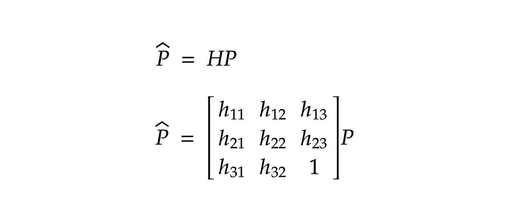
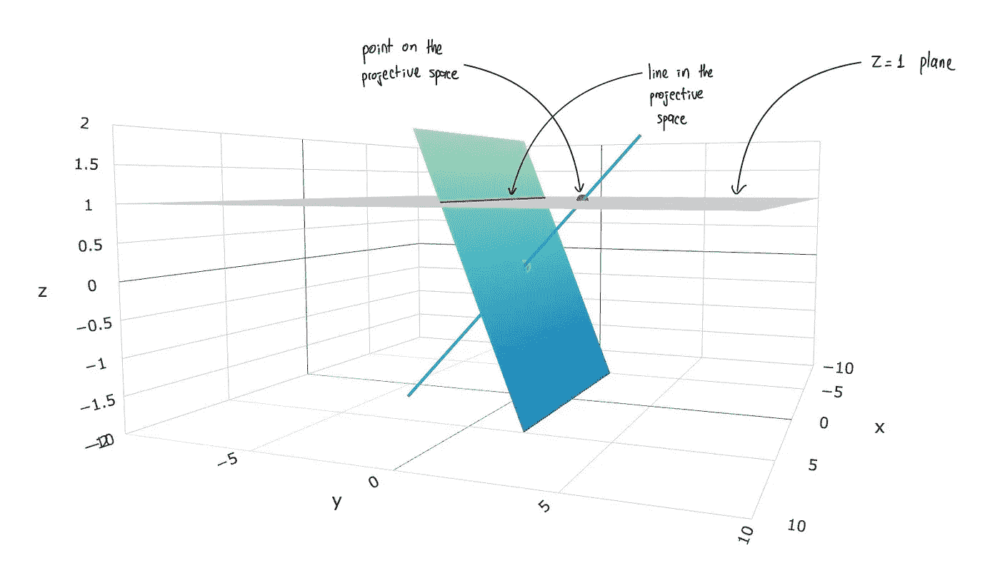
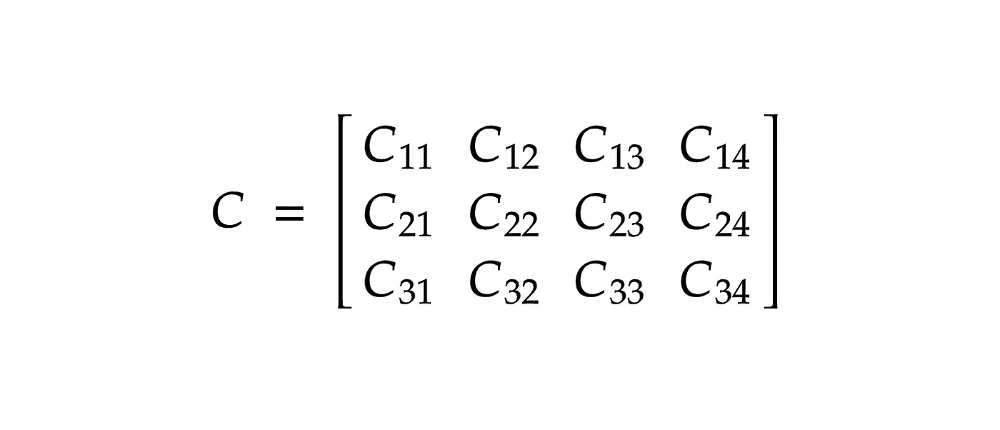
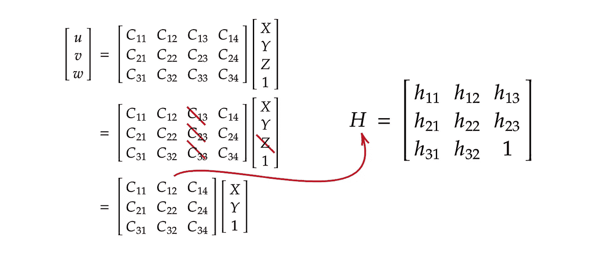
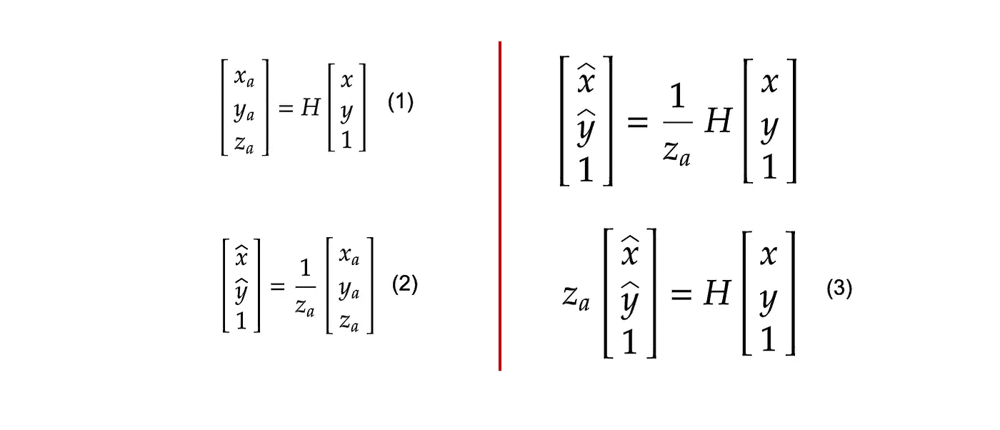
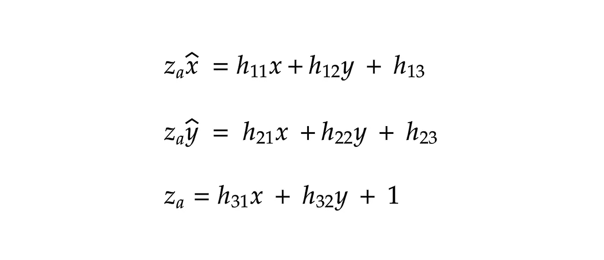
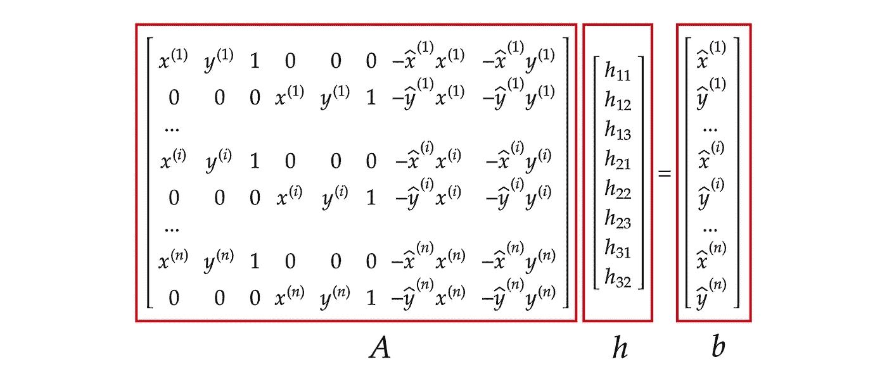

# 理解单应性(又名透视变换)

> 原文：<https://towardsdatascience.com/understanding-homography-a-k-a-perspective-transformation-cacaed5ca17>

## 从不同的角度看待事物

通过单应变换。图片作者。

# 一.动机

对于那些熟悉文档扫描仪应用程序的人来说，你可能会注意到，无论你如何拿着手机，这些应用程序产生的结果看起来就像你直接从顶部扫描文档一样(鸟瞰图)。在开发一个类似的应用程序时，我学会了通过一种叫做单应的计算机图形技术(也叫透视变换)来产生相同的特征。因此，在这篇文章中，我想解释这个概念，并分享一个 Python 实现来执行这样的技术。

# 二。单应性(又名透视变换)

线性代数在计算机图形学和计算机视觉中起着重要的作用。其中之一是通过矩阵乘法变换 2D 图像。这种变换矩阵的一个例子是单应矩阵。它允许我们通过将单应矩阵与一个视图中的点相乘来找到它们在另一个视图中的相应位置，从而从同一场景的一个视图转换到另一个视图(等式 1)。

等式 1:单应变换。作者图片

我们的目标是理解矩阵 *H* 是如何产生的，以及如何估计矩阵 *H* 的元素。为此，我们首先需要理解三个基本概念:齐次坐标、射影空间和针孔摄像机模型。

## 齐次坐标和射影空间

图 1:投影空间的可视化。图片作者。

> 试试[这个互动网站](https://wordsandbuttons.online/interactive_guide_to_homogeneous_coordinates.html)，对齐次坐标和射影空间如何工作有一个更好的直觉

齐次坐标是射影空间中使用的坐标系统。你可以把射影空间想象成 3D 空间中位于 *Z* =1 的平面。穿过 3D 空间的原点并与 *Z* =1 平面相交的直线在射影空间中形成点。此外，在射影空间中，当 3D 空间中的平面穿过原点并与 Z=1 平面相交时，形成线。在计算机图形学和计算机视觉中，与欧几里得空间中的笛卡尔坐标系相比，射影空间中的齐次坐标提供了一些优势。一个优点是，它允许我们将旋转和缩放等图像变换与平移结合为一个矩阵乘法，而不是矩阵乘法和向量加法(Yasen，2019)。这意味着我们可以将复杂的矩阵链接成一个单一的变换矩阵，这有助于计算机执行更少的计算。

## 针孔摄像机模型

齐次坐标和射影空间在推导针孔摄像机模型中起着重要作用。该模型解释了如何将 3D 空间中的场景投影到图像平面(2D 图像)上。下面的等式将 3D 空间中的点与其在图像平面中的对应位置相关联。请注意，生成的 2D 点和源 3D 场景点都在同质坐标中。

等式 2:针孔摄像机模型。图片作者。

您可以看到该关系由两个转换组成。第一个变换矩阵称为摄像机外部矩阵。它告诉我们相机在 3D 空间中的位置。第二个变换是摄像机固有矩阵，它将图像平面转换成像素。首先，它将图像平面从单位(例如米)缩放到像素。然后，它移动图像平面的原点，以匹配左上角从(0，0)开始的像素坐标。

等式 3:相机矩阵。图片作者。

然后，我们可以通过矩阵乘法将这两种变换组合成摄像机矩阵。为了获得这个矩阵的条目的值，我们执行一个称为相机校准的过程(Bhatt，2021)。我推荐你观看 Peter Corke 的视频，了解更多关于这个话题的信息。

## 推导单应矩阵

在我们从针孔摄像机模型中知道什么是摄像机矩阵之后，我们可以导出单应矩阵。我们知道针孔摄像机模型将 3D 空间中的一个点映射到图像平面上。让我们假设我们的场景是一个平面，位于(X，Y，0)。然后我们可以像下面这样更新相机矩阵。

等式 4:单应矩阵。图片作者。

得到的矩阵是单应矩阵。它告诉我们，同一场景从一个视图到另一个视图的转换实质上是从一个投影平面到另一个投影平面的变换。请注意， *H* 中没有 *h₃₃* 值，因为我们可以假设它为 1。

## 计算单应矩阵的元素

类似于相机矩阵，我们可以通过执行校准过程来找到单应矩阵的值。我们可以通过下面的等式使用彼此相关的对应点来做到这一点。

等式 5:两对匹配点之间的关系。图片作者。

然后，我们可以将等式 5–3 分布如下

等式 6:通过单应性的两点之间的关系。图片作者。

上面的关系是一对匹配点之间的关系。由于单应矩阵具有 8 个自由度，我们需要至少四对对应点来求解单应矩阵的值。然后，我们可以像下面这样组合所有四个点之间的关系。

等式 7:n 对匹配点之间的关系。图片作者。

这种形式允许我们通过最小二乘法求解 *h* 向量。

# 三。代码

在了解了单应性之后，我们可以编写 Python 代码来实现我在帖子开头提到的鸟瞰图功能。我们本质上是在寻找变换矩形文档的角并将其映射到新平面的单应矩阵，其中这些角映射到新图像平面的角。

> 您可以在这里找到包含样本图像[的 GitHub repo。](https://github.com/Socret360/understanding-homography)

# 四。结论

尽管我们只研究了如何实现文档扫描仪应用程序的鸟瞰效果，但单应还有更多用例。它还可以为 OCR 和自动驾驶汽车创建全景图、3D 重建和预处理图像。我鼓励你更深入地研究这个概念，这样你就能找到新的方法用它来创造伟大的事物！

*喜欢这篇文章，想表示你的支持？关注我或者给我买咖啡*

# 参考

Bhatt 博士(2021 年 11 月 12 日)。*计算机视觉中的摄像机标定综合指南*。分析 Vidhya。检索于 2022 年 1 月 30 日，来自[https://www . analyticsvidhya . com/blog/2021/10/a-comprehensive-guide-for-camera-calibration-in-computer-vision/](https://www.analyticsvidhya.com/blog/2021/10/a-comprehensive-guide-for-camera-calibration-in-computer-vision/)

*讲解齐次坐标&射影几何*。汤姆·达林。(1970 年 2 月 24 日)。检索于 2022 年 1 月 30 日，来自[https://www . tomdalling . com/blog/modern-OpenGL/explaining-homogeneous-coordinates-and-projective-geometry/](https://www.tomdalling.com/blog/modern-opengl/explaining-homogenous-coordinates-and-projective-geometry/)

*如何从对应点计算单应矩阵 H(2D-2D 平面单应)*。数学栈交换。(1961 年 9 月 1 日)。检索于 2022 年 1 月 30 日，来自[https://math . stack exchange . com/questions/494238/how-to-compute-homo-matrix-h-from-communication-points-2d-2d-planar-homo g](https://math.stackexchange.com/questions/494238/how-to-compute-homography-matrix-h-from-corresponding-points-2d-2d-planar-homog)

*图像单应性*。(未注明)。2022 年 1 月 30 日检索，来自[http://16385 . courses . cs . CMU . edu/spring 2021 content/lectures/08 _ homographics/08 _ homographics _ slides . pdf](http://16385.courses.cs.cmu.edu/spring2021content/lectures/08_homographies/08_homographies_slides.pdf)

刘，女。(2021 年 8 月 4 日)。理解计算机视觉中的转换。中等。2022 年 1 月 30 日检索，来自[https://towardsdatascience . com/understanding-transformations-in-computer-vision-b 001 f 49 a9 e 61](/understanding-transformations-in-computer-vision-b001f49a9e61)

*针孔摄像头型号*。HediVision。(未注明)。2022 年 1 月 30 日检索，来自 https://hedivision.github.io/Pinhole.html

塞尔日·贝隆吉。(未注明)。 *Cse 252B:计算机视觉 Ii* 。读书。检索自[https://CSE web . ucsd . edu/classes/sp04/CSE 252 b/notes/le c04/le C4 . pdf](https://cseweb.ucsd.edu/classes/sp04/cse252b/notes/lec04/lec4.pdf.)

y . Shankar(2022 年 1 月 13 日)。*估计单应矩阵*。中等。检索于 2022 年 1 月 30 日，来自[https://towards data science . com/estimating-a-homo graphy-matrix-522 c 70 EC 4 B2C](/estimating-a-homography-matrix-522c70ec4b2c)

透视变换、单应矩阵、本质矩阵和基本矩阵之间有什么区别？(未注明)。检索于 2022 年 1 月 30 日，来自[https://vivekseth.com/computer-vision-matrix-differences/](https://vivekseth.com/computer-vision-matrix-differences/)

亚森·胡。(2019 年 6 月 10 日)。*齐次坐标*。亚森·胡。检索于 2022 年 1 月 30 日，来自[https://yasenh.github.io/post/homogeneous-coordinates/](https://yasenh.github.io/post/homogeneous-coordinates/)

YouTube。(2018).*计算机视觉中的单应解释*。检索于 2022 年 1 月 30 日，来自[https://www.youtube.com/watch?v=MlaIWymLCD8.](https://www.youtube.com/watch?v=MlaIWymLCD8.)

YouTube。(2019).第 12 类——投影变换。 *YouTube* 。于 2022 年 1 月 30 日从[https://www.youtube.com/watch?v=54Qtu3S9HJU.](https://www.youtube.com/watch?v=54Qtu3S9HJU.)检索

YouTube。(2021).*针孔和透视投影|成像*。 *YouTube* 。于 2022 年 1 月 30 日从[https://www.youtube.com/watch?v=_EhY31MSbNM.](https://www.youtube.com/watch?v=_EhY31MSbNM.)检索