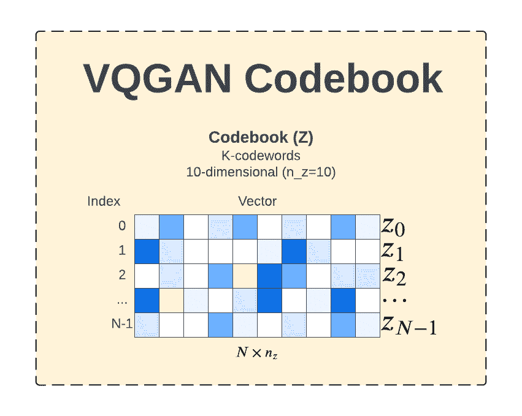
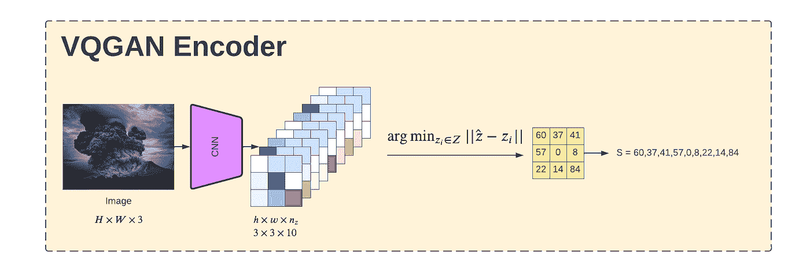
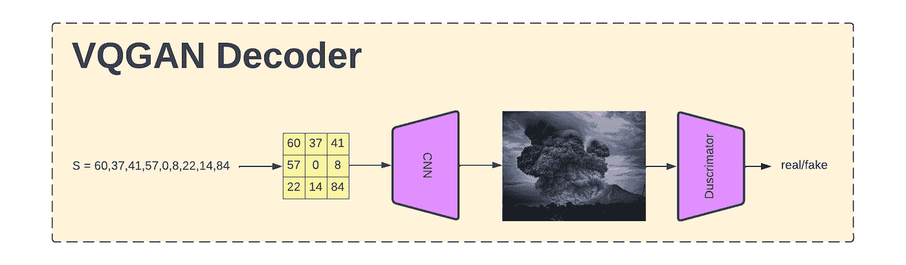
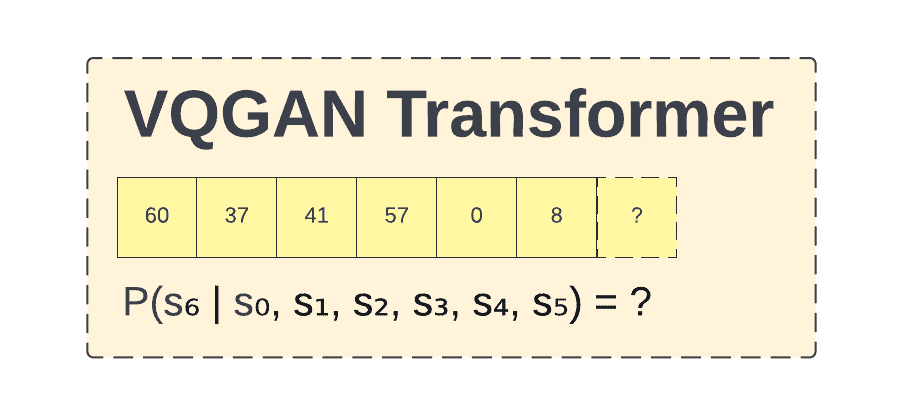
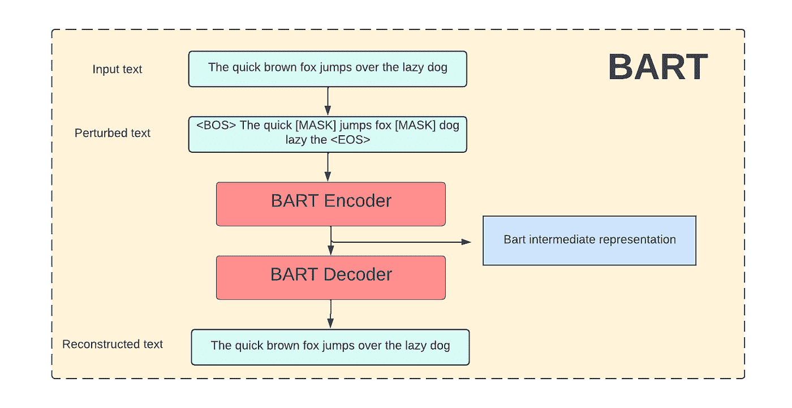
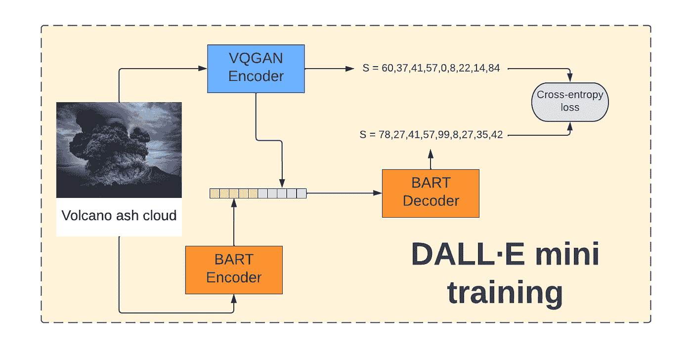
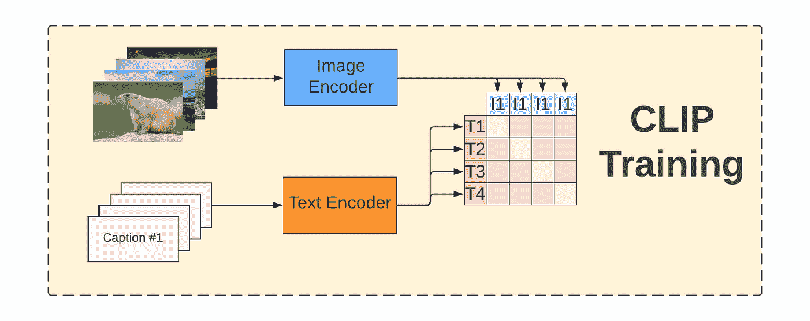
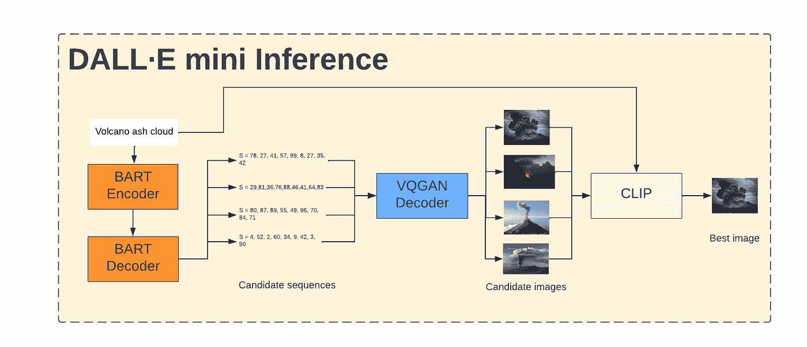

# DALL-E Mini 的工作原理

> 原文：<https://towardsdatascience.com/understanding-how-dall-e-mini-works-114048912b3b>

## 使用 DALLE-E 模型从文本生成图像，从文本提示，通过 VQGAN、BART 和 CLIP 到最终图像。

你一定听说过 DALL E mini，最热门的图像生成模型。但是你想知道它是如何工作的吗？在这篇文章中，我们将解密最近最著名的人工智能模型之一。为了更深入地理解所有组件，我还参考了其他资源。

在 [Unsplash](https://unsplash.com?utm_source=medium&utm_medium=referral) 上由 [russn_fckr](https://unsplash.com/@russn_fckr?utm_source=medium&utm_medium=referral) 拍摄的照片

DALL E mini 是一款能够在给出简短文本提示的情况下生成图像的模型。它在互联网上引起了很多关注，主要是因为非常搞笑的结果和易于使用的演示。如果你还没有做过，我鼓励你在这里玩 DALL E mini:【https://www.craiyon.com/

DALL E mini 是 OpenAI 的一个更大模型的开源版本，名为 DALLE [1]。该模型由几个已知的构件组成，以一种非常巧妙的方式与一些需要解决的有趣的工程问题联系在一起。如果你对 DALL E mini 的起源更感兴趣，可以参考[2]。那些块是 **VQGAN** 、**变压器**、 **BART** 和**夹子**。在本文中，我们自下而上，首先解释各个组件以及它们是如何连接的。

在我们开始之前，先简要说明一下:为了训练 DALL E，使用了三个带有图像标题的数据集。你可以在[2]阅读更多关于他们的内容。

# VQGAN

第一个重要的构建模块是 VQGAN 生成图像模型[3]。生成意味着，模型应该生成新的图像。传统上，卷积网络是计算机视觉任务的首选方式。然而，CNN 有一个重要的缺陷:它们强烈偏向于局部交互(在窗口内)。另一方面，当建模长期关系很重要时，transformer 模型显示了它们在 NLP 领域中的性能。一个典型的 transformer 模型构建为在一个序列中支持多达 512 个令牌，因为它们的计算需求随着输入大小的平方增长。这对于高质量的图像合成来说肯定太小了——像素的数量要大几个数量级。

VQGAN 试图结合 CNN 和 transformer 方法的优点进行图像合成。主要的想法是让 CNN 了解当地的互动，并把长期关系委托给 transformer。这样，我们可以利用两种架构的优势。让我们更深入地了解他们是如何做到的。

## 电报密码本

VQGAN 的一个重要概念是码本。可以理解为有向量的表格。每个矢量被认为是编码一个“感知丰富的图像成分”。编码器试图将输入图像表示为来自码本的代码序列。稍后，解码器使用该序列(和码本)来恢复原始图像。码本的大小和维数是固定的，并且模型学习实际的码向量。以这种方式选择参数，迫使码本学习有意义的表示。

码本(用 Z 表示)由 N 个条目组成，每个条目是 n_z 维向量。条目的数量及其大小是固定的。在这个例子中，它是作者的 Nx10 图像

## 编码器

过程如下:原始图像( **HxWx3** —高乘宽乘 RGB)被转换成来自码本的索引序列。这是由 CNN 编码器完成的。使用 n_z 个通道将图像尺寸缩小到**高 x 宽**。注意，n_z 是码本的维数。因此，来自编码器的每个输出“像素”具有与来自码本的向量相同的维度。

点击放大！作者图片

在图中，我用红色标出了右下部分。那些红色值将被转换成来自码本的单个值。你可以看到，在这个例子中，CNN 后的原始图像被转换为 3x3x10 的地图。3x3 是任意大小，10 来自码本条目大小(它们需要匹配)

等等，但是 CNN 的值与码本中的向量不匹配。没错。因此，该模型使用 L2 范数从码本中寻找最接近的向量。

当我们从码本中获得索引时，我们可以将它们展平为大小为 h x w 的序列 S。这样，我们就创建了一个整数序列的图像表示！由于图像被转换为 3x3x10，现在我们在序列 s 中有 9 个项目。

## 解码器

解码器做相反的事情。根据整数序列(码本索引)，它重新创建图像。由于整个模型是按照 GAN 风格建立的，所以在最后还有一个鉴别器。然而，在本文中，我假设您或多或少知道 GAN 是什么，因为这里没有空间解释它。

作者图片

解码器 CNN 的输入与编码器 CNN 的输出“几乎”相同。差不多，因为同时被编码成了码字。并且在这个过程中，我们丢失了一些信息(因为我们只依赖码本表示)。维度分析很简单，如果我们有 9 个元素序列，并且我们知道图像是一个正方形，我们将它排列为 3x3。而解码器 CNN 知道要扩展多少。

## 变压器

你可能会想，把图像编码成一个序列有什么意义，因为我们会在它之后马上回到 CNN 公式？答案是，我们还将转换器模型应用于顺序表示。回想一下，CNN 在本地互动中表现出色，但在远程互动中表现出色。相比之下，转换器对长距离依赖性执行 grat，但是对每个像素运行太昂贵。

顺序表示比原始像素更简洁。由于它是一个整数序列，我们可以很容易地将这个问题转化为语言建模，这正是转换器的优势所在。

因此，我们将中间的序列表示用于 transformer 模型，并在语言建模任务中训练它。如果我们将图像的顺序表示表示为 S = S0，S1，S2，..Sn(记住 S 的长度是固定的)我们可以训练转换器预测这个序列中的下一个值。

假设我们知道 S0 到 S5 码字，那么 S6 应该是什么？作者图片

通过这种方式，转换器了解到图像的分布片段彼此之间的相关程度。使用这种方法还有一个额外的好处。假设我们希望对图像生成进行调节(调节—提供“启动”信息，如“给我一张狗的图像”)。有了一个转换器，这是非常容易的，我们只需要预先考虑图像序列的条件序列。稍后我们将看到这一点。

还有一个话题——码本中的值究竟是如何更新的。但是，对于本文来说，这是一个太高级的主题。如果你对此感兴趣，请看原文[3]。

好了，我们已经完成了 DALL E mini 的第一大块。让我们继续巴特

# 巴特

与 VQGAN 相比，这部分相对简单。Bart 是一种基于(令人惊讶的)变压器架构的序列到序列自动编码器。目标是重建被噪声破坏的输入文本。让我们看一个例子。

作者图片

你可以看到这个模型修复了噪音输入。而只是 BART 预训练的辅助任务。对于我们的例子，我们更感兴趣的是将输入文本翻译成与码本相同的词汇。它将允许我们将它们两者结合起来！你可以认为 BART 的作用是把字幕“翻译”到码本上。

# 达勒和米尼

现在我们已经准备好了建造 DALL E mini 的最重要的部分。让我们从培训开始。程序如下:

1.  图像由 VQGAN 编码器编码。
2.  字幕由 BART 编码器编码。
3.  两个编码器的输出被组合并传递给 BART 解码器。
4.  VQGAN 编码器输出和 BART 编码器输出用于计算交叉熵损失。

主要思想是 VQGAN 编码器和 BART 解码器应该为图像和字幕对产生完全相同的序列。

DALL-E mini 的主要目标是匹配 VQGAN 和 BART 的输出。图片由作者提供

> 据我所知，VQGAN 在 DALL E mini 之前是单独训练的。BART 编码器也经过预训练，但解码器是从头开始训练的。

这看起来出奇的简单！

## 模型推理

现在我们来看一下 DALL E mini 的推论。这一次，我们只有标题，我们应该产生一个图像。第一步是向 BART 编码器提供描述。接下来，我们对 BART 解码器进行多次采样，以生成候选。每个候选图像被传递给 VQGAN 解码器，并生成候选图像。

我们可以停在这里—生成了多个图像，我们可以将它们呈现给用户。然而，我们可以做得更好。有一种方法可以自动对候选人进行排名，并选择其中的前 k 名。这个模型叫做剪辑。让我们看看它是如何工作的。

# 夹子

CLIP 是一个模型，能够嵌入文本和图像，并判断它们的匹配程度。为了再次训练剪辑模型，我们需要一组(图像、文本)对。图像和文本由专用编码器编码到同一个向量空间中。对于每一对，计算它们之间的点积。目标是使匹配对的文本和图像表示接近，而非匹配对的文本和图像表示远离。使用对称交叉熵训练该模型，这意味着该模型同时以两种方式学习该关系(文本→图像和图像→文本)。

CLIP 将所有图像与所有标题进行比较，并确保它们匹配。作者图片

在模型被训练之后，我们可以为它提供一个单独的标题(源标题)和一堆候选图片。在输出端，我们将得到每幅图像的分数，显示标题和图像的对齐程度。假设我们只取具有最大相似性的 K 个图像候选。

# 回到 DALL E mini 推论

现在我们已经准备好看到完整的 DALL E mini 推理管道

所有部件都在工作。作者图片

提供的提示被翻译成 VQGAN 码本中的码字序列。我们对 BART 进行多次采样，以获得一个以上的可能序列。这样我们就产生了多个候选人。每个候选者被单独放入 VQGAN 解码器。结果，我们有一堆生成的图像。生成的图像连同提示文本一起被输入到 CLIP 中，以便对它们进行排序，从而允许我们选择最终返回的前 K 个图像。

瞧，我们完成了！

# 问题和考虑

> 注意这部分大部分是我的私人意见

问:我们能解释一下密码本吗？
答:虽然在技术上我们可以将码本索引解码为 BART 词汇，但在我的实验中，我发现它们不提供任何类型的模型解释

**问:训练这样的模型**
有什么困难？答:其中最重要的一个是 argmin 操作不是反向传播友好的

**考虑因素 1:**
DALL-E Mini 没有引入任何新的、卓越的架构，而是很好地利用了现有的部件。

考虑 2:
我喜欢 DALL E mini 比 OpenAI 的 DALL-E 小得多的事实。作者声称使用 spot TPUs 只需 200 美元就可以训练。对我来说，同样重要的是小型车产生的二氧化碳要少得多。

# 参考资料:

[1]—DALL-E by open ai—[https://openai.com/dall-e-2/](https://openai.com/dall-e-2/)

[2] — [DALL-E mini 讲解](https://wandb.ai/dalle-mini/dalle-mini/reports/DALL-E-Mini-Explained--Vmlldzo4NjIxODA)

[3] — VQGAN 纸— [用于高分辨率图像合成的驯服变压器](https://arxiv.org/abs/2012.09841)

[4] —回形针— [从自然语言监督中学习可转移的视觉模型](https://arxiv.org/abs/2103.00020)

[5]-[剪辑 Github 库](https://github.com/openai/CLIP)

[6] — [与 CLIP Colab 笔记本互动](https://colab.research.google.com/github/openai/clip/blob/master/notebooks/Interacting_with_CLIP.ipynb#scrollTo=C5zvMxh8cU6m)

[7] — [DALL E mini —推理流水线 Colab 笔记本](https://colab.research.google.com/github/borisdayma/dalle-mini/blob/main/tools/inference/inference_pipeline.ipynb)

[8] — BART 论文— [BART:用于自然语言生成、翻译和理解的去噪序列间预训练](https://arxiv.org/abs/1910.13461)

[9] — [驯服变形金刚 Colab 笔记本](https://colab.research.google.com/github/CompVis/taming-transformers/blob/master/scripts/taming-transformers.ipynb)

## 图像来源:

[https://un flash . com/photos/izoque 5 vh47 o](https://unsplash.com/photos/IzoQu5vH47o)
[https://un flash . com/photos/h-acurbngw](https://unsplash.com/photos/h-ACUrBngrw)[【https://un flash . com/photos/krttcxujni](https://unsplash.com/photos/KRttQCXUjNI)