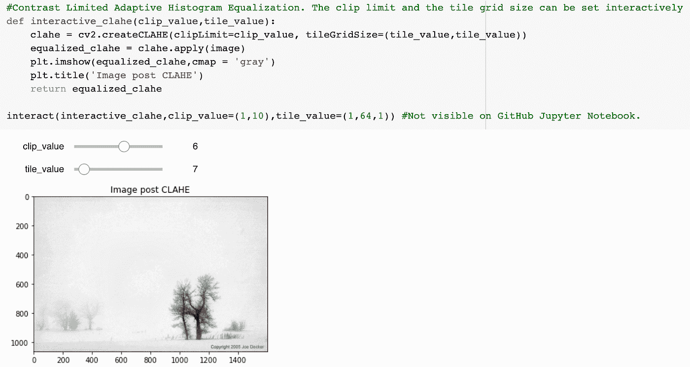
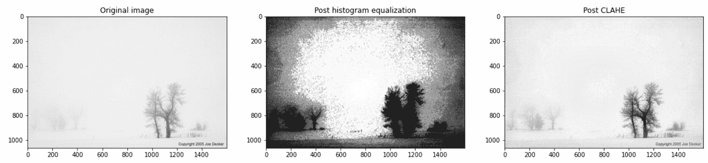
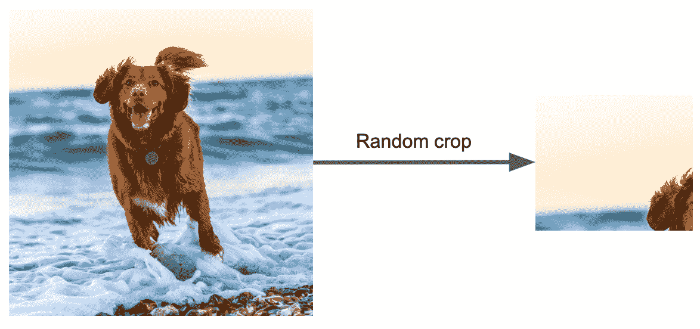

# 理解如何为计算机视觉和深度学习问题处理图像数据

> 原文：<https://towardsdatascience.com/understanding-how-to-handle-image-data-for-computer-vision-and-deep-learning-problems-f48cdeb98c83>

图片由 Bud Helisson 从 [Unsplash](https://unsplash.com/photos/kqguzgvYrtM)

# 简介:

在过去几年从事多个计算机视觉和深度学习项目后，我在这篇博客中收集了我关于如何处理图像数据的想法。几乎总是预处理数据比直接将其输入深度学习模型更好。有时，甚至可能不需要深度学习模型，经过一些处理后，简单的分类器可能就足够了。

最大化图像中的信号和最小化图像中的噪声使得手头的问题更容易处理。应用过滤器来增强特征，并使图像对光照变化、颜色等更加鲁棒。在构建计算机视觉系统时应该加以考虑。

考虑到这一点，让我们探索一些可以帮助解决经典计算机视觉或基于图像的深度学习问题的方法。这个博客附带的笔记本可以在这个[仓库](https://github.com/bikramb98/image_processing)中找到。

## **1。先简单后深入:**

在应用最新和最好的深度学习来解决问题之前，请尝试经典的计算机视觉技术。尤其是在数据稀缺的情况下，就像现实世界中的许多问题一样。

检查计算图像像素的统计值(如平均值、峰度、标准偏差)是否会得出不同类别的不同统计值。一个简单的分类器，如 SVM，KNN，然后可以根据这些值进行训练，以在不同的类之间进行分类。

## 2.增加图像中的信号并去除噪声:

在将预处理技术输入深度学习模型之前，检查预处理技术是否增强了图像的主要特征并提高了信噪比。这将有助于模型获得更高的精度。

*   使用阈值处理等技术、腐蚀和膨胀等去噪技术、高斯模糊(平滑边缘)和中值模糊(去除椒盐噪声)等模糊技术
*   对于不同的问题，不同的运算符可能以不同的顺序使用。
*   通常的做法是，在第一次应用某个操作符后的几个步骤中，不止一次地使用该操作符，如果这样可以增强更多的功能的话。

以帮助为滤波器、阈值等找到不同内核大小的最佳组合。(这两者的组合能跑到百万！)将产生最佳图像，构建交互式滑块来帮助找到这些值的理想范围。如何做到这一点的例子已经在下面的第 3 点和这个[笔记本](https://github.com/bikramb98/image_processing/blob/main/histogram_equalization.ipynb)中给出

之后，尝试第 1 点中描述的方法，看看是否能为你手头的任务提供足够的信息。

## 3.直方图均衡

增强图像特征的另一种方法是使用直方图均衡化。直方图均衡化提高了图像的对比度。直方图均衡化的目的是最频繁的像素值被均匀地展开和分布。

让我们看看下面的例子。

乔·德克尔在[摄影展](https://www.photocrati.com/the-tuesday-composition-areas-of-low-contrast-negative-space/)上拍摄的图片

可以看到，上面的图像对比度非常低。在这种情况下，重要的是提高对比度，使得图像的特征更加清晰可见。OpenCV 提供了两种实现方法——直方图均衡化和对比度受限的自适应直方图均衡化(CLAHE)。

应用直方图均衡化，图像的对比度确实会提高。然而，它也增加了图像中的噪声，因为它可能在下面的中间图像中。

这就是 CLAHE 的用武之地。使用这种方法，图像被分成 m×n 个网格，然后在每个网格上应用直方图均衡化。使用如下所示的交互式滑块，可以找到理想的裁剪限制(对比度阈值)和图块网格大小。

交互式滑块，以找到最佳的剪辑和拼贴值。作者图片

从左至右:原始图像，直方图均衡化图像，图像后分类。作者图片

右边的图像现在具有增强的对比度，与原始图像相比，背景和前景树更加明显。直方图均衡和 CLAHE 的完整笔记本可从[这里](https://github.com/bikramb98/image_processing/blob/main/histogram_equalization.ipynb)获得

## 4.将图像转换到不同的颜色空间:

将图像转换到不同的颜色空间，如 HSV，通常可以提供更好的信息来分割对象，例如对象跟踪。通常，RGB 颜色空间对阴影、光照的轻微变化(这会影响对象的颜色)并不鲁棒。对于使用经典计算机视觉的对象跟踪等任务，由于上面列出的原因，RGB 空间中的精细调整的蒙版经常会在稍有不同的环境中使用时失败。此外，一旦图像转换到不同的空间，如 HSV，分离通道通常有助于分割感兴趣的区域和消除噪声。正如下面可以看到的，一旦图像被转换到 HSV 空间并且通道被分割，阴影可以更容易地被去除并且网球被分割。关于转换到 HSV 空间和分离通道的笔记本可以在[这里](https://github.com/bikramb98/image_processing/blob/main/hsv_color_space.ipynb)找到。

不同的色彩空间(RGB，HSV)和它们的分量分裂。图片作者。

## 5.标准化图像:

如果图像被输入到深度学习模型中，则必须使用批处理标准化等技术对图像进行标准化，这将有助于对网络的输入进行标准化。这样有助于网络学习更快，更稳定。批量标准化有时也会减少泛化错误。

## 6.进行合理的扩充:

扩充图像时，请确保所应用的扩充技术保留了图像的类别，并且与现实世界中遇到的数据相似。例如，对狗的图像应用裁剪增强可能导致增强的图像不像狗。在某些对象中使用旋转和翻转进行扩充的情况下也是如此。在增强时改变图像属性(如颜色)时要非常小心。此外，确保增加数据不会改变图像的标签。

始终检查增强图像是否有意义，是否反映了真实世界。

随机裁剪等增强操作如何导致数据损坏的示例。左图由奥斯卡·萨顿从 [Unsplash](https://unsplash.com/photos/yihlaRCCvd4) 拍摄

## 7.训练集和验证集之间的数据泄漏:

这一个更适合一般的深度学习——但确保相同的图像(假设原始图像和增强图像)不在训练和验证集中是重要的。这种情况通常发生在列车验证分割之前执行扩充时。忽略这一点可能会导致模型度量给出其真实性质的错误表示，因为它将在训练期间从也存在于验证集中的非常相似的图像中学习。

## 8.测试/验证集上所有类别的代表:

确保测试和验证集包含所有标签的示例。这将产生反映模型真实本质的模型度量

以其中一个标签的示例数量明显较少为例。执行随机训练-测试分割可能导致具有较少标签的类根本不出现在验证/测试集中。唉，当训练好的模型被测试时，它将不会在那个特定的类上被测试，并且模型度量将不会反映其性能的真实本质。在本[笔记本](https://github.com/bikramb98/ai_in_medicine_specialization/blob/main/custom_split.ipynb)中可以找到如何做到这一点的示例。

## 9.后处理健全性检查:

模型定型后，执行一些健全性检查也很重要:

*   确保在多类分类器的情况下所有类的输出相加为 1。
*   确保在测试或部署模型时，也应用了在训练期间应用于图像的预处理。

我希望这篇博客文章给了你一些关于如何处理经典计算机视觉或深度学习问题的图像数据的见解。如果您在处理图像数据时有任何问题或方法，请告诉我。请随时在 Twitter 和 LinkedIn 上与我联系。如果你不想错过我以后的博客，你可以在这里订阅[，让它们直接发送到你的收件箱！感谢您的参与，祝您度过美好的一天！:)](https://baruahbikram05.medium.com/subscribe)