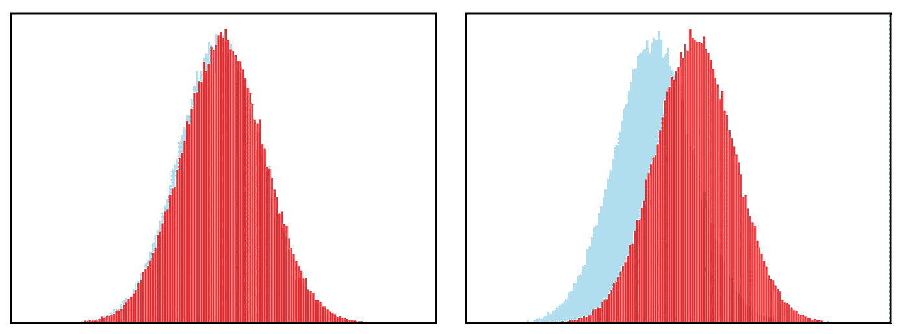
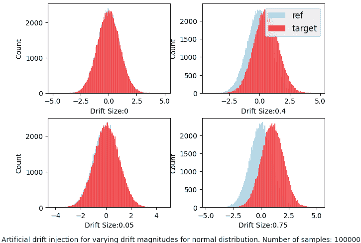
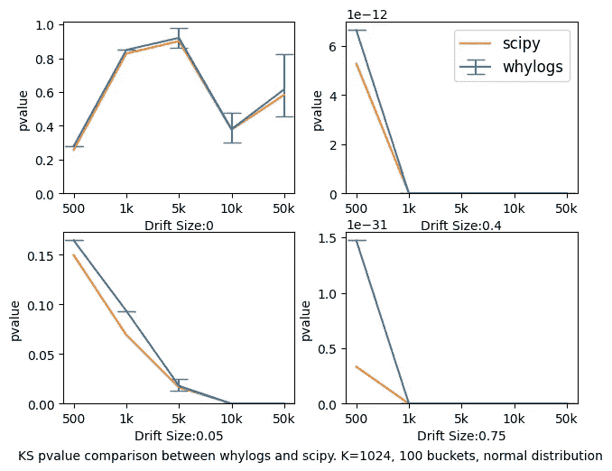
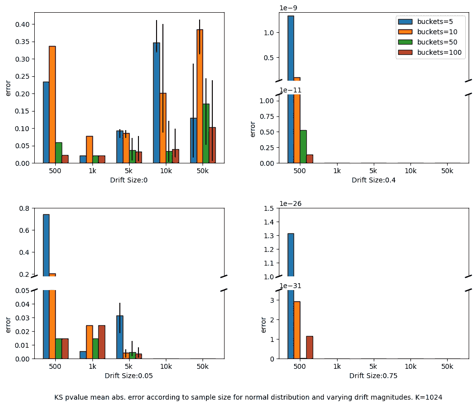
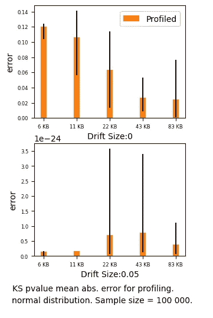

# 了解 Kolmogorov-Smirnov (KS)测试对分析数据的数据漂移

> 原文：<https://towardsdatascience.com/understanding-kolmogorov-smirnov-ks-tests-for-data-drift-on-profiled-data-5c8317796f78>

## 数据漂移符合数据剖析

作者图片

**TLDR:** 我们进行了统计测试，特别是 Kolmogorov-Smirnov (KS)测试，应用于完整数据集和数据集概要，并比较了结果。这些结果允许我们讨论 KS 漂移检测的数据分析的局限性以及 KS 算法在不同情况下的优缺点。我们还提供了[代码](https://github.com/whylabs/whylogs/blob/mainline/python/examples/benchmarks/KS_Profiling.ipynb)供您自己重现实验。

数据漂移是 ML 应用中众所周知的问题。如果不解决这个问题，它会大大降低你的模型，使你的模型完全不可用。解决这些问题的第一步是能够检测和监控数据漂移。

有多种方法可以监控生产中的数据漂移。通常使用统计测试来获得漂移检测值，并随着时间的推移对其进行监控。传统的漂移检测算法通常需要完整的原始数据来计算这些值，但对于大规模系统，由于存储或隐私问题，完全访问历史数据可能是不可行的。一种可能的替代方法是预先对数据进行采样，这也有缺点:通过聚合，您可能会丢失重要信息，如罕见事件和异常值，从而损害结果的可靠性。

第三种方法是在应用漂移检测算法之前分析数据。配置文件捕获数据的关键统计属性，例如分布度量、频繁项、缺失值等等。然后，我们可以使用这些统计特性来应用漂移检测技术的修改版本。当然，由于[没有免费的午餐](https://en.wikipedia.org/wiki/No_free_lunch_theorem)，这种策略也有其不利之处。profile 是对原始数据的估计，因此，使用它进行漂移检测将会生成实际漂移检测值的近似值，如果使用完整的数据，您将会得到该近似值。

但是，剖析过程如何与漂移检测算法一起工作，我们这样做会损失多少呢？

> 在这篇博文中，我们将把自己限制在数值单变量分布，并选择一个特定的算法来进行实验:Kolmogorov-Smirnov (KS)测试。我们还将深入了解 KS 测试本身对于不同场景的适用性。

以下是我们将在这篇博文中涉及的内容:

*   什么是 KS 测试？
*   什么是数据分析？
*   试验设计
*   实验
    -实验#1 —数据量
    -实验#2 —桶数
    -实验#3 —轮廓尺寸

你可以检查这篇博文中使用的代码，甚至可以通过访问[实验的 Google Colab 笔记本](https://colab.research.google.com/github/whylabs/whylogs/blob/mainline/python/examples/benchmarks/KS_Profiling.ipynb)自己运行实验。

## 科尔莫戈罗夫-斯米尔诺夫试验

[KS 测试](https://en.wikipedia.org/wiki/Kolmogorov%E2%80%93Smirnov_test)是两个一维概率分布相等的测试。它可用于将一个样本与参考概率分布进行比较，或者比较两个样本。现在，我们对后者感兴趣。在比较两个样本时，我们试图回答以下问题:

"这两组样本来自同一概率分布的概率是多少？"

KS 检验是非参数的，这意味着我们不需要依赖数据来自给定分布族的假设。这很好，因为我们通常不知道现实世界中的底层分布。

**统计数据**

KS 统计可以表示为:

*D = supₓ|F₁(x) — F₂(x)|*

其中 F1 和 F2 分别是第一和第二样本的两个累积分布函数。

换句话说，KS 统计量是两个累积分布之间的最大绝对差**。**

下图显示了统计数据的一个示例，用黑色箭头表示。

双样本 KS 统计量。来源:维基百科[1]

**零假设**

本实验中使用的零假设是两个样本来自同一分布。例如，如果定义我们的统计模型的所有假设都为真(包括我们的测试假设)，小的 p 值将表明数据不太可能。换句话说，我们可以将 p 值解释为数据和定义我们的统计模型的基础假设之间的兼容性的度量，0 代表完全不兼容，1 代表完全兼容*[2]。

为了计算这个值，KS 统计量和两种分布的样本量都被考虑在内。拒绝零假设的典型阈值是 1%和 5%，这意味着任何小于或等于这些值的 p 值都会导致零假设被拒绝。

(*)作者的勘误表——*零假设*部分的原文是:“*例如，p 值 0.05 意味着两个样本有 5%的概率来自同一分布。*“这是一种误解，并不代表 P 值的正确定义，如论文*统计测试、P 值、置信区间和功效:误解指南*【2】所述。

## 数据剖析

分析数据集意味着收集数据的统计测量值。这使我们能够以可伸缩、轻量级和灵活的方式生成数据的统计指纹或摘要。罕见的事件和离群值相关的指标可以被准确地捕获。

为了分析我们的数据，我们将使用开源数据日志库 **whylogs。**使用 whylogs 进行分析是以流的方式完成的，需要一次通过数据，并允许并行化。配置文件也是可合并的，允许您跨多个计算实例、时间段或地理位置检查您的数据。这是由 Apache DataSketches 首创的一种叫做**草图**的技术实现的。

确切地说，对于这个例子，我们将利用概要文件的分布指标。为了计算 KS 统计量，我们需要生成样本累积分布函数的近似值。这是由 Apache DataSketches 首创的一种叫做数据草图的技术实现的。

## 试验设计

首先，我们需要数据。在本实验中，我们将从以下分布中抽取两个大小相同的样本:

*   **正常**:宽类数据。没有弯曲，在中心周围达到顶点
*   **Pareto** :带有长尾/异常值的偏斜数据
*   **均匀**:在其域内均匀采样

> 在这篇博文中，我们将只展示正态分布的结果，但是你可以直接在示例笔记本[这里](https://github.com/whylabs/whylogs/blob/mainline/python/examples/benchmarks/KS_Profiling.ipynb)中找到帕累托分布和均匀分布的相同实验。从正态分布情况得出的总体结论也可以应用于其余的分布。

**漂移注入**

接下来，我们将漂移注入到一个样本中(我们称之为**目标**分布),以将其与未改变的**参考**分布进行比较。

我们将通过简单地根据一个参数移动数据的平均值来人为地引入漂移。我们选择使用分布的四分位间距的比率。下面是正态分布情况下的情况:

作者图片

这个想法是有四个不同的场景:无漂移、小漂移、中等漂移和大漂移。漂移的幅度分类和理想的检测/报警过程可能非常主观，取决于您特定应用所需的灵敏度。在这种情况下，我们假设小漂移情况足够小，可以安全地忽略。我们还预计，中等漂移和大漂移情况应会导致漂移警报，因为这两种情况都需要进一步检查。

**应用 KS 测试**

作为基本事实，我们将使用 **scipy 的**实现双样本 KS 测试，其中包含来自两个样本的完整数据。然后，我们将这些结果与测试的概要版本进行比较。为此，我们将使用 **whylogs 的**近似实现相同的测试，该测试仅使用每个样本的统计特征。

配置文件中包含的分布度量是从一个称为草图绘制的过程中获得的，这为它们提供了许多有用的属性，但也给结果增加了一些误差。因此，每次生成配置文件时，KS 测试结果都可能不同。对于每个场景，我们将对数据进行 10 次分析，并将基本事实与统计数据进行比较，例如这些运行的平均值、最大值和最小值。

**实验变量**

我们的主要目标是回答:

“whylogs 的 KS 实现与 scipy 的实现相比如何？"

然而，这个答案取决于几个不同的变量。我们将运行三个独立的实验来更好地理解每个变量的影响:数据量、存储桶数量和概要文件大小。第一个与每个样本中数据点的数量有关，而最后两个与 whylogs 内部可调参数有关。

## 实验#1 —数据量

样本中数据点的数量不仅影响总体 KS 测试，还影响剖析过程本身。因此，调查它如何影响结果是合理的。

我们比较了不同样本量(目标和参考分布)的两种实现的 p 值: **500、1k、5k、10k 和 50k。**

作者图片

你会注意到我们没有误差线来表示地面实况。对于给定的样本大小和漂移幅度，scipy 的结果是确定的，因为我们总是使用完整的数据，而对于 whylogs，误差线代表 10 次运行中找到的最大值和最小值。

请注意，对于中等和大漂移情况，两个 y 轴都非常接近 0，因此，即使样本大小为 500，两种实现方式都会导致 p 值实际上为 0，这表明我们的数据与零假设高度不相容。对于无漂移和小漂移场景，我们可以看到，当比较基于草图的实现的平均 p 值时，两种实现产生了非常相似的结果，但对于特定运行，尤其是对于大尺寸样本，存在一些差异。然而，对于几乎所有的案例，基本事实都在剖析案例的范围之间。同样值得注意的是，在 95%的置信区间，两种实现对于所有场景中的所有点都会产生相同的结论。

KS 检验真的很敏感，它的灵敏度随着样本量的增加而增加:在小漂移的情况下，对于大于或等于 5k 的样本量，我们拒绝零假设。尽管这在技术上没有错，但我们最初认为这种情况非常小，可以安全地忽略。

在这一点上，我们应该问问自己，这个测试实际上是否告诉了我们所关心的事情。小于 0.05 的 p 值会导致拒绝零假设，但它并不能告诉我们任何关于效应大小的信息。换句话说，它告诉我们有差别，但不是差别有多大。可能有统计学意义，但没有实际的实际意义。

## 实验 2——桶的数量

为了获得离散的累积分布，我们首先需要定义桶的数量。基于草图的 KS 测试将使用这些桶来计算统计数据。我们将使用大小为: **5、10、50 和 100 的等距箱柜进行实验。**对于 10 次运行中的每一次，我们将计算精确的和基于草图的 whylogs 实施之间的绝对误差，并绘制平均值，以及表示发现的最小和最大误差的误差条。我们将根据样本大小和漂移幅度显示这些误差，就像之前的实验一样。

whylogs 的当前版本将 100 作为默认的存储桶数，这也是前面显示的结果中使用的值。

作者图片

因为图中的一些值比其余的值高得多，所以我们在某些情况下断开了 y 轴，以便更好地显示图中的所有条形。即便如此，一些酒吧仍然太小，看不见。中等漂移和大漂移情况下的误差非常接近于 0，这意味着两种实现方式获得了相似的结果。

总的来说，当增加桶的数量时，误差的平均值似乎减小了。然而，对于更大的样本量，误差的方差增加，这是由于在剖析过程中估计误差的增加。

到目前为止，对于两种实现方式，实验显示了无漂移情况下的一定程度的随机性。由于 KS 测试仅依赖于分布之间的最大绝对差值，因此采样过程中的任何微小变化都会影响无漂移情况。

## 实验#3 —外形尺寸

如前所述，在剖面图中，我们有一个数据草图格式的近似分布。数据草图由参数 **K、**配置，该参数规定了轮廓的尺寸及其估计误差【3】。该参数越高，估计误差越低。之前的所有实验都是在 K=1024，的情况下进行的，但现在我们想看看随着 K 值的变化，误差会受到怎样的影响。

这一次，我们将样本大小固定为 100k，桶的数量固定为 100，并将 **K** 参数更改为以下值: **256、512、1024、2048 和 4096。**

作者图片

我们省略了漂移大小为 0.4 和 0.75 的图表，因为误差始终很小，不需要可视化。

X 轴是根据序列化时概要文件的大小显示的: **K** 值 256、512、1024、2048 和 4096 分别产生大约 6KB、11KB、22KB、43KB 和 83KB 的概要文件大小。

如前所述，任何漂移的场景都显示了 KS 测试是多么的敏感。中等和大漂移情况下看不到条形，因为它们的值实际上为 0，但在无漂移情况下，我们可以看到误差与剖面尺寸成反比，并延伸到 K 参数。通过增加 K，由于剖析引起的误差减少，接近两种实现的结果。

我们还可以验证，对于这种情况，误差非常小。但是如果我们对最小化这些错误感兴趣，我们可以牺牲轮廓空间来获得更好的结果。

## 结论

让我们总结一下这些实验的一些要点:

*   对数据配置文件执行 KS 测试是可能的，并且结果非常接近标准实现。然而，结果是不确定的。
*   KS 测试非常敏感，随着样本量的增加，它会变得更加敏感。当只在零假设下进行测试时，它可能会告诉我们一些关于分布之间的差异，但对差异的大小不敏感。
*   我们可以调整内部参数以获得更好的 whylogs 实现结果。特别是，我们可以增加剖面大小，以获得更接近地面真相的结果。

我们希望这有助于建立对 KS 测试如何与数据剖析一起工作的直觉。我们也对 KS 测试的局限性有了更好的理解。受此激励，我们 whylogs 已经在实施额外的相似性度量！例如，Hellinger distance 已经在 whylogs 中实现了，所以请继续关注更多的实验和基准测试！

感谢您的阅读，如果您有任何问题/建议，请随时联系我们！如果你对探索项目中的 whylogs 感兴趣，考虑加入我们的 [Slack 社区](https://communityinviter.com/apps/whylabs-community/rsqrd-ai-community)来获得支持并分享反馈！

# 参考

[1]—Kolmogorov–Smirnov 检验。(2022 年 10 月 29 日)。在*维基百科*里。[https://en . Wikipedia . org/wiki/Kolmogorov % E2 % 80% 93s mirnov _ test](https://en.wikipedia.org/wiki/Kolmogorov%E2%80%93Smirnov_test)

[2] —格陵兰，s .，森，S.J .，罗斯曼，K.J. *等*统计检验， *P* 值，置信区间和功效:误解指南。*欧洲流行病学杂志* **31** ，337–350(2016)。

[3] —卡宁，z .，朗，k .，&利伯蒂，E. (2016)。流中的最佳分位数逼近。 *arXiv* 。[https://doi.org/10.48550/arXiv.1603.05346](https://doi.org/10.48550/arXiv.1603.05346)