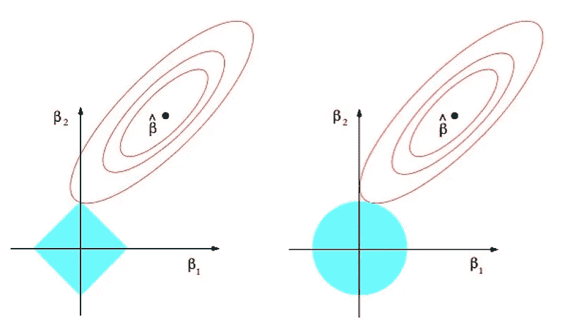
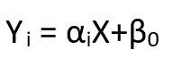
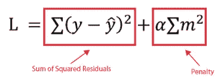

# 理解 l1 和 l2 正则化

> 原文：<https://towardsdatascience.com/understanding-l1-and-l2-regularization-93918a5ac8d0>

## 线性回归模型中的正则化综述。

l1 和 l2 用图形表示。来源:https://commons.wikimedia.org/wiki/File:Regularization.jpg

当训练机器学习模型时，我们的模型可能在训练集上表现准确，但在测试数据上表现不佳。

在这种情况下，我们有一个过度拟合的问题；事实上，当我们的机器学习模型试图覆盖所有数据点(或更多)**，而不是给定数据集**中存在的所需数据点时，就会发生**过度拟合** **。因此，模型开始缓存数据集中存在的噪音和不准确的值，所有这些因素都会降低模型的效率和准确性。**

当过度拟合发生时，有很多方法可以避免过度拟合；在线性回归的情况下，避免过度拟合的一种方法是使用通常称为 l1 和 l2 的两种正则化方法之一，我们将在本文中了解它们。

# 1.一些回归概念

让我们从了解回归的基础开始。正如维基百科所说:

> 回归分析是一组统计过程，用于估计因变量(通常称为“结果”或“响应”变量)与一个或多个自变量(通常称为“预测值”、“协变量”、“解释变量”或“特征”)之间的关系。

线性回归公式为:

线性回归公式。图片作者。

其中“Yi”是因变量(也称为“响应”)的(向量)，而“X”是自变量(也称为“特征”)的(向量)。α和β是系数**，回归的“游戏”全靠寻找“最佳参数”**。有了“最佳参数”,我们可以找到“最佳拟合”给定数据的“最佳直线”,这样我们就可以在给出未来输入(新特性值)时估计未来的结果值。

我想强调 X 和 Y 是向量的事实，因为在机器学习中，我们总是必须处理多个特征，所以在线性回归的情况下，我们不能在 X 和 Y 之间画一条线，就像我们在高中(或大学)只有“一个 X”(一个自变量)时可以做的那样。在这些情况下，所有的特征都以某种方式对结果有贡献，所以我们不能仅仅绘制一个图，因为这将是一个多变量的图(我们无论如何都可以这样做，但是非常复杂)。

当线性回归出现过拟合时，我们可以尝试正则化我们的线性模型；**正则化**是机器学习中惩罚复杂模型最常用的技术:它**通过惩罚具有高值的回归系数来避免过度拟合。**更具体地说，减少参数，缩小(简化)模型；其目的是试图减少模型的方差，而不显著增加偏差。

在实践中，在正则化模型(l1 和 l2)中，我们将所谓的“成本函数”(或“损失函数”)添加到我们的线性模型中，它是我们的模型在估计 X 和 y 之间的关系的能力方面“错误程度”的度量。成本函数的“类型”将 l1 与 l2 区分开来。

# 2.L1 正则化或套索正则化

Lasso(最小绝对和选择算子)回归执行 L1 正则化，它添加了一个等于系数幅度绝对值的**惩罚**，正如我们在上面蓝色矩形的图像中看到的(λ是正则化参数)。这种类型的正则化使用收缩，即数据值向中心点收缩，例如平均值。

这种类型的正则化可以产生系数很少的稀疏模型；事实上，有些系数可以变为零，可以从模型中消除。这意味着这种类型的模型也执行特征选择(因为一些系数可以变成 0，这意味着系数为 0 的特征被消除)，并且当我们具有“大量”特征时，它将被选择，因为它简化了模型。因此，当我们必须处理“大量”特性时，这个模型是很好的。

如果我们看看本文顶部的图像，惩罚因子的绝对值可以用图形表示为一个(旋转的)正方形，而椭圆轮廓是成本函数。如果成本函数(省略号)“命中”(旋转的)正方形的一个角，则对应于轴的系数被收缩为零，并且相关特征被消除。

套索回归的一个问题是**多重共线性**；我的意思是，如果有两个或更多高度相关的变量，那么 Lasso 回归随机选择其中一个，这对于我们模型的解释是不利的。为了避免这种情况，我建议您绘制一个相关矩阵，找到最终高度相关的特征并删除其中一个(例如，如果 feature_1 和 feature_2 高度相关，您可以决定删除 feature_2，因为**高度相关的变量对最终解决方案**具有相同的影响)。

# 2.L2 正则化或岭正则化

岭回归公式。来源:[https://open classrooms . com/en/courses/6401081-improve-the-performance-of-a machine-learning-model/6561486-improve-your-regulatory](https://openclassrooms.com/en/courses/6401081-improve-the-performance-of-a-machine-learning-model/6561486-improve-your-regression-with-regularization)(CC BY-SA 4.0)

**岭回归**是一种在线性自变量高度相关的场景**中估计多元回归模型系数的方法。**

该模型增加了一个成本函数，即系数幅度的平方值，事实上，如果我们观看本文的第一幅图像，成本函数的几何表示在这种情况下是一个圆形。

不幸的是，这个模型不执行特征选择:它降低了模型的复杂性，但没有减少自变量的数量，因为它不会导致系数为 0。这意味着最终的模型将包括所有的独立变量。为了避免这一问题，由于当要素高度相关时必须使用山脊线，因此在这里(比使用套索模型更重要)使用相关矩阵研究要素并决定从正在执行的研究中删除哪些要素非常重要。

# 结论

正如我们已经看到的，当我们的模型出现过度拟合的问题时，必须执行正则化。

关于线性回归模型，当我们有很多特征时，我们最好使用 Lasso 正则化，因为它执行均匀的特征选择；如果我们有高度相关的特征，我们最好使用岭模型。

最后，如果你对相关和回归的区别有疑问，可以在这里阅读我关于这个话题的澄清文章[。](/the-difference-between-correlation-and-regression-134a5b367f7c)

*需要 Python 和数据科学方面的内容来开始或促进您的职业生涯？下面是我的一些文章，可以帮到你:*

**Python:**

*   [Python 中的循环和语句:深入理解(附示例)](/loops-and-statements-in-python-a-deep-understanding-with-examples-2099fc6e37d7?source=your_stories_page-------------------------------------)
*   [Python 循环:如何在 Python 中迭代的完整指南](/python-loops-a-complete-guide-on-how-to-iterate-in-python-b29e0d12211d)
*   [学习 5 个 Python 库开始你的数据科学生涯](/5-python-libraries-to-learn-to-start-your-data-science-career-2cd24a223431)
*   [数据科学如何学习 Python](/how-to-study-python-for-data-science-888a1ad649ae)

**数据科学:**

*   [即使全职工作(或学习)也要如何学习数据科学](/how-to-study-data-science-even-if-you-work-or-study-full-time-b52ace31edac)
*   [如何处理数据科学中的缺失值](/how-to-deal-with-missing-values-in-data-science-9e5a56fbe928)
*   [如何在数据科学项目中执行特征选择](/how-to-perform-feature-selection-in-a-data-science-project-591ba96f86eb)
*   [如何检测数据科学项目中的异常值](/how-to-detect-outliers-in-a-data-science-project-17f39653fb17?source=your_stories_page-------------------------------------)
*   [执行图形残差分析的两种方法](/two-methods-for-performing-graphical-residuals-analysis-6899fd4c78e5)
*   [如何利用学习曲线轻松验证您的 ML 模型](https://medium.com/mlearning-ai/how-to-easily-validate-your-ml-models-with-learning-curves-21cc01636083)
*   [柱状图和柱状图有什么区别？](/what-is-the-difference-between-a-barplot-and-a-histogram-e62d0e532e7d)
*   [相关和回归的区别](/the-difference-between-correlation-and-regression-134a5b367f7c?source=your_stories_page-------------------------------------)
*   [了解 l1 和 l2 正规化](/understanding-l1-and-l2-regularization-93918a5ac8d0?source=your_stories_page-------------------------------------)
*   [逻辑回归:我们来搞清楚！](https://medium.com/mlearning-ai/logistic-regression-lets-clear-it-up-8bf20e9b328a?source=your_stories_page-------------------------------------)
*   [什么是训练有素的模特？](/what-is-a-trained-model-5c872cfa8448?source=your_stories_page-------------------------------------)

考虑成为会员:你可以免费支持我和其他像我一样的作家。点击 [***这里***](https://federicotrotta.medium.com/membership)**成为会员。**