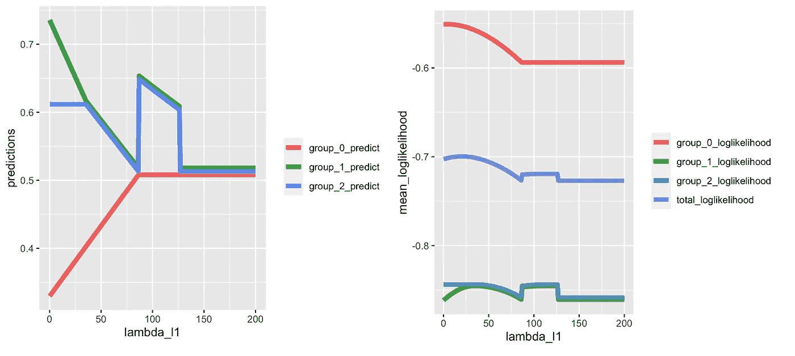
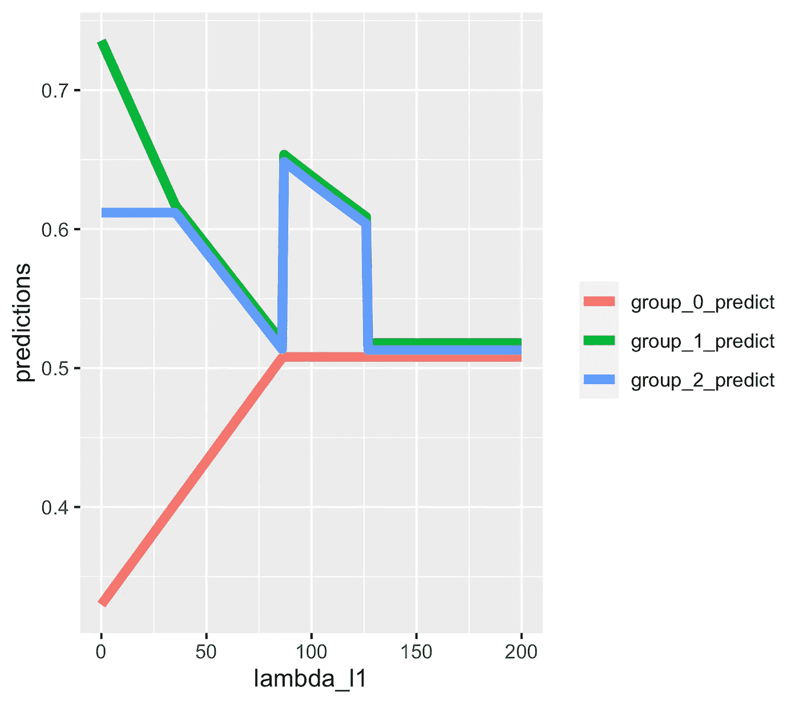
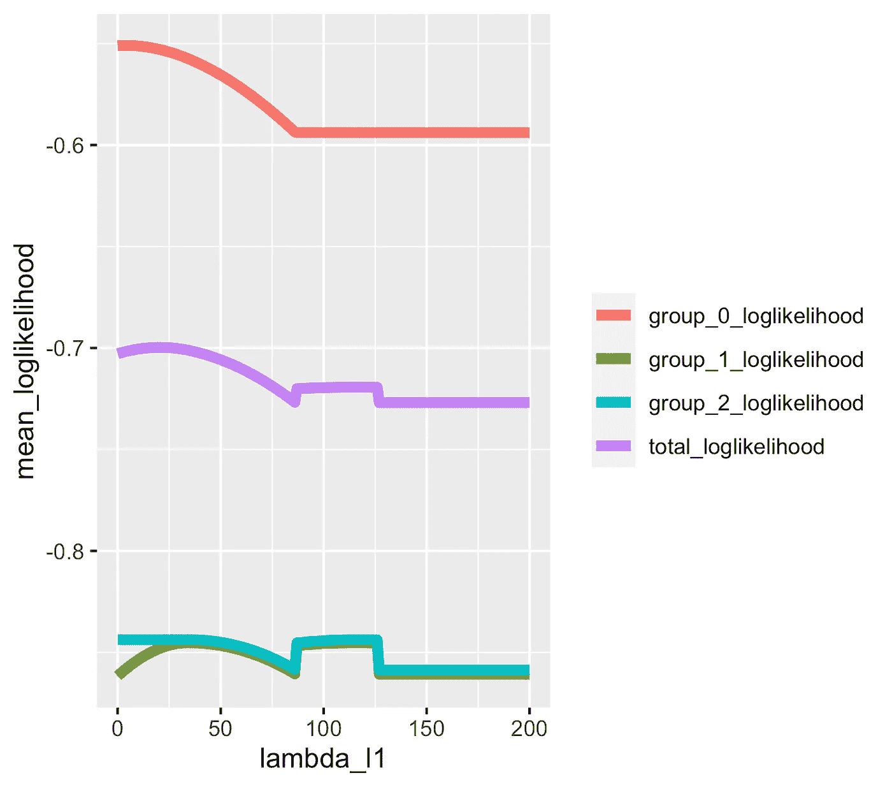
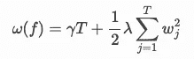

# 理解梯度增强决策树中的 L1 正则化

> 原文：<https://towardsdatascience.com/understanding-l1-regularisation-in-gradient-boosted-decision-trees-af4f0ba9d32a>

## LightGBM 和 R 中的一个例子



(图片由作者提供)

我发现超参数调整通常是建模中最有趣的部分之一。老实说，模型本身的算法已经被其他人编写好了，所以调整和设置阶段是我们大多数人有所作为的时候。尽管如此，我认为对算法的工作原理有一个透彻的了解是很重要的。

当谈到梯度增强模型时，我发现超参数有不同的类别:

*   像最大深度这样简单的问题——这些问题通常不会让人感到意外。
*   像黑森最小和这样复杂的问题——我认为建模者通常拥有的直觉是正确的，即使细节有些模糊。
*   然后还有像 L1 或 L2 正规化这样的参数，我发现这里有很多混乱和误解，几乎没有人费心去深入挖掘并找出它们真正是如何工作的。

> 如果你碰到一个超参数，你不确定它的最优值会是 0.0001 还是 10000，我觉得你应该退一步理解算法，而不是粗暴地强迫所有可能的组合。

我最近对 L1 的正规化进行了分析，因为我对一些发现感到非常惊讶，所以我决定写一份我从未有过的指南。希望你会觉得有用！

# 行动计划

## 对于忙碌/不耐烦的读者

如果你不想看完整本书，在文章的最后有一个总结部分，你会在其中找到一个叫做解决方案的子部分。所有重要的结果都在代码片段中。

## 该项目

我们将用 [LightGBM](https://lightgbm.readthedocs.io/en/v3.3.2/) 和 r 中的合成数据来演示一个例子。我的目标是使这个例子可复制。这篇文章将包括一些代码片段，我在这个项目中使用的所有其他代码都可以在我的 [GitHub repo](https://github.com/MatePocs/quick_projects/blob/main/lightgbm_l1l2_regularisation.R) 中找到。

> 我将采取我通常的方法:运行一些模型，看看会发生什么，然后不要停止，直到我完全理解所有的数字是如何得出的。

我们将详细了解:

*   叶子分数和分割增益的计算，
*   不同的`lambda_l1`值对模型拟合和预测的影响，
*   单棵树内发生了什么，
*   测试分数如何随着`lambda_l1`变化，以及我们是否设法在模型性能上得到任何改进。

## 关于命名

为了避免混淆，**我将一致地使用** `lambda_l1` **表达式**作为 L1 正则化参数。我承认 XGBoost 和 LightGBM 都使用了`lambda_l1` = `reg_alpha`和`lambda_l2` = `reg_lambda`，但是，最好还是安全一点！

## 为什么是泊松？

分析泊松回归是我经常性的“爱好”,原因如下:

*   我在保险行业工作，传统的广泛使用的方法是用泊松分布来模拟索赔频率。
*   我只是觉得它更令人兴奋——大多数回归例子都是关于经典的残差平方极小化。(在某种程度上，这就是 LightGBM 参数设置中所谓的“回归”。)
*   这更容易证明我的主要观点:你必须理解算法是如何工作的。人们不能简单地将参数从一个问题复制到另一个问题，即使是在同一个模型和包中，因为超参数可能根据目标的不同而完全不同地工作。

## 假定的知识

这篇文章是关于梯度增强树的 L1 正则化，我假设读者对这两个原理都很熟悉。

我有一些关于这两个主题的早期作品，如果你想仔细阅读的话:

*   [L1 和 L2 线性回归的规范化](/hyperparameter-tuning-in-lasso-and-ridge-regressions-70a4b158ae6d)
*   [一般情况下的梯度增强](/this-weeks-unboxing-gradient-boosted-models-black-box-138c3a0c6d80)
*   [min _ sum _ hessian in details](/understanding-min-child-weight-in-gradient-boosting-decision-trees-293f2381306)

# 数据

我们将生成一个非常简单的数据集——不用说，在现实生活中，你永远不会对这样的数据使用如此复杂的方法，但它非常适合演示我的观点。数据有一个(！)列，一个分类特征，在代码中称为`var1`，有三个可能的值:0、1 和 2。我们为每个组分配一个泊松λ，并基于这些λ参数生成随机变量。

最终，我们会有 1000 次观察。这对于出现可见的随机偏差来说足够小了。例如，组 1 和组 2 应该是相似的，然而它们的实际值的平均值是`0.73`和`0.61`:

```
var1 lambda number mean_target sum_target
   0    0.3    484   0.3347107        162
   1    0.7    297   0.7306397        217
   2    0.7    219   0.6118721        134
```

如果你想复制结果，我建议手动构建表格，因为你将在[我的脚本](https://github.com/MatePocs/quick_projects/blob/main/lightgbm_l1l2_regularisation.R)中找到的随机种子将在不同的设置中以不同的方式工作。下一个表是复制数据所需的全部内容，N 是具有相应变量 1 和目标的观察值的数量，它们加起来应该是 1，000:

```
#     var1 target   N
# 1:     0      0 349
# 2:     0      1 113
# 3:     0      2  18
# 4:     0      3   3
# 5:     0      4   1
# 6:     1      0 150
# 7:     1      1  93
# 8:     1      2  39
# 9:     1      3  14
# 10:    1      4   1
# 11:    2      0 121
# 12:    2      1  69
# 13:    2      2  22
# 14:    2      3   7
```

# 巨大的期望

现在，我们将对该数据运行一个梯度增强模型，使用各种级别的`lambda_l1`，没有来自超参数的其他限制。

我们可以相当有把握地猜测，无限制(即`lambda_l1 = 0`运行)将简单地预测每组中的`mean_target`。(因为泊松λ的最大似然估计是样本的平均值。)积极`lambda_l1`的影响更难预测。

> 我希望通过引入`lambda_l1`正则化，让模型预测更接近理论。具体来说，我希望第 1 组和第 2 组“一起工作”，并意识到他们毕竟没有什么不同。

让我们看看结果如何！

# 系统模型化

我遍历了 0 到 200 之间的整数`lambda_l1`值，并收集了模型对第 0、1 和 2 组的预测值。

## 密码

如果您想运行代码，这里是脚本的相应部分。假设有一个`data_curr`表，上面列出了 1000 个观察值。我们还需要`data.table`和`lightgbm`包。

## (英)可视化(= visualization)

结果存储在适当命名的`result_dt`表中。它包含每个`lambda_l1`组的预测。那么，我们准备好展示这些结果的图表了吗？鼓声…



lambda_l1 值对预测的影响(图片由作者提供)

X 轴显示不同的`lambda_l1`值，因此线条代表随着正则化参数的增加预测的变化。我把线移动了一点，这样我们可以更好地看到它们何时一起移动。最后，所有 3 个组将共享同一个预测:总平均值。

## 结果分析

让我们收集一下目前已知的信息:

*   第 2 组预测暂时不变，只在`lambda_l1` = 30 左右开始变化，
*   第 1 组预测逐渐减少到第 2 组的预测，同时第 0 组预测增加，
*   这三组在一个点上相遇，但是接下来会有奇怪的上下跳跃，
*   最后，三个小组再次相遇，再也不会偏离共同的目标。

> 不知道你怎么样，我觉得剧情很惊喜！

如果你想知道:`lambda_l1`0 到 1 之间的值实际上并没有实现任何可测量的东西。

# 测试结果

现在，让我们做一个快速测试:正则化实际上对模型性能做了什么吗？我们知道它确实改变了预测，但是这些改变是在正确的方向上吗？

我的测试方法如下:我生成了一个巨大的表，使用相同的泊松 lambdas 作为我们的训练数据，并在这个表上运行预测。这个想法是，大表将代表“真正的”分布——我不想让随机性在这一点上发挥作用。模型性能用平均泊松对数似然来衡量。

事不宜迟，我们来看看剧情:



非常令人惊讶的是，这种规范化似乎确实提高了一点性能。在`lambda_l1` = 20 时，总平均对数似然从`-0.7028107`上升到`-0.6996772`。不是很大的收获，但我们会接受的。

> 我们证实，在某些情况下，lambda_l1 正则化可以提高模型性能。

既然我们知道这个项目不是毫无意义的，那么是时候进行一次真正的深度潜水，调查每棵树、树枝和树叶了。

下一点会有点干…我已经警告过你了！

# 深潜

## 证明文件

对于那些想要理解梯度推进树背后的数学原理的人，我通常的建议是(曾经)去查阅 [XGBoost 文档](https://xgboost.readthedocs.io/en/stable/tutorials/model.html)。

> 然而，现在有一个小问题。

看看他们引入模型复杂性(也称为正则化)时出现的公式:



上式中引入的两个正则项是γ和λ。问题是:它们都不是 L1 正则化术语！应该有一个因子，一个`lambda_l1`，惩罚单个叶片得分的绝对值(公式中的 *wj* )。γ惩罚了叶子本身的数量(公式中的 *T* ，我不知道该怎么称呼这种类型的正则化…也许是 L0 正则化？有趣的是，如果我们看一下 [XGBoost 参数](https://xgboost.readthedocs.io/en/stable/parameter.html)，没有那个奇怪的γ参数的迹象。

> 如果你知道这是怎么回事，一定要让我知道。

因此，文档中的公式没有一个能立即适用于我们的问题…

## 树形地图

接下来我开始分析单独的树木地图。如果您不知道，您可以使用下面的命令将模型中所有单棵树的细节转换成漂亮的`data.table`:

```
lgb.model.dt.tree(my_model)
```

其中`my_model`是 LightGBM 助推器。

这些是非正则化(`lambda_l1` = 0)模型中最重要的列:

```
 depth split_gain threshold internal_value leaf_value leaf_count
1:     0  28.861738         0     -0.6674794         NA         NA
2:     1         NA      <NA>             NA -0.7537717        484
3:     1   1.721168         1     -0.5865387         NA         NA
4:     2         NA      <NA>             NA -0.5621415        297
5:     2         NA      <NA>             NA -0.6196252        219
```

在接下来的几节中，我们将看到它们是如何被导出的！

# 非正则树的叶分数

我不打算花太多时间来描述泊松叶是如何工作的(同样，请参见我以前关于这个主题的帖子[此处](/this-weeks-unboxing-gradient-boosted-models-black-box-138c3a0c6d80?source=user_profile---------3----------------------------)和[此处](/understanding-min-child-weight-in-gradient-boosting-decision-trees-293f2381306))，但是作为一个例子，上面树中第 0 组的第一次分裂`-0.7537717`计算如下:

```
gradient <- 484 * 0.513 - 162
hessian <- 484 * 0.513 * exp(0.7)
(-gradient / hessian) * 0.5 + (-0.6674794)
```

在哪里

*   `484`:对那片叶子的观察次数
*   `0.513`:当前预测(起始预测是泊松的整体平均值)
*   `162`:第 0 组实际目标值
*   那只是一件泊松的事情，再一次，看我关于这个主题的早期作品…
*   `0.5`:学习率
*   `-0.6674794`:当前预测的对数，log( `0.513`)，这是一个管理步骤，因此第一棵树中的叶分数也将包括总体平均目标

记住泊松回归的对数函数！在第一个树之后，组 0 的预测将从开始的 exp( `-0.6674794`)变为 exp( `-0.7537717`)。如果我们在一棵树后停止训练，那就是模型预测。

所以我们知道在非正则版本中会发生什么，现在让我们试试正则版本！

# 正则化树的叶分数

## 起始示例

我随机挑选了`lambda_l1` = 15 作为另一棵树进行调查。让我们看看模型中的第一棵树！

```
 depth split_gain threshold internal_value leaf_value leaf_count
1:     0   19.69985         0     -0.6674794         NA         NA
2:     1         NA      <NA>             NA -0.7387716        484
3:     1         NA      <NA>             NA -0.6006085        516
```

> 第一印象:现在只有一个分裂，第 1 组和第 2 组没有分开，不像在非正规版本中！

我基本上是从我在 [XGBoost 文档](https://xgboost.readthedocs.io/en/stable/tutorials/model.html)的结构分数部分找到的最佳叶分数的公式开始的(为了避免混淆，我没有在这里复制它)，并使用了一些试错法，其方式似乎符合叶分数绝对值的逻辑。

在叶计算中，我们必须在梯度和中减去或加上λ参数。如果梯度和为正，我们必须减去`lambda_l1`，如果梯度和为负，我们加上`lambda_l1`。嗯，我们把它加到梯度上，但是我们取和的负值…用数字来解释更简单，我给你演示一下！

例如，`-0.7387716`在上面的树中被计算为:

```
gradient_l <- (484 * 0.513) - 162
hessian_l <-  (484 * 0.513) * exp(0.7)
(-(gradient_l - 15) / hessian_l) * 0.5  + log(0.513)
```

而另一个分支，`-0.6006085`计算为:

```
gradient_r <- (516 * 0.513) - 351
hessian_r <-  (516 * 0.513) * exp(0.7)
(-(gradient_r + 15) / hessian_r) * 0.5 + log(0.513)
```

所以它几乎和非正则化树的公式一样，不同的是加上或减去 15。

## 并发症

> 在这一点上，你可能会有一个困扰的问题:如果 lambda_l1 大于当前梯度和的绝对值，会发生什么？

在我们的示例中，如果某个分割中的梯度之和小于 15，会发生什么情况？我们会交换标志吗？好吧，如果我们看看模型中的第三棵树，`tree_index` = 2，我们可以看到:

```
 depth split_gain threshold internal_value  leaf_value leaf_count
1:     0  6.4673676         0     0.00000000          NA         NA
2:     1         NA      <NA>             NA -0.04681926        484
3:     1  0.2443614         1     0.03309579          NA         NA
4:     2         NA      <NA>             NA  0.04561548        297
5:     2         NA      <NA>             NA  0.00000000        219
```

因此在两棵树(索引 0 和 1)之后，模型将停止向组 2 分配额外的分数。在树 0 和 1 中，它为组 0 分配了一个预测，并为组合的组 1 和 2 分配了一个预测。然而，在树索引 2 中，它决定拆分组 1 和组 2，但实际上保持组 2 不变。

目前，我们不会关注它为什么突然决定拆分这两个组。让我们暂时接受模型分裂，并尝试理解为什么组 2 的新叶分数是 0。

实际上，这很简单。当我们到达树索引 2 时，组 2 的预测是`0.5745756`，这意味着它的梯度和将是:

```
219 * 0.5745756 - 134 = -8.167944
```

其绝对值低于我们的`lambda_l1`。让我们看看第一组在这一点上的梯度和:

```
297 * 0.5745756 - 217 = -46.35105
```

这就是为什么模型将新的叶子分数分配给组 1，而不是组 2。

总之，我们必须将 gradient — `lambda_l1`表达式限制在 0，以获得正确的叶子分数。

> 不要担心现在是否有些混乱，我们将在本文后面的精确代码函数中阐明这种关系。

# 分割收益

## 大局

在树中，我们还没有重新计算最后一个值:分割收益。这一列非常重要，例如，这是许多特征重要性分析的基础，在这些分析中，特征是按照它们的分裂所附带的增益来排序的。

我将再次链接 [XGBoost 文档](https://xgboost.readthedocs.io/en/stable/tutorials/model.html),因为那里的基本思想非常容易理解，但我没有复制公式，因为它缺少`lambda_l1`参数。在我们的例子中，目标包括两个项目:最大化对数似然，以及 L1 正则化形式的惩罚。

> 当树考虑拆分时，它基本上在目标函数中进行前后比较。

具体地，我们将我们将实现的左右分支/叶的增益与相同观察的未分裂增益进行比较。"这组观察值值得进一步拆分吗？"是模型所要求的。

## 一个例子

让我们再看一遍上面的例子(这是第一棵树，从`lambda_l1` = 15，我们已经重新计算了它的叶子):

```
 depth split_gain threshold internal_value leaf_value leaf_count
1:     0   19.69985         0     -0.6674794         NA         NA
2:     1         NA      <NA>             NA -0.7387716        484
3:     1         NA      <NA>             NA -0.6006085        516
```

再说一次，我没有详细说明我是如何得到这些公式的，以及我使用了哪些资源，下面几节有一些有用的提示。现在，让我向你展示一下上面的`19.69985`是如何计算的。

我们将需要左右分割的梯度和黑森，我们已经在`leaf_value`计算中使用了这些:

```
gradient_l <- (484 * 0.513) - 162
hessian_l <-  (484 * 0.513) * exp(0.7)
gradient_r <- (516 * 0.513) - 351
hessian_r <-  (516 * 0.513) * exp(0.7)
```

分割增益将由 3 项组成:

*   未分割的增益，
*   左侧增益，
*   正确的收益。

首先是**未分割增益**——这在我们的例子中非常简单，这是树中的第一个分割，如果我们不这样做，我们的增益正好是 0。

来自**左分离**的增益可计算如下:

```
(gradient_l - 15) ^ 2 / hessian_l = 10.16513
```

*   **右分**的增益:

```
(gradient_r + 15) ^ 2 / hessian_r = 9.53473
```

总分离增益计算如下:

```
10.16513 + 9.53473 - 0 = 19.69985
```

## 回到前面的问题

还记得我说过不要担心为什么模型突然决定在树索引 2 中拆分组 1 和组 2 吗？好吧，现在让我们担心一下！

让我们计算一下，与我们现在拥有的相比，这种拆分会带来什么样的收益！假设我们要分裂，新的梯度和黑森是:

```
gradient_l <- (297 * 0.513) - 217
hessian_l <-  (297 * 0.513) * exp(0.7)
gradient_r <- (219 * 0.513) - 134
hessian_r <-  (219 * 0.513) * exp(0.7)
```

现在，未分割的增益等于上面右侧分割的增益 9.53473。这是我们最初的收获。如果我们进一步分割会发生什么？

从左边的叶子，我们会得到:

```
(gradient_l + 15) ^ 2 / hessian_l = 8.030935
```

从右边的叶子看:

```
(gradient_r + 15) ^ 2 / hessian_r = 0.1956444
```

(注意`lambda_l1`的标志，这完全取决于梯度的标志！)

这三项的整体分割值为:

```
8.030935 + 0.1956444 - 9.53473 = - 1.308151
```

这是一个负数，所以我们不做分割。

> 再一次，这只是一个例子，不要担心它是否令人困惑，你会觉得你不能复制，你会在下面的代码片段中找到确切的公式。

## 收益与现实的分割

我看到很多人忽略了一个非常重要的注意事项:这里的收益并不代表基于树前后预测的客观值之间的差异。收益仅仅是衡量分裂点的好坏，而不是模型决定如何处理它们。

换句话说，作为预测基础的`leaf_values`,有一个分割增益没有考虑的关键因素。你能猜到吗？

是的，这是学习率。

> 学习率参数对 leaf_values 有影响，但对 split_gains 没有影响。

这意味着，根据来自树的实际预测，将一个意义附加到分割收益上是毫无意义的。如果我们有一个`learning_rate` = 1，这些就是被罚目标函数的估计收益。

# 一个有趣的经验笔记

根据我们目前所知，如果说模型不关心调整梯度和的绝对值低于`lambda_l1`的组的预测，这不公平吗？在`lambda_l1` = 15 的情况下，这些是实际值(来自单个泊松随机变量)和分组预测的总和:

```
 var1   actual  predicted
1:    0      162        177
2:    1      217        202
3:    2      134        134
```

第二组(上面第一张图的中间线)得到了准确的预测，其他两组相差 15%。

> 对我来说，这绝对是一个激动人心的时刻。

我认为它从一个不同的角度看待正则化的影响，而不是简单地接受目标函数会对单个叶子分数进行惩罚。

# 摘要

## 解决方案

让我们总结一下到目前为止我们所学的内容！

在代码格式中，这是计算新叶分数、叶收益和 L1 正则化拆分收益所需的全部内容:

## 解释

如上所述，我认为思考 L1 正则化实际上在做什么是非常有用的，而不是简单地根据改变的目标函数和对单个叶子分数的惩罚来观察它。

当你使用梯度增强树的 L1 正则化时，你基本上是在设置一个阈值，在这个阈值之下，模型将不会试图进一步优化。具体来说，如果观测值的梯度之和的绝对值低于该正则化参数，则模型不会进一步分割观测值。

在泊松回归的情况下，梯度是实际值和预测值之间的差值。在尝试 L1 参数时，这是一个很好的起点，可以为自己建立一个经验法则。

一般而言，该模型将更接近接近总体平均值的观察值。使用高 L1 参数将使预测更加接近。

## 结束语

这是我对梯度增强树的 L1 正则化的分析。一如既往，如果我错过了什么，一定要让我知道！

这是一个令人满意的项目，我希望你发现结果有用！

[](https://matepocs.medium.com/membership)  

# 来源

我通常认为 XGBoost 文档是一个非常好的起点，尽管它没有考虑 L1 规范:

[](https://xgboost.readthedocs.io/en/stable/tutorials/model.html)  

除此之外，我还使用了 LightGBM 包中的源代码。我认为值得看一看幕后发生了什么。这个脚本的`GetLeafGain`功能非常关键:

[https://github . com/Microsoft/light GBM/blob/346 f 88398282 c 5677 dcaa 880 e 147026 EAD ba 29 e 4/src/tree learner/feature _ histogram . HPP](https://github.com/microsoft/LightGBM/blob/346f88398282c5677dcaa880e147026eadba29e4/src/treelearner/feature_histogram.hpp)