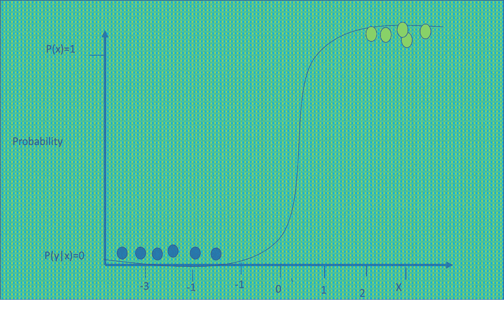
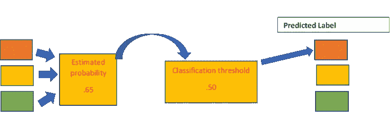
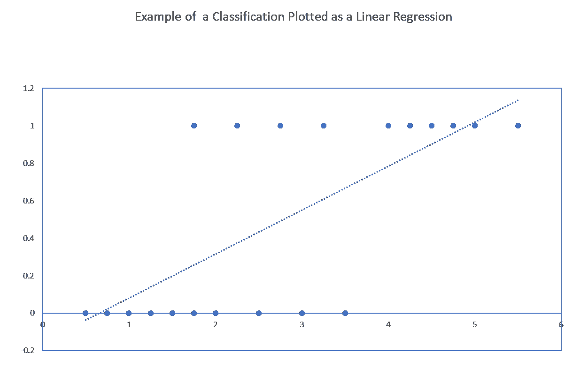
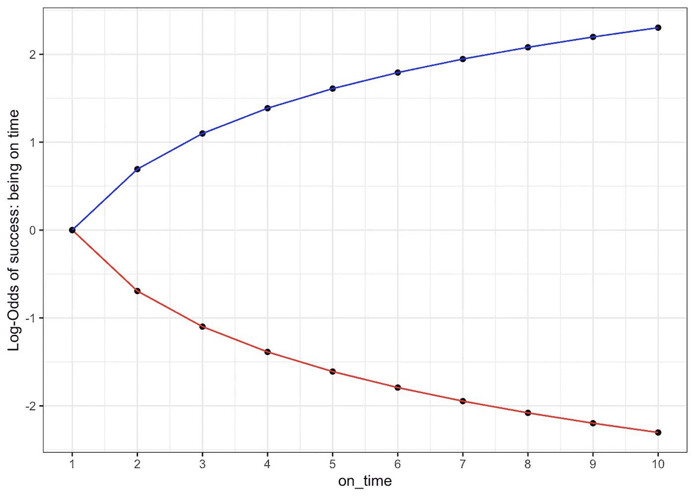
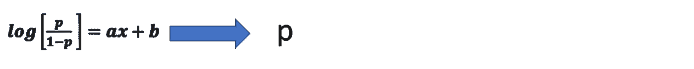
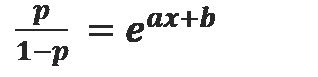
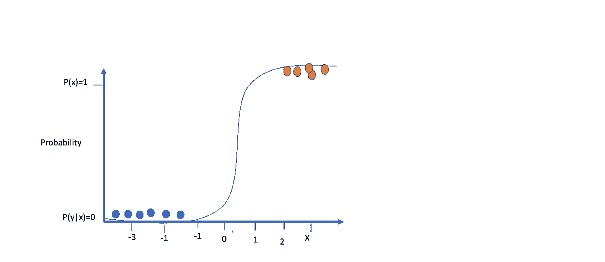

# 理解逻辑回归——优势比、Sigmoid、MLE 等

> 原文：<https://towardsdatascience.com/understanding-logistic-regression-the-odds-ratio-sigmoid-mle-et-al-740cebf349a3>

逻辑回归是分类中最常用的机器学习技术之一。然而，尽管看起来很简单，但理解正在发生的事情的实际机制——优势比、对数变换、sigmoid——以及为什么使用它们可能相当棘手。在这篇博客中，我将解释逻辑回归，大部分是直观的，但有时会用少量的数学。

我的收藏

这篇文章将关注逻辑回归的方法和原因。关于它在分类和分类评价中的用途，可以查看我的帖子[这里](https://shaileydash.medium.com/understanding-the-roc-and-auc-intuitively-31ca96445c02)。

我一直困惑的一点是，我们如何从所谓的比值比到实际的概率，因为这是我们通常估计的。所以，这是一个关于逻辑回归方程的推导的简短帖子，为什么它被转换成臭名昭著的“比值比”,它是如何被转换回来的，以及它是如何被估计的。

那么，让我们开始吧..

## 何时使用

假设我们要根据验血结果把病人分成两组，身体质量指数，BP。这些类别是:糖尿病和非糖尿病。这是一个典型的分类问题。我们有一个二元因变量，即:

糖尿病患者= 1

如果不是糖尿病患者，则= 0

我们估计的等式是:

其中，如果是糖尿病患者，y = 1；如果是非糖尿病患者，y = 0。x 变量代表各种输入特征，如考试分数、身体质量指数等。目前我们只有一个 x，比如说，测试分数。

***这是什么挑战？***

这是一个典型的线性回归问题，我们可以通过最小化误差平方和来估计它。然而，与回归不同的是，我们预测一个数字，如销售额。这里我们试图预测一个被值 1 或 0 限制的类别。如果我们得到一个接近 1 的值，比如说 83，我们可以把它四舍五入到 1，类似地，0.33 可以归类为 0。因此，这个等式有效地预测了属于类别 1 或 0 的特定实例的概率。通常，一些外部定义的临界值，如 0.5 或 0.75，将用于定义预测得分。逻辑回归分类过程可以在图像中可视化。在这篇[文章](https://shaileydash.medium.com/understanding-the-roc-and-auc-intuitively-31ca96445c02)中阅读更多关于分类阈值的信息。

分类过程(图片来源:我的收藏)

但是，这其中的一个关键问题是线性回归是无界的。这意味着，例如，对于某些独立变量值，预测的 y 值可能大于 1，甚至为负。这在分类问题上显然没有意义。

让我们从[维基百科](https://en.wikipedia.org/wiki/Logistic_regression)中取一个简单的例子。我们有学生的及格-不及格数据与学习时数的关系图。通过-失败是一个二元变量，可以取值 1 或 0。学习时间是数字。我们可以把它绘制成一个带有预测线的标准图。我们在 x 轴上绘制了学习小时数，在 y 轴上绘制了给定学习小时数时通过或失败的概率(p(y|x))。

对分类数据绘制线性回归图(图片来源:我的收藏)

我们观察如下:根据预测线，如果小时数超过 5，我们的预测值超过 1。类似地，如果学习的小时数少于半小时，预测的 y，在这种情况下是 p(y=1)，变成负数。

这些结果显然没有意义，我们需要一种方法来估计一个上界为 1，下界为 0 的方程，而不考虑 x 的值。

**逻辑回归的案例**

这就带来了逻辑回归。逻辑回归听起来非常类似于线性回归。它本质上是将线性回归转换成一个方程，使其极限值为 0 和 1。我们仍然希望使用线性回归来解决这个问题，但是我们需要确保函数保持在其极限内。我们希望估计的是下面的线性方程。

P(y=1)=ax + b

线性方程有两个问题:

1.  如上所述，它是无界的
2.  在许多情况下，我们看到，当 p 已经很大(或很小)时，与 p 接近 1/2 时相比，改变 p 相同的量需要 x 有更大的变化。这是一种非线性关系，线性模型无法做到这一点。

解决这个问题的方法是通过逻辑转换。通常代数只会增加混乱而不是清晰。但在这种情况下，一点点代数帮助我们看到逻辑回归方程的实际含义，它不是凭空想象出来的。

逻辑方程式如下。显然这需要解释…

其中 P(y=1)= a + bx

开始解释吧。

**推导逻辑回归方程**

作为第一步，我们需要变换 p(y=1 ),使它的极限不能是负数或无穷大。接下来，为了简单起见，我们将 p(y=1)表示为 p。线性方程的转换通过取比值比来完成。

你现在会呻吟着问，‘赔率是多少？’。

> 几率是某件事情发生与某件事情没有发生的比率(即 3/2 = 1.5)。
> 
> 概率是某件事情发生的比率，是所有可能发生的事情的比率(3/5 = 0.6)。

(扎布洛茨基，2022 年)

所以如果一个事件发生的概率是. 6，那么比值比就是. 6/.4 =1.5。它告诉我们一个事件发生与不发生的几率。优势比定义为:

现在，这个比率的下限为 0。在上端，它是未定义的(当 p=1 时，在分母中被零除)。比值比可以取 0 到 0 之间的任何值，并且在上限是无界的。该比率的值为中间的 **1** ，表示发生和不发生的概率**T3 为. 5。小范围的赔率，从 0 到 1 **，**失败的概率比成功的概率高。然后是无限的赔率范围，从 1 到无穷大，这表明成功的概率高于失败的概率。**

由于不平衡的范围，为了使比值比集中在 0 左右，我们需要对比值比进行对数转换。这有助于比值比的范围在 0 附近变得对称，即从-无穷大到+无穷大。如下图所示。

对数赔率转换([图像源](https://en.wikipedia.org/wiki/Logistic_regression))

几率对数的这种转换也称为 Logit 函数，是逻辑回归的基础。通过这种变换获得的对称性提高了对数几率的可解释性，负值表示失败的几率，正值表示成功的几率更高。

请注意，函数的定义域仅从 0 延伸到 1，但实际上并未定义在 0 或 1。这是因为如果我们在 log odds 表达式中代入 *p=1* ，将导致除以零，产生一个未定义的值。类似地，当代入 p=0 时，将导致计算零的对数，这同样是未定义的(Zablotski，2022)。

我们假设观察值的对数概率 *y* 可以表示为输入变量 **x.** 的线性函数

**从赔率到概率**

现在，我们有了对数概率方程。我们相当清楚，这必须以某种方式进行估计。然而，你现在可能会问:“但因变量是对数概率，而我需要一个简单的概率 p。我如何在没有非常复杂的计算的情况下回溯呢！”

从 log odds 到 p(图片来源:我的收藏)

别担心。这就是使用逻辑转换的原因。我们将看到，通过几个代数步骤，我们可以回到我们的好的旧的可理解的概率，p。

步骤 1 我们首先对两边取幂:

步骤 2 一些简单的代数操作(为代数有挑战的人提供详细的步骤)

LHS 的合并条款

最后，我们可以将分子和分母相除，得到:

这可以表示为我们熟悉的逻辑回归方程的函数形式，也称为 Sigmoid。

这个是我们的标准逻辑回归方程，它将一个线性回归转换为根据各种因变量得出正数的概率。

我们可以绘制逻辑回归方程，它给出一条 S 形曲线，中点为 0.5，极限值为概率 1 和 0。

逻辑回归图(图片来源:我的收藏)

在上面的图中，我画出了给定 x 的事件 y 的概率，这被称为 Sigmoid 函数。x 表示为标准化的。如您所见，概率值在图表的下端以 0 为上限，在上端以 1 为上限。中点是 0.5 的概率。

**这个方程是怎么估计出来的？**

既然我们理解了曲线和 sigmoid(困难的部分)，我们可以简单地看一下如何估计逻辑模型。正如我们所看到的，逻辑斯谛模型是线性回归模型的非线性转换。线性模型通常通过最优化最小化误差平方和来拟合。然而，不可能通过标准的优化技术如正规方程来拟合逻辑回归，因此我们使用最大似然估计(MLE)。MLE 也是一种基于数据的方法。它试图解决这个问题:给定我们所拥有的数据，什么样的模型参数最大化了观察我们所观察到的数据的可能性。

一个简单的例子来说明基本思想:

假设我们有一个盒子，里面有蓝色和绿色的球。我们现在还不知道颜色的分布。然而，我们随机抽取 10 个替换样本，得到 8 个蓝色球和 2 个绿色球。MLE 提出的问题是:蓝球和绿球在盒子中的分布是什么，在重复的 10 轮平局中，会产生 8 个蓝球和 2 个绿球的结果？我们可以尝试使用各种基础分布来测试哪个基础分布会给出 8 个蓝色和 2 个绿色的结果。例如，两种颜色 50:50 的分布最有可能给出得到 8 个蓝色和 2 个绿色结果的非常低的概率。基础分布越接近绘制的分布，概率可能越高:例如 7 个蓝色和 3 个绿色，9 个蓝色和 1 个绿色，等等。

实际上，这就是最大似然估计对逻辑回归方程的作用。深入研究 MLE 的细节需要一篇单独的文章，所以我将把它留到下一次。然而，这篇文章应该已经为你提供了逻辑回归理论基础的直观理解。当我们必须解释我们所做的事情的基本原理以及该算法与其他算法有何不同时，理论基础在机器学习中是有用的。简而言之，机器学习的“智能”部分。

如果你喜欢这篇文章，请继续关注我关于[分类评估](https://shaileydash.medium.com/understanding-the-roc-and-auc-intuitively-31ca96445c02)的文章。

感谢您的阅读，并在下面告诉我您的意见！

**参考文献**

1.  【https://en.wikipedia.org/wiki/Logistic_regression 
2.  [https://shaileydash . medium . com/understanding-the-roc-and-AUC-直观地-31ca96445c02](https://shaileydash.medium.com/understanding-the-roc-and-auc-intuitively-31ca96445c02)
3.  [https://www . stat . CMU . edu/~ cshalizi/uADA/12/lectures/ch12 . pdf](https://www.stat.cmu.edu/~cshalizi/uADA/12/lectures/ch12.pdf)
4.  [https://data-se . netlify . app/2020/11/28/derivation-of-the-logistic-regression/#:~:text = In % 20 simple % 20 words % 3A % 20% E2 % 80% 9c take % 20 the，b%200%20%2B%20b%201%20x%20。](https://data-se.netlify.app/2020/11/28/derivation-of-the-logistic-regression/#:~:text=In%20simple%20words%3A%20%E2%80%9CTake%20the,b%200%20%2B%20b%201%20x%20.)
5.  [https://yury-zablotski . netlify . app/post/how-logistic-regression-works/](https://yury-zablotski.netlify.app/post/how-logistic-regression-works/)
6.  [https://yury-zablotski . netlify . app/post/from-odds-to-probability/](https://yury-zablotski.netlify.app/post/from-odds-to-probability/)
7.  [https://towards data science . com/understanding-maximum-likelihood-estimation-mle-7e 184d 3444 BD](/understanding-maximum-likelihood-estimation-mle-7e184d3444bd)
8.  [https://towards data science . com/probability-concepts-explained-maximum-likelihood-estimation-c7b 4342 fdb B1](/probability-concepts-explained-maximum-likelihood-estimation-c7b4342fdbb1)