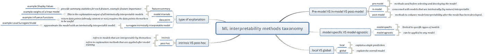
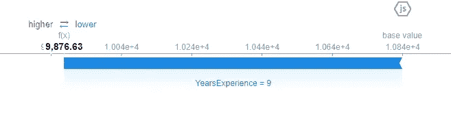
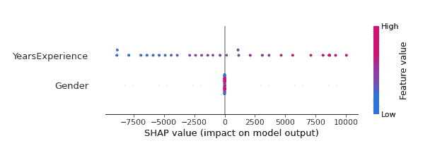
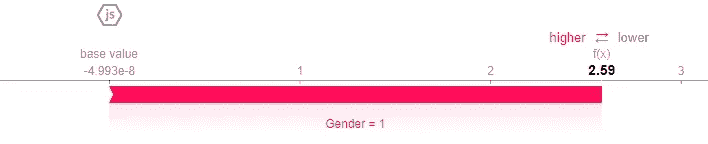
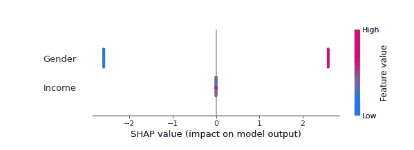

# 理解机器学习的可解释性

> 原文：<https://towardsdatascience.com/understanding-machine-learning-interpretability-168fd7562a1a>

## **机器学习可解释性介绍，**可解释性评估的驱动力、分类、示例和注释。

丹妮拉·奎瓦斯在 [Unsplash](https://unsplash.com?utm_source=medium&utm_medium=referral) 上的照片

T 如今，机器学习无处不在，尽管机器学习模型已经显示出很好的预测性能，并在不同的应用中取得了显著的突破，但这些机器学习模型正变得越来越复杂，反过来，它们的内部工作结构以及它们如何达到特定的结果变得不清楚，甚至对专家来说也是隐藏的，这提出了一个严重的问题:我们如何信任这些模型？

此外，机器学习在高度监管和关键领域(如刑事司法、金融服务和医疗保健)的应用要求测量机器学习模型，不仅要基于其准确性，还要基于其可解释性和透明度。

本文概述了机器学习的可解释性、驱动力、分类、可解释性方法的示例以及评估可解释性方法质量的重要性。

这篇文章结构如下:

**1。驱动力**

1.1 人工智能事件

1.2 公众意识和法规

**2。术语**

**3。示例**

**4。评估可解释性**

**5。总结和结论**

**6。参考文献**

## **1。驱动力**

**1.1 AI 事件**

许多事件都是因为不完善的人工智能和机器学习而记录的，这引起了人们对我们如何信任这些自动算法的关注，早期的严重事件之一是在 2016 年 5 月 7 日，当时一名特斯拉司机在自动驾驶仪激活时被杀[1]

2018 年，优步自动驾驶汽车在车辆处于自动驾驶模式时撞死了一名行人(女性)，“优步发现其自动驾驶软件在汽车的传感器检测到行人后决定不采取任何行动”[2]

2019 年 11 月，纽约州金融服务局(State Department of Financial Services)在显示出对女性客户的歧视后，对高盛(Goldman Sachs)的信用卡算法进行了调查，此前丹麦企业家兼开发商大卫·海涅迈尔·汉森(David Heinemeier Hansson)在推特上说:“我和我的妻子提交了联合纳税申报单，住在一个共有财产的州，已经结婚很长时间了。然而，苹果的黑盒算法认为我应该得到她 20 倍的信用额度”[3]，同样的事件迫使亚马逊关闭了其人工智能招聘工具，该工具被发现歧视女性申请人[4]。

在刑事司法中， [**ProPublica**](https://www.propublica.org/) 的一份报告显示，**COMPAS 是美国法院用来评估被告成为累犯的可能性的案件管理和决策支持工具[15]，该报告显示该软件对黑人有偏见，预测他们的风险是白人的两倍[5]。**

**医疗保健也不是人工智能故障的例外，许多事件的发生引起了人们对人工智能在医疗保健领域可信度的关注。**

**例如，新的研究表明，美国一家大医院指导数千万人护理的软件系统地给予白人患者优先于黑人患者的权利[6]**

**还有很多事件需要提及，你可以在这里找到更多报道:[https://incidentdatabase.ai/](https://incidentdatabase.ai/)**

****1.2 公众意识和法规****

**人工智能事件以及人工智能和机器学习在安全关键和受监管领域的使用日益增加，促使人们关注机器学习可解释性的重要性，将其作为信任机器学习模型及其结果的不可否认的要求。**

**在欧洲，一个重要的项目是 DARPA 的 XAI 计划，正如该计划官方网站所述，该计划旨在创建一套机器学习技术:**

*   **产生更多可解释的模型，同时保持高水平的学习性能(预测精度)；和**
*   **使人类用户能够理解、适当信任和有效管理新一代人工智能伙伴[7]。**

**关于美国，2016 年 10 月，国家科学技术委员会技术委员会发表了一份题为“为人工智能的未来做准备”的报告，其中一项建议是，“向州政府和地方政府提供拨款以支持使用基于人工智能的系统对个人做出相应决定的联邦机构应审查拨款条款，以确保用联邦拨款购买的基于人工智能的产品或服务以足够透明的方式产生结果，并得到有效性和公平性证据的支持”[16]。**

**最近的法规包括欧盟于 2021 年 4 月发布的一项提案[9]，题为“制定关于人工智能的协调规则(人工智能法案)并修改某些欧盟立法法案”，其中强调并强制执行不同级别的透明度，作为在欧盟市场使用和部署人工智能系统的要求。**

**此外，许多国家已经公布了他们自己的人工智能战略提案，包括法国[10]，德国[11]，葡萄牙[12]，英国[13]，美国[14]以及许多其他国家，人工智能系统的透明度和可解释性是人工智能未来的强制性要求。**

****2。术语****

****2.1 可解释性:****

**对可解释性没有一致的定义，在定义可解释性时，有必要考虑上下文和领域，但粗略地说，可解释性是用户或专家理解模型决策和结果背后的基本原理的手段。**

**一般来说，有两种方法可以实现可解释性[8]:**

**2.1.1 开发本质上可解释的模型，或者通过使用本质上可解释的模型，例如线性回归、决策树，或者通过对模型施加其他约束。**

**2.1.2 开发适用于已开发模型的解释方法。**

****2.2 模型前对比模型中对比模型后****

**前模型是指我们在选择和开发模型之前使用的可解释性方法，为此，它与探索性数据分析密切相关。**

**模型内可解释性是关于本质上可解释的模型。**

**后模型(Post-Hoc)指的是在模型被开发之后，试图增强模型可解释性的可解释性技术。**

****2.3 特定型号与不特定型号的对比****

**特定于模型的可解释性技术仅限于特定类型的模型，而模型不可知技术可以应用于任何模型(事后)。**

****2.4 本地与全球****

**局部可解释性方法是指解释单个预测的方法，而全局方法是指解释整体模型的方法**

**下图显示了总结机器学习可解释性相关分类的图表:**

**【道歉:在 [google drive](https://drive.google.com/file/d/1oGgVSxDE9OP7TopEXKju8AvUnod6ezHl/view?usp=sharing) 上有思维导图的高分辨率图像，因为该图像可能不可读(质量会自动降低)】**

****

**作者图片**

****3。可解释性方法示例****

**为了更好地理解机器学习的可解释性及其重要性，让我们以一个非常简单、基本的例子来说明著名的可解释性技术之一:沙普利附加解释或简称 SHAP。**

**目前，只需要理解“SHAP 的目标是通过计算每个特征对预测的贡献来解释实例 x 的预测”[17]就足够了，所以一般来说，SHAP 为每个特征输出一个值，解释其重要性和对实例预测输出的影响。**

**首先，让我们导入必要的库(这个例子是使用 Google Colab 实现的)。**

**接下来，我们安装并导入 SHAP 库**

**对于这个例子，我已经创建了一个非常简单的工资数据集，这足以满足说明的目的，您可以在这里下载它[，然后使用下一个代码单元格上传它:](https://drive.google.com/file/d/1yZOle-CJY1AuM0Y10L6KgcJwdSJ3T5Kg/view?usp=sharing)**

**接下来的几行将读取数据集文件，并向数据集添加一个性别列(这是为了创建更多的特性，以便我们可以更好地理解这个示例)。**

**拟合模型**

**在我们建立了模型之后，让我们使用 Shapley 值来理解和解释我们的模型**

****

**电池输出**

**从上图我们可以看到，对于例 10，对预测工资最有贡献的特征是工作经验的年限，这似乎是合理的，性别不应该影响个人的工资。**

**下一个代码单元将输出数据集特征的总体摘要，我们可以注意到，这里的影响特征是年经验。**

****

**电池输出**

## ****建模有偏数据集****

**为了理解 SHAP 如何帮助我们检测模型的偏差，我用一个有偏差的假数据集创建了一个简单的例子，该数据集代表简单的贷款批准数据，由两列组成:收入和性别。**

**在该数据集中，贷款批准完全取决于性别，这意味着如果申请人是男性，则贷款获得批准，否则，贷款被拒绝。如果我们拟合模型并仅基于其准确性来衡量它，我们可以认为模型非常好，但如果我们试图解释模型，我们会发现模型对女性申请人有偏见，这个简单的例子是现实世界中实际发生的情况，有许多类似的记录事件。**

**拟合模型**

**解释模型**

****

**电池输出**

**从上图中我们可以看到，对于 10 号申请人(女性)，性别特征对贷款审批的影响最大，在这种情况下，负面影响(蓝条)导致贷款未被批准。**

****

**电池输出**

**与上述数字形成对比的是，这一数字表明，性别特征对 11 号申请人(男性)的贷款审批产生了积极影响**

****

**电池输出**

**该图总结了贷款审批数据集的整体特征重要性，从中我们可以得出结论，即使我们的模型在准确性方面表现良好，但在公平性方面却非常糟糕，对女性申请人有严重的偏见，而收入特征对贷款审批流程的最终决策没有影响，正如所述，这是现实世界中发生的问题。**

## ****4。评估可解释性技术的方法****

**已经发表了许多关于构建解释和解释黑盒机器学习模型的方法的研究文章，其他关于开发内在可解释模型的研究文章，但是已经完成了一些评估和评价可解释性方法质量的研究。**

**出于本文的需要，我们将坚持指出，对我们如何评价和评估可解释性方法的质量进行处理和研究是很重要的，迪奥戈·v·卡瓦略等人在他们的文献综述论文[8]中提出了评价可解释性方法的一些框架和公理。(**我强烈推荐阅读这篇论文**)。**

## ****5。总结和结论****

**本文介绍了机器学习的可解释性、驱动力、公共工作以及关于机器学习的使用和发展的法规的介绍性概述，可解释性分类的总结，使用 Shapley 值的示例，该示例展示了可解释性方法的重要性，最后是关于评估和评价可解释性技术的重要性的说明。**

**这里要总结的一点是:机器学习的可解释性是机器学习的未来所必须的，它与开发高性能的机器学习模型一样重要，这需要数据科学家、机器学习研究人员和其他在机器学习领域工作的人注意-在开发他们的模型时考虑可解释性和透明性问题。**

**在接下来的文章中，我们将进一步理解最近的可解释性方法，这将有助于在开发您的模型时加以考虑。**

**感谢您的阅读，如果您有任何问题、建议和其他疑问，请随时通过 [LinkedIn](https://www.linkedin.com/in/salih-eihab/) 或电子邮件:salih.eihab1@gmail.com 联系我们。**

## ****6。参考文献:****

**[1]《卫报》，特斯拉司机在使用自动驾驶模式时发生首次致命车祸死亡(2016 年)，[https://www . The Guardian . com/technology/2016/jun/30/特斯拉-自动驾驶-死亡-自动驾驶-汽车-埃隆-马斯克](https://www.theguardian.com/technology/2016/jun/30/tesla-autopilot-death-self-driving-car-elon-musk)**

**[2]景岛乐·若林，自动驾驶优步汽车在机器人漫游的亚利桑那州撞死行人(2018)，[https://www . nytimes . com/2018/03/19/technology/Uber-drivers-deadlines . html](https://www.nytimes.com/2018/03/19/technology/uber-driverless-fatality.html)**

**[3]泰勒·特尔福德(Taylor Telford)，Apple Card 算法引发针对高盛的性别偏见指控(2019)，[https://www . Washington post . com/business/2019/11/11/Apple-Card-algorithm-sparks-gender-bias-consensations-against-Goldman-Sachs/](https://www.washingtonpost.com/business/2019/11/11/apple-card-algorithm-sparks-gender-bias-allegations-against-goldman-sachs/)**

**[4]匿名。(2016)事件编号 37。在麦格雷戈，s .(编辑。)人工智能事件数据库。人工智能伙伴关系。2022 年 1 月 25 日从 incidentdatabase.ai/cite/37.取回**

**[5]匿名。(2016)事件编号 40。在麦格雷戈，s .(编辑。)人工智能事件数据库。人工智能伙伴关系。2022 年 1 月 25 日从 incidentdatabase.ai/cite/40.取回**

**[6]鲁茨曼。(2019)事件编号 124。在麦格雷戈，s .(编辑。)人工智能事件数据库。人工智能伙伴关系。2022 年 1 月 25 日从 incidentdatabase.ai/cite/124.取回**

**[7]马特·图雷克博士，可解释的人工智能(XAI)，[https://www . DARPA . mil/program/可解释的人工智能](https://www.darpa.mil/program/explainable-artificial-intelligence)**

**[8]卡瓦略、迪奥戈、爱德华多·佩雷拉和海梅·卡多佐。《机器学习可解释性:关于方法和度量的调查》Electronics 8(2019)第 8 期:832。https://doi.org/10.3390/electronics8080832**

**[9]欧洲委员会，欧洲议会和理事会关于制定人工智能统一规则(人工智能法)和修正某些联盟法案的条例(2021 年)，【https://eur-lex.europa.eu/legal-content/EN/TXT/? qid = 1623335154975&uri = CELEX % 3a 52021 PC 0206**

**[10]法国 AI 战略报告(2018)，[https://knowledge 4 policy . EC . Europa . eu/AI-watch/France-AI-Strategy-Report _ en](https://knowledge4policy.ec.europa.eu/ai-watch/france-ai-strategy-report_en)**

**[11]德国 AI 战略报告(2018)，[https://knowledge 4 policy . EC . Europa . eu/AI-watch/Germany-AI-Strategy-Report _ en](https://knowledge4policy.ec.europa.eu/ai-watch/germany-ai-strategy-report_en)**

**[12]葡萄牙 AI 战略报告(2019)，[https://knowledge 4 policy . EC . Europa . eu/AI-watch/Portugal-AI-Strategy-Report _ en](https://knowledge4policy.ec.europa.eu/ai-watch/portugal-ai-strategy-report_en)**

**[13]英国 AI 战略报告(2018)，[https://knowledge 4 policy . EC . Europa . eu/AI-watch/United-Kingdom-AI-Strategy-Report _ en](https://knowledge4policy.ec.europa.eu/ai-watch/united-kingdom-ai-strategy-report_en)**

**[14]国家安全委员会人工智能(2021 年)，[https://www . nscai . gov/WP-content/uploads/2021/03/Full-Report-Digital-1 . pdf](https://www.nscai.gov/wp-content/uploads/2021/03/Full-Report-Digital-1.pdf)**

**[15] COMPAS(软件)，[https://en . Wikipedia . org/wiki/COMPAS _(软件)](https://en.wikipedia.org/wiki/COMPAS_(software))**

**[16]美国国家科学技术委员会技术委员会，为人工智能的未来做准备(2016)，[https://obamawhitehouse . archives . gov/sites/default/files/white house _ files/microsites/ostp/NSTC/preparating _ FOR _ THE _ FUTURE _ OF _ ai . pdf](https://obamawhitehouse.archives.gov/sites/default/files/whitehouse_files/microsites/ostp/NSTC/preparing_for_the_future_of_ai.pdf)**

**[17] Christoph Molnar，可解释的机器学习，使黑盒模型可解释的指南(2022 年)，[https://christophm.github.io/interpretable-ml-book/](https://christophm.github.io/interpretable-ml-book/)**