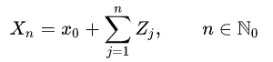
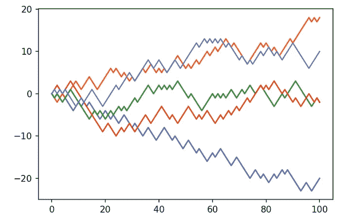
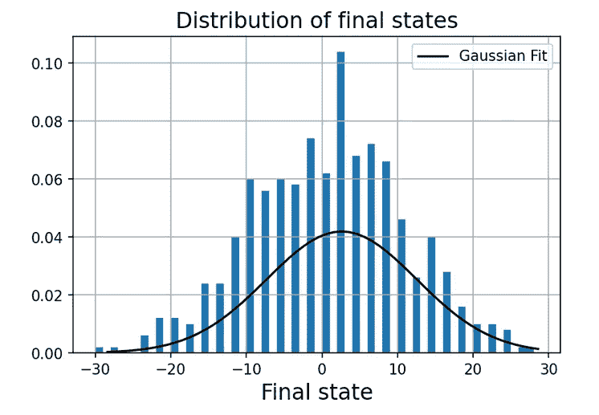
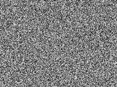
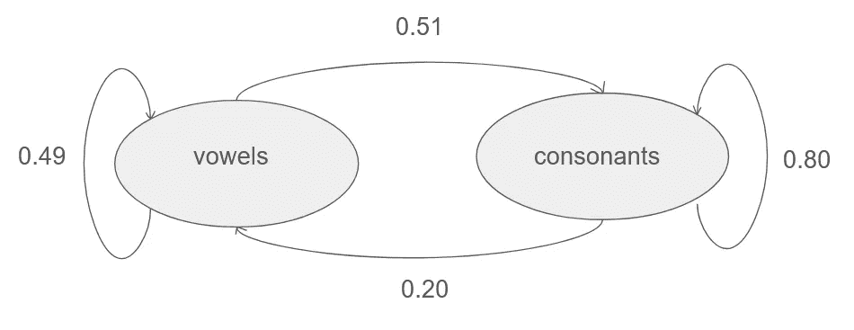

# 理解马尔可夫链

> 原文：<https://towardsdatascience.com/understanding-markov-chains-cbc186d30649>

# 理解马尔可夫链

## 以及它们与神经科学、人工智能和俄罗斯诗歌的联系

> “我的梦，我的梦！他们的甜蜜变成了什么？我的青春到底变成了什么？”
> ――亚历山大·普希金，[尤金·奥涅金](https://www.goodreads.com/work/quotes/1795311)

引用一首 19 世纪的俄罗斯诗歌来开始一篇关于马尔可夫链(也称为马尔可夫过程)的文章可能看起来很奇怪，但在 20 世纪初概率论的一个全新领域的发展之初，这两者之间有一种令人惊讶的联系。

今天，马尔可夫链无处不在。无法想象没有它们的人工智能，应用范围从自然语言处理、语音识别、网络搜索和蛋白质发现到自动驾驶汽车。

但是在我们深入研究马尔可夫链和俄罗斯诗歌之间的联系之前，我想从随机过程的重要性开始，没有比 ***随机漫步的概念更好的地方了。***

正如科学中经常出现的情况一样，想法似乎悬在空中，经常由几个思想家在几年甚至几个月的时间里独立发现。类似的事情发生在 19 世纪初，当时科学家越来越意识到 ***随机过程的重要性，如随机游走*** 。在几年的时间里，随机漫步出现在蚊子数量(它们与疾病传播相关)、分子的布朗运动(爱因斯坦的*奇异之年*的一部分)、声学和金融市场的背景中。

正式开始，随机漫步是一个 ***随机过程*** ，它描述了一个主题在一个数学空间中的 ***路径*** ，这个数学空间可以由整数、二维或更高维的欧几里德空间以及许多其他结构组成。从初始状态开始，我们通过在每一步 将从概率分布中抽取的 ***个随机变量相加来进行 n 步:***



x 是数学空间中的位置，n 是步数，Zj 是服从一定分布的随机变量。

我们可以用一个简单直观的例子来说明这一点。想象一下，你发现自己在一个无限大的房间中间，开始抛硬币。每次你得到正面，你就向左走一步。每次你得到反面，你就向右走一步。扔 100 次硬币后你会在哪里结束？我们可以很容易地用 Python 实现这一点，并画出流程的五个实例。

```
def random_walk(x0, p, steps):
    random_walk=[]
    random_walk.append(x0)
    x=x0
    for i in range(steps):
        s=np.random.binomial(1, p, size=None)
        if s == 1:
            x+=1
        else:
            x+=-1
        random_walk.append(x)
    return random_walk
```



简单随机漫步的五个实例。

很明显，在 100 次抛硬币后，你的终点可能会有很大的不同，尽管在每一步你都面临相同的向左或向右的 50/50 概率。

***虽然这个过程是由偶然性*** 主导的，但有趣的是，就像变魔术一样，大数定律开始发挥作用，100 个时间步长后最终状态的位置将遵循一种近似高斯正态的分布，均值为零， ***方差与步长数的平方根*** 成比例。通过绘制 500 次随机行走的样本的所有最终位置的直方图，并对其拟合高斯曲线，可以很容易地观察到这一点:



这只是一个简单的例子，我们从其中提取的分布和我们穿过的空间可以呈现各种形状和形式，这取决于上下文和应用。

虽然对我们来说，随机漫步在概念上看起来非常直观，但科学家们花了很长时间才明白，如果我们想要对我们的理解世界进行建模， ***随机性起着重要的作用:*** 随机漫步只是在 1905 年由卡尔·皮尔逊提出的。

我们可能很难接受这样一个事实，即没有什么比机会更能解释这些大相径庭的结果了，随机过程的属性对我们的大脑来说仍然是一个挑战，我们的大脑一直在寻找一个解释(t [他的文章](https://rogersbacon.substack.com/p/randomness-in-science-edit)探讨了我们对随机性的厌恶，以及反过来故意在我们的生活中注入噪声如何能使我们受益)。



白噪声。(来自 Jorge Stolfi， [BY-SA 3.0](https://creativecommons.org/licenses/by-sa/3.0) )

毕竟，牛顿力学被视为结束随机性统治的一种手段，对玻尔兹曼及其从统计角度看待热力学的提议的强烈反对，充分说明了我们对让太多机会进入我们的理论感到不适。但正如我所提到的，随机漫步现在在许多科学背景下得到应用，尽管我们假设物理定律在本质上是确定性的(撇开量子效应)，但对系统的随机/统计描述往往比确定性描述更有帮助，例如，当涉及疟疾苍蝇的飞行、液体中分子的运动或我们大脑中的过程时。这种观念上的转变至关重要，直到今天仍然很重要:丹尼尔·卡尼曼的新书《噪音》给出了许多令人不安的好例子，说明我们仍然很难认识到噪音、随机过程在我们日常生活的许多方面发挥的重要作用，以及错误的判断如何让我们损失数十亿美元，并最终在法庭系统中摧毁生命。

现在我们对什么是随机漫步有了基本的了解，我们可以回到俄罗斯诗歌。

假设我们对语言和诗歌一无所知。然后我们可以对尤金·奥涅金的诗句采取最抽象的方法，并承认诗歌构成了一系列相互联系的“事件”，其中每个字母都构成了一个事件。发现它们内部结构的一种方法是计算事件之间的“转移概率”。文本中可能发生的一种非常简单的事件是辅音和元音之间的转换。

这为我们提供了 4 个可能事件的列表:

辅音→辅音
辅音→元音
元音→元音
元音→辅音

马尔可夫链之父马尔可夫提出了一个问题，即这些概率对于像尤金·奥涅金这样的文本作品来说是什么样的。他去掉了所有的标点符号，仔细阅读了这本著名的俄罗斯诗集《T4》的前 20000 个字母。幸运的是，我们不再需要手动操作，可以编写一个简单的程序来分析上面的引用:

```
##define lists of consonants and vowels
consonants=['b','c','d','f','g','h','i','j','k','l','m','n','p','q','r','s','t','v','w','x','y','z']
vowels=['a','e','i','o','u']###text with all interpunctuation removedtext="mydreamsmydreamswhathasbecomeoftheirsweetnesswhatindeedhasbecomeofmyyouth"## this function counts all 4 types of transitions and normalizes them by the length of the text:def simple_markov_chain(text):
    cv=0
    cc=0
    vv=0
    vc=0

    for i in range(len(text)-1):
        if text[i] in consonants and text[i+1] in consonants:
            cc+=1
        if text[i] in consonants and text[i+1] in vowels:
            cv+=1
        if text[i] in vowels and text[i+1] in vowels:
            vv+=1
        if text[i] in vowels and text[i+1] in consonants:
            vc+=1

    return cc/(len(text)-1), vv/(len(text)-1), cv/(len(text)-1), vc/(len(text)-1)
```

> “我的梦，我的梦！他们的甜蜜变成了什么？我的青春到底变成了什么？”

这一小段文字给出了以下转移概率:

辅音→辅音:0.43
辅音→元音:0.11
元音→元音:0.25
元音→辅音:0.26

我们现在可以把这些转换重新写成一个简单的图表，它构成了一个马尔可夫链:



转移概率，用马尔可夫链表示。从图中每个节点流出的总概率被归一化为 1。

这只是基于这首诗的一个小样本，但 Markov 观察到，这些转移概率实际上在不同作者的不同文本之间可能不同，因此编码了一些关于文本的隐藏概率结构的信息。

有趣的是，我们可以为不同的语言设置这些概率，并比较哪种结构是保守的或不同的，这些问题是(计算)语言学家非常感兴趣的。

将文本表示为马尔可夫链的一个好处是，它摆脱了某些不切实际的独立性假设，例如，您可以通过完全独立地绘制字母来获得这些假设:那么辅音出现的概率大约为 68%(根据此示例估计)，但是如果当前状态是元音，则该概率仅为 50%，而对于辅音，则为 80%。

因此，上面的简单马尔可夫链以更现实的方式吸收了真实文本的属性。

退一步讲，类似的依赖性假设在其他情况下也有意义，例如天气:经常连续几天下雨，所以一旦你观察到下雨，另一天下雨的可能性比一天下雨的可能性大。


由[摩根·豪斯](https://unsplash.com/@morganhousel?utm_source=medium&utm_medium=referral)在 [Unsplash](https://unsplash.com?utm_source=medium&utm_medium=referral) 上拍摄的照片

认识到世界上的许多过程隐藏着一种可以用概率语言表达的结构是非常深刻的。现代神经科学理论，如[贝叶斯大脑假说](/the-bayesian-brain-hypothesis-35b98847d331)将这种概率性的预测框架置于大脑绘制其对世界的理解能力的核心。我们的大脑必须不断地在具有部分信息的环境中行动，因此它们没有对正在发生的一切进行建模的奢侈，而是必须假设环境的重要部分由噪声主导，或者至少是我们无法预测的因素。所以规划本身就变成了一个概率过程。就像在随机漫步的例子中，我们都不知道我们会在哪里结束。沿着这条路的每一步，我们都不知道太多，所以我们在做决定时必须考虑不确定性。

概率模型的另一个非常有用的地方是，它们可以用来构建生成模型。顾名思义，生成模型可以在学习模型后生成全新的数据，因此也可以用于预测系统的未来状态。

因此，它们找到了进入各种应用程序的方法，例如图像生成、文本生成、音频生成等等(我在我的文章[如何让计算机做梦](/how-to-make-computers-dream-3b4b10e4463a)中讨论了这一点)。

对于我们的马尔可夫链的玩具示例，我们可以实现一个简单的生成模型 ***，它通过以基线概率(32%和 68%)对初始状态(元音或辅音)进行采样来预测潜在的文本*** ，然后生成一系列连续的状态，就像我们从前面介绍的随机漫步中采样一样:

```
import randomconsonants=['b','c','d','f','g','h','i','j','k','l','m','n','p','q','r','s','t','v','w','x','y','z']
vowels=['a','e','i','o','u']def markov(iterations): 
    text=[]
    s0=np.random.binomial(1, 0.32, size=None)
    if s0 == 1:            
        l0=random.choice(vowels)
        text.append(l0)
    else:
        l0=random.choice(consonants)
        text.append(l0)            
    for i in range(iterations):
        if s0 == 1:
            l=random.choice(vowels)
            text.append(l)
            s0=np.random.binomial(1, 0.49, size=None)
        else:
            l=random.choice(consonants)
            text.append(l)
            s0=np.random.binomial(1, 0.2,size=None)  
    string=''.join(text)
    return string 
```

对 100 个字母进行采样，我们得到了这些行:

> iewnjgfqxqqqlyoqbuokwpgaavonozbylhjdnjyvtqaakxgmqpiigjauzwxznqhqkhryiiiaxcfblywigbjpshcnnhviqkfrpwai。
> -一个简单的马尔可夫链

不太像俄罗斯诗歌。

虽然原则上我们现在有能力生成随机文本，但应该清楚的是，虽然一个非常简单的马尔可夫链可以模拟文本中一些重要的相关性假设，但上面的图表过于简单，实际上无法产生有意义的文本。例如，以相同的概率对所有字母进行抽样是非常不现实的，并且不会产生许多格式良好的单词。

另一个 ***极限假设就是所谓的马氏性*** 。

这告诉我们，为了预测 ***系统*** 的未来状态，我们只需要知道 ***系统*** 的当前状态。系统的过去或未来都无关紧要。重要的只是状态之间的转换。

然而，国家的构成有待讨论。没有人强迫我们在单元音和辅音的层面上分析语言。虽然双辅音很常见，但连续三个元音非常罕见，所以两个元音后有一个元音的可能性应该小得多。

因此，我们可以将图表扩展到更大的字母序列(例如，元音元音→元音元音元音，元音元音→辅音元音……)，从而为马尔可夫链添加更多可能的状态。然而，这是以链上状态数的指数增长为代价的。

正如在许多计算机科学应用中一样，这导致了模型大小、计算负担和模型质量之间的权衡。为了更接近语言的实际版本，例如，我们可以将每个可能的单词与每个其他可能的单词连接起来，并指定它们之间的转换概率，或者查看不同字母之间的转换概率。

> 我有一个朋友是我的好朋友，我已经和你一起工作了几年了。所以我希望你一切都好，我希望你一切都好。
> -我的手机

“自动更正”是我们大多数人熟悉的伴侣。这也是一个很好的例子，说明根据输入预测转移概率和最可能的单词在日常生活中是多么地有用，同时我们不会给明智的长期预测带来太多负担(因此，一旦你让自动更正泛滥，就会出现荒谬的无意义但语法正确的愚蠢句子)。

说到马尔可夫链的应用，天空是无限的。谷歌著名的 PageRank 算法依赖于马尔可夫链，将互联网上大约 400 亿个网页相互连接起来，为每个转变分配概率。

如果我们希望真实地模拟语言，我们需要注意包含足够的长期依赖，毕竟，这是明智的、类似人类的文本的面包和黄油(像 GPT-3 这样的最先进的模型与变形金刚一起工作，以更经济地表达这些依赖)。然而，也有更现实版本的马尔可夫链用于生成语言。例如，Markovify 是一个 Python 包，它允许你读入任意文本文件并生成新文本([本文](/text-generation-with-markov-chains-an-introduction-to-using-markovify-742e6680dc33)为莎翁悲剧解释了这一点)。

马尔可夫链是有用的工具，在人工智能和工程的许多地方都有应用。但此外，我认为它们也是有用的概念框架，可以帮助我们以简单直观的方式理解现实背后的概率结构，并让我们感受到扩大这种概率结构是如何导致强大的世界模型的。