# 了解均值漂移聚类和 Python 实现

> 原文：<https://towardsdatascience.com/understanding-mean-shift-clustering-and-implementation-with-python-6d5809a2ac40>

## 无监督学习

## 在这篇文章中，我简要介绍了无监督学习方法的概念，均值漂移聚类，以及它在 Python 中的实现

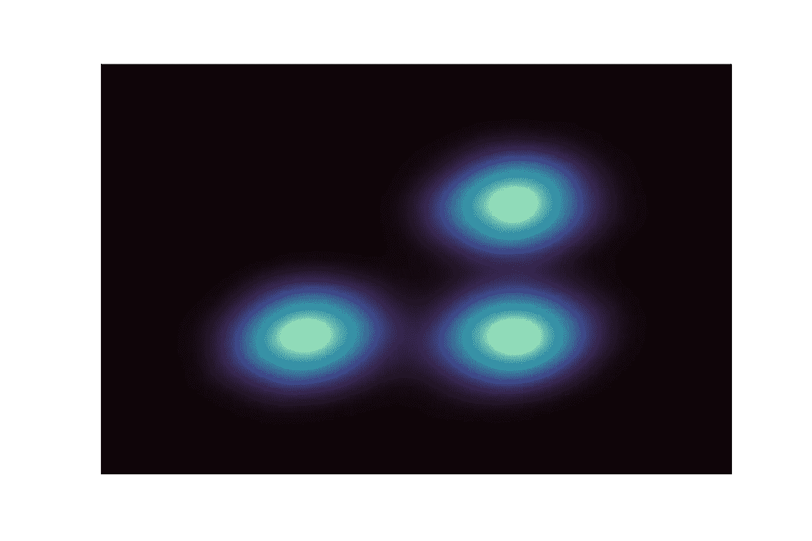

均值偏移聚类(图片由作者提供)

均值漂移是一种非监督学习算法，主要用于聚类。它广泛用于现实世界的数据分析(例如，图像分割)，因为它是非参数的，并且不需要特征空间中任何预定义的聚类形状。

简单来说，“均值漂移”等于以迭代的方式“向均值漂移”。在该算法中，每个数据点都在逐步向“区域均值”移动，每个点的最终目的地位置代表它所属的聚类。

在这篇文章中，我将简要介绍如何理解这个算法以及 Python 中的实现。希望这篇文章有帮助！

## 什么意思？

因此，根据上面对均值漂移算法的简要描述，您可能已经注意到，在没有进一步解释的情况下，有几个术语仍然令人困惑。第一个是我们所指的“意思”。

如果我们看一个具有以下两个特征的样本数据集，

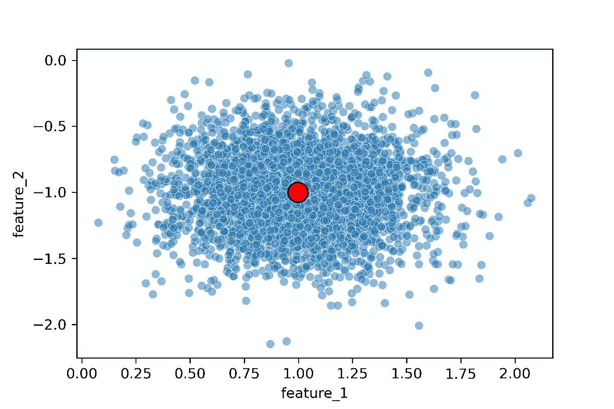

样本数据集的平均点(红色)。(图片由作者提供)

通过计算 feature_1 的平均值和 feature_2 的平均值，我们可以轻松定位整个数据集的“中间点”(上图中的红色点)。注意，这里的“平均点”分别由特征 _1 和特征 _2 的算术平均值来定义，因为它是基于对所有点的相等权重来计算的，

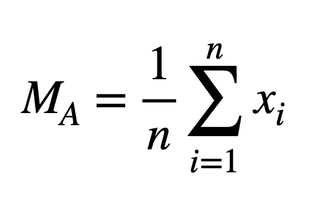

算术平均值(图片由作者提供)

其中 M 表示平均值，n 是样本大小，x_i 是数据点的一个特征(特征 1 或特征 2)。

有时给每样东西同等的权重是不合理的，我们也可以计算加权平均值，

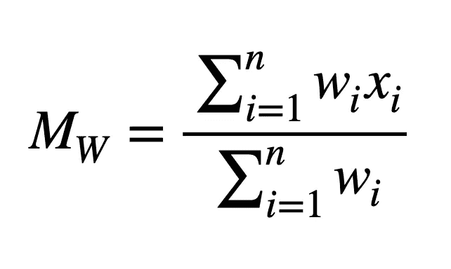

加权平均值(图片由作者提供)

其中 w_i 是 x_i 的权重，它与点之间的欧氏距离有关。均值漂移算法中最广泛使用的权函数是平坦权函数，

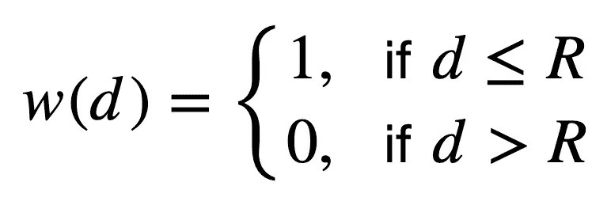

平面权重函数(图片由作者提供)

其中 d 是任意数据点到当前调查点的距离，R 是以调查点为圆心的圆的半径。

例如，如果我们想要计算点 O 周围区域的加权平均值，则可以将平坦加权函数理解为以 O 为中心、半径为 r 的硬边界圆。圆内的所有数据都将被计算，而圆外的任何数据点都将被忽略。

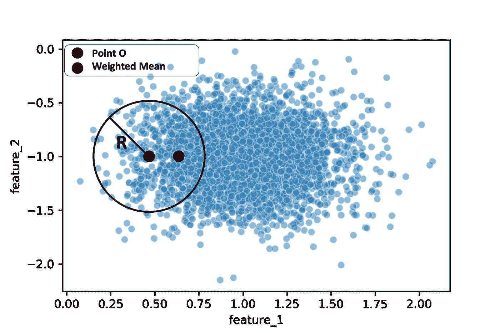

平坦加权函数的加权平均值(图片由作者提供)

这有点像我们站在一个局部点(中心点 O)上，看不到整个画面，但被限制在一个局部区域来计算平均值。在这里，我们看到红点是调查区域的加权平均值，我们发现它往往位于点密度较高的区域。

我们也可以用高斯函数代替平坦权函数，

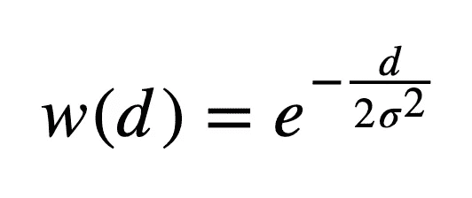

高斯权重函数(图片由作者提供)

其中 d 仍然是中心点到任何其他点之间的距离，这里的σ是一个参数，用于调整权重随着距离的增加而降低的速度。

其思想类似于平权函数，一个点离圆心越近，在均值计算中权重越高。为了实现的简单性和清楚的物理意义，均值漂移算法通常使用**平权函数**来计算均值。

我们上面计算的局部平均点在某种程度上代表了在特定局部区域中具有最大**点密度**的位置。你可能已经注意到，上图中黑色圆圈 **R** 的半径对于定义局部区域非常重要。实际上，半径是 mean shift 算法中唯一的参数，称为“**带宽**”。

到目前为止，我想你已经理解了当我们研究给定带宽参数的一个数据点时意味着什么。

## 为什么转变？

我在理解均值漂移算法时遇到的一个最大的问题是“*为什么点要向均值漂移？？*“应用这种方法时，我们是否改变了原始数据集？

实际上，不，我们没有对原始数据做任何改变。“转移”只是描述了我们如何标记每个数据点的过程。相似的点逐渐“移动”到它们所属的聚类的质心，以便被如此标记。

让我们看一个 2-D 玩具数据集，它被设计成有三个集群。

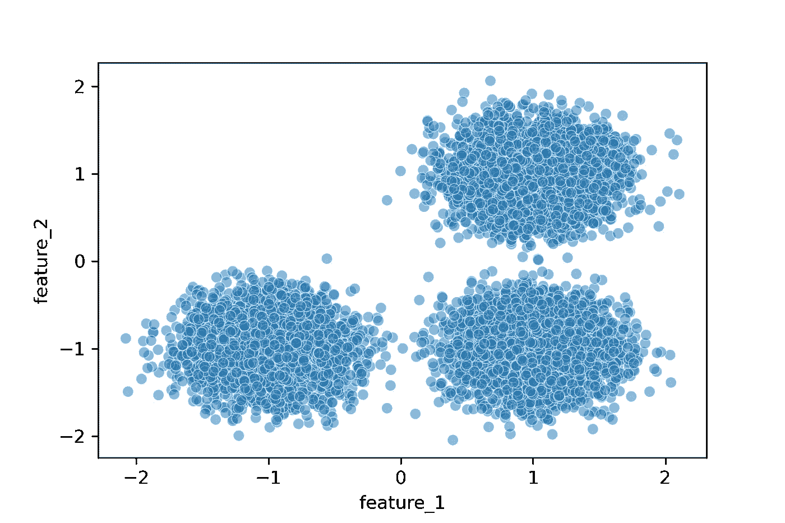

具有三个集群的玩具数据集(图片由作者提供)

在 mean shift 算法中，每个点在每一步中通过向其局部区域的加权平均值移动来试图找到其组。每个点的目的地将是该点所属的数据聚类的质心。然后，具有相同目的地点的所有数据点可以用相同的聚类来标记。

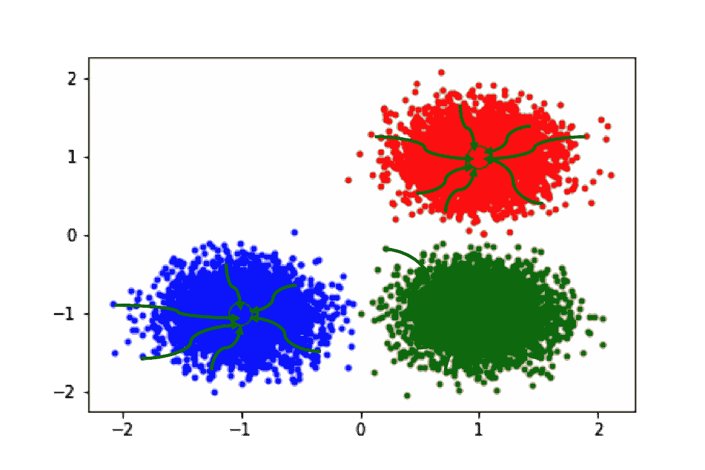

玩具数据集，包含三个具有移动轨迹的集群(图片由作者提供)

上面的图显示了标注的结果，其中黑色的大圆圈表示每组数据点的最终目的地，箭头大致显示了一些移动路径的轨迹。

因此，您会看到数据并未更改，只是标记了其集群 id。

## 怎么换挡？

让我们以一个数据点为例来说明这种转变是如何进行的。假设我们有一个点位于右下方聚类的边缘(下图中的黑点)。

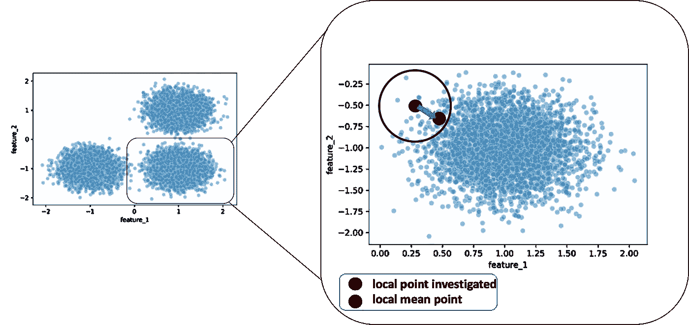

均值偏移中的一个点的步骤 1(图片由作者提供)

在带宽参数定义的局部区域内，计算 *feature_1* 和 *feature_2* 的平均值后，我们得到了平均点的位置(如上图红点所示)。然后圆心从黑点移到红点。

接下来，在新的点位置重复上述过程，如下所示。


均值偏移中的一个点的步骤 2(图片由作者提供)

经过足够长时间的迭代或黑色圆圈内的点数不再增加(收敛)后，原始数据点到达其目的地，即其所属聚类的质心。

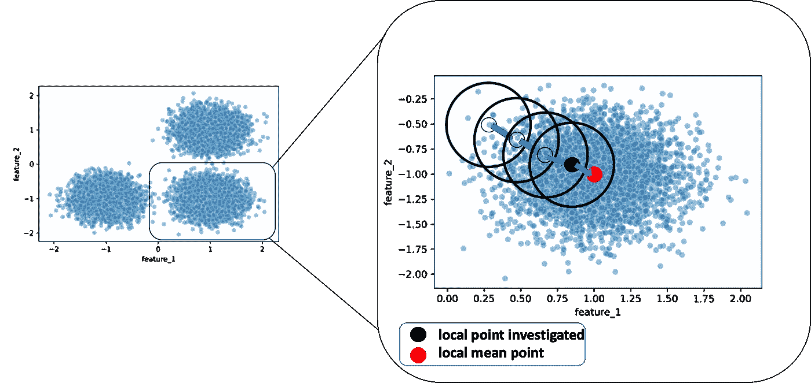

均值偏移中一个点的第 N 步(图片由作者提供)

您可能已经注意到，如果对每个数据点都执行这一过程，计算将会非常多余。因此，在实践中，当这些移动的圆重叠时，只有包含最多点的圆被保留。

由于均值漂移聚类只有一个参数，即带宽(或某些情况下的窗口大小)，因此在为其选择合适的值时需要格外小心。

你可能已经注意到，局部区域越大，局部平均点就越接近全局平均点。如果对于所研究的每个数据点，局部区域**都非常大**，那么所有的“局部平均点”实际上都位于“全局平均点”的位置。

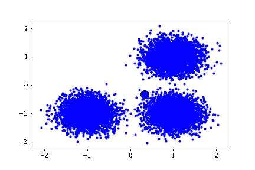

超大带宽均值漂移(图片由作者提供)

换句话说，超大局部区域设置可以使我们看不到数据集的局部结构。

如果我们有一个非常小的带宽，将会有更多的无意义簇，因为我们将平均值计算限制在一个非常小的局部区域。

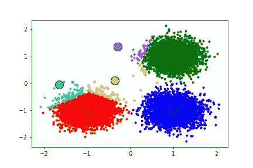

超小带宽的均值漂移(图片由作者提供)

因此，在建模时，最好对带宽有个概念。然而，如果我们没有关于数据的先验知识，我们仍然可以根据从整个数据集随机采样的成对距离来估计带宽。

## 用 Python 实现

得益于 sklearn 包，均值漂移聚类的实现相对容易。下面的代码显示了如何估计带宽并使用估计的参数进行聚类。

```
bandwidth = estimate_bandwidth(X, quantile=0.3, n_samples=300)ms = MeanShift(bandwidth=bandwidth)
ms.fit(X)
```

为了从分类结果中提取数据点的标签，我们可以这样做，

```
labels = ms.labels_
```

就是这样！希望文章有帮助！

如果你喜欢看我的文章，请[订阅我的媒体账号](https://jianan-lin.medium.com/subscribe)。

## 参考资料:

[](https://scikit-learn.org/stable/auto_examples/cluster/plot_mean_shift.html#sphx-glr-auto-examples-cluster-plot-mean-shift-py)  [](https://en.wikipedia.org/wiki/Mean_shift) 