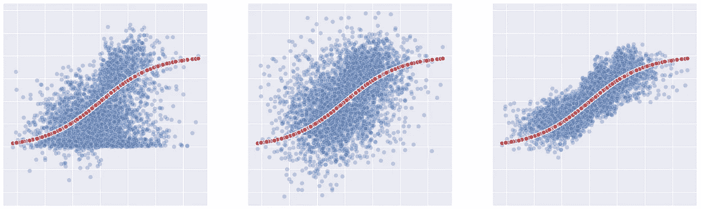
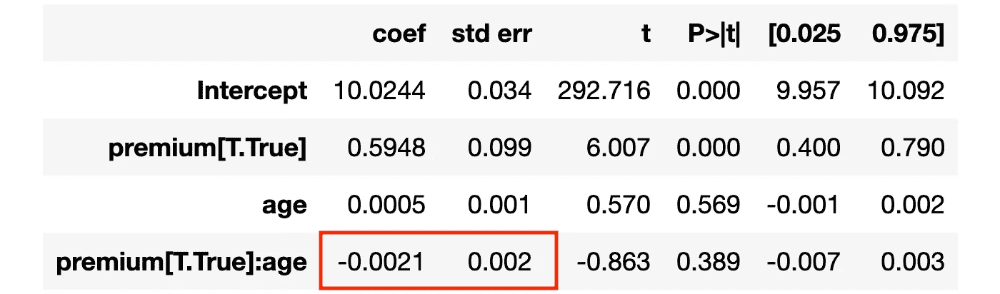
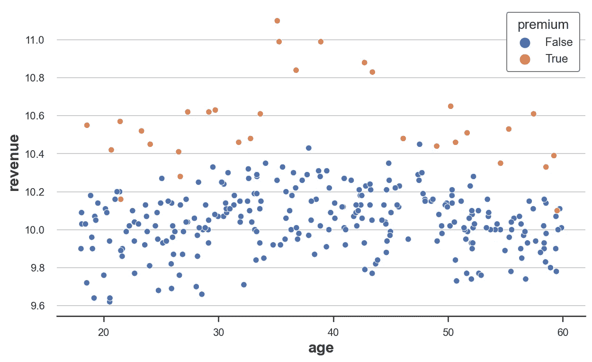
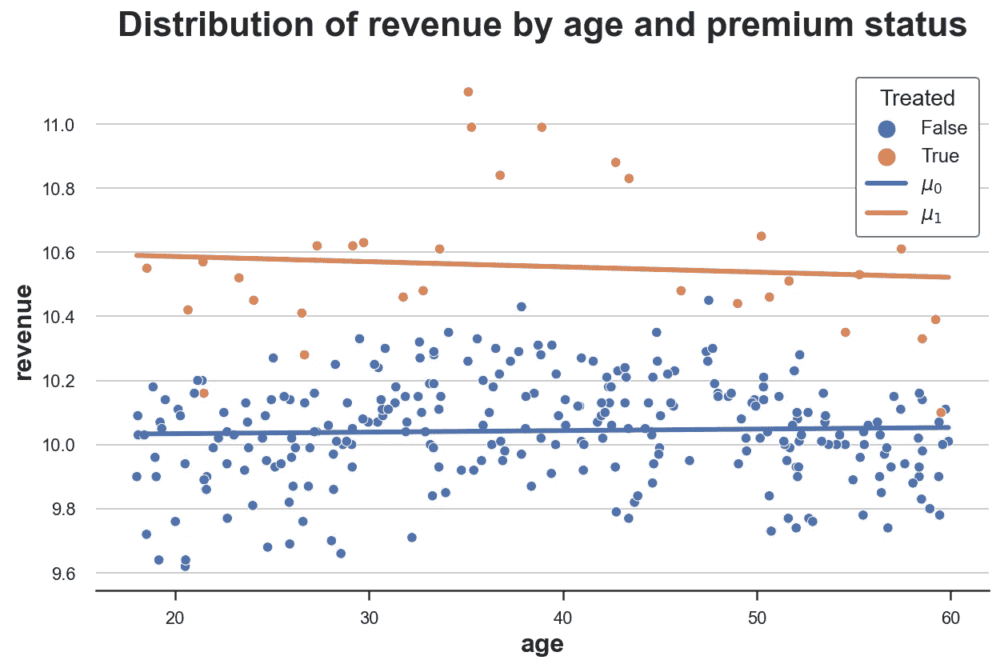
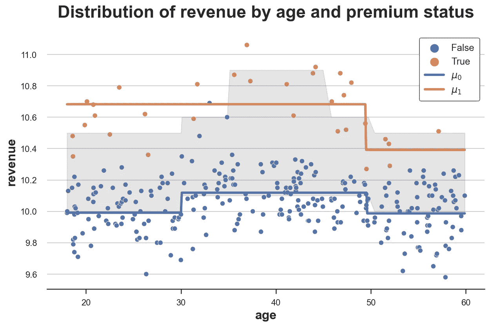
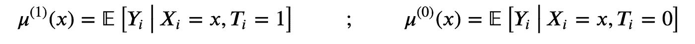
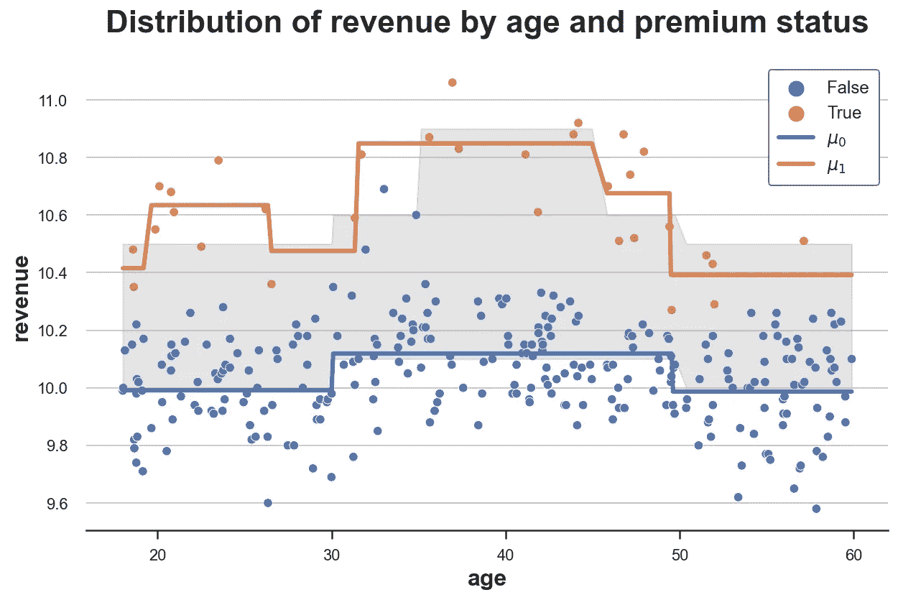
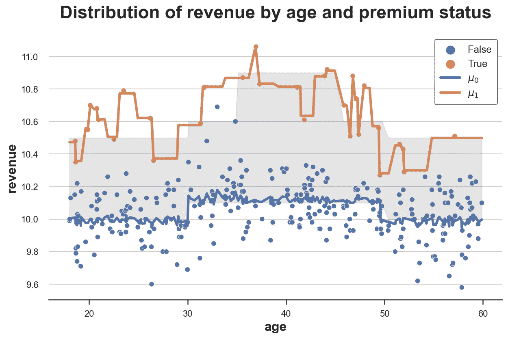

# 理解元学习者

> 原文：<https://towardsdatascience.com/understanding-meta-learners-8a9c1e340832>

## [因果数据科学](https://towardsdatascience.com/tagged/causal-data-science)

## 如何使用机器学习来估计异质治疗效果



封面，作者图片

在许多情况下，我们不仅对估计因果效应感兴趣，还对这种效应对于不同用户是否**不同感兴趣**。我们可能有兴趣了解一种药物对不同年龄的人是否有不同的副作用。或者，我们可能有兴趣了解某个广告活动在某些地理区域是否特别有效。

这一知识至关重要，因为它让我们能够**有针对性地进行治疗。如果一种药物对儿童有严重的副作用，我们可能会限制它只在成人中销售。或者，如果一个广告活动只在说英语的国家有效，就不值得在其他地方展示。**

在这篇博文中，我们将探索一些方法来揭示**治疗效果的异质性**。特别是，我们将探索利用**机器学习**算法灵活性的方法。

# 例子

假设我们是一家公司，有兴趣了解新的**高级功能**增加了多少收入。特别是，我们知道不同**年龄**的用户有不同的消费态度，我们怀疑超值功能的影响也可能因用户年龄而异。

该信息可能非常重要，例如针对或**折扣设计**的**广告。如果我们发现高级功能增加了一组特定用户的收入，我们可能希望将广告瞄准该组用户或向他们提供个性化折扣。**

为了了解高级功能对收入的影响，运行一个 [**AB 测试**](https://en.wikipedia.org/wiki/A/B_testing) ，我们在测试样本中随机给予 10%的用户访问高级功能的权限。这项功能很贵，我们负担不起免费提供给更多用户。希望 10%的治疗概率足够了。

我们使用来自`[src.dgp](https://github.com/matteocourthoud/Blog-Posts/blob/main/notebooks/src/dgp.py)`的数据生成过程`dgp_premium()`生成模拟数据。我还从`[src.utils](https://github.com/matteocourthoud/Blog-Posts/blob/main/notebooks/src/utils.py)`引进了一些绘图函数和库。

```
from src.utils import *
from src.dgp import dgp_premiumdgp = dgp_premium()
df = dgp.generate_data(seed=5)
df.head()
```


数据快照，图片由作者提供

我们有 300 名用户的数据，我们观察他们生成的`revenue`，以及他们是否被赋予了`premium`特性。此外，我们还记录用户的`age`。

为了了解随机化是否有效，我们使用优步`[causalml](https://causalml.readthedocs.io/)`软件包中的`create_table_one`函数制作了一个**协变量平衡表**，其中包含了我们在治疗组和对照组中可观察特征的平均值。顾名思义，这应该永远是你在因果推断分析中呈现的第一张表。

```
from causalml.match import create_table_one

create_table_one(df, 'premium', ['age', 'revenue'])
```


平衡表，作者图片

大多数用户在控制组中，只有 31 个用户获得了高级功能。平均`age`在各组之间具有可比性(标准化平均差异，SMD < 0.1)，而高级功能似乎平均为每个用户增加了`revenue`2.59 美元。

`premium`功能**的效果是否因用户`age`而异**？

一个简单的方法可以是在`premium`和年龄的完全交互上回归`revenue`。

```
linear_model = smf.ols('revenue ~ premium * age', data=df).fit()
linear_model.summary().tables[1]
```



线性回归结果，图片由作者提供

相互作用系数接近于零，不显著。似乎没有`premium`对`age`的微分作用。但这是真的吗？相互作用系数仅反映线性关系。如果关系是**非线性**怎么办？

我们可以通过直接**绘制原始数据**来检查。我们通过`age`绘制`revenue`，在`premium`用户和非高级用户之间分割数据。

```
sns.scatterplot(data=df, x='age', y='revenue', hue='premium', s=40);
```



原始数据，作者图片

从原始数据来看，似乎 30 岁到 50 岁之间的人一般来说`revenue`更高，而`premium`对 35 岁到 45 岁之间的人有特别强的影响。

我们可以**想象**按年龄划分的治疗和未治疗的估计收入。

我们首先计算有( *μ̂₁* )和没有`premium`特征( *μ̂₀* )的预测收入，并将它们与原始数据一起绘制出来。

```
df['mu0_hat'] = linear_model.predict(df.assign(premium=0))
df['mu1_hat'] = linear_model.predict(df.assign(premium=1))
plot_TE(df)
```



带有线性估计的原始数据，按作者分类的图像

正如我们所见，橙色线高于蓝色线，表明`premium`对`revenue`有积极影响。然而，这两条线基本上是**平行的**，表明治疗效果没有异质性。

能不能再精确一点？有没有一种方法可以灵活地**估计这种治疗异质性**，而不需要假设函数形式？

答案是**是的**！我们可以使用**机器学习**方法灵活估计异构治疗效果。特别是，我们将考察由[孔兹尔，塞孔，，于，(2019)](https://www.pnas.org/doi/abs/10.1073/pnas.1804597116) 介绍的三种常用方法:

*   s-学习者
*   网络学习者
*   X-learner

# 环境

我们假设对于一组主题 *i=1，…，n* ，我们观察到一个元组 *(Xᵢ，Dᵢ，Yᵢ)* 包括

*   一个治疗任务 *Dᵢ∈{0,1}* ( `premium`)
*   一个回应 *Yᵢ∈ℝ* ( `revenue`)
*   一个特征向量 *Xᵢ∈ℝⁿ* ( `age`)

我们感兴趣的是**估计平均治疗效果**。


平均治疗效果，图片由作者提供

其中*yᵢ⁽*ᵈ⁾*t41】表示个体 *i* 在处理状态 *d* 下的潜在结果。我们还做了以下假设。*

**假设 1:未发现**(或可忽略，或可观的选择)


无根据假设，作者的图像

即以可观察的特征 *X* 为条件，处理分配 *D* 几乎是随机的。我们实际假设的是，没有我们没有观察到的其他特征会影响用户是否获得`premium`功能和他们的`revenue`。这是一个**强假设**，我们观察到的个人特征越多，这个假设就越有可能得到满足。

**假设 2:稳定单位治疗值(SUTVA)**


萨特瓦假设，作者图片

即潜在的结果不取决于治疗状态。在我们的例子中，我们排除了另一个用户使用`premium`功能可能会影响我的`premium`对`revenue`的影响。违反 SUTVA 的最常见设置是存在**网络效应**:我的一个朋友使用社交网络增加了我使用它的效用。

## s-学习者

最简单的元算法是**单一学习器或 S-学习器**。为了构建 S-learner 估计器，我们为所有观察值拟合了一个**单一模型** *μ* 。


s-学习者反应函数，图片由作者提供

估计量由处理前后的预测值之差给出，分别为 *d=1* 和 *d=0* 。


s-学习者评估者，作者图片

让我们使用 [**决策树回归**](https://en.wikipedia.org/wiki/Decision_tree_learning) 模型来构建 S-learner，使用`[sklearn](https://scikit-learn.org/)`包中的`DecisionTreeRegressor`函数。我不会在这里详细介绍决策树，但我只想说，它是一种非参数估计器，使用训练数据将状态空间(在我们的情况下为`premium`和`age`)分成多个块，并预测结果(在我们的情况下为`revenue`)作为每个块内的平均值。

```
from sklearn.tree import DecisionTreeRegressor

model = DecisionTreeRegressor(min_impurity_decrease=0.001)
S_learner(dgp, model, y="revenue", D="premium", X=["age"])
```



估计的和真实的治疗效果，图片由作者提供

该图描绘了数据以及响应函数 *μ̂(x,1)* 和 *μ̂(x,0)* 。我还用灰色标出了真实反应函数之间的区域:真实的治疗效果。

正如我们所看到的，S-learner 足够灵活，能够理解治疗组和对照组之间的水平存在**差异(我们有两条线)。它还很好地捕捉了对照组*【μ̂(x,1】*的响应函数，但是不太好地捕捉了治疗组*【μ̂(x,1】*的控制函数。**

S-learner 的**问题**是它正在学习一个**单一模型**，所以我们不得不希望该模型揭示了治疗 *D* 中的异质性，但事实可能并非如此。此外，如果模型由于 *X* 的高维度而被严重正则化，则**可能无法恢复任何治疗效果**。例如，对于决策树，我们可能不会在治疗变量 *D* 上分裂。

## 网络学习者

为了构建**双学习器或 T 学习器**估计器，我们装配了**两个不同的模型**，一个用于处理单元，一个用于控制单元。



t-学习者反应函数，作者图片

估计量由两个模型的预测值之差给出。


T-learner 估算器，图片由作者提供

我们像以前一样使用决策树回归模型，但是这一次，我们为治疗组和对照组拟合了两个独立的决策树。

```
T_learner(dgp, model, y="revenue", D="premium", X=["age"])
```



真实和估计的治疗效果，图片由作者提供

正如我们所见，T 型学习者比 S 型学习者更加灵活，因为它适合两种不同的模式。对照组的反应函数 *μ̂* ⁽⁰⁾( *x* 仍然非常准确，而治疗组的反应函数 *μ̂* ⁽ ⁾( *x* 比以前更加灵活。

现在的**问题**是我们**只使用了每个预测问题**的一小部分数据，而 S-learner 使用了所有的数据。通过拟合两个独立的模型，我们丢失了一些信息。此外，通过使用两个不同的模型，我们可能会在没有异质性的地方得到异质性。例如，使用决策树，即使数据生成过程是相同的，我们也可能得到不同样本的不同分裂。

## X-learner

**交叉学习者或 X-学习者**估算器是 T-学习者估算器的**扩展**。它是通过以下方式构建的:

1.  对于 T-learner，分别使用处理单元和控制单元计算**μ̂*⁽⁾(*x 和 *μ̂* ⁽⁰⁾( *x* 的独立模型**
2.  计算中间δ函数，如下所示


中间 delta 函数，图片由作者提供

3.从 *X* 预测δ，从处理单元计算 *τ̂* ⁽ ⁾( *x* ，从控制单元计算 *τ̂* ⁽⁰⁾( *x*

4.估计 [**倾向得分**](https://en.wikipedia.org/wiki/Propensity_score_matching) ，即被治疗的概率


倾向得分，按作者分类的图像

5.计算治疗效果


X-learner 估算器，图片由作者提供

为了更好地理解 X-learner 是如何工作的，我们想像以前一样用**画出响应函数**。然而，该方法不直接依赖于响应函数。我们还能恢复出**伪响应函数**吗？是啊！

首先，我们可以将治疗效果改写为


X-learner 估计器分解，按作者分类的图像

因此 X 学习者估计的伪响应函数是


x-学习者伪响应函数，图片由作者提供

如我们所见，X-learner 将真实值 *Yᵢ* ⁽ᵈ⁾与估计值 *μ̂ᵢ* ⁽ᵈ⁾ *(x)* 通过 [**倾向得分**](https://en.wikipedia.org/wiki/Propensity_score_matching)*【eᵢ(x】*加权，即估计的治疗概率。

**什么意思？**这意味着如果对于一些可观测量，我们可以明确区分治疗组和对照组，那么控制反应函数 *μ̂ᵢ* ⁽ᵈ⁾将获得大部分权重。相反，如果这两个群体无法区分，那么实际的结果 Yᵢ和⁽ᵈ⁾将会得到大部分的权重。

为了说明这种方法，我将使用`KNeighborsRegressor`函数，通过使用最近的观测值来逼近 *Yᵢ* ⁽ᵈ⁾，从而构建伪响应函数。我使用`LogisticRegressionCV`函数通过[逻辑回归](https://en.wikipedia.org/wiki/Logistic_regression)估计倾向得分。

```
X_learner(df, model, y="revenue", D="premium", X=["age"])
```



真实和估计的治疗效果，图片由作者提供

从这个图表中我们可以清楚地看到, **X-learner** 的主要优势在于它使响应函数的**灵活性**适应环境。在我们有大量数据的状态空间区域(对照组)，它主要使用估计的响应函数，在数据很少的状态空间区域(治疗组)，它使用观察值本身。

# 结论

在这篇文章中，我们已经看到了由[孔兹尔，，于，(2019)](https://www.pnas.org/doi/abs/10.1073/pnas.1804597116) 介绍的不同估计器，它们利用灵活的**机器学习**算法来估计**异质治疗效果**。估计量在复杂程度上有所不同:S-learner 适合包含治疗指标作为协变量的单个估计量。T-learner 适用于治疗组和对照组的两个独立的估计量。最后，X-learner 是 T-learner 的扩展，它允许不同程度的灵活性，这取决于治疗组和对照组之间可用的数据量。

对于以为目标的**治疗来说，对异质治疗效果的评估是必不可少的，这在行业中尤为重要。事实上，这种文学现在发展很快，受到很多关注。在许多其他论文中，值得一提的是 [Nie and Wager (2021)](https://academic.oup.com/biomet/article/108/2/299/5911092) 的 R-learner 程序和 [Athey and Wager (2018)](https://www.tandfonline.com/doi/full/10.1080/01621459.2017.1319839) 的因果树和森林。我可能会在未来写更多关于这些程序的文章，所以，请继续关注☺️**

## 参考

[1] S. Künzel，J. Sekhon，p .，B. Yu，[利用机器学习估计异质治疗效果的金属学者](https://www.pnas.org/doi/abs/10.1073/pnas.1804597116) (2019)，*。*

*[2] X. Nie，S. Wager，[异质处理效应的拟甲骨文估计](https://academic.oup.com/biomet/article/108/2/299/5911092) (2021)， *Biometrika* 。*

*[3] S. Athey，S. Wager，[利用随机森林估计和推断异质处理效应](https://www.tandfonline.com/doi/full/10.1080/01621459.2017.1319839) (2018)，*美国统计协会杂志*。*

## *相关文章*

*   *匹配、加权还是回归？*
*   *[Dag 和控制变量](/b63dc69e3d8c)*

## *密码*

*你可以在这里找到 Jupyter 的原始笔记本:*

*[](https://github.com/matteocourthoud/Blog-Posts/blob/main/notebooks/meta.ipynb) [## Blog-Posts/meta . ipynb at main matter courthoud/Blog-Posts

### 我的中型博客文章的代码和笔记本。为 matteocourthoud/Blog-Posts 的发展作出贡献

github.com](https://github.com/matteocourthoud/Blog-Posts/blob/main/notebooks/meta.ipynb)* 

## *感谢您的阅读！*

*我真的很感激！🤗*如果你喜欢这个帖子并想看更多，可以考虑* [***关注我***](https://medium.com/@matteo.courthoud) *。我每周发布一次与因果推断和数据分析相关的主题。我尽量让我的帖子简单而精确，总是提供代码、例子和模拟。**

**还有，一个小小的* ***免责声明*** *:我写作是为了学习所以错误是家常便饭，尽管我尽了最大努力。当你发现他们的时候，请告诉我。也很欣赏新话题的建议！**