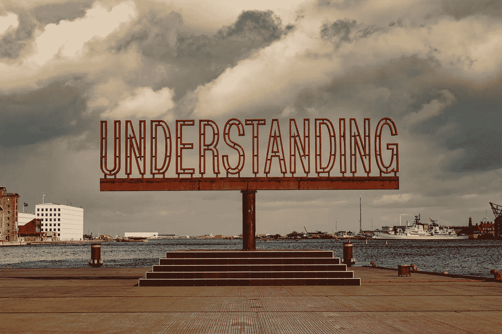
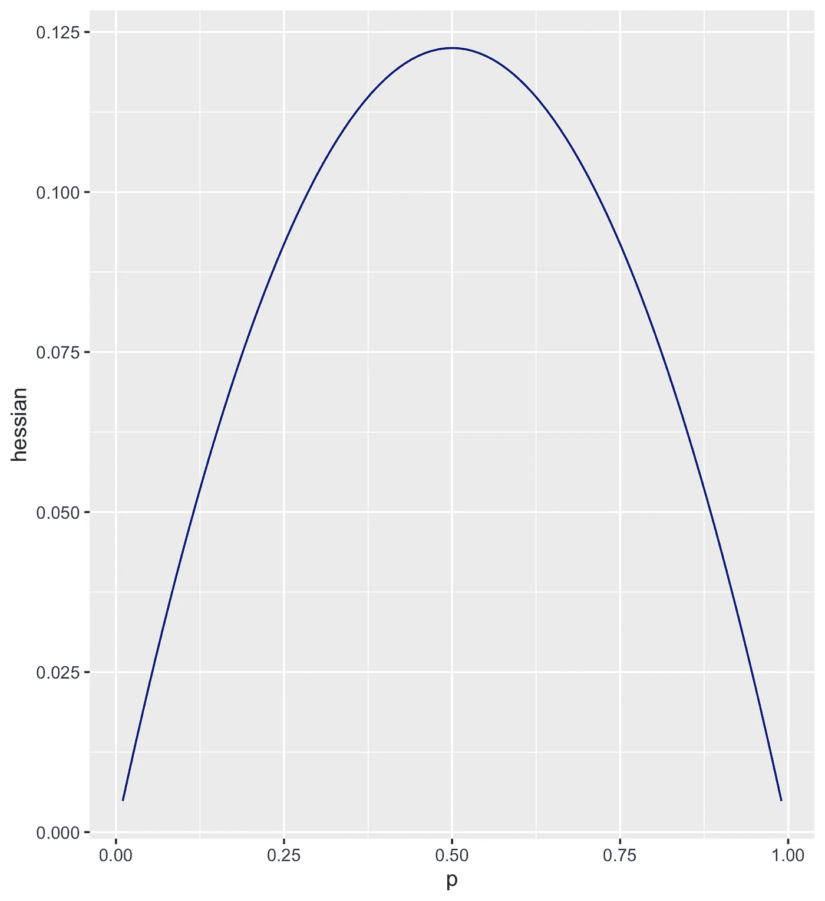

# 理解梯度推进决策树中的最小子权重

> 原文：<https://towardsdatascience.com/understanding-min-child-weight-in-gradient-boosting-decision-trees-293f2381306>

## **你真的知道这个超参数是怎么工作的吗？**



照片由 [Zuzana Ruttkay](https://unsplash.com/@zuzi_ruttkay?utm_source=unsplash&utm_medium=referral&utm_content=creditCopyText) 在 [Unsplash](https://unsplash.com/s/photos/understanding?utm_source=unsplash&utm_medium=referral&utm_content=creditCopyText) 上拍摄

建模工作中最具创造性和神秘的一个方面是超参数设置。这也是许多人在没有真正试图理解细节的情况下，随意遵循指南的地方。如果你恰好是这些人中的一员，那就让我们改变这一切吧！

在本帖中，我们将深入探讨名为`min_child_weight`的超参数。在我倾向于使用的 GBDT 包 LightGBM 中，这个参数有几个其他的别名，我个人认为`min_sum_hessian`是一个更好的名字，这也是我们实际上将要使用的名字。

在本帖中，我们将:

*   看看可用的文档，
*   定义如何为三个不同的模型目标计算 hessian，
*   总结经验法则，帮助用户掌握 min_sum_hessian 参数的大小，
*   最后，收集一些更棘手的、不太广为人知的方面。

我在示例中使用的完整脚本可以在我的 [GitHub](https://github.com/MatePocs/quick_projects/blob/main/lightgbm_min_sum_hessian.R) 上获得。这个例子是在 R 和 LightGBM 中，但是自然也适用于 Python / XGBoost。

# 文档怎么说？

## LightGBM

让我们看看 [LightGBM](https://lightgbm.readthedocs.io/en/latest/Parameters.html) 对这个超参数有什么看法。与 LightGBM 一样，同一个参数使用了一堆不同的别名，这些别名都代表同一个东西:`min_sum_hessian_in_leaf`、`min_sum_hessian_per_leaf`、`min_sum_hessian`、`min_hessian`和`min_child_weight`。

LightGBM 文档对此超参数的定义是:“*一片叶子中的最小和 hessian”*。我想我们都同意，这并不完全有用...

## XGBoost

XGBoost 文档更有帮助(根据我的经验，这种情况很常见)。这是定义:

*“一个孩子所需的最小实例体重总和(黑森)。如果树划分步骤导致实例权重之和小于* `*min_child_weight*` *的叶节点，那么构建过程将放弃进一步的划分。在线性回归任务中，这只是对应于每个节点中需要的最小实例数。* `*min_child_weight*` *越大，算法就越保守。”*

我认为这是一个很好的总结。在树发展的每一点上，数据中的每一个观察值都有一个所谓的 hessian 值。为了考虑分裂，两个孩子的观察值必须具有至少与超参数值一样高的 hessian 值之和。

所以我想我们现在唯一需要弄清楚的就是所谓的黑森是什么。

# 观测值的海森值

## 理论

来自 XGBoost 的这个[文档给出了一个很好的数学背景的高层次总结，即使它跳过了一些概念，比如学习率。](https://xgboost.readthedocs.io/en/stable/tutorials/model.html)

理论上，hessian 应该是基于实际值和预测值的损失函数相对于预测值的二阶导数。一阶导数叫做梯度。

例如，假设您想要最小化平方差，那么您正在使用默认回归模型:

```
loss: (actual_value - predicted_value) ^ 2
gradient: - 2 * (actual_value - predicted_value)
hessian: 2
```

然而，这种理论方法在实践中并不准确…

## 实践

我认为对黑森的一个更有用的定义是:

> 特定目标的 hessian 是实际值和预测值的函数，正如您正在使用的梯度增强包的源代码中所定义的那样。

查看软件包的源代码总是一个好主意，而不是假设可能会发生什么。对于 LightGBM，目标函数存储在 GitHub 的这个[文件夹中。假设我们正在寻找回归目标，这些都在这个](https://github.com/microsoft/LightGBM/tree/master/src/objective)[脚本](https://github.com/microsoft/LightGBM/blob/master/src/objective/regression_objective.hpp)中。

(LightGBM 命名我们需要牢记:`label`是实际值，`score`是预测值。如果目标使用链接函数(例如，具有对数链接的泊松)，两者都是在应用链接函数之后。)

## 重量的快速说明

以下**仅适用于未加权的例子。**如果您传递一个权重向量，单个 hessian 值将与它相乘，并且它将反馈到`min_sum_hessian`参数调节的方式中。

## L2 回归目标

事不宜迟，这就是我们在[代码](https://github.com/microsoft/LightGBM/blob/master/src/objective/regression_objective.hpp)中寻找的部分(在撰写本文时大约在第 440 行):

L2 回归梯度和海森计算

正如我们所见，他们简化了我们上面计算的公式，并将梯度和 hessian 除以 2。

> L2 回归目标中观测值的海森常数是 1。经验法则非常简单:min_sum_hessian 实际上意味着这个目标的观察次数。如果将 min_sum_hessian 设置为 X，树将只在两边至少有 X 个观察值的地方进行切割。

## 泊松目标

现在，让我们看看一个更困难的目标。

假设观察值遵循泊松分布的可能性(来自[泊松分布](https://en.wikipedia.org/wiki/Poisson_distribution)函数):

```
likelihood = predicted_value ^ actual_value * 
exp(-predicted_value) / factorial(actual_value)
```

对数可能性:

```
log-likelihood = actual_value * log(predicted_value) - predicted_value - log(factorial(actual_value))
```

然而，我们实际上并没有对预测值进行建模，该模型假设了最终预测值和原始分数之间的对数关系。(是的，这里有几个不同的日志，必须小心！)我们可以用下面的表达式重写上面的公式:

```
raw_score = log(predicted_value)
```

收件人:

```
log-likelihood = actual_value * raw_score - exp(raw_score) - log(factorial(actual_value))
```

损失函数就是对数似然乘以-1:

```
loss = - actual_value * raw_score + exp(raw_score) + log(factorial(actual_value))
```

由`raw_score`取损失函数的一阶和二阶导数来分别计算梯度和 hessian，这就是我们得到的结果:

```
gradient = exp(raw_score) - actual_valuehessian = exp(raw_score)
```

现在让我们将其与[源代码](https://github.com/microsoft/LightGBM/blob/master/src/objective/regression_objective.hpp)进行比较(在撰写本文时大约在第 440 行):

泊松回归梯度和海森计算

非常接近我们得出的结果，但是公式中的`max_delta_step`是什么？原来 XGBoost 和 LightGBM 都在他们的泊松海森计算中加入了一个隐藏的额外因素。`max_delta_step`默认为 0.7。这增加了 hessian，因为我们要用它来划分，以得出新的预测，这将导致一个更保守的树构建，步长更小。本质上与使用较低的`learning_rate`是一样的。

> 泊松回归目标中观测值的 hessian 值是当前预测值乘以 exp(0.7) ≈ 2。如果将 min_sum_hessian 设置为 X，树将只在两边至少有 X / 2 个预测总值的地方进行切割。

请注意，`min_sum_hessian`在不同的回归目标之间具有完全不同的含义！

## 二元目标

让我们看看另一个共同的目标，二元分类，这是迄今为止最复杂的三个，我们将在这里考虑。(如果你感兴趣，我写了另一篇文章来介绍这个目标的更多细节。我们现在只关注黑森人。)

我们需要从损失函数开始。对于任何给定的 y 观察值，其中 y 可以是 0 或 1，模型将预测(0，1)范围内的概率 p(y)。我们希望最小化的损失函数:

```
loss = - y * log(p(y)) - (1-y) * log(1-p(y))
```

这就是所谓的日志丢失功能。对于为 1 的观察值，它是`log(p(y))`，对于为 0 的观察值，它是`log(1-p(y)))`。

现在，就像泊松分布一样，虽然最终产品是 p(y)值，但该模型不会与 p(y)本身一起工作，而是与一个称为 sigmoid 的链接函数一起工作。模型实际适合的`raw_score`是:

```
raw_score = log(p(y) / (1-p(y))) / sigma
```

其中 sigma 是一个常量参数，默认值为 0.7。

根据上面的公式，

```
p(y) = exp(raw_score * sigma) / (1 + exp(raw_score * sigma))
```

我们需要在原始损失函数中插入这个表达式，以获得梯度增强算法将使用的格式。为了简单起见，让我们集中于取值为 1 的观察值，即损失函数的前半部分。

```
loss_positive = - y * log(p(y)) = - log(exp(raw_score * sigma) / (1 + exp(raw_score * sigma)))
```

梯度是上述公式相对于`raw_score`的导数。在 2-3 步的算术魔术中，我们得到梯度:

```
gradient_positive = - sigma / (1 + exp(raw_score * sigma))
```

取二阶导数，我们得到了 hessian:

```
hessian_positive = sigma ^ 2 * exp(raw_score * sigma) / ((1 + exp(raw_score * sigma)) ^ 2)
```

我们来看看[源代码](https://github.com/microsoft/LightGBM/blob/d517ba12f2e7862ac533908304dddbd770655d2b/src/objective/binary_objective.hpp)！相关部分(在撰写本文时大约在第 105 行):

二元分类梯度和 Hessian 计算

与 L2 和泊松目标不同，这有点难以分辨，但是公式与我们计算的公式相同(对于阳性情况)。查看我的[二进制分类脚本](https://github.com/MatePocs/quick_projects/blob/main/lightgbm_binary.R)的结尾，进行一些检查。

我不知道你怎么想，但我很难理解在这种情况下黑森的强度应该是多少，所以我做了一个图表:



在二元对数损失计算中作为概率函数的 Hessian

由于损失函数的对称性质，对于取值为 0 的观测值，我们不必重复它。

> 二元分类目标中观察值的 hessian 是当前预测概率的函数。在 p = 0.5 时，取最高值 0.1225。其含义非常有趣:相同的 min_sum_hessian 参数可能会限制更接近 0 或 1 的概率预测，但不会限制更接近 0.5 的概率预测。换句话说，在预测值接近 0.5 的情况下，即模型对分类不确定的情况下，模型在进行分割时是最宽松的。

# 你知道吗…？

为了证明我的观点`min_sum_hessian`不容易理解，这里有一些我认为经常被忽略的评论。

`min_sum_hessian`是…

1.  …与一片叶子中的数据数量不同，并且取决于目标，它甚至可能与观察的数量不成比例。
2.  …并不是在过程的每一步都以相同的方式进行调整-随着您添加更多的树，相同数据点的 hessia 可能会发生变化，这取决于您的目标，这意味着同一组观察值的 hessia 总和可能会发生变化，无论它们是在`min_sum_hessian`之上还是之下。
3.  …如果在计算中加入重量矢量，情况会更复杂。需要记住的事实是，单个的 hessian 值会乘以权重。
4.  …仍然是关于树枝和树叶大小的最佳测量方法，没有其他超参数可以让您简单地限制观察次数。看似让您限制观察次数的超参数实际上是基于 hessian 值的估计。

[](https://matepocs.medium.com/membership) [## 加入我的推荐链接-伴侣概念

### 作为一个媒体会员，你的会员费的一部分会给你阅读的作家，你可以完全接触到每一个故事…

matepocs.medium.com](https://matepocs.medium.com/membership)