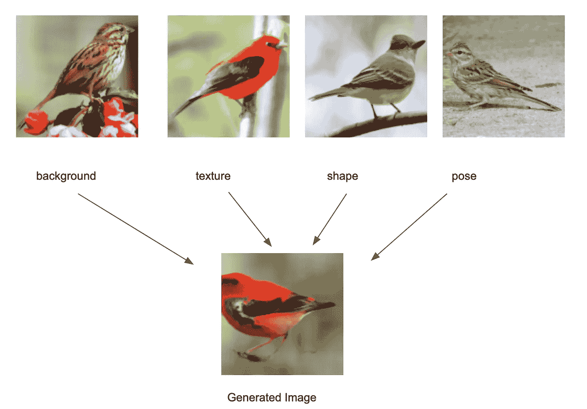
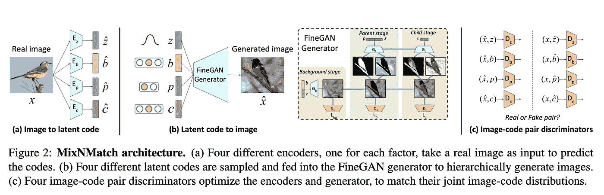
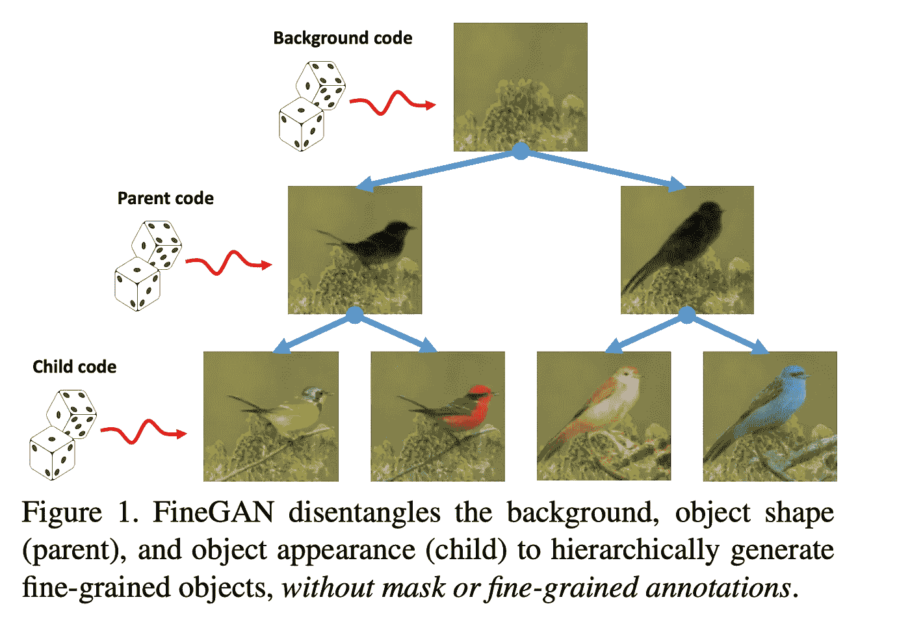

# 了解 MixNMatch:创建更真实的合成图像

> 原文：<https://towardsdatascience.com/understanding-mixnmatch-creating-a-more-realistic-synthetic-image-40f9ba039689>

## 将多个真实图像中的不同因素组合成一个合成图像

图 MixNMatch 创成式模型的概述

我最近偶然发现了这篇名为 [MixNMatch](https://arxiv.org/pdf/1911.11758.pdf) 的论文，该论文旨在将多个真实图像中的不同因素组合成一个单一的合成图像——只需最少的监督。这篇文章旨在详细说明，并要求一些深度学习和生成模型的背景。如果你正在寻找一个 TLDR；版本，你可以在这里查看我的推特帖子。

如果你喜欢这个帖子，请分享给你的网络。

# 摘要

在其核心，MixNMatch 是一种使用条件生成对抗网络(GAN)的条件图像生成技术。MixNMatch 将来自不同实像的多个因子解开并编码成一个单一的合成图像。具体来说，它将不同真实图像的图像背景、姿态、形状和纹理组合成一个单一的合成图像，只需最少的监督。

> 在训练过程中，MixNMatch 只需要一个松散的包围盒来模拟背景，而不需要物体的姿态，形状或纹理。

# 问题

在最少监督的情况下学习解开表示是一个极具挑战性的问题，因为产生数据的潜在因素通常是高度相关和交织的。

*   有大量工作通过拍摄两个输入参考图像来理清两个因素。例如-一个参考图像用于外观，另一个用于姿势。但他们不能理清其他因素，如前景与背景外观或姿势与形状。由于只有两个因素可以控制，这些方法不能随意改变，例如，对象的背景，形状和纹理，同时保持其姿势不变。
*   另一组工作需要以关键点/掩模注释的形式进行强有力的监督；限制了它们的可伸缩性，并且仍然无法理清 MixNMatch 中列出的所有四个因素

# 主要思想

MixNMatch 学会在最少监督的情况下，从真实图像中解开并编码背景、对象姿势、形状和纹理潜在因素。为了实现这一点，他们提出了一个可以同时学习的框架

*   编码器，其将来自真实图像的潜在因素编码到解开的潜在代码空间中，以及
*   一种从解开的代码空间中提取潜在因素用于图像生成的生成器。

图 2:来自[的 MixNMatch 架构在这里](https://arxiv.org/pdf/1911.11758.pdf)

MixNMatch 的生成器建立在 [FineGAN](https://arxiv.org/abs/1811.11155) 的基础上——这是一个生成模型，它学习使用信息论在最少监督的情况下分层理清背景、对象姿势、形状和纹理。

图 FineGAN 如何从[这里](https://arxiv.org/abs/1811.11155)工作

然而，FineGAN 仅取决于采样的*潜在代码*，而不能直接取决于用于图像生成的真实图像。因此，我们需要一种方法来从真实图像中提取控制背景、物体姿态、形状和纹理的潜在代码，同时保留 FineGAN 的层次分解属性。那么我们有什么选择呢？

*   FineGAN 的简单扩展；意思是——训练一个编码器将假图像映射成潜在代码。这是行不通的，因为真实图像和虚假图像之间的域差距
*   执行对抗学习，由此学习真实图像及其从编码器提取的潜在代码的联合分布，以及采样潜在代码和来自生成器的相应生成图像的联合分布，以使其不可区分，类似于阿里和甘比

*对抗式学习方法的优势是什么？*

> 通过实施匹配的联合图像码分布，编码器学习产生与采样码的分布相匹配的潜在码，该潜在码具有期望的解纠缠特性，而发生器学习产生真实的图像。

更具体地说，对于每个真实图像 x，作者提出四个单独的编码器来提取其 *z、b、p、c* 码。但是，您不希望将这些代码直接放入生成器来重建图像。因为这将把这个模型变成一个“简单的”自动编码器。这并没有保留 FineGAN 的解缠结特性(分解成背景、姿势、形状、纹理)。因此，作者利用阿里和甘比的想法来帮助编码器学习逆映射；即从实像到代码空间的投影，以保持期望的解缠结属性的方式。

# 方法

因为 MixNMatch 是基于 FineGAN 的，所以让我们先快速回顾一下 FineGAN 是如何工作的。

## FineGAN 如何工作

作为输入，FineGAN 采用四个随机采样的嵌入，又名。潜在代码( *z，b，c，p* )如图 2 所示。然后，它分三个阶段分层生成图像(图 3)。

*   阶段 1:背景阶段，模型只生成背景，以潜在的一键背景码 *b* 为条件
*   阶段 2:父阶段，模型根据潜在的一键父代码 *p* 和连续代码 *z* 生成物体的形状和
    姿态，并将其缝合到现有的背景图像上
*   阶段 3:子阶段，模型填充物体的纹理，以潜在的一键子代码 *c* 为条件

在父阶段和子阶段，FineGAN 还会生成对象的遮罩，以便在没有监督的情况下捕捉形状和纹理。

> *在训练期间，FineGAN 实施了两个约束*

1.  约束#1:它将子代码分组到一个不相交的集合中，因此每个集合包含相同的父代码。例如，这种约束使得不同种类的鸭子具有相同的形状但不同的质地。
2.  约束#2:它还强制要求对于每个生成的图像，子代码和背景代码对总是相同的——这意味着鸭子的背景总是有水

【FineGAN 如何理清不同的特征？

*   为了解开背景，FineGAN 依赖于对象的边界框。
*   为了理清其他因素，FineGAN 依赖于 InfoGAN [5]中的信息论，并在潜在代码的关系之间施加约束。

## MixNMatch 和 FineGAN 有什么不同

> MixNMatch 的主要思想是执行对抗学习，使得由编码器产生的成对图像码分布和由生成器产生的成对图像码分布相匹配。MixNMatch 处鉴频器的输入是一个图像码对。

## *在 mix match*解缠绕是如何工作的

FineGAN 强加的约束对于真实图像可能是困难的。如果你回顾约束#2，你会发现它并不总是成立的。例如，鸭子可能不总是在水里。因此，为了绕过约束#2，作者采用了以下步骤

*   训练四个独立的鉴别器，每种代码类型一个。这防止了任何鉴别器看到其他代码，因此不能基于代码之间的关系进行鉴别。
*   在训练编码器时，用随机采样的代码生成的假图像也被提供作为输入。这些随机采样的代码消除了这些限制。这意味着，在这些生成的图像中，任何前景纹理都可以与任何任意背景和任意形状相结合。

## 如何捕捉精确的姿势和形状

到目前为止，我们已经了解了 MixNMatch 如何将图像的 4 个不同方面分开，并将其编码成代码。然后，MixNMatch 的生成器将这 4 个因素结合起来，生成“真实”的合成图像。作者称这个过程为“代码模式”。

但是“编码模式”不能保持精确的*像素级*姿态和形状，而这对于某些应用是必要的。为什么它不能保持精确的像素级？因为姿势/形状的潜在代码维度不够大，不足以捕捉那些细粒度的特征。为了解决这个问题，作者引入了一种叫做“特征模式”的东西

> 关键思想不是将参考图像编码成低维形状码，而是直接学习从图像到高维特征空间的映射，该映射保持参考图像的空间对齐的形状和姿态(像素级)细节。

您可以在论文的第 3.4 节中找到更多相关信息。

# 参考

1.  Krishna Kumar Singh、Utkarsh Ojha 和 Yong Jae Lee。*用于细粒度对象生成和发现的无监督分层解缠*。在 CVPR，2019 年。
2.  杰夫·多纳休、菲利普·克亨布尔和特雷弗·达雷尔。*对抗性特征学习*。2017 年在 ICLR。
3.  文森特·杜穆林、伊斯梅尔·贝尔加齐、本·普尔、亚历克斯·兰姆、马丁·阿约夫斯基、奥利维尔·马斯托皮埃罗和亚伦·库维尔。*对抗性学习推理*。2017 年在 ICLR
4.  [迈赫迪·米尔扎](https://arxiv.org/search/cs?searchtype=author&query=Mirza%2C+M)，[西蒙·奥森德罗](https://arxiv.org/search/cs?searchtype=author&query=Osindero%2C+S) *条件生成对抗网*
5.  陈曦、闫端、雷因·胡特夫特、约翰·舒尔曼、伊利亚·苏茨基弗和彼得·阿贝耳。Infogan: *通过信息最大化生成对抗网的可解释表示学习*。在 NeurIPS，2016。