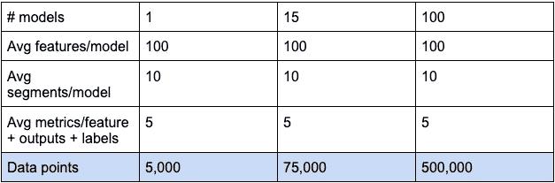

# 了解 ML 监控债务

> 原文：<https://towardsdatascience.com/understanding-ml-monitoring-debt-5052bba60c2c>

## *本文是正在进行的系列文章的一部分，该系列文章探讨了监测债务的洗钱问题、如何识别债务以及管理和减轻债务影响的最佳实践*

只是另一只被他的模型监控仪表板压垮的猫|图片由[101 猫](https://www.istockphoto.com/portfolio/101cats?mediatype=photography)通过 [iStock](https://www.istockphoto.com/)

我们都熟悉软件工程中的技术债务，在这一点上，[ML 系统中隐藏的技术债务](https://proceedings.neurips.cc/paper/2015/file/86df7dcfd896fcaf2674f757a2463eba-Paper.pdf)实际上是教条。但是什么是 ML 监控债务呢？ML 监控债务是指当模型监控被它要监控的 ML 系统的规模所淹没时。让从业者在大海捞针，或者更糟的是，点击“删除所有”的警告。

ML 监控远不如传统 APM 监控那样清晰。不仅在指标和基准方面没有绝对的真理，而且模型也不受规模经济的影响。很容易构建一个新的 Kubernetes 集群，该集群将遵循与其前身相同的性能指标、基准、阈值和 KPI。但是，当您部署一个新的模型时，即使它是一个预先存在的模型，并且没有对工件进行更改，实际上可以保证您的引用将会不同。这意味着您正在为部署到生产和监控中的每个模型承担债务。

> 什么是糟糕的绩效水平？
> 
> 80%的准确率？60%的准确率？

需要考虑多个因素来确定好/坏的性能水平，底线将根据每个模型的用例、细分市场以及数据而有所不同。在本帖中，我们将通过使用[“大数据的四个 V”](https://bernardmarr.com/what-are-the-4-vs-of-big-data/)框架来解释 ML 模型监控的债务维度，该框架非常适合这种比较。

# 1.诚实

## 高维度

测量和监控依赖于 2-3 个元素的数据驱动流程相当简单。但是 ML 就是利用大量的数据源和实体来定位潜在的、可预测的模式。根据问题和相关数据，您可能会看到几十个甚至成百上千个特性，每个特性都应该被独立监控。

## 模型度量

ML 是一个随机的面向数据的世界，由生产中的多个不同管道组合而成。这意味着需要跟踪和监控每个实体的大量指标和元素，例如数字元素和基数级别的特征均值、标准差和缺失值、熵，以及分类元素的更多信息。全面的模型指标超越了特性、数据和管道完整性，提供了可量化的指标来分析模型输入和输出的相对质量。

[Chip Huyen](https://medium.com/u/6c686c1afb42?source=post_page-----5052bba60c2c--------------------------------) 最近发布了一份[全面的模型指标清单](https://huyenchip.com/2022/02/07/data-distribution-shifts-and-monitoring.html#ml-metrics)，涵盖了值得检验的整个模型生命周期。

# 2.卷

ML 监控中的容量需要在两个维度上进行分析:吞吐量和粒度

## 吞吐量

模型通常处理大量数据，以实现决策过程的自动化。这给监控和观察数据集的分布和行为带来了工程挑战。监控解决方案需要在几分钟内检测到数据质量和性能问题，同时随着时间的推移分析大量数据流。

## 数据的分辨率

要在亚群体水平上检测事物，需要能够将数据分段，但这也是一个分析挑战。对于不同子群体下的相同指标，数据的性质和模型性能可能会有很大不同。

由作者在 [imgflip](https://imgflip.com/i/64g0py) 上创建

> 例如，一个名为“年龄”的特征的缺失值指示符通常在整个人群中占 20%，但是对于一个特定的频道，比如脸书，该值可以是可选的，并且在 60%的情况下是缺失值，而对于所有其他子人群，只有 0.5%的情况下是缺失值。

高级视图只能提供这么多信息，尤其是关于子群体和详细的解决方案的信息，这些信息对于支持业务需求和决策至关重要。影响整个数据集或群体的宏观事件是每个人都知道要注意的事情，通常可以相对较快地检测到。

但这意味着，在庞大的数据流中检测问题的工程和分析挑战，现在因需要监控的不同数据段的数量而成倍增加。

# 3.速度

模型以不同的速度服务于业务流程的自动化，从批量每日\每周预测到大规模的实时 ms 决策。根据您的使用情况，您需要能够支持不同类型的速度。然而，和体积一样，速度也有一个额外的维度，即管道速度。将整个推理流程视为持续改进的管道。为了在不破坏事物的情况下快速行动，你需要将延迟的反馈重新整合到你的 ML 决策过程中。

> 在一些用例中，例如 Ad-tech 实时竞价算法，我们希望监控每周的影响，因为我们需要能够在几分钟内检测到数据质量或性能问题，以避免业务灾难。

# 4.多样化

最后但并非最不重要的，我们来了变化。一个具有商业投资回报的成功模型跨越了更多的模型。一旦你克服了第一个模型障碍，并证明了 ML 对业务成果的积极影响，你的团队和你的业务都会想要复制这种成功并扩大规模。有三种缩放模型的方法，它们并不互相排斥。

## 版本

ML 是一个迭代的过程，版本是我们如何做的。现实世界不是一成不变的，管道和模型必须不断优化。为相同的现有模型不断地创建版本，但是每个版本实际上是一个完全不同的模型实例，可能具有不同的特性，甚至不同的基线。

## 用例规模

向您的武库中添加一个用例意味着您实际上是从零开始重新启动整个 MLOps 周期。您可以继承许多东西，尤其是当涉及到特性工程时，但是当您部署到产品时，您将有一个新的模型度量集和规模来监控。除了 ML 监控的技术方面之外，模型驱动业务流程，并且每个流程都与其他流程不同。对于同一个贷款审批模型，风险和合规团队可能担心由于监管问题而产生的潜在偏差，业务运营部门希望第一个知道模型是否突然决定全面拒绝贷款，ML 工程师需要了解完整性和管道问题，数据科学团队可能对模型预测的缓慢漂移感兴趣。关键是它是多学科的，你的利益相关者对 ML 决策过程的不同方面感兴趣。对于新流程，您需要确保快速交付价值。

## 多租户规模

多租户具有指数级的扩展能力。当一个租户本身就相当于一个群体时，就需要决定跨多个原则部署一个模型。例如，部署一个学习过程来检测潜在的客户流失，但要在每个国家单独进行(在本例中是租户)。结果是每个国家都有一个独立的模型。

作者于 [imgflip](https://imgflip.com/i/64g0py) 创建

做出这样的决定可以让你在一夜之间从一个单一的欺诈模型变成数百个欺诈模型。虽然他们可能共享相同的指标集，但预期的价值和行为会有所不同。

# 我们从债务监控模型中学到了什么

从表面上看，模型监控看起来似乎很简单。公平地说，对于一两个模型，如果您愿意投入资源，手动监控 ML 是可行的。但是在 ML 工程中，就像软件工程一样，一切都是债务和规模的问题。是否值得承担并在以后支付？模型监控不是一项简单的任务，从技术和流程的角度来看也不简单，随着规模的扩大，管理 ML 监控的难度也在增加。

> 4 V 说明了为什么模型监控是复杂的，作为量化这个问题的一个练习，让我们考虑以下数字:

简单的 ML 监控噪声计算|由作者创建

既然我们已经量化了洗钱监测固有的规模问题及其原因，下一步就是确定债务。本系列的以下部分将处理识别债务指标和最佳实践，以管理和克服模型监控债务。

敬请期待！

[*柳文欢·拉松*](https://www.linkedin.com/in/oren-razon/) *是*[*super wise*](https://www.superwise.ai)*领先的模型可观测性平台的联合创始人兼 CEO。为从业者提供完全自动化的企业级模型监控功能，这些功能需要花费数年时间在内部开发，包装在自助服务平台中。*