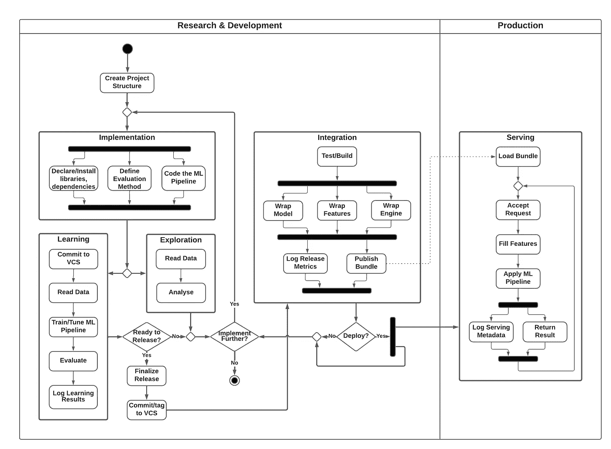
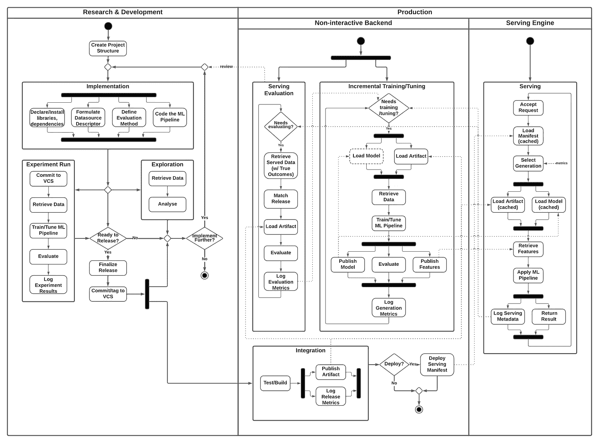
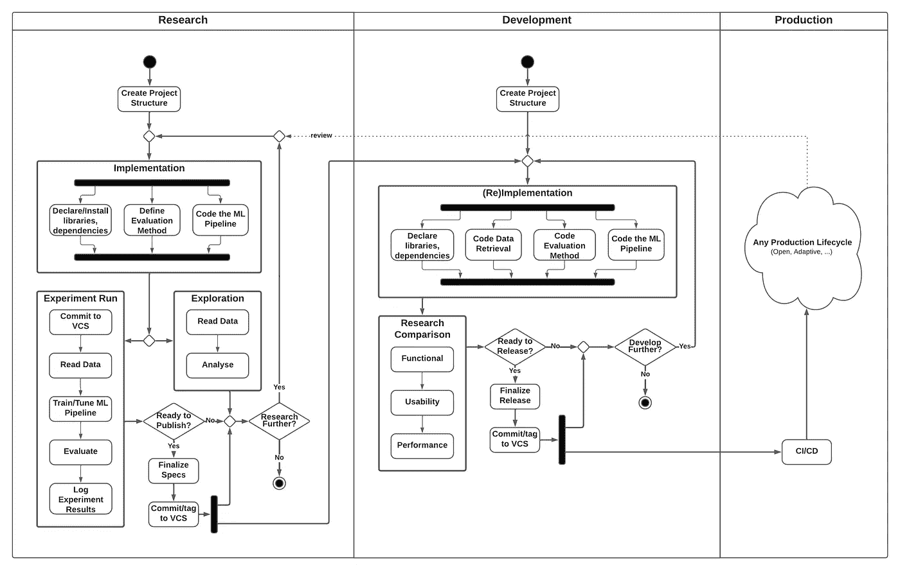

# 理解 ML-产品生命周期模式

> 原文：<https://towardsdatascience.com/understanding-ml-product-lifecycle-patterns-a39c18302452>

## 对 ML 驱动的产品的运营生命周期进行分类的指南，并对其显著模式进行概述

罗斯·斯奈登在 [Unsplash](https://unsplash.com?utm_source=medium&utm_medium=referral) 上的照片

与任何突破一样，作为实验室实验的一部分，证明数据科学问题的可行解决方案理所当然是一个激动人心的时刻。已经完成，我们已经破解了数据，现在*离通过推出我们的模型来加速我们的业务*只差*一步之遥。结果发现，这众所周知的最后一步很快就变成了一堆挑战。*

事实上，如果你搜索讨论*数据科学项目生命周期*主题的资源，它们通常会一直停留在许多基本阶段，直到最后一个阶段——神奇的*模型部署*——故事圆满结束。

但这并不是构成相关生命周期的唯一过程。很公平，严格地说，作为一个数据科学项目，它很可能就此结束。然而，对任何实际业务来说至关重要的是，还有产品视角，这伴随着许多跨越最终部署时刻的永久方面。

在这篇文章中，我们试图采取一种独特的方法来提取一些常见的模式(好的和坏的)，用于实现 ML 驱动的产品的实际生命周期。考虑到所有的复杂性，我们将有选择地选择正确的细节层次来捕获操作上重要的阶段。通过这种方式，我们可以缩小到足以忽略一侧的专业科学技术水平(例如特征工程)，但同时又可以放大到足以忽略另一侧的所有一般非技术阶段(例如客观定义)。我们还故意只关注 ML 相关的工作流，它驱动实际的封装数据产品(它本身可以是任何东西)。

## 目录

[主要属性导航景观](#60e5)
∘ [数据访问机制](#b967)
∘ [模型采购模式](#9eb9)
∘ [模型更新策略](#2a4c)
∘ [部署架构](#fe34)
∘ [R & D 联络](#8164)
[显著模式的分解](#0e9d)
∘ [交互生命周期(反模式)](#9c9b)
∘

# 浏览风景的主要属性

为了对不同的生命周期模式进行分类，我们确定了特定数据产品实现的一组主要属性(根据*功能概念*以及*交付原则*)，这将帮助我们建立一个简单的*分类法*。

## 数据访问机制

该属性与特定生命周期阶段内的数据检索过程相关。它直接反映了底层数据生态系统的成熟度(从混乱的数据孤岛到基于有意识的数据策略和治理的组织良好的数据湖)以及产品业务逻辑中*真实结果协调*路径(又名*反馈回路*)的正确实施。在我们的分类范围内考虑的两个实例是:

*   **程序化**数据访问是一个理想的概念，在这个概念中，数据可以有选择地按需进入生命周期，以交换某种形式的数据说明符。这种控制数据供应的能力是任何动态生命周期的基础。没有它，自动*正在评估*或*模型更新*等功能无法实现。
*   在另一端处理**特定的数据转储**是穷人对适当的数据基础设施的替代。尽管只允许臭名昭著的不幸的生命周期，但我们仍然经常看到这种方法，这就是为什么我们在列表中授予它一个典型的反模式。

## 模型采购模式

模型实例产生的不同可能方式由*采购模式*属性来表征。我们区分以下类型:

*   **无人值守**采购基于生产模型的培训、调试和评估阶段的完全自动化。消除过程中的任何手动步骤不仅对可重现性研究至关重要，而且对可靠操作尤为关键。这些原则在生产工程中很常见，但在实践数据科学中无疑仍难以被采用。
*   相比之下，**交互式**(手动)模型采购往往在最初的灵光乍现之后的匆忙中被天真地实践，那时有希望的实验室结果将尽快在生产中看到。这完全是对任何基本操作实践的无知，并且由于其固有的易出错性，以及缺乏再现性和操作可见性，它经常导致商业损失而不是预期的收益。

## 模型更新策略

非常缓慢变化或实际上静态的模式理论上可以使用在其生命周期中只训练一次的模型来概括。但是剩余的绝大多数有用的真实世界模型需要定期刷新，以反映观察到的现象的进展变化。简而言之，这就是*模型更新策略*属性所决定的:

*   强大的生命周期包含独立例程，用于**自主**处理模型更新——通过*增量训练*或*完全再训练*以及定期*超参数调整*。更新事件可以由固定的*时间表驱动，*由被服务请求的*数量*阈值更动态地触发，或者甚至可能响应于自动正在进行的模型*评估*的(拒绝)结果。这个概念将使用不同代码库版本(又名*版本*)产生的(同一项目的)模型与具有相同实现的模型区分开来，只是在不同的数据(又名*代*)上进行训练/调整。
*   没有专用更新例程的简单生命周期仍然可以实现**发布-强制**模型刷新-本质上允许通过主动重新访问 R&D-生产过渡(即发布)来更新模型，这包括模型培训/调整以及随后的部署。与自主模型更新策略不同，这个生命周期没有*代*的概念(同一个项目的每一个模型——无论是基于不同的代码还是仅仅基于数据——都是作为一个新的版本产生的)。

## 部署架构

使用*部署架构*属性来描述模型最终投入使用的机制(对所提供的输入进行预测)。它将生命周期分为以下几类:

*   作为发布集成过程的一部分，模型**包装**概念是基于将模型(和所有相关资产)直接硬连接到服务组件(引擎)中。由于集装箱化的普及，这成为一种非常实用的方法，其主要优点是简单。另一方面，它缺乏(以其典型的形式)从发布的工件内部对*部署策略*(例如，A/B 测试、多臂土匪、冷启动/回退模型……)的直接控制，不得不将责任从项目级别转移到灵活性较低的基础设施级别。
*   **动态**模型(资产)加载是一个更健壮的原理，允许通用服务引擎(仍然可能是容器化的)在运行时从专用注册表和存储中动态加载特定模型及其资产。这样，首次展示策略可以作为*选择器函数*灵活地交付，当分派预测请求以选择最合适的模型生成时，服务引擎直接应用该函数。然而，这种方法带来了明显更高的复杂性(例如，必须支持加载由不同模型使用的同一库的多个版本，等等。)

## R&D 联络处

用于研发生命周期阶段的特定方法——即这两个分支之间的交互——是由 *R & D liaison* 属性处理的方面:

*   传统的**双**周期有效地将*研究*和*开发*分离为两个不同的能力领域，由专门的团队执行——数据**科学家*，他们负责找到并证明解决方案，以及*软件工程师*，他们负责交付产品级的实现。然而，这伴随着工作重复(两个实现)、长时间的迭代(R & D 团队之间的交接)、额外测试的需求(研究结果比较)和工具(使用研究工具的生产故障排除)等形式的低效率。*
*   *另一方面,**联合**循环是一种整合两个领域的方法，旨在消除双循环的低效率。这无异于直接从研究中交付生产级解决方案。尽管如此，当采用正确的工具(解决常见工程问题的框架和 SDK)和实践(技术和管理)时，这实际上并不是完全不可能的。当然，还要选择正确的生命周期模式！*

# *显著模式的分解*

*使用概述的属性，我们现在可以描述以下主导当今行业的生命周期集(或它们的代表性变体)。我们用突出重要阶段的流程图来说明每个阶段。*

## *交互式生命周期(反模式)*

> **分类:* ***交互地*** *采购，用* ***发布-强制*** *更新，* ***包裹*** *部署，* ***联合*** *R & D，典型地基于* ***临时数据转储****

*从一个深刻的*反模式*开始，*交互*生命周期包含了许多之前确定的不良实践。顾名思义，它直接在实施者的工作区(例如 IDE 或笔记本)中交互式地执行所有预部署步骤。它通常只是出于无知而被追求，很快就会发现其固有的问题。*

**

*互动生命周期(*作者图片*)*

*内部 R&D 环路包括三个主要的交错级:*

1.  ***实施**是将解决方案具体化的实际过程。从概念上讲，它包括安装所需的库，定义评估方法(损失函数)，当然，还有编码 ML 管道。*
2.  ***勘探**阶段涉及所有必要的数据检查，以推动后续实施(顺便提一下。不要被流程图建议的先实现后探索的明显优先顺序所迷惑(这似乎与常识相冲突)——由于它们的交替，这两个阶段的顺序是相当虚幻的；但是因为这都是从至少安装一些库开始的(这是实现的一部分)，所以这个图实际上是合法的。*
3.  *最后，**学习**阶段包括手动运行已实现的 ML 管道以*调整/训练*实际模型，随后是其*评估*以定性地基准测试解决方案。为了保持至少某种程度的可再现性，它应该不变地将学习结果与其实际实现联系起来(例如，通过 VCS 提交)。如果发布，生产的模型(资产)的完全相同的实例成为发布包的一部分。*

*一旦对*学习*结果感到满意，生命周期可以通过*发布*流程进入*集成*并最终进入*部署*阶段，如下所示:*

1.  *Release **finalization** 涉及完成发布所需的所有剩余元信息。在这一点上，释放应再次在 VCS 不变的标签，以保持其再现性。*
2.  ***集成**阶段(通常仍然是交互驱动的)处理生成可部署的服务包(例如容器映像)*包装*模型及其所有相关资产(ML 代码、模型状态、可能是预先生成的特性的静态目录，否则这些特性将保存在特性存储中，等等。)以及实际的服务引擎(例如 REST 服务器)。任何集成都应该经过合理的*测试*(包括流程的输入和输出)。*
3.  *成功的集成可能会继续进行实际的特定于基础设施的**部署**流程，从而进入*服务*阶段。无论哪种情况，循环的 R & D 部分到此结束。*

*启动时，**服务**引擎加载包装好的包并进入服务循环，对于每个接受的请求，服务循环简单地利用嵌入的资产运行预测管道，并返回结果。*

*在这里，交互生命周期实际上结束了。基于直接持续评估的关键反馈通常作为运营监控的支柱和潜在后续 R&D 迭代的基础，*由于缺乏计划数据访问而无法实施*。与一般的*不可再现性*一起，这是前几节单独描述的不同其他问题中最严重的两个缺点。*

## *开放生命周期*

> **分类:* ***无人值守*** *采购，* ***发布——威逼利诱*** *更新，* ***裹*** *部署，* ***联合*** *R & D，* ***程序化*** *数据访问。**

*解决*增量*工作流的主要问题，*开放生命周期*是 ML 产品生命周期的第一个有价值的模式。然而，它对一般产品**架构**有更强的要求，即依赖于以下数据检索能力:*

*   *一个**查询 API** ，允许有选择地获取数据增量*
*   *事件-结果**反馈回路**，这是一个外部协调路径，为系统预测的每个事件提供真实结果的知识*

**

*开放生命周期(*图片作者**

**打开*和之前描述的*交互*生命周期之间的差异已经在 R & D 部分开始:*

1.  ***实现**阶段包含一个额外的步骤*制定数据源描述符*，这是一个特定于技术的表达式，允许使用平台数据访问 API 按需检索所需的数据。*
2.  ***实验**阶段涵盖了与交互生命周期的*学习*阶段几乎相同的步骤，然而，这一次，在其范围内产生的任何资产都不会成为最终发布的捆绑包的物理部分。*

*关键区别在于**非交互式生产后端**的独特部分，其职责如下:*

1.  *为了使**集成**(包括模型培训)无人值守，有一个专门的代理在触发发布时自动接管该过程。这与*持续集成*概念没有什么不同——通用软件开发中事实上的标准。生成的包仍然直接*将所有资产与服务引擎一起*包装。*
2.  *第二个后端代理负责正在进行的**服务评估**。这是一个预定的或容量驱动的循环，本质上是根据真实结果评估预测结果，并将其作为真实模型性能指标进行报告。*

*这才是真正的不同之处。有了这些功能，我们实际上可以完成一个体面的 ML 生命周期，包含生产运营所需的所有基本质量。标签 *open* 反映了这样一个事实，由于其*发布强制*更新机制，外部生命周期不会自动迭代，使得模型在重新发布之前实际上是静态的。将模型直接包装在服务包中，生命周期也不直接支持任何*动态* *展示*策略(例如 A/B 测试等)。).但是考虑到特定产品的特性，所有这些都是可以接受的。*

## *适应性生命周期*

> **分类:* ***无人值守*******自主*** *更新，* ***动态*** *部署，* ***联合****R&【D】****程序化*** *数据访问***

**这是 ML 生命周期中的巅峰之作，结合了所有主要特性的精华。除了*开放生命周期*的所有优势之外，它还增加了对*自动模型更新*(以模型生成的形式)以及*动态展示策略*的支持。抛弃了直接包装在服务包中的模型资产的概念，这个生命周期以其对**模型注册中心**和(可选的)**特性库**的依赖的形式对平台服务提出了新的要求。**

****

**适应性生命周期(*图片作者*)**

**虽然 R&D 部分与之前的*开放生命周期*完全相同，但生产端是所有进步的源头:**

1.  ****集成**过程不再涉及模型训练，它仅仅产生一个特定版本的所有代通用的裸软件工件。**
2.  **最终的**部署**包括发布一个服务*清单*，它包含在运行时用于分派请求 *s* 的生成*选择器函数*。**
3.  **非交互式后端现在包含一个额外的代理，负责**培训/调整**新的模型生成。这是一个使用项目定义的函数(将各种运行时度量作为输入，包括例如最近的评估性能)触发的循环，以刷新模型，即产生发布到专用模型注册中心的新一代，服务引擎可以从中挑选它们。**
4.  **没有任何资产与它直接捆绑在一起，服务于引擎的**更加通用。为了选择最佳的模型/生成来进行实际的预测，使用来自已部署的*清单*的*选择器函数*来分派每个请求。该功能的输入可以(不仅仅)是任何可用的运行时*指标*，允许它有效地实施任意的*动态部署策略*(例如，A/B 测试、多臂土匪、冷启动/回退模型等。).****
5.  **最后，**评估**代理现在也非常通用(与特定的模型发布资产解耦)，必须基于被评估的(元)数据提取相关的工件。**

**这涵盖了*适应性生命周期*的高级设计。它的优势在于能够自动响应观察到的模式变化(在原始列车时间内未知)，方法是动态选择冷启动/回退模型，或者根据新数据不断更新模型。然而，其代价是后端代理和服务引擎的更高的复杂性，以及在所有不同的存储(模型/工件注册、特性存储、清单目录、度量/元数据数据库/总线等)方面增加的基础设施需求。).**

## **双生命周期**

> ***分类:* ***双重*** *R & D、* ***程序化*** *数据存取、* ***无人值守*****

***作为最后一个(半)模式，让我们简要介绍一下*双生命周期*的一个实例。我们呈现它的方式使它成为一个不完整的模式——使生产部分开放，因为它可以从剩余主要属性的任何可能组合中潜在地派生出来。***

******

***双生命周期(*作者图片*)***

***生命周期的双重性从研究和开发阶段之间的明确分离中显而易见，这对应于由两个专家团队产生的两个不同的可交付成果。虽然**研究**阶段有许多类似于之前描述的生命周期的阶段，但它的目标是产生(经过验证的)解决方案*规格*。然后是**开发**角色接管它，并将其转化为生产就绪*实现*。***

***如上所述，双循环的主要问题是低效率导致的高成本。少数可能证明这一点的场景是对工程质量有最高要求的高度专业化的用例(例如，超低延迟)。不属于这一类，对这种模式并不陌生的其他地方是较大的传统软件公司，通常在误导性的尝试中采用这种模式，以赶上所有嗡嗡作响的数据炒作。***

***识别任何复杂问题空间中的模式是理解它的最佳起点。在这篇文章中，我们提出了一个简单的分类法来对 ML 产品生命周期进行分类，并用它来描述一些值得注意的模式。为了有目的地为他们的产品选择正确的选项，对这些模式的认识对于任何参与设计 ML 生命周期的人来说都是必不可少的。***