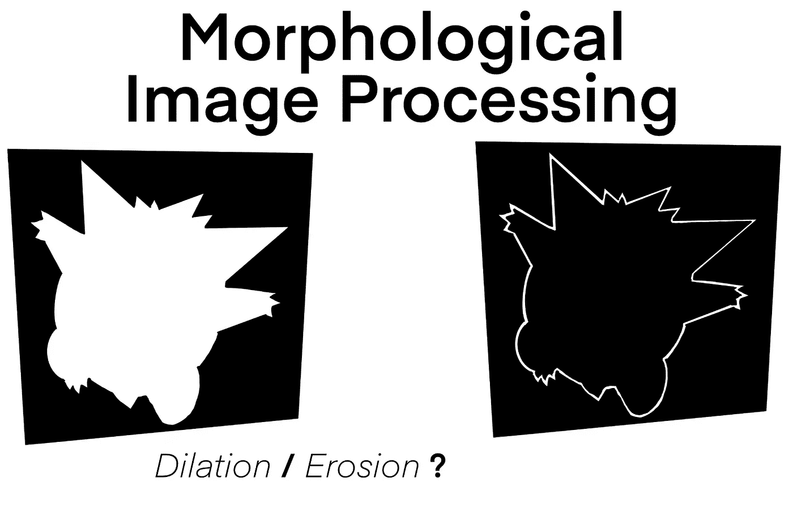
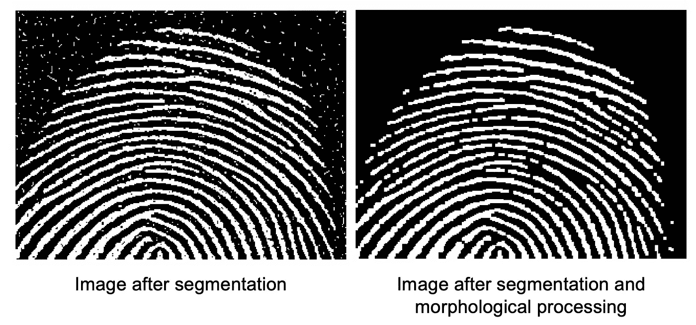
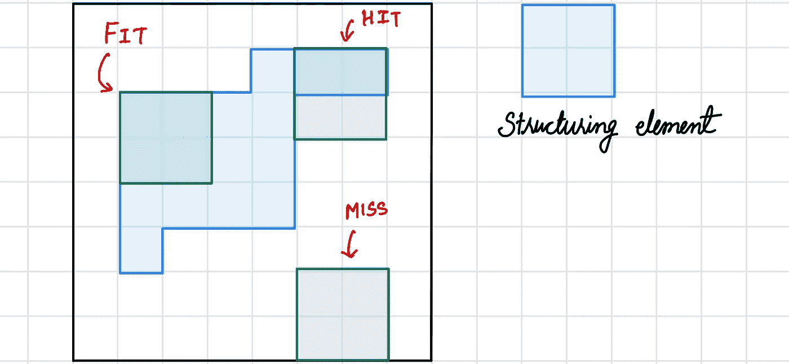
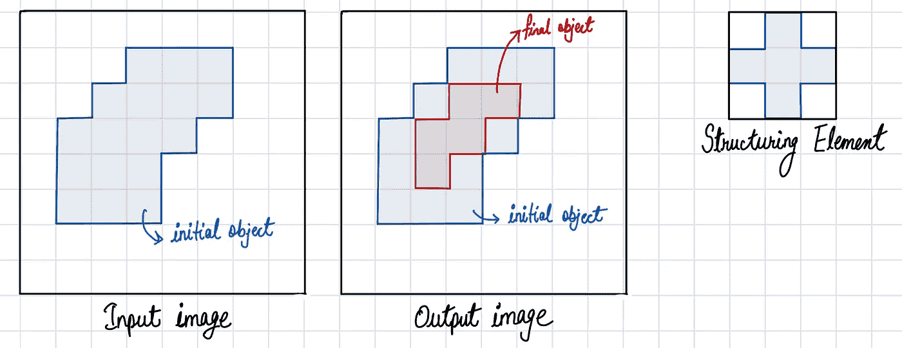
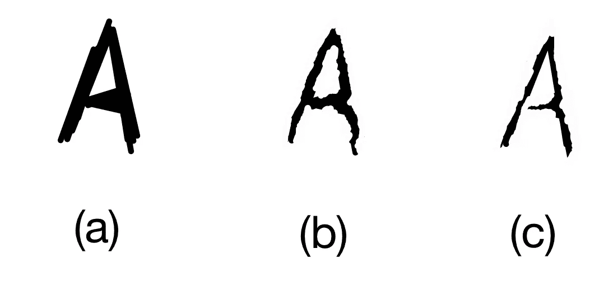
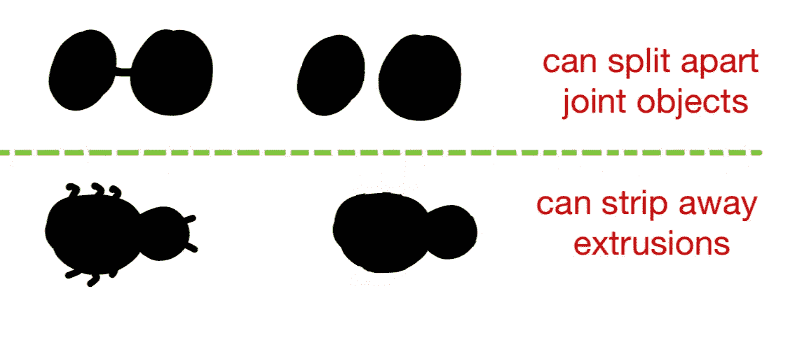
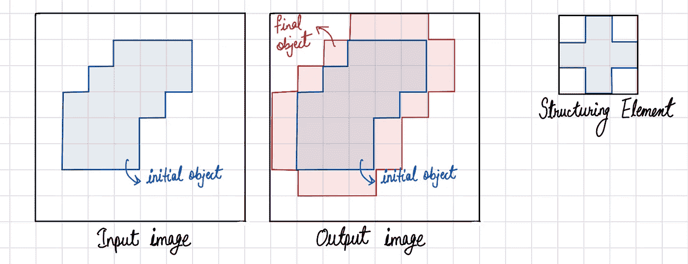
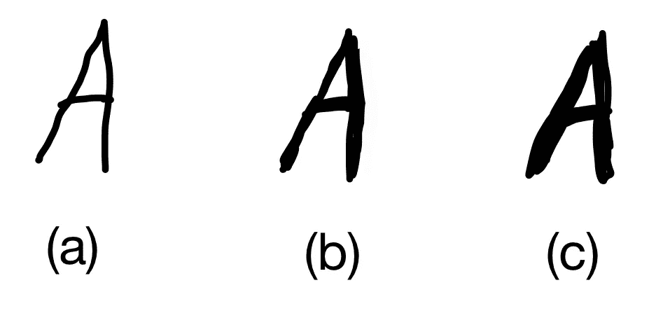
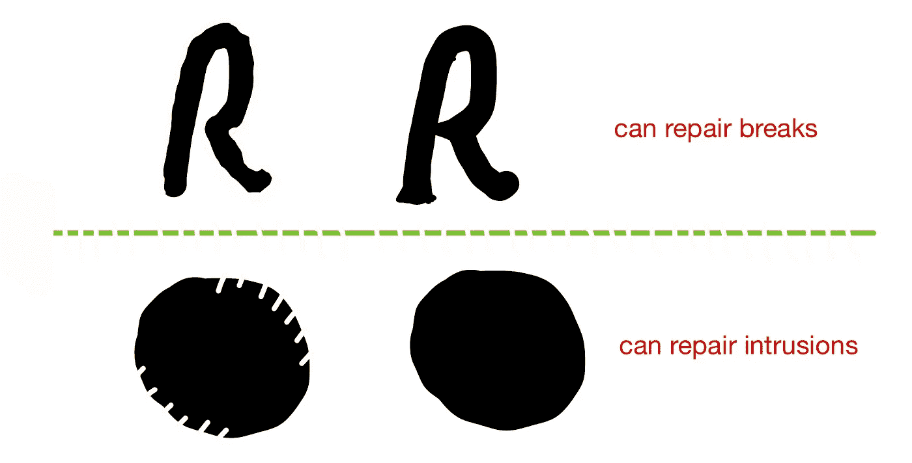

# 理解形态学图像处理及其操作

> 原文：<https://towardsdatascience.com/understanding-morphological-image-processing-and-its-operations-7bcf1ed11756>

## 这篇文章用更直白的术语说明了形态学图像处理；读者可以了解形态学在数字图像处理中的工作原理

图一。使用形态学图像处理操作的边界提取。*(来源:图片由作者提供)*

单词*‘形态学’*通常代表生物学中研究动物和植物的形态和结构的一个分支。然而，我们在*【数学形态学】*中使用相同的术语来提取在表示区域形状、边界等方面有用的图像成分。

*形态学*是一套全面的图像处理操作，基于形状处理图像[1]。形态学操作将结构化元素应用于输入图像，创建相同大小的输出图像。在形态学运算中，输出图像中每个像素的值基于输入图像中相应像素与其邻居的比较。

形态学和图像分割之间有轻微的重叠。形态学由可用于预处理图像分割的输入数据或后处理图像分割阶段的输出的方法组成。换句话说，一旦分割完成，就可以使用形态学操作来消除分割图像中的缺陷，并传递关于图像形状和结构的信息，如图 2 所示。

图二。形态学处理的例子[2]。

为了简单和便于理解，本文主要关注二进制图像。

## 形态学图像处理中的术语

所有的形态学处理操作都是基于提到的术语。

***结构化元素:*** 它是一个矩阵或者一个小尺寸的模板，用来遍历一幅图像。结构化元素被定位在图像中所有可能的位置，并与连接的像素进行比较。它可以是任何形状。
***拟合:*** 当结构化元素中的所有像素覆盖了对象的像素时，我们称之为拟合。
***Hit:*** 当结构化元素中至少有一个像素覆盖了对象的像素时，我们称之为 Hit。
***错过:*** 当结构元素中没有像素覆盖对象的像素时，我们称之为错过。

图 3 显示了形态学图像处理中使用的术语的可视化。

图 3。形态学术语解释。(来源:图片由作者提供)

# 形态学运算

基本上，形态学图像处理类似于空间滤波。结构化元素在原始图像中的每个像素上移动，以在新处理的图像中给出一个像素。这个新像素的值取决于所执行的形态学操作。最广泛使用的两种运算是腐蚀和膨胀。

## 1.侵蚀

侵蚀会缩小图像像素，或者侵蚀会移除对象边界上的像素。首先，我们遍历图像对象上的结构化元素来执行腐蚀操作，如图 4 所示。输出像素值通过下式计算。
像素(输出)= 1 {如果合适}
像素(输出)= 0 {否则}

图 4。使用结构化元素对输入图像进行腐蚀操作。(来源:图片由作者提供)

腐蚀的例子如图 5 所示。图 5(a)表示原始图像，图 5(b)和图 5(c)分别显示了使用 3×3 和 5×5 结构元素腐蚀后的处理图像。

图 5。侵蚀中结构元素大小的结果。(来源:图片由作者提供)

**属性:**

1.  它可以分割关节对象(图 6)。
2.  它可以剥离挤出(图 6)。

图 6。侵蚀的使用案例。(来源:图片由作者提供)

## 2.扩张

膨胀会扩大图像像素，或者在对象边界上添加像素。首先，我们遍历图像对象上的结构化元素来执行膨胀操作，如图 7 所示。输出像素值通过下式计算。
Pixel(output)= 1 {如果命中}
Pixel(output)= 0 {否则}

图 7。使用结构化元素对输入图像进行膨胀操作。(来源:图片由作者提供)

图 8 显示了一个膨胀的例子。图 8(a)表示原始图像，8(b)和 8(c)示出分别使用 3×3 和 5×5 结构元素膨胀后的处理图像。

图 8。膨胀中结构元素大小的结果。(来源:图片由作者提供)

**属性:**

1.  它可以修复断裂(图 9)。
2.  它可以修复入侵(图 9)。

图 9。膨胀的示例用例。(来源:图片由作者提供)

# 复合操作

大多数形态学操作不是使用膨胀或腐蚀来执行的；相反，它们是通过使用两者来执行的。两种最广泛使用的复合操作是:(a)闭合(首先执行膨胀，然后执行侵蚀)和(b)打开(首先执行侵蚀，然后执行膨胀)。图 10 显示了对单个对象的两种复合操作。

图 10。输入对象上复合操作的输出。(来源:图片由作者提供)

# 应用:对象的边缘提取

提取边界是获取信息和理解图像特征的重要过程。这是预处理中的第一个过程，呈现图像的特征。这个过程可以帮助研究人员从图像中获取数据。我们可以通过以下步骤来执行对象的边界提取。

**第一步。**通过侵蚀过程创造图像(E)；这将稍微缩小图像。结构化元素的内核大小可以相应地变化。

**第二步。**从原始图像中减去图像 E。通过执行这一步，我们得到了对象的边界。

如需说明，请参考封面艺术或图 1。

# 结论

本文阐述了数字图像处理中的形态学课题。此外，我们举例讨论形态学中最著名的两种方法:膨胀和腐蚀。然后我们看看如何将这两种方法结合起来解决其他用例。最后，我们解释形态学图像处理的一个应用。

# 参考

[1] P Soille。“形态学图像分析，原理和应用”，1999 年。

[2] R. C. Gonzalez，R. E. Woods，“数字图像处理”，第二版。上马鞍河，新泽西州普伦蒂斯霍尔，2002 年。