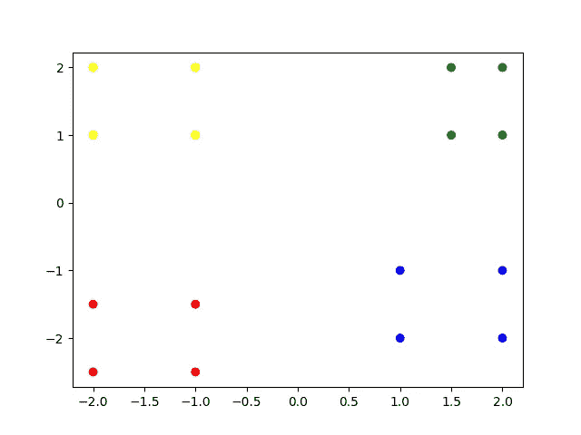
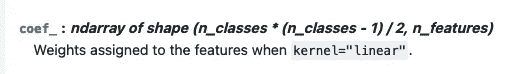
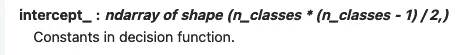
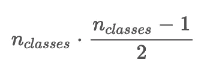
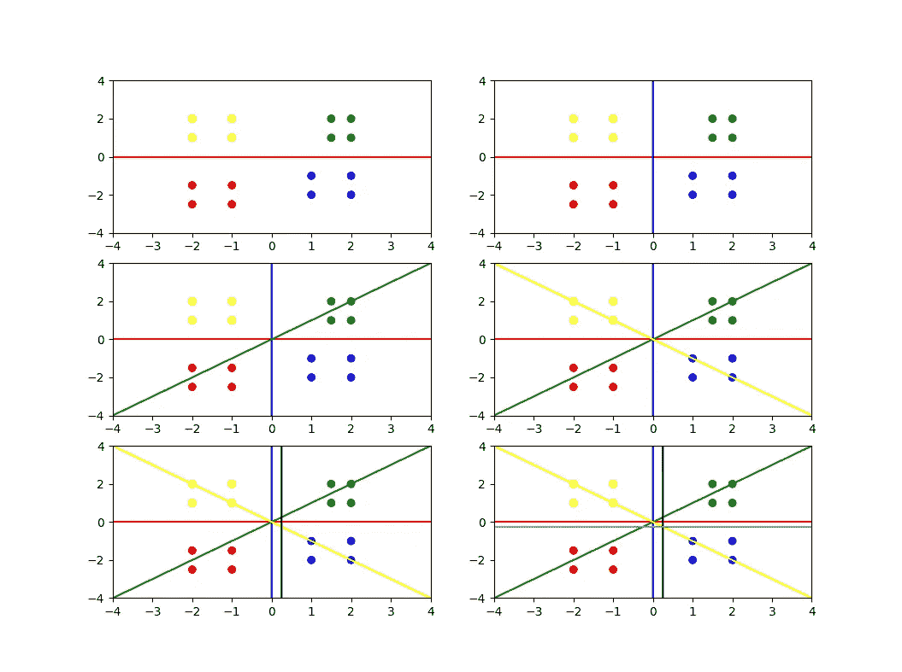
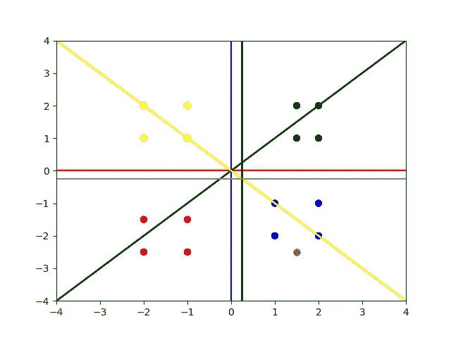

# 了解 scikit-learn 的 OVO SVC 模型的多个超平面

> 原文：<https://towardsdatascience.com/understanding-multiple-hyperplanes-of-scikit-learns-ovo-svc-model-3c0d09c8b8e5>

## 如何解释 scikit-learn 中线性 SVC 的 coef_ attribute 以解决多类分类问题


由 [Fr 拍摄。丹尼尔·丘奇](https://unsplash.com/@dannyboy4125?utm_source=medium&utm_medium=referral)开启 [Unsplash](https://unsplash.com?utm_source=medium&utm_medium=referral)

在我最近的文章中，我向你展示了如何为一个**二元分类问题**解释一个拟合的 SVC 模型的`coef_`和`intercept_`属性，以及如何绘制决策平面。如果你还没有读过，我建议你在读这篇文章之前先看看。以下是它的链接:

</understanding-the-hyperplane-of-scikit-learns-svc-model-f8515a109222>  

**注意:** *因为上一篇文章围绕着一个二元分类问题，所以它基本上是我们使用的一个 SVM。在这篇文章中，我们实际上使用了一个 SVC，我们将利用 SVC 的力量。SVM 和支持向量机之间的主要区别在于，支持向量机本质上只是多个支持向量机的组合，因此允许我们使用多个超平面来分类多个类别。*

这篇文章的主题有点复杂，但是我会尽我所能让它容易理解。

准备好了吗？我们走吧！

## 创建一些虚拟数据

首先，让我们创建一些数据来处理和可视化。下面的代码片段应该可以完成这个任务:

```
import numpy as np
import matplotlib.pyplot as pltX = np.array([[1.5, 1  ], [1.5, 2  ], [ 2,  1  ], [ 2,  2  ], #upper right (Green)[1,  -1  ], [1,  -2  ], [ 2, -1  ], [ 2, -2  ], #lower right (Blue)[-1, -1.5], [-1, -2.5], [-2, -1.5], [-2, -2.5], #lower left (Red)[-1,  1  ], [-1,  2  ], [-2,  1  ], [-2,  2  ], #upper left (Yellow)])y = np.array(['green','green','green','green','blue','blue','blue','blue','red','red','red','red','yellow','yellow','yellow','yellow',])plt.scatter(X[:, 0], X[:, 1], c=y)
plt.show()
```

这将产生以下情节:



散点图中的四个数据类-由作者创建

正如你所看到的，这个数据显然是线性可分的，所以线性 SVC 应该可以很好地处理它，因为有两个以上的类，我们需要一个以上的超平面，(这种直觉应该很容易理解。想象一下，必须画一条****单条** **直线** **来分隔四个不同的类。你根本不能**。**

## **在数据上拟合 SVC**

**下一步是使用 scikit-learn 的库在我们的数据上安装一个 SVC。这可以简单地这样做:**

```
from sklearn.svm import SVCclf = SVC(kernel='linear')
clf.fit(X, y)
```

**就 SVCs 而言，存在两种创建超平面的方法。一个叫**一对一(OVO)** 一个叫**一对一(OVR)** 。我现在不会深入讨论这个问题，因为这是另一篇文章的主题。现在，你只需要知道我们将创建一个 **OVO** SVC。简而言之，这意味着我们将每一个类与每一个其他类进行比较，并且这些比较中的每一个都有一个相应的超平面。**

**我们可以看看拟合的 SVC 的`coef_`和`intercept_`属性，就像我们在上一篇文章中所做的那样。**

```
print('coef_\n', clf.coef_)
print('intercept_', clf.intercept_)>> coef_
   [[ 0.00000000e+00 -1.00000000e+00]
    [ 9.99532404e-01  2.22044605e-16]
    [ 5.00000000e-01 -5.00000000e-01]
    [ 4.00000000e-01  4.00000000e-01]
    [ 8.00000000e-01  0.00000000e+00]
    [ 0.00000000e+00 -8.00000000e-01]]>> intercept_
   [ 1.45716772e-16
     4.30211422e-16
     0.00000000e+00
     0.00000000e+00
    -2.00000000e-01
    -2.00000000e-01]
```

**好的，显然我们为`coef_`属性得到了 6 个向量，也为`intercept_`属性得到了 6 个值。这些是我们将要用来绘制超平面的值，也是用来分类新数据点的值。**

**你可能会问为什么是数字 6？要回答这个问题，让我们看看 SVC 的 [scikit-learn 文档:](https://scikit-learn.org/stable/modules/generated/sklearn.svm.SVC.html)**

****

**scikit-learn 文档的屏幕截图(于 2022 年 12 月 6 日访问)-由作者创建**

****

**scikit-learn 文档的屏幕截图(于 2022 年 12 月 6 日访问)-由作者创建**

**我们现在可以看到，值 6 来自以下等式:**

****

**coef_ 中的向量数方程—作者创建**

**在我们的例子中，我们有 4 个类，因此等式如下:**

****

**具有实际值的等式—由作者创建**

**希望这一点现在已经很清楚了。然而，这给我们留下了后续问题:哪个`coef_`向量和`intercept_`值对应于哪个标签？正如我在上面简要提到的，OVO 方法将每一类进行比较。这意味着我们比较**

**标签 1 对标签 2
标签 1 对标签 3
标签 1 对标签 4
标签 2 对标签 3**

**依此类推……直到所有的标签都相互比较完毕，*(我将在后面的文章中进一步详细介绍新数据点是如何分类的)***

**我们的每个`coef_`向量都代表了这样一种比较。但是，我们怎么知道哪个向量对应于哪个比较呢？**

**为了弄清楚这一点，我们可以使用下面的代码来获得数据和超平面的可视化表示:**

```
line_colors = {0:'red', 1:'blue', 2:'green', 3:'yellow', 4:'black', 5:'gray'}number_of_coefficients = len(clf.coef_)
figure, axis = plt.subplots(3, 2)
row = 0
col = 0for j in range(number_of_coefficients):
  for i in range(j+1):
     w = clf.coef_[i]
     w = [w[0], w[1] + 0.0001] #adding 0.0001 just to make sure we       
                               #don't devide by 0
     a = -w[0] / w[1] xx = np.linspace(-4,4)
     yy = a * xx - clf.intercept_[i] / w[1]
     axis[row, col].plot(xx, yy, label=f'h{i}', c=line_colors[i])

  axis[row, col].set_xlim([-4, 4])
  axis[row, col].set_ylim([-4, 4])
  axis[row, col].scatter(X[:, 0], X[:, 1], c = y) row = row + 1 if col == 1 else row
  col = col + 1 if col != 1 else 0plt.show()
```

***(为了避免文章篇幅过长，我没有对代码片段进行解释，只需注意它用于使用* `*coef_*` *和* `*intercept_*` *值创建情节)***

**这会产生以下情节:**

****

**绘制一个接一个的超平面—由作者创建**

**这里发生了相当多的事情，所以让我们仔细地浏览一下。**

**每个子情节增加一个额外的超平面。这样，我们可以通过检查刚刚添加的超平面的位置来了解哪个超平面对应于哪个比较。以下是超平面的描述:**

1.  ****红线**比较**蓝等级**和**绿等级。****
2.  ****蓝线**比较**蓝等级**和**红等级。****
3.  ****绿线**比较**蓝色等级**和**黄色等级。****
4.  ****黄线**比较**绿色等级**和**红色等级。****
5.  ****黑线**比较**绿色等级**和**黄色等级。****
6.  ****灰色线**比较**红色等级**和**黄色等级。****

**当对新的数据点进行分类时，将针对这些超平面中的每一个来测量该点。每次比较后，我们记下它属于哪个标签，并将其添加到该标签的累积分数中。最后，新的数据点被简单地标记为具有最高分数的类。**

**每个超平面以如下方式对新数据点进行分类:如果该点位于超平面的右侧，则该超平面将该点分类为其比较中的第一个标签。相反，如果点在平面的左边，那么它被标记为超平面比较的第二类。**

> ****快速举例:**以**红线**为例，它的第一个标签是**蓝色等级**，第二个标签是**绿色等级**。如果一个给定的数据指向线的右边，那么这个超平面将其分类为**蓝色**。**

****注意:**为了有一个“右”或“左”的超平面，它们需要有一个方向。本例中的 ***红色*** *和* ***灰色线条*** *指向右边，蓝色* *和* ***黑色*** ***线条*****

## *****具有新观点的示例*****

*****让我们看一个例子。我们可以绘制一个新的点`[1.5, -2.5]`(图中的棕色点)，我们预计该点将被归类为**蓝色**点。下面是一个让它更加明显的图:*****

**********

*****超平面和一个新的预测点—由作者创建*****

*****逐一进行比较(超平面):*****

1.  *****红线**将其归类为蓝色*******
2.  *******蓝线**将其归类为蓝色*****
3.  *******绿线**将其归类为蓝色*****
4.  *****黄线**将其归类为红色*******
5.  *******黑线**将其归类为绿色*****
6.  *****灰色线**将其归类为红色*******

*****新点分为**蓝色** 3 次，**红色** 2 次，**绿色** 1 次。因此，我们用**蓝色**标签对点进行分类。*****

*****如果我们使用拟合的模型进行预测，我们会得到同样的结果。可以通过以下方式完成:*****

```
***new_point = np.array([[1.5, -2.5]])
print(clf.predict(new_point))>> **['blue']*****
```

*****我们得到了预期的蓝色标签。*****

## *****如何确定比较的顺序*****

*****我希望上面的例子对你来说很容易理解，并且你明白我们是如何得出关于哪些超平面对应于哪些比较的结论的。然而，这是一个简单的实验，数据很容易分离。这允许我们通过视觉检查来确定超平面和`coef_`属性之间的关系。然而，真实世界的数据很可能不那么容易处理。所以，你可能想知道是否有一个系统，来决定比较的顺序？*****

*****换句话说，我们能确定由`coef_[0]`代表的超平面总是将**蓝色**类和**绿色**类分开的那个超平面吗？*****

*****我得出的结论是，排序是由标签排序决定的。在标签是单词的情况下，我注意到前三个超平面，`coef_[0]`、`coef_[1]`、`coef_[2]`都与蓝色标签有关。这支持了我的理论，因为蓝色的**将按字母顺序排列为第一个标签。以下两个标签`coef_[3]`和`coef_[4]`与**绿色**标签有关，因为**‘g’**排在**‘b’**之后，**‘r’**之前，**‘y’**之前。*******

***这可能有点难以理解，但是想一想，它可能会对你有意义。***

***有了这个关于模型的超平面如何工作的信息，你将对幕后发生的事情有一个更好的理解。您还可以使用帖子中的代码片段来绘制超平面。***

*****感谢**花时间阅读这篇文章！我希望它对你有用。如果你有任何问题，意见或注意到代码或文本中的错误，我鼓励你联系我。***

***如果你是一个渴望更多的好奇的开发者，那么下面这些帖子可能也会让你感兴趣:***

***<https://betterprogramming.pub/what-is-up-with-the-numbers-in-python-26d8d36e129b>  </how-to-use-an-autoregressive-ar-model-for-time-series-analysis-bb12b7831024> ***