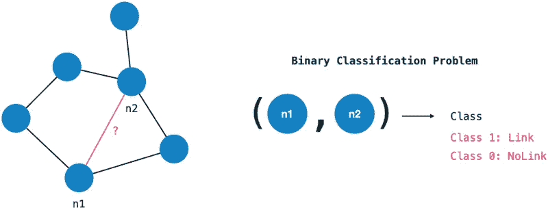
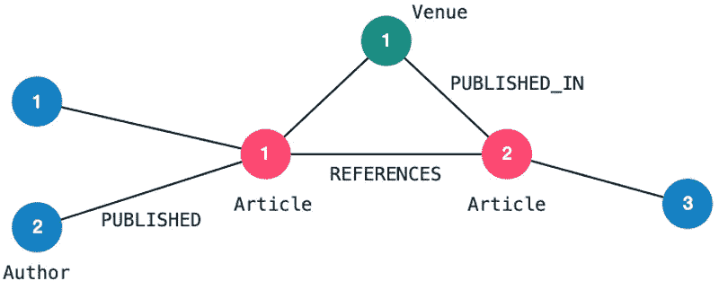
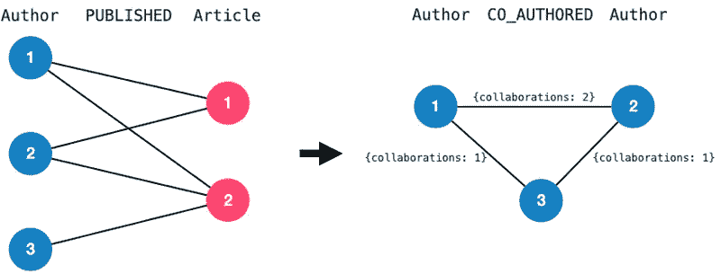
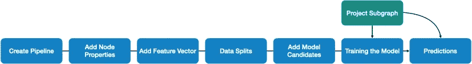
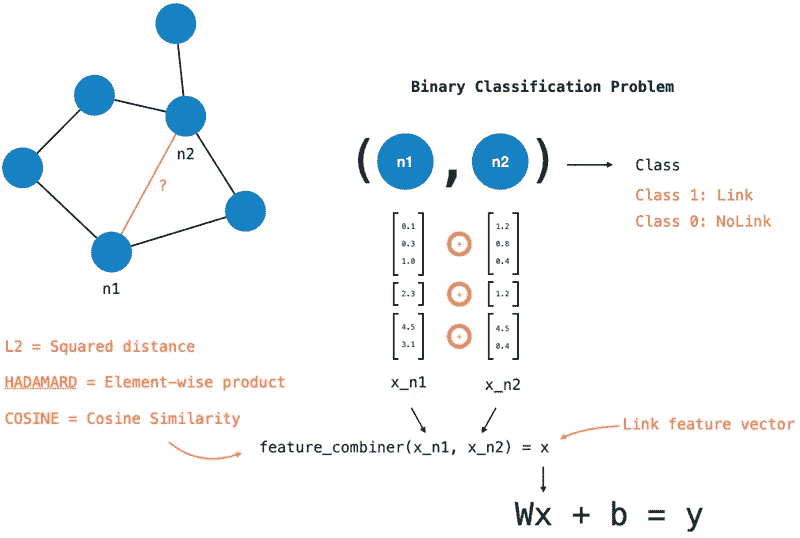
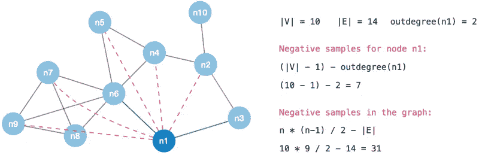
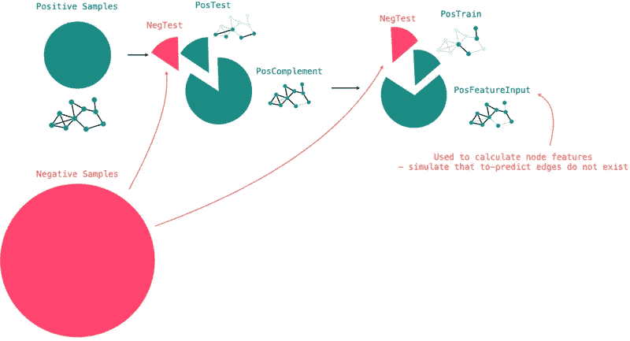
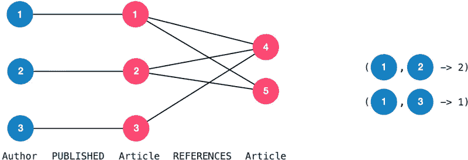

# 了解 Neo4j GDS 链路预测(带代码演示)

> 原文：<https://towardsdatascience.com/understanding-neo4j-gds-link-predictions-with-demonstration-9b96eec89efb>

## 常见图形机器学习任务的实践教程

# 介绍

Neo4j GDS 机器学习管道是一种直接在 Neo4j 基础设施中执行复杂机器学习工作流的便捷方式。因此，他们可以节省大量管理外部基础设施或依赖关系的工作。在这篇文章中，我们将探索一个常见的图形机器学习任务:链接预测。您可以使用流行的开放数据集([开放学术图](https://www.aminer.cn/oag-2-1))轻松重现这些步骤，以准备输入数据并逐步配置管道。我将详细阐述使用这样一个管道的主要概念和缺陷，以便我们理解在引擎盖下发生了什么。最后，我将给出一些关于当前局限性的想法。

[这是我在 YouTube 上关于这个话题的视频链接。](https://youtu.be/kq_b0QmxFCI)

# 动机

链接预测是图形环境中的常见任务。它用于预测数据中缺失的链接，以丰富数据(建议)或补偿缺失的数据。

链接预测问题可以解释为二元分类问题:对于图中的每一对节点，我们问:它们之间是否应该存在关系？这个问题陈述确实非常冗长——我们需要对图中的每个节点进行分类。

图链接预测可以解释为二元分类问题。(图片由作者提供)

# 领域

作为领域示例，我将使用一个众所周知且常用的数据集进行链接预测:开放学术图。您可以[下载](https://www.aminer.cn/oag-2-1)数据集并重现这里描述的步骤。我对数据进行了过滤，只包含少数出版物，并将其加载到 Neo4j 图表中。生成的图表模式如下所示:

图片:引文图表模式，包括作者、文章、发表地点和关系、参考文献、发表于。(图片由作者提供)

此外，我已经将数据转换成同质的合著图。两个作者之间的合著边缘表明他们以前曾在一个出版物上合作过。合作的数量成为一个优势属性。我们将由作者和文章组成的二分图转换成由节点`Author`和边`CO_AUTHORED`组成的齐次图。

图片:合著图。从作者和文章的二分图中，我们得到了一个同质的作者图。(图片由作者提供)

我们将使用合著关系图来预测两个作者是否有可能在未来合作，因为他们之前已经合作过。换句话说:我们想要预测新的`CO_AUTHORED`-边缘。

# 总体管道概述

我们将使用 Neo4j GDS 链路预测管道来完成这项任务(更重要的是，了解如何使用它们😇).让我们看一下管道的必要步骤。你可以在这里找到官方文件[。](https://neo4j.com/docs/graph-data-science/current/machine-learning/linkprediction-pipelines/link-prediction/)

图片:管道概述(图片由作者提供)

**投影子图**第一步是从我们的一般图创建一个内存子图。我们仅在管道的最后步骤中使用投影图，但是，如果我们先创建它，可能会更容易理解。可以通过过滤节点标签和关系类型，甚至通过定制的密码查询来创建投影。使用链接预测管道的一个重要注意事项是，它们仅在无向边上工作。因此，我们需要将有向边投影到无向边上。

**创建管道**创建管道非常简单。我们只需要提供一个名称来引用。

**添加节点属性**提高预测质量的最重要步骤之一是使用表达特征，使模型能够做出正确的决策。添加节点属性步骤允许在管道内执行 GDS 图算法(例如，节点嵌入)以生成新的节点特征。算法的限制(目前)是它们需要为节点生成特征——而不是边(我们将在后面讨论)。

**添加链接特征**特征向量步骤是传统 ML 任务的主要区别之一。我们希望对一对节点进行分类，而不是对单个数据点进行分类。为了为每对节点生成链接特征向量，我们使用两个节点的特征向量，并将它们组合成单个向量。链接-要素-矢量步骤定义了如何根据单个结点要素为结点对生成链接矢量。首先，我们需要指定使用哪些节点特性。其次，我们有三种组合器功能可供选择:

*   Hadamard =元素乘积，
*   余弦=余弦相似性(向量之间的角度)，
*   L2 =距离的平方。

图像:链接特征步骤:使用三个组合器函数之一将节点向量组合成一个链接向量。(图片由作者提供)

**数据分割** …看起来像是这条管道中的一个微不足道的点。然而，了解你的最终模型是否有用是很重要的一部分。因为我们是在对节点对而不是单个节点进行分类，所以对于图中的每个数据点，我们最终会有许多组合(`|V| - 1`)。除非我们正在处理一个接近全连通图，否则自然会有许多组合(`|V| - 1 - degree(n)`)没有每个节点的边。这些最终会成为我们模型的负样本，因此预测`NO-EDGE`的模型会产生高精度。

图像:样本图中的负样本(作者提供的图像)

为了避免这种情况，我们采取了以下措施:

*   获取构成图中阳性样本的所有现有边(`POS`)
*   将阳性样本分成三组(`POS = POS_TEST + POS_TRAIN + POS_FEATURE`)
*   对于三组中的每一组，从图表中抽取反面例子(例如`TEST = POS_TEST + NEG_TEST`)。

图:将数据分割成平衡的数据集。阳性样本被分成三个不同的集合:测试、训练和特征。(图片由作者提供)

`FEATURE`集合用于计算之前配置的节点特征。这是一个重要的区别，可以防止数据泄漏到训练集和测试集中。我们将在常见缺陷部分对此进行一些讨论。

关于负样本的注意事项:通常我们希望为每个正样本找到一个负样本。寻找好的阴性样本的方法本身就是一个研究课题，并且存在许多方法。Neo4j GDS 仅支持随机采样。

**模型配置&训练**目前，在 Neo4j GDS 中存在两种分类方法:逻辑回归和随机森林。我们可以将具有不同参数空间的多个候选模型添加到管道中。在训练期间，每个候选模型都要经过 k 重交叉验证，以找到最佳的模型配置。培训的另一个重要参数是要使用的评估指标。到目前为止，GDS 为逻辑回归提供了一个度量标准:AUCPR(曲线下面积精确回忆)。获胜的模型存储在所提供的模型标识符下，以供以后使用。

**预测**预测步骤应用获胜模型来预测图中没有边的所有节点对之间的缺失边。由于这会导致评估模型的节点对数量非常大，因此该过程可能会花费相当长的时间。像往常一样，我们可以选择如何使用结果:流式或变异。`mutate`选项将在图形投影中创建预测关系。

# 常见陷阱

产生有偏见的结果的最常见的陷阱是将测试数据泄漏到模型训练中。对于传统的机器学习任务来说，这不是太大的问题，因为数据点具有直接关联的特征。然而，在图形环境中，我们通常希望生成考虑图形中的连接的特征。因此，这些算法分析节点的周围环境。换句话说:算法探索关系和其他数据点，以确定节点在更大环境中的角色、连通性、重要性或嵌入性。然后，生成的要素会获取有关数据网络结构的知识。

当训练模型以确定两个数据点之间是否应该存在边时，我们希望隐藏训练步骤中的一些数据，以便可以可靠地测试模型性能。应该在不知道测试边缘的情况下训练模型。相反，我们希望获得一种模型，该模型能够基于独立于这种边缘的特征做出好的决定。因此，在生成我们的特征时，我们需要额外注意:没有训练或测试数据应该进入特征生成步骤。

实施封装和防止数据泄漏的方法是将输入数据分成前面提到的三个集合:训练、测试和特征。我们使用特征集来计算管道中使用的节点属性。由于这三组是不同的，我们可以确定用于训练或评估的边都不会影响我们的特征生成。

然而，目前完成这种严格封装的唯一方法是只在管道中生成特性。管线外的特征生成没有关于数据分割的信息，因此可能捕获模型试图预测的图形结构。

# 实施

# 考虑

GDS 管道在几行代码中封装了大量的复杂性。它尽了很大的努力来自动化这样的工作流程，并防止工程师陷入其中的一个陷阱。为了获得有用的结果，理解链路预测中的概念和误差源仍然是必不可少的。

强封装意味着灵活性和定制性降低。以下 szenario 目前无法使用自动化工作流程:

**不能将节点对特征添加到特征向量中。只有节点属性。**

让我们考虑一下下面的例子:我们想要对一对作者`(a1, a2)`进行预测。除了考虑`a1`和`a2`的节点属性(我们将把它们组合成一个向量)，我们还想考虑这对向量本身的特征。例如，两位作者`(a1, a2)`之前是否引用了同一篇论文，这可能是对模型有价值的信息。

图片:一个节点对特征:两个作者共同引用两篇论文。(图片由作者提供)

这将是作者对的特征，而不是每个作者单独的特征；每个作者都有多个值—每个作者一个值。显然，这个特征最好用图中的边来表示；这是一对特征。反过来，如果我们将这个特征添加到我们的对特征向量，我们就不需要像节点特征那样使用组合器。

这方面的主要挑战显然是，我们需要在各种数据分割上计算这样一个特征，以防止数据泄漏。因此，特征计算或者需要发生在管道内(其中数据分割是可访问的)。或者我们需要访问用于特征训练、训练和测试的分割。

这导致了当前管道的第二个限制:

**无法配置自定义分割(功能、训练、测试)。**

流水线允许随机配置正样本和负样本的比率。但是，我们不能按照自定义逻辑(例如时间戳)来分割数据。我们可能希望某个时间戳之前的数据出现在训练集中，而该时间戳之后的数据应该出现在测试集中。为了实现这一点，我们需要相应地标记我们的数据，并告诉管道如何在其流中使用标记。如上所述，这种自定义拆分对于防止自定义特征中的数据泄漏也是必要的。

# 结论

GDS 链接预测管道是一个非常好的工具，可以直接在 Neo4j 基础设施中设置复杂的机器学习工作流。它通过在框架边界内启用工作流来减少外部工具和资源所需的开销。管道使用简单，并防止许多陷阱，否则需要相当多的思考。目前，相对于定制解决方案，API 在灵活性方面有其局限性。然而，它目前处于测试版本，GDS 团队可能会在未来的版本中对其进行改进。

# 参考资料和资源

*   开放学术图表数据集，[https://www.aminer.cn/oag-2-1](https://www.aminer.cn/oag-2-1)，许可:ODC-BY
*   、、姚立民、、、、。学术社交网络的提取和挖掘。在 [*第十四届 ACM SIGKDD 知识发现与数据挖掘国际会议论文集*](http://www.sigkdd.org/kdd2008/) ( [SIGKDD'2008](http://www.sigkdd.org/kdd2008/) )。第 990-998 页。[ [PDF](http://keg.cs.tsinghua.edu.cn/jietang/publications/KDD08-Tang-et-al-ArnetMiner.pdf) ] [ [幻灯片](http://keg.cs.tsinghua.edu.cn/jietang/publications/KDD08-Tang-et-al-Arnetminer.ppt) ] [ [系统](http://aminer.org/) ] [ [API](http://aminer.org/RESTful_service) ]
*   阿纳·辛哈、沈智宏、宋洋、马浩、达林·艾德、许宝俊(保罗)和王宽三。2015.Microsoft 学术服务(MAS)和应用程序概述。《第 24 届万维网国际会议论文集》(WWW '15 Companion)。美国纽约州纽约市 ACM，243–246。
*   张，，刘潇，，，董，，姚，，顾小涛，，，李锐，王宽三。OAG:连接大规模异构实体图。在 [*第 25 届 ACM SIGKDD 知识发现与数据挖掘国际会议论文集*](http://kdd.org/kdd2019/)([KDD’19](http://kdd.org/kdd2019/))。