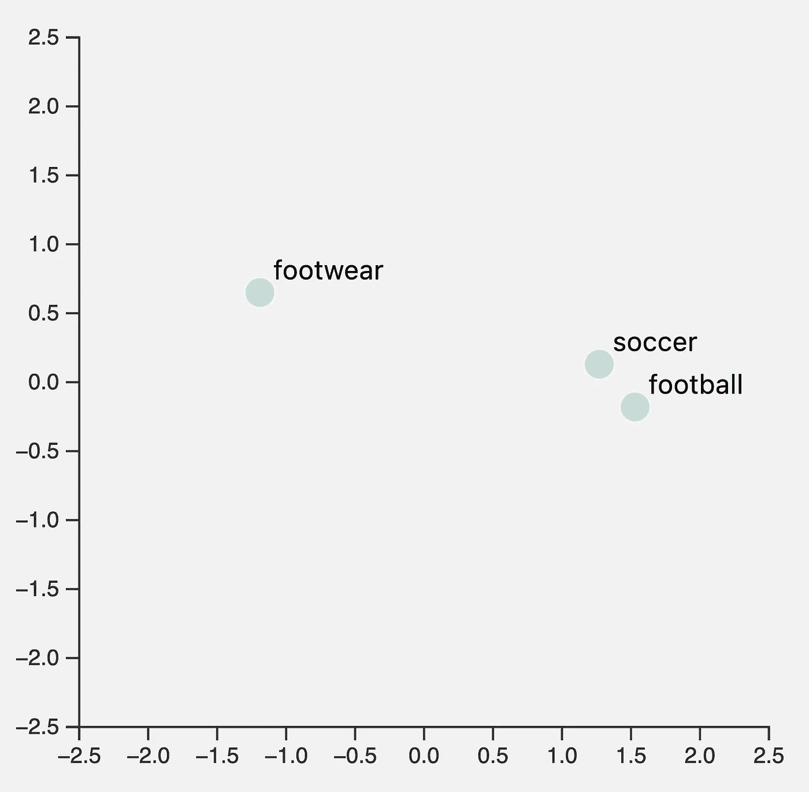
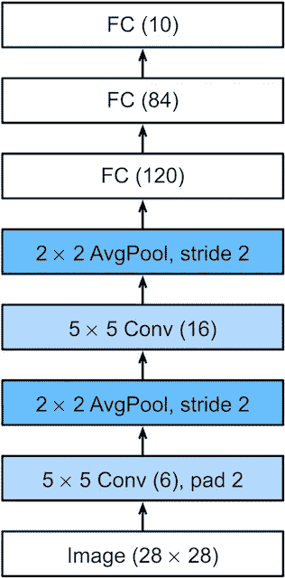
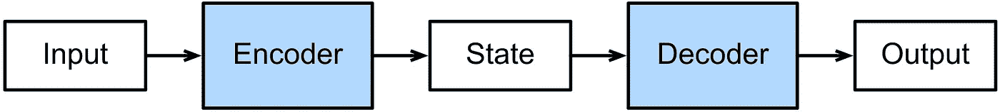
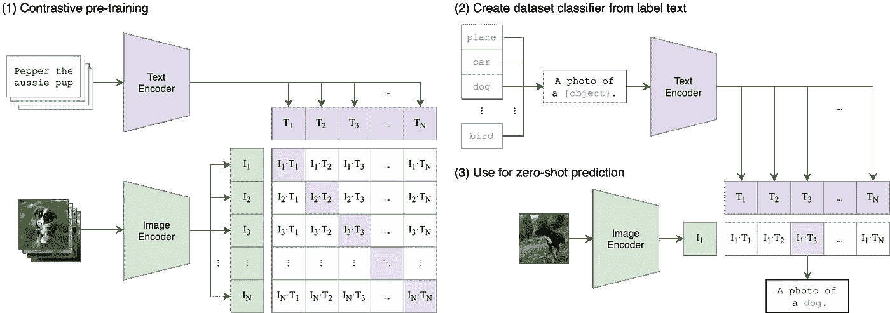

# 理解神经网络嵌入

> 原文：<https://towardsdatascience.com/understanding-neural-network-embeddings-851e94bc53d2>

## 深入探究神经网络嵌入


尼克·希利尔在 [Unsplash](https://unsplash.com) 上的照片

我在之前关于[向量数据库](https://frankzliu.com/blog/a-gentle-introduction-to-vector-databases)和 [ML 应用开发](https://frankzliu.com/blog/making-machine-learning-more-accessible-for-application-developers)的博客文章中已经提到了嵌入/嵌入向量的主题，但是还没有深入研究嵌入和嵌入模型如何工作背后的一些理论。因此，本文将致力于更深入地研究嵌入/嵌入向量，以及它们在现代 ML 算法和流水线中的应用。

快速注意——这篇文章需要深度学习和神经网络的中级知识。如果你还不太了解，我建议你先看看谷歌的 ML 速成班。课程内容对于理解 CV 和 NLP 的神经网络基础很有帮助。

# 快速回顾一下

通过嵌入对数据进行矢量化，本质上是一种*降维的方法*。传统的降维方法— [PCA](/the-most-gentle-introduction-to-principal-component-analysis-9ffae371e93b) 、 [LDA](https://www.mygreatlearning.com/blog/understanding-latent-dirichlet-allocation/) 等。—结合使用线性代数、内核技巧和其他统计方法来“压缩”数据。另一方面，现代深度学习模型通过将输入数据映射到*潜在空间*中来执行维度缩减，潜在空间即输入数据的表示，其中附近的点对应于语义上相似的数据点。例如，过去代表单个单词或短语的热点向量现在可以表示为维度显著降低的密集向量。我们可以通过 [Towhee 库](https://github.com/towhee-io/towhee)看到这一点:

```
% pip install towhee  # pip3
% python              # python3>>> import towhee 
>>> text_embedding = towhee.dc(['Hello, world!']) \ 
...     .text_embedding.transformers(model_name='distilbert-base-cased') \ 
...     .to_list()[0]
...
>>> embedding # includes punctuation and start & end tokensarray([[ 0.30296388,  0.19200979,  0.10141158, ..., -0.07752968, 0.28487974, -0.06456392],
       [ 0.03644813,  0.03014304,  0.33564508, ...,  0.11048479, 0.51030815, -0.05664057],
       [ 0.29160976,  0.43050566,  0.46974635, ...,  0.22705288, -0.0923526, -0.04366254],
       [ 0.14108554, -0.00599108,  0.34098792, ...,  0.16725197, 0.10088076, -0.06183652],
       [ 0.35695776,  0.30499873,  0.400652  , ...,  0.20334958, 0.37474275, -0.19292705],
       [ 0.6206475 ,  0.50192136,  0.602711  , ..., -0.03119299, 1.1860386 , -0.6167787 ]], dtype=float32)
```

基于深度神经网络的嵌入算法几乎被普遍认为比传统的降维方法更强。这些嵌入在行业中的各种应用中使用得越来越频繁，例如内容推荐、问答、聊天机器人等。正如我们将在后面看到的，在神经网络中使用嵌入来表示图像和文本*近年来也变得越来越流行。*



由 [DistilBERT](https://towhee.io/text-embedding/transformers) 制作的可视化文本嵌入。请注意，尽管“football”和“football”这两个词都很常见，但“football”和“soccer”的关系却比“football”更近。

# 监督嵌入

到目前为止，我以前的文章使用了来自使用*监督学习*训练的模型的嵌入，即来自标记/注释数据集训练的神经网络模型。例如， [ImageNet](https://image-net.org/) 数据集包含一组精选的图像到类别的映射，而问答数据集如 [SQuAD](https://rajpurkar.github.io/SQuAD-explorer/) 提供不同语言的 1:1 句子映射。

许多通过标记数据训练的著名模型使用交叉熵损失或均方误差。由于监督训练的最终目标是或多或少地复制输入数据和注释之间的 1:1 映射(例如，在给定输入图像的情况下输出类别令牌概率)，因此从监督模型生成的嵌入很少使用输出层。例如，在 ImageNet-1k 上训练的标准 ResNet50 模型输出 1000 维向量，该向量对应于输入图像是第 *N* 个类标签的实例的概率。



LeNet-5，已知最早的计算机视觉神经网络架构之一。图片 by [D2L.ai](https://d2l.ai/) ， [CC BY-SA 4.0](https://creativecommons.org/licenses/by-sa/4.0/) 。

相反，大多数现代应用程序使用倒数第二层激活作为嵌入。在上图(LeNet-5)中，这对应于标记为`FC (10)` (10 维输出层)和`FC (84)`的层之间的激活。这一层离输出足够近，可以准确地表示输入数据的语义，同时也是一个相当低的维度。我也见过计算机视觉应用程序使用模型中更早层的池激活。这些激活捕获输入图像的低级特征(角、边、博客等...)，这可以提高徽标识别等任务的性能。

# 编码器和自我监督

使用带注释的数据集的一个主要缺点是它们需要注释(这听起来有点愚蠢，但是请原谅我)。为一组特定的输入数据创建高质量的注释需要一个或许多人花费数百甚至数千个小时的时间。例如，完整的 ImageNet 数据集包含大约 22k 个类别，需要 25000 人来管理。让事情更加复杂的是，许多带标签的数据集经常包含意想不到的不准确、明显的错误，或者精选结果中的 [NSFW 内容](https://github.com/vinayprabhu/Dataset_audits/blob/master/Notebooks/ImageNet_2_NSFW_analysis.ipynb)。随着这种实例数量的增加，由监督学习训练的嵌入模型生成的嵌入质量显著下降。


来自 [Unsplash 数据集](https://unsplash.com/data)的标记为“希望”的图像。对于人类来说，这是一个非常明智的描述，但它可能会导致模型在训练过程中学习错误的特征类型。由 [Lukas L](https://unsplash.com/photos/jSjgQmaQtVQ) 拍摄。

另一方面，以无人监督的方式训练的模特不需要标签。鉴于每天生成的文本、图像、音频和视频数量惊人，使用这种方法训练的模型基本上可以访问无限量的训练数据。这里的诀窍是开发正确类型的模型和培训方法来利用这些数据。一种令人难以置信的强大且日益流行的方式是通过*自动编码器*(或一般的*编码器/解码器*架构)。

*自动编码器*通常有两个主要组件。第一个组件是编码器:它将一些数据作为输入，并将其转换为固定长度的向量。第二个组件是解码器:它将向量映射回原始数据。这就是所谓的编码器-解码器架构:



编码器-解码器架构示意图。图片由 [D2L.ai](https://d2l.ai/) ， [CC BY-SA 4.0](https://creativecommons.org/licenses/by-sa/4.0/) 。

对应于`Encoder`和`Decoder`的蓝框都是前馈神经网络，而`State`是期望的嵌入。这两种网络都没有什么特别之处——许多图像自动编码器将标准的 ResNet50 或 ViT 用于编码器网络，将类似的大型网络用于解码器网络。

由于自动编码器被训练为将输入映射到潜在状态，然后再映射回原始数据，因此无监督或自监督嵌入直接来自编码器的输出层，这与在完全监督下训练的模型的中间层相反。因此，自动编码器嵌入仅用于*重建*。换句话说，它们可以用来表示输入数据，但通常不足以表示语义，例如区分猫的照片和狗的照片。

近年来，除了传统的自动编码器之外，自我监督也有了许多改进。对于 NLP，具有*上下文*的预训练模型，即单词或字符在同一个句子或短语中相对于其他单词或字符出现的位置，是常见的，现在被认为是训练最先进的文本嵌入模型的事实上的技术。自我监督的计算机视觉嵌入模型也正在蓬勃发展；依赖于数据扩充的对比训练技术在应用于一般的计算机视觉任务时已经显示出很好的效果。 [SimCLR](https://arxiv.org/abs/2002.05709) 和 [data2vec](https://arxiv.org/abs/2202.03555) 是神经网络的两个例子，它们利用掩蔽和/或其他增强进行自我监督训练。

# 嵌入作为其他模型的输入

嵌入模型是非常独特的；它们不仅对一般的应用程序开发有价值，而且它们的输出经常用于其他机器学习模型。视觉变形金刚是一个很好的例子。得益于传统卷积神经网络所不具备的强大性能和巨大感受域，它们的受欢迎程度在过去两年里出现了爆炸式增长。视觉转换器的核心前提是将图像分成正方形小块，为每个小块生成嵌入，并将嵌入作为标准转换器的输入。令人惊讶的是，这对于图像识别非常有效。

另一个很好的例子是 OpenAI 的[剪辑](https://github.com/openai/CLIP)，这是一个大型神经网络模型，经过训练可以将图像与自然语言进行匹配。CLIP 的训练对象是来自互联网的大量数据，例如 Flickr 照片和相应的照片标题。



编码器及其相应的嵌入在 OpenAI 的剪辑模型中发挥了巨大的作用。图片由 [OpenAI](https://github.com/openai) ， [CC BY-SA 4.0](https://creativecommons.org/licenses/by-sa/4.0/) 。

CLIP 背后的方法实际上相当简单。首先，CLIP 将图像和文本映射成一种潜在状态(即一种嵌入)；这些潜在状态然后被训练以映射到*相同的空间*，即如果文本能够准确地描述图像，则文本嵌入和图像嵌入应该彼此非常接近。当涉及到 ML 时，困难在于细节，如果没有相当大的数据集和一些超参数调整，CLIP 实际上很难实现。

CLIP 被用作 DALLE(和 DALLE-2)中的核心组件，DALLE-2 是 OpenAI 的文本到图像生成引擎。最近有很多关于 DALLE-2 的传言，但如果没有 CLIP 的代表性，这些都是不可能的。虽然 CLIP 和 DALLE 的结果令人印象深刻，但图像嵌入仍有很大的发展空间。某些高级语义，如对象计数和数学运算，仍然难以在图像嵌入中表示。

# 生成您自己的嵌入

我已经指出了 [Towhee](https://github.com/towhee-io/towhee) 开源项目几次，展示了如何使用它来生成嵌入以及开发需要嵌入的应用程序。Towhee 包装了来自各种来源(，`[torchvision](https://github.com/pytorch/vision)`等)的数百个图像嵌入和分类模型...)并接受各种不同技术的训练。Towhee 也有许多 NLP 模型，感谢🤗s [变压器](https://github.com/huggingface/transformers)库。

让我们后退一步，看看 Towhee 是如何在幕后生成这些嵌入的。

```
>>> from towhee import pipeline
>>> p = pipeline('image-embedding')
>>> embedding = p('towhee.jpg')
```

使用[到](https://github.com/towhee-io/towhee)，从监督模型生成嵌入的默认方法是简单地移除最终分类或回归层。对于 PyTorch 模型，我们可以使用下面的示例代码片段来实现:

```
>>> import torch.nn as nn
>>> import torchvision
>>> resnet50 = torchvision.models.resnet50(pretrained=True)
>>> resnet50_emb = nn.Sequential(*(list(resnet50.children())[:-1]))
```

上面代码片段中的最后一行重新创建了一个前馈网络(`nn.Sequential`)，它由`resnet50` ( `resnet50.children()`)中除最后一层(`[:-1]`)之外的所有层组成。也可以使用相同的层移除方法来生成中间嵌入。对于用对比/三重损失训练的模型或作为自动编码器，该步骤是不必要的。

基于(对于 CV)和`[transformers](https://github.com/huggingface/transformers)`(对于 NLP)的模型也保持了它们自己的方法，使得特征提取变得容易:

```
>>> import numpy as np
>>> from PIL import Image
>>> import timm
>>> image = numpy.array(Image.open('towhee.jpg'))
>>> model = timm.models.resnet50(pretrained=True)
>>> embedding = model.forward_features(img)>>> from transformers import AutoTokenizer, AutoModel
>>> tokenizer = AutoTokenizer.from_pretrained('bert-base-uncased')
>>> model = AutoModel.from_pretrained('bert-base-uncased')
>>> inputs = tokenizer('Hello, world!', return_tensors='pt')
>>> outputs = model(**inputs)
>>> embedding = outputs.last_hidden_state()
```

Towhee 为`timm`和`transformers`维护包装器:

```
>>> import towhee
>>> text_embedding = towhee.dc(['Hello, world!']) \
...     .text_embedding.transformers(model_name='distilbert-base-cased') \
...     .to_list()[0] # same as intro example
...
>>> img_embedding = towhee.glob('towhee.jpg') \
...     .image_decode() \
...     .image_embedding.timm(model_name='resnet50') \
...     .to_list()[0]
...
```

# 其他资源

如果您想阅读更多内容或从另一个角度研究这个主题，我整理了一个简短的(非常不完整的)关于嵌入式的其他资源列表:

1.  [Milvus 文档](https://milvus.io/docs/v1.1.0/vector.md)提供了嵌入矢量的概述(因为它与存储和矢量数据库相关)。
2.  OpenAI 在[文本嵌入](https://beta.openai.com/docs/guides/embeddings)上维护页面，您可以查看。
3.  [Will Koehrsen](https://willkoehrsen.github.io/) 提供了一个[嵌入式的伟大概述](/neural-network-embeddings-explained-4d028e6f0526)。它有点过时(2018)，但仍然是一个很好的资源。
4.  在[推特](https://blog.twitter.com/engineering/en_us/topics/insights/2018/embeddingsattwitter)上查看嵌入技术是如何被使用的，以获得推荐。
5.  反向图像搜索是嵌入向量的许多应用之一。本教程展示了如何在几分钟内建立一个。

如果这篇文章对你有帮助，请考虑在 Twitter 上关注我。在接下来的文章中，我将简要介绍相似性搜索和向量索引算法。敬请期待！

*原载于 2022 年 4 月 30 日 https://frankzliu.com*[](https://frankzliu.com/blog/understanding-neural-network-embeddings)**。**