# 理解光学和 Python 实现

> 原文：<https://towardsdatascience.com/understanding-optics-and-implementation-with-python-143572abdfb6>

## 无监督学习

# 理解光学和 Python 实现

## 在这篇文章中，我简单地谈谈如何理解一种无监督学习方法，OPTICS，以及它在 Python 中的实现。


照片由 [JJ 英](https://unsplash.com/@jjying?utm_source=medium&utm_medium=referral)在 [Unsplash](https://unsplash.com?utm_source=medium&utm_medium=referral)

**OPTICS** 代表**排序点识别聚类结构**。它是一种基于*密度的*无监督学习算法，由开发 **DBSCAN** 的同一个研究小组开发。正如我在[上一篇文章](/understanding-dbscan-and-implementation-with-python-5de75a786f9f)中所讨论的，DBSCAN 有一个很大的缺点，那就是它很难在**变化密度**的数据中识别聚类。但是，光学不要求密度在整个数据集内保持一致。

下面是一个简单的例子来说明光学系统优于 DBSCAN 的优势。

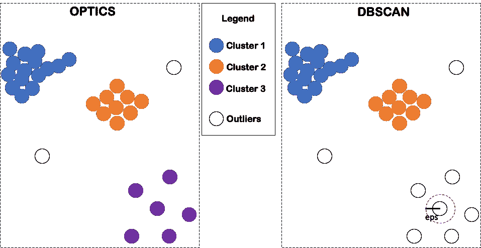

不同密度的示例数据。光学性能优于 DBSCAN。(图片由作者提供)

在上面的例子中，DBSCAN 中的恒定距离参数 *eps* 只能将 *eps* 内的点彼此视为邻居，显然错过了图右下方的集群([阅读此贴了解更多关于 DBSCAN](/understanding-dbscan-and-implementation-with-python-5de75a786f9f) 中参数的详细信息)。如果我们使用一个更大的 *eps* 参数，该集群可以被识别，但它也可能将其他两个顶部集群合并在一起。所以，很难在 DBSCAN 中预定义一个完美的*EPS*；然而，在光学中，我们不需要担心这一点。

在本帖中，我将谈谈如何理解这个算法，以及如何用 Python 实现它。希望文章有帮助。

## 理解光学

正如您所记得的，在 DBSCAN 中应用了单一的距离截断来确定两个数据点是否彼此靠近(相邻)。但是如上例所示，这可能不是理想的解决方案，因为一个集群中的“长”距离可能是另一个集群中的“短”距离。

就像全国的房价一样，30 万的房子在我住的镇上相当贵，但在曼哈顿却很便宜。这就是为什么当我们看不同组(群)的房子(数据点)时，记住不同的价格标准是很重要的。

那么，在光学中，我们如何将不同群体对距离的不同“标准”考虑在内呢？最直接的方法之一就是与*本地环境*(上下文)进行比较。具体来说，如果我们有兴趣确定从 A 点到 B 点的距离是大还是小，我们可以将距离(A 到 B)与局部环境中所有成对的距离进行比较。

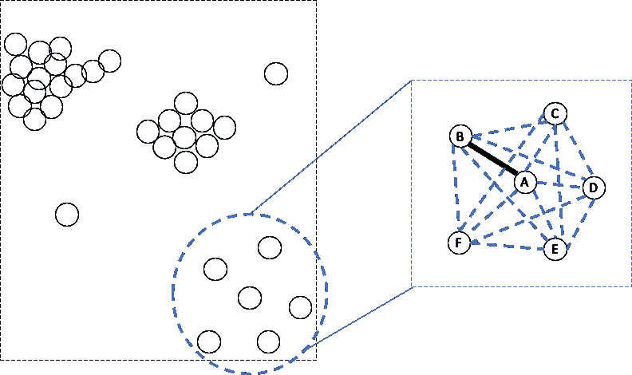

比较从 A 到 B 到当地环境的距离(图片由作者提供)

正如我们从上面的图解中看到的，与本地环境中的所有成对距离相比，从 A 到 B 的距离并不算大，对吗？所以，我们应该把 A 和 B 看作邻居(A 和 B 在距离上很近)。

在前面判断 A 到 B 的距离大不大的步骤中，你可能已经注意到了几个不是很清楚的东西。举个例子，

> 1.如何定义一个“局部区域”？尤其是当没有像示例中所示的这样清晰的数据分离时？
> 
> 2.如何确定一个局部环境是否值得调查？如果没有足够的配对距离让我比较呢？
> 
> 3.真的有必要考虑区域中所有成对的距离吗？例如，比较从 A 到 B 的距离和从 B 到 D 的距离是否公平(特别是当我们已经知道 B 和 D 似乎是局部区域的对立边界时)？

如果你有上面列出的问题，恭喜你！因为你思考的方向是正确的！

首先，要定义一个“局部区域”，我们需要一个中心和一个半径(与 DBSCAN 中的概念相同)。例如，A 点是我们想参观的第一个点，我们想参观 A 的本地。我们设置 A 为圆心，预定义值 *r* 为半径，局部区域定义为圆内的面积(如下图)。

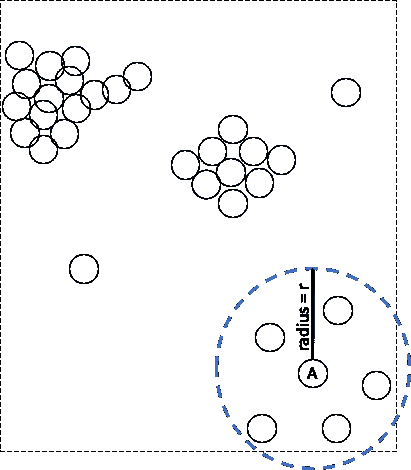

定义我们想要调查的“局部区域”(图片由作者提供)

在上面的示例图中，显然，r 是围绕点 A 的半径的良好选择，因为它完美地覆盖了数据点的“局部聚类”。然而，在现实中，我们看不到数据的全貌，或者我们没有那些“局部聚类”的清晰分离。因此，通常将 r 设置为一个相对较大的值是一个很好的做法，这样可以避免当你站在 a 点时出现在一个非常小的区域。

其次，为了确定一个区域是否值得研究，我们设置了一个最小数量的数据点作为标准。例如，只有在至少有 N 个数据点(包括中心本身)的情况下，上一步定义的“局部区域”才值得研究。

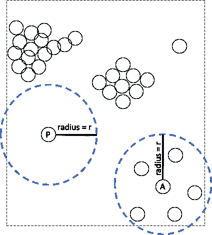

P 点不值得调查 N=3(图片由作者提供)

在上面的图中，我们设置 N= 3，这意味着一个区域只有在超过 3 个数据点时才值得研究。因此，点 P 周围的区域不会作为“局部区域”进行调查，因为它没有任何邻居，并且我们无法比较任何成对的距离。

第三，你可能已经注意到，当我们想要确定从 A 到 B 的距离是否很大时，没有必要计算“局部区域”内的所有成对距离。让我们再来看看局部区域中的成对距离，

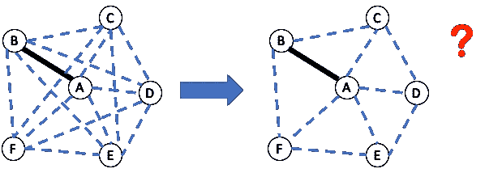

将局部区域中的所有成对距离简化为成对距离。(图片由作者提供)

如上图左图所示，A 点和 B 点在图中“相邻”，但 B 点和 D 点不相邻。毫无疑问 AB 比 BD 短，所以比较 A 到 B 的距离和 B 到 d 的距离既不公平也没有必要，有没有办法让我们只考虑那些“相邻”点之间的距离(如上面右图所示)？

实际上，在上面的图中，减少从左到右的比较是非常理想的，因为我们有更多的数据点，位置更加复杂，我们很难手动选择这些边缘与 A 到 b 的距离进行比较。

或者，我们可以用迭代的方式来解决这个问题吗？比如我们逐个访问局部区域内的点，每次只记录当前点到其相邻点的距离然后移动到下一个点。在访问了该区域的所有点之后，我们记录了所有相邻的距离。通过这种方式，我们不必提前看到距离的全貌，也不必在访问完所有成对的距离后手动选择这些距离。

这是一个很好的方法，但是我们能进一步降低复杂度吗？

好吧，我不想让你感到困惑，所以让我再次陈述这个问题。我们希望将 A 和 B 之间的距离与所有其他成对的“相邻”距离进行比较，以确定 A 和 B 是否彼此接近。

你还记得为什么我们想知道 A 和 B 之间的距离与其他成对距离相比是大还是小吗？我们想知道 B 是否属于当前访问的数据点聚类(以点 A 为中心的聚类)。换句话说，我们希望使用距离度量来确定一个点对于一个数据点集群是否是**可达的**。

可达或不可达。嗯……我们能给每个点分配一个可达性分数吗？那会简单很多吗？可达性分数大的地方是集群不能到达的地方，可达性分数小的地方是集群内部可以到达的地方。

如果你在这里感到有点失落，不要担心。请跟我走一遍整个过程，我相信你会明白我在说什么。

以下是步骤:

首先，我们访问 a 点周围的局部区域。我们计算从中心点到该区域中所有其他点的距离，AB、AC、AD、AE 和 AF，并记录它们。我们**对记录的距离进行**排序，并将这些距离视为当前可达性得分。我们还需要将 A 推送到最终的分数列表，以便不再访问它。作为初始点，A 是没有赋值的，所以让它保持空白(或者我们可以给它赋一个超大的值)。

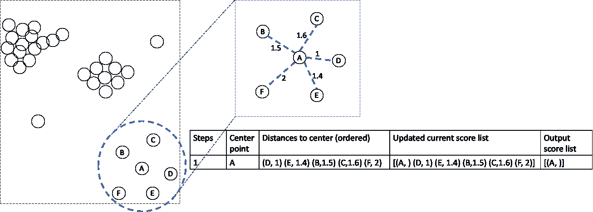

第一步。(图片由作者提供)

接下来，我们访问可达性分数最小的点(点 D)，该点也是离当前中心点最近的点。我们使用这个新点作为中心点，并计算从当前中心点到其邻域内没有被访问过的其他点的距离。

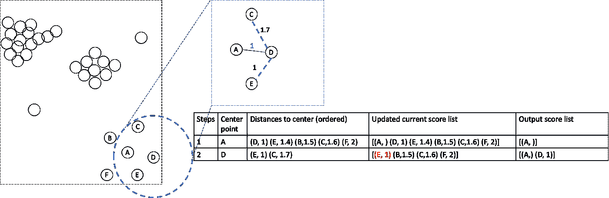

第二步。(图片由作者提供)

如上图所示，我们只计算 D 到 C 的距离和 D 到 E 的距离，因为 A 已经被访问过了(不需要再计算)。然后，如果可用，我们用较小的分数更新当前可达性分数列表。这里，E 的新分数为 1，小于上一步中的分数(步骤 1 中 E=1.4)。所以，我们**更新** E 的分数。但是 C 点的分数比第一步大，这意味着 C 从 A 比从 d 更容易到达。所以，我们在这一步保持 C 的分数**不变**。在没有调查的情况下，B 和 F 在该步骤中不被更新。

请记住，我们希望记录每个点的最小可达性分数，以便声明它是否属于当前集群，因此当有更小的分数可用时，我们**不能**对 C 使用大的分数。如果我们仅仅因为没有使用 C 点的最佳得分而将其排除在集群之外，这对于 C 点是不公平的。

第三，我们移动到 E，因为 E 在当前列表中具有最小的可达性分数。

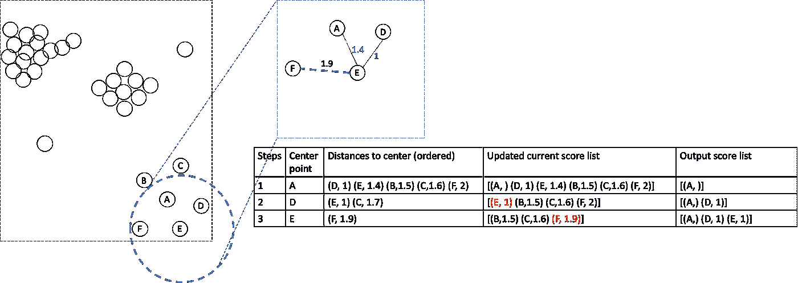

第三步。(图片由作者提供)

如上图所示，我们只需要计算从 E 到 F 的距离，因为在前面的步骤中已经执行了 A 和 D。我们为 F (F = 1.9)得到一个稍小的可达性分数，所以我们在当前分数列表中更新它。

接下来，B 点具有最小的可达性分数，因此我们在该步骤中将其用作当前中心点。

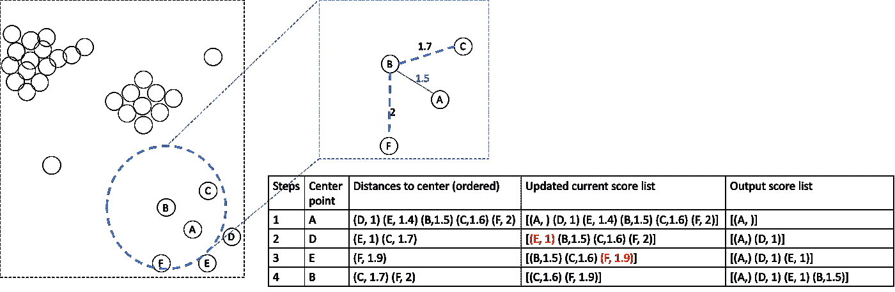

第四步。(图片由作者提供)

步骤 4 中没有更新可达性分数，因为我们找不到更小的值。然后我们以 C 为中心点进行第五步。

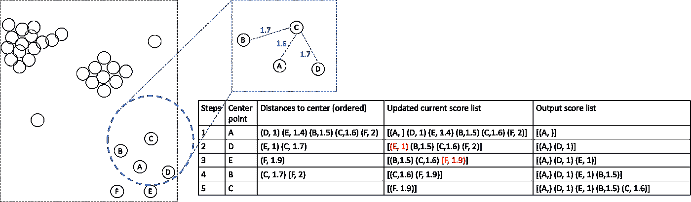

第五步。(图片由作者提供)

然后我们以点 F 为中心点，将 F 的可达性得分输出到列表中。

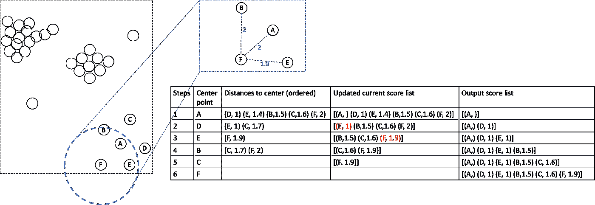

第六步。(图片由作者提供)

到目前为止，我们已经访问了当前本地的所有六个点，并获得了最终的可达性得分列表。这样，我们就不会错过“相邻”点之间的任何成对距离。此外，我们得到了一个有序的分数列表，它度量了调查聚类中的点的可达程度。

上面描述的过程是否比计算区域中所有成对的距离简单得多？

实际上，我们可以将这个过程应用于整个数据集。比如以 F 为中心点参观后，我们在当地就没有其他未参观的点了。然后，下一个中心点可以是数据集中的任何其他数据点。

如果我们按照参观的顺序画出一条连接中心点的可能的完整路径，它可能类似于下图。

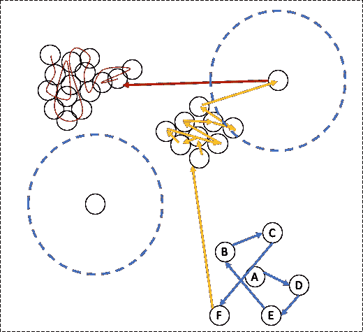

整个数据集中的中心点路径(图片由作者提供)

您可以将路径想象为一条贪婪的蛇，它想通过总是咬下一个最近的球(在分数列表中)来吃掉图中的所有球(数据点)。

右上角的单个点与中间聚类的预定义邻域(半径为 r)有一个“邻居”，因此在橙色部分的最后一步中对其进行了访问。但是，左下方的点根本没有“邻居”，所以从来没有调查过，因为它不符合我们的标准，即一个区域只有至少有 N = 3 个邻居(包括它自己)才值得调查。

完成所有这些后，我们得到了一个可达性分数列表，我们可以用它做什么呢？别忘了我们的目标是定义一个点是否属于局部聚类。例如，这是我们得到的分数列表，

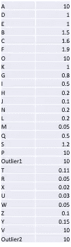

分数列表(图片由作者提供)

如果我们将分数绘制成条形图，我们可以将它们可视化如下。

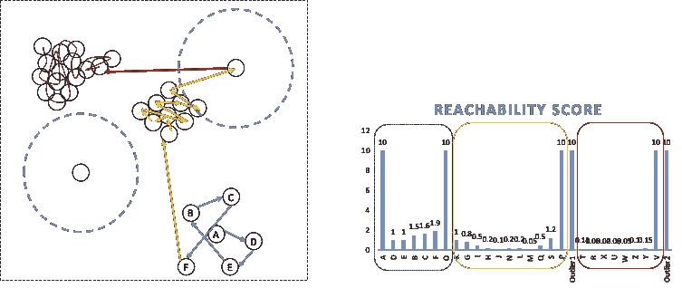

可达性得分图(作者图片)

您可能已经注意到，右边柱状图中的三个谷与左边的三个集群相对应。因此，使用最终的可达性分数列表，我们能够检测到聚类，即使它们具有不同的密度。

此外，您可以发现更密集的集群(左侧面板左上角的棕色集群)对应于条形图上更深的山谷(右侧面板上用棕色圈出的山谷)。一个更稀疏的集群(左侧面板右下方的蓝色集群)对应于一个相对较浅的山谷(柱状图最左侧的圆圈)。

请记住，我们将一个值得参观的街区定义为至少有 3 个邻居的区域。我们可以把这三个邻居视为邻里关系的核心。实际上，我们并不太关心这些点是否位于核心，因为它们显然属于这个集群。因此，通常对于核心中的所有点，我们将核心大小设置为它们的可达性分数。

例如，在下图中，在以 A 为中心、半径为 r 的区域中有六个点。该区域的核心由 A、D 和 E 组成，因为 D 和 E 是距离 A 最近的两个点(N = 3)。我们知道 D 在核心之内，所以不用记录 A 到 D 的确切距离(一个很小的值)。我们可以简单地将核心大小(核心的半径)指定为点 d 的得分。

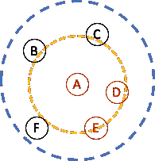

核心尺寸以橙色突出显示。用蓝色突出显示的邻近区域。(图片由作者提供)

在通过核心大小近似核心内的点的分数之后，我们可以从最终可达性分数列表中得到的最小值就是核心大小。我们为什么要这么做？第一，避免记录那么多无用的微小微小值；第二，使柱状图中的波谷看起来更平滑(如下所示)。

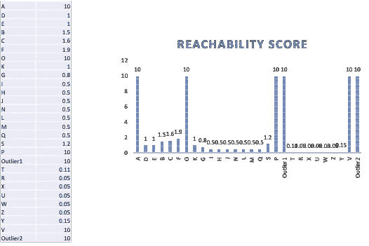

将微小分数设置为分数大小。(图片由作者提供)。

我没有使用任何来自光学的概念，但上面描述的程序正是光学。如果你一直往下看，你已经理解了光学。

让我从教科书中抽出一些描述，并简要说明它们是如何嵌入我上面的解释中的。

## 光学算法

大部分教材都是这样开头的，“光学的基本思想类似于 DBSCAN 但是比 DBSCAN 多了两个概念”。让我用一些官方词汇来描述光学中的这两个概念，并告诉你这些复杂的术语实际上指的是我上面的简单语言描述。

> 在光学中，每个点被分配一个*核心距离*，它描述了到第 *MinPts* 最近点的距离，以及从点 *p* 到另一个点 *o* 的可到达距离，该距离或者是 *o* 和 *p、*之间的距离，或者是 *p* 的核心距离，以较大者为准。

核心距离就是我所描述的核心大小，它只是作为近似核心内部点的距离的阈值。可达性距离就是我们记录的每个点的可达性分数。

这是教科书上的算法伪代码。

```
**function** OPTICS(DB, eps, MinPts) **is**
    **for each** point p of DB **do**
        p.reachability-distance = UNDEFINED
    **for each** unprocessed point p of DB **do**
        N = getNeighbors(p, eps)
        mark p as processed
        output p to the ordered list
        **if** core-distance(p, eps, MinPts) != UNDEFINED **then**
            Seeds = empty priority queue
            update(N, p, Seeds, eps, MinPts)
            **for each** next q in Seeds **do**
                N' = getNeighbors(q, eps)
                mark q as processed
                output q to the ordered list
                **if** core-distance(q, eps, MinPts) != UNDEFINED **do**
                    update(N', q, Seeds, eps, MinPts)
```

我知道这很难理解。所以，忽略它，和我前面几段用的步骤一模一样。这里光学最终输出的是可达性距离列表，也就是我们之前看到的可达性得分列表。

实际上，当可达性距离柱状图生成时，光学器件停止工作。最终的聚类步骤需要手动执行，这就是为什么严格来说，OPTICS 是**而不是**一种聚类方法，而是一种显示数据集结构的方法。

## Python 中的实现

用 Python 实现光学非常容易，

```
**from** **sklearn.cluster** **import** OPTICS

optics_clustering = OPTICS(min_samples=3).fit(X) 
```

如果您想知道数据点的最终标签，请使用

```
optics_clustering.labels_
```

很简单，对吧？

您可能已经注意到，在光学实现代码中没有名为 eps 的参数。那是因为这个参数只要不是超级小，其实并不会影响结果。想象一下，当你第一步站在 A 点时的最大视野。为什么？如果你再看一遍帖子，就很容易得到答案。

就是这样！如果你喜欢看我的帖子。请[订阅我的媒介账号](https://jianan-lin.medium.com/subscribe)！

干杯！

## 参考资料:

[](https://scikit-learn.org/stable/modules/generated/sklearn.cluster.OPTICS.html) [## sklearn.cluster.OPTICS

### 从向量数组估计聚类结构。光学(排序点以识别聚类结构)，密切…

scikit-learn.org](https://scikit-learn.org/stable/modules/generated/sklearn.cluster.OPTICS.html) [](https://en.wikipedia.org/wiki/OPTICS_algorithm) [## 光学算法-维基百科

### 对点进行排序以识别聚类结构(光学)是一种算法，用于在

en.wikipedia.org](https://en.wikipedia.org/wiki/OPTICS_algorithm)