# 使用 Transformers、cleanlab 和主题建模了解文本数据中的异常值

> 原文：<https://towardsdatascience.com/understanding-outliers-in-text-data-with-transformers-cleanlab-and-topic-modeling-db3585415a19>

## 用于审计文本数据集的开源 python 工作流


图片来自 [Pixabay](https://pixabay.com/) 的 [LubosHouska](https://pixabay.com/users/luboshouska-198496/) 。

许多文本语料库包含异构文档，其中一些可能是异常的，值得更多地理解。特别是对于已部署的 ML 系统，我们可能希望自动标记与它们的训练数据不来自同一发行版的测试文档，并理解这些新文档中出现的、训练数据中没有的主题。

我最近作为一名 ML 工程师加入了 [Cleanlab](https://cleanlab.ai/) ，并很高兴地分享我们的[开源库](https://github.com/cleanlab/cleanlab?utm_medium=tds)(在 AGPL-v3 许可下免费提供)可以在各种工作流中用于理解和改进数据集的许多方式。

这篇文章演示了如何通过一个基于开源 Python 包的工作流来发现和分析大型 NLP 语料库中的异常文本:Transformers、cleanlab、pytorch、UMAP 和 BERTopic 的 c-TF-IDF 实现。我们使用变压器来获得原始文本的良好表示，使用 cleanlab 来识别表示空间中的异常值，使用 UMAP + c-TF-IDF 来更好地理解这些异常。

我们将使用抱脸中枢上的 [**MultiNLI** 数据集，这是一个常用于训练语言理解模型的自然语言推理数据集。](https://huggingface.co/datasets/multi_nli)

*   数据集包含多对句子(前提、假设)，这些句子已经被标记为前提是否需要假设(`"entailment"`)或不需要假设(`"contradiction"`)。中性标签也包括在内(`"neutral"`)。
*   语料库被分成单个训练集和两个验证集。
*   训练集来源于 5 个不同的流派:`[fiction, government, slate, telephone, travel]`。
*   *匹配验证集*来源于*匹配*训练集中的那些流派
*   另一个验证集，也称为*错配验证集*，来源于*训练数据中不存在的其他*流派:`[nineeleven, facetoface, letters, oup, verbatim]`。
*   更多关于语料库的信息可以在找到[。](https://cims.nyu.edu/~sbowman/multinli/)

这篇文章中的步骤可以应用于你自己的单词/句子嵌入模型和任何包含多个文本来源的数据集。

## 太长；没有运行(代码)

以下是我们从多个文本源中检测异常值并从中发现新主题的一般工作流程:

*   从 Hugging Face Hub 加载并预处理文本数据集，以创建 PyTorch 数据集。
*   应用预先训练的句子嵌入模型从文本中创建向量嵌入。
    ——这里我们利用了一个基于 [SentenceTransformers](https://huggingface.co/sentence-transformers) 库中的连体神经网络的双编码器。
*   使用 [cleanlab](https://github.com/cleanlab/cleanlab?utm_medium=tds) 库查找训练数据中的异常文本。
*   在验证数据中查找非来自训练集中数据分布的异常值示例。
    —这类似于在新的数据源/提要中寻找异常。
*   选择一个阈值，以决定是否将某个示例视为异常值。
*   将所选的异常示例进行聚类，以找到异常的文本类型/来源。
*   识别异常类型/来源中的主题。

我们的主要目标是在数据集中找到非分布的例子，更多地关注新的类型/领域/来源。在 MultiNLI 数据集的情况下，使用这些方法，以下 4 个示例中只有 1 个被认为是异常的。(你能猜到是哪个吗？)

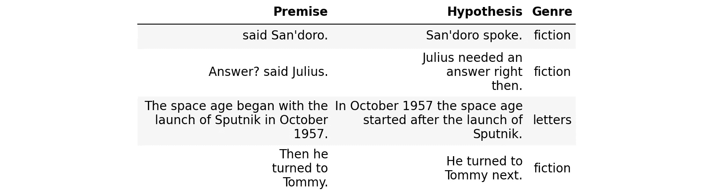

正如所预料的那样，我们的方法识别出的最有可能的异常值来自不匹配的验证集中的流派。

这些离群值示例中的许多基于它们各自的类型形成聚类，这可用于发现数据中的非分布主题。

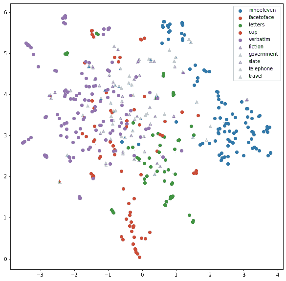

# 让我们开始编码吧！

本文的剩余部分将展示我们如何用完全可运行的代码实现我们的策略！这里有一个笔记本的链接，你可以在那里运行相同的代码:[链接](https://github.com/elisno/outlier_mnli/blob/main/outlier_mnli.ipynb)

## 安装依赖项

您可以通过运行以下命令来安装所有必需的软件包:

```
!pip install cleanlab datasets hdbscan matplotlib nltk sklearn torch tqdm transformers umap-learn
```

接下来，我们将导入必要的包，将日志记录级别设置为“ERROR ”,并为可再现性设置一些 RNG 种子。

## 预处理数据集

MultiNLI 数据集可以通过其`datasets` api 从 Hugging Face Hub 获取。我们执行的唯一预处理是从数据集中移除未使用的列/特征。注意，在这篇文章中，我们不是*而是*查看数据集中的蕴涵标签(`label`)。更确切地说，我们只是简单地试图仅基于它们的文本来自动识别出非分布的例子。

为了评估我们的离群点检测算法，我们认为来自不匹配验证集的所有例子都是分布外的例子。我们仍然会使用匹配的验证集来发现自然出现的异常例子。我们的算法也不需要类型信息，这仅用于评估目的。

为了对数据格式有所了解，我们将看看每个数据集中的几个例子。

```
Training data
Genres: ['fiction' 'government' 'slate' 'telephone' 'travel']
```

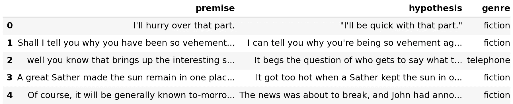

```
Validation matched data
Genres: ['fiction' 'government' 'slate' 'telephone' 'travel']
```

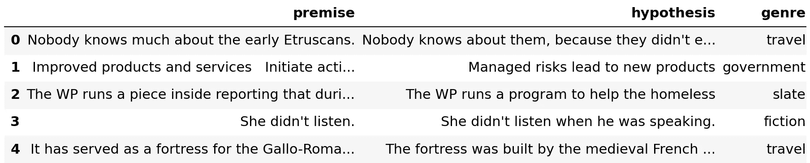

```
Validation mismatched data
Genres: ['facetoface' 'letters' 'nineeleven' 'oup' 'verbatim']
```

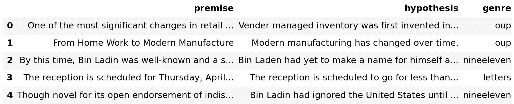

# 将 NLI 数据转换成矢量嵌入

我们将使用预训练的 SentenceTransformer 模型在 MultiNLI 数据集中嵌入句子对。

从 NLI 数据(包括 MultiNLI)训练句子编码器的一种方法是在如下所示的连体 BERT 网络上添加一个 3 路 softmax 分类器。

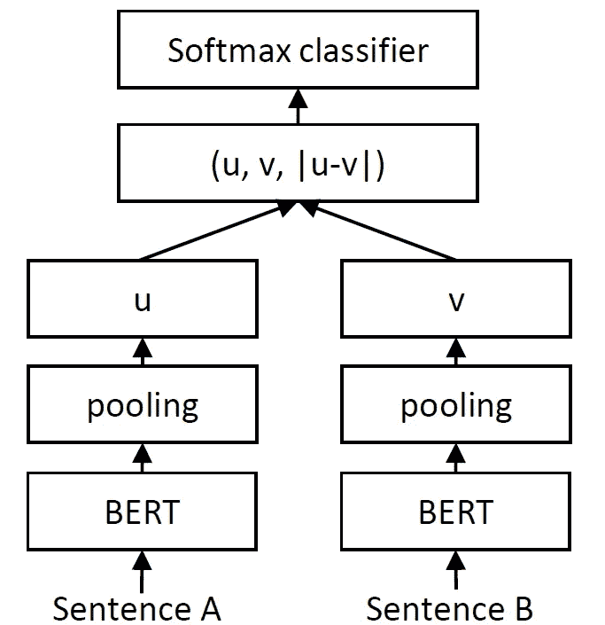

带有 softmax 分类器的连体网络。图片取自 [SBERT docs](https://www.sbert.net/examples/training/nli/README.html) 。

我们将使用这种网络的(u，v，| u — v |)层的输出作为每个句子对的单个向量嵌入。这比将句子对连接成单个字符串更可取，因为这将增加截断模型输入和丢失信息(特别是来自假设的信息)的风险。

下一步，您必须从 Hugging Face Hub 中选择一个预训练的 tokenizer+模型，它将为网络的池化层提供令牌嵌入。

这是通过在 Hub 上提供模型的名称来实现的。

## 使用 cleanlab 查找数据集中的异常值

我们可以用 cleanlab 的`OutOfDistribution`类发现训练数据中的异常值。这将使最近邻估计器适合训练数据(在特征空间中),并基于每个示例与其 *K* 最近邻的平均距离返回每个示例的异常值分数。

```
# Get outlier scores for each of the training data feature embeddings
ood = OutOfDistribution()
train_outlier_scores = ood.fit_score(features=train_embeddings)
```

我们可以查看训练数据中最高的异常值。

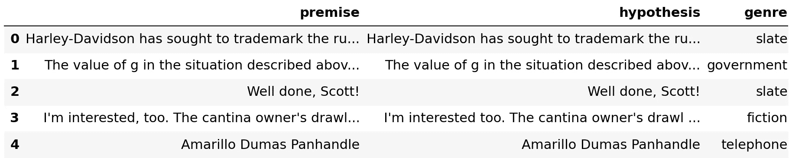

接下来，我们使用拟合的最近邻估计量来获得验证数据的异常值，包括匹配和不匹配的验证集。

```
# Get outlier scores for each of the feature embeddings in the *combined* validation set
test_feature_embeddings = np.concatenate([val_matched_embeddings, val_mismatched_embeddings], axis=0)
test_outlier_scores = ood.score(features=test_feature_embeddings)
```

首先，我们看看验证数据中最大的异常值。

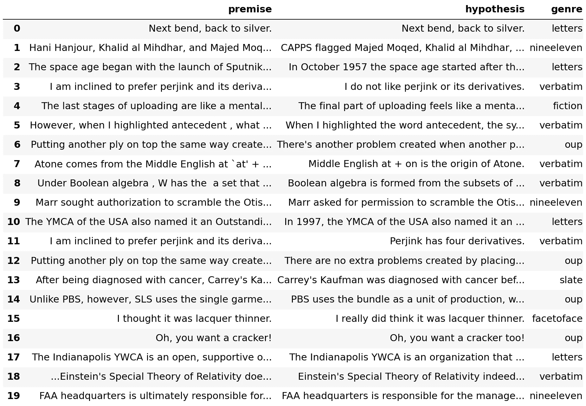

尽管组合的确认集在匹配和不匹配的风格方面是平衡的，但是大多数具有高异常值分数的例子来自不匹配的确认集(`[nineeleven, facetoface, letters, oup, verbatim]`)。

将此与另一端被认为不太可能是异常值的例子进行比较。

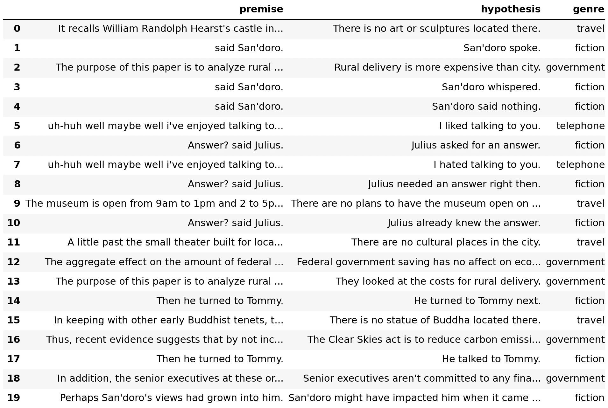

这些例子仅来自匹配确认集中的 5 个流派中的 4 个(`[fiction, government, telephone, travel]`)。唯一的例外是`slate`类型，但是第一个例子出现在列表的更下方。

## 评估异常值分数

实际上，如果我们已经知道不匹配的数据集包含与训练集中不同的流派，我们可以分别对每个流派进行离群点检测。

*   即从`nineeleven`检测异常句子对，然后从`facetoface`检测异常句子对，等等。

为了保持简洁，现在让我们考虑组合验证集中的异常例子。

我们可以设置一个阈值来决定组合验证集中的哪些例子是异常值。我们将保守地使用训练数据中异常值分数分布的第 2.5 个百分点作为阈值。该阈值用于从组合验证集中选择样本作为异常值。

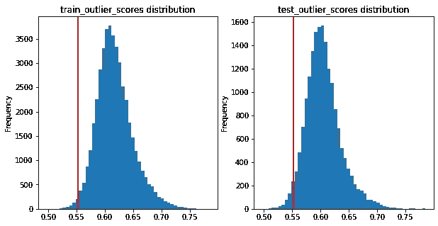

这将导致一些误报，如下所示。

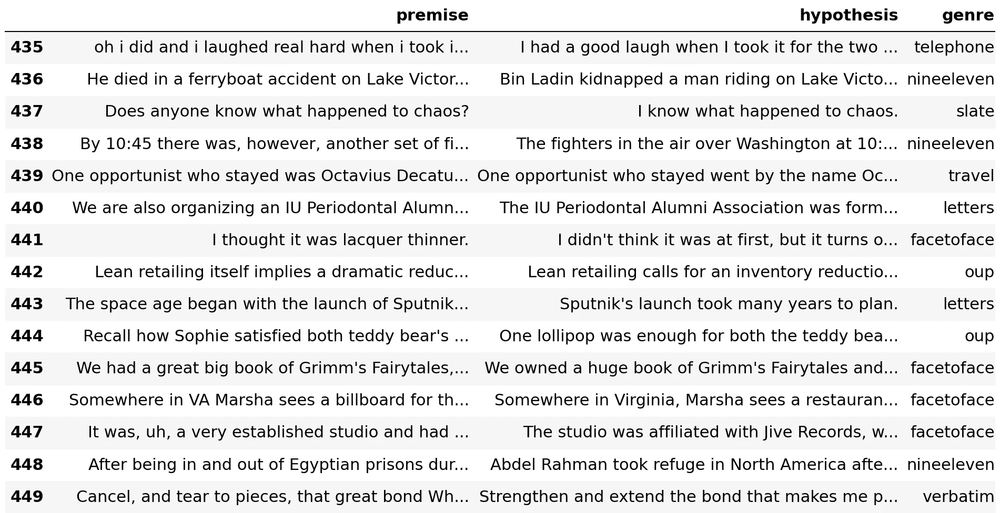

## 聚类异常值

让我们假设我们不知道来自不匹配数据集的流派的内容。我们可以尝试从验证集中聚集离群值，看看我们是否能对不匹配的类型有更好的了解。

根据这一假设，使用基于密度的聚类算法(如 HDBSCAN)是有意义的，它可以处理所选异常值示例中的噪声。不幸的是，它在高维数据上表现不佳。我们将使用 UMAP 来降低数据的维数。出于可视化的目的，我们将把维度降低到 2 维，但是如果您希望有一些重叠的集群，那么您可能会受益于稍微更高的维度。


快速浏览一下，我们会发现不匹配的类型往往会聚集在一起。只有`facetoface`与`verbatim`和大部分匹配的流派重叠。我们最好的办法是寻找小的局部聚类，看看一个流派如何包含多个主题。我们必须设置一个相对较小的最小集群大小，并允许更多的本地化集群。这可以通过降低 HDBSCAN 算法中的`min_cluster_size`和`min_samples`参数来实现。

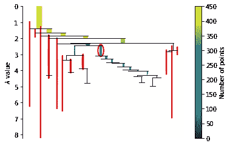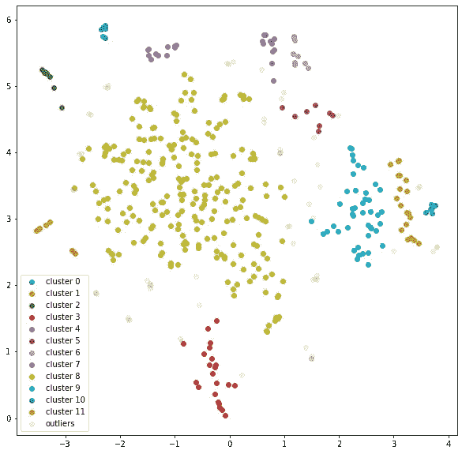

基于视觉检查，边缘上的聚类相对较纯，即每个聚类中的大多数点来自同一流派。

主要的例外是:

*   紫罗兰集群由 3 个流派组成。
*   中间的黄绿色簇中有多个重叠的流派。
    —这表明`verbatim`是一个“分布中”的主题。这对于测试 NLI 模型是没有用的。
    —这在某些情况下可以删除。

大多数“纯粹的”`verbatim`星团可能太小而没有洞察力，但是更大的`nineeleven`和`oup`星团是有希望的。

# 使用 c-TF-IDF 查找主题

从密集的句子/文档嵌入群中提取主题的一个有用的方法是使用 [c-TF-IDF](https://maartengr.github.io/BERTopic/api/ctfidf.html) 。James Briggs 的一篇[好文章](https://www.pinecone.io/learn/bertopic/)为预计算嵌入和集群提供了 c-TF-IDF 的清晰实现。我们在下面重用了部分实现。为了简单起见，我们使用 unigrams 来提取主题。

查看每个聚类中 c-TF-IDF 得分最高的单词，应该会让我们对该聚类的主要主题有所了解。

```
Topic class 0: ['barrel', 'firearm', 'ramrod', 'patch', 'monkey', 'ball', 'wood']
Topic class 1: ['prefer', 'perjinkety', 'nicety', 'perjinkity', 'duende', 'perjink', 'derivatives']
Topic class 2: ['flamable', 'inflammable', 'trucks', 'onomatoplazia', 'substituted', 'delaney', 'examples']
Topic class 3: ['industry', 'retailer', 'lean', 'bundle', 'inventory', 'production', 'marker']
Topic class 4: ['muskrat', 'another', 'baby', 'version', 'muscat', 'lollipop', 'ramble']
Topic class 5: ['mihdhar', 'moqed', 'khalid', 'majed', 'hanjour', 'hani', 'al']
Topic class 6: ['abu', 'king', 'farouk', 'training', 'afghanistan', 'ubaidah', 'banshiri']
Topic class 7: ['agreed', 'ladins', 'war', 'efforts', 'turabi', 'bin', 'ladin']
Topic class 8: ['water', 'two', 'first', 'word', 'words', 'english', 'one']
Topic class 9: ['hazmi', 'fighters', 'boston', 'center', 'aircraft', 'command', 'hijacking']
Topic class 10: ['referred', 'tried', 'controller', 'york', 'united', 'crew', 'transponder']
Topic class 11: ['turned', 'shootdown', 'center', 'information', 'neads', 'united', 'american']
Outliers: ['cracker', 'atom', 'iupui', 'penney', 'american', 'bangers', 'controller']
```

让我们用相关的主题可视化集群嵌入(左)。为了进行比较，我们将把相同的嵌入和它们的原始类型想象成标签(右)。

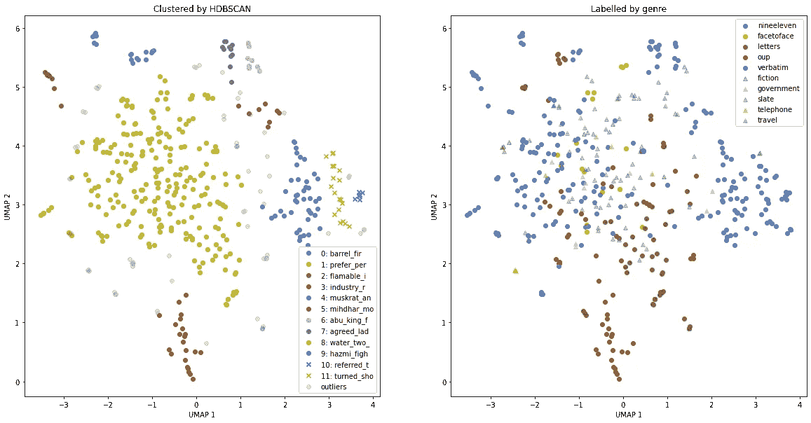

在`nineeleven`类型中，有几个主题很突出，一些是关于美国航班，另一些是关于中东领导人。在`oup`类别中发现了一个主题，似乎是关于纺织品的。其余流派重叠太多，无法获得有意义的话题。处理重叠聚类的一种方式是专门在这些点上重复先前的聚类，例如，通过从分析中移除`nineeleven`，并根据需要递归地重复该过程。

## 结论

这个分析演示了如何识别和理解文本数据中的异常值。所需的方法在开源 Python 库中都可用且易于使用，您应该能够将这里演示的相同代码应用于您自己的文本数据集。

关键的一点是用能给出高质量嵌入的模型对文本示例进行编码，并对这些嵌入应用离群点检测算法，以便为主题建模步骤只选择罕见/不寻常的示例。

你可能会对 BERTopic 包感兴趣，它可以用于:通过 BERT 变换器嵌入文本，通过 UMAP 减少其维数，通过 HDBSCAN 进行聚类，通过 c-TF-IDF 识别每个聚类中的主题。

我希望识别和理解异常值有助于您在自己的应用程序中确保更高质量的数据和 ML 性能。您可以选择从您的数据集中忽略此类示例，或者扩展您的数据收集以更好地覆盖此类案例(如果它们看起来相关)。

除非另有说明，所有图片均为作者所有。

## 参考

[1] A. Williams，N. Nangia 和 S. Bowman，[通过推理理解句子的大范围挑战语料库](http://dx.doi.org/10.18653/v1/N18-1101) (2018)，计算语言学协会北美分会 2018 年会议记录:人类语言技术，第 1 卷(长论文)，第 1112-1122 页，路易斯安那州新奥尔良。计算语言学协会。

[2] N. Reimers 和 I. Gurevych，[句子-伯特:使用暹罗伯特网络的句子嵌入](https://doi.org/10.48550/arXiv.1908.10084) (2019)，2019 年自然语言处理经验方法会议录

[3] C. Northcutt 和 J. Mueller， [cleanlab 2.1 增加了多注释者分析和离群点检测:走向以数据为中心的人工智能的广泛框架](https://cleanlab.ai/blog/cleanlab-v2.1) (2022)，cleanlab

[4] J. Kuan 和 J. Mueller，[回到基础:再访分布外检测基线](https://doi.org/10.48550/arXiv.2207.03061) (2022)，ICML 分布转移原理研讨会 2022

[5] J. Briggs，[高级主题建模与 BERTopic](https://www.pinecone.io/learn/bertopic/) (2022)，松果

[6] M. Grootendorst， [BERTopic:基于类的 TF-IDF 程序的神经主题建模](https://doi.org/10.48550/arXiv.2203.05794) (2022)，arXiv 预印本 arXiv:2203.05794