# 了解回归模型中的部分效应、主效应和交互效应

> 原文：<https://towardsdatascience.com/understanding-partial-effects-main-effects-and-interaction-effects-in-a-regression-model-54e8a127c62d>


图片由 [Pixabay](https://pixabay.com/vectors/boys-studying-children-student-1844435/) ( [Pixabay 许可](https://pixabay.com/service/license/))的[欧米娜](https://pixabay.com/users/eommina-1183101/)拍摄

## 我们将学习如何使用合适的例子在回归模型中识别和测量这些影响。

在本文中，我们将弄清楚如何计算回归变量对回归模型响应变量的部分(或边际)效应、主要效应和交互效应。我们还将学习如何根据适当的效果来解释回归模型的系数。

先说部分效应，也叫边际效应。

# 部分效应

> 在回归模型中，回归变量的部分效应是回归变量中每单位变化的响应变量值的变化。

在微积分的语言中，部分效应是响应的期望值相对于感兴趣的回归变量的偏导数。

让我们来看三个日益复杂的部分效应的例子。

考虑以下线性回归模型:

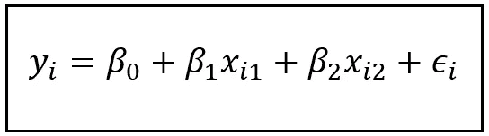

仅包含线性项的线性回归模型(图片由作者提供)

以上模型中 ***，y*** 为因变量，***x****_ 1****，x*** *_2* 为回归变量。 *y_i* 、 *x_i_1* 和 *x_i_2* 是对应于第*个*个观察值，即数据集第*个*行的值。

*β_0* 为截距。 *ϵ_i* 是捕获 *y_i* 中模型无法解释的方差的误差项。

当我们在数据集上拟合上述模型时，我们正在估计期望值，即 *x_i_1* 和 *x_i_2* 的一些观察值的 *y_i* 的平均值。如果我们应用期望操作符 *E(。)*在等式(1)的两边，我们得到下面的等式(注意，误差项已经消失，因为它的期望值是零):

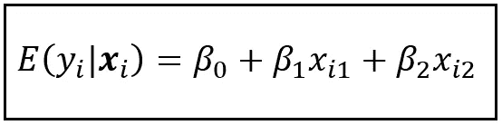

y_i 的期望值取决于 **x** _i(图片由作者提供)

*x_i_1* 和 *x_i_2* (或一般情况下**x***_ 1*和***x****_ 2*)对 *y_i* 期望值的偏导数分别为 *y_i* w.r.t. *x_i_1*

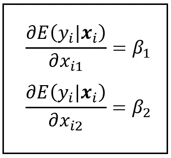

x_i_1 和 x_i_2 对 E(y_i)的部分效应(图片由作者提供)

> 在仅包含线性项的线性模型的情况下，部分效应只是各自的系数。在这样的模型中，部分效应是常数。

现在，让我们通过添加一个二次项和一个交互项来稍微调整一下这个模型:

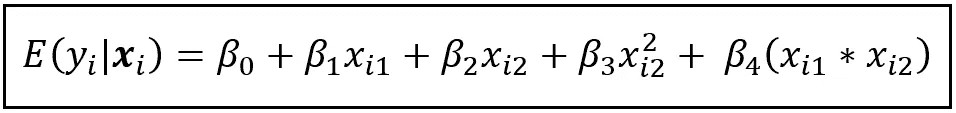

包含线性、二次和交互项的线性模型(图片由作者提供)

上述模型仍然是线性模型*，因为其系数*是线性的。但是 *x_i_2* 对 *y_i* 期望值的部分影响不再是常数。相反，效果取决于 *x_i_2* 和 *x_i_1* 的当前值，如下所示:

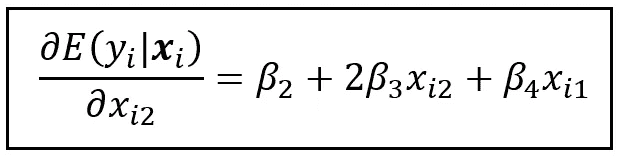

E(y_i) w.r.t. x_i_2 的变化率取决于 x_i_2 和 x_i_1 的当前值(图片由作者提供)

最后，让我们看看下面这个包含指数均值函数的非线性模型。该模型用于模拟泊松过程的均值函数:


指数均值函数(图片由作者提供)

在该模型中， *x_i_1* 的部分效果如下:

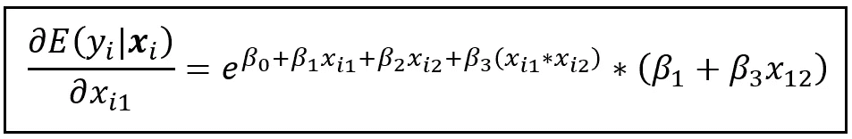

x_i_1 对 E(y_i)的部分效应(图片由作者提供)

在这种情况下，每单位改变 *x_i_1* 的 *y_i* 的期望值的改变不仅是*而不是*常数，而且它取决于模型中每个单个变量的当前值，以及所有系数的值。

让我们把注意力转向回归模型中的**主效应**意味着什么。

# 主要效果

> 在仅包含线性项的线性回归模型中，每个回归变量的**主效应**与该变量的部分效应相同。

让我们回顾一下文章开头提到的线性模型:


仅包含线性项的线性回归模型(图片由作者提供)

以上模型中的主要效果简单来说就是 *β_1* 和 *β_2。*

由于该模型仅包含线性项，因此有时被称为**主效果模型**。

当模型包含二次项、交互项、非线性项或对数线性项时，对主要效应的解释就变得有趣了。

在以下类型的模型中:


包含线性、二次和交互项的线性模型(图片由作者提供)

与变量 ***x*** *_1* 和***x****_ 2*关联的系数 *β_1* 和 *β_2* 不能再解释为与这些变量关联的主效应。那么，在这样的模型中，主要效应是如何计算的呢？

一种方法是计算每个变量的部分效应，并计算数据集每一行的值。然后取所有这些部分效应的平均值。

例如，在上述模型中， *x_i_1* (或一般的***x****_ 1*)对 *E(y_i)* 的部分效应计算如下:

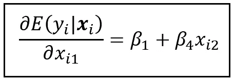

x_i_1 对 E(y_i)的部分效应(图片由作者提供)

为了计算 *x_i_1* 的主效应，我们必须计算数据集中每一行的上述部分效应的值，并取所有这些部分效应的平均值:

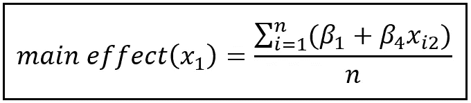

将主效应计算为整个数据集上部分效应的平均值(图片由作者提供)

虽然上述公式为计算主要效应提供了可靠的基础，但它只是一个近似效应，实际上只适用于手头的数据集。事实上，在这样的模型中，主要效应*是否应该*被计算，或者是否应该被简单地忽略，这是有争议的。

让我们把注意力转向交互作用效应。

# 交互效应

让我们通过增加一项来扩展线性模型，如下所示:

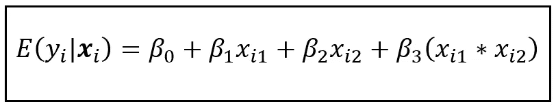

包含交互项的线性回归模型(图片由作者提供)

同样，上述模型仍然是一个线性模型，因为它的系数仍然是线性的。

术语 *(x_i_1*x_i_2)* 是两个回归变量的观察值的乘积，表示两个变量之间的相互作用。这次，当我们对*y _ I*w . r . t .*x _ I _ 1*的期望值进行偏导数时，我们得到如下结果:

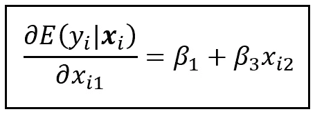

y_i w.r.t. x_i_1 的期望值偏导数包含了相互作用项的影响(图片由作者提供)

*E(y_i)* 相对于 *x_i_1* 的变化不再仅仅是 *β_1* 。由于相互作用项的存在，它是 *β_1* 加上一个取决于当前值 *x_i_2* 乘以相互作用项的系数 *β_3* 的量。如果系数 *β_3* 恰好为负，那么对于 *x_i_1* 中的每一个单位变化，它将减少 *y_i* 中的净变化，如果 *β_4* 为正，它将提升它(假设两种情况下 *x_i_2* 都为正)。

而如果 *β_3* 恰好不具有统计显著性(换句话说，为零)，交互项就失去了作用， *x_i_1* 对 *E(y_i)* 的部分作用又恰好与 *x_i_1* 对 *E(y_i)的主作用相同。*

如果我们对 *E(y_i)* 求二阶导数，这次是 w.r.t. *x_i_2* ，我们得到如下结果:

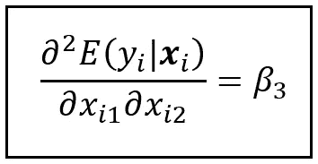

y_i 期望值的二重导数(图片由作者提供)

我们现在可以看到交互项 *(x_i_1*x_i_2)* 对模型的影响。

系数 *β_3* 测量*E(y _ I)*w . r . t .*x _ I _ 1*的变化率，即 *x_i_2* 的每单位变化量。因此， *β_3* 度量了 *x_i_1* 和 *x_i_2 之间的相互作用程度。*

*β_3* 称为**相互作用效应**。

## 相互作用项系数的解释

> 正如主效应一样，交互作用项的系数可以解释为交互作用效应的大小，但仅限于只包含线性项和一个交互作用项的线性模型。

对于所有其他情况，尤其是在非线性模型中，相互作用项的系数在指示相互作用项大小的能力方面没有意义。为了说明，再次考虑下面的非线性模型，该模型将平均值估计为回归变量的指数线性组合。该模型通常用于表示[泊松回归模型](/an-illustrated-guide-to-the-poisson-regression-model-50cccba15958)中的非负[泊松过程均值](/the-poisson-process-everything-you-need-to-know-322aa0ab9e9a):


指数均值函数(图片由作者提供)

*E(y _ I)*w . r . t .*x _ I _ 1*的一阶导数产生了 *x_i_1* 对 *E(y_i)* 的以下部分影响:

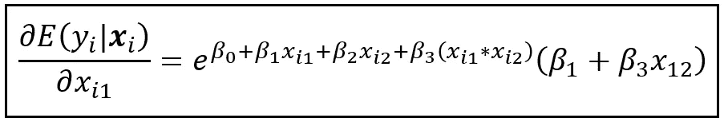

x_i_1 对 E(y_i)的部分效应(图片由作者提供)

显然，相对于只有线性项的线性模型，在上述部分效应中， *x_i_1* 的系数 *β_3* 不再提供 *x_i_1 主效应大小的任何线索。*

*E(y_i)* 的二阶导数，这次 w.r.t. *x_i_2* 给出了一个更加混乱的情况:

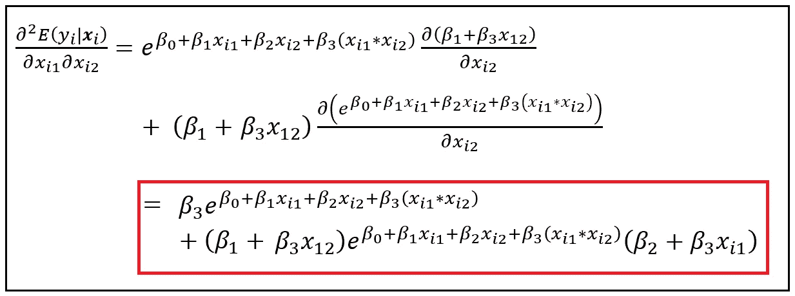

E(y_i)的二重导数先 w.r.t. x_i_1，再 w.r.t. x_i_2(图片由作者提供)

> 关键的一点是，在一个非线性模型中，人们不应该试图给相互作用效应的系数赋予任何意义。

## 添加交互术语的好处

人们可能想知道为什么要在回归模型中引入交互项。

交互项是一种有用的工具，用于表示同一模型中一个回归变量对另一个回归变量的影响。主效应测量响应变量对单个*回归变量的值的变化有多敏感，保持所有其他变量的值不变(或处于它们各自的平均值)，而交互效应测量*对另一个变量 ***z* 的变化的敏感度****

这里有几个例子来说明互动效果的用法:

*   在研究一个人的收入与年龄、性别和教育等特征之间关系的模型中，如果这个人恰好是女性而不是男性，那么他可能想知道教育水平每改变一个单位，收入会改变多少。换句话说，在所有其他因素保持不变的情况下，女性参与者从额外教育中获得的好处比男性参与者多(或少)吗？如果我们使用回归年龄、性别、教育程度和(性别*教育程度)的线性收入模型来表示这些关系，那么交互作用效应就是(性别*教育程度)的系数。
*   在一个研究温度和微粒空气数量对降雨强度影响的模型中，主要影响将分别通过单位温度变化或空气污染的降雨量变化来衡量，而交互影响可以通过单位污染水平变化的降雨量变化量来衡量，*本身将随着单位温度变化而变化*。

# 包含交互项的模型示例

在本文的其余部分，我们将构建一个包含交互项的模型。具体来说，我们将通过回归一组六个变量和一个交互项来评估两所葡萄牙学校学生的学术表现。完整的数据集可以从[加州大学欧文分校的机器学习知识库网站](https://archive.ics.uci.edu/ml/datasets/Student+Performance)下载。我们从原始数据集中删除了大部分列，并将所有二进制变量编码为 0 或 1 的数据集精选子集 [**可从这里**](https://gist.github.com/sachinsdate/82c9486e4f7d1dd387772ad105fb0544) 下载。

这是这个精选数据集的一部分的样子:

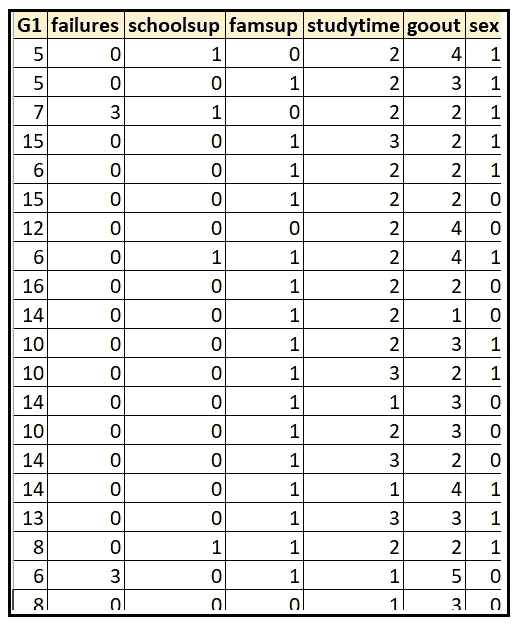

学生成绩数据集(数据集来源于 [CC BY 4.0](https://creativecommons.org/licenses/by/4.0/legalcode) 和 [UCI ML 引用政策](https://archive.ics.uci.edu/ml/citation_policy.html)下的 [UCI ML 知识库](https://archive-beta.ics.uci.edu/ml/datasets/student+performance)

每一行包含一个独特的学生的测试表现。因变量( *G1* )是他们的第一堂数学课成绩，从 0 到 20 不等。我们将根据多个因素和一个**交互项**回归等级，如下所示:

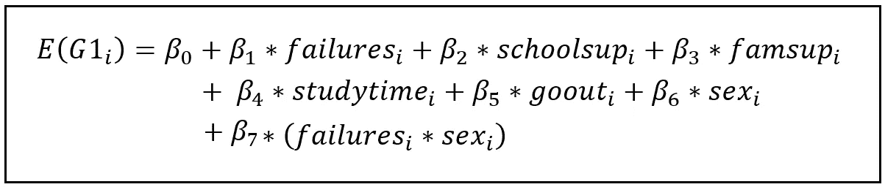

学生数学成绩模型(图片由作者提供)

这里，*失败*是学生在过去的课上失败的次数。该值从 0 到 4。它在 4 点被右删。

*schoolsup* 和 *famsup* 是布尔变量，分别表示学生是否从学校或家庭获得了额外的教育支持。值为 1 表示他们得到了一些支持，值为 0 表示他们没有得到任何支持。

*studytime* 包含学生每周花在学习上的时间。其值以 1 为增量在 1 到 4 之间变化，其中 1 表示< 2 小时，2 表示 2 到 5 小时，3 表示 5 到 10 小时，4 表示大于 10 小时。

goout 代表学生和朋友在户外闲逛的程度。它是一个从 1 到 5 的整数值，其中 1 表示非常低的范围，5 表示非常高的范围。

*性别*是一个布尔变量(1 =女性，0 =男性)。

我们还在这个模型中加入了一个交互项，叫做*(失败*性)*。

如果我们区分 *G1* 瓦特*性别*，我们得到*性别*对 *G1* 的部分效应如下:

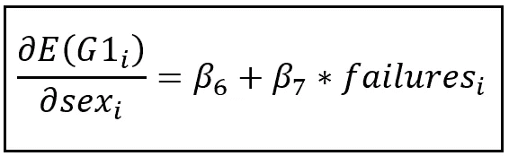

男女学生在数学方面的预期成绩差异(图片由作者提供)

这个等式给出了男女学生平均成绩的差异。由于交互项的存在，这种差异也取决于过去的失败次数。

如果我们再进行一次微分，这次是 w.r.t. *故障*，我们得到以下结果:

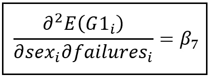

过去失败次数的单位变化对男女学生数学预期成绩的影响(图片由作者提供)

*β_7* 是过去失败次数每单位变化，男女生平均成绩差变化的比率。

因此 *β_7* 估计了*性别*和*失败次数之间的**交互效应**。*

让我们在数据集上构建和训练这个模型。我们将使用 Python 和 [Pandas](https://pandas.pydata.org/docs/getting_started/index.html) 数据分析库和 [statsmodels](https://www.statsmodels.org/stable/gettingstarted.html) 统计模型库。

让我们从导入所有需要的包开始。

```
**import** pandas **as** pd
**from** patsy **import** dmatrices
**import** statsmodels.api **as** sm
```

接下来，我们将使用 Pandas 将数据集加载到 Pandas 数据框架中:

```
df = pd.**read_csv**(**'uciml_portuguese_students_math_performance_subset.csv'**, **header**=0)
```

我们现在将在 [Patsy](https://patsy.readthedocs.io/en/latest/quickstart.html) 语法中形成回归表达式。我们不需要明确指定截距。Patsy 将在接下来的步骤中自动将其添加到 ***X*** 矩阵中。

```
reg_exp = **'G1 ~ failures + schoolsup + famsup + studytime + goout + sex + I(failures*sex)'**
```

让我们雕刻出 ***X*** 和 ***y*** 矩阵:

```
y_train, X_train = **dmatrices**(reg_exp, df, **return_type**=**'**dataframe**'**)
```

这是设计矩阵的外观:

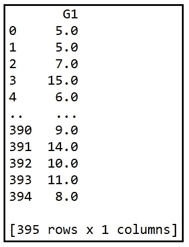

y_train(图片由作者提供)

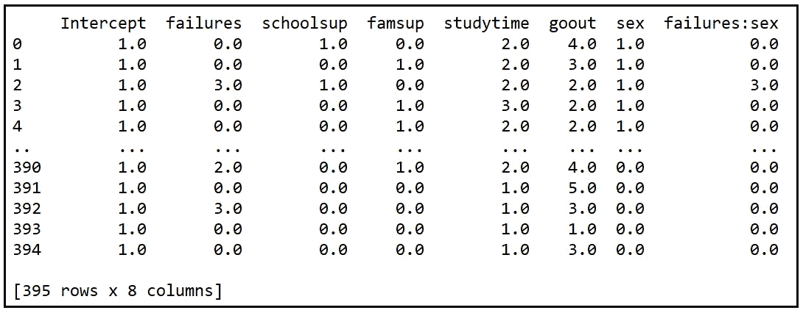

X_train(图片由作者提供)

注意，Patsy 在 ***X*** 中为截距 *β_0* 添加了一个占位符列，它还添加了包含交互术语 *failures*sex* 的列。

我们现在将在数据集*(****y****_ train，****X****_ train)*上构建和训练模型:

```
olsr_model = sm.**OLS**(**endog**=y_train, **exog**=X_train)

olsr_model_results = olsr_model.**fit**()
```

让我们打印培训总结:

```
**print**(olsr_model_results.**summary**())
```

我们看到下面的输出(我强调了一些有趣的元素):

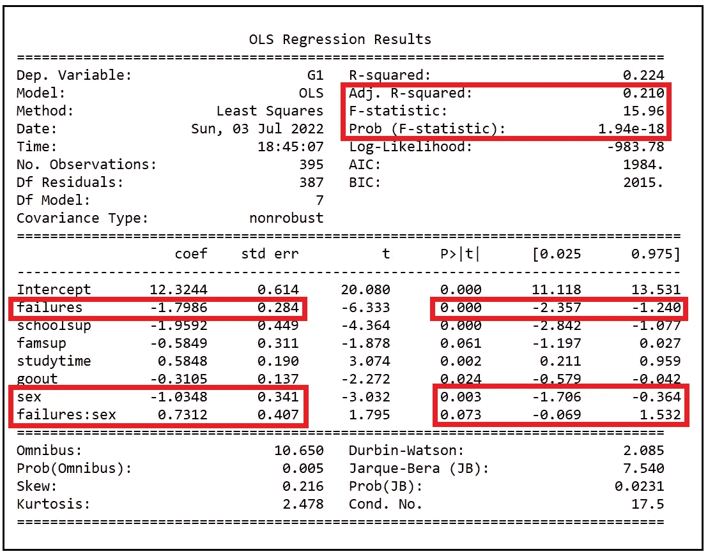

培训总结(图片由作者提供)

## 如何解释回归模型的训练效果

调整后的 R 平方为 0.210，这意味着该模型能够解释 *G1* 得分中 21%的方差。 [F 检验](/fisher-test-for-regression-analysis-1e1687867259)的 F 统计量为 15.96，在 p 值为<0.001 时显著，这意味着模型的变量*和*都高度显著。与简单的均值模型相比，该模型能够更好地解释学生表现的差异。

接下来，让我们注意到，几乎所有的系数在 p 值为 0.05 或更低时都具有统计显著性。

系数 *famsup* 在 p 为. 061 时显著，交互项 *failures*sex* 在 p 为. 073 时显著。

拟合模型的方程如下:

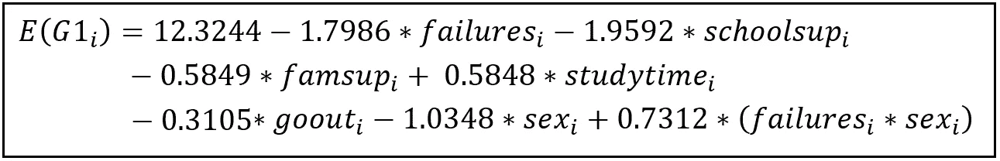

拟合模型的方程(图片由作者提供)

## 系数的解释

让我们看看如何解释拟合模型的各种系数。

故障对 *G1* 的部分影响由下式给出:

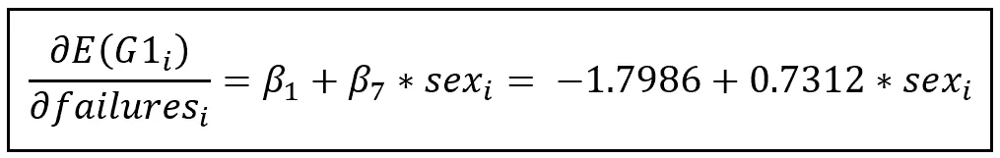

失败对 G1 的部分影响(图片由作者提供)

*失效系数*为-1.7986。由于交互项*(失败*性)*的存在，-1.7986 是*不再是过去失败对期望 *G1* 分数的主要影响*。事实上，除了在*性别*的系数为 0 的情况下，人们不应该赋予这个系数的值任何意义，在这种情况下，它不是。因此，我们能做的最好的事情是计算数据集中每一行的*故障*对 *E(G1)* 的部分影响，并将所有这些值的平均值视为*故障*对 *E(G1)* 的主要影响。如前所述，这种策略的价值值得怀疑，考虑到交互项的存在，更安全的方法是放弃计算*故障*的主要影响。

请注意，在解释训练输出中的*性别*系数时，完全相同的一组考虑因素成立。

在解释 *schoolsup* 、 *famsup* 、 *studytime* 和 *goout* 的系数时，考虑因素发生了巨大变化。交互项*(故障*性别)*中不涉及这些变量，导致其系数的直接解释如下。

对所有学生来说，他们花在“外出”上的时间每增加一个单位，他们的 *G1* 分数的估计平均降幅为. 3105。这是 *goout* 对 *E(G1)* 的局部效果。也是 *goout* 对 *E(G1)* 的主要效果。

同样，布尔变量 *schoolsup* 和 *famsup* 的系数是该变量对 *E(G1)* 各自的部分影响，也是该变量对 *E(G1)* 各自的主要影响。令人惊讶的是，两个系数都是负的，这表明从学校或家庭获得额外支持的学生平均比那些没有获得支持的学生表现更差。解释这一结果的一种方法是假设大多数接受额外支持的学生是因为他们的数学成绩不好而接受的。

另一方面，*学习时间*与 *G1* 分数具有可预测的正关系。*学习时间*每增加一个单位，导致 *G1* 分数增加 0.5848 分。

最后，让我们检查失败与*性别*的交互作用*。互动项的系数(*失败*性别*)为正，表明学生经历的过去失败次数每增加一个单位，男生在 *G1* 分数中似乎对女生的领先优势就迅速消失，减少了 0.7312 分，这是*(失败*性别)*的系数。这一结论通过对 *E(G1)* w.r.t. *性别*求导得到证实，这给出了*性别*对平均 *G1* 分数的部分影响:*

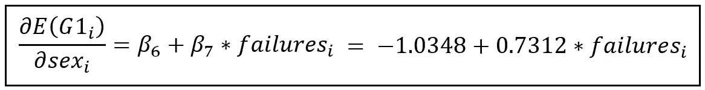

性别对平均 G1 分数的部分影响(图片由作者提供)

从上面的等式(以及下面显示的这个等式的曲线图)中，我们可以看到*性别*对 *E(G1)* 的部分影响随着过去失败次数的增加而很快反转其符号:

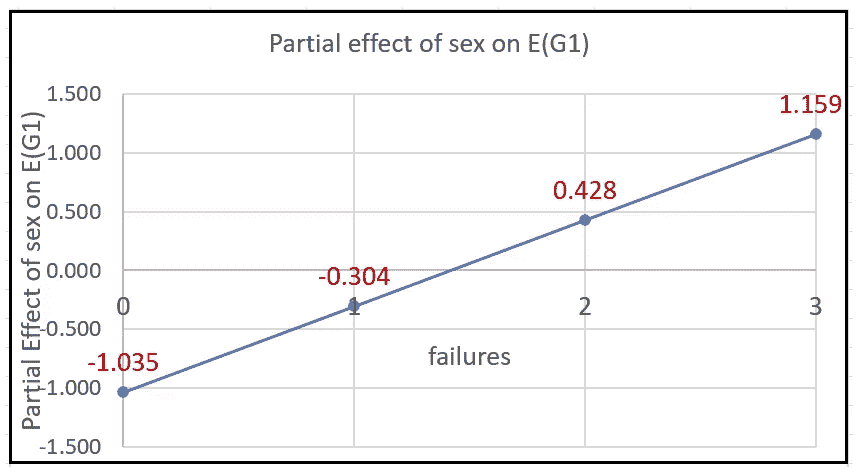

随着过去失败次数的增加，性别对 G1 的部分影响发生了变化

下面的表格和图表显示了对相同情况的另一种看法(经验观点)。它显示了从数据集中计算出的男女学生过去失败的平均分数:

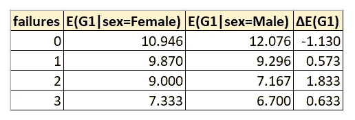

男女学生对过去失败的不同价值观的平均分(图片由作者提供)

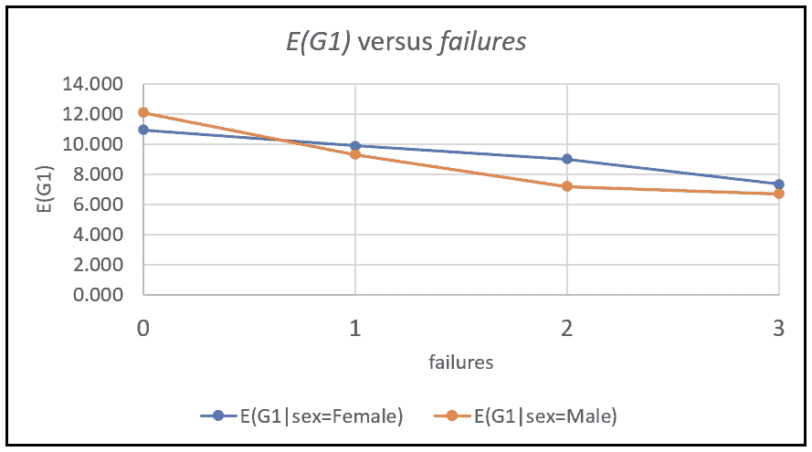

男女学生对过去失败的不同价值观的平均分(图片由作者提供)

正如预期的那样，我们看到经验结果与模型结果一致，模型结果使用了性别对 G1 的部分影响的方程。随着过去失败次数的增加，男女学生的 G1 分数差异迅速逆转。过去失败的次数越多，对男生成绩的负面影响似乎就越大。这种现象背后的原因很可能源于模型中的其他因素，或者它们可能是从根本上不可观察的影响，会泄漏到模型的误差项中。

通过在回归模型中包含**相互作用项**，这种观察是可能的。如果在回归模型中只包括性别和失败的主要影响，我们将很难发现这种模式。

# 关键要点

*   在回归模型中，回归变量的**部分效应**或**边际效应**是回归变量中每单位变化的响应变量的值的变化。
*   在仅包含线性项的线性模型中，即不包含二次项、对数项和其他种类的非线性项，每个回归变量的**主效应**与其部分效应相同。
*   对于所有其他模型，变量的**主效应**可以通过在整个数据集上平均变量的部分效应来计算。这充其量是一个近似值，基本上适用于手头的数据集。因此，一些从业者宁愿完全忽略这类模型中的主要影响。
*   **交互项**帮助建模者估计一个回归变量对模型中其他变量*的影响，它们共同解释了响应变量*中的方差。
*   在某些简单的线性模型中，相互作用项的系数可以用来估计**相互作用效应**的大小。然而，在大多数模型中，人们不应该赋予相互作用项的系数任何意义。

# 参考文献、引文和版权

## 数据集

来自 [UCI 机器学习库](https://archive-beta.ics.uci.edu/ml/datasets/student+performance)的学生成绩数据集由 4.0 在 [CC 下使用，并符合其](https://creativecommons.org/licenses/by/4.0/legalcode)[引用政策](https://archive.ics.uci.edu/ml/citation_policy.html)(见下文):

Dua d .和 Graff c .(2019 年)。UCI 机器学习知识库[http://archive . ics . UCI . edu/ml]。加州欧文:加州大学信息与计算机科学学院。

本文中使用的数据集的精选版本 [**可以从这里**](https://gist.github.com/sachinsdate/76eaeda29fab2668cd0bb637c1a14e25) 下载。

## 纸

页（page 的缩写）科尔特斯和 a .席尔瓦。使用数据挖掘预测中学生成绩。*在 a .布里托和 j .特谢拉编辑的。，第五届未来商业技术会议论文集(FUBUTEC 2008)第 5–12 页，葡萄牙波尔图，2008 年 4 月，EUROSIS* ，ISBN 978–9077381–39–7。
[【网页链接】](http://www3.dsi.uminho.pt/pcortez/student.pdf)

## 形象

本文中的所有图片版权归 [Sachin Date](https://www.linkedin.com/in/sachindate/) 所有，版权归 [CC-BY-NC-SA](https://creativecommons.org/licenses/by-nc-sa/4.0/) 所有，除非图片下方提到了不同的来源和版权。

*如果您喜欢这篇文章，请关注我的*[***Sachin Date***](https://timeseriesreasoning.medium.com)*以获得关于回归、时间序列分析和预测主题的提示、操作方法和编程建议。*