# 使用 Python 理解概率分布

> 原文：<https://towardsdatascience.com/understanding-probability-distributions-using-python-9eca9c1d9d38>

## 概率分布直观而全面的指南


图片来源:[https://pix abay . com/vectors/Bayes-statistics-bell-curve-2889576/](https://pixabay.com/vectors/bayesian-statistics-bell-curve-2889576/)

概率分布描述了随机变量取值的概率。这是统计学和概率论中的一个重要概念，关于这个主题的每本书都讨论了概率分布及其性质。然而，他们强调这些分布的数学性质，而不是它们背后的直觉，数学描述往往是抽象的。在本文中，介绍了一些最有用的概率分布，但重点是提供对每个分布及其数学性质的直观理解。您还将学习如何使用 SciPy 库在 Python 中生成不同的概率分布。

## **离散随机变量**

*随机变量*是其数值取决于随机现象结果的变量。因此，它的值最初是未知的，但一旦随机现象的结果被意识到，它就变得已知。我们通常用大写字母来表示一个随机变量，用小写字母来表示一个随机变量的特定值。

例如，抛硬币的两种结果是正面或反面。我们可以给每个结果赋值，用 0 表示正面，用 1 表示反面。现在我们可以用可能的值 *X* =0 或 *X* =1 来定义随机变量 *X* 。 *X* 可以采用的特定值由 *x* 表示。这是一个离散随机变量的例子。离散随机变量只能取某些值。另一方面，连续随机变量可以取区间内的任何值。例如，测量一个人体重的结果可以用一个连续的随机变量来描述。我们将在后面讨论连续随机变量及其概率分布。

离散随机变量 *X* 的概率质量函数(PMF)是给出 *X* 等于某个值的概率的函数。因此， *X* 的 PMF 被定义为函数 *p* ₓ，使得

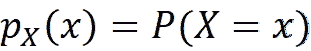

这里的*P*(*X*=*X*)就是 *X* = *x* 的概率。PMF 是归一化的，这意味着 *X* 的所有可能值的概率之和是 1:

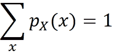

随机变量 *X* 的累积分布函数(CDF)由下式给出:

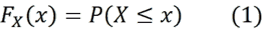

对于离散随机变量，这等于所有结果的概率之和，其中 *X* 的值小于或等于 *x* 。数学上:

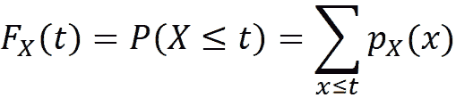

离散随机变量 *X* 的*均值*或*期望*，用 *E* ( *X* 表示，是一个定义如下的数:

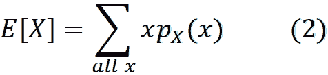

其中总和超过随机变量 *X* 可以取的所有值 *x* ，并且 *p* ₓ( *x* 就是 *X* 的 PMF。*方差*是数据围绕其均值分布的度量。由 *Var* ( *X* )表示的 *X* 的方差定义如下:

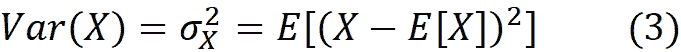

很容易看出:

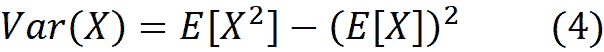

*X* 的*标准差*，用 *σ* 表示，如果存在方差，则为 *Var* ( *X* )的非负平方根:

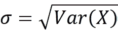

## **离散概率分布**

概率分布是一个数学函数，它描述了一个随机变量可以取的值加上这些值的概率。我们首先从离散随机变量的概率分布开始。

**伯努利分布**

最简单的随机实验只有两种结果，我们可以用 0 和 1 来表示。随机变量 *X* 具有参数为 *p* (0≤ *p* ≤1)的伯努利分布，如果 *X* 只能取值 0 和 1，并且每个值的概率为

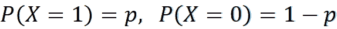

所以，我们可以把 *X* 的 PMF 写成

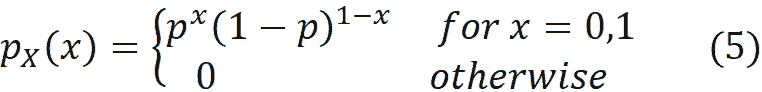

这里对于 *x* =1，我们得到


并且对于 *x* =0

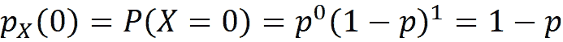

具有伯努利分布的随机变量 *X* 可以表示掷硬币，其中 *X* =1 和 *X* =0 分别表示获得正面和反面，并且 *p* 将是硬币正面落地的概率。为了公平起见，我们有 p = 0.5。符号~表示“有概率分布”。因此，如果 *X* 具有参数为 *p* 的伯努利分布，我们可以写为:

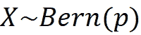

我们可以使用 Python 中的`scipy`库来处理不同的概率分布。我们可以使用`scipy.stat`中的`Bernoulli`对象创建一个伯努利分布，并使用该对象的`pmf()`方法计算其 PMF。这里我们计算出 *X* =1 和 *p* =0.5 的 PMF。

```
from scipy.stats import bernoulli
x = 1
p = 0.5
bernoulli.pmf(k=x, p=p)

## Output
0.5
```

我们可以很容易地用伯努利分布计算随机变量 *X* 的均值和方差。使用等式 2，我们得到:

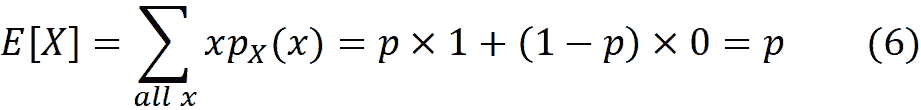

为了计算方差，我们首先注意到 *X* 和 *X* 的 PMF 是相同的，所以:

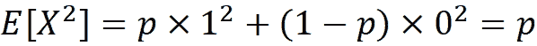

使用等式 4，我们得到:

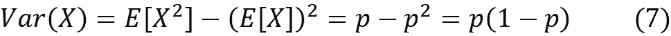

我们也可以在`scipy`中计算这个分布的均值和方差(或标准差):

```
bernoulli.mean(p=p)

#Output
0.5
```

```
bernoulli.var(p=p)

#Output
0.25
```

```
bernoulli.std(p=p)

#Output
0.5
```

具有伯努利分布的随机变量的 CDF 可以使用`cdf()`方法计算。例如，为了计算 CDF(1 ),我们可以写出:

```
bernoulli.cdf(k=1, p=p)

#Output
1.0
```

方法`rvs()`可以用来产生随机变量。随机变量或简单变量是随机变量的特定结果。使用这种方法，我们可以从伯努利分布中抽取大小为 *n* 的随机样本，这意味着我们从一个具有伯努利分布的随机变量中生成 *n* 个随机变量。这些 *n* 变量是独立的，因此一个变量的值不会影响其他变量(我们稍后将给出随机样本的正式定义)。例如，为了从伯努利分布中抽取一个大小为 5 的随机样本，我们使用`rvs()`创建一个包含 5 个元素的变量数组:

```
bernoulli.rvs(p=p, size=5, random_state=1)

#Ouput:
array([0, 1, 0, 0, 0])
```

这就像投掷硬币 5 次，然后将结果记录在一个数组中。

**PMF 和分布的区别**

离散随机变量 *X* 的 PMF 是给出 *X* 等于某个值的概率的函数。例如，对于伯努利分布，我们知道 *X* =1 的概率是:

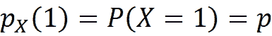

另一方面，分布描述了一个随机变量可以取的所有值以及这些值的概率。这是我们从 PMF 的定义中可以得出的结论。例如，根据等式 5 中定义的 PMF，我们得出结论，在伯努利分布中， *X* 可以分别以概率 *p* 和 1- *p* 取值为 0 和 1。因此，PMF 的定义也可以定义概率分布，而当我们引入一个新的离散分布时，我们只需要定义它的 PMF。PMF 的条形图对于理解分布也非常有用，因为它直观地显示了随机变量的所有值及其相应的概率。清单 1 绘制了伯努利分布的 PMF，结果如图 1 所示。

```
# Listing 1

import numpy as np
import matplotlib.pyplot as plt

plt.figure(figsize=(4, 4))
plt.bar(x, bernoulli_pmf, width = 0.5)
plt.xlim(-0.5, 1.5)
plt.ylim(0, 1)
plt.title('Bernoulli: p=%.2f' % (p), fontsize=15)
plt.xlabel('x', fontsize=15)
plt.ylabel('Probability', fontsize=15)
plt.xticks(np.arange(0, 2, 1))
plt.show()
```

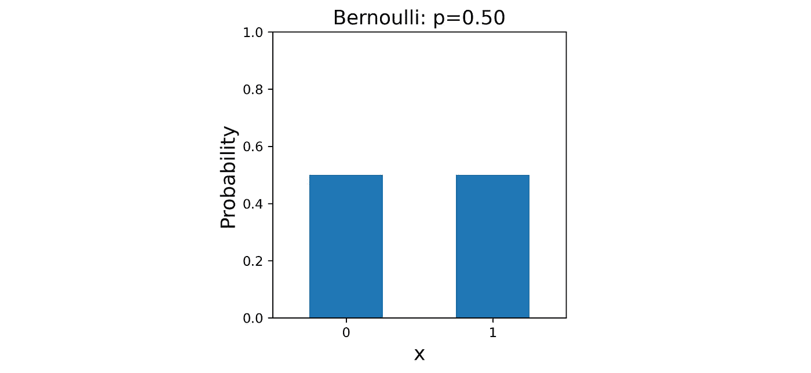

图 1

根据频率主义者对概率的定义，一个事件的概率是该事件在大量重复实验中的相对频率。在数学上，一个事件的概率是比率的极限

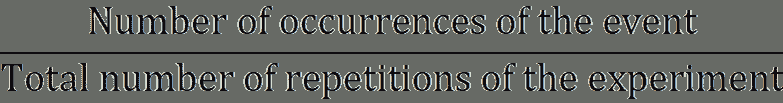

当实验的重复次数接近无穷大时。我们看到，如果 *X* 具有伯努利分布，那么


这意味着

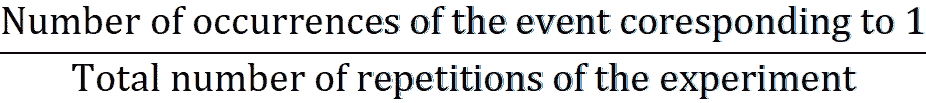

随着试验的总次数趋于无穷大，接近 *p* 。

记住，掷硬币的结果可以用一个随机变量 *X* 来表示，这个随机变量具有伯努利分布。假设我们用 *X* =1 来表示头部，那么


现在，如果我们一次又一次地投掷一枚公平的硬币

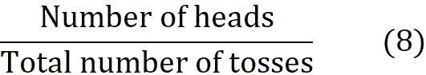

随着试验的总次数接近无穷大，p 接近*。类似地，如果我们从参数为 *p* 的伯努利分布中创建一个大小为 *n* 的随机样本，并且让该样本中 1 的数量为 *k* ，那么随着 *n* 趋于无穷大， *k* / *n* 的比值接近 *p* 。*

*清单 2 运行了一个模拟来演示这些概念。这里我们有一个公平的硬币( *p* =0.5)。我们使用方法`rvs()`从伯努利分布中获得不同大小的随机样本。每个样本的平均值给出等式 8 中的比率(由于每个样本由 0 和 1 组成，因此其总和等于 1 的数量，平均值等于 1 的数量除以样本大小)。结果如图 2 所示。随着样本量(投掷次数)的增加，该比率越来越接近 0.5。*

```
*# Listing 2

np.random.seed(0)
p = 0.5
sample = bernoulli.rvs(p=p, size = 10000)
num_trials = [10, 100, 500, 1000, 2500, 5000, 7500, 10000]
points = [sample[0:l].mean() for l in num_trials]
plt.plot(num_trials, points, marker=’o’)
plt.xlabel(‘Number of trials’, fontsize = 14)
plt.ylabel(r’$\frac{Number\; of \; heads}{Number\; of \; trials}$’,
           fontsize= 19)
plt.title(“Bernoulli distribution, p = {}”.format(p), fontsize= 15)
plt.show()*
```

*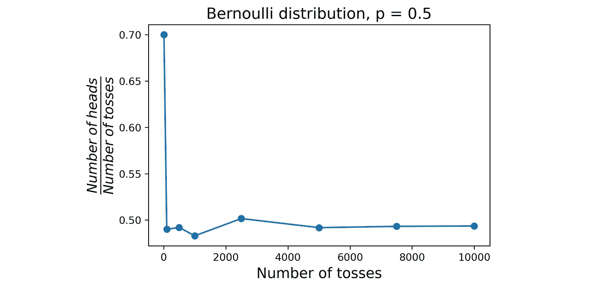*

*图 2*

***二项分布***

*假设我们有 *n 个*独立随机变量 *X* ₁， *X* ₂，...、 *Xₙ* ，它们中的每一个都有一个参数为 *p* 的伯努利分布。如果*x*=*x*₁+*x*₂+... *Xₙ* ，那么 *X* (也是离散随机变量)具有参数 *n* 和 *p* 的二项分布。我们也可以写成 *X* ~ Bin( *n* ， *p* )。 *X* 的 PMF 可以写成:*

*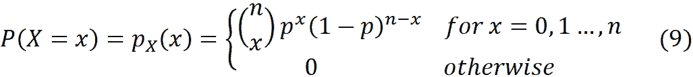*

*让我们看看这个 PDF 是怎么推导出来的。这里，随机变量 *X* ₁、 *X* ₂、…、 *Xₙ* 的可能值可以被认为是 0 和 1 的有序序列。如果一个序列的和是 *x* ，那么它应该有 *x* 个 1 和 *n* - *x* 个 0。得到一个有 *x* 个 1 和 *n* - *x* 个 0 的序列的概率是*pˣ*(1*p*)*ⁿ*⁻*ˣ*。既然有*

*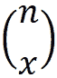*

*这种不同的有序序列*

*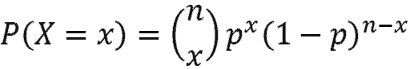*

*正如我们前面看到的，投掷硬币的结果可以用一个离散的随机变量来描述，这个随机变量具有参数 *p* 的伯努利分布。现在假设我们将这枚硬币抛 *n* 次，我们想知道得到准确的 *x* 正面的概率是多少。每次试验可以用随机变量*xᵢ*(*I*= 1…*n*)来表示，该随机变量具有参数 *p* 的伯努利分布。为了准确地得到 *x* 个头，随机变量 *Xᵢ* 的 *x* 应该等于 1，剩余的应该为零，这意味着 X=x。如果我们将随机变量 *X* 定义为*x*=*x*₁+*x*₂+……+*xₙ*那么得到 *x* 个头的概率基于前面的定义， *X* 具有二项分布，我们可以写成:*

**

*因此，对于以概率 *p* 投出正面的硬币，我们在 *n 次*投掷中得到的正面总数可以由随机变量 *X* 表示，该随机变量具有参数 *n* 和 *p* 的二项式分布。我们可以使用`scipy`中的对象`binom`来生成二项分布。该对象的方法采用参数`k`、`n`和`p`，这些参数对应于等式 9 中的 *x* 、 *n* 和 *p* 。这里我们使用这个对象来绘制参数 *p* =0.5 和 *n* =8 的二项分布的 PMF。结果如图 3 所示。*

```
*# Listing 3

from scipy.stats import bernoulli, binom
n = 8
p = 0.5
x = np.arange(0, n+1)
binomial = binom.pmf(k=x,n=n, p=p)
plt.bar(x, binomial)
plt.xlabel(‘x’, fontsize=14)
plt.ylabel(‘Probability’, fontsize=14)
plt.xlim([-1, 9])
plt.title(“Binomial distribution, n={0}, p={1}”.format(n, p),
          fontsize= 15)
plt.show()*
```

*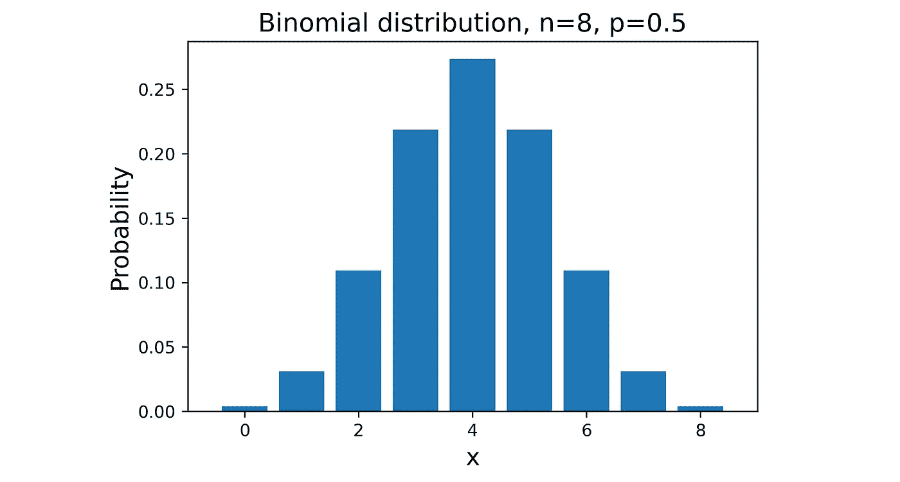*

*图 3*

*对于 *p* =0.5，二项式分布的形状是对称的，因为对于 *x* 的每个值，我们有*

*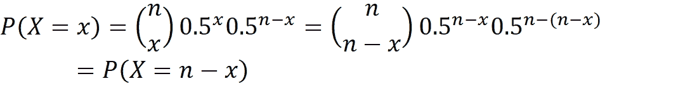*

*但是对于 *p* 的其他值，就不是对称的了。图 4 左图显示了作为示例的 *n* =8 和 *p* =0.7 的这种分布的 PMF。*

*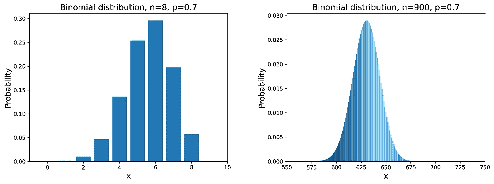*

*图 4*

*然而，随着 *n* 趋于无穷大，二项式分布的形状变得更加对称(其原因是中心极限定理，这将在后面解释)。左边的图 4 显示了相同的分布，其中 *n* 的值更大，看起来更加对称。*

*如果 *X* ₁、 *X* ₂、…、 *Xₙ* 为 *n* 随机变量并且 *a* ₁、 *a* ₂、…、 *aₙ* 和 *c* 为常数，那么可以证明如果*x*=*a*₁*x**

*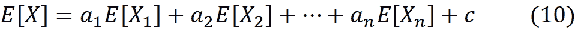**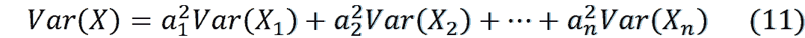*

*如前所述，具有参数为 *n* 和 *p* 的二项分布的随机变量 *X* 可以写成具有参数为 *p* 的伯努利分布的 *n* 个独立随机变量之和。因此，使用上述等式以及等式 6 和等式 7，我们可以轻松计算出 *X* 的均值和方差:*

*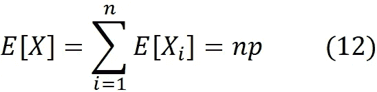**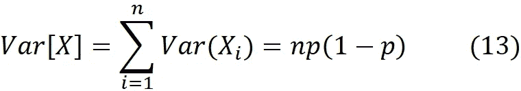*

*在清单 4 中，我们从二项式分布中获得 3 个随机样本，n*= 8，p*= 0.5，并绘制它们的条形图。这里我们使用`rvs()`方法从伯努利分布中获得一个大小为 *n* 的随机样本，然后计算其总和。我们重复这个抽样程序`s`次，从二项分布中得到一个大小为`s`的样本:***

**`sample = [bernoulli.rvs(p=p, size=n).sum() for i in range(s)]`**

**这相当于使用二项式分布的`rvs()`方法:**

**`sample = binom.rvs(n=n, p=p, size=s)`**

**然后我们绘制这个样本的条形图(请注意，在这个条形图中，我们显示的是每个元素的百分比，而不是它的计数)。随着样本大小`s`趋于无穷大，条形图的形状接近分布的 PMF。结果如图 5 所示。**

```
**# Listing 4

np.random.seed(0)
n = 8
p = 0.5
x = np.arange(9)
binomial = binom.pmf(k = x,n = n, p = p)
fig, axs = plt.subplots(1, 3, figsize=(19, 5))

for id, s in enumerate([10, 100, 10000]):
    sample = [bernoulli.rvs(p=p, size=n).sum() for i in range(s)]
    # sample = binom.rvs(n=n, p=p, size=s)
    values, counts = np.unique(sample, return_counts=True)
    probs = counts / counts.sum()
    axs[id].bar(values, probs)
    axs[id].plot(x, binomial, marker='o', color='red')
    axs[id].set_title("Sample size={0} \n n={1}, p={2}".format(s, n, p),
                     fontsize=14)
    axs[id].set_xlabel('x', fontsize = 14)
    axs[id].set_ylabel('Probability', fontsize=14)
    axs[id].set_xlim([-1, 9])

plt.show()**
```

**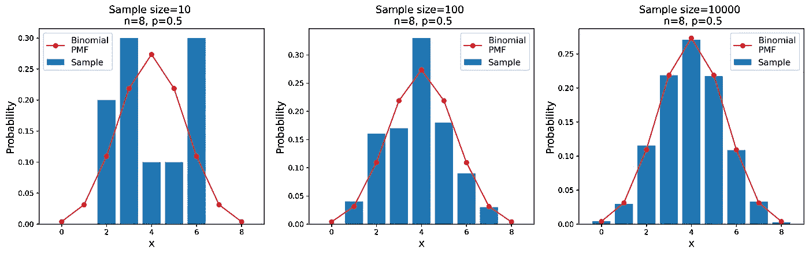**

**图 5**

**当样本大小为 10 时，条形图的形状是不规则的，但是随着样本大小的增加，最终得到的条形图的形状接近二项式分布的 PMF。**

**如前所述，具有 *n* 和 *p* 的二项分布的平均值在 *np* 处。此外，该分布的峰值可以通过以下方式确定。请记住，在伯努利分布中**

**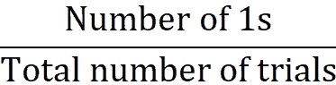**

**随着试验总数的增加而接近 p 。因此，如果 *np* 是一个整数，我们期望具有伯努利分布的 *n* 个随机变量的和接近于 *np* 。因此，如果 *np* 是整数，则分布的最可能值(分布的峰值)是 *np* 。这也被称为分配的*模式*。例如图 3 中， *np* =8×0.5=4，因此模式为 4。**

**如果 *np* 不是一个整数，那么可以表明分布在( *n* +1) *p* 和*(*n*+1)*p*-1 处有两种模式。图 6 中的分布就是一个例子。这里 *n* =9、 *p* =0.7，所以 *np* =0.63，模式在(9+1)0.7=7 和(9+1)0.7–1 = 6。***

**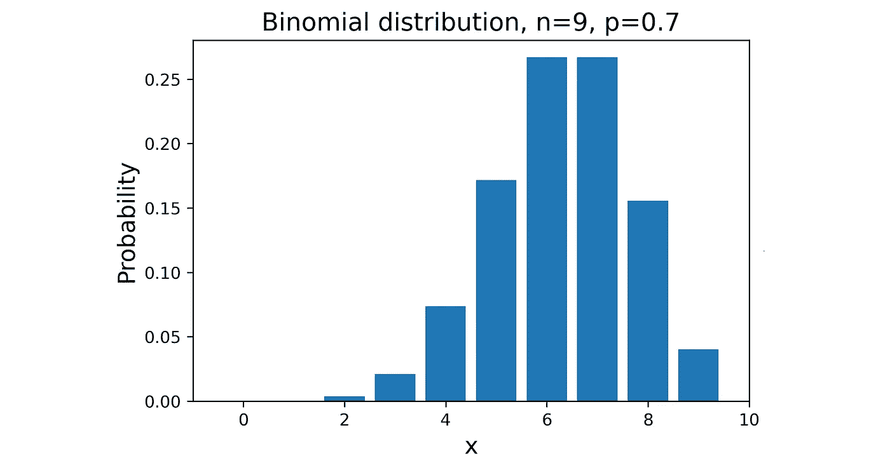**

**图 6**

**对于远离 *np* 的 *X* 的值，概率降低。例如， *P* ( *X* =0)非常低，因为它表示所有 *n* 伯努利随机变量取值为 0 的情况。**

****负二项分布****

**假设我们有一个参数为 *p* 的伯努利试验序列(所以每次试验成功的概率是 *p* )，这些试验是独立的。让离散随机变量 *X* 表示在第*次成功之前发生的失败次数。那么 *X* 有如下 PMF:***

*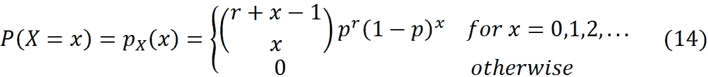*

*所以 *p* ₓ( *x* 给出了在第*次成功之前发生 *x* 次失败的概率。我们说 *X* 有一个带参数 *r* 和 *p* 的*负二项*分布，用 *X* ~ NBin( *r* ， *p* )表示。**

*我们可以很容易地使用二项分布来驱动这个 PMF。假设我们有一系列 *n* 个独立的伯努利试验，其中每个试验的成功概率是 *p* 。让 *Aₙ* 表示我们有 *r* 成功和*x*=*n*-*r*失败的事件，并且在第 *n* 次试验中获得第 *r* 次成功。因此，在最初的 *n* -1 次试验中，我们有 *r* -1 次成功和 *x* 次失败。让 A *ₙ* ₋₁表示在第一次 *n* -1 次试验中获得 *r* -1 次成功的事件。我们可以用二项分布来得到 *Aₙ* ₋₁:的概率*

*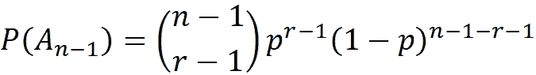*

*第 *n* 次试验成功的概率是 *p* ，所以我们要把它乘以 *An* -1 的概率，得到 *Aₙ* 的概率:*

*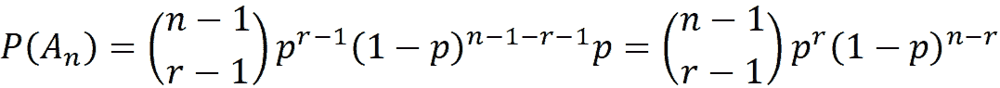*

*我们知道*x*=*n*-*r*，所以*

*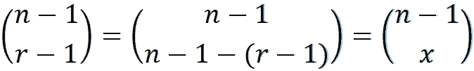*

*我们可以写:*

**

*但这正是在第 *r* 次成功之前发生 *x* 次失败的概率，因此等式 14 由此得出。*

*我们可以使用`scipy`中的对象`nbinom`创建一个负二项分布。该对象的方法采用参数`k`、`n`和`p`，它们对应于等式 14 中的 *x* 、 *r* 和 *p* 。清单 5 绘制了负二项分布的 PMF，其中 p*= 0.5，r =10。**

```
**# Listing 5

from scipy.stats import nbinom
r = 5
p = 0.5
x = np.arange(0, 20)
nbinomial = nbinom.pmf(k=x,n=r, p=p)
plt.bar(x, nbinomial)
plt.xlabel(‘x’, fontsize=14)
plt.ylabel(‘Probability’, fontsize=14)
plt.title(“Negative binomial distribution, r={0}, p={1}”.format(r, p),
          fontsize= 15)
plt.xticks(np.arange(0, 20, 2))
plt.show()**
```

**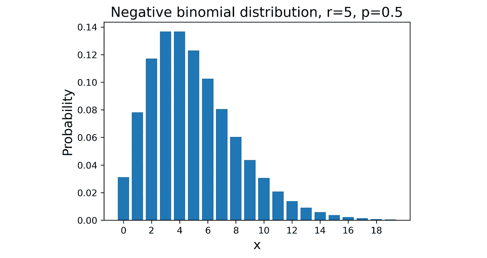**

**图 7**

**让我们谈谈图 7 背后的直觉。这里 *r* =5，最后一次试验成功，那么前 *n* -1 次试验我们有 4 次成功， *x* 是前 *n* -1 次试验的失败次数。在一个 *p* =0.5 的伯努利试验序列中，我们期望失败的次数与成功的次数大致相同，所以分布的模式是在 *x* =3 和 4。而且随着 *x* 的增大， *x* 的概率迅速减小。另外，随着 *x* 降低到 3 以下，概率也降低。**

**在清单 6 中，我们展示了负二项分布是如何由一系列伯努利随机变量产生的。我们假设`r` =5。我们创建一个形状为(`sample_size`，`num_trials`)的二维伯努利随机变量数组。该数组中的每一行代表一系列伯努利试验。这些序列的数量由`sample_size`决定，每个序列中的试验数量由`num_trials`设定。我们计算最后一次尝试成功的序列的分数，并且成功的总数是`r`。这个分数给出了发生`num_trials-r`故障的概率。我们为不同的`sample_size`值绘制了这些概率(图 8)。随着`sample_size`的增加，条形图的形状越来越接近负二项分布的 PMF(红色曲线)。**

```
**# Listing 6

np.random.seed(0)
r = 5
p= 0.5
sample_size = [100, 1000, 100000]
x_range = range(20)
nbinomial = nbinom.pmf(k=x_range,n=r, p=p)
fig, axs = plt.subplots(1, 3, figsize=(19, 5))
for i in range(3):
    probs = []
    for x in x_range:
    num_trials = r + x
    sample = bernoulli.rvs(p=p, size=num_trials*sample_size[i]). \
             reshape(sample_size[i], num_trials)
    filtered_sample = sample[(sample[:,-1] == 1) & (sample.sum(axis = 1) == r)]
    prob = len(filtered_sample) / sample_size[i]
    probs.append(prob)
    axs[i].bar(x_range, probs)
    axs[i].set_xticks(np.arange(0, 20, 2))
    axs[i].set_title(“Sample size=”+str(sample_size[i]), fontsize=14)
    axs[i].set_xlabel(‘x’, fontsize=14)
    axs[i].plot(x_range, nbinomial, marker=’o’, color=’red’,
                label=’Negative binomial PMF’)
    axs[i].legend(loc=’best’)
axs[0].set_ylabel(‘Probability’, fontsize=14)
plt.show()**
```

**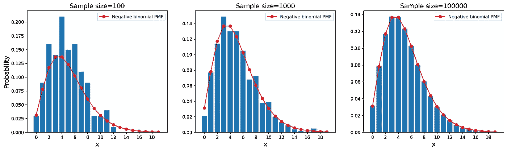**

**图 8**

**参数为 *r* 和 *p* 的负二项分布随机变量 x 的均值和方差为:**

**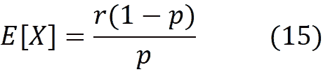****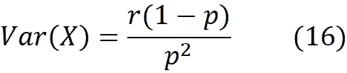**

****几何分布****

**几何分布是负二项分布的特殊情况，其中 *r* =1。在等式 14 中，如果我们设置 *r* =1，则我们有:**

**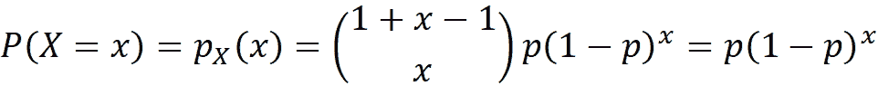**

**因此，如果 *X* 的 PMF 如下，则离散随机变量 *X* 具有参数为 *p* 的几何分布:**

**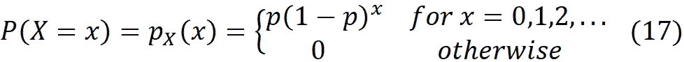**

**我们用 *X* ~ Geom( *p* )来表示这一点。这里 *f* ₓ( *x* 给出了在第一次成功之前得到 *x* 次失败的概率。请注意，我们也可以使用伯努利分布的 PMF(等式 5)来推导这个 PMF。对于参数为 *p* 的伯努利试验，得到失败的概率为(1- *p* ，那么得到 *x* 连续失败的概率为(1- *p* ) *ˣ* 。最后一次尝试也是第一次成功的概率为 *p* 。所以在第一次成功之前得到 *x* 失败的概率是*p*(1-*p*)*ˣ*。**

**我们还可以根据获得第一次成功所需的试验次数来定义几何分布。如果成功发生在第 *x* 次试验，那么意味着在此之前我们有过 *x* -1 次失败，那么这些事件发生的概率是*p*(1-*p*)*ˣ*⁻。在这种情况下，分布的 PMF 将被定义为:**

**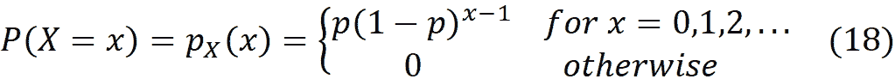**

**这里的失败次数是 *x* -1。在`scipy`中，我们可以使用对象`geom`生成一个几何分布。该对象基于等式 18 定义了一个几何分布( *X* 代表获得第一次成功的试验次数)。该对象的方法采用与等式 18 中的 *x* 和 *p* 相对应的参数`k`和`p`。所以如果 *x* 是失败次数，`geom.pmf(k=x,p=p)`给出 x-1 的 PMF。清单 7 绘制了一个几何分布的 PMF，其中 *p* =0.5， *p* =0.1。PMF 如图 9 所示。请注意，为了获得失败次数，我们绘制了`geom.pmf(k=x,p=p)`与`x-1`的关系图。**

```
**# Listing 7

from scipy.stats import geom
fig, axs = plt.subplots(1, 2, figsize=(12, 4))
p_list = [0.5, 0.1]
x = np.arange(1, 20)
for i, p in enumerate(p_list):
    geometric = geom.pmf(k=x,p=p)
    axs[i].bar(x-1, geometric)
    axs[i].set_xlabel(‘x (number of failures)’, fontsize=14)
    axs[i].set_ylabel(‘Probability’, fontsize=14)
    axs[i].set_title(“p={0}”.format(p),
    fontsize= 14)
    axs[i].set_ylim([0, 0.55])
    axs[i].set_xticks(np.arange(0, 20, 2))
plt.suptitle(“Geometric distribution”, fontsize=16, y=1.05)
plt.show()**
```

**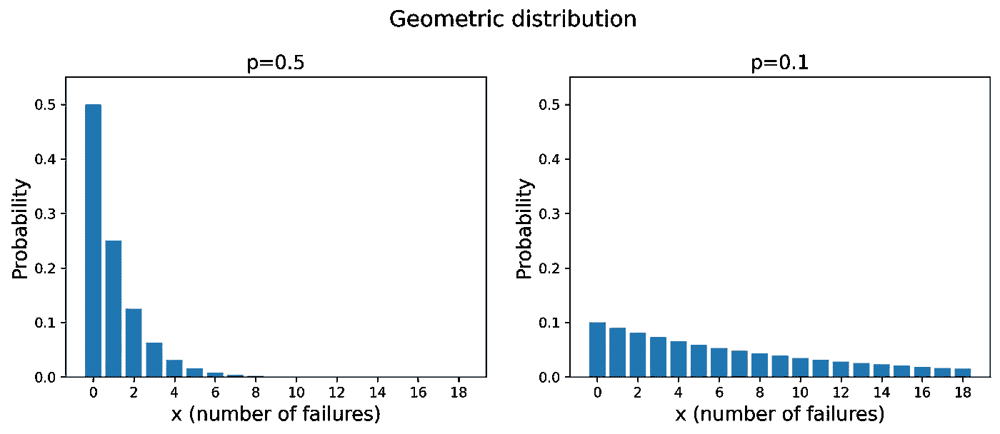**

**图 9**

**在这个图中，在第一次成功之前获得 0 次失败的概率是 *p* 。那是因为第一次伯努利试验是成功的，我们知道它发生的概率是 *p* 。随着 *x* 的增加，这种可能性下降，因为我们不太可能有很多连续的失败。对于较低的 *p* 值，失败的机会增加，因此获得较高的 *x* 值的概率增加。通过在等式 15 和等式 16 中设置 *r* =1，我们可以得到几何分布的均值和方差:**

**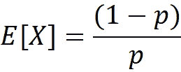******

**几何分布是无记忆的。这意味着如果第一次成功在第 *m* 次试验中还没有发生(所以 *X≥m* ，那么它在接下来的 *n* 次试验中没有发生的概率( *X≥n+m* )，与它在第一次 *n* 次试验中没有发生的概率( *X≥n* )相同。数学上:**

**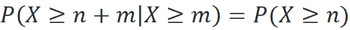**

**为了证明这一点，我们首先注意到失败次数大于或等于 *n* 的概率等于得到至少 *n* 次失败的概率:**

**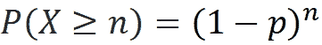**

**因此，使用贝叶斯规则的定义，我们可以写出:**

**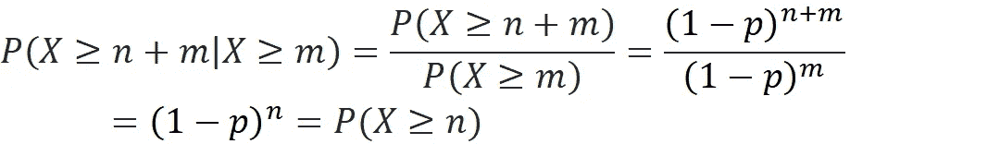**

**几何分布是唯一无记忆的离散分布。因此，如果 *X* 是具有无记忆特性的离散随机变量，那么 *X* 具有几何分布。

几何分布中的无记忆性质是具有相同参数的一系列独立伯努利试验的结果。因此，在每次试验中，成功的概率是相同的，并且不受先前试验结果的影响。举个例子，假设你正在投掷一枚公平的硬币很多次，直到你得到一个正面。在一次特定的投掷中得到正面的概率与之前你有多少个反面无关。如果你的前三次投掷都是反面，你可能会直觉地认为下一次更有可能是正面。但是，基于无记忆属性，在下一次投掷中获得正面的概率仍然是 0.5。这是因为每一次投掷都是伯努利试验，概率为 *p* =0.5，并且试验彼此独立。所以，前一次投掷的结果不会影响下一次投掷的结果。**

**假设我们有 *r* 个独立随机变量 *X* ₁、 *X* ₂、…、 *Xᵣ* 并且他们中的每一个都有一个参数为 *p* 的几何分布。如果*x*=*x*₁+*x*₂+…+*xᵣ*，那么 *X* (也是离散随机变量)具有参数 *r* 和 *p* 的负二项分布。请记住，负二项分布是基于一系列参数为 *p* 的独立伯努利试验定义的，具有该分布的随机变量 *X* 给出了在第 *r* 次成功之前发生的失败次数。**

**让 *X* ₁用参数 *p* 表示一系列独立伯努利试验中第一次成功之前的失败次数。我们知道 *X* ₁有一个参数为 *p* 的几何分布。现在让 *X* ₂表示在第一次成功之后和获得第二次成功之前的失败次数。由于所有试验都是独立的，我们得出结论 *X* ₂也具有参数 *p* 的几何分布。同样，如果 *Xᵢ* 是获得 *i* -1 次成功之后，获得 *i* 次成功之前的数字，那么 *Xᵢ* 也有一个参数为 *p* 的几何分布(图 10)。因此，*x*₁+*x*₂+…+*xᵣ*的和给出了在第 *r* 次成功之前发生的失败总数，根据定义，这个和是一个负二项分布的随机变量。**

****

**图 10(来源:图片由作者提供)**

**这也让我们对几何分布有了新的解释。具有参数为 *p* 的几何分布的随机变量 *X* 给出了参数为 *p* 和 *n* 的二项式分布中两次连续成功试验之间的失败次数(图 10)。**

**清单 8 展示了我们如何使用几何分布中的随机样本来构建负二项分布的 PMF。这里我们使用`rvs()`方法从几何分布中获得一个大小为`r`的随机样本，然后计算样本的总和。我们可以重复这个抽样程序`s`次，从负二项分布中得到一个大小为`s`的随机样本:**

**`sample = [(geom.rvs(p=p, size=r)-1).sum() for i in range(s)]`**

**这相当于使用负二项分布的`rvs()`方法:**

**`sample = nbinom.rvs(n=r, p=p, size=s)`**

**然后我们绘制这个样本的柱状图。随着样本量`s`的增加，条形图的形状越来越接近分布的 PMF。结果如图 11 所示。**

```
**# Listing 8

np.random.seed(0)
r = 8
p = 0.5
x_range = range(20)
nbinomial = nbinom.pmf(k=x_range,n=r, p=p)
fig, axs = plt.subplots(1, 3, figsize=(19, 5))

for id, s in enumerate([10, 100, 100000]):
    sample = [(geom.rvs(p=p, size=r)-1).sum() for i in range(s)]
    # sample = nbinom.rvs(n=r, p=p, size=s)
    values, counts = np.unique(sample, return_counts=True)
    probs = counts / counts.sum()
    axs[id].bar(values, probs)
    axs[id].plot(x_range, nbinomial, marker='o', color='red',
                 label='Negative binomial PMF')
    axs[id].set_title("Sample size={0} \n r={1}, p={2}".format(s, r, p),
                      fontsize=14)
    axs[id].set_xlabel('x', fontsize = 14)
    axs[id].set_ylabel('Probability', fontsize=14)
    axs[id].set_xlim([-1, 19])
    axs[id].set_xticks(np.arange(0, 20, 2))
    axs[id].legend(loc='best')
plt.show()**
```

****

**图 11**

****泊松分布****

**泊松分布是二项分布的一种极限情况，其中试验次数 *n* 非常大，成功概率 *p* 非常小。记住二项分布的均值是 *np* ，所以当 *n* →∞时，我们要有 *p* →0 才有一个有限均值。当 *n* 趋于无穷大时，让 *n* 和 *p* 的乘积保持不变:**

****

**现在，利用等式 9 和等式 19，我们可以写出:**

********

**当 *n* 趋于无穷大时，该表达式可以通过取其分量的极限来简化:**

************

**所以，我们有:**

****

**基于这个结果，我们可以定义一个新的分布。一个离散随机变量 *X* 具有参数*λ*(*λ*0)*的泊松分布，如果 X 的 PMF 如下:***

******

***我们也用 *X* ~ Pois( *λ* )来表示。当试验次数 *n* 趋于无穷大而乘积 *np=λ* (分布的平均值)保持不变时，泊松分布是二项式分布的极限情况。请注意 *p* 很小，但不为零(如果为零，则 PMF 处处为零)。***

**由于泊松分布是二项式分布的极限情况，我们可以使用等式 12 和 13 来计算泊松分布的随机变量 *X* 的均值和方差:**

********

**清单 9 使用`scipy`中的`poisson`对象绘制了 *λ* 的不同值的泊松 PMF。该对象中的方法采用与等式 21 中的 *x* 和 *λ* 相对应的参数`k`和`mu`。结果如图 12 所示。**

```
**# Listing 9

from scipy.stats import poisson
lambda_list = [1, 5, 10, 25, 50]
x = np.arange(0, 70)
plt.figure(figsize=(9, 6))
for lam in lambda_list:
    poisson_dist = poisson.pmf(x, lam)
    plt.plot(x, poisson_dist, marker = 'o',
             label = r"$\lambda=$" + str(lam))
plt.xlabel('x', fontsize=14)
plt.ylabel('Probability', fontsize=14)
#plt.xlim([-1, 9])
plt.title("Poisson distribution", fontsize= 15)
plt.legend(loc='best', fontsize= 14)
plt.show()**
```

****

**图 12**

**清单 10 绘制了 *λ* =10 的泊松分布的 PMF，以及参数为 n 和*p*=*λ*/*n*的二项分布的 PMF(图 13)。随着 *n* 的增加，二项分布的 PMF 接近泊松分布的 PMF。**

```
**# Listing 10

lam = 10
x = np.arange(0, 23)
fig, axs = plt.subplots(1, 3, figsize=(21, 5))

poisson_dist = poisson.pmf(x, lam)
for i, n in enumerate([20, 100, 1000]):
    axs[i].plot(x, poisson_dist, marker = 'o',
                color = 'red', label = "Poisson")
    binomial = binom.pmf(k=x,n=n, p=lam/n)
    axs[i].bar(x, binomial, label="Binomial")
    axs[i].set_xlabel('x', fontsize=14)
    axs[i].set_ylabel('Probability', fontsize=14)
    axs[i].set_title("n="+str(n), fontsize=18)
    axs[i].legend(loc='best', fontsize=14)

plt.show()**
```

****

**图 13**

**泊松分布可以应用于我们有大量可能事件，但每个事件的概率非常小的系统。这类事件的总数可以用一个泊松分布的随机变量来描述，参数 *λ* 给出了事件的平均数。**

**在一些问题中，我们得到的是事件发生的平均速率，而不是事件的平均数量。因此，我们可以写出 *λ=rt* ，其中 *r* 是平均速率，而 *t* 是平均速率的时间间隔。请注意 *t* 有时间单位，速率 *r* 有 1/时间单位。因此泊松分布中的参数 *λ* 是无量纲的(它没有单位)。这里 *λ* 给出了时间间隔 *t* 内事件的平均数量。**

**需要注意的是，要将泊松分布应用于系统，我们应该具备以下条件:**

1.  **这些事件是独立发生的。**
2.  **两件事不可能完全同时发生。更准确地说，在一个小区间内出现两次或两次以上的概率，与在该区间内出现一次的概率相比，必须是可以忽略的。**
3.  **发生率 *r* 是常数，不随时间变化。因此，在长度为 *h* = *t/n* (其中 *n* 是一个大的数字)的足够短的时间间隔内恰好发生一个事件的概率大约为*p*=*λ/n*=*rt*/*n = RH*(该时间间隔( *h* )应该足够短，以确保在该时间间隔内不会发生多个事件**

**满足这些条件的系统称为泊松过程。我们可以利用这些条件导出泊松分布。我们将时间间隔 *t* 分成 *n* 个等长的子间隔 *t* / *n* 。 *n* 应足够大以满足条件 2 和 3。在 *t* / *n* 的短暂时间间隔内，我们可以假设 0 或 1 个事件都会发生，基于 3，在 *t/n* 的时间间隔内恰好发生一个事件的概率为 *rt/n* 。因此，我们可以使用参数为 *n* 和 *p* = *rt/n* 的二项分布，等式 9 可以写成:**

****

**当 *n* 趋于无穷大时，通过取其分量的极限，我们得到:**

****

**这个等式类似于等式 21，其中 *λ* 被替换为 *rt* 。但是，当我们用 *rt* 代替 *λ* 时， *p* ₓ( *x* 给出了时间间隔 *t* 内的事件总数。**

**让我们看一个例子。我们希望能够用泊松分布来描述到达商店的顾客数量。到达率 *r* 是 20 个客户/小时，我们想知道在接下来的 15 分钟内少于 5 个客户到达的概率是多少。这里 *t* =15 分钟。由于 *r* 和 *t* 的单位应该一致，我们应该将 *r* 的单位从 1/小时改为 1/分钟。我们有 *r* =20 个客户/小时= 20/60 个客户/分钟，所以*λ*=*rt*=(20/60)×15 = 5。这是 15 分钟内的平均顾客数量。使用等式 22，我们可以写出:**

****

**在接下来的 15 分钟内少于 5 个顾客到达的概率是:**

****

**我们可以用泊松的`cdf()`方法来计算 *F* (5):**

```
**lam = 5
poisson.cdf(5, lam)

#Output
0.616**
```

**记住到达率是 20 个顾客/小时。因此，对于 1 小时的间隔，我们有 *t* =1 小时和 *λ* =20×1=20。因此，如果随机变量 *X* 表示在接下来的一个小时内将到达商店的顾客数量，那么 *X* 具有参数 *λ* =20 的泊松分布。**

**我们也可以用二项式分布来模拟这个过程。要用二项式分布，我们也可以把一个小时的时间段分成 3600 秒，得到 20/3600≈0.00556 每秒的到达率。在如此短的时间间隔内，我们可以假设在每一秒钟内将有 0 或 1 个顾客到达，到达的概率是 0.00556。如果 *X* 表示在接下来的一个小时内将到达商店的顾客数量， *X* 具有参数 *n* =3600 和 *p* =0.00556 的二项分布。**

**清单 11 绘制了这个二项式分布加上泊松分布，其中 *λ* =20。结果如图 14 所示，可以看出泊松分布是二项式分布的非常好的近似。**

```
**# Listing 11

x1 = np.arange(0, 70)
lam = 20
plt.figure(figsize=(10, 6))
poisson_dist = poisson.pmf(x1, lam)
plt.plot(x1, poisson_dist, marker = 'D', markersize=10,
         linewidth=5, color='black', 
         label = r"Poisson, $\lambda=$"+str(lam))

n = 3600
p = lam/n
x2 = np.arange(0, n+1)
binomial = binom.pmf(k=x2, n=n, p=p)
plt.plot(x2, binomial, marker = 'o', color='orange',
         label = r"Binomial, n=3600, p="+str(np.round(p, 5)),
         linestyle='dashed')

plt.legend(loc='best', fontsize= 14)
plt.xlim([-1, 55])
plt.xlabel('x', fontsize=16)
plt.ylabel('Probability', fontsize=16)

plt.show()**
```

****

**图 14**

****离散均匀分布****

**设 *a* 和 *b* 为整数 *a* ≤ *b* 。假设我们有一个随机离散变量 *X* ，它的值可以等概率取每个整数 *a* ， *a* +1…， *b* 。我们说 *X* 在整数 *a* 、 *a* +1、…、 *b* 上具有离散的均匀分布。我们也可以写成 *X* ~ DU( *a，b* )。均匀分布是一种概率分布，其中所有结果出现的机会相等。均匀分布的 PMF 定义如下:**

****

**均匀分布是一种概率分布，其中所有结果出现的机会相等。等式 23 中的均匀分布，有 *b* - *a* +1 个可能事件。所以，每个事件的概率应该是 1/( *b* - *a* +1)，以确保概率总和为 1。离散均匀分布的一个简单例子是掷骰子。这里可能的值是 1、2、3、4、5 和 6，得到每个值的概率是 1/6。**

**请注意，这里我们将离散均匀随机变量的值限制为在 *a* 和 *b* 之间的整数，然而，这些值通常可以是任何有限集。例如，均匀随机变量的可能值可以是实数 0、0.25、0.5、0.75 和 1，其中获得每个值的概率是 1/5。但是更常见的是基于整数 *a* 、 *a* +1、…、 *b* 来定义离散均匀分布，因为它允许我们容易地识别一组值。**

**我们可以使用`scipy`中的对象`randint`来生成一个离散的均匀分布。该对象的方法取参数`x`、`low`和`high`，对应于等式 23 中的 *x* 、 *a* 和 *b* 。清单 12 绘制了从 1 到 6 的不确定分布的 PMF(请注意在`randint`中，分布的上限是唯一的，所以我们应该在 1 到 7 上定义它)。结果如图 15 所示。**

```
**# Listing 12

from scipy.stats import randint
a = 1
b = 6
x = np.arange(1, b+1)
dics_uniform = randint.pmf(x, a, b+1)
plt.bar(x, dics_uniform)
plt.xlabel('x', fontsize=14)
plt.ylabel('Probability', fontsize=14)
plt.xlim([0, 7])
plt.ylim([0, 0.25])
plt.title("Discrete uniform distribution, a={0}, b={1}".format(a, b),
          fontsize= 15)
plt.show()**
```

****

**图 15**

**我们可以使用 PMF 轻松计算出该分布的均值和方差:**

********

**还可以看出:**

****

## ****连续随机变量****

**如果 *X* 是一个连续的随机变量，那么 *X* 在区间[ *a* ， *b* 取值的概率可以写成:**

****

**其中 *f* ₓ *(x)* 称为*x*的概率密度函数 (PDF)。我们知道这一点**

****

**所以，PDF 在整个空间上的积分必须等于 1**

****

**这意味着 PDF 是标准化的。根据等式 24，从该等式可以得出**

****

**事实上，连续随机变量的概率密度函数给它所取的单个值分配了一个零概率。对于一个离散随机变量 *X* ，*P*(*X*=*a*)= 0 意味着 *X* 不可能取值 *a* 。但是对于一个连续变量 *X* ，*P*(*X*=*a*)= 0 并不一定意味着 *X* = *a* 不可能。如果是这样的话， *X* 根本不可能取任何值。**

**让我给你看一个例子来阐明它。假设我们有一个离散均匀分布，PMF 如下:**

****

**这里， *X* 可以取区间[0，1]内的 *n* 个可能值，每个值的概率应该是 1/ *n* 以保证概率总和为 1。通过增加 *n* 的值，每个值的概率降低。现在随着 *n* 趋于无穷大，每个值的概率应该为零，以确保概率之和保持有限，但这并不意味着 *X* 不能再取这些值中的任何一个。我们也可以用类比来解释。想象一下，我们有一根金属棒，密度恒定为 *ρ* ，如图 16 顶部所示。现在假设我们有一个体积为 *V_b* 的假想立方体。这个立方体中金属的质量是:**

****

**现在我们认为点*是金属棒内部的某处*。这个点的体积为零。所以此时金属的质量是:**

****

**然而，零质量并不意味着在这一点上没有金属存在。质量为零的原因是该点的体积为零。最后，假设我们在金属棒外的某处有同一点(点 *c* )。里面金属的质量将会是零，然而，这一次零质量意味着我们在这一点上没有金属。我们得出结论，金属的存在是由它在该点的密度决定的，而不是该点的体积。**

****

**图 16(来源:作者图片)**

**现在假设我们有一个连续的随机变量，其 PDF 如下:**

****

**PDF 也显示在图 16 底部。使用等式 24 可以计算出*b*₁≤*x*≤*b*₂*c*的概率。但是，等式 24 也给出了 *f* ₓ( *x* 之间的面积 *X* = *a 和 X=b、*所以*b₁≤*x*≤*b*₂的概率等于 *f* ₓ( *x* 之间的面积 *X* = *a* 的概率为零，因为在 *X* = *a* 处曲线下的面积为零(一条线的面积为零)。但是，对于一个连续的随机变量，事件发生的可能性是由概率密度决定的，而不是概率。因此， *X* = *a* 仍然是可能的，因为 *X* = *a* 处的概率密度不为零( *f* ₓ( *a* )≠0)。另一方面， *X* = *c* 的概率为零，但这次 *X* = *c* 是不可能的，因为 *X* = *c* 处的概率密度为零( *f* ₓ( *c* )=0)。***

**假设 *X* 为连续随机变量，设 *f* ₓ( *x* 为其 PDF，则 *X* 的 CDF 定义为:**

****

**根据微积分的基本定理**

****

**请注意，在等式中**

****

**密度是针对非零体积定义的，因为如果我们将 *V* 设置为零，密度将是无穷大。事实上，密度只有在我们有非零体积时才有意义。同样，概率密度也不能定义为单点。而是和一个音程有关。从 PDF 方程中，我们可以计算出单点 *x* 的概率密度值。然而，这个概率密度不仅仅与在 PDF 曲线下具有零面积的单个点相关。根据等式 24 和等式 27，可以得出**

****

**所以，我们可以把*f*ₓ(*x*)*d*x 作为 *X* 落在无穷小区间[ *x* ， *x* + *dx* ]内的概率。这意味着 *f* ₓ( *x* 给出了区间[ *x* ， *x* + *dx* ]的概率密度。**

**连续随机变量 *X* 的平均值或期望值定义如下:**

****

**使用等式 3 或等式 4 可以计算出 *X* 的方差:**

****

## ****连续概率分布****

****连续均匀分布****

**设 *a* 和 *b* 为两个实数 *a* < *b* 。设 *X* 为取值于区间[ *a* ， *b* ]的连续随机变量。如果对于[ *a* ， *b* ]的每个子区间， *X* 属于该子区间的概率与该子区间的长度成正比，那么我们说 *X* 在区间[ *a* ， *b* 上具有均匀分布。我们也写成 *X* ~ U( *a，b* )。定义了 *X* 的 PDF**

****

**图 17 显示了这个 PDF 的曲线图。**

****

**图 17**

***X* 属于 *a* 、 *b* 中的子区间 *x* ₁、 *x* ₂】的概率可以用公式 24 计算:**

****

**此外，我们看到 *X* 属于子区间[ *x* ₁， *x* ₂]的概率与该子区间的长度成正比( *x* ₂- *x* ₁)，因此只要子区间的长度相同，该概率就相同。**

**我们可以使用对象`uniform`来创建一个连续的均匀分布。这个对象的方法接受参数`loc`和`scale`。为了在[ *a* ， *b* ]上定义一个均匀分布，我们应该设置`loc` = *a* ，`scale` = *b* - *a* (所以分布定义在[ `loc`，`loc+scale` ])。默认情况下，`loc` =0，`scale` =1，因此，如果我们不设置 loc 和 scale 的值，则定义的分布在[0，1]上。**

**在清单 13 中，我们从[0，1]上的均匀分布中抽取了 3 个不同大小的样本，并绘制了每个样本的归一化直方图。还显示了均匀分布的 PDF(图 18)。随着样本大小的增加，直方图越来越接近 PDF。由于直方图的柱具有相同的宽度，所以 *X* 属于每个柱的概率应该是相同的。因此，随着样本量的增加，仓的高度越来越接近。**

```
**# Listing 13

from scipy.stats import uniform
np.random.seed(0)
fig, axs = plt.subplots(1, 3, figsize=(15, 4))
plt.subplots_adjust(wspace=0.25)
x = np.arange(0, 1, 0.01)
unif_dist = uniform.pdf(x)
for i, n in enumerate([100, 1000, 100000]):
    sample = uniform.rvs(size=n)
    axs[i].hist(sample, density=True)
    axs[i].set_xlabel('x', fontsize=16)
    axs[i].plot(x, unif_dist, color='red',
                label="Uniform distribution")
    axs[i].set_ylim([0, 1.5])
    axs[i].set_title("Sample size="+str(n), fontsize=14)
    axs[i].legend(loc="lower center")
axs[0].set_ylabel('Probability density', fontsize=14)
plt.show()**
```

****

**图 18**

**具有连续均匀分布的随机变量的均值和方差可计算如下:**

********

****指数分布****

**记住泊松分布的 PMF 是:**

****

**让随机变量 *T* 代表直到第一个泊松事件发生的时间。泊松事件在区间[0， *t* 不会发生的概率可以通过设置 *x* =0 来计算:**

****

**我们也可以写:**

****

**假设 *T* 具有泊松分布，其 PDF 为 *f_T* ( *t* )。现在，利用等式 1，我们可以写出:**

****

**我们现在可以使用等式 27 推导出 *f_T* ( *t* ):**

****

**这是指数分布的 PDF。一个连续的随机变量 *X* 被称为具有参数 *λ* (其中*λ*0)的指数分布，如果它的 PDF 如下:**

****

**这里我们用 *x* 和 *λ代替等式 31 中的 *t* 和 *r* 。*我们也用 *X* ~ Exp( *λ* )来表示。指数分布有一个代表事件率的单一参数 *λ* 。式 32 中的 *λx 是无单位的，这意味着 *λ* 的单位是 *x* 的单位的倒数。例如，如果 *x* 以秒为单位，那么 *λ* 的单位就是 1/秒。***

*如上所述，参数为 *λ* 的指数随机变量表示平均速率为 *λ* 的泊松事件(泊松过程中的一个事件)第一次发生之前的等待时间。然而，泊松过程中的事件是独立发生的。因此，一旦一个事件发生，我们可以将时间重置为零，直到下一个事件的等待时间可以用我们计算直到第一个事件的等待时间的相同方法来计算。因此，这个等待时间也可以用一个具有相同平均速率的指数分布的随机变量来表示，我们得出结论，一个参数为 *λ* 的指数随机变量表示平均速率为 *λ* 的泊松过程中任意两个连续事件之间的等待时间。*

*具有指数分布的随机变量 *X* 的均值和方差可通过分部积分计算:*

******

*例如，假设平均速率为每分钟 5 个事件，那么 *λ* =5 min⁻。那么我们有*

**

*请注意 *X* 和 *E* [ *X* 都有相同的单位。由于 *X* 表示一个泊松事件的等待时间， *E* [ *X* 表示一个事件的平均等待时间。因此，平均每 1/5 分钟，我们应该期待一个事件发生。通过增加速率( *λ* )，平均等待时间( *E* [ *X* ))应该会减少。我们可以使用`scipy`中的对象`expon`来生成指数分布。该对象的方法采用与等式 32 中的 *x* 和 1/ *λ* 相对应的参数`x`和`scale`。清单 14 绘制了指数分布的 PDF，其中 *λ* =1， *λ* =5(图 19) *。**

```
*# Listing 14

from scipy.stats import expon 
x = np.arange(0, 4, 0.01)
lam1 = 1
lam2 = 5
plt.figure(figsize=(9, 6))
exp_dist1= expon.pdf(x=x, scale=1/lam1)
exp_dist2 = expon.pdf(x=x, scale=1/lam2)
plt.plot(x, exp_dist1, label=r'$\lambda=$'+str(lam1))
plt.plot(x, exp_dist2, label=r'$\lambda=$'+str(lam2))
plt.xlabel('x', fontsize=16)
plt.ylabel('$f_X(x)$', fontsize=16)
plt.legend(loc='best', fontsize= 14)

plt.show()*
```

**

*图 19*

*如图 19 所示，通过增加速率( *λ* ，获得更短等待时间的机会增加了。*

*清单 15 展示了我们如何从泊松分布的随机变量中获得指数分布的 CDF。这里，我们假设`rate`是 20 min⁻，并且我们有从 0 到 1 分钟的 *t* 的值范围。对于 *t* 的每个值，我们从参数为 *λ* = `rate` × *t* 的泊松分布中获得一个大小为 1000 的随机样本，并计算该样本中非零元素的百分比(每个元素都是泊松分布的随机变量)。记住*P*(*T*<*T*)是事件在区间[0， *t* 发生的概率。样本中的非零变量意味着事件发生了，样本中非零变量的百分比是*P*(*T*<*T*)的一个估计值。这个百分比给出了具有相同比率的指数分布的*P*(*T*<*T*)=*F _ T*(*T*)的估计值。*

*最后，我们为 *t* 的所有值绘制 *F_T* ( *t* )来获得 CDF 曲线。在图 20 中，这个估计的 CDF 曲线已经与具有相同比率的指数分布的实际 CDF 曲线进行了比较。*

```
*# Listing 15

np.random.seed(0)
rate = 20
cdf_list = []
t_range = np.arange(0, 1, 0.005)

plt.figure(figsize=(7, 4))
for t in t_range:
    lam = rate*t
    rvs = poisson.rvs(mu=lam, size = 1000)
    cdf_list.append((rvs > 0).mean())
plt.plot(t_range, cdf_list, linewidth=5, color='orange',
         label='CDF of first occurence of Poisson dist')
exp_dist_cdf= expon.cdf(x=t_range, scale=1/rate)
plt.plot(t_range, exp_dist_cdf, color='black',
         label='Exponential dist CDF')
plt.xlabel('t', fontsize=16)
plt.ylabel('$F_T(t)$', fontsize=16)
plt.legend(loc='best', fontsize= 14)

plt.show()*
```

**

*图 20*

*指数分布也是无记忆的。这意味着如果一个事件到时间 *t* 还没有发生，那么它在区间 *t* 到 *t* + *s* 没有发生的概率与它在区间 0 到 *s* 没有发生的概率相同。数学上:*

**

*我们可以很容易地证明这个性质:*

**

*清单 16 以图形方式展示了这个属性。结果如图 21 所示。图 21(上图)显示了指数分布的 PDF。*P*(*X*>*t*)和 *P* ( *X > s* )分别等于 *x* > *t* 和 *x* > *s* 的 PDF 曲线下面积。在时间 *t* 之后，PDF 曲线(其中*x*t 可以认为是所有剩余事件的 PDF。但是，它下面的面积不等于 1。我们可以用它除以*P*(*X*>*t*)来归一化。在这种情况下， *t* 之后的归一化 PDF 将作为 *x* = *t* 之后剩余事件的 PDF。正如您在图 21 底部看到的这个标准化 PDF 在 *x* = *t+s* 之后的形状与图 21 顶部的原始指数 PDF 的形状相同。所以，相应的面积*

**

*在归一化的指数 PDF 中等于原始指数 PDF 中对应的*P*(*X*>*s*)的面积。*

```
*# Listing 16

x = np.arange(0, 5, 0.01)
lam = 1
t = 0.5
s = 1

fig, axs = plt.subplots(2, 1, figsize=(7, 8))
plt.subplots_adjust(hspace=0.25)

exp_dist= expon.pdf(x=x, scale=1/lam)
p_x_gt_t = 1-expon.cdf(x=t, scale=1/lam)
exp_dist_normalized= expon.pdf(x=x, scale=1/lam) / p_x_gt_t

axs[0].plot(x, exp_dist, linewidth=3, color='blue')
axs[0].fill_between(x, exp_dist, 0, where = (x > t) & (x <= np.inf),
                    color = 'lightgreen')
axs[0].fill_between(x, exp_dist, 0, where = (x > s) & (x <= np.inf),
                    color = 'orange')
axs[0].axvline(x=t, color='black')
axs[0].axvline(x=s, color='black')

axs[0].text(t+0.05, 1.25, "t", fontsize=18)
axs[0].text(s+0.05, 1.25, "s", fontsize=18)
axs[0].text(0.7, 0.06, "II", fontsize=18)
axs[0].text(1.3, 0.06, "I", fontsize=18)
axs[0].text(1.6, 0.8, r"$Area \; I+Area \; II=P(X>t)$", fontsize=16)
axs[0].text(1.6, 0.6, r"$Area \; I=P(X > s)$", fontsize=16)
axs[0].text(2.3, 0.16, r"$Exp(\lambda)$", fontsize=14, color='blue')

axs[0].set_xlabel('x', fontsize=16)
axs[0].set_ylabel('$f_X(x)$', fontsize=16)
axs[0].set_xlim([0, 4])
axs[0].set_ylim([0, 1.4])

axs[1].plot(x, exp_dist_normalized, linewidth=3, color='red')
axs[1].plot(x, exp_dist, linewidth=3, color='blue')
axs[1].fill_between(x, exp_dist_normalized, 0,
                    where = (x > t+s) & (x < np.inf),
                    color = 'orange')
axs[1].axvline(x=t, color='black')
axs[1].axvline(x=t+s, color='black')

axs[1].text(0.6, 1.25, "t", fontsize=18)
axs[1].text(1.6, 1.25, "t+s", fontsize=18)
axs[1].text(1.6, 0.06, "I", fontsize=18)
axs[1].text(1.9, 0.75, "$Area \; I= $", fontsize=16)
axs[1].text(2.7, 0.75, r"$\frac{P(X > t+s)}{P(X>t)}$", fontsize=22)
axs[1].text(0.8, 0.88, r"$\frac{Exp(\lambda)}{P(X>t)}$",
            fontsize=20, color='red')
axs[1].text(2.1, 0.5, r"$=P(X > t+s| X>t)$", fontsize=15,
            color='black')
axs[1].text(0.6, 0.2, r"$Exp(\lambda)$", fontsize=14, color='blue')

axs[1].set_xlabel('x', fontsize=16)
axs[1].set_ylabel('$f_X(x)$', fontsize=16)
axs[1].set_xlim([0, 4])
axs[1].set_ylim([0, 1.4])

plt.show()*
```

**

*图 21*

*指数分布是唯一无记忆的连续分布。因此，如果 *X* 是具有无记忆性质的正连续随机变量，那么 *X* 具有指数分布。*

*让我们看一个例子。假设公交车到达的等待时间呈指数分布。我们可能会直觉地认为，我们等待的时间越长，到达的可能性就越大。例如，如果公共汽车应该每隔 15 分钟来一辆，而你已经等了 14 分钟，那么你可能期望下一辆公共汽车应该很快来。然而，基于无记忆特性，等待时间与下一个到达时间无关。*

*我们可以证明指数分布是几何分布的一种极限形式。记住，几何分布与离散的随机变量有关，然而，指数分布与连续变量有关。因此，要将几何分布转换成指数分布，我们需要一种将离散随机变量转换成连续变量的方法。设离散随机变量 *X* 具有参数 *p* 的几何分布，并假设它代表第一次成功发生的试验。所以，我们有:*

**

*设 *h* 为小正数， *hX* 为离散随机变量。由于 *X* 取值 1，2，3，…，那么 *hX* 对应的值就会是 *h* ，2 *h* ，3 *h* ，…。随着 *h* 趋于零， *hX* 的值之差趋于零，离散随机变量 *hX* 变成连续随机变量(图 22)。*

**

*图 22(来源:作者图片)*

*设 *p* = *λh* 其中 *λ* 为正参数。现在我们可以写:*

****

*其中⌊ *t* / *h* ⌋表示小于等于*t*/*h*(t*t*/*h*的下限)的最大整数。一般来说， *t* / *h* 是一个实数，所以要将它用于几何分布，我们需要将其转换为整数。我们知道这一点*

**

*当 *p* 趋于零时， *h* 也趋于零。在这种情况下，我们有:*

**

*和*

**

*因此，我们得到:*

**

*这意味着*

**

*但这是指数分布的 CDF(等式 30)。所以，我们从一个随机变量 *X* 开始，它具有参数 *p* 的几何分布，并且*T51*我们*假设 *p* = *λh.* 然后我们表明当 *h* 变为零(这也意味着 *p* 变为零)时，真正的随机变量 *hX* 清单 17 展示了参数为 p 的几何分布的 1-CDF 如何随着 p 趋向于零而趋向于指数分布。**

```
*# Listing 17

np.random.seed(0)
t_lims = [0, 4]
lam = 1
fig, axs = plt.subplots(1, 2, figsize=(17, 5))

for id, h in enumerate([2e-1, 1e-2]):
    p = lam * h   
    t  = np.arange(t_lims[0], t_lims[1], h)
    t_h = np.round(t / h)
    exp_dist_plot = 1- expon.cdf(x=t, scale=1/lam)
    geom_dist_plot = 1- geom.cdf(k=t_h, p=p)
    axs[id].plot(t, exp_dist_plot, color='red',
                 label="exponential dist")
    axs[id].bar(t, geom_dist_plot, width=h)

    axs[id].set_title("h={0}, p={1}".format(h, p),
                      fontsize=14)

    axs[id].set_xlabel('t', fontsize=16)
    axs[id].set_ylabel('P(hX>t)', fontsize = 18)
    axs[id].set_xlim([0, 4])
    axs[id].legend(loc='best', fontsize=14)
plt.show()*
```

**

*图 23*

***伽马分布***

*请记住，具有参数为 *λ* 的指数分布的随机变量代表平均速率为 *λ* 的泊松过程中任意两个连续事件之间的等待时间。因此，它也给出了平均速率为 *λ* 的泊松事件首次发生之前的等待时间。伽马分布是指数分布的推广。它有两个参数 *α* 和 *β* 。具有伽马分布的随机变量 *T* 表示平均速率为 *β* 的泊松事件第 *α* 次发生之前的等待时间。根据泊松分布的 PMF(等式 22)，我们有:*

**

*我们可以说第 *α* 个事件的等待时间小于或等于 *t* 当且仅当区间[0， *t* 中的事件数大于或等于 *α* 。*

**

*这就给出了 *T* 的 CDF。现在，我们使用等式 27 计算其 PDF:*

**

*这两个总和中的项相互抵消，只剩下第二个总和的第一项:*

**

*我们也可以用伽玛函数来写这个 PDF。对于每个正数 *α* ，伽马函数定义为以下积分:*

**

*对于任意正整数 *α* ，可以证明:*

**

*因此，等式 35 也可以写成:*

**

*如果我们用 *X* 代替随机变量 *T* ，用 *β* 代替 *r* 表示速率，我们得到:*

**

*现在我们准备定义伽玛分布。设 *α* 和 *β* 为正实数。连续随机变量 *X* 具有参数 *α* 和 *β* 的伽玛分布，如果 *X* 具有如下 PDF:*

**

*我们用 *X* ~ Gamma( *α* ， *β* )来表示这一点。如前所述，当 *α* 为正整数时，具有参数 *α* 和 *β* 的伽马分布的随机变量表示平均速率为 *β* 的泊松事件第 *α* 次发生之前的等待时间。这是伽马分布的一个特例，称为*尔朗分布*。*

*如果我们设置 *α* =1，那么我们得到:*

**

*这是指数分布的 PDF(等式 32)。因此，伽玛分布是指数分布的推广，就像负二项分布是几何分布的推广一样。图 24 显示了指数分布和伽玛分布之间的关系。*

**

*图 24(来源:作者图片)*

*我们看到指数分布是几何分布的连续模拟。同样，伽玛分布是负二项式分布的连续模拟。*

*在`scipy`中，对象`gamma`创建指数分布。该对象的方法取参数`x`、`a`、`scale`，对应于等式 37 中的 *x* 、 *α* 和 1/ *β* 。清单 18 绘制了具有不同值 *α* 和 *β* (图 25) *的伽马分布的 PDF。**

```
*# Listing 18

from scipy.stats import gamma 
x = np.arange(0, 4, 0.01)
alpha1 = 0.1
alpha2 = 1
alpha3 = 5
beta_val = 5

plt.figure(figsize=(9, 6))
gamma_dist1 = gamma.pdf(x=x, a=alpha1, scale=1/beta_val)
gamma_dist2 = gamma.pdf(x=x, a=alpha2, scale=1/beta_val)
gamma_dist3 = gamma.pdf(x=x, a=alpha3, scale=1/beta_val)
expon_dist = expon.pdf(x=x, scale=1/beta_val)

plt.plot(x, gamma_dist1,
         label=r'$Gamma \; distribution \; \alpha={}, \beta={}$'.\
         format(alpha2, beta_val))
plt.plot(x, gamma_dist2,
         label=r'$Gamma \; distribution \;  \alpha={}, \beta={}$'.\
         format(alpha1, beta_val),
         linewidth=5, color='orange')
plt.plot(x, gamma_dist3,
         label=r'$Gamma \; distribution \; \alpha={}, \beta={}$'.\
         format(alpha3, beta_val))
plt.plot(x, expon_dist,
         label=r'$Exp \; distribution \; \lambda={}$'.\
         format(beta_val),
         linestyle='dashed', color='black')

plt.xlabel('x', fontsize=16)
plt.ylabel('$f_X(x)$', fontsize=16)
plt.xlim([0, 1.5])
plt.legend(loc='best', fontsize= 14)

plt.show()*
```

**

*图 25*

*如你所见，Gamma(1， *β* )=Exp( *β* )。*

*可以看出，如果随机变量 *X* ₁、 *X* ₂、…、 *Xₖ* 相互独立，并且如果每个 *Xᵢ* 具有参数 *αᵢ* 和 *β* 的伽玛分布，那么总和*x*₁+*x*₂+……+*x*ₖ具有参数 *α* 的伽玛分布这意味着对于具有相同平均速率的独立事件，等待时间是可加的。所以，如果 *α* ₁th 事件的等待时间是*γ(*α*₁， *β* ，而 *α* ₂th 事件的等待时间是*γ(*α*₂， *β* ，那么等待时间为( *α****

**利用这个性质，我们可以很容易地计算伽玛分布的平均值和方差。我们已经知道指数分布的均值和方差(等式 33 和等式 34)。如果我们有一个随机变量 *X* ，它具有参数为 *α* 和 *β* 的伽玛分布，我们可以把它写成一些具有指数分布的随机变量之和:**

****

**在哪里**

****

**现在，利用等式 10 和等式 11，我们得到:**

********

**基于我们对指数分布的讨论，如果泊松事件的平均速率是 *β* min⁻，那么一个事件的平均等待时间是 1/ *β* 分钟，所以平均每 1/ *β* 分钟，我们期望一个事件发生。因此，平均而言，第一个事件应在 1/ *β* 分钟后发生，第二个事件应在 2/ *β* 分钟后发生，第 *α* 个事件应在 *α* / *β* 分钟后发生。**

**如前所述，在伽马分布中，参数 *α* 和 *β* 都是正实数。如果 *α* 是一个正整数，那么具有这个 *α* 的伽玛分布也称为厄朗分布，具有这样一个分布的随机变量代表一个平均速率为 *β* 的泊松事件直到第 *α* 次出现的等待时间。但是一个非整数的随机变量 *α* 代表什么呢？让我们用一个例子来解释一下。我们知道 *X* ~ Gamma(1， *β* ) = Exp( *β* )代表等待时间，直到泊松事件的下一次发生。现在我们定义 *X* ₁ ~伽马(0.5， *β* )。从等式 38 我们知道**

****

**所以，如果 *E* [ *X* ]代表下一个事件的平均等待时间， *E* [ *X* ₁】代表下一个事件的平均等待时间的一半。泊松事件是离散的，所以我们不可能有像事件的一部分那样的东西，但是等待时间是一个连续的量，并且带有 *α < 1* 的伽马分布允许我们定义一个随机变量，它平均代表事件等待时间的一部分。因此，如果将 *α < 1* 和随机变量 *X* 定义为*X*~γ(*α*， *β* )，那么 *X* 的平均值代表 *α* ×直到下一个泊松事件的平均等待时间的 100%。**

****贝塔分布****

**连续随机变量 *X* 被称为具有参数 *α* > 0 和 *β* > 0 的贝塔分布，如果其 PDF 定义如下:**

****

**我们用*X*~β(*α*， *β* )来表示。我们知道 PDF 应该是归一化的，这意味着它在整个空间上的积分必须等于 1。这里函数 B 被包含在 PDF 中以使其标准化。根据等式 25，我们得到:**

****

**因此，使用这个等式和当*x*1 和*x*0 时 PDF 为零的事实，我们可以写出:**

****

**我们的结论是:**

****

**B( *α* ，β)称为*β函数*，可以看出β函数与γ函数有如下关系(式 36):**

****

**因此，对于 0<*x*1，贝塔分布的 PDF 也可以写成:**

****

**我们可以使用`scipy`中的对象`beta`创建一个测试版。该对象的方法采用与等式 40 中的 *x* 、 *α* 和 *β* 相对应的参数`x`、`a`和`b`。清单 19 绘制了不同的 *α* 和 *β* 值的 beta 分布的 PDF。**

```
**# Listing 19

from scipy.stats import beta
x = np.arange(0, 1, 0.01)
param_list = [(1,1), (2,2), (5,1)]

plt.figure(figsize=(9, 6))
for (alpha_val, beta_val) in param_list:
    beta_dist = beta.pdf(x=x, a=alpha_val, b=beta_val)
    plt.plot(x, beta_dist,
             label=r'$Beta \; distribution \; \alpha={}, \beta={}$'.\
             format(alpha_val, beta_val))
plt.xlabel('x', fontsize=16)
plt.ylabel('$f_X(x)$', fontsize=16)
plt.legend(loc='best', fontsize= 14)

plt.show()**
```

****

**图 26**

**在图 26 中，我们看到 *α* =1 且β=1 的β分布看起来像均匀分布。我们可以很容易地证明:**

********

**对比等式 29，我们得出 beta(1，1)=U(0 *，* 1)。可以看出，贝塔分布的均值和方差如下:**

********

**我们知道一个概率总是位于 1 和 0 之间，所以如果我们需要一个代表概率本身的分布，就应该定义在区间[0，1]上。基于等式 40，贝塔分布的 PDF 定义在区间[0，1]上，所以我们可以用它来表示一个概率。**

**假设我们有一枚硬币，正面朝上的概率为 *p* 。如前所述，如果我们投掷这枚硬币 *n* 次，我们得到的正面总数可以用一个随机变量来表示，这个随机变量具有参数 *n* 和 *p* 的二项分布。现在假设我们不知道 *p* 的值，我们想通过观察 *n* 次投掷硬币的结果来推断它。**

**为此，我们可以使用*贝叶斯方法*。在这种方法中，我们假设未知概率 *p* 可以用一个随机变量来表示。这个随机变量有一个概率分布，称为*先验分布*。在我们扔硬币之前，先验分布表达了我们对 p 值的信念。抛完硬币后，我们收集了一些相关数据，因此使用这些新数据，我们可以更新对硬币的看法。这是使用贝叶斯法则完成的，结果是*后验分布*，它反映了我们对 *p* 的新看法。**

**投掷硬币的结果具有参数为 *p* 的伯努利分布。所以，硬币以概率 *p* 落地，但是我们不知道 *p* 的真实值。现在我们假设连续随机变量 *P* 代表未知概率 *p* 。所以， *P* 具有连续的概率分布，其 PDF 为 *f* ₚ( *p* )。 *P* 的概率分布是我们的先验分布。**

**如果我们知道 *p* 的真实值，让随机变量 *X* 代表 *n* 次投掷中的人头数。所以，当我们要写出 *X* = *k* 的概率时，需要写成条件概率:**

****

**条件概率是一个事件发生的概率，假定另一个事件已经发生。所以，*P*(*X*=*k*|*P*)表示 *X* = *k* 的概率，给定 *P* = *p* 。换句话说，它给出了假设我们知道 *P* 真值的情况下 *X* = *k* 的概率。现在使用贝叶斯法则，我们可以写出:**

****

**这里*f*ₚ|ₓ(*p*|*x*=*k*)被称为条件 PDF。这是 *P* 的 PDF，因为我们在 *n* 投掷中有 *k* 头( *X* = *k* )。它更新了我们在观察 *k* 头部后对 *P* 的信念，所以是后验分布。在贝叶斯法则中，*P*(*X*=*k*|*P*)也被称为可能性。我们可以把它写成已知值为 *p* 的二项分布的 PMF(等式 9):**

****

**贝叶斯规则的分母可以写成:**

****

**叫做 *X* 的边际 PMF。是 *X* = *k* 的概率，独立于 *P* 的真值。后面我们会更详细的说一下 marginals，但是目前需要注意的是*P*(*X*=*k*)并不依赖于 *p* 。**

**现在让我们假设先验分布是参数为 *α* = *a* 和 *β* = *b* 的贝塔分布。所以，我们有:**

****

**现在使用等式 43，我们可以写出:**

****

**其中 *c* 是不依赖于 *p* 的常数。一个条件 PDF 应该被标准化，我们可以用它来确定 *c* 的值:**

****

**因此:**

****

**现在，如果我们将这些等式与贝塔分布的 PDF(等式 40)进行比较，我们会看到后验分布是一个贝塔分布，其参数为*α*=*k*+*a*，并且*β*=*n*-*k*+*b*和 *c* 应该是归一化因子:**

****

**所以，我们有:**

****

**意味着观察到 *X* = *k* 后的 *P* 的后验分布仍然是贝塔分布。请注意后验参数是如何通过将头数( *k* )加到第一个前验参数( *a* )和尾数( *n* - *k* )加到第二个参数( *b* )来计算的。**

**在统计学中，如果先验分布和后验分布是同一家族的成员，那么先验分布和后验分布称为*共轭分布*。此外，先验被称为似然的共轭先验。所以，我们说贝塔分布是二项分布之前的共轭分布。使用等式 44，我们可以找到贝塔分布的解释。假设随机变量 *X* 具有参数 *α* 和β的贝塔分布。我们将 *n* 和 *k* 定义为:**

********

**所以，我们可以写:**

****

**根据等式 44，我们知道如果 *P* 的先验分布是β(*a*， *b* )，那么这个等式给出了在 *n* 投掷中观察 *k* 头和 *n* - *k* 尾后 *P* 的后验分布。**

**如前所述，β(1，1)等于区间[0，1]上的均匀分布。当我们没有关于硬币的数据(没有投掷)时，Beta(1，1)对于 *P* 的先验分布是一个很好的选择。这意味着 *P* 同样可能取区间[0，1]上的任何值，因为我们没有数据来选择一个值。一旦我们开始抛硬币，我们会得到一些新的数据，并可以更新 *P* 的概率分布。所以β(1+*k*，1+ *n* - *k* )代表在观察 *n* 投掷中 *k* 头后 *P* 的概率分布，如果我们从均匀先验开始。**

**在清单 20 中，我们从伯努利分布中创建了一个包含 *n* 个随机变量的样本，其中 *p* =0.5。我们统计一的个数( *k* )，并绘制一个 Beta 的 PDF(1+*k*，1+ *n* - *k* )。我们对不同的 *n* 值重复这一过程。随着 *n* 的增加，PDF 在 0.5 处变成一个尖峰。事实上，随着 n 趋于无穷大，PDF 变成了狄拉克δ函数。**

```
**# Listing 20

np.random.seed(0)
p = 0.5
n_list = [0, 10, 100, int(1e6)]
x = np.arange(0, 1, 0.01)

fig, axs = plt.subplots(2, 2, figsize=(9, 9))
plt.subplots_adjust(hspace=0.4, wspace=0.4)

for i, n in enumerate(n_list):
    k = binom.rvs(n=n, p=p)
    beta_dist = beta.pdf(x=x, a=1+k, b=1+n-k)
    axs[i//2, i%2].plot(x, beta_dist, label=r'n={}, k={}'.format(n, k))
    axs[i//2, i%2].set_xlabel('p', fontsize=16)
    axs[i//2, i%2].set_ylabel('$f_P(p)$', fontsize=16)
    axs[i//2, i%2].set_title('n={}, k={}'.format(n, k), fontsize= 14)
    axs[i//2, i%2].set_xticks(np.arange(0, 1.1, 0.25))    
plt.show()**
```

****

**图 27**

**狄拉克δ函数定义为:**

****

**所以，到处都是零，但在原点是无穷大。它还需要满足以下条件:**

****

**通过改变变量，我们也可以写出:**

********

**对于连续函数 *f* ( *x* )，我们可以证明:**

****

**图 28 显示了 *δ* ( *x* - *a* )的曲线图。**

****

**图 28**

**尽管狄拉克δ函数不是真正的 PDF，我们可以粗略地假设它是一个只允许一个值 *X* 发生的 PDF。所以，如果随机变量 *X* 的 PDF 是*δ*(*X*-*a*，那么它只能取一个值，就是 *a* 。利用狄拉克δ函数的性质，我们可以很容易地计算 X 的均值和方差。使用等式 46，我们可以写出:**

****

**所以， *X* 的意思是 *a* 。这是有意义的，因为 *X* 只能取一个值，即 *a* 。我们可以类似地计算 *X* 的方差:**

****

**这也是有意义的，因为 *X* 只能取一个值。现在让我们回到贝塔分布。假设:**

****

**我们还假设我们正在观察的硬币得到人头的真实概率是 *p* ，所以当 *n* 趋于无穷大时，人头数( *k* )应该趋向于 *pn* 。数学上:**

****

**然后利用等式 41 和等式 42，我们可以写出:**

********

**于是，随着 *n* 趋于无穷大，Beta(1+ *k* ，1+ *n* - *k* )趋于δ( *x* - *p* )。如图 30 所示，随着 *n* 的增加，我们获得了更多关于硬币的数据，我们对 *p* 真实值的不确定性降低，因此贝塔分布(后验分布)的方差也降低了。这里方差与我们对 *p* 真实值的不确定性成正比。当 *n* 趋于无穷大时，我们确定 *p* 的真值为 *k* / *n* ，所以方差为零，随机变量 *P* 只能取一个值为 *k* / *n* 。**

**在等式 45 中，我们使用β(1，1)作为先验分布，但请注意，基于我们对 *p* 的初始信念，我们可以使用不同参数的β分布。例如，我们可以选择 Beta(2，8)作为先验分布。该先验如图 29 所示(左图)。通过选择这个先验，我们假设我们有一个偏向的硬币，它更有可能落在反面。**

**贝塔分布的参数也可以是非整数。比如我们可以有β(3.6，0.4)。在这种情况下，我们可以将参数的小数部分分配给先验分布，并将其写成 Beta(0.6+3，0.4+3–3)。这意味着我们从β(0.6，0.4)开始作为先验分布，我们观察到 *n* =3 次抛硬币，所有这些都发生在正面。**

****

**图 29**

**图 29(右)中显示的β(0.6，0.4)表达了我们对 *p* 值的初始信念。这里我们假设 *x* 的值更接近于 *x* =0 和 *x* =1 的可能性更大。**

****正态分布****

**如果 *X* 具有以下 PDF，则连续随机变量 *X* 具有参数*和 *σ* 的正态分布:***

**

*用 *X* ~ *N* ( *，σ* )表示。可以看出:*

****

*因此参数和 *σ* 是 *X* 的均值和方差(这意味着 *σ* 是 *X* 的标准差)。这是正态分布的一个重要性质。到目前为止，我们看到的其他分布都与某个过程或某些事件的发生有关。在这些分布中，分布的均值和方差取决于分布参数，但它们不能独立变化。例如，在参数为 *n* 和 *p* 的二项分布中，平均值 *np* 由这些参数决定。但是，对于方差我们只有一个选择，那就是 *np* (1- *p* )。*

*正态分布是唯一允许我们选择分布的均值和方差作为分布参数的分布。此外，我们可以独立选择它们，因此它们互不依赖。这个性质使正态分布比其他任何分布都更灵活，正如我们后面看到的，这是它具有其他有趣性质的主要原因。*

*图 30 显示了正态分布的 PDF 的一般形状。它是一条关于点 *x* = 对称的钟形曲线。因此，既是分布的均值，也是分布的中位数。此外，PDF 曲线在该点达到最大值，因此也是分布的模式。*

**

*图 30(来源:图片由作者提供)*

*在`scipy`中，对象`norm`生成正态分布。该对象的方法采用参数`x`、`loc`和`scale`，这些参数对应于等式 47 中的 *x* 、*、*和 *σ* (请注意，在`scipy`中，我们确定的是分布的标准差，而不是其方差)。清单 21 用不同的值和*(图 31) *绘制了正态分布的 PDF。***

```
**# Listing 21

from scipy.stats import norm 
x = np.arange(-10, 15, 0.01)
mu = 2
sigma1 = 0.02
sigma2 = 1
sigma3 = 2
y1 = norm.pdf(x, loc = mu, scale = sigma1)
y2 = norm.pdf(x, loc = mu, scale = sigma2)
y3 = norm.pdf(x, loc = mu, scale = sigma3)
plt.figure(figsize=(8, 5))

plt.plot(x, y1, label='$\mu={}, \sigma^2={}$'.format(mu, sigma1))
plt.plot(x, y2, label='$\mu={}, \sigma^2={}$'.format(mu, sigma2))
plt.plot(x, y3, label='$\mu={}, \sigma^2={}$'.format(mu, sigma3))
plt.xlabel('x', fontsize=16)
plt.ylabel('$f_X(x)$', fontsize=16)
plt.xlim([-8, 12])
plt.ylim([0, 0.8])
plt.xticks(np.arange(-8, 12, 2))    
plt.legend(loc='best', fontsize=12)

plt.show()**
```

****

**图 31**

**方差(或标准偏差)显示了这些值与平均值的差距。它代表观察值和平均值之间的典型距离。请注意，方差越大，PDF 就越宽(也越短)。随着方差趋向于零，PDF 趋向于狄拉克δ函数，除了在 *x* = 处，该函数在任何地方都为零:**

****

**在清单 22 中，我们从一个正态分布的随机变量中抽取了 3 个大小不同的随机样本，其中=2，*= 1。我们绘制每个样本的直方图，并计算其均值和方差。随着样本量的增加，其均值和方差分别越来越接近和**，*并且直方图的形状越来越接近抽取样本的正态分布的 PDF(图 32)。当样本量趋近于无穷大时，其均值和方差分别趋近于*、*和 *σ* 。****

```
**# Listing 22

np.random.seed(1)
fig, axs = plt.subplots(1, 3, figsize=(15, 4))
plt.subplots_adjust(wspace=0.2)
x = np.arange(-10, 15, 0.01)
mu = 2
sigma = 1
normal_dist = norm.pdf(x, loc = mu, scale = sigma)
for i, n in enumerate([100, 1000, 100000]):
    sample = norm.rvs(loc = mu, scale = sigma, size=n)
    sample_mean = np.round(sample.mean(), 3)
    sample_var = np.round(sample.var(), 3)
    axs[i].hist(sample, density=True, bins = 30,
                edgecolor='black', linewidth=1)
    axs[i].set_xlabel('x', fontsize=16)
    axs[i].plot(x, normal_dist, color='red',
                label="$Normal \; dist$\n $\mu=2, \sigma=1$")
    axs[i].set_xlim([-4, 8])
    axs[i].set_title("sample size={}\nsample mean={}\nsample variance={}".\
                     format(n, sample_mean, sample_var), fontsize=12)
    axs[i].legend(loc="best")
axs[0].set_ylabel('Probability density', fontsize=14)
plt.show()**
```

****

**图 32**

**如果 *X* 具有参数和 *σ* 的正态分布，其值落在平均值的一个标准差内的概率大致为 0.66。数学上:**

****

**利用等式 26，我们也可以将其写成:**

****

**也就是说*P*(-*σ*≤*X*≤*σ*)是 PDF 曲线下 *x* =- *σ* 和 *x* = *σ* 之间的面积。同样，我们有:**

********

**这三个属性合起来称为 68–95–99.7 规则。清单 23 使用`cdf()`方法展示了这条规则。结果如图 33 所示。**

```
**# Listing 23

fig, axs = plt.subplots(1, 3, figsize=(18, 4))

plt.subplots_adjust(wspace=0.1)
x = np.arange(-10, 15, 0.01)
mu = 0
sigma = 1
normal_dist = norm.pdf(x, loc = mu, scale = sigma)
for i in range(3):
    axs[i].plot(x, normal_dist, color='black')
    xs = (i+1) * sigma
    val = norm.cdf(xs) - norm.cdf(-xs)
    axs[i].fill_between(x, normal_dist, 0,
        where = (x >= -xs) & (x <= xs), color = 'orange')
    axs[i].set_xlim([-5, 5])
    axs[i].set_ylim([0, 0.45])
    if xs != 1:
        axs[i].set_title(r"$P({0}\sigma \leq x \leq {1}\sigma) \approx {2}$".\
                format(-xs, xs, np.round(val, 3)), fontsize=16)
    else:
        axs[i].set_title(r"$P(\sigma \leq x \leq \sigma) \approx {0}$".\
                format(np.round(val, 3)), fontsize=16)
    axs[i].set_xlabel('x', fontsize=16)
    axs[i].set_xticks(np.arange(-4*sigma, 4*sigma+1, sigma))
    fig.canvas.draw()
    labels = [item.get_text() for item in axs[i].get_xticklabels()]
    new_labels= [(item + r"$\sigma$").replace('1', '').replace('-1', '') \
                 if item !='0' else item for item in labels]
    axs[i].set_xticklabels(new_labels, fontsize = 13)
    axs[i].set_yticks([])
axs[0].set_ylabel('$f_X(x)$', fontsize=18)
plt.show()**
```

****

**图 33**

**= *0* 、 *σ* =1 的正态分布称为*标准正态分布*。标准正态分布的 PDF 通常用符号φ表示。**

****

**可以证明，每个独立且正态分布的随机变量的线性组合也将具有正态分布。如果随机变量 *X* ₁、 *X* ₂、…、 *Xₙ* 相互独立且每一个 *Xᵢ* 具有均值 *μᵢ* 和方差 *σ ᵢ* 的正态分布，且如果 *a* ₁、 *a* ₂、…， *aₙ* 和 *b* 为常数，则随机变量*x*=*a*₁*x*₁+*a*₂*x*₂+*aₙxₙ*+*b*具有均值的正态分布*a*₁*μ*₁+ 数学上:**

****

**图 34 显示了该属性的一个示例。这里随机变量 *X* ₁ ~ *N* (1，10)和 *X* ₂~ *N* (8，1)相加的结果就是正态分布变量 *X* ~ *N* (9，11)。**

****

**图 34**

**现在让 *Z* 是一个标准正态分布的随机变量。我们将随机变量 *X* 定义为 *Z* 的线性变换:**

****

**我们知道 *Z* 的均值和方差分别为 0 和 1。基于正态分布的上述性质， *X* 具有均值和方差 *σ* 的正态分布。所以，每个正态分布都可以写成标准正态分布的线性变换。相反，如果 *X* 具有均值*和方差 *σ* 的正态分布，则随机变量***

**

*具有标准的正态分布。*

***中心极限定理(CLT)***

*正态分布是统计学中最重要的概率分布，中心极限定理(CLT)是其主要原因。为了解释 CLT，我们应该先熟悉一下抽样分布。假设我们有一个来自随机变量 *X* 表示的分布的大小为 *n* 的样本。例如，1，1，0，1，0 是伯努利分布中大小为 5 的样本。但是，由于这是一个随机样本，所以抽取另一个样本会导致不同的数字。我们可以将这个样本表示为 *x* ₁、 *x* ₂、…、 *xₙ.*但是我们知道每个 *xᵢ* 都是从同一个分布中随机抽取的。所以一般我们可以假设 *xᵢ* 是同分布的随机变量 *Xᵢ* 可以取的一个值。因此，如果我们有一个由随机变量 *X* 表示的分布，我们从一组随机变量 *X* ₁、 *X* ₂、…、 *Xₙ* 的分布中表示一个大小为 *n* 的随机样本，其中每个 *Xᵢ* 都是具有相同分布的随机变量。*

*我们还假设这些随机变量是相互独立的。这样的随机样本被称为 IID(独立同分布)样本，在本文中，当我们说一个随机样本，这意味着它是 IID。集合 *X* ₁， *X* ₂，…， *Xₙ* 代表可以从一个分布中抽取的任意一个大小为 *n* 的随机样本。当我们从分布中抽取实际样本时，每个随机变量 *Xᵢ* 将取一个随机值。因此，1，1，0，1，0 是来自伯努利分布的大小为 5 的样本，而 *X* ₁， *X* ₂，…， *X* ₅ 是可以从伯努利分布中抽取的任何大小为 5 的随机样本的一般形式。*

*这组随机变量 *X* ₁、 *X* ₂、…、 *Xₙ* 允许我们更一般地研究一个随机样本，并导出其统计特性。我们用 *X̅* 表示样本均值:*

**

*样本平均值是静态样本的一个例子。样本统计量或(简称统计量)是使用样本值计算的任何数量。数学上，如果 *f* 是 *n* 个实变量的任意实值函数。那么随机变量*t*=*f*(*x*₁， *X* ₂，…， *Xₙ* )就叫做一个统计量。所以， *T* 只是样本元素的函数。像任何其他随机变量一样，统计数据可以有一个概率分布。*抽样分布*是像 *T* 这样的统计的概率分布。为了计算这个分布，我们需要原始分布中所有可能的大小为 *n* 的样本。当然，如果原始分布是连续的，我们需要无限多的样本。*

*例如，假设我们从一个分布中重复抽取所有可能的样本，大小为 *n* ，并计算每个样本的平均值。这些平均值的分布就是样本平均值的抽样分布。假设我们有一个正态分布， *μ=* 2， *σ* =1， *X* ₁， *X* ₂，…， *X* ₅代表这个分布中一个大小为 5 的随机样本。清单 24 描绘了从这个正态分布中抽取的样本的样本均值的抽样分布。我们首先从正态分布中抽取 10000 个大小为 *n* =5 的样本，并计算样本均值。然后，我们绘制代表抽样分布的样本均值直方图。我们遵循相同的程序来绘制 *n* =50 和 *n* =5000 的抽样分布。曲线图如图 35 所示。*

```
*# Listing 24

np.random.seed(2)
mu = 2
var = 1 
n1 = 5
n2 = 50
num_samples = 10000
x = np.arange(-1, 5, 0.01)
dist = norm.pdf(x, loc = mu, scale = np.sqrt(var))

fig, axs = plt.subplots(1, 4, figsize=(15, 4))

axs[0].plot(x, dist, color='red')
axs[0].set_title('Original distribution \nNormal: $\mu={}, \sigma^2={}$'.\
                 format(mu, var), fontsize = 14)
axs[0].set_xlim([-1, 5])
axs[0].set_ylim([0, 1])
axs[0].set_xlabel('$x$', fontsize=16)
axs[0].set_ylabel('Probability density', fontsize=16)

for i, n in enumerate([5, 50 ,5000]):
    samples = norm.rvs(loc = mu, scale = np.sqrt(var),
                       size=n* num_samples).reshape(num_samples, n)
    samples_means = samples.mean(axis = 1)
    sampling_dist = norm.pdf(x, loc = mu, scale = np.sqrt(var/n))
    axs[i+1].plot(x, sampling_dist, color='black')
    axs[i+1].hist(samples_means, density=True, bins = 50)
    axs[i+1].set_title(
      'Sampling distirbution \n $n={0}, \mu={1}, \sigma^2={2}/{0}$'.\
      format(n, mu, var), fontsize = 14
    )
    axs[i+1].set_xlim([-1, 5])
    axs[i+1].set_xlabel(r'$\bar{x}$', fontsize=16)

plt.show()*
```

**

*图 35*

*我们还可以使用等式 10 和等式 11 计算样本均值的采样分布的均值和方差(它们对离散和连续随机变量都有效)。假设原始分布有均值 *μ* 和方差 *σ* 。记住在一个随机样本中 *X* ₁、 *X* ₂、…、 *Xₙ* ，每一个 *Xᵢ* 都是一个分布相同的随机变量，所以它具有与原分布相同的均值和方差。现在，根据等式 10 和等式 11 可以得出:*

****

*因此， *X̅* 的平均值等于从中抽取随机样本的分布的平均值，然而， *X̅* 的方差仅为该分布方差的 1/ *n* 倍。因此，与原始分布相比， *X̅* 的概率分布更集中在平均值附近。这在图 35 中也很明显。*

*我们也可以解释方程 52 和方程 53 背后的直觉。为了计算 *X̅，*的均值和方差，我们需要从原始分布中抽取所有可能的样本，样本大小为 *n* 。我们还需要计算每个样本的均值， *E* [ *X̅* ]等于这些样本均值。但是我们也可以首先计算所有样本上每个 *Xᵢ* 的平均值，然后计算 *E* [ *Xᵢ* 对于 *i* =1… *n* 的平均值。由于*e*[*xᵢ*=*μ，*所以 *E* [ *Xᵢ* 对于 *i* =1… *n* 的均值也等于 *μ* 。*

*如图 35 所示，抽样分布的方差低于从中抽取样本的原始分布的方差。在原始分布中，异常值(出现几率较低的 *x* 的极值)对方差的影响很大。事实上，如果我们忽略这些异常值，方差会显著下降。在从原始分布抽取的每个样本中，样本均值将更接近出现概率更高的样本元素，因为原始分布的极值在每个样本中出现的机会更小。所以通过计算样本的平均值，我们忽略了异常值。因此，当我们收集抽样分布中所有样本的平均值时，与从中抽取样本的原始分布相比，样本平均值将具有较低的方差。*

*随着 *n* 的增加，采样分布的方差减小。这是因为有了更多来自原始分布的元素，每个样本的平均值将更接近原始分布的平均值， *μ* 。当 *n* 趋于无穷大时，每个样本与原始分布相同，所以每个样本的均值恰好等于原始分布的均值( *μ* )，抽样分布的方差将为零。在这种情况下，样本平均值的采样分布变成狄拉克δ函数，除了在处，该函数在任何地方都为零:*

**

*正如我们之前提到的， *n* 个独立且正态分布的随机变量的任何线性组合都具有正态分布，因此在清单 24 中， *X̅* 应该具有均值2、方差1/ *n* 的正态分布(基于等式 49)。您还可以看到，在图 35 中， *X̅* 的直方图符合这样的正态分布。请注意，当原始分布为正态时，等式 52 和等式 53 的结果也与等式 49 的结果一致。*

*但是如果抽取样本的原始分布不是正态分布呢？在这种情况下，我们可以使用*中心极限定理* (CLT)。CLT 声明，如果从任何具有均值 *μ* 和方差 *σ* 的分布(无论该分布是离散的还是连续的)中抽取足够大的随机样本，那么样本均值( *X̅* ) 的分布将近似为具有均值 *μ* 和方差 *σ* / *n* 的正态分布。根据 CLT 和方程 49，我们还可以得出总和的分布*

**

*将近似为具有平均值 *nμ* 和方差 *nσ* 的正态分布，因为该总和等于 *nX̅.**

*作为一个例子，清单 25 显示了样本数量为 50 的样本均值的抽样分布，该样本来自于 *λ=1* 的指数分布。我们知道基于这个指数分布的均值和方差都等于 1(等式 33 和 34)。如图 36 所示，抽样分布符合正态分布，其中 *μ=* 1， *σ* =1/50。*

```
*# Listing 25

np.random.seed(1)
n= 50
mu = 1
sigma = 1

xbar = [expon.rvs(size=n).mean() for i in range(10000)]

x = np.arange(0, 2, 0.01)
y = norm.pdf(x, loc=mu, scale= sigma / n**0.5)

plt.figure(figsize=(10, 6))
plt.hist(xbar, density=True, bins = 60, edgecolor='black', linewidth=1)
plt.plot(x, y, color = 'red',
         label="Normal distribution \n $\mu={}, \sigma^2=1/{}$".\
         format(mu, n))
plt.legend(loc='best', fontsize=14)
plt.xlim([0, 2])
plt.ylim([0, 3.5])
plt.xlabel(r'$\bar{x}$', fontsize=18)
plt.ylabel('Probability density', fontsize=16)
plt.show()*
```

**

*图 36*

*CLT 认为样本应该足够大，但是到底应该有多大呢？一般来说，通常认为等于或大于 30 的样本量足以容纳 CLT。*

*清单 26 绘制了从指数分布和均匀分布中抽取的样本的样本均值的分布，其中 n = 5、10 和 30。结果如图 37 所示。正如您在 *n* =30 处看到的，采样分布看起来近似正态。然而，在 *n* 的较低值处，从均匀分布中抽取的样本的抽样分布更接近正态分布。这是因为与指数分布相比，均匀分布具有更对称的形状。*

```
*# Listing 26

np.random.seed(0)
fig, axs = plt.subplots(2, 4, figsize=(18, 8))
plt.subplots_adjust(wspace=0.2)
x = np.arange(0, 15, 0.01)
mu1 = 1
sigma1 = 1
mu2 = uniform.mean()
sigma2 = uniform.std() 
x1 = np.arange(-1, 3, 0.01)
x2 = np.arange(0, 2, 0.01)
x = np.arange(-1, 2, 0.01)
dist1 = expon.pdf(x)
dist2 = uniform.pdf(x)

axs[0, 0].plot(x, dist1, color = 'black',
               label="Exponential \n distribution")
axs[1, 0].plot(x, dist2, color = 'black',
               label="Uniform \n distribution")
axs[0, 0].set_title("Original distribution", fontsize = 16)
axs[1, 0].set_xlabel('x', fontsize=16)

for i, n in enumerate([5, 10, 30]):
    xbar1 = [expon.rvs(size=n).mean() for i in range(10000)]
    xbar2 = [uniform.rvs(size=n).mean() for i in range(10000)]   
    y1 = norm.pdf(x1, loc=mu1, scale= sigma1 / n**0.5)
    y2 = norm.pdf(x2, loc=mu2, scale= sigma2 / n**0.5)
    axs[0, i+1].hist(xbar1, density=True, bins = 60)
    axs[1, i+1].hist(xbar2, density=True, bins = 60)
    axs[0, i+1].plot(x1, y1, color = 'red', label="Normal \n dist")
    axs[1, i+1].plot(x2, y2, color = 'red', label="Normal \n dist")
    axs[0, i+1].set_xlim([-0.5, 3])
    axs[1, i+1].set_xlim([0, 1])
    axs[0, i+1].set_title("n="+str(n), fontsize = 16)
    axs[1, i+1].set_xlabel(r'$\bar{x}$', fontsize=16)
    axs[0, i+1].legend(loc="best")
    axs[1, i+1].legend(loc="best")

axs[0, 0].set_ylabel('Probability density', fontsize=14)
axs[1, 0].set_ylabel('Probability density', fontsize=14)

plt.show()*
```

**

*图 37*

*但是为什么对于足够大的 *n* 值，采样分布是大致对称的，尽管原始分布是不对称的？首先，让我们仔细看看对称分布。在对称分布中，它的 PDF 或 PMF 反映在随机变量的某个值处的一条垂直线周围，这条线是轴对称的。此外，分布的中值和平均值(如果存在)在这条线上(图 38)。*

**

*图 38(来源:作者图片)*

*根据中值的定义，随机变量取值小于中值的概率等于取值大于中值的概率。因为在对称分布中，平均值和中值是相同的，所以我们有:*

**

*清单 27 从 *n* =5 的指数分布中抽取了 100 个随机样本。原始分布如图 39 顶部所示。样本显示在中间。每行上的点代表一个样本，红点表示该样本的平均值。黑色垂直线表示原始分布的平均值，也是采样分布的平均值。在图 39 的底部，显示了这些样本平均值的直方图。*

```
*# Listing 27

np.random.seed(0)
x = np.arange(0, 7, 0.01)
n = 5
num_samples = 100
samples = expon.rvs(size=n*num_samples).reshape(num_samples, n)
fig, axs = plt.subplots(3, 1, figsize=(15, 15),
               gridspec_kw={'height_ratios': [1, 2.5, 1]})
plt.subplots_adjust(hspace=0.3)
xbar = samples.mean(axis = 1)
dist = expon.pdf(x)

axs[0].plot(x, dist, color = 'black')
axs[0].set_title("Original distribution (Exp)", fontsize = 14)
axs[0].set_xlabel('x', fontsize=16)
axs[0].set_xlim([0, 7])
axs[0].set_ylabel(r'$f_X(x)$', fontsize=16)

for i in range(num_samples):
    axs[1].plot(samples[i], n*[i], marker='o',
                color = 'blue', alpha = 0.2)
    axs[1].scatter(xbar[i], i, color = 'red', s=25)
axs[1].axvline(x=1, color='black')
axs[1].set_title("Samples (n={})".format(n), fontsize = 14)
axs[1].set_xlabel('x', fontsize=16)
axs[1].set_ylabel('Sample ID', fontsize=16)
axs[1].set_xlim([0, 7])

axs[2].hist(xbar, density=True, bins = 7,
            edgecolor='black', linewidth=1)
axs[2].set_xlim([0, 7])
axs[2].set_ylim([0, 2])
axs[2].set_title("Sampling distirbution histogram (n={})".format(n),
                 fontsize = 14)
axs[2].set_xlabel(r'$\bar{x}$', fontsize=16)

plt.show()*
```

**

*图 39*

*图 40 显示了 *n* =30 时的相同曲线。如果我们将这个数字与之前的数字进行比较，我们会注意到随着 *n* 的增加，我们会从每个样本的原始分布中获得更多的异常值。*

**

*图 40*

*请记住，当样本量趋于无穷大时，它的平均值接近从中抽取样本的分布的平均值。当 *n* 很小时，得到的样本并不能很好地代表整个分布，如果我们绘制这个样本的直方图，它与原始分布的直方图并不十分相似。对于一个很小的值 *n* ，我们没有得到那么多的离群值，每个样本中的大部分元素都有一个很低的值 *x* 。因此，样本均值通常小于原始分布的均值，我们得到:*

**

*这意味着采样分布是不对称的。*

*然而，随着 *n* 的增加，我们得到一个更有代表性的样本，其中元素的频率更接近原始分布的频率。现在我们在每个样本中得到更多的异常值，它们增加了样本平均值高于分布平均值的机会。最后，我们在高于和低于原始分布均值的样本均值数量之间达到平衡。因此，我们有:*

**

*这意味着采样分布变得大致对称。*

*请记住，具有参数为 *p* 和 *n* 的二项式分布的随机变量是具有参数为 *p* 的伯努利分布的 *n* 个随机变量的总和。对于伯努利分布，平均值为 *p* ，方差为 *p* (1- *p* )(等式 6 和 7)。所以基于 CLT，对于足够大的 *n* ，， *n* 伯努利随机变量之和的分布将近似为均值 *np* 和方差 *np* (1- *p* 的正态分布。但这些值正是二项分布的均值和方差。*

*因此，我们的结论是，对于从伯努利分布中抽取的样本，二项式分布可以被认为是样本和的抽样分布。对于足够大的 *n* ，参数为 *n* 和 *p* 的二项分布可以近似为具有相同均值( *np* )和方差( *np* (1- *p* ))的正态分布。清单 28 显示了一个例子。*

```
*# Listing 28

n = 50
p = 0.5
sample_size = 30
x1 = np.arange(0, n+1)
x2 = np.arange(0, n+1, 0.01)
binomial = binom.pmf(k=x1,n=n, p=p)
mu = n*p
var = n*p*(1-p)
normal = norm.pdf(x2, loc=mu, scale= var**0.5)
plt.figure(figsize=(8, 6))
plt.bar(x1, binomial,
        label = "Binomial distribution, n={0}, p={1}".format(n, p))
plt.plot(x2, normal, color = 'red',
         label=r"Normal dist $\mu={0}, \sigma^2={1}$".format(mu, var))
plt.xlabel('x', fontsize=16)
plt.ylabel('Binomial PMF, Normal PDF', fontsize=16)
plt.xlim([10, 40])
plt.ylim([0, 0.16])
plt.legend(loc="best", fontsize=14)
plt.show()*
```

**

*图 41*

*这里我们有 *p* =0.5、 *n* =50 的二项分布，所以它的均值和方差分别是 25 和 12.5，可以近似为均值和方差相同的正态分布。*

*我们不打算在本文中证明 CLT，但是，我们可以直观地解释为什么它成立。记住，正态分布允许我们独立地选择随机变量的均值和方差。我们还提到，如果我们从具有均值 *μ* 和方差 *σ* 的分布中抽取大小为 *n* 的样本，样本均值的抽样分布的均值和方差将分别为 *μ* 和 *σ* / *n* 。这里均值是常数，但是方差随着 *n* 变化。因此，为了逼近抽样分布，我们需要一个均值和方差可以独立变化的分布，并且我们可以给方差指定任何期望的值。另外，在较大的 *n* 值下，采样分布大致对称，因此目标分布也应该对称。*

*最后，我们看到随着 *n* 的增加，在采样分布中得到异常值的机会显著降低，当 *n* 趋于无穷大时，它变成狄拉克δ函数(图 35)。因此，我们需要一种能够快速消除 *n* 较大值处异常值的分布。正态分布(等式 47)的 PDF 的指数部分允许我们以指数速率降低概率密度，并且我们知道随着 *n* 趋近于无穷大，其 PDF 趋向于狄拉克δ函数。所有这些特性使得正态分布成为在足够大的 *n* 值下唯一能够近似采样分布的分布。*

*CLT 解释了为什么在物理实验中研究的许多随机变量的分布是近似正态的。例如，我们可以把一个人的身高想象成一个随机变量。我们知道有许多随机因素会影响一个人的身高。如果我们把这些随机因素看作随机变量，那么人的身高就是这么多随机变量的总和。所以以 CLT 为基础，大量人口的身高分布将大致正常。*

***卡方分布***

*如果随机变量 *X* 具有γ分布，参数α = *m* /2 和 *β* =其中 *m* > 0，则 *X* 具有*卡方分布*和 *m* 自由度。我们把它写成*

**

*自由度通常是整数，但也可以是实数。基于这一定义，我们可以用γ分布的 PDF(公式 37)来定义卡方分布的 PDF:*

**

*我们知道γ(1， *λ* )=Exp( *λ* )。所以如果 *m* =2，那么 *X* 也呈指数分布，其中 *λ* =。我们可以使用等式 38 和等式 39 轻松计算卡方分布的均值和方差:*

****

*可以看出，如果 *Z* ₁、 *Z* ₂、…、 *Zₘ* 都是独立的、标准的正态随机变量，那么它们的平方和*

**

*具有带 *m* 自由度的卡方分布。*

*在`scipy`中，物体`chi2`产生卡方分布。本对象的方法取参数`x`和`df`，对应式 54 中的 *x* 和 *m* 。清单 29 绘制了不同 *m* 值的卡方分布 PDF(图 42) *。**

```
*# Listing 29

from scipy.stats import chi2 
x = np.arange(0, 10, 0.01)
plt.figure(figsize=(8, 5))
for m in [1, 2, 3, 5]:
    y = chi2.pdf(x, df=m)   
    plt.plot(x, y, label='m={}'.format(m))
plt.xlabel('x', fontsize=16)
plt.ylabel('$f_X(x)$', fontsize=16)
plt.xlim([0, 5])
plt.ylim([0, 0.5])
plt.legend(loc='best', fontsize = 12)
plt.show()*
```

**

*图 42*

*卡方分布描述样本方差的分布，用于估计分布的真实方差。因此，这是一个重要的分布。*

***样本方差***

*假设 *X* ₁、 *X* ₂、…、 *Xₙ* 是均值为 *μ* 且方差为 *σ* 的分布中的随机样本。我们已经在等式 51 中引入了样本均值 *X̅* 。我们还可以使用等式 3 计算该样本的方差:*

**

*在等式 52 中，我们表明*

**

*这意味着样本均值是 *μ* 的*无偏估计量*。如果一个估计量的期望值等于被估计的参数，就说这个估计量是无偏的。这里，每个样本的 *X̅* 的值可以不同于 *μ* ，但是如果我们从原始分布中抽取了所有可能的大小为 *n* 的样本，并计算每个样本的 *X̅* ，那么 *E* [ *X̅* 等于 *μ* 。换句话说， *X̅* 给出了 *μ* 的平均正确值。*

*现在让我们看看 *σ̂* 是否是原始分布的方差的无偏估计量( *σ* )。我们可以使用以下标识:*

**

*如果我们取上述等式两边的平均值并使用等式 10，我们得到:*

**

*这里，一个项的平均值是该项对于所有可能的大小为 *n* 的样本的平均值。我们知道 *Xᵢ* 来自方差为 *σ* 的分布，因此我们可以写出:*

**

*从等式 52 和 53 中，我们还知道采样分布的均值和方差。所以，我们可以写:*

**

*最后，使用方差的定义和 *σ̂* ，我们可以将等式 56 写成:*

**

*这可以简化为:*

**

*我们也可以把它写成:*

**

*所以 *σ̂* 不是原始分布的方差的无偏估计量( *σ* )，因为平均起来不等于 *σ* 。然而，如果我们将*样本方差*定义为:*

**

*那么接下来就是:*

**

*因此，样本方差 *S* 是 *σ* 的无偏估计量。*

*让我们看看为什么 *σ̂* 不是 *σ* 的无偏估计量。当我们要计算 *σ̂* 时，我们考虑随机变量 *Xᵢ* 对样本均值 *X̅* 的偏离，但问题是 *X̅* 也以方差 *σ* / *n* 偏离 *μ* 。基于等式 57，我们得到:*

**

*我们可以很容易地解释这个等式。随机变量 *Xᵢ* 以方差 *σ̂* 偏离样本均值 *X̅* 。由于每个样本的 *σ̂* 的值不同，我们应该考虑它的平均值。然而， *X̅* 也是样本相关的，它以方差 *σ* / *n* 偏离 *μ* 。因此 *Xᵢ* 应该偏离 *μ* ，其方差等于 *σ̂* 的平均值和 *X̅* 的方差之和。因此， *E* [ *σ̂* ]等于原始分布的方差减去抽样分布的方差，这使其成为有偏估计量。这如图 43 所示。*

**

*图 43(来源:作者图片)*

*现在让我们看看为什么 *S* 是 *σ* 的无偏估计量。 *S* 和 *σ̂* 的唯一区别是我们在分母中使用了 *n* -1，而不是 *n* 。由于 *n* 是大于 1 的整数，因此 *S* 大于 *σ̂* 。根据等式 59，我们得到:*

**

*根据等式 58，可以得出:*

**

*所以 *S* 等于 *σ̂* 加上 *σ̂* /( *n* -1)，我们加上它，因为平均起来它等于抽样分布的方差。当我们将 *σ̂* 的分母从 *n* 改为 *n* -1 时，我们将 *σ̂* /( *n* -1)加到它上面来修正 *σ̂* 的估计，得到一个无偏的估计量。*

*清单 30 从正态分布中创建了 100，000 个大小为 5 的样本；计算每个样本的 *σ̂* 和 *S* ，并绘制直方图(图 44)。请注意，在`numpy`中，我们可以使用带参数`ddof=1`的函数`var()`来计算样本方差。`ddof=1`的加入将 *σ̂* 的分母变为 *n* -1。该图还显示了 *σ̂* 和 *S* 的平均值与分布方差的关系。正如你看到的大量样本，*e*[*σ̂*≈*σ*+var(*x̅*)和*e*[*s*≈*σ*。*

```
 *# Listing 30

np.random.seed(0)
mu = 2
sigma2 = 1 
n = 5
n2 = 50
num_samples = 100000
samples = norm.rvs(loc = mu,
                   scale = np.sqrt(sigma2),
                   size=n*num_samples).reshape(num_samples, n)
samples_mean = samples.mean(axis = 1)
sigma_hat2 = samples.var(axis = 1)
E_sigma_hat2 = sigma_hat2.mean()
sample_variance = samples.var(axis = 1, ddof=1)
E_sample_variance = sample_variance.mean()

fig, axs = plt.subplots(1, 2, figsize=(14, 5))

axs[0].hist(sigma_hat2,  density=True, bins = 50)
axs[0].axvline(x=E_sigma_hat2, color='orange',
               label=r"$E[\hat{\sigma}^2]$")
axs[0].axvline(x=E_sigma_hat2 + sigma2/n,
               linewidth=3, color='aqua',
               label=r"$E[\hat{\sigma}^2]+\sigma^2/n$")
axs[0].axvline(x=sigma2, linestyle='dashed',
               linewidth=2 , color='black', label=r"$\sigma^2$")
axs[0].set_ylim([0, 1.2])
axs[0].set_xlim([0, 5])
axs[0].set_xlabel(r"$\hat{\sigma}^2$", fontsize=16)
axs[0].set_ylabel("Probability density", fontsize=14)
axs[0].legend(loc='best', fontsize=12)

axs[1].hist(sample_variance, density=True, bins = 50)
axs[1].axvline(x=E_sample_variance, linewidth=3,
               color='orange', label=r"$E[S^2]$")
axs[1].axvline(x=sigma2, linestyle='dashed',
               color='black', label=r"$\sigma^2$")
axs[1].set_ylim([0, 1.2])
axs[1].set_xlim([0, 5])
axs[1].set_xlabel(r"$S^2$", fontsize=16)
axs[1].legend(loc='best', fontsize = 12)

plt.show()*
```

**

*图 44*

*随着 *n* 的增加， *n* 和 *n* -1 之间的差值变得可以忽略不计，因此 *σ̂* 越来越接近 *S* 。这是因为抽样分布的方差( *σ* / *n* )随着 *n* 的减小而减小，并且 *X̅* 越来越接近 *μ* 。*

*对于从正态分布中抽取的随机样本，可以看出样本均值( *X̅* )和样本方差( *S* )是独立的。这是正态分布的一个独特特征，如果样本取自任何其他分布， *X̅* 和 *S* 将是相关的。这是因为只有在正态分布中，我们才能独立地确定分布的均值( *μ* )和方差( *σ* )。我们知道这一点*

****

*如果参数 *μ* 和 *σ* 相互依赖，那么*e**x̅*和*e**s*相互依赖，那么 *X̅* 和 *S* 也将相互依赖。*

*现在让我们看看卡方分布如何与样本方差相关。如果 *Z* ₁、 *Z* ₂、…、 *Zₙ* 是 *n* 独立的、标准正态随机变量(或来自标准正态分布的随机样本)，并且 *Z̅* 是样本均值，那么可以证明*

**

*具有自由度为 *n* -1 的卡方分布。我们不打算正式证明这一点，但我们可以直观地表明为什么它是正确的。使用等式 55，我们得到*

**

*我们知道:*

**

*由于 *nZ̅* 是 *n 个*标准正态随机变量的线性组合，那么它具有正态分布(方程 49)。根据等式 10 和等式 11，我们可以计算其均值和方差:*

****

*因此 *nZ̅* 是标准正态随机变量的平方。我们还表明，对于正态分布，样本均值和样本分布是独立的，所以*

**

*是独立的，如果我们把它们乘以一个常数，它们将保持独立。因此*

**

*也是独立的。现在，如果我们看看方程 60，在左边我们有 n 个独立标准正态随机变量的平方和。在右边，我们有两个独立项的和，一个是标准正态随机变量的平方。所以，我们得出结论，另一个是*

**

*应该等于 *n 个* -1 个独立随机变量之和。因此，它的卡方分布具有 *n* -1 个自由度。*

*现在假设 *X* ₁、 *X* ₂、…、 *Xₙ* 是来自正态分布的随机样本，均值为 *μ* ，方差为 *σ* 。使用等式 50，我们可以写出:*

**

*如果我们对样本中的所有变量取等式两边的平均值，我们得到:*

**

*接下来是:*

**

*所以，我们有:*

**

*并且我们得出结论，对于来自具有均值 *μ* 和方差 *σ* 的正态分布的随机样本*

**

*具有带 *n* -1 自由度的卡方分布。同样，我们可以写:*

**

*因此， *nσ̂* / *σ* 也具有带有 *n* -1 个自由度的卡方分布。清单 31 绘制了图 45 中大小为 5 ( *n* =5)的 10000 个样本的 *nσ̂* / *σ* 和(*n*-1)*s*/*σ*的直方图，您可以看到它们都遵循卡方分布，其中 *m* = *n* -1=4*

```
*# Listing 31

np.random.seed(0)   
mu = 2
sigma2 = 1 
n = 5
num_samples = 100000
samples = norm.rvs(loc = mu,
                   scale = np.sqrt(sigma2),
                   size=n*num_samples).reshape(num_samples, n)
sigma_hat2 = samples.var(axis = 1)
sample_variance = samples.var(axis = 1, ddof=1)
c1 = n * sigma_hat2 / sigma2
c2 = (n-1) * sample_variance / sigma2

x = np.arange(0, 17, 0.01)
chi_dist = chi2.pdf(x=x, df=n-1)

fig, axs = plt.subplots(1, 2, figsize=(14, 5))

axs[0].hist(c1,  density=True, bins = 70,
            edgecolor='black', linewidth=1)
axs[0].plot(x, chi_dist,
            label='Chi-square m={}'.format(n-1),
            color='red')
axs[0].set_xlim([0, 17])
axs[0].set_xlabel(r"$\sigma_n^2$", fontsize=16)
axs[0].set_ylabel("Probability density", fontsize=14)
axs[0].legend(loc='best', fontsize=12)

axs[1].hist(c2, density=True, bins = 70,
            edgecolor='black', linewidth=1)
axs[1].plot(x, chi_dist,
            label='Chi-square m={}'.format(n-1),
            color='red')
axs[1].set_xlim([0, 17])
axs[1].set_xlabel(r"$S_n^2$", fontsize=16)
axs[1].legend(loc='best', fontsize = 12)

plt.show()*
```

**

*图 45*

*最后，让我们看看卡方分布的几何解释。假设你有一个 *m* 维向量，这个向量的每个分量都是一个标准正态分布的随机变量。那么这个随机向量的长度的平方可以被认为是一个具有卡方分布的随机变量。例如，对于二维向量:*

**

*长度的平方是:*

**

*这可以被认为是具有卡方分布的随机变量，其中 *m* =2。*

*清单 32 从一个标准的正态分布中创建了 100，000 个大小为 2 的样本，以形成随机向量 ***V*** ，并在图 46(左)中绘制了它的尖端。所以，图中的每个橙色点都是这个随机向量的一个可能值。对于每个样本，它还绘制了随机向量的尖端:*

**

*图 46(左)中的每个蓝色圆圈是随机向量 ***P*** 的一个可能值。如你所见， ***P*** 的所有值都位于一条直线上，这意味着与*不同，它只有一个自由度。其原因是**

****

**因此，它具有 1 个自由度的卡方分布。| ***P*** |的直方图如图 46(右)所示，它与卡方分布的 PDF 匹配，其中 *m* =1。**

```
**# Listing 32

np.random.seed(0)   
mu = 0
sigma2 = 1 
n = 2
x = np.arange(0, 7, 0.01)
chi2_dist = chi2.pdf(x=x, df=2-1)
num_samples = 100000
z_i = norm.rvs(loc = mu,
               scale = np.sqrt(sigma2),
               size=n*num_samples).reshape(num_samples, n)
zbar = z_i.mean(axis = 1)
points = (z_i[:, 0] - zbar)**2 + (z_i[:, 1] - zbar)**2

fig, axs = plt.subplots(1, 2, figsize=(14, 5))
plt.subplots_adjust(wspace=0.1)

axs[0].set_aspect('equal')
axs[0].scatter(z_i[:, 0], z_i[:, 1], alpha=0.2, color='orange')
axs[0].scatter(z_i[:, 0] - zbar, z_i[:, 1] - zbar,
               color='#3776ab', label=r"$[Z_1-\bar{Z}, Z_2-\bar{Z}]$")
axs[0].set_xlim([-5, 5])
axs[0].set_ylim([-5, 5])
axs[0].grid()
axs[0].set_xlabel(r"$Z_1$", fontsize=14)
axs[0].set_ylabel(r"$Z_2$", fontsize=14)
axs[0].legend(loc='upper right', fontsize=12)

axs[1].set_xlabel(r"$Z_1-\bar{Z}$", fontsize=14)
axs[1].hist(points, density=True, bins = 150, edgecolor='black',
            linewidth=1, color='#3776ab')
axs[1].plot(x, chi2_dist, color = 'red', label="Ch-square dist (m=1)")
axs[1].set_xlim([0, 5])
axs[1].set_ylim([0, 1.3])
axs[1].legend(loc='best', fontsize=12)
axs[1].set_xlabel(r"$(Z_1-\bar{Z})^2+(Z_2-\bar{Z})^2$", fontsize=14)
axs[1].set_ylabel("Probability density", fontsize=14)

plt.show()**
```

****

**图 46**

**更一般地说，如果 ***P*** 是一个*n*-维向量，那么 ***P*** 的一个分量是另一个分量的函数，所以它位于一个( *n* - *1* )维超平面上。**

****学生的 *t* 分布****

**设 *X* ₁、 *X* ₂、…、 *Xₙ* 为均值 *μ* 方差 *σ* 的正态分布随机样本。我们用 *X̅* 表示样本均值(等式 51)。正如我们之前提到的，n 个独立且正态分布的随机变量的任何线性组合都具有正态分布。因此 *X̅* 具有正态分布，平均值 *μ* 和方差 *σ* / *n* (等式 49)并基于等式 50**

****

**具有标准的正态分布。**

**现在假设我们不知道原始分布的方差，但我们仍然想推断它。我们可以做的一件事是用随机样本的方差来代替。为此，我们使用无偏样本方差:**

****

**现在，如果我们用等式 61 中的 *S* 替换 *σ* ，那么我们可以认为**

****

**仍然是标准的正态分布。清单 33 从正态分布中抽取了大量大小为 5 的样本，计算了等式 61 和等式 62 中的项，并绘制了它们的直方图与标准正态分布的 PDF 的关系。结果如图 47 所示。**

```
**# Listing 33

np.random.seed(1)
n = 5
mu = 2
num_samples = 100000
x = norm.rvs(loc=mu,
             scale=1,
             size=n*num_samples).reshape(num_samples, n)
xbar = x.mean(axis=1)
s = x.std(axis=1, ddof=1) 
zs = (xbar - mu) / (1 / n ** 0.5)
zs1 = (xbar - mu) / (s / n ** 0.5)
x = np.arange(-5, 5, 0.01)
y = norm.pdf(x, loc=0, scale=1)

fig, axs = plt.subplots(1, 2, figsize=(17, 5))
plt.subplots_adjust(wspace=0.15)

axs[0].hist(zs, bins= 40, density=True, edgecolor='black',
            linewidth=1, color='lightblue')
axs[0].plot(x, y, color = 'red',
            label = "Standard normal\ndistribution")
axs[0].legend(loc= 'best', fontsize = 12)
axs[0].set_xlim([-6 ,6])
axs[0].set_xlabel(r"$\frac{\bar{x}-\mu}{\sigma / \sqrt{n}}}$",
                  fontsize=20)
axs[0].set_ylabel("Probability density", fontsize=14)

axs[1].hist(zs1, bins= 400, density=True, edgecolor='black',
            linewidth=1, color='lightblue')
axs[1].plot(x, y, color = 'red',
            label = "Standard normal\ndistribution")
axs[1].legend(loc= 'best', fontsize = 12)
axs[1].set_xlim([-6 ,6])
axs[1].set_xlabel(r"$\frac{\bar{x}-\mu}{S / \sqrt{n}}}$",
                  fontsize=20)

plt.show()**
```

****

**图 47**

**如你所见，等式 62 的直方图与标准正态分布的 PDF 不匹配。事实上，它的钟形直方图具有较重的尾部。首先，让我们看看为什么它有更重的尾巴。**

**较重的尾部意味着与标准正态分布相比，等式 62 中的项具有较高的方差。清单 34 比较了标准正态分布的 PDF 和方差更高的正态分布的 PDF，例如 *σ* =2.25。结果如左图 48 所示。正如你看到的，方差越大，尾部越重。但是为什么我们从(*x̅*—*μ*)/*s*/√*n*得到的方差比从(*x̅*—*μ*)/*σ*/√*n*得到的方差高呢？**

**要了解原因，请注意在正态分布中，异常值(出现几率较低的 *x* 的极值)对方差的影响很大。事实上，如果我们忽略这些异常值，方差会显著下降。当 *n* 小时，大小为 *n* 的样本不能很好地代表原始分布，因为原始分布的极值(异常值)在每个样本中出现的机会较小。因此，样本方差往往小于原始分布的方差。清单 34 绘制了图 48 中大小为 5 的 100，000 个样本的 *S* 的直方图。这些样本取自正态分布，其中 *μ=* 2， *σ* =1.5(方差为 2.25)。所以，你看 *S* 的直方图是不对称的，得到 *S* < *σ* 的几率高于得到 *S* > *σ的几率。***

**对于每个样本(*x̅*—*μ*)/*σ*/√*n*用 *σ* =1.5 计算。但是要计算(*x̅*—*μ*)/*s*/√*n*，我们需要将 *σ* 替换为 *S* ，根据图 48 右图的直方图，有很大几率 *S* 取值小于 *σ* =1.5。因此，(*x̅*—*μ*)/√*n*除以 *S* 而不是 *σ* 增加了获得具有更大绝对值的数字的机会。这样一来，(*x̅*—*μ*)/*s*/√*n*相比(*x̅*—*μ*)/*σ*/√*n*会有更高的方差。**

```
**# Listing 34

np.random.seed(1)
n = 5
mu = 2
sigma = 1.5
num_samples = 100000
x = norm.rvs(loc=mu, scale=sigma,
             size=n*num_samples).reshape(num_samples, n)
xbar = x.mean(axis=1)
s = x.std(axis=1, ddof=1) 

x = np.arange(-5, 5, 0.01)
y = norm.pdf(x, loc=0, scale=1)
y1 = norm.pdf(x, loc=0, scale=sigma)

fig, axs = plt.subplots(1, 2, figsize=(17, 5))
plt.subplots_adjust(wspace=0.15)

axs[0].plot(x, y, color = 'red',
            label = "Standard normal\ndistribution")
axs[0].plot(x, y1, color = 'blue',
            label="Normal distribution \n $\sigma^2={}$".format(sigma**2))
axs[0].legend(loc= 'best', fontsize = 12)
axs[0].set_xlim([-6 ,6])
axs[0].set_xlabel("$x$", fontsize=16)
axs[0].set_ylabel("Probability density", fontsize=14)

axs[1].hist(s, bins= 70, density=True, edgecolor='black',
            linewidth=1, color='lightblue')

axs[1].text(1.6, 0.8, r"$\sigma$", color = 'red', fontsize = 16)
axs[1].set_xlim([-1 ,4])
axs[1].set_ylim([0 , 0.9])
axs[1].set_xlabel(r"$S$", fontsize=16)
axs[1].axvline(x=sigma, color='red')
plt.show()**
```

****

**图 48**

**现在我们要为(*x̅*—*μ*)/*s*/√*n*求一个概率分布。首先，我们把它写成:**

****

**假设我们将随机变量 *T* 、 *Z* 和 *D* 定义为:**

****

**所以，我们有:**

****

**记住，对于从正态分布中抽取的随机样本，样本均值( *X̅* )和样本方差( *S* )是独立的，这意味着 *X̅* 和 *S* 也是独立的。此外，对于从同一正态分布抽取的相同大小的样本，参数 *μ* 、 *σ* 和√ *n* 的作用类似于常数。所以，如果我们用它们减去或除以 X̅和 s，它们将保持独立。因此在上式中，分子*z*=(*x̅*—*μ*)/*σ*/√*n*和分母*d*=*s*/*σ*是独立的。这是一个非常重要的结果，因为如果我们知道 *Z* 和 *D* 的概率分布，它允许我们容易地计算 *T* 。如果我们从 *Z* 抽取一个随机样本，它的值对从 *D* 抽取的随机样本的值没有影响，通过将它们相除，我们从 *T* 得到一个随机样本。**

**基于等式 50，我们知道 *Z* 具有标准正态分布。我们也看到了**

****

**具有带 *n* -1 自由度的卡方分布。所以，我们可以写:**

****

**其中，随机变量 *V* 具有带有 *n* -1 个自由度的卡方分布，其结果如下:**

****

**其中 *Z* 具有标准正态分布，而 *V* 具有带有 *n* -1 个自由度的卡方分布。 *T* 的分布称为具有 *n* -1 个自由度的学生的 *t* 分布。因此，我们的结论是**

****

**具有学生的 *t* 分布与 *n* -1 自由度。**

**更一般地，如果 *Z* 具有标准正态分布，并且 *V* 具有带有 *n* 自由度的卡方分布，那么我们可以用 *n* 代替 *n* -1，并且随机变量 *T* 被定义为**

****

**据说学生的 *t* 分配有 *n* 个自由度。我们可以把这个写成 *T* ~ *tₙ* 。学生的 *t* 分布通常缩写为 *t* 分布。可以看出，具有 *n* 自由度的 *t* 分布的 PDF 为:**

****

**在`scipy`中，对象`t`生成 *t* 分布。该对象的方法采用与等式 63 中的 *t* 和 *n* 相对应的参数`x`和`df`。清单 35 从正态分布中抽取了 100，000 个大小为 5 的样本，其中 *μ=2* 和 *σ* =1，并在图 49 中绘制了(*x̅*—*μ*)/*s*/√*n*和 *T* (具有 *n* -1 个自由度)的直方图。还绘制了具有`df` = *n* -1 和标准正态分布的 *t* 分布的 PDF。如您所见， *t* 分布的 PDF 与两个直方图都匹配。**

```
**# Listing 35

from scipy.stats import t 
np.random.seed(1)
n = 5
mu = 2
num_samples = 100000

x = norm.rvs(loc=mu, scale=1,
             size=n*num_samples).reshape(num_samples, n)
xm = x.mean(axis=1)
s = x.std(axis=1, ddof=1) 
ts = (xm - mu) / (s / n ** 0.5)

V = chi2.rvs(df=n-1, size=100000)   
Z = norm.rvs(loc=0, scale=1, size=100000)
T = Z / np.sqrt(V / (n-1))

x = np.arange(-5, 5, 0.01)
norm_dist = norm.pdf(x, loc=0, scale=1)
t_dist = t.pdf(x, df=n-1, loc=0, scale=1)

fig, axs = plt.subplots(1, 2, figsize=(16, 5))
plt.subplots_adjust(wspace=0.15)

axs[0].hist(ts, bins= 400, density=True,
            edgecolor='black', linewidth=1,
            color='lightblue')
axs[0].plot(x, norm_dist, color = 'black',
            label = 'Standard normal\ndistribution')
axs[0].plot(x, t_dist, color = 'red',
            label = "t distribution\nwith df=n-1")
axs[0].legend(loc= 'best', fontsize = 12)
axs[0].set_xlim([-6 ,6])
axs[0].set_xlabel(r"$\frac{\bar{x}-\mu}{S/ \sqrt{n}}}$",
                  fontsize = 21)
axs[0].set_ylabel("Probability density", fontsize = 14)

axs[1].hist(T, bins= 300, density=True,
            edgecolor='black', linewidth=1, color='lightgreen')
axs[1].plot(x, norm_dist, color = 'black',
            label = 'Standard normal\ndistribution')
axs[1].plot(x, t_dist, color = 'red',
            label = "t distribution\nwith df=n-1")
axs[1].legend(loc= 'best', fontsize = 12)
axs[1].set_xlim([-6 ,6])
axs[1].set_xlabel(r"$\frac{Z}{\sqrt{Y/(n-1)}}}$",
                  fontsize = 21)

plt.show()**
```

****

**图 49**

**记住，随着 *n* 的增加， *S* 趋向于 *σ̂* 。另外，随着 *n* 的增加，我们得到了更有代表性的原始分布样本，所以 *σ̂* 趋向于 *σ* (原始分布的方差)。基于这些结果，我们可以说随着 *n* 的增加， *S* 接近 *σ* ，这意味着(*x̅*—*μ*)/*s*/√*n*接近(*x̅*—*μ*/*σ*/√)因此，我们得出结论，随着 *n* 趋于无穷大，具有 *n* 自由度的 *t* 分布接近标准正态分布。清单 36 绘制了不同的 *n* 值的 *t* 分布的 PDF。结果如图 50 所示，如您所见，对于 *n* ≥30，标准正态分布非常接近于 *t* 分布。**

```
**# Listing 36

plt.figure(figsize = (12, 7))
x = np.arange(-5, 5, 0.01)
y = norm.pdf(x, loc=0, scale=1)
y1 = t.pdf(x, df= 1, loc=0, scale=1)
y2 = t.pdf(x, df= 3, loc=0, scale=1)
y3 = t.pdf(x, df= 12, loc=0, scale=1)
y4 = t.pdf(x, df= 30, loc=0, scale=1)
plt.plot(x, y, color = 'black', linestyle='dashed',
         label = "Standard normal distribution")
plt.plot(x, y1, color = 'green',
         label = "t distribution, df=1\n(Cauchy disitrbution)")
plt.plot(x, y2, color = 'blue', label = "t distribution, df=3")
plt.plot(x, y3, color = 'orange', label = "t distribution, df=10")
plt.plot(x, y4, color = 'red', label = "t distribution, df=30")

plt.legend(loc='upper left', fontsize=12)
plt.xlabel('t', fontsize=16)
plt.ylabel('$f_T(t)$', fontsize=16)
plt.xlim([-5, 5])
plt.show()**
```

****

**图 50**

**如果 *T* 具有带 *n* 自由度的 *t* 分布，则可以证明:**

****

**对于 *n* 的其他值，平均值不存在。如果分布的平均值存在，由于 *t* 分布的对称性，它为零。分布的方差只为*n*2 定义:**

****

**具有一个自由度的 *t* 分布称为*柯西分布*。该分布的 PDF 可以使用公式 63 计算:**

****

**我们知道这一点**

****

**可以看出:**

****

**因此，柯西分布的 PDF 可以简化为:**

****

**该 PDF 也绘制在图 50 中。**

**具有柯西分布的随机变量 *T* 的平均值可以使用等式 28 计算:**

********

**因此，我们得出结论，柯西分布的均值不存在。**

*****F* 分配****

**假设 *Y* ₁和 *Y* ₂是两个独立的随机变量，使得 *Y* ₁具有 *d* ₁自由度的卡方分布， *Y* ₂具有*d*₂*t22】自由度的卡方分布( *d* ₁和 *d* ₂为正整数)。我们将随机变量 *X* 定义为:***

**

*那么 *X* 据说具有自由度为 *d* ₁和 *d* ₂的 f 分布。可以看出 *F* 分布的 PDF 如下:*

**

*对于 *x* ≤0，我们得到 *f* ₓ( *x* )=0。请注意，在 *F* 分配中，参数 *d* ₁和 *d* 2 的顺序很重要。根据 PDF 的定义，当 *d* ₁≠ *d* ₂时，具有 *d* ₁和 *d* ₂自由度的*f*分布的 PDF 不等于具有 *d* ₂和 *d* ₁自由度的 *F* 分布的 pdf，所以它们被认为是两种不同的分布*

*对象`f`在`scipy`中生成 *F* 分布。该对象的方法采用参数`x`、`dfn`和`dfd`，这些参数对应于等式 65 中的 *x* 、 *d* ₁和 *d* ₂。清单 37 从两个具有 *d* ₁和 *d* ₂自由度的卡方分布中抽取了两个相同大小的样本，并在图 51 中绘制了公式 64 的直方图。如该图所示，具有 *d* ₁和 *d* ₂自由度的 *F* 分布的 PDF 与该直方图相匹配。*

```
*# Listing 37

from scipy.stats import f
np.random.seed(0)   
df1 = 5
df2 = 2
x_lim = 4
num_samples = 5000
samples_df1 = chi2.rvs(df=df1, size=num_samples) 
samples_df2 = chi2.rvs(df=df2, size=num_samples) 
F_rvs = (samples_df1 / df1) / (samples_df2 / df2)
x = np.arange(0, x_lim, 0.01)
F_dist = f.pdf(x=x, dfn=df1, dfd=df2)

plt.figure(figsize = (12, 7))

plt.hist(F_rvs,  density=True, bins = 13000,
         edgecolor='black', linewidth=1)
plt.plot(x, F_dist,
         label='F distribution d1={}, d2={}'.format(df1, df2),
         color='red')
plt.xlim([0, x_lim])
plt.xlabel(r"$\frac{Y_1/d_1}{Y_2/d_2}$", fontsize=21)
plt.ylabel("Probability density", fontsize=14)
plt.legend(loc='best', fontsize=12)

plt.show()*
```

**

*图 51*

*清单 38 绘制了图 52 中不同自由度的 *F* 分布的 PDF。*

```
*# Listing 38

np.random.seed(0)   
dfs_list = [(1, 1), (2, 1), (7, 2), (30, 30), (250, 250)]
x = np.arange(0, 4, 0.01)
plt.figure(figsize = (9, 7))
for (df1, df2) in dfs_list:   
    F_dist = f.pdf(x=x, dfn=df1, dfd=df2)
    plt.plot(x, F_dist,
             label='F distribution d1={}, d2={}'.format(df1, df2))
plt.xlim([0, 4])
plt.ylim([0, 3.5])
plt.xlabel("x", fontsize=16)
plt.ylabel(r"$f_X(x)$", fontsize=16)
plt.legend(loc='best', fontsize=12)

plt.show()*
```

**

*图 52*

*分布 *F* 的重要性源于这样一个事实，即两个随机变量的比率与卡方分布在统计中经常遇到。 *F* 分布可以用来比较两个正态分布的方差。假设 *X* ₁、 *X* ₂、… *X_d1* 是来自正态分布的大小为 *d* ₁的随机样本，均值为 *μ* ₁，方差为 *σ* ₁、 *Y* ₁、 *Y* ₂、… *Y_d2* 是大小为 *d 的随机样本另外，假设两个分布的均值和方差都是未知的，并且这两个分布是相互独立的。这些样本的样本方差分别用 *S* ₁和 *S* ₂表示。还记得我们展示过，如果 *S* 是从方差为 *σ* 的正态分布中抽取的大小为 *n* 的样本的样本方差，那么**

**

*具有带 *n* -1 自由度的卡方分布。因此，根据等式 64，可以得出比率*

**

*具有 *F* 分布与*d*₁–1 和*d*₂–1 自由度。因此，如果我们有这些随机样本，并且我们想知道 *σ* ₁和 *σ* ₂相等的概率是多少，我们可以使用 *F* 分布。*

*让我们看一个例子。清单 39 从正态分布中生成大小为 15 的随机样本，其中 *μ* ₁=1 和 *σ* ₁ =5，从正态分布中生成大小为 10 的第二个随机样本，其中 *μ* ₂=0 和 *σ* ₂ =1。它还计算两个随机样本的样本方差(用`sample_var1`和`sample_var2`表示):*

```
*# Listing 39

np.random.seed(5)   
d1 = 15
d2 = 10
var1 = 5
var2 = 1
mean1 = 1
mean2 = 0
sample1 = norm.rvs(loc=mean1, scale=np.sqrt(var1), size=d1) 
sample2 = norm.rvs(loc=mean2, scale=np.sqrt(var2), size=d2)
sample_var1 = np.var(sample1, ddof=1)
sample_var2 = np.var(sample2, ddof=1)
print("Sample 1:", sample1)
print("sample_var1: ", sample_var1)
print()
print("Sample 2:", sample2)
print("sample_var2: ", sample_var2)

# Output
Sample 1: [ 1.98661465  0.26015185  6.43536961  0.43630486
            1.24509506  4.53853535 -1.03310546 -0.32293979
            1.41949357  0.26238835 -1.66710275  0.5418822
            0.19763408  2.34940353 -2.72258032]
sample_var1:  5.29540541147499

Sample 2: [-0.70017904  1.15139101  1.85733101 -1.51117956
           0.64484751 -0.98060789 -0.85685315 -0.87187918
           -0.42250793  0.99643983]
sample_var2:  1.2827153177349788*
```

*现在假设我们只有这些随机样本，并且不知道它们对应的正态分布的均值和方差。我们可以做假设检验来比较 *σ* ₁和 *σ* ₂(假设他们是未知的)。我们先假设 *σ* ₁和 *σ* ₂相等，我们称之为*零假设*。给定零假设，我们可以使用等式 66 计算 *F* 的值:*

**

*我们还知道 *F* 具有 15–1 = 14 和 10–1 = 9 自由度的 *F* 分布(请注意样本方差较大的样本要有下标 1)。现在我们想看看这个分布的 *F* 的值有多稀有。在统计假设检验中，一个结果被称为具有*统计显著性*当它在假设无效的情况下不太可能发生时，所以它是一个罕见的事件。*显著性水平*(用 *α* 表示)作为识别这种罕见事件的阈值。*

*清单 40 绘制了图 53 中具有 14 和 9 个自由度的 *F* 分布的 PDF。分布的右尾显示异常值。这些是发生几率很小的 *x* 的较大值，所以我们可以认为是罕见事件。我们需要找到 *x* 的值(用 *x_α* 表示)*

**

*所以 *x_α* 定义了一个区间，这个区间包含了 *X* 的稀有值。 *X* 位于这个区间的概率是 0.05，这里 0.05 是显著性水平。这个区间上的 PDF 曲线下面积也是 0.05。请注意，我们假设样本方差较大的样本的下标为 1，因此 *F* 的稀有值位于分布的长右尾。*

```
*# Listing 40

x = np.arange(0, 9, 0.01)
plt.figure(figsize = (9, 7))
F_dist = f.pdf(x=x, dfn=d1-1, dfd=d2-1)
x_alpha = f.ppf(q=0.95, dfn=d1-1, dfd=d2-1)
plt.plot(x, F_dist,
         label='F distribution d1={}, d2={}'.format(d1-1, d2-1))
plt.fill_between(x, F_dist, 0,
     where = (x >= lim) & (x <= np.inf), color = 'red')
plt.axvline(x= x_alpha, color='black')
plt.xlim([0, 9])
plt.ylim([0, 0.8])
plt.xlabel("x", fontsize=16)
plt.ylabel(r"$f_X(x)$", fontsize=16)
plt.legend(loc='best', fontsize=12)

plt.text(4.2, 0.08, "Rejection region, Area=0.05", fontsize=12)
plt.text(4.2, 0.03, "Level of significance=0.05", fontsize=12)
plt.text(x_alpha-0.4, 0.15, r"$x_{\alpha}$", fontsize=16)
plt.show()*
```

**

*图 53*

*区间[ *x_α* ，∞]定义了零假设的拒绝区域。如果 *F* 的值在这个区间内，那么我们可以假设这是一个罕见的观察结果，在给定零假设的情况下不太可能发生。因此，我们可以拒绝零假设，接受另一个假设，即*σ*₁>t34】σ₂。清单 41 显示 *F* 的值位于这个区间内，因此我们可以拒绝零假设，并得出结论*σ*₁>t40】σ₂(图 54)。这与我们用 *σ* ₁ =5 和 *σ* ₂ =1 定义正态分布的事实是一致的。*

*我们还可以计算[ *F* ，∞]的曲线下面积，并将其与 *α* 进行比较，以检查 *F* 是否位于区间[ *x_α* ，∞]内。该区域称为 *F* 的 *p 值*，在图 54 中用橙色标出。在假设零假设正确的情况下， *F* 的 *p* 值是 *F* 将呈现与其观察值(从随机样本中计算出)一样极端或更极端的值的概率。如果*p*-值小于 *α* ，那么说明 *F* 位于区间[ *x_α* ，∞]内，可以拒绝零假设。*

```
*# Listing 41

x = np.arange(0, 9, 0.01)
plt.figure(figsize = (9, 7))
F_dist = f.pdf(x=x, dfn=d1-1, dfd=d2-1)
lim = f.ppf(q=0.95, dfn=d1-1, dfd=d2-1)
plt.plot(x, F_dist,
    label='F distribution d1={}, d2={}'.format(d1-1, d2-1))
plt.fill_between(x, F_dist, 0,
     where = (x >= lim) & (x <= np.inf), color = 'red')
plt.fill_between(x, F_dist, 0,
     where = (x >= F) & (x <= np.inf), color = 'orange')
plt.axvline(x= F, color='black')
plt.xlim([0, 9])
plt.ylim([0, 0.8])
plt.xlabel("x", fontsize=16)
plt.ylabel(r"$f_X(x)$", fontsize=16)
plt.legend(loc='best', fontsize=12)

p_value = 1-f.cdf(x=F, dfn=d1-1, dfd=d2-1)
plt.text(F+0.3, 0.04, "p-value={}".format(np.round(p_value, 3)),
         fontsize=12)
plt.text(F-0.23, 0.1, "F", fontsize=14)

plt.show()*
```

**

*图 54*

*之所以 *F* 取这样一个极值，是因为我们做了一个错误的假设 *σ* ₁ = *σ* ₂。例如，如果我们假设 *σ* ₁ =3 *σ* ₂，那么*

**

*因此，它不会取这样一个极值。*

*清单 42 显示了当我们增加自由度时会发生什么。结果如图 55 所示。随着自由度的增加，样本的大小也增加，每个样本变得更能代表其原始分布，因此样本方差越来越接近其原始分布的方差。因此可以得出以下结论:*

**

*因此我们得出结论，随着自由度趋于无穷大， *F* 分布的 PDF 接近狄拉克δ函数，除了在 *x* =1 处，该函数在任何地方都为零。*

```
*# Listing 42

np.random.seed(0)   
dfs_list = [(5, 5), (50, 50), (5000, 5000), (50000, 50000)]
x = np.arange(0, 4, 0.01)
plt.figure(figsize = (11, 7))
for (df1, df2) in dfs_list:   
    F_dist = f.pdf(x=x, dfn=df1, dfd=df2)
    plt.plot(x, F_dist,
             label='F distribution d1={}, d2={}'.format(df1, df2))

plt.xlim([0, 2])

plt.xlabel("x", fontsize=16)
plt.ylabel(r"$f_X(x)$", fontsize=16)
plt.legend(loc='best', fontsize=12)

plt.show()*
```

**

*图 55*

*概率分布是统计学中的一个重要概念，它有许多应用。它们可以帮助我们对现实生活中发生的随机事件进行建模。在统计学中，它们用于置信区间计算和假设检验。此外，它们还是许多用于预测的机器学习模型的构建模块。这些模型可以有从天气预报到股市预测的广泛应用，因此概率分布是每个数据科学家和机器学习工程师的必备知识。在本文中，我们介绍了一些最重要的概率分布，并展示了如何在 Python 中生成它们。*

*我希望你喜欢阅读这篇文章。如果您有任何问题或建议，请告诉我。本文中的所有代码清单都可以从 GitHub 下载，网址是:[https://github.com/reza-bagheri/probability_distributions](https://github.com/reza-bagheri/probability_distributions)*